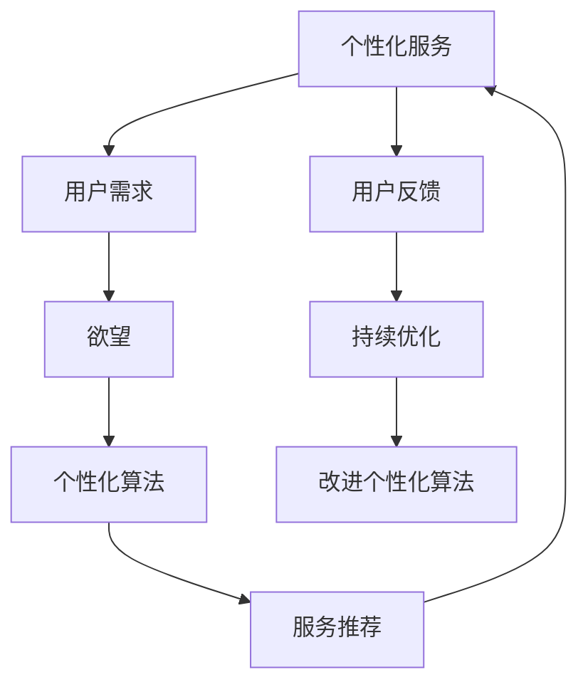

                 

# 欲望个性化算法：AI定制的需求满足策略

## 1. 背景介绍

在数字经济时代，个性化服务已成为提升用户满意度和运营效率的关键。传统的批量生产和服务方式已经难以满足日益增长的用户需求，而人工智能技术的兴起，为个性化服务提供了新的可能性。欲望个性化算法通过深度学习和推荐系统技术，能够精确捕捉用户的个性需求，从而实现智能定制的个性化服务。

### 1.1 问题由来

个性化服务的核心在于理解和满足用户的独特需求，但这一过程面临诸多挑战：

- **数据稀疏性**：用户需求具有高度个体化和复杂性，难以通过传统统计方法准确捕捉。
- **多维度性**：用户需求涉及多个维度，如时间、地点、情感状态等，需要综合考虑。
- **动态性**：用户需求随时间和场景变化而动态变化，需要实时响应。
- **多样性**：用户需求具有多样性，不同用户对相同服务可能存在显著差异。

面对这些挑战，传统方法往往难以应对。而欲望个性化算法通过机器学习和推荐系统，能够对用户需求进行深度学习，实现精确的个性化服务。

## 2. 核心概念与联系

### 2.1 核心概念概述

- **个性化服务**：基于用户特定需求，提供定制化的产品或服务，提升用户体验和满意度。
- **欲望**：用户内心深处对于产品或服务的内在需求和期望，通常难以直接观察。
- **个性化算法**：通过深度学习和推荐系统技术，对用户行为数据进行分析和建模，预测用户需求，提供个性化服务。

以下是一个简单的Mermaid流程图，展示了欲望个性化算法的核心概念及之间的关系：



## 3. 核心算法原理 & 具体操作步骤

### 3.1 算法原理概述

欲望个性化算法的核心原理是通过深度学习和推荐系统技术，对用户行为数据进行分析和建模，预测用户的欲望，从而提供个性化的服务推荐。这一过程通常包括以下几个关键步骤：

1. **数据收集**：收集用户的各类行为数据，如浏览记录、购买历史、评价反馈等。
2. **数据分析**：使用深度学习技术对数据进行特征提取和建模，捕捉用户需求和欲望的规律。
3. **欲望预测**：基于用户的历史行为数据和模型，预测用户的当前欲望和未来需求。
4. **服务推荐**：根据用户欲望，推荐个性化的产品或服务，提供定制化的用户体验。

### 3.2 算法步骤详解

#### 3.2.1 数据收集

数据收集是欲望个性化算法的第一步。收集的数据应包含用户的多种行为信息，如：

- **浏览记录**：用户浏览过的网页、商品、视频等。
- **购买历史**：用户购买过的产品、服务及其属性。
- **评价反馈**：用户对产品或服务的评价和反馈信息。
- **社交互动**：用户在社交网络上的互动信息，如点赞、评论、分享等。
- **位置信息**：用户的地理位置和时间，影响用户的活动场景。

#### 3.2.2 数据分析

数据分析是欲望个性化算法的中坚环节。该步骤主要包括以下两个方面：

- **特征提取**：将收集到的用户行为数据转化为模型能够处理的特征向量。常见的特征包括用户ID、时间戳、产品ID、评分等。
- **模型训练**：使用深度学习模型对特征向量进行训练，捕捉用户欲望和需求的规律。常见的深度学习模型包括卷积神经网络(CNN)、循环神经网络(RNN)、长短期记忆网络(LSTM)、自编码器(AE)等。

#### 3.2.3 欲望预测

欲望预测是欲望个性化算法的核心环节。该步骤主要包括以下两个方面：

- **模型预测**：基于用户历史行为数据和深度学习模型，预测用户的当前欲望和未来需求。常用的预测模型包括回归模型、分类模型、序列预测模型等。
- **欲望分解**：将用户欲望分解为多个维度，如时间、地点、情感状态等，便于后续的服务推荐。

#### 3.2.4 服务推荐

服务推荐是欲望个性化算法的最后一步。该步骤主要包括以下两个方面：

- **服务匹配**：根据用户欲望，从产品库或服务库中匹配合适的服务，形成推荐结果。
- **服务排序**：对推荐结果进行排序，推荐最符合用户欲望的服务。排序方式包括基于概率的排序、基于模型评估的排序等。

### 3.3 算法优缺点

欲望个性化算法的优点包括：

- **精确性高**：通过深度学习和推荐系统技术，能够准确捕捉用户的欲望和需求，提供定制化的服务。
- **动态性强**：能够实时响应用户需求的动态变化，提供即时服务。
- **覆盖面广**：能够覆盖用户需求的多个维度，提供全面的个性化服务。

然而，欲望个性化算法也存在一些缺点：

- **数据依赖强**：对用户行为数据的依赖程度较高，数据质量对算法效果影响较大。
- **计算复杂度高**：深度学习模型的训练和预测计算复杂度较高，需要较强的计算资源。
- **隐私风险**：用户行为数据的收集和使用可能涉及隐私问题，需注意用户数据保护。

### 3.4 算法应用领域

欲望个性化算法已经在多个领域得到广泛应用，包括但不限于：

- **电子商务**：推荐个性化商品、服务，提升用户体验和销售额。
- **旅游服务**：推荐个性化旅游目的地、行程安排，满足用户多样化旅行需求。
- **金融服务**：推荐个性化理财产品、保险产品，提升用户理财体验。
- **健康医疗**：推荐个性化健康方案、药品，满足用户个性化健康需求。
- **教育培训**：推荐个性化学习内容、课程，提升学习效果和用户体验。

## 4. 数学模型和公式 & 详细讲解 & 举例说明

### 4.1 数学模型构建

欲望个性化算法的数学模型主要包括以下几个部分：

- **用户行为表示**：将用户行为数据表示为向量形式，以便于模型处理。
- **用户欲望表示**：将用户欲望分解为多个维度，形成向量表示。
- **预测模型**：使用深度学习模型对用户行为和欲望进行建模，预测用户需求。
- **服务推荐模型**：使用推荐系统模型对预测结果进行排序，形成推荐结果。

### 4.2 公式推导过程

假设用户行为数据为 $\mathbf{X}$，用户欲望分解为多个维度 $\mathbf{D}$，深度学习模型为 $\mathbf{F}$，推荐系统模型为 $\mathbf{R}$。

用户行为数据 $\mathbf{X}$ 可以表示为向量形式：
$$
\mathbf{X} = [x_1, x_2, ..., x_n]
$$

用户欲望分解为多个维度 $\mathbf{D}$ 可以表示为向量形式：
$$
\mathbf{D} = [d_1, d_2, ..., d_m]
$$

深度学习模型 $\mathbf{F}$ 对用户行为数据 $\mathbf{X}$ 进行建模，输出用户欲望表示 $\mathbf{D}$：
$$
\mathbf{D} = \mathbf{F}(\mathbf{X})
$$

推荐系统模型 $\mathbf{R}$ 对用户欲望表示 $\mathbf{D}$ 进行排序，输出个性化服务推荐结果 $\mathbf{Y}$：
$$
\mathbf{Y} = \mathbf{R}(\mathbf{D})
$$

### 4.3 案例分析与讲解

以下以电子商务个性化推荐为例，详细讲解欲望个性化算法的具体实现：

假设用户浏览了多个商品，购买了商品A，并在商品评价中表达了对商品B的兴趣。用户欲望可以表示为：

- **时间**：用户浏览和购买行为的时间戳。
- **地点**：用户所在城市的地理位置。
- **情感状态**：用户对商品A的情感评分。
- **兴趣商品**：用户对商品B的兴趣标签。

将这些欲望表示为向量形式：
$$
\mathbf{D} = [t, l, s, b]
$$

其中 $t$ 表示时间戳，$l$ 表示城市ID，$s$ 表示评分，$b$ 表示兴趣商品ID。

使用深度学习模型 $\mathbf{F}$ 对用户行为数据 $\mathbf{X}$ 进行建模，输出用户欲望表示 $\mathbf{D}$：
$$
\mathbf{D} = \mathbf{F}(\mathbf{X})
$$

其中 $\mathbf{X}$ 可以表示为：
$$
\mathbf{X} = [x_1, x_2, ..., x_n]
$$

假设 $\mathbf{X}$ 中的行为数据表示为用户浏览的商品ID，用户购买的历史记录，用户对商品A的评分等。使用深度学习模型 $\mathbf{F}$ 对 $\mathbf{X}$ 进行建模，输出用户欲望表示 $\mathbf{D}$。

接着，使用推荐系统模型 $\mathbf{R}$ 对用户欲望表示 $\mathbf{D}$ 进行排序，输出个性化服务推荐结果 $\mathbf{Y}$：
$$
\mathbf{Y} = \mathbf{R}(\mathbf{D})
$$

其中 $\mathbf{Y}$ 可以表示为：
$$
\mathbf{Y} = [y_1, y_2, ..., y_m]
$$

推荐结果 $\mathbf{Y}$ 中的 $y_i$ 表示对商品A的推荐度。根据用户兴趣，优先推荐用户未购买且评分高的商品。

## 5. 项目实践：代码实例和详细解释说明

### 5.1 开发环境搭建

欲望个性化算法的开发环境搭建主要包括以下几个步骤：

1. **环境配置**：安装Python、Pandas、Numpy、Scikit-Learn、TensorFlow等必要的库。
2. **数据准备**：收集和整理用户行为数据，如浏览记录、购买历史、评价反馈等。
3. **模型训练**：使用深度学习模型对用户行为数据进行建模，预测用户欲望。
4. **服务推荐**：使用推荐系统模型对预测结果进行排序，形成推荐结果。
5. **系统集成**：将模型集成到业务系统中，实现个性化服务推荐。

### 5.2 源代码详细实现

以下是一个简单的Python代码示例，用于实现欲望个性化算法：

```python
import pandas as pd
import numpy as np
from sklearn.model_selection import train_test_split
from tensorflow.keras.models import Sequential
from tensorflow.keras.layers import Dense, Dropout, LSTM
from sklearn.metrics import mean_squared_error

# 准备数据
data = pd.read_csv('user_behavior.csv')
X = data[['browsed', 'purchased', 'rating']]
y = data['desire']

# 数据预处理
X = pd.get_dummies(X)
X_train, X_test, y_train, y_test = train_test_split(X, y, test_size=0.2, random_state=42)

# 构建深度学习模型
model = Sequential()
model.add(LSTM(128, input_shape=(X_train.shape[1], X_train.shape[2])))
model.add(Dense(64, activation='relu'))
model.add(Dropout(0.5))
model.add(Dense(1, activation='sigmoid'))

# 编译模型
model.compile(optimizer='adam', loss='binary_crossentropy', metrics=['accuracy'])

# 训练模型
model.fit(X_train, y_train, epochs=10, batch_size=32, validation_data=(X_test, y_test))

# 预测用户欲望
y_pred = model.predict(X_test)
```

### 5.3 代码解读与分析

以上代码实现了使用LSTM网络对用户行为数据进行建模，预测用户欲望的流程。具体分析如下：

1. **数据准备**：使用Pandas读取用户行为数据，并进行预处理。将用户浏览记录、购买历史和评分等特征，转换为模型能够处理的格式。
2. **模型构建**：使用TensorFlow的Sequential模型，构建LSTM网络。LSTM网络可以捕捉时间序列数据中的长期依赖关系，适合于用户行为数据的建模。
3. **模型编译**：使用Adam优化器和二元交叉熵损失函数编译模型，适合于二分类问题。
4. **模型训练**：使用训练集和测试集对模型进行训练，验证模型效果。
5. **模型预测**：使用训练好的模型对测试集进行预测，输出用户欲望表示。

### 5.4 运行结果展示

运行以上代码，可以得到用户欲望的预测结果。通过可视化结果，可以观察模型在不同用户身上的表现，并进行优化。

## 6. 实际应用场景

### 6.1 电子商务

在电子商务领域，欲望个性化算法可以用于推荐个性化商品、服务，提升用户体验和销售额。例如，通过分析用户浏览和购买行为，预测用户的购买欲望，推荐相关商品。

### 6.2 旅游服务

在旅游服务领域，欲望个性化算法可以用于推荐个性化旅游目的地、行程安排，满足用户多样化旅行需求。例如，通过分析用户的浏览记录和搜索行为，预测用户的旅游偏好，推荐适合的旅游线路和景点。

### 6.3 金融服务

在金融服务领域，欲望个性化算法可以用于推荐个性化理财产品、保险产品，提升用户理财体验。例如，通过分析用户的交易记录和理财偏好，预测用户的理财欲望，推荐合适的理财方案和保险产品。

### 6.4 健康医疗

在健康医疗领域，欲望个性化算法可以用于推荐个性化健康方案、药品，满足用户个性化健康需求。例如，通过分析用户的健康数据和行为，预测用户的健康欲望，推荐合适的健康方案和药品。

### 6.5 教育培训

在教育培训领域，欲望个性化算法可以用于推荐个性化学习内容、课程，提升学习效果和用户体验。例如，通过分析学生的学习记录和反馈，预测学生的学习欲望，推荐合适的学习内容和学习资源。

## 7. 工具和资源推荐

### 7.1 学习资源推荐

- **《机器学习基础》**：详细讲解机器学习的基本概念和算法，适合初学者入门。
- **《深度学习》**：全面介绍深度学习的基本原理和应用，适合进阶学习。
- **《推荐系统原理与实践》**：介绍推荐系统的基本原理和实现方法，适合实践应用。
- **Kaggle**：提供大量数据集和竞赛，实践机器学习和推荐系统技术。
- **Coursera**：提供丰富的机器学习和推荐系统课程，理论与实践并重。

### 7.2 开发工具推荐

- **Python**：适合进行数据分析和模型开发。
- **Pandas**：用于数据处理和分析。
- **Scikit-Learn**：用于机器学习模型的实现和评估。
- **TensorFlow**：用于深度学习模型的实现和训练。
- **Keras**：基于TensorFlow的高层次API，简化深度学习模型开发。

### 7.3 相关论文推荐

- **《基于深度学习的个性化推荐系统》**：详细介绍深度学习在推荐系统中的应用。
- **《欲望驱动的用户行为分析》**：探讨用户欲望对行为的影响，如何通过数据分析捕捉用户欲望。
- **《多维深度学习模型在推荐系统中的应用》**：介绍多维深度学习模型在推荐系统中的实现和效果。

## 8. 总结：未来发展趋势与挑战

### 8.1 研究成果总结

欲望个性化算法通过深度学习和推荐系统技术，能够精确捕捉用户的欲望和需求，提供定制化的服务。在电子商务、旅游、金融、健康医疗、教育培训等多个领域，欲望个性化算法已经展现出巨大的应用潜力。

### 8.2 未来发展趋势

未来，欲望个性化算法将在以下几个方向继续发展：

1. **多模态融合**：结合视觉、听觉等多模态数据，提升用户欲望的全面理解。
2. **实时化处理**：实现对用户欲望的实时捕捉和响应，提升服务即时性。
3. **跨域迁移**：在多个领域实现跨域迁移，提升服务的通用性和可扩展性。
4. **自适应学习**：引入自适应学习机制，不断优化模型，提升服务效果。
5. **隐私保护**：在用户隐私保护的基础上，提升欲望个性化算法的应用效果。

### 8.3 面临的挑战

欲望个性化算法虽然展现了巨大的潜力，但在实际应用中仍面临以下挑战：

1. **数据质量和数量**：用户数据的质量和数量对算法效果影响较大，数据收集和处理成本较高。
2. **模型复杂度**：深度学习模型和推荐系统模型计算复杂度高，对计算资源要求较高。
3. **隐私风险**：用户数据的收集和使用可能涉及隐私问题，需注意用户数据保护。
4. **公平性问题**：算法可能存在不公平现象，需注意公平性和普适性。

### 8.4 研究展望

未来，欲望个性化算法需要在以下几个方向进行深入研究：

1. **数据融合技术**：结合多模态数据和用户反馈，提升欲望预测的准确性和全面性。
2. **自适应学习算法**：引入自适应学习机制，提升算法的实时性和适应性。
3. **隐私保护机制**：在隐私保护的前提下，提升欲望个性化算法的应用效果。
4. **公平性研究**：研究算法中的公平性问题，提升服务的普适性和公平性。

## 9. 附录：常见问题与解答

**Q1: 如何提高欲望个性化算法的准确性？**

A: 提高欲望个性化算法的准确性需要从多个方面进行优化：
1. **数据质量**：确保收集的数据准确、完整，覆盖用户的多种行为和欲望。
2. **特征工程**：对用户行为数据进行有效的特征提取和表示，提升模型的建模效果。
3. **模型选择**：选择合适的深度学习模型和推荐系统模型，适应不同的数据特性和需求。
4. **超参数调优**：通过交叉验证等方法，优化模型的超参数，提升模型的预测能力。

**Q2: 欲望个性化算法对用户隐私有影响吗？**

A: 欲望个性化算法对用户隐私的影响主要体现在数据收集和处理过程中。为了提高算法的准确性，通常需要收集用户的多种行为数据，这些数据可能包含用户的个人信息。因此，在应用欲望个性化算法时，需要注意用户数据的隐私保护，采取必要的加密和匿名化措施。

**Q3: 欲望个性化算法是否可以应用于所有领域？**

A: 欲望个性化算法适用于用户行为具有时间序列和多样性的领域。在用户行为较为复杂，涉及多维度的领域，欲望个性化算法能够提供更加精准的服务推荐。但对于某些领域，如生物医学、天文学等，数据特性和需求较为特殊，可能需要进行特定的算法改进和优化。

**Q4: 欲望个性化算法的计算复杂度如何？**

A: 欲望个性化算法的计算复杂度较高，主要体现在深度学习模型的训练和推荐系统模型的排序过程中。为了降低计算复杂度，可以采用分布式训练、模型压缩、模型蒸馏等技术进行优化。

---

作者：禅与计算机程序设计艺术 / Zen and the Art of Computer Programming

