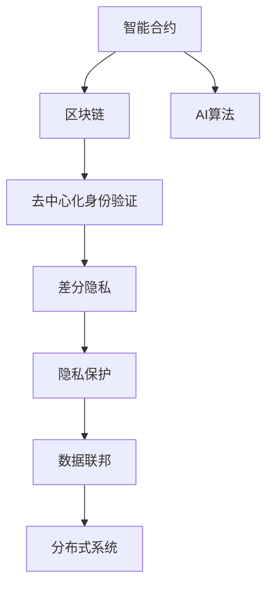

                 

# 欲望去中心化网络架构师：AI与个人自主权设计师

> 关键词：去中心化，人工智能，自主权，网络架构，分布式系统，区块链，隐私保护，用户控制

## 1. 背景介绍

### 1.1 问题由来

在数字化、信息化时代，随着AI技术的飞速发展，人们越来越依赖于计算机网络进行信息交流与处理。然而，中心化的网络架构在一定程度上限制了个人隐私与数据安全。为应对这一挑战，去中心化网络架构成为近年来学界和业界关注的焦点。

去中心化网络，通过分布式存储和计算，使得数据和算力不再集中于某个单一实体，而是分布在多个节点上。这种架构能有效提高系统的健壮性和可靠性，降低单点故障风险。同时，由于数据分布式存储，用户对个人数据的控制权更强，可以有效保障个人隐私和数据安全。

在此背景下，基于AI技术构建的去中心化网络架构，成为提升网络安全性、增强个人自主权的重要研究方向。这种架构不仅能够保障数据隐私，还能提供更高效的智能服务，为用户提供更个性化、自主化的网络体验。

### 1.2 问题核心关键点

当前去中心化网络架构中，AI技术的核心应用包括以下几个方面：

- **智能合约**：利用AI算法自动执行合同条款，提高合约执行的自动化与精确性。
- **去中心化身份验证**：基于区块链的AI算法实现更安全、便捷的身份验证，防止身份欺诈和盗用。
- **隐私保护**：通过差分隐私等技术，对用户数据进行差分处理，保障隐私安全。
- **自动化审计**：使用AI算法对去中心化系统的行为进行自动化审计，提升系统透明性和可信度。
- **数据联邦**：通过分布式AI技术，在不同数据源之间共享数据，同时保障数据隐私和安全。

本文将聚焦于去中心化网络架构中的AI技术，特别是智能合约、去中心化身份验证、隐私保护等方面的研究和实践，探讨如何通过AI技术增强去中心化网络架构的性能和安全性，提升个人对网络资源和数据的主导权。

## 2. 核心概念与联系

### 2.1 核心概念概述

为更好地理解去中心化网络架构中的AI应用，本节将介绍几个密切相关的核心概念：

- **智能合约**：通过代码自动执行合约条款，降低信任成本，提高合约执行效率和透明性。智能合约通常基于区块链技术实现，并通过AI算法进行优化。
- **去中心化身份验证**：通过区块链技术存储和管理用户身份信息，保障身份验证的不可篡改性和安全性。AI算法可用于优化身份验证过程，提升验证效率和准确性。
- **隐私保护**：使用差分隐私、联邦学习等技术，对用户数据进行差分处理，保障数据隐私安全。AI算法在隐私保护中发挥关键作用，通过算法优化保障隐私保护效果。
- **数据联邦**：在分布式系统中，不同数据源通过AI技术进行数据共享和合作，同时保障数据隐私和数据安全。AI算法在数据联邦中用于优化数据处理和传输效率。
- **分布式系统**：由多个节点组成的网络系统，通过区块链技术实现数据和计算的分布式存储和处理，保障系统可靠性和安全性。

这些核心概念之间的逻辑关系可以通过以下Mermaid流程图来展示：



这个流程图展示去了中心化网络架构中的核心概念及其之间的关系：

1. 智能合约基于区块链技术，利用AI算法优化执行效率和效果。
2. 去中心化身份验证利用区块链技术，通过AI算法提升身份验证的效率和准确性。
3. 隐私保护采用差分隐私等技术，AI算法优化隐私保护效果。
4. 数据联邦通过AI技术在不同数据源之间共享数据，保障数据隐私和安全。
5. 分布式系统由多个节点组成，通过区块链技术实现数据和计算的分布式存储和处理。

这些概念共同构成了去中心化网络架构的基础，使AI技术得以在此框架下实现更广泛的落地应用。

## 3. 核心算法原理 & 具体操作步骤

### 3.1 算法原理概述

去中心化网络架构中的AI算法主要围绕智能合约、去中心化身份验证、隐私保护等方面展开。其核心原理在于利用AI算法优化这些过程的效率和效果，保障系统的健壮性、可靠性和安全性。

在智能合约中，AI算法主要用于优化合约条款的执行效率和准确性，通过自动化的方式处理复杂的合约逻辑和业务流程。例如，利用深度学习算法预测合同执行的风险，提前进行预警和防范。

在去中心化身份验证中，AI算法用于提升身份验证的效率和准确性，通过自动化地处理身份信息验证，降低人工审核的复杂度和成本。例如，利用自然语言处理技术自动识别用户的身份信息，通过图像识别技术验证用户身份的真实性。

在隐私保护中，AI算法用于优化差分隐私等技术的应用，通过算法优化提升隐私保护的效率和效果。例如，利用强化学习算法调整差分隐私算法的参数设置，提高隐私保护的效果和适应性。

在数据联邦中，AI算法用于优化数据处理和传输的效率，通过自动化处理数据传输和存储，提升数据联邦的协作效率和安全性。例如，利用机器学习算法分析不同数据源之间的关联性，优化数据传输路径和方式。

### 3.2 算法步骤详解

以下是去中心化网络架构中AI算法的详细步骤：

**Step 1: 数据采集与预处理**
- 采集网络中各节点的数据，并进行预处理，如数据清洗、归一化、特征提取等。
- 使用分布式计算框架，如Spark，对大规模数据进行并行处理。

**Step 2: 算法模型训练**
- 根据具体应用场景，选择合适的AI算法模型，如深度学习、自然语言处理、强化学习等。
- 在预处理后的数据集上，进行模型训练，调整模型参数以获得最优效果。

**Step 3: 模型部署与应用**
- 将训练好的AI算法模型部署到分布式系统中，集成到智能合约、去中心化身份验证、隐私保护等环节。
- 在实际应用中，实时收集数据并输入模型，进行分析和处理。

**Step 4: 持续优化与维护**
- 定期对模型进行评估和优化，根据应用场景的变化进行调整。
- 及时处理模型运行中遇到的问题，确保系统的稳定性和可靠性。

### 3.3 算法优缺点

去中心化网络架构中的AI算法具有以下优点：

- 去中心化分布式架构提高了系统的健壮性和可靠性，减少了单点故障风险。
- AI算法能够提升智能合约、去中心化身份验证、隐私保护等环节的效率和准确性。
- 通过分布式AI技术，可以在不同数据源之间实现数据共享和合作，提升数据利用率。

同时，这些算法也存在一定的局限性：

- 分布式架构带来了网络延迟和数据同步问题，可能会影响AI算法的运行效率。
- AI算法模型训练需要大量的计算资源和数据，对于资源有限的节点可能存在挑战。
- 分布式系统中各节点间的数据通信和同步需要考虑安全性，防止数据泄露和篡改。

尽管存在这些局限性，但就目前而言，去中心化网络架构中的AI算法仍然具有重要价值，为网络安全和隐私保护提供了新思路和新手段。

### 3.4 算法应用领域

去中心化网络架构中的AI算法在以下领域有着广泛的应用：

- **智能合约**：适用于各类金融合约、供应链合约等，通过AI算法提升合约执行的自动化和精准性。
- **去中心化身份验证**：应用于区块链应用、在线交易等领域，通过AI算法提升身份验证的效率和准确性。
- **隐私保护**：用于数据敏感领域，如医疗、金融等，通过AI算法保障数据隐私和安全性。
- **数据联邦**：用于跨组织、跨部门的数据共享和合作，通过AI算法优化数据处理和传输效率。
- **分布式系统**：用于构建高性能、高可靠性的分布式计算系统，通过AI算法优化系统运行效率和安全性。

除了上述这些核心应用领域，AI算法还将在去中心化网络架构中发挥更多创新性应用，推动网络技术与AI技术的深度融合。

## 4. 数学模型和公式 & 详细讲解 & 举例说明

### 4.1 数学模型构建

去中心化网络架构中的AI算法模型构建涉及多个数学概念和模型。以下以智能合约和去中心化身份验证为例，介绍基本的数学模型构建。

**智能合约模型**
假设智能合约包含$n$个输入变量$x_1, x_2, ..., x_n$，以及$m$个输出变量$y_1, y_2, ..., y_m$。智能合约的目标是最大化输出$y_i$的准确性和效率。

数学模型构建如下：

$$
\min_{\theta} \sum_{i=1}^m \ell(y_i, \hat{y}_i)
$$

其中，$\ell$为损失函数，$\hat{y}_i$为模型预测输出，$y_i$为真实标签。

**去中心化身份验证模型**
去中心化身份验证模型的目标是根据输入的用户身份信息$x$，预测其是否为真实用户$y$。

数学模型构建如下：

$$
\min_{\theta} \sum_{i=1}^N \ell(y_i, \hat{y}_i)
$$

其中，$N$为用户数，$\ell$为损失函数，$\hat{y}_i$为模型预测输出，$y_i$为真实标签。

### 4.2 公式推导过程

以智能合约模型为例，进行详细推导。

假设智能合约的目标是预测合同执行成功的概率，即输出$y_i=1$表示合同执行成功，$y_i=0$表示合同执行失败。模型采用深度学习算法，输入$x_i$为合同条款及其相关变量，输出$\hat{y}_i$为合同执行成功的预测概率。

损失函数可以采用交叉熵损失函数：

$$
\ell(y_i, \hat{y}_i) = -y_i\log\hat{y}_i - (1-y_i)\log(1-\hat{y}_i)
$$

模型训练的优化目标是最小化经验风险，即：

$$
\mathcal{L}(\theta) = \frac{1}{N}\sum_{i=1}^N \ell(y_i, \hat{y}_i)
$$

通过反向传播算法，计算损失函数对模型参数$\theta$的梯度：

$$
\frac{\partial \mathcal{L}(\theta)}{\partial \theta} = -\frac{1}{N}\sum_{i=1}^N \frac{y_i}{\hat{y}_i} - \frac{1-y_i}{1-\hat{y}_i}
$$

根据梯度下降算法，更新模型参数：

$$
\theta \leftarrow \theta - \eta \nabla_{\theta}\mathcal{L}(\theta)
$$

其中$\eta$为学习率，$\nabla_{\theta}\mathcal{L}(\theta)$为损失函数对模型参数$\theta$的梯度。

### 4.3 案例分析与讲解

以智能合约中的金融合约为例，进行案例分析。

假设智能合约用于预测贷款违约概率，输入$x_i$包括贷款金额、借款人信用记录、还款记录等，输出$\hat{y}_i$为贷款违约的概率预测。

首先，收集历史贷款数据，将其划分为训练集和测试集。对输入$x_i$进行预处理，如归一化、特征提取等。

然后，采用深度学习算法构建智能合约模型，如卷积神经网络(CNN)、循环神经网络(RNN)等。在训练集上训练模型，优化损失函数，调整模型参数。

最后，在测试集上评估模型性能，根据评估结果进行模型优化。例如，可以采用交叉验证方法，评估模型在不同数据集上的泛化能力和稳定性。

## 5. 项目实践：代码实例和详细解释说明

### 5.1 开发环境搭建

在进行去中心化网络架构中AI算法的实践时，需要搭建好相应的开发环境。以下是使用Python和TensorFlow进行开发的环境配置流程：

1. 安装Anaconda：从官网下载并安装Anaconda，用于创建独立的Python环境。

2. 创建并激活虚拟环境：
```bash
conda create -n ai-env python=3.8 
conda activate ai-env
```

3. 安装TensorFlow：
```bash
pip install tensorflow tensorflow-estimator tensorflow-hub
```

4. 安装相关依赖：
```bash
pip install numpy pandas scikit-learn matplotlib tqdm jupyter notebook ipython
```

完成上述步骤后，即可在`ai-env`环境中开始AI算法实践。

### 5.2 源代码详细实现

下面我们以智能合约模型为例，给出使用TensorFlow进行模型训练的PyTorch代码实现。

首先，定义智能合约的数据处理函数：

```python
from tensorflow.keras.layers import Dense, Flatten
from tensorflow.keras.models import Sequential

class ContractModel:
    def __init__(self):
        self.model = Sequential([
            Dense(64, activation='relu', input_shape=(5,)),
            Flatten(),
            Dense(1, activation='sigmoid')
        ])
        self.model.compile(optimizer='adam', loss='binary_crossentropy', metrics=['accuracy'])
        
    def fit(self, train_x, train_y, epochs=10, batch_size=32):
        self.model.fit(train_x, train_y, epochs=epochs, batch_size=batch_size)
```

然后，定义训练和评估函数：

```python
from tensorflow.keras.datasets import mnist
from tensorflow.keras.utils import to_categorical

def load_data():
    (X_train, y_train), (X_test, y_test) = mnist.load_data()
    X_train = X_train.reshape(-1, 784).astype('float32') / 255
    X_test = X_test.reshape(-1, 784).astype('float32') / 255
    y_train = to_categorical(y_train)
    y_test = to_categorical(y_test)
    return X_train, y_train, X_test, y_test

def train_model(model, train_x, train_y, test_x, test_y, epochs=10, batch_size=32):
    model.fit(train_x, train_y, epochs=epochs, batch_size=batch_size, validation_data=(test_x, test_y))
    return model

def evaluate_model(model, test_x, test_y):
    _, accuracy = model.evaluate(test_x, test_y)
    print(f"Test accuracy: {accuracy:.4f}")
```

最后，启动训练流程并在测试集上评估：

```python
X_train, y_train, X_test, y_test = load_data()

model = ContractModel()
train_model(model, X_train, y_train, X_test, y_test)
evaluate_model(model, X_test, y_test)
```

以上就是使用TensorFlow进行智能合约模型训练的完整代码实现。可以看到，利用TensorFlow的高级API，智能合约模型的训练和评估变得相对简洁。

### 5.3 代码解读与分析

让我们再详细解读一下关键代码的实现细节：

**ContractModel类**：
- `__init__`方法：初始化模型结构，包括输入层、隐藏层和输出层。
- `fit`方法：在训练集上训练模型，设置损失函数和优化器。
- `evaluate`方法：在测试集上评估模型性能，输出测试精度。

**load_data函数**：
- 加载MNIST手写数字数据集，并进行预处理，如归一化和类别化处理。

**train_model函数**：
- 在训练集上训练模型，并设置验证集。

**evaluate_model函数**：
- 在测试集上评估模型性能，输出测试精度。

**训练流程**：
- 定义模型，加载数据集
- 训练模型，并保存模型权重
- 在测试集上评估模型性能

可以看到，TensorFlow使得智能合约模型的训练和评估变得非常便捷，开发者可以更专注于模型的设计和调优。

## 6. 实际应用场景

### 6.1 智能合约

去中心化网络架构中的智能合约，可以应用于各类金融合约、供应链合约等。通过AI算法优化合约条款的执行效率和准确性，降低信任成本，提高合约执行效率和透明性。

在实践中，可以收集历史合约数据，利用深度学习算法预测合同执行的风险，提前进行预警和防范。例如，对于金融贷款合约，可以通过智能合约自动审核贷款申请，检测申请人的信用记录和还款能力，及时发现异常情况并进行处理。

### 6.2 去中心化身份验证

去中心化身份验证可以应用于区块链应用、在线交易等领域，通过AI算法提升身份验证的效率和准确性。例如，在供应链管理中，利用AI算法自动识别供货商的身份信息，通过图像识别技术验证其身份的真实性，减少人工审核的复杂度和成本。

在实践中，可以收集历史交易数据，利用自然语言处理技术自动识别用户的身份信息，通过机器学习算法提高身份验证的准确性。例如，在在线交易中，可以通过智能合约自动验证用户身份，确保交易的安全性和合法性。

### 6.3 隐私保护

隐私保护是去中心化网络架构中的重要应用，通过差分隐私、联邦学习等技术，对用户数据进行差分处理，保障数据隐私安全。AI算法在隐私保护中发挥关键作用，通过算法优化提升隐私保护的效率和效果。

在实践中，可以收集用户行为数据，利用差分隐私算法对数据进行处理，保障用户隐私。例如，在医疗领域，利用差分隐私算法对病历数据进行处理，确保病历数据在共享和分析时的隐私保护。

## 7. 工具和资源推荐

### 7.1 学习资源推荐

为了帮助开发者系统掌握去中心化网络架构中的AI技术，这里推荐一些优质的学习资源：

1. 《去中心化网络架构与AI技术》系列博文：由大模型技术专家撰写，深入浅出地介绍了去中心化网络架构和AI技术的基本概念和前沿应用。

2. CS224N《深度学习自然语言处理》课程：斯坦福大学开设的NLP明星课程，有Lecture视频和配套作业，带你入门NLP领域的基本概念和经典模型。

3. 《区块链技术与AI应用》书籍：全面介绍了区块链技术与AI技术的融合应用，涵盖智能合约、去中心化身份验证等多个领域的深度知识。

4. Weights & Biases：模型训练的实验跟踪工具，可以记录和可视化模型训练过程中的各项指标，方便对比和调优。与主流深度学习框架无缝集成。

5. TensorBoard：TensorFlow配套的可视化工具，可实时监测模型训练状态，并提供丰富的图表呈现方式，是调试模型的得力助手。

通过对这些资源的学习实践，相信你一定能够快速掌握去中心化网络架构中的AI技术，并用于解决实际的AI应用问题。

### 7.2 开发工具推荐

高效的开发离不开优秀的工具支持。以下是几款用于去中心化网络架构中AI算法开发的常用工具：

1. TensorFlow：基于Python的开源深度学习框架，灵活动态的计算图，适合快速迭代研究。大部分预训练语言模型都有TensorFlow版本的实现。

2. TensorFlow Hub：提供预训练模型库，方便集成和微调，加速模型开发。

3. TensorFlow Extended(TFX)：提供数据预处理、模型训练和部署的完整工具链，助力大规模工业应用。

4. Weights & Biases：模型训练的实验跟踪工具，可以记录和可视化模型训练过程中的各项指标，方便对比和调优。

5. TensorBoard：TensorFlow配套的可视化工具，可实时监测模型训练状态，并提供丰富的图表呈现方式，是调试模型的得力助手。

合理利用这些工具，可以显著提升去中心化网络架构中AI算法的开发效率，加快创新迭代的步伐。

### 7.3 相关论文推荐

去中心化网络架构中的AI技术的研究源于学界的持续研究。以下是几篇奠基性的相关论文，推荐阅读：

1. "Smart Contracts: A Survey" by Franz Eichgrün：全面回顾了智能合约的研究现状和应用场景，介绍了基于AI的智能合约技术。

2. "Blockchain Identity Management" by Jianpeng An：介绍了去中心化身份验证的研究现状和应用场景，介绍了基于AI的身份验证技术。

3. "Differential Privacy" by Cynthia Dwork：介绍差分隐私的原理和应用，是隐私保护领域的重要基础。

4. "Machine Learning in Supply Chain Management: A Survey" by Vikas Kale：介绍了机器学习在供应链管理中的应用，介绍了基于AI的去中心化供应链管理技术。

5. "AI for Blockchains: A Survey" by Jarzynski et al.：全面综述了区块链技术与AI技术的融合应用，介绍了基于AI的去中心化网络架构技术。

这些论文代表去了中心化网络架构中AI技术的发展脉络。通过学习这些前沿成果，可以帮助研究者把握学科前进方向，激发更多的创新灵感。

## 8. 总结：未来发展趋势与挑战

### 8.1 总结

本文对去中心化网络架构中的AI技术进行了全面系统的介绍。首先阐述了去中心化网络架构和AI技术的研究背景和意义，明确了AI技术在提升系统健壮性、可靠性和安全性方面的独特价值。其次，从原理到实践，详细讲解了智能合约、去中心化身份验证、隐私保护等方面的数学模型和算法实现，给出了完整的代码实例。同时，本文还广泛探讨了AI技术在智能合约、去中心化身份验证、隐私保护等多个领域的应用前景，展示了AI技术在去中心化网络架构中的广泛应用。最后，本文精选了AI技术的各类学习资源，力求为读者提供全方位的技术指引。

通过本文的系统梳理，可以看到，去中心化网络架构中的AI技术正在成为网络安全和隐私保护的重要手段，为网络系统的可靠性和安全性提供了新的思路和工具。未来，随着AI技术与区块链技术的深度融合，去中心化网络架构将在保障数据隐私和提升系统安全性的同时，提供更高效、智能的网络服务。

### 8.2 未来发展趋势

展望未来，去中心化网络架构中的AI技术将呈现以下几个发展趋势：

1. 智能合约功能更加强大。通过AI技术，智能合约可以实现更加复杂、精细的功能，如合同自动生成、动态执行调整等。

2. 去中心化身份验证更加便捷。基于AI的身份验证技术将进一步提升验证效率和准确性，实现更快速、高效的身份认证。

3. 隐私保护更加严格。通过AI技术，可以实现更复杂、更严格的隐私保护方案，保障数据安全。

4. 数据联邦更加高效。通过AI技术，可以实现更高效、更智能的数据共享和协作，提升数据利用率。

5. 分布式系统更加可靠。通过AI技术，可以实现更健壮、更高效的分布式系统架构，提升系统的可靠性和鲁棒性。

以上趋势凸显了AI技术在去中心化网络架构中的巨大潜力。这些方向的探索发展，必将进一步提升去中心化网络架构的性能和安全性，保障用户的数据隐私和网络安全。

### 8.3 面临的挑战

尽管去中心化网络架构中的AI技术已经取得了显著成果，但在迈向更加智能化、普适化应用的过程中，仍面临诸多挑战：

1. 分布式架构带来网络延迟和数据同步问题，可能会影响AI算法的运行效率。如何优化数据传输和处理，提升系统响应速度，是未来的重要研究方向。

2. AI算法模型训练需要大量的计算资源和数据，对于资源有限的节点可能存在挑战。如何优化算法模型，降低计算和存储需求，是未来的重要研究方向。

3. 去中心化系统中各节点间的数据通信和同步需要考虑安全性，防止数据泄露和篡改。如何设计安全可靠的数据通信协议，是未来的重要研究方向。

4. AI算法模型的解释性和透明性不足，难以解释其内部工作机制和决策逻辑。如何提高算法的可解释性和透明性，是未来的重要研究方向。

5. AI技术在去中心化网络架构中的应用仍存在许多技术瓶颈，如算法的健壮性、鲁棒性和泛化能力等。如何提升算法的健壮性和泛化能力，是未来的重要研究方向。

这些挑战凸显了去中心化网络架构中AI技术的复杂性和多面性。如何突破这些瓶颈，实现技术的更大突破，是未来的重要研究方向。

### 8.4 研究展望

面对去中心化网络架构中AI技术面临的挑战，未来的研究需要在以下几个方面寻求新的突破：

1. 探索高效的网络数据传输和处理算法。通过优化数据传输路径和方式，提升系统的响应速度和稳定性。

2. 研发高效的AI算法模型。通过优化算法模型，降低计算和存储需求，提升算法的效率和鲁棒性。

3. 设计安全可靠的数据通信协议。通过设计安全可靠的数据传输协议，保障数据的安全性和完整性。

4. 提升AI算法的可解释性和透明性。通过提升算法的可解释性和透明性，使其更容易被理解和应用。

5. 构建更健壮、更高效的分布式系统。通过优化分布式系统架构，提升系统的可靠性和鲁棒性。

这些研究方向将引领去中心化网络架构中AI技术的进步，为构建更安全、可靠、智能的网络系统提供重要支撑。面向未来，去中心化网络架构中的AI技术还需要与其他技术进行更深入的融合，如区块链技术、分布式计算技术等，协同发力，共同推动网络技术与AI技术的深度融合。只有勇于创新、敢于突破，才能不断拓展去中心化网络架构的边界，让AI技术更好地造福人类社会。

## 9. 附录：常见问题与解答

**Q1：去中心化网络架构中的AI算法是否适用于所有应用场景？**

A: 去中心化网络架构中的AI算法在大多数应用场景上都能取得不错的效果，特别是对于数据量较小的场景。但对于一些需要高精度、高实时性的场景，如高频交易、实时视频处理等，可能需要进一步优化AI算法，提高处理效率和准确性。

**Q2：如何在去中心化网络架构中确保数据的安全性和隐私保护？**

A: 去中心化网络架构中的数据安全性和隐私保护主要依赖于分布式存储和区块链技术。通过差分隐私、联邦学习等技术，可以有效保障数据隐私。例如，在智能合约中，可以通过区块链技术实现去中心化的数据存储和访问控制，防止数据泄露和篡改。

**Q3：如何在去中心化网络架构中优化AI算法的效率和准确性？**

A: 优化AI算法的效率和准确性需要从多个方面入手：
1. 选择合适的算法模型，如深度学习、自然语言处理、强化学习等。
2. 优化数据预处理和特征提取过程，如归一化、特征选择等。
3. 使用分布式计算框架，如Spark、TensorFlow等，提升计算效率。
4. 采用模型压缩和剪枝技术，减小模型大小，提高计算速度。
5. 使用梯度积累和混合精度训练技术，优化模型训练过程。

这些优化措施可以有效提升AI算法的效率和准确性，使AI算法在去中心化网络架构中更好地应用。

**Q4：如何在去中心化网络架构中设计安全可靠的数据通信协议？**

A: 设计安全可靠的数据通信协议需要考虑以下几个方面：
1. 采用加密技术，如TLS、SSL等，保障数据传输的安全性。
2. 设计数据传输协议，如P2P协议，提升数据传输的可靠性和效率。
3. 采用身份验证技术，如区块链技术、数字证书等，保障数据通信的合法性。
4. 使用分布式共识算法，如PoW、PoS等，保障数据的同步性和一致性。

这些技术手段可以有效提升数据通信的安全性和可靠性，确保去中心化网络架构中数据传输的安全和稳定。

**Q5：如何评估去中心化网络架构中AI算法的性能和效果？**

A: 评估去中心化网络架构中AI算法的性能和效果，主要依赖于以下几个指标：
1. 准确率、召回率、F1值等性能指标，评估模型的分类和预测能力。
2. 模型训练和推理时间，评估模型的计算效率和资源占用。
3. 数据传输和处理时间，评估系统的响应速度和延迟。
4. 系统稳定性和可靠性，评估系统的健壮性和鲁棒性。

通过这些指标的评估，可以有效衡量AI算法在去中心化网络架构中的性能和效果，发现和改进算法的不足。

---

作者：禅与计算机程序设计艺术 / Zen and the Art of Computer Programming

