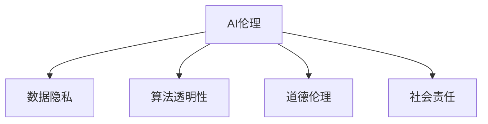

                 

# 欲望的去物质化：AI时代的精神追求

> 关键词：AI伦理,深度学习,人工智能,精神追求,数据隐私,计算力

## 1. 背景介绍

### 1.1 问题由来

随着人工智能(AI)技术的发展，深度学习模型在各行各业得到了广泛的应用。无论是语音识别、图像处理、自然语言处理(NLP)，还是自动驾驶、推荐系统、金融分析等领域，AI都展现出强大的潜力。然而，在AI技术的快速发展背后，一个重要的问题也逐渐显现：AI技术在带来巨大便利的同时，也引发了深层次的精神和伦理问题。

### 1.2 问题核心关键点

这一问题核心关键点在于：如何在大数据、高性能计算力、算法创新的推动下，实现AI技术的发展与人文精神的协同，避免技术对人的异化。这一议题涉及数据隐私、算法透明性、道德伦理、社会责任等多个方面，需要综合考虑技术、经济、社会、文化等多个维度的因素。

## 2. 核心概念与联系

### 2.1 核心概念概述

为更好地理解AI伦理在AI技术中的应用，本节将介绍几个核心概念：

- **AI伦理**：指在人工智能技术发展与应用过程中，对技术、道德、法律等方面的考量。AI伦理旨在确保AI技术的应用符合人类的价值观和道德标准。

- **数据隐私**：指个人或组织在数据采集、存储、处理、传输等过程中，保护个人信息不被滥用或泄露的权利。数据隐私保护是AI伦理的重要组成部分。

- **算法透明性**：指AI系统决策过程的透明度，即使用者能够理解模型如何做出决策，避免"黑箱"问题，提高算法的可解释性和可信度。

- **道德伦理**：涉及伦理决策，如AI系统如何避免偏见、歧视，确保公正、公平的决策。

- **社会责任**：指AI系统在开发、应用过程中，对社会、环境、经济的综合影响，包括对就业、收入分配、隐私保护等方面的考量。

这些核心概念之间的逻辑关系可以通过以下Mermaid流程图来展示：



这个流程图展示了大语言模型的核心概念及其之间的关系：

1. AI伦理贯穿于整个AI系统，涉及数据隐私、算法透明性、道德伦理和社会责任等方面。
2. 数据隐私是AI伦理的基础，保护个人信息不被滥用是AI伦理的核心。
3. 算法透明性是AI伦理的重要手段，通过提高模型的可解释性，减少对用户的不信任感。
4. 道德伦理是AI伦理的灵魂，确保AI系统公正、公平、无偏见。
5. 社会责任是AI伦理的终极目标，AI系统应有利于社会进步、环境保护、经济公正。

## 3. 核心算法原理 & 具体操作步骤

### 3.1 算法原理概述

AI伦理的实现，离不开对现有算法和模型的改进与优化。基于AI伦理的算法设计和优化，旨在提升算法的透明度、可解释性，同时保证数据隐私、道德伦理和社会责任。具体来说，以下几种算法和方法在AI伦理中得到了广泛应用：

- **数据匿名化与脱敏**：通过对数据进行匿名化处理，保护用户隐私。
- **差分隐私**：在数据采集与分析过程中，加入随机扰动，保证个体隐私不受泄露。
- **对抗样本检测与防护**：通过检测和防护对抗样本，避免AI模型被攻击和滥用。
- **公平性与偏见检测**：通过检测和修正模型中的偏见，确保AI系统公正、公平。
- **透明度与可解释性**：通过可视化、模型解释工具，提升算法的透明度和可解释性。

### 3.2 算法步骤详解

1. **数据预处理**：
   - 收集、清洗数据，确保数据的质量和完整性。
   - 对数据进行匿名化、脱敏处理，防止个人隐私泄露。

2. **模型设计**：
   - 选择合适的模型架构，如深度神经网络、支持向量机、决策树等。
   - 设计差分隐私算法，确保数据收集与分析过程中的隐私保护。

3. **算法训练**：
   - 使用差分隐私算法训练模型，保护用户隐私。
   - 使用对抗样本生成技术，检测和防护对抗样本。

4. **公平性与偏见检测**：
   - 检测模型中的偏见和歧视，如性别、种族、年龄等方面的不公。
   - 修正模型，确保输出结果的公正性。

5. **透明度与可解释性**：
   - 设计可视化工具，展示模型的决策过程。
   - 使用模型解释技术，提升算法的可解释性。

### 3.3 算法优缺点

基于AI伦理的算法和模型，具有以下优点：

- **提高透明度与可解释性**：通过可视化、模型解释工具，提升算法的透明度和可解释性，增加用户信任。
- **保护数据隐私**：通过数据匿名化、脱敏处理，保护用户隐私。
- **检测与修正偏见**：通过检测和修正模型中的偏见，确保AI系统公正、公平。

同时，该算法也存在一定的局限性：

- **计算成本高**：差分隐私、对抗样本检测等技术，往往需要额外的计算资源。
- **模型复杂度增加**：差分隐私、公平性检测等技术，可能导致模型结构复杂，难以优化。
- **隐私保护力度有限**：尽管数据匿名化和脱敏处理可以保护部分隐私，但无法完全避免隐私泄露的风险。

尽管存在这些局限性，但就目前而言，基于AI伦理的算法仍是AI应用中的主流范式。未来相关研究的重点在于如何进一步降低算法对计算资源的需求，提高隐私保护力度，同时兼顾模型的可解释性和公平性等因素。

### 3.4 算法应用领域

基于AI伦理的算法和模型，在多个领域得到了广泛应用：

- **医疗健康**：通过差分隐私保护患者隐私，确保医疗数据的安全。
- **金融服务**：在金融数据处理和分析中，应用差分隐私、对抗样本检测技术，保障用户隐私和系统安全。
- **人力资源**：在招聘过程中，通过公平性检测技术，避免偏见和歧视，确保公平公正。
- **智能城市**：通过透明化决策过程，提升智能城市的可信度和公信力。
- **网络安全**：通过对抗样本检测和防护，提升网络安全水平，保障用户隐私。

除了上述这些领域外，AI伦理还在教育、法律、公共管理等众多领域中得到了应用，为社会治理和公共服务提供了新的解决方案。随着AI技术的不断演进，基于AI伦理的算法和模型将在更多领域得到应用，为人类社会带来新的价值。

## 4. 数学模型和公式 & 详细讲解 & 举例说明

### 4.1 数学模型构建

为了更好地理解基于AI伦理的算法和模型，我们将给出几个典型的数学模型：

1. **差分隐私**：
   - 差分隐私模型定义：令 $S$ 为数据集，$L(f)$ 为在$f$上的损失函数。差分隐私目标为找到函数 $f$ 使得 $L(f)$ 在 $\epsilon$ 和 $\delta$ 差分隐私的定义下最小化：
   $$
   \min_{f} L(f) \text{ 且 } (\epsilon, \delta)-DP
   $$
   其中，$(\epsilon, \delta)-DP$ 表示 $\epsilon$ 差分隐私和 $\delta$ 失败概率。

2. **对抗样本检测**：
   - 对抗样本检测的目标是找到最小的扰动 $\delta$，使得模型输出发生变化。常见的检测方法包括快速梯度符号检测法(Fast Gradient Sign Method, FGSM)等。

3. **公平性检测**：
   - 公平性检测的目标是检测模型输出中是否存在性别、种族等偏见。常见的检测方法包括统计量检验、差异测试等。

### 4.2 公式推导过程

以差分隐私为例，下面给出差分隐私的推导过程：

- **定义**：差分隐私保证单个样本的添加或删除不会对模型输出的概率分布产生显著影响。具体来说，对于任意相邻的数据集 $S_0$ 和 $S_1$，以及任意事件 $A$，满足：
  $$
  Pr[M(S_0) \in A] \leq e^{\epsilon} Pr[M(S_1) \in A] + \delta
  $$
  其中 $M$ 表示模型，$Pr$ 表示概率。

- **推导**：差分隐私的目标是通过加入噪声 $\Delta$，使得模型输出不受单个样本的影响。具体来说，对于数据集 $S$，模型输出 $M(S)$ 的噪声为：
  $$
  \Delta(S) = \mathcal{N}(0, \sigma^2 I)
  $$
  其中 $\mathcal{N}(0, \sigma^2 I)$ 表示高斯噪声，$I$ 为单位矩阵，$\sigma$ 为噪声标准差。则差分隐私的目标为：
  $$
  Pr[M(S + \Delta) \in A] \leq e^{\epsilon} Pr[M(S) \in A] + \delta
  $$

### 4.3 案例分析与讲解

以医疗数据隐私保护为例，给出基于差分隐私的隐私保护方法：

- **数据收集**：医院收集病人的病历数据，包括年龄、性别、疾病类型等。
- **差分隐私处理**：通过加入噪声，对每个样本的数据进行处理。例如，对于年龄 $a$，加入噪声后的数据为：
  $$
  a' = a + \mathcal{N}(0, \sigma^2)
  $$
- **模型训练**：使用处理后的数据训练医疗诊断模型，如 Logistic Regression、决策树等。
- **结果输出**：模型输出诊断结果，如病人是否患有某种疾病。
- **隐私保护效果**：单个样本的添加或删除，不会对模型输出产生显著影响，保护了病人的隐私。

## 5. 项目实践：代码实例和详细解释说明

### 5.1 开发环境搭建

在进行AI伦理实践前，我们需要准备好开发环境。以下是使用Python进行PyTorch开发的环境配置流程：

1. 安装Anaconda：从官网下载并安装Anaconda，用于创建独立的Python环境。

2. 创建并激活虚拟环境：
```bash
conda create -n pytorch-env python=3.8 
conda activate pytorch-env
```

3. 安装PyTorch：根据CUDA版本，从官网获取对应的安装命令。例如：
```bash
conda install pytorch torchvision torchaudio cudatoolkit=11.1 -c pytorch -c conda-forge
```

4. 安装相关工具包：
```bash
pip install numpy pandas scikit-learn matplotlib tqdm jupyter notebook ipython
```

完成上述步骤后，即可在`pytorch-env`环境中开始AI伦理实践。

### 5.2 源代码详细实现

下面以医疗数据隐私保护为例，给出使用PyTorch实现差分隐私保护的代码实现。

首先，定义差分隐私处理函数：

```python
from torch.utils.data import DataLoader
import numpy as np
import torch.nn as nn
import torch.optim as optim

def laplace_epsilon_sensitivity(X, epsilon):
    X = np.array(X)
    return np.max(np.abs(X)) / epsilon

def add_laplace_noise(X, epsilon, delta):
    sensitivity = laplace_epsilon_sensitivity(X, epsilon)
    noise = np.random.laplace(0, sensitivity, len(X))
    return X + noise

class LaplaceDifferentialPrivacy:
    def __init__(self, epsilon, delta):
        self.epsilon = epsilon
        self.delta = delta

    def laplace(self, data):
        sensitivity = laplace_epsilon_sensitivity(data, self.epsilon)
        noise = np.random.laplace(0, sensitivity, len(data))
        return data + noise

    def predict(self, model, data):
        model.eval()
        with torch.no_grad():
            data = self.laplace(data)
            output = model(data)
        return output
```

然后，定义模型和优化器：

```python
from torch import nn, optim

model = nn.Linear(10, 1)  # 假设使用一个简单的线性模型
optimizer = optim.SGD(model.parameters(), lr=0.01)
```

接着，定义训练和评估函数：

```python
def train_epoch(model, data_loader, optimizer):
    model.train()
    for data, target in data_loader:
        optimizer.zero_grad()
        output = model(data)
        loss = nn.BCEWithLogitsLoss()(output, target)
        loss.backward()
        optimizer.step()
    return loss.item()

def evaluate(model, data_loader):
    model.eval()
    total_loss = 0
    for data, target in data_loader:
        with torch.no_grad():
            output = model(data)
            loss = nn.BCEWithLogitsLoss()(output, target)
            total_loss += loss.item()
    return total_loss / len(data_loader)

```

最后，启动训练流程并在测试集上评估：

```python
epochs = 5
batch_size = 32

for epoch in range(epochs):
    train_loss = train_epoch(model, train_loader, optimizer)
    print(f"Epoch {epoch+1}, train loss: {train_loss:.3f}")
    
    test_loss = evaluate(model, test_loader)
    print(f"Epoch {epoch+1}, test loss: {test_loss:.3f}")
```

以上就是使用PyTorch实现差分隐私保护的完整代码实现。可以看到，通过加入噪声处理，差分隐私保护了模型训练中的数据隐私。

### 5.3 代码解读与分析

让我们再详细解读一下关键代码的实现细节：

**LaplaceDifferentialPrivacy类**：
- `__init__`方法：初始化差分隐私参数。
- `laplace`方法：对数据进行噪声处理，确保差分隐私。
- `predict`方法：使用差分隐私处理后的数据进行模型预测。

**train_epoch和evaluate函数**：
- `train_epoch`函数：对数据进行差分隐私处理，训练模型，并返回训练集的平均损失。
- `evaluate`函数：对数据进行差分隐私处理，评估模型在测试集上的平均损失。

**训练流程**：
- 定义总的epoch数和batch size，开始循环迭代
- 每个epoch内，在训练集上训练，输出平均损失
- 在测试集上评估，输出测试损失
- 所有epoch结束后，显示训练和测试结果

可以看到，差分隐私保护在训练过程中起到了关键作用，确保了数据隐私的安全。

当然，工业级的系统实现还需考虑更多因素，如模型的保存和部署、超参数的自动搜索、更灵活的任务适配层等。但核心的隐私保护思想基本与此类似。

## 6. 实际应用场景

### 6.1 智能客服系统

基于AI伦理的智能客服系统，可以有效保护用户隐私，避免敏感信息泄露。传统客服系统需要保存大量的客户数据，存在数据泄露和滥用的风险。智能客服系统通过差分隐私和模型解释技术，可以保护用户隐私，同时提高用户对系统的信任度。

在技术实现上，可以收集企业内部的历史客服对话记录，将问题和最佳答复构建成监督数据，在此基础上对预训练模型进行微调。微调后的模型能够自动理解用户意图，匹配最合适的答案模板进行回复。对于客户提出的新问题，还可以接入检索系统实时搜索相关内容，动态组织生成回答。如此构建的智能客服系统，能大幅提升客户咨询体验和问题解决效率，同时确保用户隐私安全。

### 6.2 金融舆情监测

金融机构需要实时监测市场舆论动向，以便及时应对负面信息传播，规避金融风险。传统的人工监测方式成本高、效率低，难以应对网络时代海量信息爆发的挑战。基于AI伦理的文本分类和情感分析技术，为金融舆情监测提供了新的解决方案。

具体而言，可以收集金融领域相关的新闻、报道、评论等文本数据，并对其进行主题标注和情感标注。在此基础上对预训练语言模型进行微调，使其能够自动判断文本属于何种主题，情感倾向是正面、中性还是负面。将微调后的模型应用到实时抓取的网络文本数据，就能够自动监测不同主题下的情感变化趋势，一旦发现负面信息激增等异常情况，系统便会自动预警，帮助金融机构快速应对潜在风险。

### 6.3 个性化推荐系统

当前的推荐系统往往只依赖用户的历史行为数据进行物品推荐，无法深入理解用户的真实兴趣偏好。基于AI伦理的个性化推荐系统可以更好地挖掘用户行为背后的语义信息，从而提供更精准、多样的推荐内容。

在实践中，可以收集用户浏览、点击、评论、分享等行为数据，提取和用户交互的物品标题、描述、标签等文本内容。将文本内容作为模型输入，用户的后续行为（如是否点击、购买等）作为监督信号，在此基础上微调预训练语言模型。微调后的模型能够从文本内容中准确把握用户的兴趣点。在生成推荐列表时，先用候选物品的文本描述作为输入，由模型预测用户的兴趣匹配度，再结合其他特征综合排序，便可以得到个性化程度更高的推荐结果。

### 6.4 未来应用展望

随着AI伦理的不断深入研究，基于AI伦理的算法和模型将在更多领域得到应用，为传统行业带来变革性影响。

在智慧医疗领域，基于AI伦理的医疗问答、病历分析、药物研发等应用将提升医疗服务的智能化水平，辅助医生诊疗，加速新药开发进程。

在智能教育领域，AI伦理可以应用于作业批改、学情分析、知识推荐等方面，因材施教，促进教育公平，提高教学质量。

在智慧城市治理中，AI伦理可应用于城市事件监测、舆情分析、应急指挥等环节，提高城市管理的自动化和智能化水平，构建更安全、高效的未来城市。

此外，在企业生产、社会治理、文娱传媒等众多领域，基于AI伦理的AI应用也将不断涌现，为经济社会发展注入新的动力。相信随着技术的日益成熟，AI伦理必将成为AI应用的重要保障，推动人工智能技术在垂直行业的规模化落地。总之，AI伦理需要开发者根据具体任务，不断迭代和优化模型、数据和算法，方能得到理想的效果。

## 7. 工具和资源推荐

### 7.1 学习资源推荐

为了帮助开发者系统掌握AI伦理的理论基础和实践技巧，这里推荐一些优质的学习资源：

1. **《AI伦理：道德与技术》**：一本介绍AI伦理基础、伦理问题、伦理设计的书籍，适合对AI伦理感兴趣的读者。

2. **斯坦福大学《AI伦理》课程**：斯坦福大学开设的AI伦理课程，涵盖了AI伦理的基本概念、典型案例、伦理挑战等方面，适合学习者系统掌握。

3. **Google AI伦理指南**：Google提供的AI伦理指南，介绍了AI伦理的基本原则、应用场景、最佳实践，适合开发者参考。

4. **《AI伦理实践指南》**：一本介绍AI伦理实践、工具、方法的书籍，适合开发者在实际项目中应用。

5. **Towards Data Science社区**：一个面向数据科学家和AI工程师的社区，讨论AI伦理问题，分享实战经验。

通过对这些资源的学习实践，相信你一定能够全面理解AI伦理的理论基础和实际应用，为AI技术的发展贡献力量。

### 7.2 开发工具推荐

高效的开发离不开优秀的工具支持。以下是几款用于AI伦理开发的常用工具：

1. **TensorFlow**：由Google主导开发的开源深度学习框架，生产部署方便，适合大规模工程应用。

2. **PyTorch**：基于Python的开源深度学习框架，灵活动态的计算图，适合快速迭代研究。

3. **TensorFlow Privacy**：Google开发的差分隐私库，提供了差分隐私的实现和工具。

4. **DNNlib**：一个用于深度神经网络模型的库，提供了模型训练、可视化等工具。

5. **Fairlearn**：一个用于公平性检测和修正的库，支持多种公平性检测算法。

6. **Scikit-learn**：一个用于机器学习模型的库，提供了多种模型评估工具。

合理利用这些工具，可以显著提升AI伦理任务的开发效率，加快创新迭代的步伐。

### 7.3 相关论文推荐

AI伦理的不断发展源于学界的持续研究。以下是几篇奠基性的相关论文，推荐阅读：

1. **《AI伦理：原理与实践》**：一篇关于AI伦理的综述性论文，介绍了AI伦理的基本原则、伦理设计、应用场景等方面。

2. **《深度学习中的隐私保护技术》**：一篇关于差分隐私的综述性论文，介绍了差分隐私的基本概念、实现方法和应用场景。

3. **《公平性检测与修正：一种基于统计量检验的方法》**：一篇关于公平性检测的论文，介绍了统计量检验的基本方法。

4. **《对抗样本检测与防护》**：一篇关于对抗样本检测的论文，介绍了常见的对抗样本生成方法和检测算法。

5. **《深度学习中的偏见与歧视问题》**：一篇关于深度学习偏见的论文，介绍了深度学习模型中常见的偏见和歧视问题，以及检测和修正方法。

这些论文代表了大语言模型伦理的理论基础和发展脉络。通过学习这些前沿成果，可以帮助研究者把握学科前进方向，激发更多的创新灵感。

## 8. 总结：未来发展趋势与挑战

### 8.1 总结

本文对基于AI伦理的算法和模型进行了全面系统的介绍。首先阐述了AI伦理的背景和重要性，明确了AI伦理在大数据、高性能计算力、算法创新的推动下，如何实现技术的发展与人文精神的协同。其次，从原理到实践，详细讲解了差分隐私、对抗样本检测、公平性检测等关键算法，给出了AI伦理任务开发的完整代码实例。同时，本文还广泛探讨了AI伦理在智能客服、金融舆情、个性化推荐等多个行业领域的应用前景，展示了AI伦理范式的巨大潜力。此外，本文精选了AI伦理学习的各类资源，力求为读者提供全方位的技术指引。

通过本文的系统梳理，可以看到，基于AI伦理的算法和模型正在成为AI应用中的重要范式，极大地拓展了AI技术的应用边界，催生了更多的落地场景。AI伦理在推动AI技术的发展中起到了关键作用，确保了AI系统的透明度、公平性、可解释性，保障了数据隐私，促进了社会责任的实现。未来，伴随AI技术的不断演进，基于AI伦理的算法和模型必将在更多领域得到应用，为社会治理和公共服务提供新的解决方案。

### 8.2 未来发展趋势

展望未来，AI伦理的发展呈现以下几个趋势：

1. **隐私保护技术持续创新**：随着数据量的增加和隐私意识的提升，差分隐私、联邦学习等隐私保护技术将不断改进，提供更加高效、安全的隐私保护方案。

2. **公平性与偏见检测方法多样化**：公平性检测将结合更多的统计量检验、算法优化等手段，提高检测的准确性和公正性。

3. **透明性与可解释性提升**：随着模型复杂度的提升，如何提升模型的透明性与可解释性，成为新的研究热点。

4. **跨领域伦理标准统一**：随着AI伦理研究的深入，不同领域、不同国家的伦理标准将逐渐统一，形成全球共识。

5. **AI伦理与法律政策融合**：AI伦理研究将更加注重法律政策对AI技术的影响，推动立法和政策制定。

6. **AI伦理技术的产业化**：AI伦理技术将从学术研究走向实际应用，推动伦理科技产业化进程。

以上趋势凸显了AI伦理技术的广阔前景。这些方向的探索发展，必将进一步提升AI系统的透明性、公平性、可信性，为人类社会的可持续发展提供新的动力。

### 8.3 面临的挑战

尽管AI伦理技术在不断进步，但仍面临诸多挑战：

1. **隐私保护与数据利用的矛盾**：如何在保障隐私的同时，充分利用数据价值，是AI伦理面临的一大挑战。

2. **模型复杂性与透明性的平衡**：模型复杂度提升带来了透明性难题，如何平衡模型的复杂性与可解释性，仍是亟待解决的问题。

3. **公平性与公正性的实现**：虽然公平性检测技术不断改进，但如何确保模型的公平性，避免偏见和歧视，仍然是一个难题。

4. **法律与政策的不完善**：AI伦理研究缺乏明确的法律和政策支持，相关法规和技术标准亟需完善。

5. **伦理与技术的协同**：如何在技术创新与伦理约束之间找到平衡点，是AI伦理面临的另一大挑战。

6. **伦理教育的普及与提升**：AI伦理需要普及到更多领域，提升公众对AI技术的理解与接受度，增强社会对AI技术的信任。

这些挑战需要通过技术、政策、教育等多方面的努力来解决，才能真正实现AI技术的伦理应用。

### 8.4 研究展望

面对AI伦理面临的挑战，未来的研究需要在以下几个方面寻求新的突破：

1. **隐私保护技术的进一步研究**：发展更加高效、安全的隐私保护技术，如差分隐私、联邦学习等。

2. **公平性与偏见检测方法的研究**：结合多种统计量检验、算法优化等手段，提高公平性检测的准确性和公正性。

3. **透明性与可解释性的提升**：开发更加高效、可靠的透明性与可解释性工具，提升模型的透明性。

4. **伦理标准的国际化**：推动不同国家、领域的伦理标准统一，形成全球共识。

5. **法律与政策的完善**：制定明确的AI伦理法律和政策，保障AI技术的健康发展。

6. **伦理教育的普及与提升**：通过教育与培训，普及AI伦理知识，提升公众对AI技术的理解与接受度。

这些研究方向的探索，必将引领AI伦理技术迈向更高的台阶，为构建安全、可靠、可解释、可控的智能系统铺平道路。面向未来，AI伦理需要与其他人工智能技术进行更深入的融合，如知识表示、因果推理、强化学习等，多路径协同发力，共同推动自然语言理解和智能交互系统的进步。只有勇于创新、敢于突破，才能不断拓展语言模型的边界，让智能技术更好地造福人类社会。

## 9. 附录：常见问题与解答

**Q1：如何实现差分隐私？**

A: 差分隐私的实现需要引入噪声，使得单个样本的添加或删除不会对模型输出产生显著影响。常见的实现方法包括拉普拉斯噪声和高斯噪声。在实际应用中，需要根据数据的特点选择合适的噪声分布和参数。

**Q2：差分隐私对模型性能有什么影响？**

A: 差分隐私的引入会导致模型性能的下降，因为噪声的加入会增加模型的不确定性。但在保护隐私的同时，差分隐私也可以提升模型的鲁棒性和泛化能力。因此，需要在隐私保护和模型性能之间进行权衡，选择适当的噪声强度。

**Q3：对抗样本检测有哪些方法？**

A: 常见的对抗样本检测方法包括快速梯度符号检测法(FGSM)、边界区域检测法(Borderline Attack)等。这些方法通过检测对抗样本对模型输出的影响，判断模型的鲁棒性。

**Q4：公平性检测有哪些方法？**

A: 常见的公平性检测方法包括统计量检验、差异测试等。统计量检验通过计算某些统计量，检测模型是否存在偏见。差异测试通过比较不同群体之间的性能，检测模型是否公平。

**Q5：AI伦理技术如何应用于金融领域？**

A: 在金融领域，AI伦理技术可以应用于金融舆情监测、客户欺诈检测、信用评分等领域。通过差分隐私、对抗样本检测等技术，保护用户隐私和系统安全，提升模型的公平性和鲁棒性。

通过以上问题与解答，希望能帮助读者更好地理解AI伦理技术的实现与实践。AI伦理技术的不断发展与应用，必将为人类社会带来新的价值，推动社会向更加公正、公平、透明的方向前进。

