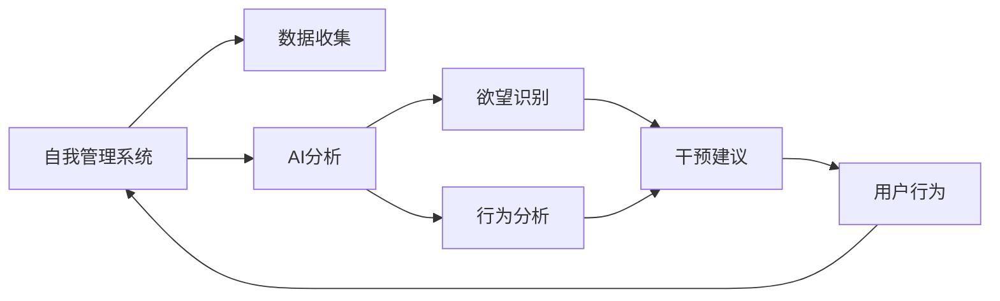

                 

# 欲望的智能调节器：AI辅助的自我管理系统

## 1. 背景介绍

在快节奏的现代生活中，欲望的膨胀和不自知的行为习惯对许多人构成了挑战。随着科技的进步，尤其是人工智能（AI）的发展，人们开始探索如何利用智能技术来调节和管理个人的欲望，从而更好地实现自我管理和心理健康。本文旨在通过介绍AI辅助的自我管理系统，探讨如何借助算法和数据分析，帮助用户识别并管理其内在的欲望和冲动，以提升生活质量和幸福感。

## 2. 核心概念与联系

### 2.1 核心概念概述

本节将介绍几个关键概念，并阐述它们之间的联系：

- **自我管理系统**：一种旨在帮助用户识别、管理和调整欲望和行为的工具或系统。这类系统通常基于心理学、行为科学和AI技术，结合数据驱动的算法，为用户提供个性化的建议和干预。

- **AI辅助**：指利用人工智能技术，如机器学习、自然语言处理（NLP）、计算机视觉等，来增强自我管理系统的功能和效果。AI技术可以处理大量数据，识别模式，并提出个性化的建议。

- **欲望管理**：指的是通过一系列策略和工具，帮助个体识别和管理其欲望和冲动，以减少不必要的消费和行为，提升生活质量。这通常包括心理分析、行为监控、目标设定等功能。

- **自我认知**：指个体对其欲望、行为和心理状态的理解和认识。自我管理系统通过数据分析和反馈机制，帮助用户深入了解自己的行为模式和欲望来源，从而进行有效干预。

- **目标设定与追踪**：为实现长期的自我管理目标，系统通过设定SMART（Specific, Measurable, Achievable, Relevant, Time-bound）目标，并实时追踪和调整策略，以保持进度和动力。

这些概念共同构成了AI辅助自我管理系统的框架，使得系统能够通过算法和数据驱动的方式，帮助用户实现欲望和行为的调节。

### 2.2 核心概念原理和架构的 Mermaid 流程图



这个流程图展示了自我管理系统从数据收集到干预建议的全过程，其中AI分析扮演了核心角色，通过欲望识别和行为分析，提供个性化的干预建议，最终影响用户的实际行为。

## 3. 核心算法原理 & 具体操作步骤

### 3.1 算法原理概述

AI辅助的自我管理系统利用机器学习算法，特别是监督学习和强化学习，来理解和预测用户的欲望和行为模式。其核心算法原理包括：

- **监督学习**：通过用户的历史行为数据，训练模型预测未来的欲望和行为。例如，使用回归模型预测用户的消费金额，或使用分类模型预测用户的情绪状态。

- **强化学习**：通过不断试错，优化用户行为。系统通过设定奖励和惩罚机制，引导用户朝着积极的行为模式发展。

- **情感分析**：利用NLP技术分析用户的情感状态，识别压力、焦虑等负面情绪，提供及时的干预建议。

- **行为模式识别**：通过分析用户的行为序列，识别出频繁出现的行为模式，并预测未来的行为趋势。

### 3.2 算法步骤详解

具体步骤如下：

1. **数据收集**：用户通过系统提供的接口，记录其日常行为和欲望表达，包括消费记录、健康数据、社交媒体活动等。

2. **预处理**：对收集的数据进行清洗和标准化，去除异常值和噪声，确保数据质量。

3. **特征提取**：从处理后的数据中提取有用的特征，如消费频率、情绪波动、社交互动等，作为算法输入。

4. **模型训练**：使用监督学习或强化学习算法，基于历史数据训练模型，预测用户未来的欲望和行为。

5. **欲望和行为预测**：将模型应用于实时数据，预测用户的欲望和行为。

6. **干预建议**：根据预测结果，系统提供个性化的干预建议，如减少不必要的消费、推荐健康活动、提供情绪调节技巧等。

7. **行为追踪与反馈**：系统追踪用户的实际行为，评估干预效果，并根据反馈调整策略。

8. **持续学习**：系统通过不断收集新的数据，更新模型参数，提高预测和干预的准确性。

### 3.3 算法优缺点

AI辅助的自我管理系统具有以下优点：

- **个性化建议**：系统能够根据用户的具体情况提供定制化的干预建议，提高干预效果。
- **实时监控**：通过持续的数据收集和分析，系统可以实时监控用户的行为，及时提供反馈。
- **自我认知提升**：系统通过数据分析和反馈，帮助用户深入了解自己的欲望和行为模式，提升自我认知。

同时，也存在一些缺点：

- **数据隐私**：用户数据的收集和存储可能引发隐私问题，需要严格的数据保护措施。
- **算法偏见**：如果模型训练数据存在偏见，可能影响干预建议的公平性和有效性。
- **依赖技术**：系统的功能依赖于算法和数据的准确性，技术实现复杂，可能存在误判和误导。
- **用户接受度**：用户对系统的信任和接受度可能影响干预效果，需要良好的用户体验设计。

### 3.4 算法应用领域

该系统可应用于多个领域：

- **消费行为管理**：帮助用户控制消费冲动，减少不必要的开支。
- **健康与生活方式管理**：监控用户的健康数据，提供健康建议，改善生活方式。
- **情绪与心理管理**：识别用户负面情绪，提供情绪调节策略，提升心理健康。
- **学习与时间管理**：通过目标设定和行为监控，帮助用户提升学习和时间管理能力。
- **社交关系管理**：分析用户的社交互动，提供个性化的社交建议，提升人际关系质量。

这些应用场景展示了AI辅助自我管理系统在个人生活各个方面的潜在价值。

## 4. 数学模型和公式 & 详细讲解

### 4.1 数学模型构建

假设系统收集到用户历史行为数据 $D = \{(x_i, y_i)\}_{i=1}^N$，其中 $x_i$ 是用户行为特征，$y_i$ 是用户的欲望或行为标签。模型的目标是通过学习 $f(x_i; \theta)$ 来预测用户的欲望或行为 $y_i$，其中 $\theta$ 是模型参数。

### 4.2 公式推导过程

以一个简单的线性回归模型为例，假设 $y_i = \beta_0 + \beta_1 x_{i1} + \ldots + \beta_p x_{ip} + \epsilon_i$，其中 $\epsilon_i$ 是误差项，$x_{ij}$ 是第 $i$ 个样本的第 $j$ 个特征。通过最小二乘法求解参数 $\beta$：

$$
\hat{\beta} = \arg\min_{\beta} \sum_{i=1}^N (y_i - f(x_i; \beta))^2
$$

解得：

$$
\hat{\beta} = (X^TX)^{-1}X^Ty
$$

其中 $X$ 是特征矩阵，$y$ 是标签向量。

### 4.3 案例分析与讲解

以用户消费金额预测为例，假设收集到用户的消费记录 $D = \{(x_i, y_i)\}_{i=1}^N$，其中 $x_i$ 包括消费日期、消费金额、消费类别等特征，$y_i$ 是用户当月的总消费金额。通过线性回归模型预测用户下个月的消费金额，公式为：

$$
y_{t+1} = \beta_0 + \beta_1 x_{t1} + \ldots + \beta_p x_{tp} + \epsilon_{t+1}
$$

其中 $t$ 是当前月份，$y_{t+1}$ 是预测的下个月消费金额。通过训练模型，预测用户下个月的消费金额，并根据预测结果提供干预建议，如减少不必要的消费。

## 5. 项目实践：代码实例和详细解释说明

### 5.1 开发环境搭建

为了进行AI辅助的自我管理系统开发，需要准备以下开发环境：

1. **Python**：确保系统所有依赖库都支持Python 3.x版本。
2. **Python库**：安装必要的Python库，如Pandas、NumPy、Scikit-learn、TensorFlow等。
3. **数据库**：选择合适的数据库，如MySQL、PostgreSQL等，用于存储用户数据。
4. **前端框架**：如React、Angular等，用于开发用户界面。
5. **后端服务**：如Django、Flask等，用于实现API接口和服务逻辑。
6. **云计算平台**：如AWS、Google Cloud等，提供计算资源和存储服务。

### 5.2 源代码详细实现

以下是一个简单的Python代码示例，用于实现基于线性回归的用户消费金额预测：

```python
import pandas as pd
from sklearn.linear_model import LinearRegression

# 读取数据
data = pd.read_csv('consumption_data.csv')

# 准备特征和标签
X = data[['consumption_date', 'consumption_amount', 'consumption_category']]
y = data['total_consumption']

# 训练模型
model = LinearRegression()
model.fit(X, y)

# 预测下个月消费金额
next_month = pd.to_datetime('2022-09-01', format='%Y-%m-%d')
future_date = pd.Timestamp(next_month)
future_data = {'consumption_date': future_date, 'consumption_amount': 0, 'consumption_category': '杂项'}
future_X = pd.DataFrame([future_data])
future_y_pred = model.predict(future_X)

print(f'预测下个月消费金额：{future_y_pred[0]}')
```

### 5.3 代码解读与分析

上述代码中，首先读取用户消费数据，准备特征和标签，然后使用LinearRegression模型进行训练。在训练完成后，使用预测函数计算下个月的消费金额，并打印输出。

需要注意的是，实际应用中，可能需要对数据进行预处理和特征工程，以提高模型的预测准确性。此外，还需要设计合适的界面和交互逻辑，以便用户能够便捷地输入数据和查看预测结果。

### 5.4 运行结果展示

运行上述代码，输出结果展示了预测的下个月消费金额。用户可以根据这个预测结果，调整消费计划，进行个性化的干预。

## 6. 实际应用场景

### 6.1 智能购物助手

AI辅助的自我管理系统可以开发成智能购物助手，帮助用户规划和控制消费。系统通过分析用户的消费历史和当前需求，提供个性化的购物建议，如推荐商品、评估购买需求等，帮助用户避免冲动购物。

### 6.2 健康生活管理

系统可以收集用户的健康数据，如运动量、饮食记录等，通过数据分析和机器学习算法，提供个性化的健康建议，如饮食推荐、运动计划等，帮助用户改善生活方式，提升健康水平。

### 6.3 情绪和心理健康支持

系统通过分析用户的社交媒体活动和情绪表达，识别负面情绪和压力源，提供情感调节建议，如放松技巧、冥想指导等，提升用户的情绪稳定性和心理健康。

### 6.4 学习与职业发展

系统可以帮助用户设定学习目标，监控学习进度，提供个性化学习建议，如学习资源推荐、时间管理策略等，提升学习效果和职业发展能力。

## 7. 工具和资源推荐

### 7.1 学习资源推荐

为了帮助开发者深入理解AI辅助的自我管理系统，推荐以下学习资源：

1. **《Python机器学习》**：由Sebastian Raschka和Vahid Mirjalili撰写，全面介绍了Python在机器学习中的应用，包括数据处理、模型训练、评估等。
2. **《深度学习》（Goodfellow等）**：详细讲解了深度学习的基本概念、算法和应用，适合深入学习。
3. **Coursera和Udacity**：提供多种机器学习和AI相关的在线课程，包括监督学习、强化学习、情感分析等。
4. **Kaggle**：数据科学和机器学习竞赛平台，提供丰富的数据集和模型竞赛，提升实践能力。
5. **AI博客和论坛**：如Towards Data Science、KDnuggets等，分享最新的AI研究和应用进展，提供学习资源和讨论平台。

### 7.2 开发工具推荐

1. **PyTorch**：一个强大的深度学习框架，支持动态图和静态图，适合研究和实验。
2. **TensorFlow**：谷歌开发的深度学习框架，生产部署方便，适合大规模工程应用。
3. **Jupyter Notebook**：一个交互式编程环境，支持Python、R等多种语言，方便实验和调试。
4. **Flask**：一个轻量级的Web框架，适合快速开发API接口。
5. **Django**：一个全功能的Web框架，适合构建完整的应用系统和数据库管理。

### 7.3 相关论文推荐

为了深入了解AI辅助的自我管理系统，推荐以下论文：

1. **《数据驱动的个性化干预：一种基于机器学习的情感管理方法》**：提出一种结合情感分析和机器学习的个性化干预方法，帮助用户管理负面情绪。
2. **《智能购物助手：一种基于用户行为数据的个性化推荐系统》**：介绍一种基于用户行为数据的智能购物助手，帮助用户控制消费。
3. **《基于强化学习的健康生活管理》**：利用强化学习算法，优化用户健康行为，提升生活质量。
4. **《深度学习在心理健康支持中的应用》**：探讨深度学习技术在心理健康领域的应用，如情感分析、行为预测等。
5. **《学习与职业发展中的个性化学习推荐》**：研究如何通过机器学习算法，为用户提供个性化的学习资源和职业发展建议。

## 8. 总结：未来发展趋势与挑战

### 8.1 研究成果总结

AI辅助的自我管理系统通过机器学习和数据分析，帮助用户识别和管理欲望和行为，提升生活质量和幸福感。其核心技术包括监督学习、强化学习、情感分析等，应用场景广泛，如智能购物助手、健康生活管理、情绪和心理健康支持、学习与职业发展等。

### 8.2 未来发展趋势

未来，AI辅助的自我管理系统将呈现以下发展趋势：

1. **多模态数据融合**：系统将逐渐支持多模态数据融合，如文本、图像、音频等，提供更加全面和深入的用户分析。
2. **智能情感分析**：利用先进的自然语言处理技术，实现更精确的情感分析和情绪预测。
3. **个性化干预优化**：通过强化学习等技术，优化干预策略，提升个性化建议的有效性。
4. **实时反馈与调整**：系统将实时收集用户反馈，动态调整干预策略，提高干预效果。
5. **隐私保护与安全性**：加强数据隐私保护和安全性，防止数据泄露和滥用。

### 8.3 面临的挑战

尽管AI辅助的自我管理系统具有巨大的应用潜力，但仍面临以下挑战：

1. **数据隐私**：用户数据的收集和存储可能引发隐私问题，需要严格的数据保护措施。
2. **算法偏见**：模型训练数据可能存在偏见，影响干预建议的公平性和有效性。
3. **技术实现复杂**：系统的技术实现复杂，可能存在误判和误导。
4. **用户接受度**：用户对系统的信任和接受度可能影响干预效果。

### 8.4 研究展望

未来，需要在这几个方面进行深入研究：

1. **隐私保护技术**：开发更先进的隐私保护技术，如差分隐私、联邦学习等，保护用户数据隐私。
2. **公平性与透明性**：研究如何减少算法偏见，提高干预建议的公平性和透明性。
3. **模型解释性**：开发可解释性更强的模型，帮助用户理解干预建议的依据。
4. **多模态交互设计**：设计更符合用户习惯的多模态交互界面，提升用户体验。
5. **用户行为研究**：深入研究用户行为心理学，提供更加个性化和有效的干预建议。

## 9. 附录：常见问题与解答

**Q1: 什么是AI辅助的自我管理系统？**

A: AI辅助的自我管理系统是一种利用人工智能技术，帮助用户识别和管理欲望和行为的系统。它通过数据分析和机器学习算法，为用户提供个性化的干预建议，从而提升生活质量和幸福感。

**Q2: AI辅助的自我管理系统有哪些应用场景？**

A: AI辅助的自我管理系统可以应用于多个领域，如智能购物助手、健康生活管理、情绪和心理健康支持、学习与职业发展等。这些应用场景展示了系统在个人生活各个方面的潜在价值。

**Q3: 开发AI辅助的自我管理系统需要哪些技术？**

A: 开发AI辅助的自我管理系统需要掌握多种技术，包括机器学习、自然语言处理、情感分析、强化学习等。此外，还需要了解数据处理、系统架构、Web开发等技术。

**Q4: 如何保护用户数据隐私？**

A: 保护用户数据隐私是开发AI辅助的自我管理系统的重要任务。需要采用差分隐私、联邦学习等技术，确保用户数据的安全性和匿名性。同时，还需要建立严格的数据保护政策和管理机制。

**Q5: 如何提高干预建议的公平性和透明性？**

A: 提高干预建议的公平性和透明性需要从多个方面入手。首先，确保模型训练数据的多样性和代表性，避免数据偏见。其次，开发可解释性更强的模型，帮助用户理解干预建议的依据。最后，建立透明的干预流程，让用户清楚了解干预策略的来源和效果。

---

作者：禅与计算机程序设计艺术 / Zen and the Art of Computer Programming

