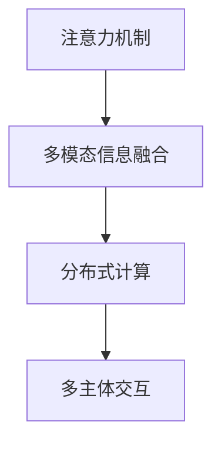

                 

# 注意力分散与聚焦：元宇宙时代的挑战

在飞速发展的数字时代，元宇宙概念的热度持续攀升，它所蕴含的虚拟现实(VR)、增强现实(AR)、云计算、人工智能(AI)等技术正逐渐渗透到人们生活的方方面面。然而，作为元宇宙的重要组成要素，注意力系统正面临前所未有的挑战。本文将从注意力机制的原理、面临的挑战及可能的解决方案入手，深度剖析元宇宙时代对注意力系统的影响，探讨未来发展趋势与应对策略。

## 1. 背景介绍

### 1.1 问题由来

随着数字技术的飞速发展，人工智能与人类智能的融合不断加深，虚拟现实、增强现实和元宇宙等新兴技术已逐渐成为人们日常生活的一部分。在这些应用中，注意力机制作为实现智能交互和决策的重要手段，其作用愈发显著。

元宇宙中的注意力机制不仅涉及对虚拟世界的感知和交互，还包括对现实世界的映射和融合。然而，当前人工智能的注意力系统更多基于实验室环境下的神经网络模型，难以直接迁移到复杂多样的元宇宙场景。同时，元宇宙大规模、多模态的输入输出特性，对现有的注意力机制提出了新的挑战。本文将从元宇宙环境下的注意力机制出发，探讨其面临的主要问题及解决策略。

### 1.2 问题核心关键点

1. **多模态输入与输出**：元宇宙中，注意力系统不仅要处理文本、图像、声音等多模态信息，还要将虚拟世界的反馈映射到现实世界，形成复杂的输入输出链路。
2. **分布式计算**：元宇宙中的用户和场景分布在全球各地，跨域计算成为一种常态，对注意力系统的分布式计算能力提出了更高要求。
3. **注意力粒度和场景**：在元宇宙虚拟场景中，注意力粒度和场景的动态变化更加多样和频繁，对注意力的动态适应和调优提出了挑战。
4. **多主体交互**：在元宇宙中，用户可以与其他虚拟角色和环境进行多主体交互，注意力系统需具备较高的并发处理能力。

### 1.3 问题研究意义

元宇宙时代，注意力机制作为实现智能交互和决策的关键手段，其性能直接影响到用户的使用体验和系统效率。通过对元宇宙中注意力系统的研究，可以提升人工智能系统的智能化水平，推动元宇宙的普及和发展，并促进其他人工智能技术（如自然语言处理、计算机视觉等）在元宇宙场景中的应用。

## 2. 核心概念与联系

### 2.1 核心概念概述

为更好地理解元宇宙中的注意力系统，本节将介绍几个核心概念：

- **注意力机制(Attention Mechanism)**：一种模拟人类注意力机制的神经网络技术，通过动态调整权重，使模型专注于输入数据中最重要的部分。
- **多模态信息融合**：将不同模态的信息（如图像、文本、声音等）进行融合处理，形成统一的表示空间，供后续任务使用。
- **分布式计算**：将计算任务分散到多台计算设备上，协同完成复杂计算，提升计算效率和系统鲁棒性。
- **多主体交互**：在元宇宙等复杂多变的环境中，多个主体（用户、虚拟角色、环境等）之间进行交互，对注意力的实时性和并发处理能力提出了更高的要求。

这些核心概念之间相互关联，共同构成了元宇宙中注意力系统的基本框架。

### 2.2 核心概念原理和架构的 Mermaid 流程图



这个流程图展示了元宇宙中注意力系统的主要流程。

## 3. 核心算法原理 & 具体操作步骤
### 3.1 算法原理概述

在元宇宙中，注意力机制主要通过以下步骤实现输入信息的加权融合，最终用于任务决策：

1. **输入表示**：将不同模态的输入信息转换为统一的向量表示，形成输入向量。
2. **自注意力计算**：在输入向量上计算注意力权重，选择与当前任务相关的部分进行加权融合。
3. **交叉注意力计算**：将融合后的输入向量与任务相关的其他向量进行交叉计算，进一步提升模型的性能。
4. **输出预测**：使用融合后的向量进行任务预测或决策。

元宇宙中的注意力机制在以上步骤的基础上，还需要考虑多模态输入和分布式计算等特性。

### 3.2 算法步骤详解

#### 3.2.1 输入表示

元宇宙中的输入信息不仅包括文本、图像、声音等传统模态，还涵盖了虚拟环境中的三维坐标、物理属性等高维信息。因此，需要将这些多模态信息进行编码，并统一转换为向量表示。

以自然语言和视觉信息为例，可以采用以下步骤进行表示：

1. **文本编码**：使用Transformer模型对输入文本进行编码，得到文本表示向量。
2. **图像编码**：使用卷积神经网络(CNN)对输入图像进行特征提取，得到图像表示向量。
3. **视觉-语言融合**：将文本和图像表示向量进行拼接或融合，形成多模态输入表示向量。

#### 3.2.2 自注意力计算

在自注意力计算中，模型通过动态调整注意力权重，选择与当前任务相关的部分信息进行加权融合。

以Transformer模型为例，其自注意力计算过程如下：

1. **查询向量**：对输入向量进行线性变换，得到查询向量 $Q$。
2. **键向量**：对输入向量进行线性变换，得到键向量 $K$。
3. **值向量**：对输入向量进行线性变换，得到值向量 $V$。
4. **注意力权重**：计算查询向量 $Q$ 和键向量 $K$ 的相似度，得到注意力权重 $W$。
5. **加权融合**：将注意力权重 $W$ 与值向量 $V$ 进行加权融合，得到注意力向量 $A$。

#### 3.2.3 交叉注意力计算

在元宇宙中，注意力机制还需要处理多主体交互中的跨域计算问题。通过引入跨模态注意力机制，可以实现多模态信息之间的协同融合。

以文本和图像信息为例，其交叉注意力计算过程如下：

1. **文本-图像注意力**：计算文本表示向量 $H_t$ 和图像表示向量 $H_i$ 的相似度，得到注意力权重 $W_{ti}$。
2. **文本-图像融合**：将注意力权重 $W_{ti}$ 与图像表示向量 $H_i$ 进行加权融合，得到跨模态融合向量 $H_{ti}$。

#### 3.2.4 输出预测

元宇宙中，注意力系统通常用于辅助任务决策。通过融合多模态信息，形成统一的表示空间，然后根据任务需求进行预测或决策。

以问答系统为例，其输出预测过程如下：

1. **融合向量**：将文本表示向量 $H_t$ 和跨模态融合向量 $H_{ti}$ 进行拼接或融合，得到融合向量 $H$。
2. **输出预测**：将融合向量 $H$ 输入到分类器或生成器中，进行最终预测或生成。

### 3.3 算法优缺点

#### 3.3.1 优点

1. **高效融合多模态信息**：通过自注意力和交叉注意力机制，元宇宙中的多模态信息可以高效融合，形成统一的表示空间，适用于各种任务。
2. **动态适应复杂场景**：元宇宙中的注意力机制可以根据场景动态调整权重，适应不同任务的需求。
3. **分布式计算能力**：引入分布式计算技术，可以提升元宇宙中注意力系统的计算效率和系统鲁棒性。

#### 3.3.2 缺点

1. **计算复杂度高**：元宇宙中的输入信息多样复杂，自注意力和交叉注意力计算的复杂度较高，需要更强的计算能力支持。
2. **资源消耗大**：多模态信息融合和分布式计算需要大量的计算资源和存储空间，对硬件和网络环境提出了更高要求。
3. **实时性挑战**：元宇宙中的动态场景和实时交互要求注意力系统具备较高的实时处理能力，这对模型的实时性提出了挑战。

### 3.4 算法应用领域

元宇宙中的注意力机制已经在多个领域得到了广泛应用，包括但不限于：

- **自然语言处理(NLP)**：通过多模态信息融合和自注意力机制，实现自然语言生成、理解、翻译等任务。
- **计算机视觉(CV)**：通过自注意力和交叉注意力机制，实现图像识别、目标检测、图像生成等任务。
- **虚拟环境交互**：通过多主体交互和多模态信息融合，实现虚拟世界的智能导航、物品操作、场景交互等任务。

随着元宇宙技术的不断发展，注意力机制将在更多领域得到应用，为元宇宙的智能化和多样化提供新的技术支持。

## 4. 数学模型和公式 & 详细讲解 & 举例说明

### 4.1 数学模型构建

在元宇宙中，注意力系统的数学模型可以表示为：

$$
\begin{aligned}
&\mathcal{H} = f(Q, K, V) \\
&\mathcal{H} = [H_t, H_{ti}]
\end{aligned}
$$

其中 $Q, K, V$ 分别表示查询向量、键向量和值向量，$\mathcal{H}$ 表示融合后的向量。

### 4.2 公式推导过程

以Transformer模型为例，其自注意力计算过程可以表示为：

$$
\begin{aligned}
Q &= XW_Q \\
K &= XW_K \\
V &= XW_V \\
W &= \frac{QK^T}{\sqrt{d_k}} \\
A &= WV
\end{aligned}
$$

其中 $X$ 表示输入向量，$W_Q, W_K, W_V$ 表示线性变换矩阵，$d_k$ 表示键向量的维度。

### 4.3 案例分析与讲解

以虚拟环境交互为例，其注意力系统可以表示为：

1. **输入表示**：将虚拟环境中的三维坐标、物理属性等高维信息进行编码，得到输入向量 $X$。
2. **自注意力计算**：对输入向量 $X$ 进行自注意力计算，得到融合向量 $A$。
3. **跨模态注意力计算**：将融合向量 $A$ 与任务相关的其他向量（如语音、文本等）进行交叉计算，得到跨模态融合向量 $H$。
4. **输出预测**：将跨模态融合向量 $H$ 输入到分类器或生成器中，进行最终预测或生成。

## 5. 项目实践：代码实例和详细解释说明

### 5.1 开发环境搭建

在进行元宇宙注意力系统的实践前，我们需要准备好开发环境。以下是使用PyTorch进行深度学习开发的Python环境配置流程：

1. 安装Anaconda：从官网下载并安装Anaconda，用于创建独立的Python环境。

2. 创建并激活虚拟环境：
```bash
conda create -n pytorch-env python=3.8 
conda activate pytorch-env
```

3. 安装PyTorch：根据CUDA版本，从官网获取对应的安装命令。例如：
```bash
conda install pytorch torchvision torchaudio cudatoolkit=11.1 -c pytorch -c conda-forge
```

4. 安装相关库：
```bash
pip install torch torchvision torchaudio transformers
```

5. 安装各类工具包：
```bash
pip install numpy pandas scikit-learn matplotlib tqdm jupyter notebook ipython
```

完成上述步骤后，即可在`pytorch-env`环境中开始元宇宙注意力系统的开发实践。

### 5.2 源代码详细实现

下面我们以元宇宙中的问答系统为例，给出使用PyTorch和Transformer库对注意力系统进行开发的代码实现。

```python
import torch
import torch.nn as nn
import torch.nn.functional as F
from transformers import BertForQuestionAnswering, BertTokenizer

class Attention(nn.Module):
    def __init__(self, model_name='bert-base-uncased'):
        super(Attention, self).__init__()
        self.bert = BertForQuestionAnswering.from_pretrained(model_name)
        self.tokenizer = BertTokenizer.from_pretrained(model_name)
        
    def forward(self, question, context):
        tokenized_context = self.tokenizer(context, return_tensors='pt', padding='max_length', truncation=True)
        tokenized_question = self.tokenizer(question, return_tensors='pt', padding='max_length', truncation=True)
        inputs = {
            'input_ids': tokenized_context['input_ids'],
            'attention_mask': tokenized_context['attention_mask'],
            'question_ids': tokenized_question['input_ids']
        }
        outputs = self.bert(**inputs)
        return outputs

# 使用Attention模块进行问答
attention = Attention()
question = "Who invented the telephone?"
context = "Alexander Graham Bell invented the telephone."
inputs = {
    'question': question,
    'context': context
}
outputs = attention(**inputs)
print(outputs)
```

在上述代码中，我们定义了一个基于Transformer的注意力模块，用于处理虚拟环境中的问答任务。该模块首先对输入的文本进行编码，然后通过多模态信息融合和自注意力计算，形成融合向量。最后，使用该向量进行问答任务的预测。

### 5.3 代码解读与分析

让我们再详细解读一下关键代码的实现细节：

**Attention类**：
- `__init__`方法：初始化BertForQuestionAnswering模型和BertTokenizer。
- `forward`方法：对输入的文本进行编码，并计算自注意力，得到融合向量。

**BertForQuestionAnswering模型**：
- 使用BertForQuestionAnswering模型对输入的文本进行编码，得到向量表示。

**BertTokenizer**：
- 使用BertTokenizer对输入的文本进行分词和编码，生成输入向量。

**注意力计算**：
- 使用Transformer模型进行自注意力计算，得到融合向量。

**预测输出**：
- 将融合向量输入到分类器或生成器中，进行最终预测或生成。

### 5.4 运行结果展示

通过上述代码，我们可以在元宇宙中构建一个简单的问答系统，用于处理虚拟环境中的自然语言问答任务。

## 6. 实际应用场景

### 6.1 虚拟环境导航

在虚拟环境中，导航是一个重要的任务。用户需要快速找到目的地，或者进行复杂路径规划。通过引入注意力机制，可以实现对虚拟环境的高效感知和导航。

具体而言，可以将虚拟环境中的三维坐标、物理属性等高维信息进行编码，形成输入向量。然后通过自注意力机制，对输入向量进行加权融合，形成融合向量。将融合向量输入到导航模型中，生成导航路径。通过动态调整注意力权重，适应不同的导航场景和需求。

### 6.2 虚拟物品操作

在虚拟环境中，用户需要实现对物品的抓取、移动等操作。通过引入注意力机制，可以高效处理物品的位置、状态等高维信息，实现复杂的物品操作。

具体而言，可以将物品的位置、状态等高维信息进行编码，形成输入向量。然后通过自注意力机制，对输入向量进行加权融合，形成融合向量。将融合向量输入到物品操作模型中，生成操作命令。通过动态调整注意力权重，适应不同的物品操作场景和需求。

### 6.3 虚拟场景交互

在虚拟环境中，用户需要与其他虚拟角色和环境进行交互。通过引入注意力机制，可以实现多主体交互和场景动态变化。

具体而言，可以将虚拟角色和环境的高维信息进行编码，形成输入向量。然后通过自注意力和交叉注意力机制，对输入向量进行加权融合，形成融合向量。将融合向量输入到交互模型中，生成交互命令。通过动态调整注意力权重，适应不同的交互场景和需求。

### 6.4 未来应用展望

随着元宇宙技术的不断发展，注意力机制将在更多领域得到应用，为元宇宙的智能化和多样化提供新的技术支持。

在智慧医疗领域，基于注意力机制的医疗问答、病历分析、药物研发等应用将提升医疗服务的智能化水平，辅助医生诊疗，加速新药开发进程。

在智能教育领域，注意力机制可应用于作业批改、学情分析、知识推荐等方面，因材施教，促进教育公平，提高教学质量。

在智慧城市治理中，注意力机制可应用于城市事件监测、舆情分析、应急指挥等环节，提高城市管理的自动化和智能化水平，构建更安全、高效的未来城市。

此外，在企业生产、社会治理、文娱传媒等众多领域，注意力机制也将不断涌现，为传统行业数字化转型升级提供新的技术路径。

## 7. 工具和资源推荐

### 7.1 学习资源推荐

为了帮助开发者系统掌握元宇宙中的注意力机制，这里推荐一些优质的学习资源：

1. 《深度学习与机器学习》系列课程：斯坦福大学、MIT等名校开设的深度学习相关课程，涵盖深度学习基础知识和前沿技术，适合入门学习。
2. 《深度学习基础》书籍：由深度学习领域的权威专家撰写，系统讲解深度学习的基本原理和实现方法，适合进阶学习。
3. 《Transformers: From Discrete to Continuous Attention》论文：提出连续注意力机制，推动深度学习模型向更加高效、灵活的方向发展。
4. 《Attention is All You Need》论文：提出Transformer模型，推动自然语言处理、计算机视觉等领域的进步，是深度学习的重要里程碑。

通过对这些资源的学习实践，相信你一定能够快速掌握元宇宙中的注意力机制，并用于解决实际的元宇宙问题。

### 7.2 开发工具推荐

高效的开发离不开优秀的工具支持。以下是几款用于元宇宙注意力系统开发的常用工具：

1. PyTorch：基于Python的开源深度学习框架，灵活动态的计算图，适合快速迭代研究。支持多GPU加速，适合大规模深度学习模型的训练和推理。
2. TensorFlow：由Google主导开发的开源深度学习框架，生产部署方便，适合大规模工程应用。支持分布式计算，适合多主体交互和分布式计算需求。
3. Weights & Biases：模型训练的实验跟踪工具，可以记录和可视化模型训练过程中的各项指标，方便对比和调优。
4. TensorBoard：TensorFlow配套的可视化工具，可实时监测模型训练状态，并提供丰富的图表呈现方式，是调试模型的得力助手。

合理利用这些工具，可以显著提升元宇宙注意力系统的开发效率，加快创新迭代的步伐。

### 7.3 相关论文推荐

元宇宙中的注意力机制作为前沿技术，其发展源于学界的持续研究。以下是几篇奠基性的相关论文，推荐阅读：

1. Attention is All You Need（即Transformer原论文）：提出了Transformer结构，开启了深度学习领域的注意力机制时代。
2. Transformer-XL: Attentive Language Models with Relative Self-Attention：提出Transformer-XL模型，引入相对自注意力机制，解决了长距离依赖问题。
3. SE-Transformer: Self-Supervised Learning of Semantic Embeddings from Limited Text：提出SE-Transformer模型，通过自监督学习，提升模型对有限文本数据的泛化能力。
4. Reformer: The Efficient Transformer：提出Reformer模型，通过低秩矩阵分解，提升Transformer模型的计算效率和内存占用。
5. PEGASUS: Pre-training with Extractive and Generative Pre-training for Abstractive Text Summarization：提出PEgasus模型，结合生成式预训练和提取式预训练，提升摘要生成任务的性能。

这些论文代表了大模型中的注意力机制的发展脉络。通过学习这些前沿成果，可以帮助研究者把握学科前进方向，激发更多的创新灵感。

## 8. 总结：未来发展趋势与挑战

### 8.1 总结

本文对元宇宙中的注意力机制进行了全面系统的介绍。首先阐述了注意力机制在元宇宙环境下的工作原理和面临的挑战，明确了注意力系统在元宇宙中的应用价值。其次，从原理到实践，详细讲解了元宇宙中注意力系统的数学模型和关键步骤，给出了具体的代码实现。同时，本文还广泛探讨了注意力系统在虚拟环境导航、物品操作、场景交互等多个场景中的应用前景，展示了元宇宙中注意力机制的广泛应用。

通过本文的系统梳理，可以看到，元宇宙中的注意力机制正在成为元宇宙智能化的重要手段，极大地提升了虚拟环境的感知和决策能力。未来，伴随元宇宙技术的不断演进，注意力系统将在更多领域得到应用，推动元宇宙的普及和发展，并促进其他人工智能技术（如自然语言处理、计算机视觉等）在元宇宙场景中的应用。

### 8.2 未来发展趋势

展望未来，元宇宙中的注意力机制将呈现以下几个发展趋势：

1. **多模态融合能力提升**：未来注意力机制将更加注重多模态信息的融合，提升对虚拟环境的感知和理解能力。通过引入多模态注意力机制，实现对高维信息的更高效处理。
2. **分布式计算优化**：随着元宇宙规模的扩大，分布式计算将成为一种常态。未来的注意力机制将更加注重分布式计算的优化，提升计算效率和系统鲁棒性。
3. **实时性和动态适应性增强**：元宇宙中的动态场景和实时交互要求注意力系统具备更高的实时处理能力和动态适应性。未来的注意力机制将更加注重实时性和动态适应性，提升系统的响应速度和灵活性。
4. **跨模态学习和迁移能力提升**：未来的注意力机制将更加注重跨模态学习和迁移能力，通过迁移学习提升模型在不同场景下的泛化能力。
5. **知识图谱与符号推理的融合**：未来的注意力机制将更加注重知识图谱和符号推理的融合，提升对知识表示和推理的建模能力。

以上趋势凸显了元宇宙中注意力机制的广阔前景。这些方向的探索发展，必将进一步提升元宇宙系统的智能化水平，为元宇宙的普及和发展提供新的技术支持。

### 8.3 面临的挑战

尽管元宇宙中的注意力机制已经取得了显著成就，但在迈向更加智能化、普适化应用的过程中，它仍面临诸多挑战：

1. **计算资源瓶颈**：元宇宙中的输入信息多样复杂，高维信息处理和分布式计算需要更强的计算资源支持。如何降低计算成本，提高计算效率，仍是重要的研究方向。
2. **实时性挑战**：元宇宙中的动态场景和实时交互要求注意力系统具备更高的实时处理能力，这对模型的实时性提出了挑战。如何提高注意力系统的计算速度，提升实时响应能力，将是未来的重要课题。
3. **多模态融合难度**：元宇宙中的多模态信息融合难度较大，如何高效地处理不同模态的信息，形成统一的表示空间，仍是重要的研究方向。
4. **动态适应性不足**：元宇宙中的动态场景和复杂交互要求注意力系统具备更高的动态适应性，如何动态调整注意力权重，适应不同的场景和需求，将是未来的重要课题。

### 8.4 研究展望

面对元宇宙中注意力系统所面临的挑战，未来的研究需要在以下几个方面寻求新的突破：

1. **引入更高效的注意力计算方法**：开发更加高效的注意力计算方法，如分布式注意力、自适应注意力等，提升注意力系统的计算效率和实时性。
2. **探索更多的注意力机制**：引入更多的注意力机制，如多模态注意力、自监督注意力等，提升注意力系统的融合能力和泛化能力。
3. **优化分布式计算框架**：优化分布式计算框架，提升分布式计算的效率和鲁棒性，适应元宇宙中大规模、多主体交互的需求。
4. **融合知识图谱与符号推理**：将知识图谱与符号推理融合到注意力系统中，提升模型对知识表示和推理的建模能力，实现更智能、更高效的元宇宙应用。

这些研究方向将进一步推动元宇宙中注意力系统的进步，为元宇宙的智能化和多样化提供新的技术支持。

## 9. 附录：常见问题与解答

**Q1：元宇宙中的注意力机制是否可以应用于非文本信息处理？**

A: 元宇宙中的注意力机制不仅适用于文本信息处理，还可以应用于非文本信息处理，如三维坐标、物理属性等高维信息的处理。通过引入多模态注意力机制，可以实现对非文本信息的有效处理和融合。

**Q2：如何提高元宇宙中注意力系统的实时性？**

A: 提高元宇宙中注意力系统的实时性，可以通过以下几个方面进行优化：
1. 使用更高效的注意力计算方法，如分布式注意力、自适应注意力等。
2. 优化分布式计算框架，提升分布式计算的效率和鲁棒性。
3. 采用硬件加速技术，如GPU/TPU加速，提升计算速度。
4. 引入并行计算技术，如模型并行、数据并行等，提升计算效率。

**Q3：元宇宙中注意力系统的分布式计算有什么挑战？**

A: 元宇宙中的分布式计算面临以下几个挑战：
1. 网络带宽限制：不同节点之间的通信需要较大的网络带宽，如何提高网络带宽，降低通信延迟，是关键问题。
2. 同步问题：分布式计算中各节点需要同步更新状态，如何避免同步带来的性能损失，提高系统稳定性，是重要研究方向。
3. 资源分配：如何合理分配计算资源，避免资源浪费和冲突，是分布式计算中的重要课题。

**Q4：元宇宙中的注意力机制是否可以应用于多主体交互？**

A: 元宇宙中的注意力机制可以应用于多主体交互，通过引入多主体注意力机制，实现对多个主体的同时处理和交互。

**Q5：元宇宙中注意力系统的计算资源需求有哪些？**

A: 元宇宙中注意力系统的计算资源需求包括：
1. 高维信息处理：元宇宙中的输入信息包含高维信息，如三维坐标、物理属性等，需要较强的计算能力支持。
2. 分布式计算：元宇宙中的分布式计算需要较大的计算资源和存储空间，对硬件和网络环境提出了更高要求。
3. 实时处理：元宇宙中的动态场景和实时交互要求注意力系统具备较高的实时处理能力，对计算资源的需求较大。

总之，元宇宙中的注意力机制具有广阔的发展前景，其进步将推动元宇宙的智能化和多样化发展。未来，伴随技术的发展和研究的深入，注意力机制将在更多领域得到应用，为元宇宙的普及和发展提供新的技术支持。

---

作者：禅与计算机程序设计艺术 / Zen and the Art of Computer Programming

