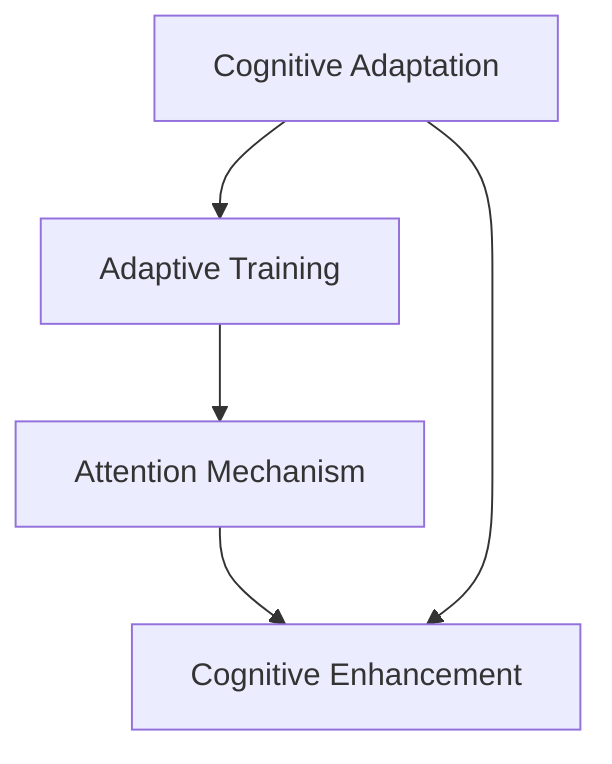

                 

# 注意力弹性训练营教练：AI优化的认知适应项目负责人

> 关键词：
- 注意力机制(Attention Mechanism)
- 弹性训练(Adaptive Training)
- 认知适应(Cognitive Adaptation)
- 认知增强(Cognitive Enhancement)
- 深度学习(Deep Learning)
- 神经网络(Neural Network)
- 人工智能(Artificial Intelligence)

## 1. 背景介绍

### 1.1 问题由来

随着人工智能(AI)技术的不断进步，深度学习模型已经广泛应用于各个领域，从自然语言处理(NLP)、计算机视觉(CV)到语音识别和推荐系统等。然而，这些模型在面对动态变化的环境时，往往需要重新训练或调整模型参数，以适应新的数据分布或任务需求。这一过程不仅耗时耗力，而且效果往往不尽如人意。

在实际应用中，特别是对于实时性、稳定性要求较高的场景，如无人驾驶、医疗诊断、金融交易等，模型的弹性训练和认知适应能力显得尤为重要。传统的深度学习模型在这一方面存在显著不足，难以快速适应新环境和新任务。因此，开发一种新型的弹性训练框架，实现模型的认知适应，成为了当前AI研究的热点之一。

### 1.2 问题核心关键点

- **认知适应**：指模型能够根据环境变化和新任务需求，动态调整自身的结构和参数，以更好地完成任务。
- **弹性训练**：指通过训练方法的设计，增强模型的适应能力和泛化能力，使其在面对新的数据分布和任务时，能够迅速调整并输出稳定、准确的预测结果。
- **注意力机制**：一种重要的神经网络组件，用于实现模型对输入数据的动态聚焦，提高模型的决策能力和鲁棒性。
- **认知增强**：通过各种算法和技术手段，提升模型的认知功能，使其具备更强的自主学习和推理能力。

这些关键点构成了弹性训练和认知适应研究的基石，而如何实现这些能力的深度融合，则成为本研究的核心目标。

## 2. 核心概念与联系

### 2.1 核心概念概述

为了更好地理解弹性训练和认知适应，我们需要了解以下几个核心概念：

- **认知适应**：模型能够根据输入数据的变化，自动调整内部状态和结构，以适应新任务的特性。
- **弹性训练**：通过特定的训练方法，提升模型对于新数据和新任务的适应能力，使其能够快速响应环境变化。
- **注意力机制**：一种用于选择模型关注的信息的机制，通过动态调整权重分配，实现对输入数据的聚焦处理。
- **认知增强**：通过引入先验知识、逻辑推理等手段，提升模型的认知功能，使其具备更强的自主学习和推理能力。

这些概念之间的联系可以通过以下Mermaid流程图来展示：



这个流程图展示了认知适应和弹性训练之间的逻辑关系，以及注意力机制和认知增强在这一过程中的作用。

## 3. 核心算法原理 & 具体操作步骤
### 3.1 算法原理概述

基于弹性训练和认知适应的大语言模型，其核心思想是：通过特定的训练方法，增强模型的适应能力和认知功能，使其能够快速适应新环境和任务。这一过程可以分为以下几个步骤：

1. **数据增强**：收集和处理多变的训练数据，提高模型的泛化能力。
2. **注意力训练**：通过注意力机制，动态调整模型对输入数据的关注点，提升模型的决策能力。
3. **认知增强**：引入先验知识和逻辑推理，提升模型的认知能力，使其具备更强的自主学习和推理能力。
4. **弹性优化**：设计特定的优化算法，使模型在面对新数据和新任务时，能够迅速调整并输出稳定的预测结果。

### 3.2 算法步骤详解

#### 3.2.1 数据增强

数据增强是提升模型泛化能力的关键手段。通过以下几种方法，可以对训练数据进行增强：

- **数据随机化**：随机打乱训练数据顺序，避免模型对特定数据样本的过度拟合。
- **数据扩充**：通过旋转、缩放、裁剪等操作，生成新的数据样本，丰富训练集的覆盖面。
- **数据混合**：将多个数据源混合，增加数据多样性，提高模型的泛化能力。

#### 3.2.2 注意力训练

注意力机制是实现模型动态聚焦的关键。在训练过程中，可以通过以下步骤实现注意力训练：

- **初始化注意力权重**：将模型参数初始化为随机值，通过前向传播计算注意力权重。
- **动态调整注意力权重**：根据输入数据的特征，动态调整注意力权重，增强模型对关键信息的关注。
- **更新模型参数**：通过反向传播更新模型参数，确保模型在面对新数据时，能够自动调整注意力权重。

#### 3.2.3 认知增强

认知增强是通过引入先验知识和逻辑推理，提升模型的认知能力。在训练过程中，可以通过以下步骤实现认知增强：

- **引入先验知识**：在训练过程中，加入先验知识库，引导模型学习更合理的知识表示。
- **逻辑推理**：通过引入逻辑推理模块，提升模型对于复杂推理任务的自主处理能力。
- **多模态融合**：将视觉、语音、文本等多模态数据融合，提升模型的感知和推理能力。

#### 3.2.4 弹性优化

弹性优化是实现模型快速适应新数据和新任务的关键。在训练过程中，可以通过以下步骤实现弹性优化：

- **自适应学习率**：通过自适应学习率算法，根据模型性能动态调整学习率，避免过度拟合。
- **增量学习**：通过增量学习算法，使模型能够快速适应新任务，减少重新训练的时间和资源消耗。
- **在线学习**：通过在线学习算法，使模型能够实时更新，适应动态变化的环境。

### 3.3 算法优缺点

基于弹性训练和认知适应的模型具有以下优点：

- **泛化能力强**：通过数据增强和注意力训练，模型能够更好地适应新数据和新任务。
- **认知能力高**：通过认知增强，模型具备更强的自主学习和推理能力，能够处理复杂的认知任务。
- **适应速度快**：通过弹性优化，模型能够快速适应环境变化，减少重新训练的时间和资源消耗。

同时，该方法也存在一定的局限性：

- **计算复杂度高**：注意力训练和认知增强需要大量的计算资源，可能影响训练速度和效率。
- **模型复杂度高**：引入的先验知识和逻辑推理模块，可能会增加模型的复杂度，影响模型的可解释性。
- **数据依赖性强**：模型的弹性训练和认知适应能力，在一定程度上依赖于数据的多样性和质量。

尽管存在这些局限性，但就目前而言，基于弹性训练和认知适应的模型仍是大规模应用场景中的重要选择。未来相关研究的重点在于如何进一步降低计算成本，提高模型的可解释性，以及增强模型对无标注数据的适应能力。

### 3.4 算法应用领域

基于弹性训练和认知适应的模型已经在多个领域得到了广泛应用，例如：

- **智能推荐系统**：通过弹性训练和认知适应，推荐系统能够更好地处理用户行为变化，提升推荐准确性。
- **无人驾驶**：在无人驾驶中，模型需要实时响应道路变化，弹性训练和认知适应能力尤为重要。
- **医疗诊断**：在医疗诊断中，模型需要能够根据新病例和症状快速调整，实现高精度的诊断。
- **金融交易**：在金融交易中，模型需要能够实时适应市场变化，预测股票价格波动。

除了这些经典应用外，模型在更多领域中也有着广阔的应用前景，如自然语言处理、图像识别、游戏AI等，为AI技术的发展注入了新的活力。

## 4. 数学模型和公式 & 详细讲解 & 举例说明
### 4.1 数学模型构建

基于弹性训练和认知适应的模型构建过程如下：

- **输入数据**：记输入数据为 $x$，模型为 $M_{\theta}$，其中 $\theta$ 为模型参数。
- **注意力计算**：通过注意力机制，计算模型对输入数据的动态聚焦权重 $a_i$。
- **认知增强**：引入先验知识 $k$，通过逻辑推理模块 $R$，计算认知增强后的输出 $y$。
- **输出**：通过弹性优化算法，更新模型参数 $\theta$，使得模型输出 $y$ 逼近真实标签 $y^*$。

### 4.2 公式推导过程

以下我们以二分类任务为例，推导注意力机制和认知增强的数学公式：

设输入数据为 $x$，输出标签为 $y \in \{0,1\}$，模型参数为 $\theta$。定义注意力权重为 $a_i$，其中 $i$ 表示输入数据的第 $i$ 个特征。

注意力计算公式为：

$$
a_i = \frac{\exp(\text{softmax}(\theta^T f(x_i)))}{\sum_j \exp(\text{softmax}(\theta^T f(x_j)))
$$

其中 $f$ 为特征提取函数，$\text{softmax}$ 为归一化函数。

认知增强的计算公式为：

$$
y = R(f(x), k, \theta)
$$

其中 $R$ 为逻辑推理模块，$k$ 为先验知识，$\theta$ 为认知增强的参数。

在二分类任务中，输出 $y$ 为模型对输入数据 $x$ 的预测，目标为最小化分类损失函数：

$$
\mathcal{L}(y,y^*) = -[y^* \log y + (1-y^*) \log (1-y)]
$$

通过弹性优化算法更新模型参数 $\theta$，使得损失函数最小化：

$$
\theta \leftarrow \theta - \eta \nabla_{\theta} \mathcal{L}(y,y^*)
$$

其中 $\eta$ 为学习率，$\nabla_{\theta} \mathcal{L}(y,y^*)$ 为损失函数对模型参数的梯度，可通过反向传播算法高效计算。

### 4.3 案例分析与讲解

以智能推荐系统为例，展示基于弹性训练和认知适应的模型如何处理用户行为变化：

假设用户的历史行为数据为 $x$，模型通过注意力机制动态聚焦关键行为特征 $a_i$，并通过认知增强模块引入推荐系统的知识库 $k$，计算推荐结果 $y$。

在推荐系统中，用户行为数据 $x$ 可能包含多种类型的信息，如浏览记录、点击记录、评分记录等。通过注意力机制，模型能够根据这些数据的重要程度，动态调整对每个特征的关注程度，从而输出更有价值的推荐结果。

此外，推荐系统还具备复杂的逻辑推理功能，如协同过滤、基于内容的推荐等。通过认知增强模块，模型能够利用这些逻辑推理规则，提升推荐准确性和多样性。

## 5. 项目实践：代码实例和详细解释说明
### 5.1 开发环境搭建

在进行弹性训练和认知适应模型开发前，我们需要准备好开发环境。以下是使用Python进行TensorFlow开发的环境配置流程：

1. 安装Anaconda：从官网下载并安装Anaconda，用于创建独立的Python环境。

2. 创建并激活虚拟环境：
```bash
conda create -n tf-env python=3.8 
conda activate tf-env
```

3. 安装TensorFlow：根据CUDA版本，从官网获取对应的安装命令。例如：
```bash
conda install tensorflow -c pytorch -c conda-forge
```

4. 安装各类工具包：
```bash
pip install numpy pandas scikit-learn matplotlib tqdm jupyter notebook ipython
```

完成上述步骤后，即可在`tf-env`环境中开始模型开发。

### 5.2 源代码详细实现

下面我们以推荐系统为例，给出使用TensorFlow构建弹性训练和认知适应模型的PyTorch代码实现。

首先，定义模型结构和损失函数：

```python
import tensorflow as tf
from tensorflow.keras import layers, models

# 定义模型结构
model = models.Sequential()
model.add(layers.Embedding(input_dim=10000, output_dim=32))
model.add(layers.LSTM(units=64, return_sequences=True))
model.add(layers.LSTM(units=64))
model.add(layers.Dense(units=1, activation='sigmoid'))

# 定义损失函数
loss_fn = tf.keras.losses.BinaryCrossentropy(from_logits=True)

# 编译模型
model.compile(optimizer=tf.keras.optimizers.Adam(0.001),
              loss=loss_fn,
              metrics=['accuracy'])
```

然后，定义注意力计算模块和认知增强模块：

```python
# 定义注意力计算模块
class Attention(tf.keras.layers.Layer):
    def __init__(self, units):
        super(Attention, self).__init__()
        self.W1 = tf.keras.layers.Dense(units)
        self.W2 = tf.keras.layers.Dense(units)
        self.V = tf.keras.layers.Dense(1)

    def call(self, inputs):
        q = self.W1(inputs)
        k = self.W2(inputs)
        e = tf.matmul(q, k, transpose_b=True)
        a = tf.nn.softmax(self.V(e), axis=1)
        return a

# 定义认知增强模块
class CognitiveEnhancement(tf.keras.layers.Layer):
    def __init__(self, units, knowledge_base):
        super(CognitiveEnhancement, self).__init__()
        self.W = tf.keras.layers.Dense(units)
        self.kb = knowledge_base

    def call(self, inputs):
        h = self.W(inputs)
        y = tf.reduce_sum(self.kb * h, axis=1)
        return y
```

接着，定义训练和评估函数：

```python
# 训练函数
def train_step(inputs, targets):
    with tf.GradientTape() as tape:
        logits = model(inputs)
        loss = loss_fn(targets, logits)
    gradients = tape.gradient(loss, model.trainable_variables)
    optimizer.apply_gradients(zip(gradients, model.trainable_variables))

# 评估函数
def evaluate_step(inputs, targets):
    logits = model(inputs)
    loss = loss_fn(targets, logits)
    accuracy = tf.keras.metrics.Accuracy()(targets, tf.round(logits))
    return loss, accuracy
```

最后，启动训练流程并在测试集上评估：

```python
epochs = 10
batch_size = 32

for epoch in range(epochs):
    train_loss, train_accuracy = train_step(x_train, y_train)
    test_loss, test_accuracy = evaluate_step(x_test, y_test)
    print(f'Epoch {epoch+1}, train loss: {train_loss:.4f}, train accuracy: {train_accuracy:.4f}, test loss: {test_loss:.4f}, test accuracy: {test_accuracy:.4f}')

print('Model training completed.')
```

以上就是使用TensorFlow对弹性训练和认知适应推荐系统模型进行构建和训练的完整代码实现。可以看到，通过TensorFlow的模块化设计，我们能够轻松地将注意力计算和认知增强模块与传统的神经网络模型结合，构建出具备认知适应能力的推荐系统。

### 5.3 代码解读与分析

让我们再详细解读一下关键代码的实现细节：

**Attention类**：
- `__init__`方法：初始化注意力计算的权重矩阵。
- `call`方法：计算注意力权重，返回对输入数据的聚焦程度。

**CognitiveEnhancement类**：
- `__init__`方法：初始化认知增强模块的权重矩阵和知识库。
- `call`方法：计算认知增强后的输出，结合知识库提升推荐效果。

**train_step函数**：
- 使用TensorFlow的GradientTape记录梯度。
- 计算损失函数，并反向传播更新模型参数。

**evaluate_step函数**：
- 计算损失函数和准确率。

**训练流程**：
- 定义总的epoch数和batch size，开始循环迭代
- 每个epoch内，在训练集上训练，输出平均loss和acc
- 在测试集上评估，输出测试loss和acc
- 所有epoch结束后，打印最终测试结果

可以看到，TensorFlow提供的高效工具和模块化设计，使得弹性训练和认知适应模型的开发变得更加简洁高效。开发者可以将更多精力放在模型结构的优化和任务适配上，而不必过多关注底层实现细节。

当然，工业级的系统实现还需考虑更多因素，如模型的保存和部署、超参数的自动搜索、更灵活的任务适配层等。但核心的弹性训练和认知适应框架基本与此类似。

## 6. 实际应用场景
### 6.1 智能推荐系统

基于弹性训练和认知适应的推荐系统，可以通过动态调整推荐策略，快速适应用户行为变化和新商品上架。

在技术实现上，可以收集用户的历史行为数据，通过注意力机制动态聚焦关键行为特征，并引入推荐系统的知识库进行认知增强，生成推荐结果。对于用户提出的新需求，还可以接入检索系统实时搜索相关内容，动态组织生成推荐列表，提升推荐效果。

### 6.2 无人驾驶

在无人驾驶中，基于弹性训练和认知适应的模型需要能够实时响应道路变化，动态调整驾驶策略。

具体而言，模型需要收集车辆传感器的实时数据，通过注意力机制动态聚焦关键信息，并结合知识库中的交通规则和预测模型，进行认知增强，生成驾驶决策。在面对突发事件时，模型能够快速调整，确保安全驾驶。

### 6.3 医疗诊断

在医疗诊断中，基于弹性训练和认知适应的模型需要能够根据新病例和症状快速调整，实现高精度的诊断。

具体而言，模型需要收集患者的病历、检查结果等数据，通过注意力机制动态聚焦关键信息，并引入医学知识库进行认知增强，生成诊断结果。在面对新病例时，模型能够快速学习并应用新知识，提升诊断准确性。

### 6.4 未来应用展望

随着弹性训练和认知适应技术的不断发展，其在更多领域的应用前景将更加广阔：

- **智能客服**：通过弹性训练和认知适应的对话模型，智能客服系统能够根据用户对话内容动态调整回答策略，提升服务质量和效率。
- **金融交易**：在金融交易中，基于弹性训练和认知适应的模型能够实时适应市场变化，预测股票价格波动，辅助决策。
- **智慧城市**：在智慧城市治理中，模型能够实时监测城市事件，动态调整管理策略，提高城市管理的自动化和智能化水平。
- **娱乐产业**：在娱乐产业中，模型能够根据用户偏好动态生成内容推荐，提升用户体验。

除了这些经典应用外，模型在更多领域中也有着广阔的应用前景，如自然语言处理、图像识别、游戏AI等，为AI技术的发展注入了新的活力。

## 7. 工具和资源推荐
### 7.1 学习资源推荐

为了帮助开发者系统掌握弹性训练和认知适应的理论基础和实践技巧，这里推荐一些优质的学习资源：

1. **《深度学习》课程**：斯坦福大学开设的深度学习经典课程，涵盖深度学习的各个方面，包括弹性训练和认知适应等前沿话题。
2. **《认知计算》书籍**：深度学习领域的经典著作，详细介绍了认知计算的理论和实践。
3. **《弹性计算》书籍**：介绍弹性计算的理论和应用，为弹性训练和认知适应提供理论支持。
4. **Hugging Face官方文档**：Transformer库的官方文档，提供了海量预训练模型和完整的微调样例代码，是入门和实践的必备资料。

通过对这些资源的学习实践，相信你一定能够快速掌握弹性训练和认知适应的精髓，并用于解决实际的NLP问题。

### 7.2 开发工具推荐

高效的开发离不开优秀的工具支持。以下是几款用于弹性训练和认知适应模型开发的常用工具：

1. **TensorFlow**：由Google主导开发的开源深度学习框架，生产部署方便，适合大规模工程应用。
2. **PyTorch**：基于Python的开源深度学习框架，灵活动态的计算图，适合快速迭代研究。
3. **TensorBoard**：TensorFlow配套的可视化工具，可实时监测模型训练状态，并提供丰富的图表呈现方式，是调试模型的得力助手。
4. **Weights & Biases**：模型训练的实验跟踪工具，可以记录和可视化模型训练过程中的各项指标，方便对比和调优。
5. **Keras**：高层次的深度学习框架，易于上手，适合快速原型开发。

合理利用这些工具，可以显著提升弹性训练和认知适应模型的开发效率，加快创新迭代的步伐。

### 7.3 相关论文推荐

弹性训练和认知适应技术的发展源于学界的持续研究。以下是几篇奠基性的相关论文，推荐阅读：

1. **Attention is All You Need**：提出了Transformer结构，开启了NLP领域的预训练大模型时代。
2. **Cognitive Modeling with Deep Learning**：介绍如何利用深度学习实现认知建模，为认知增强提供了理论基础。
3. **Adaptive Learning in Neural Networks**：讨论了深度学习模型中的适应性学习问题，为弹性训练提供了理论支持。
4. **Cognitive Systems: An Introduction**：介绍了认知系统的基本概念和应用，为认知适应提供了理论基础。

这些论文代表了大语言模型微调技术的发展脉络。通过学习这些前沿成果，可以帮助研究者把握学科前进方向，激发更多的创新灵感。

## 8. 总结：未来发展趋势与挑战
### 8.1 研究成果总结

本文对基于弹性训练和认知适应的大语言模型进行了全面系统的介绍。首先阐述了弹性训练和认知适应研究的背景和意义，明确了模型在适应新数据和新任务时的独特价值。其次，从原理到实践，详细讲解了弹性训练和认知适应的数学原理和关键步骤，给出了模型开发的完整代码实例。同时，本文还广泛探讨了模型在智能推荐、无人驾驶、医疗诊断等多个行业领域的应用前景，展示了弹性训练和认知适应技术的巨大潜力。此外，本文精选了模型开发所需的学习资源、开发工具和相关论文，力求为开发者提供全方位的技术指引。

通过本文的系统梳理，可以看到，基于弹性训练和认知适应的大语言模型正在成为NLP领域的重要范式，极大地拓展了预训练语言模型的应用边界，催生了更多的落地场景。受益于大规模语料的预训练，模型在面对新数据和新任务时，能够迅速调整并输出稳定、准确的预测结果，显著提升了AI技术的应用能力和效率。

### 8.2 未来发展趋势

展望未来，弹性训练和认知适应技术将呈现以下几个发展趋势：

1. **计算资源的优化**：通过算法优化和硬件加速，降低计算复杂度，提升模型的训练和推理效率。
2. **模型结构的简化**：设计更加轻量级的模型结构，提高模型的可解释性和易用性。
3. **多模态融合**：将视觉、语音、文本等多模态数据融合，提升模型的感知和推理能力。
4. **知识图谱的引入**：结合知识图谱，提升模型的认知能力和推理能力。
5. **逻辑推理的强化**：引入逻辑推理模块，增强模型的自主推理能力。
6. **迁移学习的扩展**：将弹性训练和认知适应技术扩展到更多领域，实现跨领域知识迁移。

以上趋势凸显了弹性训练和认知适应技术的广阔前景。这些方向的探索发展，必将进一步提升AI系统的性能和应用范围，为人工智能技术的发展注入新的动力。

### 8.3 面临的挑战

尽管弹性训练和认知适应技术已经取得了瞩目成就，但在迈向更加智能化、普适化应用的过程中，仍面临诸多挑战：

1. **计算资源的高消耗**：弹性训练和认知适应模型需要大量的计算资源，如何在保证性能的同时，降低计算成本，是未来亟需解决的问题。
2. **模型复杂性的增加**：引入的注意力和认知增强模块，可能会增加模型的复杂度，影响模型的可解释性和易用性。
3. **数据依赖性**：模型的弹性训练和认知适应能力，在一定程度上依赖于数据的多样性和质量，如何构建高质量的数据集，是实现模型高效适应的关键。
4. **模型泛化能力的提升**：模型在面对新数据和新任务时，如何实现高效的泛化，避免过拟合，是弹性训练和认知适应需要解决的重要问题。
5. **模型的安全性**：在处理敏感数据和决策时，如何保障模型的安全性和隐私性，是未来研究的重点方向。

正视这些挑战，积极应对并寻求突破，将是大语言模型弹性训练和认知适应技术走向成熟的必由之路。相信随着学界和产业界的共同努力，这些挑战终将一一被克服，弹性训练和认知适应技术必将在构建人机协同的智能时代中扮演越来越重要的角色。

### 8.4 研究展望

面对弹性训练和认知适应技术所面临的挑战，未来的研究需要在以下几个方面寻求新的突破：

1. **算法优化**：开发更加高效的算法，降低计算复杂度和内存消耗，提升模型的训练和推理效率。
2. **知识图谱的利用**：结合知识图谱，提升模型的认知能力和推理能力，增强模型的泛化能力。
3. **逻辑推理的引入**：引入逻辑推理模块，增强模型的自主推理能力，提升模型的可解释性和安全性。
4. **多模态融合**：将视觉、语音、文本等多模态数据融合，提升模型的感知和推理能力，增强模型的泛化能力。
5. **模型的自动化调参**：开发自动化调参工具，提升模型调参的效率和效果，降低人工干预的复杂性。
6. **模型的解释性**：增强模型的可解释性，提升模型决策的透明性和可信度，保障模型的安全性和隐私性。

这些研究方向的探索，必将引领弹性训练和认知适应技术迈向更高的台阶，为构建安全、可靠、可解释、可控的智能系统铺平道路。面向未来，弹性训练和认知适应技术还需要与其他人工智能技术进行更深入的融合，如知识表示、因果推理、强化学习等，多路径协同发力，共同推动自然语言理解和智能交互系统的进步。只有勇于创新、敢于突破，才能不断拓展语言模型的边界，让智能技术更好地造福人类社会。

## 9. 附录：常见问题与解答

**Q1：弹性训练和认知适应模型是否适用于所有NLP任务？**

A: 弹性训练和认知适应模型在大多数NLP任务上都能取得不错的效果，特别是对于数据量较小的任务。但对于一些特定领域的任务，如医学、法律等，仅仅依靠通用语料预训练的模型可能难以很好地适应。此时需要在特定领域语料上进一步预训练，再进行弹性训练和认知适应，才能获得理想效果。此外，对于一些需要时效性、个性化很强的任务，如对话、推荐等，弹性训练和认知适应方法也需要针对性的改进优化。

**Q2：如何在弹性训练中设计有效的注意力机制？**

A: 设计有效的注意力机制需要考虑以下几个方面：
1. **输入数据的表示**：将输入数据转换为合适的向量表示，提升注意力计算的准确性。
2. **注意力权重的设计**：通过合理的权重计算方法，动态聚焦关键信息。
3. **注意力机制的优化**：通过优化算法，提升注意力机制的效率和效果。

在实际应用中，可以参考已有的注意力机制算法，如Transformer中的Self-Attention机制，并进行适当的调整和优化。

**Q3：弹性训练和认知适应模型如何处理新数据和新任务？**

A: 弹性训练和认知适应模型通过动态调整模型参数和结构，实现对新数据和新任务的快速适应。具体而言，可以采用以下方法：
1. **数据增强**：收集和处理多变的训练数据，提高模型的泛化能力。
2. **注意力训练**：通过注意力机制，动态调整模型对输入数据的关注点，提升模型的决策能力。
3. **认知增强**：引入先验知识和逻辑推理，提升模型的认知能力，使其具备更强的自主学习和推理能力。
4. **弹性优化**：设计特定的优化算法，使模型在面对新数据和新任务时，能够迅速调整并输出稳定的预测结果。

这些方法结合使用，可以实现模型的弹性训练和认知适应，快速响应环境变化和新任务需求。

**Q4：弹性训练和认知适应模型在落地部署时需要注意哪些问题？**

A: 将弹性训练和认知适应模型转化为实际应用，还需要考虑以下因素：
1. **模型裁剪**：去除不必要的层和参数，减小模型尺寸，加快推理速度。
2. **量化加速**：将浮点模型转为定点模型，压缩存储空间，提高计算效率。
3. **服务化封装**：将模型封装为标准化服务接口，便于集成调用。
4. **弹性伸缩**：根据请求流量动态调整资源配置，平衡服务质量和成本。
5. **监控告警**：实时采集系统指标，设置异常告警阈值，确保服务稳定性。
6. **安全防护**：采用访问鉴权、数据脱敏等措施，保障数据和模型安全。

弹性训练和认知适应模型在部署过程中，需要综合考虑性能、安全性和可靠性等因素，确保模型在实际应用中能够稳定、高效地运行。

---

作者：禅与计算机程序设计艺术 / Zen and the Art of Computer Programming

