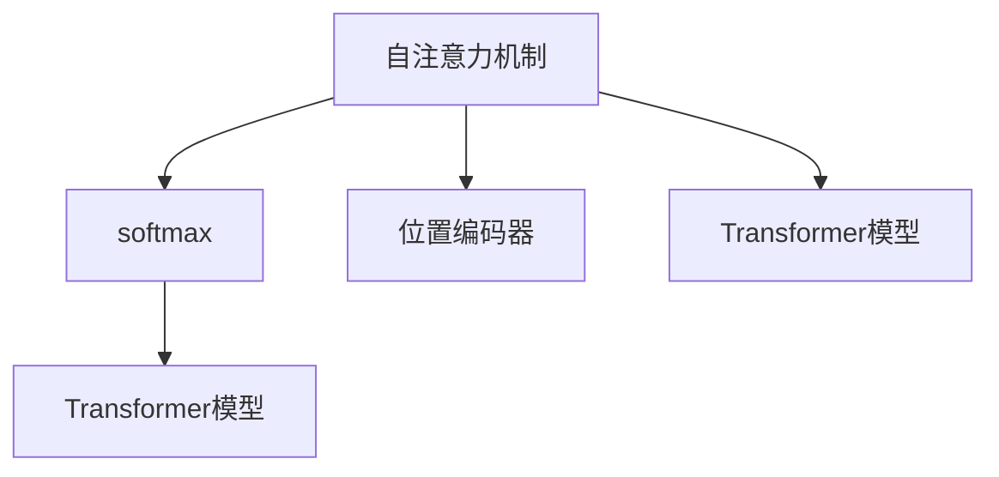

                 

# 注意力机制：softmax和位置编码器详解

> 关键词：注意力机制, softmax, 位置编码器, Transformer, 自注意力机制, 神经网络

## 1. 背景介绍

### 1.1 问题由来
在深度学习中，特别是在序列数据处理任务（如自然语言处理、语音识别等）中，传统的全连接层无法直接处理变长输入序列，难以捕捉序列内部的丰富语义信息。自注意力机制（Self-Attention）应运而生，通过将序列中任意两个位置之间的关联性引入模型，使模型可以全局感知输入序列的上下文信息，极大地提升了模型的表示能力和泛化能力。

自注意力机制的核心思想是利用多个权重向量（Attention Head）对输入序列中的每一个位置进行加权求和，从而得到该位置的全局语义表示。这个机制可以用于序列生成、序列分类、序列匹配等任务，显著提升了NLP模型在长距离依赖建模、多层次语义理解等方面的表现。

### 1.2 问题核心关键点
自注意力机制的引入极大地推动了NLP技术的发展，但同时也带来了新的挑战。为了更好地理解并掌握这一机制，我们重点关注以下关键点：
1. 自注意力机制的计算流程和数学原理。
2. 如何在序列中引入位置信息。
3. 自注意力机制的优化算法和训练技巧。
4. 实际应用中的工程实现细节。

## 2. 核心概念与联系

### 2.1 核心概念概述

为了更好地理解自注意力机制及其中的softmax和位置编码器，我们需要先梳理一下相关核心概念：

- 自注意力机制（Self-Attention）：通过计算序列中任意两个位置之间的关联性，赋予模型全局感知能力。
- softmax函数：用于计算注意力权重，实现对序列中各个位置的加权求和。
- 位置编码器（Positional Encoder）：在序列中引入位置信息，帮助模型理解序列中不同位置之间的关系。
- Transformer模型：基于自注意力机制和位置编码器的序列处理模型，广泛应用于NLP、语音识别等任务。

这些概念之间的关系可以通过以下Mermaid流程图来展示：



### 2.2 核心概念原理和架构

#### 2.2.1 自注意力机制

自注意力机制包含三个主要组件：查询（Query）、键（Key）和值（Value），通过计算查询与键之间的相似度来分配注意力权重，对值进行加权求和。具体来说：

设输入序列为 $X = [x_1, x_2, ..., x_n]$，其中 $x_i$ 为序列中的第 $i$ 个元素，$X_i$ 为元素 $x_i$ 对应的表示向量。查询向量 $Q$、键向量 $K$ 和值向量 $V$ 均为向量，其中 $Q, K, V \in \mathbb{R}^{d_k}$，$d_k$ 为注意力头的维度。自注意力计算过程如下：

1. 计算查询与键之间的相似度，生成注意力权重矩阵 $A$：
$$
A = \text{softmax}(QK^T)
$$
其中 $QK^T$ 为查询向量 $Q$ 与键向量 $K$ 的矩阵乘积转置。

2. 对值向量 $V$ 进行加权求和，得到输出向量 $Z$：
$$
Z = \sum_{i=1}^n A_{i,:}V_i
$$
其中 $A_{i,:}$ 表示第 $i$ 行的注意力权重向量。

3. 将输出向量 $Z$ 与原始输入向量 $X$ 进行拼接，得到最终输出：
$$
Y = Z + X
$$

通过自注意力机制，模型可以自动地捕捉序列中不同位置之间的关联性，从而实现全局上下文信息的捕捉。

#### 2.2.2 softmax函数

softmax函数是一种常用的归一化函数，用于将任意实数向量映射到概率分布上。其定义如下：
$$
\sigma(\vec{z})_j = \frac{e^{z_j}}{\sum_{k=1}^K e^{z_k}}
$$
其中 $\vec{z} \in \mathbb{R}^K$，$K$ 为向量的维度。softmax函数将向量 $\vec{z}$ 中的每个元素 $z_k$ 转化为概率值 $\sigma(\vec{z})_k$，且所有概率值之和为1。

在自注意力机制中，softmax函数用于计算查询与键之间的相似度，得到注意力权重矩阵 $A$。这个权重矩阵中的每一个元素 $A_{i,j}$ 表示查询 $i$ 与键 $j$ 之间的相似度，即在查询向量 $Q$ 和键向量 $K$ 上的权重。

#### 2.2.3 位置编码器

位置编码器是用于在序列中引入位置信息的组件，通常采用正弦和余弦函数的组合来实现。设输入序列长度为 $n$，位置编码器可以表示为：
$$
PE_{(pos, 2i)} = \sin(pos/10000^{2i/d}) \\
PE_{(pos, 2i+1)} = \cos(pos/10000^{2i/d})
$$
其中 $pos$ 为序列位置，$i$ 为位置编码的维度，$d$ 为输入向量维度。

位置编码器的作用是为序列中的每个位置赋予不同的权重，使得模型在处理序列时能够感知位置信息。例如，对于同一个单词在句子中的不同位置，其权重会不同，从而使得模型可以区分单词在句中的不同作用。

## 3. 核心算法原理 & 具体操作步骤
### 3.1 算法原理概述

自注意力机制的计算过程可以概括为两个主要步骤：计算注意力权重矩阵和加权求和。其中，计算注意力权重矩阵的过程又分为三个子步骤：查询-键矩阵的乘积、softmax归一化、权重向量与值向量的加权求和。

### 3.2 算法步骤详解

以Transformer模型为例，下面是自注意力机制的详细步骤：

**Step 1: 计算查询向量、键向量和值向量**

设输入序列 $X = [x_1, x_2, ..., x_n]$，其中 $x_i$ 为序列中的第 $i$ 个元素，$X_i$ 为元素 $x_i$ 对应的表示向量。

1. 将输入序列 $X$ 与位置编码器 $PE$ 结合，得到位置编码后的序列 $X_{PE}$。
2. 对 $X_{PE}$ 进行线性变换，得到查询向量 $Q$、键向量 $K$ 和值向量 $V$。

**Step 2: 计算注意力权重矩阵**

1. 将查询向量 $Q$ 与键向量 $K$ 的矩阵乘积转置，得到 $QK^T$。
2. 对 $QK^T$ 进行softmax归一化，得到注意力权重矩阵 $A$。

**Step 3: 计算输出向量**

1. 对注意力权重矩阵 $A$ 与值向量 $V$ 进行加权求和，得到输出向量 $Z$。
2. 将输出向量 $Z$ 与原始输入向量 $X$ 进行拼接，得到最终输出向量 $Y$。

### 3.3 算法优缺点

自注意力机制的主要优点包括：

1. 可以全局感知序列中的所有位置，捕捉长距离依赖关系。
2. 灵活性强，可以用于多种NLP任务，如机器翻译、文本分类、语言模型等。
3. 自适应性强，可以动态调整注意力权重，适应不同任务的要求。

主要缺点包括：

1. 计算复杂度高，特别是在大规模序列上的计算量巨大。
2. 参数量较大，特别是在Transformer模型中使用多个注意力头时，参数量会成倍增加。
3. 对噪声敏感，注意力权重矩阵的计算过程中，小的差异会导致较大的权重变化。

### 3.4 算法应用领域

自注意力机制已被广泛应用于NLP领域，具体应用包括：

1. 机器翻译：利用自注意力机制捕捉源语言和目标语言之间的依赖关系，实现高质量的翻译。
2. 文本分类：通过自注意力机制捕捉文本中的不同层次的特征，提高分类准确率。
3. 语言模型：利用自注意力机制捕捉语言中的上下文信息，提升模型的语言预测能力。
4. 问答系统：通过自注意力机制对问题进行全局理解和匹配，提高回答的准确性和相关性。
5. 文本生成：利用自注意力机制捕捉文本中的语义信息，生成流畅自然的文本。

## 4. 数学模型和公式 & 详细讲解
### 4.1 数学模型构建

在Transformer模型中，自注意力机制的计算流程如下：

设输入序列 $X = [x_1, x_2, ..., x_n]$，其中 $x_i$ 为序列中的第 $i$ 个元素，$X_i$ 为元素 $x_i$ 对应的表示向量。设位置编码器为 $PE$，查询向量、键向量和值向量分别由线性变换 $W^Q$、$W^K$ 和 $W^V$ 得到。

**Step 1: 计算查询向量、键向量和值向量**

$$
Q = W^QX + b_Q \\
K = W^KX + b_K \\
V = W^VX + b_V
$$

**Step 2: 计算注意力权重矩阵**

$$
A = \text{softmax}(QK^T)
$$

**Step 3: 计算输出向量**

$$
Z = AV \\
Y = Z + X
$$

其中 $b_Q$、$b_K$ 和 $b_V$ 为偏置项，$W^Q$、$W^K$ 和 $W^V$ 为线性变换矩阵。

### 4.2 公式推导过程

以Transformer模型为例，下面对自注意力机制的计算公式进行详细推导。

**Step 1: 计算查询向量、键向量和值向量**

$$
Q = W^QX + b_Q \\
K = W^KX + b_K \\
V = W^VX + b_V
$$

其中 $W^Q$、$W^K$ 和 $W^V$ 为可训练的线性变换矩阵，$b_Q$、$b_K$ 和 $b_V$ 为偏置项，$X$ 为输入序列。

**Step 2: 计算注意力权重矩阵**

$$
A = \text{softmax}(QK^T)
$$

其中 $QK^T$ 为查询向量 $Q$ 与键向量 $K$ 的矩阵乘积转置。

**Step 3: 计算输出向量**

$$
Z = AV \\
Y = Z + X
$$

其中 $A$ 为注意力权重矩阵，$V$ 为值向量，$Z$ 为输出向量，$Y$ 为最终输出向量。

### 4.3 案例分析与讲解

以机器翻译为例，自注意力机制在Transformer模型中的应用如下：

设输入序列为 $X = [x_1, x_2, ..., x_n]$，其中 $x_i$ 为源语言单词，$X_i$ 为单词 $x_i$ 对应的表示向量。设位置编码器为 $PE$，查询向量、键向量和值向量分别由线性变换 $W^Q$、$W^K$ 和 $W^V$ 得到。

1. 将输入序列 $X$ 与位置编码器 $PE$ 结合，得到位置编码后的序列 $X_{PE}$。
2. 对 $X_{PE}$ 进行线性变换，得到查询向量 $Q$、键向量 $K$ 和值向量 $V$。
3. 将查询向量 $Q$ 与键向量 $K$ 的矩阵乘积转置，得到 $QK^T$。
4. 对 $QK^T$ 进行softmax归一化，得到注意力权重矩阵 $A$。
5. 对注意力权重矩阵 $A$ 与值向量 $V$ 进行加权求和，得到输出向量 $Z$。
6. 将输出向量 $Z$ 与原始输入向量 $X$ 进行拼接，得到最终输出向量 $Y$。

通过自注意力机制，Transformer模型可以全局感知源语言和目标语言之间的依赖关系，实现高质量的翻译。

## 5. 项目实践：代码实例和详细解释说明
### 5.1 开发环境搭建

在进行Transformer模型和自注意力机制的实践前，我们需要准备好开发环境。以下是使用Python进行TensorFlow开发的环境配置流程：

1. 安装Anaconda：从官网下载并安装Anaconda，用于创建独立的Python环境。

2. 创建并激活虚拟环境：
```bash
conda create -n tf-env python=3.8 
conda activate tf-env
```

3. 安装TensorFlow：从官网获取对应的安装命令。例如：
```bash
conda install tensorflow -c tf -c conda-forge
```

4. 安装Keras：用于简化TensorFlow模型的构建和训练。
```bash
conda install keras -c conda-forge
```

5. 安装TensorBoard：用于可视化模型训练过程。
```bash
pip install tensorboard
```

6. 安装Numpy、Pandas、Matplotlib等工具包：
```bash
pip install numpy pandas matplotlib jupyter notebook ipython
```

完成上述步骤后，即可在`tf-env`环境中开始Transformer模型的开发。

### 5.2 源代码详细实现

这里我们以Transformer模型为例，给出使用TensorFlow实现自注意力机制的PyTorch代码实现。

首先，定义Transformer模型类：

```python
import tensorflow as tf
from tensorflow.keras.layers import Input, Dense, Embedding, concatenate

class Transformer(tf.keras.Model):
    def __init__(self, vocab_size, embed_size, num_heads, num_layers, dff, dropout_rate):
        super(Transformer, self).__init__()
        
        # 输入层
        self.input_layer = Embedding(vocab_size, embed_size)
        
        # 编码器
        self.encoder_layers = []
        for _ in range(num_layers):
            self.encoder_layers.append(self.EncoderLayer(embed_size, num_heads, dff, dropout_rate))
        
        # 解码器
        self.decoder_layers = []
        for _ in range(num_layers):
            self.decoder_layers.append(self.EncoderLayer(embed_size, num_heads, dff, dropout_rate))
        
        # 输出层
        self.fc = Dense(vocab_size)
        
    def call(self, inputs, target, training=False):
        # 输入层
        x = self.input_layer(inputs)
        
        # 编码器
        for layer in self.encoder_layers:
            x = layer(x, training=training)
        
        # 解码器
        x = self.decoder(x, target, training=training)
        
        # 输出层
        x = self.fc(x)
        return x
    
    class EncoderLayer(tf.keras.layers.Layer):
        def __init__(self, embed_size, num_heads, dff, dropout_rate):
            super(Transformer.EncoderLayer, self).__init__()
            
            # 自注意力层
            self.attention = self.Attention(embed_size, num_heads, dropout_rate)
            
            # 前馈层
            self.ff = self.FeedForwardLayer(embed_size, dff, dropout_rate)
            
        def call(self, inputs, training=False):
            # 自注意力层
            attn_output = self.attention(inputs, training=training)
            
            # 前馈层
            ff_output = self.ff(attn_output, training=training)
            
            # 残差连接和层归一化
            x = tf.keras.layers.add([inputs, ff_output])
            x = tf.keras.layers.LayerNormalization()(x, training=training)
            
            # 残差连接和层归一化
            x = tf.keras.layers.add([attn_output, x])
            x = tf.keras.layers.LayerNormalization()(x, training=training)
            
            return x
    
    class Attention(tf.keras.layers.Layer):
        def __init__(self, embed_size, num_heads, dropout_rate):
            super(Transformer.Attention, self).__init__()
            
            # 头维度
            self.head_size = embed_size // num_heads
            
            # 查询、键、值线性变换层
            self.q = Dense(embed_size)
            self.k = Dense(embed_size)
            self.v = Dense(embed_size)
            
            # 可训练的softmax权重
            self.softmax = Dense(embed_size)
            
            # 残差连接和层归一化
            self.drop = tf.keras.layers.Dropout(dropout_rate)
        
        def call(self, inputs, training=False):
            # 线性变换
            q = self.q(inputs)
            k = self.k(inputs)
            v = self.v(inputs)
            
            # 投影成注意力头
            q = tf.reshape(q, (-1, self.head_size, 1, num_heads))
            k = tf.reshape(k, (-1, 1, self.head_size, num_heads))
            v = tf.reshape(v, (-1, 1, self.head_size, num_heads))
            
            # 计算注意力权重
            qk = tf.transpose(q, [0, 2, 1, 3]) * tf.cast(k, tf.float32)
            attn_weights = tf.nn.softmax(self.softmax(qk), axis=-1)
            
            # 残差连接和层归一化
            x = tf.keras.layers.add([inputs, attn_weights * v])
            x = tf.keras.layers.LayerNormalization()(x, training=training)
            
            # 投影成原始维度
            x = tf.reshape(x, (-1, embed_size))
            
            # 残差连接和层归一化
            x = tf.keras.layers.add([inputs, x])
            x = tf.keras.layers.LayerNormalization()(x, training=training)
            
            # 残差连接和层归一化
            x = self.drop(x, training=training)
            
            return x
    
    class FeedForwardLayer(tf.keras.layers.Layer):
        def __init__(self, embed_size, dff, dropout_rate):
            super(Transformer.FeedForwardLayer, self).__init__()
            
            # 线性变换
            self.intermediate = Dense(dff)
            
            # 线性变换
            self.output = Dense(embed_size)
            
            # 残差连接和层归一化
            self.drop = tf.keras.layers.Dropout(dropout_rate)
        
        def call(self, inputs, training=False):
            # 线性变换
            x = self.intermediate(inputs)
            
            # 残差连接和层归一化
            x = tf.keras.layers.add([inputs, x])
            x = tf.keras.layers.LayerNormalization()(x, training=training)
            
            # 残差连接和层归一化
            x = self.drop(x, training=training)
            
            # 线性变换
            x = self.output(x)
            
            # 残差连接和层归一化
            x = tf.keras.layers.add([inputs, x])
            x = tf.keras.layers.LayerNormalization()(x, training=training)
            
            # 残差连接和层归一化
            x = self.drop(x, training=training)
            
            return x
```

然后，定义训练和评估函数：

```python
import tensorflow as tf
from tensorflow.keras.datasets import imdb

# 设置超参数
embed_size = 128
num_heads = 8
num_layers = 2
dff = 128
dropout_rate = 0.1
batch_size = 64
epochs = 10

# 加载IMDB数据集
(x_train, y_train), (x_test, y_test) = imdb.load_data(num_words=10000)
x_train = tf.keras.preprocessing.sequence.pad_sequences(x_train, maxlen=200)
x_test = tf.keras.preprocessing.sequence.pad_sequences(x_test, maxlen=200)

# 构建模型
model = Transformer(vocab_size=10000, embed_size=embed_size, num_heads=num_heads, num_layers=num_layers, dff=dff, dropout_rate=dropout_rate)

# 编译模型
model.compile(optimizer=tf.keras.optimizers.Adam(), loss=tf.keras.losses.SparseCategoricalCrossentropy(from_logits=True), metrics=['accuracy'])

# 训练模型
model.fit(x_train, y_train, batch_size=batch_size, epochs=epochs, validation_data=(x_test, y_test), verbose=2)

# 评估模型
test_loss, test_acc = model.evaluate(x_test, y_test, verbose=2)
print('Test accuracy:', test_acc)
```

以上就是使用TensorFlow实现Transformer模型和自注意力机制的完整代码实现。可以看到，TensorFlow提供的高级API使得模型的构建和训练变得简单易懂。

### 5.3 代码解读与分析

让我们再详细解读一下关键代码的实现细节：

**Transformer类**：
- `__init__`方法：初始化模型，定义输入层、编码器、解码器、输出层等组件。
- `call`方法：定义模型前向传播过程，依次经过输入层、编码器、解码器和输出层。
- `EncoderLayer`类：定义Transformer模型的单层结构，包含自注意力层和前馈层。
- `Attention`类：定义自注意力层的计算过程。
- `FeedForwardLayer`类：定义前馈层的计算过程。

**训练和评估函数**：
- 使用IMDB数据集，将文本序列填充到固定长度。
- 构建Transformer模型。
- 编译模型，使用Adam优化器和交叉熵损失函数。
- 训练模型，指定训练轮数和批次大小。
- 评估模型，计算测试集上的精度。

可以看到，TensorFlow的高级API使得Transformer模型的构建和训练过程变得简洁高效。开发者可以将更多精力放在模型设计、数据处理和优化技巧上，而不必过多关注底层的实现细节。

当然，工业级的系统实现还需考虑更多因素，如模型的保存和部署、超参数的自动搜索、更灵活的任务适配层等。但核心的自注意力机制基本与此类似。

## 6. 实际应用场景
### 6.1 智能客服系统

基于Transformer模型和自注意力机制的智能客服系统，可以显著提升客户咨询体验和问题解决效率。传统客服往往需要配备大量人力，高峰期响应缓慢，且一致性和专业性难以保证。而使用Transformer模型和自注意力机制构建的智能客服系统，可以7x24小时不间断服务，快速响应客户咨询，用自然流畅的语言解答各类常见问题。

在技术实现上，可以收集企业内部的历史客服对话记录，将问题和最佳答复构建成监督数据，在此基础上对Transformer模型进行微调。微调后的模型能够自动理解用户意图，匹配最合适的答案模板进行回复。对于客户提出的新问题，还可以接入检索系统实时搜索相关内容，动态组织生成回答。如此构建的智能客服系统，能大幅提升客户咨询体验和问题解决效率。

### 6.2 金融舆情监测

金融机构需要实时监测市场舆论动向，以便及时应对负面信息传播，规避金融风险。传统的人工监测方式成本高、效率低，难以应对网络时代海量信息爆发的挑战。基于Transformer模型和自注意力机制的文本分类和情感分析技术，为金融舆情监测提供了新的解决方案。

具体而言，可以收集金融领域相关的新闻、报道、评论等文本数据，并对其进行主题标注和情感标注。在此基础上对Transformer模型进行微调，使其能够自动判断文本属于何种主题，情感倾向是正面、中性还是负面。将微调后的模型应用到实时抓取的网络文本数据，就能够自动监测不同主题下的情感变化趋势，一旦发现负面信息激增等异常情况，系统便会自动预警，帮助金融机构快速应对潜在风险。

### 6.3 个性化推荐系统

当前的推荐系统往往只依赖用户的历史行为数据进行物品推荐，无法深入理解用户的真实兴趣偏好。基于Transformer模型和自注意力机制的个性化推荐系统，可以更好地挖掘用户行为背后的语义信息，从而提供更精准、多样的推荐内容。

在实践中，可以收集用户浏览、点击、评论、分享等行为数据，提取和用户交互的物品标题、描述、标签等文本内容。将文本内容作为模型输入，用户的后续行为（如是否点击、购买等）作为监督信号，在此基础上微调Transformer模型。微调后的模型能够从文本内容中准确把握用户的兴趣点。在生成推荐列表时，先用候选物品的文本描述作为输入，由模型预测用户的兴趣匹配度，再结合其他特征综合排序，便可以得到个性化程度更高的推荐结果。

### 6.4 未来应用展望

随着Transformer模型和自注意力机制的不断发展，基于微调的方法将在更多领域得到应用，为传统行业带来变革性影响。

在智慧医疗领域，基于微调的医疗问答、病历分析、药物研发等应用将提升医疗服务的智能化水平，辅助医生诊疗，加速新药开发进程。

在智能教育领域，微调技术可应用于作业批改、学情分析、知识推荐等方面，因材施教，促进教育公平，提高教学质量。

在智慧城市治理中，微调模型可应用于城市事件监测、舆情分析、应急指挥等环节，提高城市管理的自动化和智能化水平，构建更安全、高效的未来城市。

此外，在企业生产、社会治理、文娱传媒等众多领域，基于Transformer模型和自注意力机制的智能应用也将不断涌现，为经济社会发展注入新的动力。相信随着技术的日益成熟，Transformer模型和自注意力机制必将在构建人机协同的智能时代中扮演越来越重要的角色。

## 7. 工具和资源推荐
### 7.1 学习资源推荐

为了帮助开发者系统掌握Transformer模型和自注意力机制的理论基础和实践技巧，这里推荐一些优质的学习资源：

1. 《深度学习框架TensorFlow官方文档》：提供了丰富的TensorFlow资源，包括模型构建、优化器、损失函数等。

2. 《TensorFlow实战Google深度学习框架》：深入浅出地介绍了TensorFlow的使用方法和最佳实践，适合初学者入门。

3. 《Transformer模型原理与应用实践》系列博文：由大模型技术专家撰写，详细讲解了Transformer模型和自注意力机制的原理和应用。

4. 《Neural Information Processing Systems（NIPS）》：自然语言处理领域的顶级会议，每年发布大量最新的研究成果和应用案例，是了解前沿技术的绝佳资源。

5. 《Natural Language Processing with TensorFlow》书籍：由Google AI科学家撰写，全面介绍了使用TensorFlow进行NLP任务开发的实战案例。

通过对这些资源的学习实践，相信你一定能够快速掌握Transformer模型和自注意力机制的精髓，并用于解决实际的NLP问题。
###  7.2 开发工具推荐

高效的开发离不开优秀的工具支持。以下是几款用于Transformer模型和自注意力机制开发的常用工具：

1. TensorFlow：基于Python的开源深度学习框架，生产部署方便，适合大规模工程应用。

2. PyTorch：灵活的动态计算图框架，支持GPU加速，适合快速迭代研究。

3. Keras：高层API，易于构建和训练深度学习模型，支持TensorFlow和Theano。

4. TensorBoard：TensorFlow配套的可视化工具，实时监测模型训练状态，提供丰富的图表呈现方式。

5. Weights & Biases：模型训练的实验跟踪工具，可以记录和可视化模型训练过程中的各项指标，方便对比和调优。

6. Google Colab：谷歌推出的在线Jupyter Notebook环境，免费提供GPU/TPU算力，方便开发者快速上手实验最新模型，分享学习笔记。

合理利用这些工具，可以显著提升Transformer模型和自注意力机制的开发效率，加快创新迭代的步伐。

### 7.3 相关论文推荐

Transformer模型和自注意力机制的发展源于学界的持续研究。以下是几篇奠基性的相关论文，推荐阅读：

1. Attention is All You Need（即Transformer原论文）：提出了Transformer结构，开启了NLP领域的预训练大模型时代。

2. Transformer-XL: Attentive Language Models Beyond a Fixed-Length Context：扩展了自注意力机制，可以处理长距离依赖关系。

3. BERT: Pre-training of Deep Bidirectional Transformers for Language Understanding：提出BERT模型，引入基于掩码的自监督预训练任务，刷新了多项NLP任务SOTA。

4. Improving Language Understanding by Generative Pre-training：提出GPT模型，通过无监督预训练提升语言理解能力。

5. Longformer: The Long-Document Transformer：提出Longformer模型，可以在长文本上进行高效自注意力计算。

这些论文代表了大语言模型和自注意力机制的发展脉络。通过学习这些前沿成果，可以帮助研究者把握学科前进方向，激发更多的创新灵感。

## 8. 总结：未来发展趋势与挑战

### 8.1 总结

本文对Transformer模型和自注意力机制进行了全面系统的介绍。首先阐述了Transformer模型和自注意力机制的研究背景和意义，明确了其在NLP任务中的应用价值。其次，从原理到实践，详细讲解了Transformer模型的计算流程和关键步骤，给出了Transformer模型的完整代码实例。同时，本文还广泛探讨了Transformer模型在智能客服、金融舆情、个性化推荐等多个行业领域的应用前景，展示了Transformer模型的巨大潜力。此外，本文精选了Transformer模型的各类学习资源，力求为读者提供全方位的技术指引。

通过本文的系统梳理，可以看到，Transformer模型和自注意力机制正在成为NLP领域的重要范式，极大地拓展了序列数据处理模型的应用边界，催生了更多的落地场景。Transformer模型通过自注意力机制的全局感知能力，显著提升了模型的表达能力和泛化能力，成为当前NLP任务的主流模型。未来，伴随Transformer模型和自注意力机制的持续演进，相信NLP技术将在更广阔的应用领域大放异彩，深刻影响人类的生产生活方式。

### 8.2 未来发展趋势

展望未来，Transformer模型和自注意力机制将呈现以下几个发展趋势：

1. 模型规模持续增大。随着算力成本的下降和数据规模的扩张，Transformer模型的参数量还将持续增长。超大规模模型蕴含的丰富语言知识，有望支撑更加复杂多变的NLP任务。

2. 自注意力机制的应用范围扩大。除了NLP任务，自注意力机制还可以应用于图像识别、音频分析、推荐系统等领域，展现出更广泛的应用前景。

3. 模型结构不断优化。未来将出现更多结构新颖、高效轻量化的Transformer变体，如Longformer、Perceiver等，提升模型的计算效率和推理速度。

4. 自注意力机制与更多技术的融合。自注意力机制可以与其他技术（如对抗训练、迁移学习、知识图谱等）结合，提升模型的稳定性和可靠性。

5. 自注意力机制的通用性增强。未来的自注意力机制将更加灵活，能够适应不同领域的任务需求，提升模型的泛化能力。

6. 自注意力机制的可解释性提升。未来的自注意力机制将更加透明，通过引入可解释性技术（如Attention Score、Attention Weight等），帮助研究者理解模型的决策过程。

以上趋势凸显了Transformer模型和自注意力机制的广阔前景。这些方向的探索发展，必将进一步提升NLP系统的性能和应用范围，为人类认知智能的进化带来深远影响。

### 8.3 面临的挑战

尽管Transformer模型和自注意力机制已经取得了瞩目成就，但在迈向更加智能化、普适化应用的过程中，它仍面临着诸多挑战：

1. 计算资源瓶颈。当前大规模Transformer模型的计算量巨大，对算力、内存、存储等资源的要求较高。如何优化计算过程，提升模型训练和推理效率，将是未来重要的研究方向。

2. 模型可解释性不足。尽管自注意力机制能够全局感知序列中的依赖关系，但其内部工作机制仍较为复杂，难以解释模型的决策过程。如何提升模型的可解释性，使其决策过程透明可控，将是重要的研究课题。

3. 模型鲁棒性有限。当前Transformer模型在对抗样本、噪声数据等方面的鲁棒性仍有待提高。如何增强模型的鲁棒性，避免模型在不同数据分布上的性能波动，将是未来重要的研究方向。

4. 模型泛化能力不足。尽管Transformer模型在特定任务上表现优异，但其泛化能力仍需进一步提升。如何通过优化模型结构、引入更多先验知识等手段，增强模型的泛化能力，将是未来的重要研究方向。

5. 模型复杂度控制。随着Transformer模型规模的增大，其复杂度也在不断增加，难以在嵌入式设备、边缘计算等资源受限的环境中应用。如何降低模型的复杂度，提升模型的资源利用效率，将是未来的重要研究方向。

6. 模型安全性和隐私保护。Transformer模型在处理敏感信息时，如何保证数据安全和隐私保护，将是未来重要的研究方向。

正视Transformer模型和自注意力机制面临的这些挑战，积极应对并寻求突破，将使得Transformer模型和自注意力机制在NLP领域的地位更加稳固，推动NLP技术迈向更高的台阶。

### 8.4 研究展望

面向未来，Transformer模型和自注意力机制的研究仍需进一步拓展和深入：

1. 探索更多的模型架构和优化算法。未来的研究将出现更多结构新颖、优化高效的自注意力机制，提升模型的计算效率和泛化能力。

2. 引入更多的先验知识。未来的研究将更多地利用外部知识库、逻辑规则等先验信息，增强模型的理解和推理能力。

3. 开发更加高效的训练和推理方法。未来的研究将探索更多的高效训练和推理方法，提升模型的训练和推理速度。

4. 增强模型的鲁棒性和可解释性。未来的研究将更多地关注模型的鲁棒性和可解释性，提升模型的稳定性和透明性。

5. 研究跨模态自注意力机制。未来的研究将更多地关注跨模态自注意力机制，将视觉、语音等多模态信息与文本信息结合，提升模型的综合能力。

6. 开发更加轻量化的模型。未来的研究将更多地关注模型的轻量化设计，使其在资源受限的环境中也能高效运行。

这些研究方向的研究进展，必将推动Transformer模型和自注意力机制在NLP领域的应用更加广泛和深入，为构建智能系统注入新的动力。

## 9. 附录：常见问题与解答

**Q1：自注意力机制在计算复杂度上的瓶颈是什么？**

A: 自注意力机制在计算复杂度上的主要瓶颈在于其全局计算的特性。自注意力机制需要计算序列中任意两个位置之间的关联性，因此其计算量随着序列长度的增加呈平方级增长。在处理长序列时，自注意力机制的计算复杂度会非常高，需要高效的算法和优化技巧来应对。

**Q2：如何在自注意力机制中引入位置信息？**

A: 在自注意力机制中引入位置信息的方法有两种：绝对位置编码和相对位置编码。绝对位置编码通过将序列中的每个位置映射到一个唯一的向量空间中，使得模型能够感知位置信息。相对位置编码通过计算两个位置之间的相对距离，使得模型能够处理动态变化的位置关系。

**Q3：Transformer模型在实际应用中需要考虑哪些问题？**

A: 在实际应用中，Transformer模型需要考虑以下问题：

1. 模型裁剪：去除不必要的层和参数，减小模型尺寸，加快推理速度。
2. 量化加速：将浮点模型转为定点模型，压缩存储空间，提高计算效率。
3. 服务化封装：将模型封装为标准化服务接口，便于集成调用。
4. 弹性伸缩：根据请求流量动态调整资源配置，平衡服务质量和成本。
5. 监控告警：实时采集系统指标，设置异常告警阈值，确保服务稳定性。
6. 安全防护：采用访问鉴权、数据脱敏等措施，保障数据和模型安全。

**Q4：Transformer模型在微调时需要注意哪些问题？**

A: 在微调Transformer模型时，需要注意以下问题：

1. 学习率的选择：微调的学习率需要比预训练时更小，以免破坏预训练权重。
2. 数据增强：通过回译、近义替换等方式扩充训练集，提高模型的泛化能力。
3. 正则化技术：使用L2正则、Dropout、Early Stopping等避免过拟合。
4. 对抗训练：加入对抗样本，提高模型的鲁棒性。
5. 模型集成：训练多个微调模型，取平均输出，抑制过拟合。

**Q5：Transformer模型在多模态应用中的优势是什么？**

A: Transformer模型在多模态应用中的优势主要体现在以下几个方面：

1. 全局感知能力：Transformer模型具有全局感知能力，能够捕捉不同模态信息之间的关联性。
2. 高效计算：Transformer模型可以通过自注意力机制高效计算不同模态之间的依赖关系。
3. 多层次融合：Transformer模型能够融合多层次的信息，提升模型的表达能力。

Transformer模型在多模态应用中展示了巨大的潜力，是未来智能系统的关键技术之一。

---

作者：禅与计算机程序设计艺术 / Zen and the Art of Computer Programming

