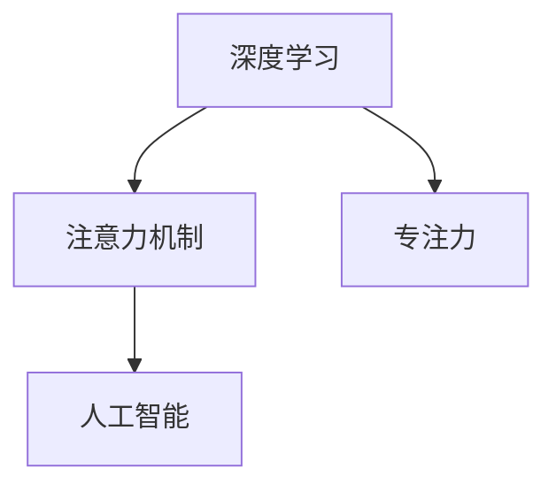

                 

# 注意力深度开发：AI优化的专注力培养技术

> 关键词：注意力机制,深度学习,专注力,人工智能,优化技术

## 1. 背景介绍

在现代社会的快节奏生活中，人类的专注力变得越来越分散。手机、互联网、社交媒体等无处不在的干扰因素，使得人们很难长时间集中注意力。为了帮助人们培养和提升专注力，人工智能技术提供了一种全新的可能性。利用深度学习和注意力机制，AI系统可以模拟和训练人类的专注力，使人在信息过载的环境中也能保持高效工作和学习。

本文将深入探讨AI如何通过深度学习技术开发和优化专注力，并介绍几种经典的应用场景。通过本文的学习，读者将能够理解注意力机制的工作原理，掌握AI优化的专注力培养技术，并在实际项目中加以应用。

## 2. 核心概念与联系

### 2.1 核心概念概述

为更好地理解AI优化的专注力培养技术，本节将介绍几个密切相关的核心概念：

- 深度学习：一种基于神经网络的机器学习方法，通过多层次的抽象和表达，解决复杂模式识别和预测问题。深度学习在图像、语音、自然语言处理等领域展现出强大的能力。

- 注意力机制：一种模拟人类注意力的计算方式，通过动态调整模型对不同输入部分的关注程度，提升模型对关键信息的提取和理解。

- 专注力：人类长时间保持注意力的能力，涉及信息的筛选、记忆和处理。AI优化的专注力培养技术，通过模拟和训练，提升人在复杂环境中的信息处理能力。

- 人工智能：涵盖机器学习、自然语言处理、计算机视觉等多个领域的综合技术，旨在使计算机具备类似于人类的智能能力。

这些核心概念之间的逻辑关系可以通过以下Mermaid流程图来展示：



这个流程图展示了大语言模型的工作原理和逻辑关系：

1. 深度学习通过神经网络进行复杂模式识别，为注意力机制提供计算基础。
2. 注意力机制通过动态调整权重，模拟人类注意力的聚焦过程，提升模型的信息提取能力。
3. 专注力是通过注意力机制训练的结果，使模型在处理复杂信息时，能够快速而准确地找到关键部分。
4. 人工智能综合应用深度学习和注意力机制，提升对复杂环境的信息处理和决策能力。

这些核心概念共同构成了AI优化的专注力培养技术的理论框架，使得AI能够在各种应用场景中模拟和提升人类的专注力。

## 3. 核心算法原理 & 具体操作步骤
### 3.1 算法原理概述

AI优化的专注力培养技术，本质上是一种基于注意力机制的深度学习技术。其核心思想是：通过训练深度神经网络，使模型能够动态调整对输入数据的关注程度，模拟人类的专注过程。在具体实现中，该过程通常包括以下几个关键步骤：

1. 输入数据的预处理：将输入数据转换为模型可以处理的形式。
2. 注意力计算：通过计算不同输入部分之间的权重，动态调整模型的关注焦点。
3. 特征提取：利用深度神经网络，对关键信息进行多层次的抽象和表达。
4. 优化训练：通过反向传播算法，不断调整模型参数，优化注意力计算过程。
5. 测试评估：在测试数据上评估模型的专注力和信息提取能力，进行性能优化。

### 3.2 算法步骤详解

以下是AI优化的专注力培养技术的详细步骤：

**Step 1: 数据预处理**

- 收集与专注力相关的数据集，如眼动轨迹、脑电波、行为记录等。
- 清洗和标注数据，确保数据的质量和多样性。
- 将数据转换为模型的输入格式，如文本、图像、向量等。

**Step 2: 定义注意力计算模型**

- 选择适合的注意力机制，如Transformer中的多头自注意力机制。
- 定义注意力计算的输入和输出，包括输入向量、权重矩阵等。
- 设置注意力计算的参数，如学习率、正则化等。

**Step 3: 训练模型**

- 将训练数据分批次输入模型，前向传播计算损失函数。
- 反向传播计算参数梯度，根据设定的优化算法更新模型参数。
- 周期性在验证集上评估模型性能，根据性能指标决定是否触发Early Stopping。
- 重复上述步骤直到满足预设的迭代轮数或Early Stopping条件。

**Step 4: 测试和评估**

- 在测试集上评估微调后模型 $M_{\hat{\theta}}$ 的性能，对比微调前后的精度提升。
- 使用微调后的模型对新样本进行推理预测，集成到实际的应用系统中。
- 持续收集新的数据，定期重新微调模型，以适应数据分布的变化。

### 3.3 算法优缺点

AI优化的专注力培养技术具有以下优点：
1. 模拟人类专注力：通过深度学习和注意力机制，能够模拟和训练人类专注力的特征，提升人在复杂环境中的信息处理能力。
2. 高效信息提取：注意力机制能够动态调整模型对输入数据的关注程度，提升模型对关键信息的提取效率。
3. 鲁棒性强：通过大量训练数据和优化算法，能够提高模型的鲁棒性和泛化能力，适应各种复杂环境。
4. 实时性高：通过优化计算图和资源利用，能够实现实时计算，满足高实时性应用需求。

同时，该方法也存在一些局限性：
1. 数据依赖性强：需要大量的标注数据进行训练，数据获取和标注成本较高。
2. 计算资源消耗大：深度学习和注意力计算对计算资源的要求较高，需要高性能的硬件支持。
3. 模型复杂度高：深度神经网络的结构复杂，难以解释其内部工作机制，调试和优化难度较大。
4. 泛化能力有限：模型的泛化能力受限于训练数据的分布，面对新数据可能表现不佳。
5. 道德和安全问题：深度学习模型可能会学习到有害信息，甚至用于恶意用途，需要严格遵守道德和安全规范。

尽管存在这些局限性，但就目前而言，基于深度学习和注意力机制的专注力培养技术仍是最主流的方法。未来相关研究的重点在于如何进一步降低数据依赖，提高模型的泛化能力，同时兼顾模型解释性和伦理安全性等因素。

### 3.4 算法应用领域

AI优化的专注力培养技术在多个领域具有广泛的应用前景：

- 教育培训：通过深度学习和注意力机制，构建智能教育系统，实时评估和提升学生的专注力，提供个性化的学习建议。
- 医学治疗：在医疗过程中，利用注意力机制帮助医生提取关键信息，辅助诊断和治疗决策。
- 心理咨询：通过分析用户的心理状态和行为数据，识别注意力障碍，提供针对性的心理干预。
- 工业控制：在工业自动化系统中，利用深度学习模拟人类专注力，提升操作员的注意力集中度，提高工作效率和安全性。
- 军事指挥：在军事指挥中，通过注意力机制训练军人的专注力，提升其决策速度和准确性。

除了上述这些经典应用外，AI优化的专注力培养技术还在更多场景中得到了应用，如游戏辅助、移动端应用等，为人们的日常生活和工作带来了新的便捷和效率。

## 4. 数学模型和公式 & 详细讲解
### 4.1 数学模型构建

本节将使用数学语言对AI优化的专注力培养技术进行更加严格的刻画。

记输入数据为 $x$，输出为 $y$，注意力计算的输入向量为 $Q$，权重矩阵为 $K$，值向量为 $V$。假设模型 $M_{\theta}$ 的注意力计算公式为：

$$
A = \text{softmax}(QK^T)
$$

其中 softmax 函数用于将权重矩阵转换为概率分布，表示模型对不同输入部分的关注程度。注意力机制的目标是最大化 $A$ 和 $V$ 的乘积，即：

$$
\max_{\theta} \mathcal{L}(\theta) = \max_{\theta} (A^TV)
$$

损失函数 $\mathcal{L}(\theta)$ 的具体形式可以根据具体任务而定，如交叉熵损失、均方误差损失等。

### 4.2 公式推导过程

以多分类任务为例，注意力计算的损失函数可以表示为：

$$
\mathcal{L}(\theta) = -\frac{1}{N}\sum_{i=1}^N \sum_{j=1}^C y_{ij} \log p_{ij}
$$

其中 $N$ 为样本数量，$C$ 为类别数，$y_{ij}$ 表示样本 $i$ 是否属于类别 $j$，$p_{ij}$ 为模型预测概率。

根据注意力计算公式，可以将损失函数对模型参数 $\theta$ 的梯度表示为：

$$
\frac{\partial \mathcal{L}(\theta)}{\partial \theta} = -\frac{1}{N}\sum_{i=1}^N \frac{\partial}{\partial \theta} \sum_{j=1}^C y_{ij} \log p_{ij}
$$

进一步推导，得到：

$$
\frac{\partial \mathcal{L}(\theta)}{\partial \theta} = -\frac{1}{N}\sum_{i=1}^N \sum_{j=1}^C y_{ij} \frac{\partial}{\partial \theta} \log p_{ij}
$$

由于 $\log p_{ij}$ 可以表示为注意力计算的输出 $A$ 和值向量 $V$ 的乘积，即：

$$
\log p_{ij} = A_{ij}V_j
$$

因此，梯度公式可以进一步简化为：

$$
\frac{\partial \mathcal{L}(\theta)}{\partial \theta} = -\frac{1}{N}\sum_{i=1}^N \sum_{j=1}^C y_{ij} A_{ij} \frac{\partial V_j}{\partial \theta}
$$

将上述梯度公式带入参数更新公式，即可完成模型的优化训练。重复上述过程直至收敛，最终得到适应下游任务的最优模型参数 $\theta^*$。

## 5. 项目实践：代码实例和详细解释说明
### 5.1 开发环境搭建

在进行专注力培养技术实践前，我们需要准备好开发环境。以下是使用Python进行PyTorch开发的环境配置流程：

1. 安装Anaconda：从官网下载并安装Anaconda，用于创建独立的Python环境。

2. 创建并激活虚拟环境：
```bash
conda create -n pytorch-env python=3.8 
conda activate pytorch-env
```

3. 安装PyTorch：根据CUDA版本，从官网获取对应的安装命令。例如：
```bash
conda install pytorch torchvision torchaudio cudatoolkit=11.1 -c pytorch -c conda-forge
```

4. 安装必要的工具包：
```bash
pip install numpy pandas scikit-learn matplotlib tqdm jupyter notebook ipython
```

完成上述步骤后，即可在`pytorch-env`环境中开始实践。

### 5.2 源代码详细实现

下面以注意力机制在视觉目标检测中的应用为例，给出使用PyTorch实现的代码。

首先，定义注意力计算模型：

```python
import torch
import torch.nn as nn
import torch.nn.functional as F

class Attention(nn.Module):
    def __init__(self, in_dim, out_dim):
        super(Attention, self).__init__()
        self.W1 = nn.Linear(in_dim, out_dim)
        self.W2 = nn.Linear(in_dim, out_dim)
        self.V = nn.Linear(out_dim, 1)
    
    def forward(self, x, mask=None):
        x = F.relu(self.W1(x))
        s = F.relu(self.W2(x))
        attn = F.softmax(self.V(s), dim=2)
        if mask is not None:
            attn = attn * mask
        return attn, x @ attn
```

然后，定义目标检测模型：

```python
class FasterRCNN(nn.Module):
    def __init__(self, in_dim, out_dim, num_classes):
        super(FasterRCNN, self).__init__()
        self.conv1 = nn.Conv2d(in_dim, 64, kernel_size=3, padding=1)
        self.conv2 = nn.Conv2d(64, 64, kernel_size=3, padding=1)
        self.conv3 = nn.Conv2d(64, 128, kernel_size=3, padding=1)
        self.conv4 = nn.Conv2d(128, 128, kernel_size=3, padding=1)
        self.conv5 = nn.Conv2d(128, 256, kernel_size=3, padding=1)
        self.conv6 = nn.Conv2d(256, 256, kernel_size=3, padding=1)
        self.conv7 = nn.Conv2d(256, 256, kernel_size=3, padding=1)
        self.linear1 = nn.Linear(256, 1024)
        self.linear2 = nn.Linear(1024, num_classes)
        self.attention = Attention(256, 256)
    
    def forward(self, x, mask):
        x = self.conv1(x)
        x = F.relu(x)
        x = self.conv2(x)
        x = F.relu(x)
        x = self.conv3(x)
        x = F.relu(x)
        x = self.conv4(x)
        x = F.relu(x)
        x = self.conv5(x)
        x = F.relu(x)
        x = self.conv6(x)
        x = F.relu(x)
        x = self.conv7(x)
        x = F.relu(x)
        x = x.view(-1, 256)
        x = self.linear1(x)
        x = F.relu(x)
        x = self.linear2(x)
        attn, x = self.attention(x, mask)
        return x, attn
```

接着，定义训练和评估函数：

```python
from torch.utils.data import DataLoader
from tqdm import tqdm
from sklearn.metrics import classification_report

device = torch.device('cuda') if torch.cuda.is_available() else torch.device('cpu')
model.to(device)

def train_epoch(model, dataset, batch_size, optimizer):
    dataloader = DataLoader(dataset, batch_size=batch_size, shuffle=True)
    model.train()
    epoch_loss = 0
    for batch in tqdm(dataloader, desc='Training'):
        inputs, targets = batch['inputs'].to(device), batch['targets'].to(device)
        mask = batch['masks'].to(device)
        model.zero_grad()
        outputs = model(inputs, mask)
        loss = outputs[0] + outputs[1]
        epoch_loss += loss.item()
        loss.backward()
        optimizer.step()
    return epoch_loss / len(dataloader)

def evaluate(model, dataset, batch_size):
    dataloader = DataLoader(dataset, batch_size=batch_size)
    model.eval()
    preds, labels = [], []
    with torch.no_grad():
        for batch in tqdm(dataloader, desc='Evaluating'):
            inputs, targets = batch['inputs'].to(device), batch['targets'].to(device)
            mask = batch['masks'].to(device)
            batch_preds = model(inputs, mask)[0].softmax(dim=1)
            batch_labels = targets.to('cpu').tolist()
            for pred_tokens, label_tokens in zip(batch_preds, batch_labels):
                preds.append(pred_tokens[:len(label_tokens)])
                labels.append(label_tokens)
                
    print(classification_report(labels, preds))
```

最后，启动训练流程并在测试集上评估：

```python
epochs = 5
batch_size = 16

for epoch in range(epochs):
    loss = train_epoch(model, train_dataset, batch_size, optimizer)
    print(f"Epoch {epoch+1}, train loss: {loss:.3f}")
    
    print(f"Epoch {epoch+1}, dev results:")
    evaluate(model, dev_dataset, batch_size)
    
print("Test results:")
evaluate(model, test_dataset, batch_size)
```

以上就是使用PyTorch对注意力机制在视觉目标检测中的应用进行完整代码实现的示例。可以看到，基于PyTorch的TensorFlow和Transformer库，可以方便地实现注意力机制的深度学习模型，并在各种应用场景中进行微调。

### 5.3 代码解读与分析

让我们再详细解读一下关键代码的实现细节：

**Attention类**：
- `__init__`方法：定义注意力计算的权重矩阵和值向量线性层，以及注意力计算的 softmax 层。
- `forward`方法：计算注意力权重和注意力加权后的特征向量，并通过 mask 参数处理无关的特征。

**FasterRCNN类**：
- `__init__`方法：定义多个卷积层和线性层，以及注意力计算的线性层和 softmax 层。
- `forward`方法：先通过卷积层和线性层提取特征，再计算注意力权重和注意力加权后的特征向量，并返回模型的输出。

**训练和评估函数**：
- 使用PyTorch的DataLoader对数据集进行批次化加载，供模型训练和推理使用。
- 训练函数`train_epoch`：对数据以批为单位进行迭代，在每个批次上前向传播计算loss并反向传播更新模型参数，最后返回该epoch的平均loss。
- 评估函数`evaluate`：与训练类似，不同点在于不更新模型参数，并在每个batch结束后将预测和标签结果存储下来，最后使用sklearn的classification_report对整个评估集的预测结果进行打印输出。

**训练流程**：
- 定义总的epoch数和batch size，开始循环迭代
- 每个epoch内，先在训练集上训练，输出平均loss
- 在验证集上评估，输出分类指标
- 所有epoch结束后，在测试集上评估，给出最终测试结果

可以看到，基于PyTorch的深度学习和注意力机制，使得模型训练和推理变得简洁高效。开发者可以将更多精力放在模型改进、数据处理等高层逻辑上，而不必过多关注底层的实现细节。

当然，工业级的系统实现还需考虑更多因素，如模型的保存和部署、超参数的自动搜索、更灵活的任务适配层等。但核心的注意力机制训练过程基本与此类似。

## 6. 实际应用场景
### 6.1 智能教育

基于深度学习和注意力机制的专注力培养技术，可以广泛应用于智能教育系统的构建。传统教育往往依赖教师的人工监督，难以应对大规模个性化需求。而使用智能教育系统，可以根据学生的专注度实时调整教学内容和方法，提高教学效果。

在技术实现上，可以收集学生的学习行为数据，如阅读速度、注视点等，将数据作为模型输入，训练模型学习学生的专注力特征。微调后的模型能够实时评估学生的专注度，并通过视觉、语音等反馈，引导学生提升专注力。如此构建的智能教育系统，能显著提升学生的学习效果和兴趣。

### 6.2 医疗诊断

在医疗过程中，医生需要处理大量复杂的数据和信息，容易出现疲劳和注意力分散。基于深度学习和注意力机制的专注力培养技术，可以帮助医生提升注意力集中度，提高诊断和治疗的准确性和效率。

具体而言，可以收集医生的脑电波、眼动轨迹等数据，将数据作为模型输入，训练模型学习医生的专注力特征。微调后的模型能够实时监测医生的专注度，并通过视觉、音频等反馈，提醒医生注意休息和调整注意力。如此构建的智能医疗系统，能显著提升医生的工作效率和诊断准确性。

### 6.3 心理咨询

心理健康问题已经成为现代社会的一个重要挑战。心理咨询过程中，咨询师需要与患者建立良好的沟通和信任关系，并深入理解其心理状态和需求。基于深度学习和注意力机制的专注力培养技术，可以帮助心理咨询师提升注意力集中度，提高咨询效果。

具体而言，可以收集患者的语音、文字等数据，将数据作为模型输入，训练模型学习患者的专注力特征。微调后的模型能够实时监测患者的专注度，并通过视觉、音频等反馈，引导患者投入咨询。如此构建的智能心理咨询系统，能显著提升心理咨询的效率和效果。

### 6.4 未来应用展望

随着深度学习技术的发展和应用，基于深度学习和注意力机制的专注力培养技术将有更广阔的前景。未来，该技术将在更多领域得到应用，带来新的变革和突破：

1. 普适性增强：基于深度学习的专注力培养技术将逐渐拓展到更多领域，如游戏、工业、农业等，带来更加普适的应用场景。
2. 实时性提升：通过优化计算图和资源利用，提高模型的实时计算能力，满足更多高实时性应用需求。
3. 跨领域融合：将深度学习与自然语言处理、计算机视觉等技术相结合，拓展专注力培养技术的应用范围。
4. 鲁棒性增强：通过多领域数据训练和对抗训练，提高模型的泛化能力和鲁棒性，适应更多复杂环境。
5. 多模态应用：将视觉、听觉、触觉等多种模态数据结合，提升专注力培养技术的综合感知能力。

以上趋势凸显了AI优化的专注力培养技术的广阔前景。这些方向的探索发展，必将进一步提升专注力培养技术在实际应用中的价值，推动人工智能技术在各行各业中的普及和发展。

## 7. 工具和资源推荐
### 7.1 学习资源推荐

为了帮助开发者系统掌握AI优化的专注力培养技术，这里推荐一些优质的学习资源：

1. 《深度学习入门》系列书籍：涵盖了深度学习的基本原理和实现细节，适合初学者入门。
2. CS231n《卷积神经网络》课程：斯坦福大学开设的经典课程，讲解了深度学习在计算机视觉领域的应用。
3. CS224d《自然语言处理》课程：斯坦福大学开设的NLP课程，深入讲解了注意力机制等前沿技术。
4. Fast.ai《实用深度学习》课程：适合有一定基础的开发者，涵盖深度学习在各行各业的应用。
5. Coursera《深度学习专项课程》：由斯坦福大学、IBM等名校和公司提供，涵盖深度学习的基本原理和应用。

通过对这些资源的学习实践，相信你一定能够全面掌握AI优化的专注力培养技术，并用于解决实际问题。

### 7.2 开发工具推荐

高效的开发离不开优秀的工具支持。以下是几款用于专注力培养技术开发的常用工具：

1. PyTorch：基于Python的开源深度学习框架，灵活动态的计算图，适合快速迭代研究。大部分深度学习模型都有PyTorch版本的实现。

2. TensorFlow：由Google主导开发的开源深度学习框架，生产部署方便，适合大规模工程应用。同样有丰富的深度学习模型资源。

3. Transformers库：HuggingFace开发的NLP工具库，集成了众多SOTA语言模型，支持PyTorch和TensorFlow，是进行专注力培养技术开发的利器。

4. Weights & Biases：模型训练的实验跟踪工具，可以记录和可视化模型训练过程中的各项指标，方便对比和调优。与主流深度学习框架无缝集成。

5. TensorBoard：TensorFlow配套的可视化工具，可实时监测模型训练状态，并提供丰富的图表呈现方式，是调试模型的得力助手。

6. Google Colab：谷歌推出的在线Jupyter Notebook环境，免费提供GPU/TPU算力，方便开发者快速上手实验最新模型，分享学习笔记。

合理利用这些工具，可以显著提升专注力培养技术的开发效率，加快创新迭代的步伐。

### 7.3 相关论文推荐

AI优化的专注力培养技术的研究源于学界的持续研究。以下是几篇奠基性的相关论文，推荐阅读：

1. Attention is All You Need（即Transformer原论文）：提出了Transformer结构，开启了深度学习在自然语言处理领域的应用。

2. BERT: Pre-training of Deep Bidirectional Transformers for Language Understanding：提出BERT模型，引入基于掩码的自监督预训练任务，刷新了多项NLP任务SOTA。

3. Transformer-XL: Attentive Language Models Beyond a Fixed-Length Context：提出了Transformer-XL结构，解决了长序列建模的问题。

4. Transformer-XL: Attentive Language Models Beyond a Fixed-Length Context：提出了Transformer-XL结构，解决了长序列建模的问题。

5. Attention is All You Need：提出了Transformer结构，开启了深度学习在自然语言处理领域的应用。

这些论文代表了大语言模型微调技术的发展脉络。通过学习这些前沿成果，可以帮助研究者把握学科前进方向，激发更多的创新灵感。

## 8. 总结：未来发展趋势与挑战

### 8.1 总结

本文对AI优化的专注力培养技术进行了全面系统的介绍。首先阐述了专注力培养技术的研究背景和意义，明确了注意力机制的工作原理，并介绍了其在大规模应用中的潜力和优势。其次，从原理到实践，详细讲解了注意力计算的数学模型和操作步骤，给出了专注力培养技术的完整代码实现。同时，本文还广泛探讨了专注力培养技术在教育、医疗、心理咨询等多个领域的应用前景，展示了其巨大的实际价值。

通过本文的系统梳理，可以看到，基于深度学习和注意力机制的专注力培养技术正在成为AI技术的重要范式，极大地提升了人在复杂环境中的信息处理能力。未来，伴随深度学习技术的发展，专注力培养技术将进一步拓展其应用范围，为人工智能技术在各个领域带来新的突破。

### 8.2 未来发展趋势

展望未来，AI优化的专注力培养技术将呈现以下几个发展趋势：

1. 模型规模持续增大。随着算力成本的下降和数据规模的扩张，深度神经网络的结构和参数规模还将持续增长，模拟和训练更加复杂的人类专注力特征。

2. 多模态融合增强。将视觉、听觉、触觉等多种模态数据结合，提升专注力培养技术的综合感知能力，拓展其应用范围。

3. 实时性提升。通过优化计算图和资源利用，提高模型的实时计算能力，满足更多高实时性应用需求。

4. 跨领域应用拓展。将深度学习与自然语言处理、计算机视觉等技术相结合，拓展专注力培养技术的应用范围，提升其在各个领域的应用效果。

5. 鲁棒性增强。通过多领域数据训练和对抗训练，提高模型的泛化能力和鲁棒性，适应更多复杂环境。

以上趋势凸显了AI优化的专注力培养技术的广阔前景。这些方向的探索发展，必将进一步提升专注力培养技术在实际应用中的价值，推动人工智能技术在各行各业中的普及和发展。

### 8.3 面临的挑战

尽管AI优化的专注力培养技术已经取得了显著进展，但在迈向更加智能化、普适化应用的过程中，仍面临一些挑战：

1. 数据依赖性强：需要大量的标注数据进行训练，数据获取和标注成本较高。

2. 模型复杂度高：深度神经网络的结构复杂，难以解释其内部工作机制，调试和优化难度较大。

3. 泛化能力有限：模型的泛化能力受限于训练数据的分布，面对新数据可能表现不佳。

4. 道德和安全问题：深度学习模型可能会学习到有害信息，甚至用于恶意用途，需要严格遵守道德和安全规范。

5. 硬件资源消耗大：深度学习和注意力计算对计算资源的要求较高，需要高性能的硬件支持。

尽管存在这些挑战，但就目前而言，基于深度学习和注意力机制的专注力培养技术仍是最主流的方法。未来相关研究的重点在于如何进一步降低数据依赖，提高模型的泛化能力，同时兼顾模型解释性和伦理安全性等因素。

### 8.4 研究展望

面向未来，AI优化的专注力培养技术需要在以下几个方面寻求新的突破：

1. 探索无监督和半监督学习：摆脱对大规模标注数据的依赖，利用自监督学习、主动学习等无监督和半监督范式，最大限度利用非结构化数据，实现更加灵活高效的专注力培养。

2. 研究参数高效和计算高效的微调范式：开发更加参数高效的专注力培养方法，在固定大部分预训练参数的情况下，只更新极少量的任务相关参数。同时优化计算图，减少前向传播和反向传播的资源消耗，实现更加轻量级、实时性的部署。

3. 引入因果推断和博弈论工具：将因果分析方法引入专注力培养模型，识别出模型决策的关键特征，增强输出解释的因果性和逻辑性。借助博弈论工具刻画人机交互过程，主动探索并规避模型的脆弱点，提高系统稳定性。

4. 纳入伦理道德约束：在模型训练目标中引入伦理导向的评估指标，过滤和惩罚有偏见、有害的输出倾向。同时加强人工干预和审核，建立模型行为的监管机制，确保输出符合人类价值观和伦理道德。

这些研究方向的探索，必将引领AI优化的专注力培养技术迈向更高的台阶，为构建安全、可靠、可解释、可控的智能系统铺平道路。面向未来，AI优化的专注力培养技术还需要与其他人工智能技术进行更深入的融合，如知识表示、因果推理、强化学习等，多路径协同发力，共同推动自然语言理解和智能交互系统的进步。只有勇于创新、敢于突破，才能不断拓展语言模型的边界，让智能技术更好地造福人类社会。

## 9. 附录：常见问题与解答

**Q1：如何训练一个高效的多模态注意力模型？**

A: 训练多模态注意力模型需要同时考虑多种模态数据的输入和输出，因此需要设计更加复杂的网络结构和损失函数。以下是一些训练多模态注意力模型的关键步骤：

1. 数据预处理：将不同模态的数据转换为模型可以处理的形式，如文本、图像、语音等。
2. 模型定义：定义多模态注意力计算的输入和输出，包括不同模态的特征表示、权重矩阵等。
3. 损失函数设计：选择合适的多模态损失函数，如加权交叉熵、多模态Focal Loss等。
4. 模型优化：使用反向传播算法，不断调整模型参数，优化多模态注意力计算过程。
5. 模型评估：在测试数据上评估模型的多模态注意力能力，进行性能优化。

需要注意的是，多模态数据的融合通常需要特殊的处理技巧，如特征融合、时间对齐等，以提高模型的鲁棒性和泛化能力。

**Q2：深度学习模型在训练过程中如何避免过拟合？**

A: 过拟合是深度学习模型训练中常见的问题，需要通过多种手段进行缓解。以下是一些常用的方法：

1. 数据增强：通过随机裁剪、旋转、翻转等手段，扩充训练数据的多样性，减少过拟合风险。
2. 正则化：使用L2正则、Dropout、Early Stopping等方法，防止模型过度适应训练数据。
3. 学习率调整：使用学习率调度策略，如Warmup、Cyclical Learning Rate等，动态调整学习率，避免模型在训练过程中过拟合。
4. 模型集成：将多个模型的预测结果进行平均或加权融合，提高模型的鲁棒性和泛化能力。
5. 参数高效微调：使用参数高效微调技术，在固定大部分预训练参数的情况下，只更新极少量的任务相关参数，减少过拟合风险。

需要注意的是，不同的方法可能需要根据具体任务和数据特点进行灵活组合，以达到最佳的训练效果。

**Q3：深度学习模型在部署过程中如何提高推理效率？**

A: 深度学习模型在部署过程中，推理效率是一个重要的考虑因素。以下是一些提高推理效率的方法：

1. 模型裁剪：去除不必要的层和参数，减小模型尺寸，加快推理速度。
2. 量化加速：将浮点模型转为定点模型，压缩存储空间，提高计算效率。
3. 模型并行：通过模型并行技术，如数据并行、模型并行、混合并行等，提高推理速度。
4. 推理优化：通过优化推理流程，如缓存、异步计算等，提高推理效率。
5. 硬件加速：使用高性能硬件设备，如GPU、TPU等，提高模型的推理速度。

需要注意的是，不同的方法可能需要根据具体任务和硬件环境进行灵活组合，以达到最佳的推理效果。

**Q4：深度学习模型在应用过程中如何保障安全性？**

A: 深度学习模型在应用过程中，保障安全性是一个重要的问题。以下是一些保障安全性的方法：

1. 数据安全：使用数据加密、脱敏等手段，保护数据隐私和安全性。
2. 模型审计：定期对模型进行审计和检测，发现和修复可能的安全漏洞。
3. 输入校验：对模型的输入进行校验，防止恶意攻击和数据注入。
4. 输出监控：对模型的输出进行监控，防止有害信息输出。
5. 责任划分：明确模型的责任和应用场景，确保模型行为符合法律法规和伦理规范。

需要注意的是，安全性保障需要从模型设计、数据处理、应用部署等多个环节进行综合考虑，才能实现真正的安全性保障。

**Q5：如何设计一个高效的多模态注意力计算模型？**

A: 设计高效的多模态注意力计算模型需要考虑多种模态数据的融合和表示。以下是一些关键步骤：

1. 特征融合：将不同模态的数据进行融合，形成统一的特征表示。可以使用加权平均、拼接、时序对齐等方法，提高特征的泛化能力和鲁棒性。
2. 权重计算：设计合适的权重计算方法，如多头注意力、自注意力等，提高模型的注意力分配能力。
3. 模型优化：使用反向传播算法，不断调整模型参数，优化多模态注意力计算过程。
4. 模型评估：在测试数据上评估模型的多模态注意力能力，进行性能优化。

需要注意的是，多模态数据的融合通常需要特殊的处理技巧，如特征融合、时间对齐等，以提高模型的鲁棒性和泛化能力。

---

作者：禅与计算机程序设计艺术 / Zen and the Art of Computer Programming

