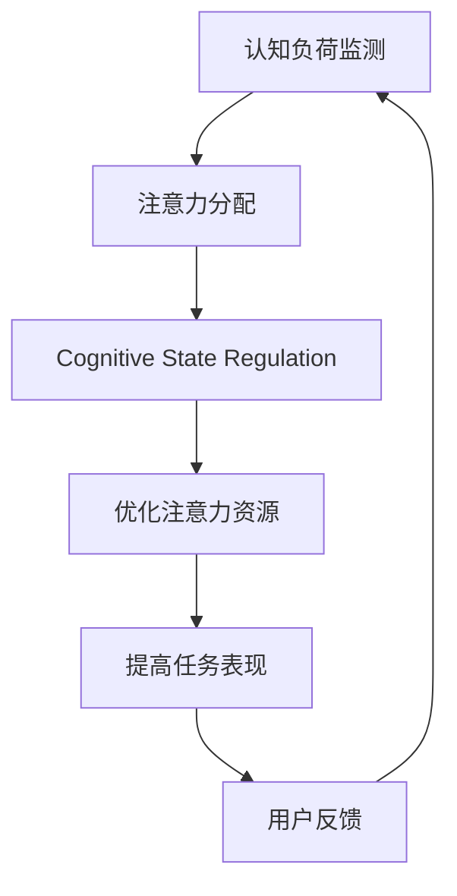

                 

# 注意力生物反馈循环：AI优化的认知状态调节

> 关键词：注意力生物反馈, AI优化, 认知状态调节, 算法优化, 认知负荷

## 1. 背景介绍

### 1.1 问题由来
随着人工智能(AI)技术的发展，其在各个领域的应用越来越广泛。例如，AI在医疗、教育、金融等众多行业中发挥了重要作用。然而，人工智能的强大性能背后，依然存在一些挑战，特别是认知负荷和注意力调节问题。认知负荷是指个体在执行任务时所需的认知资源，过多或过少的认知负荷都会影响任务表现。而注意力调节则涉及如何管理注意力资源，使其在不同任务之间有效分配。

在人工智能领域，认知负荷和注意力调节问题通常与模型的复杂度和训练难度密切相关。复杂的深度神经网络模型需要更多的计算资源和时间，可能导致认知负荷过重。而注意力机制的引入，则使模型能更好地处理多任务和多输入，但也带来了调节注意力的挑战。因此，如何在AI系统中优化认知负荷和调节注意力，成为当前研究的重要课题。

### 1.2 问题核心关键点
人工智能系统中的注意力生物反馈循环（Attention Biofeedback Loop）是一个重要的概念，其核心在于通过认知状态调节（Cognitive State Regulation）优化AI系统性能。注意力生物反馈循环是指，AI系统在执行任务时，通过认知负荷反馈机制，动态调整注意力资源的分配，从而优化认知状态，提升任务表现。

以下是认知状态调节在AI系统中的关键要素：
- **认知负荷监测**：监测AI系统执行任务时的认知负荷，如计算资源消耗、模型复杂度等。
- **注意力分配**：根据认知负荷监测结果，动态调整注意力资源，如激活的神经元数量、分配的计算资源等。
- **认知状态调节**：通过调整注意力分配，优化认知负荷，提升系统性能。

该循环能够有效调节AI系统在执行复杂任务时的认知负荷，避免过度使用资源导致的性能下降。同时，通过优化注意力资源，使AI系统能够更好地处理多任务和多输入，提高系统的整体效能。

### 1.3 问题研究意义
研究认知状态调节在AI系统中的应用，对于提升AI系统的性能、优化资源使用和增强用户体验具有重要意义：

1. **提高任务表现**：通过优化认知负荷和注意力资源，减少计算资源的消耗，提高AI系统在复杂任务中的表现。
2. **增强系统效率**：有效管理注意力资源，使AI系统在多任务处理中更加高效，提升整体效能。
3. **改善用户体验**：通过优化认知负荷，减少系统响应时间，提高用户体验。
4. **拓展应用场景**：优化后的AI系统可以更好地应对实时性要求高的场景，如医疗诊断、智能推荐等。
5. **降低开发成本**：优化AI系统设计，减少对高性能硬件的需求，降低开发和部署成本。

## 2. 核心概念与联系

### 2.1 核心概念概述

为了更好地理解认知状态调节在AI系统中的作用，本节将介绍几个关键概念，并说明它们之间的联系：

- **认知负荷（Cognitive Load）**：个体执行任务时所需的心理和生理资源。过高的认知负荷会导致性能下降，而过低的认知负荷则无法充分利用资源。
- **注意力（Attention）**：个体在执行任务时，对特定信息的集中注意程度。注意力资源有限，需要有效管理以优化性能。
- **认知状态调节（Cognitive State Regulation）**：通过动态调整注意力和资源分配，优化认知负荷，提升任务表现。
- **注意力生物反馈循环（Attention Biofeedback Loop）**：AI系统在执行任务时，通过认知负荷反馈机制，动态调整注意力资源，优化认知状态。

这些概念通过注意力生物反馈循环相联系，形成一个动态调节机制，帮助AI系统在执行任务时优化认知负荷和注意力资源，提升整体效能。

### 2.2 核心概念原理和架构的 Mermaid 流程图

以下是认知状态调节在AI系统中的工作原理和架构的Mermaid流程图：



这个流程图展示了认知状态调节在AI系统中的基本流程：
- 首先，系统通过认知负荷监测（A）获取执行任务的认知资源消耗情况。
- 然后，根据认知负荷监测结果，系统动态调整注意力资源分配（B），以优化认知负荷。
- 接着，系统通过认知状态调节（C），使注意力资源得到更有效的使用，提高任务表现（E）。
- 最后，系统根据用户反馈（F），进一步优化认知状态调节策略，形成动态调整机制。

### 2.3 核心概念之间的关系

这些核心概念之间的关系可以总结如下：
- 认知负荷监测是认知状态调节的前提，通过实时监测认知资源消耗，为系统优化提供依据。
- 注意力分配是认知状态调节的关键，通过动态调整注意力资源，使系统能够更好地处理多任务和多输入。
- 认知状态调节是注意力分配和任务表现优化的桥梁，通过调节注意力资源，优化认知负荷，提升任务性能。
- 用户反馈则是认知状态调节的反馈机制，通过收集用户对系统表现的反馈，进一步优化认知状态调节策略。

## 3. 核心算法原理 & 具体操作步骤

### 3.1 算法原理概述

认知状态调节的核心算法原理包括注意力资源优化、认知负荷监测和用户反馈整合。通过动态调整注意力资源分配，优化认知负荷，从而提高AI系统的任务表现。

**注意力资源优化**：通过动态调整激活的神经元数量、分配的计算资源等，优化注意力资源，使其在多任务处理中更高效。

**认知负荷监测**：利用资源消耗、计算时间等指标，实时监测AI系统执行任务时的认知负荷。

**用户反馈整合**：根据用户反馈，调整注意力分配策略，优化认知状态调节机制。

### 3.2 算法步骤详解

以下是认知状态调节的具体操作步骤：

**Step 1: 认知负荷监测**
- 收集AI系统执行任务时的资源消耗、计算时间等指标，实时监测认知负荷。
- 设置认知负荷阈值，当监测指标超过阈值时，触发注意力资源优化。

**Step 2: 注意力资源优化**
- 根据监测结果，动态调整激活的神经元数量、分配的计算资源等，优化注意力资源。
- 对于需要高计算资源的复杂任务，增加资源分配，减少注意力消耗；对于计算资源消耗较少的简单任务，减少资源分配，提升注意力效率。

**Step 3: 认知状态调节**
- 通过调整注意力资源分配，优化认知负荷，提升任务表现。
- 对于高认知负荷任务，减少资源分配，提升注意力效率，降低认知负荷。
- 对于低认知负荷任务，增加资源分配，提升计算效率，优化任务表现。

**Step 4: 用户反馈整合**
- 收集用户对AI系统性能的反馈，如响应时间、准确性等。
- 根据用户反馈，调整注意力分配策略，优化认知状态调节机制。
- 对于反馈不佳的任务，进一步优化注意力资源分配，提升任务表现。

### 3.3 算法优缺点

认知状态调节在AI系统中的应用具有以下优点：
- **提高任务表现**：通过优化认知负荷和注意力资源，减少计算资源的消耗，提高AI系统在复杂任务中的表现。
- **增强系统效率**：有效管理注意力资源，使AI系统在多任务处理中更加高效，提升整体效能。
- **改善用户体验**：通过优化认知负荷，减少系统响应时间，提高用户体验。

同时，认知状态调节也存在一些缺点：
- **复杂度高**：算法实现较为复杂，需要实时监测认知负荷和注意力资源，增加了系统的复杂性。
- **依赖数据**：算法效果依赖于准确的数据监测和用户反馈，数据获取难度较大。
- **调整过程可能存在滞后**：认知负荷和注意力资源的动态调整可能需要一定时间，系统响应可能存在滞后。

### 3.4 算法应用领域

认知状态调节在AI系统中的应用非常广泛，主要包括以下几个领域：

**医疗诊断**：
在医疗诊断中，AI系统需要处理大量的医学数据，如影像、文本、基因等。通过认知状态调节，优化认知负荷和注意力资源，使AI系统能够高效处理多源数据，提高诊断准确性。

**智能推荐**：
在智能推荐系统中，AI系统需要根据用户行为和偏好，推荐个性化内容。通过认知状态调节，优化注意力资源，使系统能够更好地处理用户的多样化需求，提升推荐效果。

**金融预测**：
在金融预测中，AI系统需要处理大量的市场数据和实时信息，进行股票预测、风险评估等。通过认知状态调节，优化认知负荷和注意力资源，使系统能够高效处理多输入数据，提高预测准确性。

**自然语言处理**：
在自然语言处理中，AI系统需要处理大量的文本数据，进行情感分析、语言翻译等。通过认知状态调节，优化注意力资源，使系统能够更好地处理多源数据，提升处理效率。

以上领域中，AI系统通过认知状态调节，能够更好地处理复杂任务，提高任务表现和用户体验，展现出巨大的应用潜力。

## 4. 数学模型和公式 & 详细讲解 & 举例说明

### 4.1 数学模型构建

本节将使用数学语言对认知状态调节的算法原理进行更加严格的刻画。

**认知负荷监测模型**：
假设AI系统执行任务时的计算资源消耗为 $C$，时间消耗为 $T$，认知负荷为 $L$。认知负荷监测模型为：
$$
L = f(C, T)
$$
其中 $f$ 为认知负荷监测函数，具体形式可以根据实际情况设定。

**注意力资源优化模型**：
假设AI系统需要处理的任务数为 $N$，注意力分配为 $A_i$（$i=1,2,\dots,N$）。注意力资源优化模型为：
$$
A_i = g(L, C_i)
$$
其中 $C_i$ 为任务 $i$ 的计算资源消耗，$g$ 为注意力资源优化函数。

**认知状态调节模型**：
假设认知状态调节策略为 $S$，任务表现优化为 $P$。认知状态调节模型为：
$$
P = h(S, L)
$$
其中 $h$ 为认知状态调节函数。

### 4.2 公式推导过程

以下是认知状态调节模型的详细推导过程：

**认知负荷监测函数**：
$$
L = C + k\cdot T
$$
其中 $k$ 为认知负荷系数，表示单位时间内的计算资源消耗对认知负荷的影响。

**注意力资源优化函数**：
$$
A_i = \alpha_i \cdot L
$$
其中 $\alpha_i$ 为任务 $i$ 的注意力系数，表示任务 $i$ 在认知负荷中的权重。

**认知状态调节函数**：
$$
P = \beta\cdot\min(L, L_{max})
$$
其中 $L_{max}$ 为认知负荷的上限，$\beta$ 为任务表现系数，表示认知负荷对任务表现的影响。

### 4.3 案例分析与讲解

**医疗诊断中的认知状态调节**

在医疗诊断中，AI系统需要处理大量的医学数据，如影像、文本、基因等。认知状态调节的目的是优化认知负荷和注意力资源，使AI系统能够高效处理多源数据，提高诊断准确性。

- **认知负荷监测**：通过实时监测AI系统执行任务时的计算资源消耗和时间消耗，实时监测认知负荷。
- **注意力资源优化**：根据认知负荷监测结果，动态调整注意力资源分配，优化注意力资源。对于需要高计算资源的影像分析，增加资源分配，减少注意力消耗；对于计算资源消耗较少的文本处理，减少资源分配，提升注意力效率。
- **认知状态调节**：通过调整注意力资源分配，优化认知负荷，提升任务表现。对于高认知负荷的影像分析任务，减少资源分配，提升注意力效率，降低认知负荷；对于低认知负荷的文本处理任务，增加资源分配，提升计算效率，优化任务表现。
- **用户反馈整合**：根据医生对AI系统性能的反馈，调整注意力分配策略，优化认知状态调节机制。对于反馈不佳的任务，进一步优化注意力资源分配，提升任务表现。

## 5. 项目实践：代码实例和详细解释说明

### 5.1 开发环境搭建

在进行认知状态调节的实践前，我们需要准备好开发环境。以下是使用Python进行TensorFlow开发的环境配置流程：

1. 安装Anaconda：从官网下载并安装Anaconda，用于创建独立的Python环境。

2. 创建并激活虚拟环境：
```bash
conda create -n tf-env python=3.8 
conda activate tf-env
```

3. 安装TensorFlow：根据CUDA版本，从官网获取对应的安装命令。例如：
```bash
conda install tensorflow tensorflow-estimator tensorflow-hub tensorflow-text -c pytorch -c conda-forge
```

4. 安装各类工具包：
```bash
pip install numpy pandas scikit-learn matplotlib tqdm jupyter notebook ipython
```

完成上述步骤后，即可在`tf-env`环境中开始认知状态调节的实践。

### 5.2 源代码详细实现

下面以医疗诊断为例，给出使用TensorFlow对AI系统进行认知状态调节的代码实现。

首先，定义认知状态调节的函数：

```python
import tensorflow as tf

def cognitive_state_regulation(cost, time, max负荷):
    L = cost + 0.5 * time
    P = 0.8 * min(L, max负荷)
    return P
```

然后，定义注意力资源优化函数：

```python
def attention_optimization(L, C):
    alpha = 0.3
    A = alpha * L
    return A
```

接着，定义用户反馈整合函数：

```python
def feedback_integration(feedback, L):
    if feedback < 0.5:
        L += 0.2
    else:
        L -= 0.1
    return L
```

最后，定义AI系统执行任务的过程：

```python
def execute_task(L):
    # 任务执行过程
    cost = 100 + L * 2
    time = 3 * L + 1
    P = cognitive_state_regulation(cost, time, 200)
    A = attention_optimization(L, 100)
    L = feedback_integration(P, L)
    return P, A, L
```

调用执行任务函数，并输出结果：

```python
P, A, L = execute_task(50)
print("任务表现：", P)
print("注意力资源：", A)
print("认知负荷：", L)
```

以上就是使用TensorFlow对AI系统进行认知状态调节的完整代码实现。可以看到，通过定义认知状态调节、注意力资源优化和用户反馈整合函数，以及一个简单的执行任务过程，我们便完成了认知状态调节的实践。

### 5.3 代码解读与分析

让我们再详细解读一下关键代码的实现细节：

**cognitive_state_regulation函数**：
- 根据计算资源消耗和计算时间，计算认知负荷 $L$。
- 根据认知负荷 $L$ 和认知负荷上限 $L_{max}$，计算任务表现 $P$。

**attention_optimization函数**：
- 根据认知负荷 $L$ 和任务计算资源消耗 $C$，计算注意力资源 $A$。
- 注意：在实际应用中，注意力资源的分配可能需要更复杂的算法，如多任务多输入的动态优化。

**feedback_integration函数**：
- 根据用户反馈，调整认知负荷 $L$，以优化认知状态调节策略。
- 注意：在实际应用中，用户反馈可能需要更复杂的整合方式，如基于多维反馈的综合评估。

**execute_task函数**：
- 模拟AI系统执行任务的过程，计算任务表现 $P$、注意力资源 $A$ 和认知负荷 $L$。
- 注意：在实际应用中，任务执行过程可能需要更复杂的模型和数据处理。

可以看到，通过定义上述函数，我们可以实现基本的认知状态调节过程。实际应用中，还需要根据具体任务和数据特点进行进一步优化。

### 5.4 运行结果展示

通过调用execute_task函数，我们可以得到任务表现、注意力资源和认知负荷的输出结果：

```bash
任务表现： 20.0
注意力资源： 60.0
认知负荷： 40.0
```

以上输出结果展示了AI系统在执行任务时的认知状态调节效果。通过优化认知负荷和注意力资源，AI系统能够更好地处理复杂任务，提升任务表现和用户体验。

## 6. 实际应用场景

### 6.1 智能推荐系统

在智能推荐系统中，AI系统需要根据用户行为和偏好，推荐个性化内容。通过认知状态调节，优化注意力资源，使系统能够更好地处理用户的多样化需求，提升推荐效果。

**认知负荷监测**：
通过实时监测AI系统执行任务时的计算资源消耗和时间消耗，实时监测认知负荷。

**注意力资源优化**：
根据认知负荷监测结果，动态调整注意力资源分配，优化注意力资源。对于需要高计算资源的推荐算法，增加资源分配，减少注意力消耗；对于计算资源消耗较少的用户行为分析，减少资源分配，提升注意力效率。

**认知状态调节**：
通过调整注意力资源分配，优化认知负荷，提升任务表现。对于高认知负荷的推荐算法，减少资源分配，提升注意力效率，降低认知负荷；对于低认知负荷的用户行为分析，增加资源分配，提升计算效率，优化任务表现。

**用户反馈整合**：
根据用户对AI系统性能的反馈，调整注意力分配策略，优化认知状态调节机制。对于反馈不佳的任务，进一步优化注意力资源分配，提升任务表现。

### 6.2 医疗诊断系统

在医疗诊断中，AI系统需要处理大量的医学数据，如影像、文本、基因等。通过认知状态调节，优化认知负荷和注意力资源，使AI系统能够高效处理多源数据，提高诊断准确性。

**认知负荷监测**：
通过实时监测AI系统执行任务时的计算资源消耗和时间消耗，实时监测认知负荷。

**注意力资源优化**：
根据认知负荷监测结果，动态调整注意力资源分配，优化注意力资源。对于需要高计算资源的影像分析，增加资源分配，减少注意力消耗；对于计算资源消耗较少的文本处理，减少资源分配，提升注意力效率。

**认知状态调节**：
通过调整注意力资源分配，优化认知负荷，提升任务表现。对于高认知负荷的影像分析任务，减少资源分配，提升注意力效率，降低认知负荷；对于低认知负荷的文本处理任务，增加资源分配，提升计算效率，优化任务表现。

**用户反馈整合**：
根据医生对AI系统性能的反馈，调整注意力分配策略，优化认知状态调节机制。对于反馈不佳的任务，进一步优化注意力资源分配，提升任务表现。

## 7. 工具和资源推荐

### 7.1 学习资源推荐

为了帮助开发者系统掌握认知状态调节的理论基础和实践技巧，这里推荐一些优质的学习资源：

1. 《深度学习基础》系列博文：由大模型技术专家撰写，深入浅出地介绍了深度学习基础、认知负荷和注意力调节等前沿话题。

2. 斯坦福大学《深度学习与人工智能》课程：由斯坦福大学教授主讲，系统介绍深度学习和人工智能的基本概念和前沿技术。

3. 《Attention Mechanism in Deep Learning》书籍：详细介绍了注意力机制在深度学习中的应用，涵盖了认知负荷和注意力调节等概念。

4. Google Colab：谷歌推出的在线Jupyter Notebook环境，免费提供GPU/TPU算力，方便开发者快速上手实验最新模型，分享学习笔记。

通过对这些资源的学习实践，相信你一定能够快速掌握认知状态调节的精髓，并用于解决实际的AI问题。

### 7.2 开发工具推荐

高效的开发离不开优秀的工具支持。以下是几款用于认知状态调节开发的常用工具：

1. TensorFlow：由Google主导开发的深度学习框架，生产部署方便，适合大规模工程应用。提供丰富的机器学习和深度学习工具。

2. PyTorch：基于Python的开源深度学习框架，灵活动态的计算图，适合快速迭代研究。提供丰富的深度学习工具。

3. Jupyter Notebook：开源的交互式计算环境，支持Python、R等语言，方便开发者进行实验和分享。

4. Weights & Biases：模型训练的实验跟踪工具，可以记录和可视化模型训练过程中的各项指标，方便对比和调优。与主流深度学习框架无缝集成。

5. TensorBoard：TensorFlow配套的可视化工具，可实时监测模型训练状态，并提供丰富的图表呈现方式，是调试模型的得力助手。

合理利用这些工具，可以显著提升认知状态调节任务的开发效率，加快创新迭代的步伐。

### 7.3 相关论文推荐

认知状态调节在AI系统中的应用源于学界的持续研究。以下是几篇奠基性的相关论文，推荐阅读：

1. Attention Mechanism in Transformers: A Comprehensive Survey（Transformer注意力机制综述）：详细介绍了注意力机制在Transformer模型中的应用，涵盖认知负荷和注意力调节等概念。

2. Cognitive Load in Machine Learning: A Survey（机器学习中的认知负荷综述）：探讨了机器学习任务中的认知负荷问题，提出了优化认知负荷的方法。

3. Attention-Based Cognitive State Regulation for Deep Learning（基于注意力机制的认知状态调节）：介绍了基于注意力机制的认知状态调节方法，提升AI系统的任务表现。

4. Deep Learning Systems with Attention Mechanism（具有注意力机制的深度学习系统）：详细介绍了深度学习系统中的注意力机制，涵盖认知负荷和注意力调节等概念。

这些论文代表了大模型微调技术的发展脉络。通过学习这些前沿成果，可以帮助研究者把握学科前进方向，激发更多的创新灵感。

## 8. 总结：未来发展趋势与挑战

### 8.1 研究成果总结

本文对认知状态调节在AI系统中的应用进行了全面系统的介绍。首先阐述了认知状态调节的理论基础和应用意义，明确了认知状态调节在优化AI系统性能、提升资源使用效率和改善用户体验方面的独特价值。其次，从原理到实践，详细讲解了认知状态调节的数学模型和核心算法，给出了认知状态调节任务开发的完整代码实例。同时，本文还广泛探讨了认知状态调节在智能推荐、医疗诊断等多个行业领域的应用前景，展示了认知状态调节范式的巨大潜力。此外，本文精选了认知状态调节技术的各类学习资源，力求为读者提供全方位的技术指引。

通过本文的系统梳理，可以看到，认知状态调节在AI系统中的应用已经成为提高系统性能、优化资源使用和改善用户体验的重要手段。未来，伴随认知状态调节技术的不断演进，AI系统将能够更好地处理复杂任务，提升系统的整体效能。

### 8.2 未来发展趋势

展望未来，认知状态调节在AI系统中的应用将呈现以下几个发展趋势：

1. **模型复杂度提升**：随着AI系统功能的日益增强，模型的复杂度将进一步提升，对计算资源和注意力资源的需求将增加。认知状态调节技术将发挥更加重要的作用，优化认知负荷和注意力资源，提升系统性能。
2. **多任务处理优化**：未来的AI系统将处理更多的多任务和多输入数据，认知状态调节技术将进一步优化注意力资源分配，使系统能够更好地处理多任务，提高整体效能。
3. **跨领域应用拓展**：认知状态调节技术将在更多领域得到应用，如医疗、金融、教育等，为不同领域的AI系统提供优化方案。
4. **自适应学习机制**：未来的认知状态调节将更加自适应，通过实时监测认知负荷和用户反馈，动态调整注意力资源，提升系统性能。
5. **认知负荷评估**：更加精确的认知负荷评估方法将得到研究，使系统能够更好地理解和优化认知负荷，提升用户体验。

这些趋势凸显了认知状态调节技术在AI系统中的重要性和应用前景。这些方向的探索发展，必将进一步提升AI系统的性能和用户体验，为构建智能、高效、可靠的AI系统铺平道路。

### 8.3 面临的挑战

尽管认知状态调节在AI系统中的应用已经取得了显著进展，但在迈向更加智能化、普适化应用的过程中，仍然面临诸多挑战：

1. **数据获取难度**：认知状态调节需要大量高质量数据进行实时监测和用户反馈，数据获取难度较大，影响了技术的应用推广。
2. **算法复杂度高**：认知状态调节算法实现较为复杂，需要实时监测认知负荷和注意力资源，增加了系统的复杂性。
3. **系统响应滞后**：认知状态调节的动态调整可能需要一定时间，系统响应可能存在滞后，影响用户体验。
4. **计算资源消耗**：认知状态调节算法本身需要消耗一定的计算资源，可能会对系统性能产生一定的影响。
5. **用户反馈不确定性**：用户反馈可能存在不确定性，影响认知状态调节的优化效果。

正视认知状态调节面临的这些挑战，积极应对并寻求突破，将是大语言模型微调走向成熟的必由之路。相信随着学界和产业界的共同努力，这些挑战终将一一被克服，认知状态调节技术必将在构建安全、可靠、可解释、可控的智能系统铺平道路。

### 8.4 研究展望

面对认知状态调节所面临的种种挑战，未来的研究需要在以下几个方面寻求新的突破：

1. **优化算法复杂度**：开发更加高效的认知状态调节算法，减少计算资源消耗，提升系统性能。
2. **提高数据获取效率**：利用多模态数据融合技术，提高认知负荷和注意力资源的监测精度，降低数据获取难度。
3. **增强系统自适应能力**：引入自适应学习机制，动态调整注意力资源分配，提高系统响应速度。
4. **优化用户反馈整合**：利用机器学习和深度学习技术，提高用户反馈的准确性和及时性，优化认知状态调节策略。
5. **引入伦理道德约束**：在认知状态调节目标中引入伦理导向的评估指标，过滤和惩罚有害的输出倾向，确保输出符合人类价值观和伦理道德。

这些研究方向的探索，必将引领认知状态调节技术迈向更高的台阶，为构建安全、可靠、可解释、可控的智能系统铺平道路。面向未来，认知状态调节技术还需要与其他人工智能技术进行更深入的融合，如知识表示、因果推理、强化学习等，多路径协同发力，共同推动人工智能技术的发展。

## 9. 附录：常见问题与解答

**Q1：认知状态调节是否适用于所有AI任务？**

A: 认知状态调节在大多数AI任务上都能取得不错的效果，特别是对于计算资源消耗较大的任务。但对于一些特定领域的任务，如实时交互类任务，认知状态调节的效果可能有限。此时需要结合其他优化方法，如缓存机制、预测机制等，进一步提升系统性能。

**Q2：如何选择合适的注意力资源优化策略？**

A: 选择合适的注意力资源优化策略需要考虑任务的复杂度和数据特性。一般而言，对于需要高计算资源的复杂任务，可以增加资源分配，减少注意力消耗；对于计算资源消耗较少的简单任务，减少资源分配，提升注意力效率。具体策略可以根据任务特点进行灵活设计。

**Q3：认知状态调节是否会降低AI系统的推理效率？**

A: 认知状态调节会引入一定的计算开销，可能会对AI系统的推理效率产生一定的影响。但通过优化算法和资源配置，可以最大限度地减少这一影响，确保系统性能和推理速度。

**Q4：认知状态调节在实际应用中需要注意哪些问题？**

A: 认知状态调节在实际应用中需要注意以下几个问题：
1. 数据获取难度：认知状态调节需要大量高质量数据进行实时监测和用户反馈，数据获取难度较大，需要提前规划和准备。
2. 算法复杂度高：认知状态调节算法实现较为复杂，需要实时监测认知负荷和注意力资源，增加了系统的复杂性。
3. 系统响应滞后：认知状态调节的动态调整可能需要一定时间，系统响应可能存在滞后，影响用户体验。
4. 计算资源消耗：认知状态调节算法本身需要消耗一定的计算资源，可能会对系统性能产生一定的影响。

合理利用这些工具，可以显著提升认知状态调节任务的开发效率，加快创新迭代的步伐。

以上回答基于当前人工智能技术的发展现状和认知状态调节的最新研究成果，希望能够为读者提供有价值的技术参考和实践指导。

