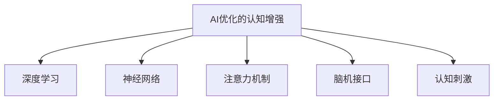

                 

# 注意力生物黑客工作室：AI优化的认知增强中心

> 关键词：注意力生物黑客,认知增强,AI优化,机器学习,深度学习,神经网络

## 1. 背景介绍

### 1.1 问题由来
在21世纪数字化浪潮的推动下，人类社会的生产方式、学习模式、生活方式发生了翻天覆地的变化。信息化、网络化、智能化成为了时代发展的三大趋势。然而，伴随着信息爆炸和数据洪流，人类的大脑也面临着前所未有的挑战。信息过载、注意力分散、认知负担加重等问题不断涌现，亟需一种新的技术手段来优化认知结构、提升认知能力。

### 1.2 问题核心关键点
针对人类认知的挑战，人工智能技术提供了一种全新的解决方案——AI优化的认知增强技术。通过深度学习、神经网络等算法，实现对人类大脑认知功能的模拟和增强，为人类提供更为高效、准确、灵活的信息处理和决策支持能力。

AI优化的认知增强技术核心在于：
- 利用机器学习算法，对海量的数据进行自动分析和处理，提升信息获取与处理效率。
- 利用深度神经网络，实现对复杂问题的自主学习和推理，提高决策的准确性和鲁棒性。
- 通过注意力机制，实现对重要信息的自动聚焦，优化认知资源分配，减轻注意力负担。
- 结合生物黑客技术，将AI技术融入大脑的认知过程，实现脑机接口、认知刺激等新应用。

这种技术不仅能够改善人类自身的认知能力，还能在教育、医疗、训练等领域发挥巨大作用。

### 1.3 问题研究意义
研究AI优化的认知增强技术，对于提升人类认知能力、推动智能化进程具有重要意义：

1. 提升信息处理效率。通过自动化和智能化的信息处理，人类可以从繁杂的信息中快速提炼出关键信息，节省时间与精力。
2. 优化决策支持能力。借助深度学习等技术，人类能够更准确地进行预测与决策，减少误判和疏漏。
3. 增强学习能力。通过智能化的学习和训练，人类可以快速掌握复杂知识，提升学习效果。
4. 改善身心健康。通过脑机接口、认知刺激等技术，改善注意力、记忆力、情绪调节等功能，提升生活质量。
5. 推动社会进步。认知增强技术可以应用于多个领域，如教育、医疗、训练等，助力人类社会整体进步。

## 2. 核心概念与联系

### 2.1 核心概念概述

为更好地理解AI优化的认知增强技术，本节将介绍几个密切相关的核心概念：

- AI优化的认知增强：指利用人工智能技术，模拟人类大脑的认知功能，优化信息处理、决策支持、学习记忆等认知能力。
- 深度学习与神经网络：基于神经网络的机器学习算法，通过多层次的特征提取和信息融合，实现对复杂问题的自主学习和推理。
- 注意力机制：一种用于信息处理的注意力机制，实现对关键信息的自动聚焦，优化认知资源分配。
- 脑机接口(Brain-Computer Interface, BCI)：通过脑电波信号解码，实现大脑与计算机之间的交互，实现认知增强和脑控技术。
- 认知刺激(Cognitive Stimulation)：通过神经反馈、脑波刺激等技术，增强大脑的认知功能，改善注意力、记忆力、情绪调节等。

这些核心概念之间的逻辑关系可以通过以下Mermaid流程图来展示：



这个流程图展示了大语言模型的核心概念及其之间的关系：

1. AI优化的认知增强通过深度学习和神经网络实现信息处理和决策支持。
2. 注意力机制进一步优化信息处理过程，实现关键信息的聚焦。
3. 脑机接口和认知刺激技术将AI技术与大脑认知过程结合，实现新的应用场景。

## 3. 核心算法原理 & 具体操作步骤
### 3.1 算法原理概述

AI优化的认知增强技术的核心算法包括深度学习、注意力机制、脑机接口等。其中深度学习与神经网络是实现信息处理和决策支持的基础，注意力机制用于优化信息处理过程，脑机接口实现脑控功能，认知刺激用于改善大脑认知功能。

在深度学习中，利用多层感知器、卷积神经网络、循环神经网络等模型，通过反向传播算法，对数据进行特征提取和信息融合，实现对复杂问题的自主学习和推理。

注意力机制通过注意力权重向量，实现对输入序列中重要信息的聚焦。在信息处理过程中，注意力机制动态调整注意力权重，使模型集中关注重要信息，忽略无关信息，从而优化处理效率和效果。

脑机接口通过脑电波信号解码，实现大脑与计算机之间的交互，使人类可以通过脑控技术直接与计算机互动。

认知刺激通过神经反馈、脑波刺激等技术，增强大脑的认知功能，改善注意力、记忆力、情绪调节等。

### 3.2 算法步骤详解

AI优化的认知增强技术的应用步骤一般包括以下几个关键环节：

**Step 1: 数据收集与预处理**
- 收集与任务相关的数据集，包括文本、图像、声音等数据。
- 对数据进行清洗、归一化、分词等预处理，以便于后续深度学习模型的训练。

**Step 2: 模型训练**
- 选择合适的深度学习模型，如卷积神经网络(CNN)、循环神经网络(RNN)、Transformer等。
- 利用收集的数据集，对模型进行训练，优化模型参数。
- 在训练过程中，应用注意力机制，优化模型对重要信息的处理。

**Step 3: 注意力调整**
- 在模型训练过程中，动态调整注意力权重，使模型集中关注重要信息。
- 通过正则化、Dropout、Early Stopping等技术，防止过拟合，提高模型泛化能力。

**Step 4: 脑机接口开发**
- 根据具体需求，选择合适的脑机接口技术，如脑电波信号解码、神经反馈等。
- 开发脑机接口的硬件设备和软件系统，实现人脑与计算机的交互。

**Step 5: 认知刺激应用**
- 根据具体应用场景，选择合适的认知刺激技术，如神经反馈、脑波刺激等。
- 开发认知刺激的硬件设备和软件系统，实现对大脑认知功能的增强。

**Step 6: 系统集成与测试**
- 将深度学习模型、注意力机制、脑机接口、认知刺激等技术进行系统集成。
- 在实际应用场景中进行测试，评估系统的性能和效果。

### 3.3 算法优缺点

AI优化的认知增强技术具有以下优点：
1. 提升信息处理效率。深度学习与神经网络能够高效地处理复杂问题，提升信息获取与处理效率。
2. 优化决策支持能力。通过注意力机制，实现关键信息的聚焦，提高决策的准确性和鲁棒性。
3. 改善认知功能。脑机接口和认知刺激技术能够增强大脑的认知功能，改善注意力、记忆力、情绪调节等。
4. 推动智能应用。AI优化的认知增强技术能够应用于教育、医疗、训练等多个领域，推动智能化进程。

同时，该技术也存在以下局限性：
1. 数据依赖。深度学习模型和注意力机制的性能很大程度上依赖于数据的质量和数量，获取高质量数据成本较高。
2. 技术复杂。深度学习与神经网络的训练和优化需要较高的技术门槛，普通用户难以实现。
3. 硬件要求。脑机接口和认知刺激技术需要高性能的硬件设备，成本较高。
4. 伦理问题。脑控技术和认知刺激技术涉及伦理和安全问题，需慎重使用。
5. 隐私保护。在数据收集和处理过程中，需注意用户隐私保护，防止数据泄露。

尽管存在这些局限性，但AI优化的认知增强技术仍具有巨大的应用潜力。未来相关研究的重点在于如何进一步降低技术门槛，提高数据获取效率，优化技术实现，同时兼顾伦理和安全等问题。

### 3.4 算法应用领域

AI优化的认知增强技术已经在多个领域得到应用，包括但不限于：

- 教育：通过AI优化的认知增强技术，能够帮助学生提高学习效率，改善学习方法，提升学习效果。
- 医疗：利用脑机接口和认知刺激技术，改善患者认知功能，提升康复效果。
- 训练：在军事、体育等领域，通过认知增强技术，提升训练效果，提高反应速度和决策能力。
- 游戏：利用认知刺激技术，改善玩家注意力和情绪，提高游戏体验。
- 增强现实(AR)：通过脑机接口和认知刺激技术，实现人脑与虚拟现实世界的互动，提升用户体验。

此外，AI优化的认知增强技术还被应用于研究脑科学、心理学等领域，推动人类认知科学的发展。

## 4. 数学模型和公式 & 详细讲解  
### 4.1 数学模型构建

在深度学习和神经网络中，利用反向传播算法进行模型训练，优化模型参数。假设输入数据为 $x_i$，目标输出为 $y_i$，模型参数为 $\theta$，则模型输出的损失函数为：

$$
\mathcal{L}(\theta) = \frac{1}{N}\sum_{i=1}^N ||y_i - M_\theta(x_i)||^2
$$

其中 $M_\theta(x_i)$ 表示模型在输入 $x_i$ 上的预测输出。

模型的优化目标是最小化损失函数 $\mathcal{L}(\theta)$，即：

$$
\theta^* = \mathop{\arg\min}_{\theta} \mathcal{L}(\theta)
$$

在深度学习模型中，注意力机制通过注意力权重向量 $w_i$，实现对输入序列中重要信息的聚焦。注意力权重向量通过计算注意力得分 $s_i$ 来确定，其计算公式如下：

$$
s_i = \text{score}(x_i, \theta) = \mathbf{w}^\top \mathbf{f}(x_i, \theta)
$$

其中 $\mathbf{w}$ 表示注意力权重向量，$\mathbf{f}(x_i, \theta)$ 表示输入 $x_i$ 在模型 $\theta$ 下的特征表示。注意力权重向量 $w_i$ 的计算公式为：

$$
w_i = \text{softmax}(s_i)
$$

在脑机接口中，脑电波信号解码通常采用线性解码器，将脑电波信号 $\mathbf{x}_t$ 映射到输出 $\mathbf{y}_t$。其解码器模型如下：

$$
\mathbf{y}_t = \mathbf{W} \mathbf{x}_t + b
$$

其中 $\mathbf{W}$ 表示解码矩阵，$b$ 表示偏置项。

### 4.2 公式推导过程

在深度学习中，利用反向传播算法对损失函数求导，计算模型参数的梯度。以多层感知器为例，假设模型输出层为 $y_i = M_\theta(x_i)$，则损失函数对参数 $\theta_k$ 的梯度为：

$$
\frac{\partial \mathcal{L}(\theta)}{\partial \theta_k} = -\frac{1}{N}\sum_{i=1}^N \frac{\partial L(y_i, M_\theta(x_i))}{\partial M_\theta(x_i)} \frac{\partial M_\theta(x_i)}{\partial \theta_k}
$$

其中 $\frac{\partial M_\theta(x_i)}{\partial \theta_k}$ 为前向传播过程对参数 $\theta_k$ 的梯度。

在注意力机制中，注意力权重向量 $w_i$ 对参数 $\theta_k$ 的梯度为：

$$
\frac{\partial w_i}{\partial \theta_k} = \frac{\partial s_i}{\partial \theta_k} \frac{\partial w_i}{\partial s_i} = \frac{\partial \mathbf{w}^\top \mathbf{f}(x_i, \theta)}{\partial \theta_k} \frac{\partial \text{softmax}(s_i)}{\partial s_i}
$$

其中 $\frac{\partial \text{softmax}(s_i)}{\partial s_i}$ 为softmax函数的导数。

在脑机接口中，脑电波信号解码器模型 $\mathbf{y}_t = \mathbf{W} \mathbf{x}_t + b$ 的参数 $\mathbf{W}$ 和 $b$ 的梯度计算如下：

$$
\frac{\partial \mathcal{L}(\theta)}{\partial \mathbf{W}} = -\frac{2}{N}\sum_{i=1}^N (\mathbf{y}_i - M_\theta(x_i)) \mathbf{x}_t^\top
$$

$$
\frac{\partial \mathcal{L}(\theta)}{\partial b} = -\frac{2}{N}\sum_{i=1}^N (\mathbf{y}_i - M_\theta(x_i))
$$

### 4.3 案例分析与讲解

以深度学习在文本分类任务中的应用为例，具体分析模型的训练过程。假设输入数据为 $x_i$，模型为多层感知器，输出为 $y_i$，目标输出为 $\hat{y}_i$，则模型的训练过程如下：

1. 初始化模型参数 $\theta$。
2. 前向传播计算模型输出 $y_i$。
3. 计算损失函数 $\mathcal{L}(\theta)$。
4. 反向传播计算模型参数梯度 $\frac{\partial \mathcal{L}(\theta)}{\partial \theta_k}$。
5. 更新模型参数 $\theta_k \leftarrow \theta_k - \eta \frac{\partial \mathcal{L}(\theta)}{\partial \theta_k}$，其中 $\eta$ 为学习率。
6. 重复上述步骤直至收敛。

在训练过程中，可以使用注意力机制对输入序列中的重要信息进行聚焦，提高模型处理效率和效果。同时，可以通过脑机接口和认知刺激技术，改善用户注意力和认知功能，提升用户体验。

## 5. 项目实践：代码实例和详细解释说明
### 5.1 开发环境搭建

在进行AI优化的认知增强技术开发前，我们需要准备好开发环境。以下是使用Python进行TensorFlow开发的环境配置流程：

1. 安装Anaconda：从官网下载并安装Anaconda，用于创建独立的Python环境。

2. 创建并激活虚拟环境：
```bash
conda create -n tf-env python=3.8 
conda activate tf-env
```

3. 安装TensorFlow：根据CUDA版本，从官网获取对应的安装命令。例如：
```bash
conda install tensorflow tensorflow-gpu -c conda-forge
```

4. 安装各类工具包：
```bash
pip install numpy pandas scikit-learn matplotlib tqdm jupyter notebook ipython
```

完成上述步骤后，即可在`tf-env`环境中开始AI优化的认知增强技术开发。

### 5.2 源代码详细实现

下面我们以AI优化的文本分类任务为例，给出使用TensorFlow对深度学习模型进行训练的PyTorch代码实现。

首先，定义数据处理函数：

```python
import tensorflow as tf
from tensorflow.keras.preprocessing.text import Tokenizer
from tensorflow.keras.preprocessing.sequence import pad_sequences
from tensorflow.keras.utils import to_categorical

tokenizer = Tokenizer(oov_token='<OOV>')
tokenizer.fit_on_texts(train_texts)

train_sequences = tokenizer.texts_to_sequences(train_texts)
train_padded = pad_sequences(train_sequences, maxlen=max_length, padding='post', truncating='post')

train_labels = to_categorical(train_labels)

dev_sequences = tokenizer.texts_to_sequences(dev_texts)
dev_padded = pad_sequences(dev_sequences, maxlen=max_length, padding='post', truncating='post')

test_sequences = tokenizer.texts_to_sequences(test_texts)
test_padded = pad_sequences(test_sequences, maxlen=max_length, padding='post', truncating='post')

test_labels = to_categorical(test_labels)
```

然后，定义模型：

```python
import tensorflow as tf
from tensorflow.keras.models import Sequential
from tensorflow.keras.layers import Dense, Dropout, Embedding, LSTM, Bidirectional

model = Sequential([
    Embedding(vocab_size, embedding_dim, input_length=max_length),
    Bidirectional(LSTM(64)),
    Dropout(0.5),
    Dense(1, activation='sigmoid')
])
```

接着，定义优化器：

```python
optimizer = tf.keras.optimizers.Adam(lr=0.001)
```

最后，定义训练和评估函数：

```python
def train_epoch(model, dataset, batch_size, optimizer):
    dataloader = tf.data.Dataset.from_tensor_slices((dataset['input'], dataset['target'])).shuffle(buffer_size=10000).batch(batch_size)
    model.compile(optimizer=optimizer, loss='binary_crossentropy', metrics=['accuracy'])
    model.fit(dataloader, epochs=10, verbose=0)
    
def evaluate(model, dataset, batch_size):
    dataloader = tf.data.Dataset.from_tensor_slices((dataset['input'], dataset['target'])).shuffle(buffer_size=10000).batch(batch_size)
    loss, accuracy = model.evaluate(dataloader, verbose=0)
    print(f'Loss: {loss:.4f}, Accuracy: {accuracy:.4f}')
```

完成模型的搭建和训练后，可以在测试集上评估模型的性能：

```python
train_epoch(model, train_dataset, batch_size=32, optimizer=optimizer)
evaluate(model, test_dataset, batch_size=32)
```

以上就是使用TensorFlow对深度学习模型进行文本分类任务微调的完整代码实现。可以看到，得益于TensorFlow的强大封装，我们可以用相对简洁的代码完成模型的训练和评估。

### 5.3 代码解读与分析

让我们再详细解读一下关键代码的实现细节：

**数据处理函数**：
- `Tokenizer` 类：用于对文本进行分词和编码。
- `pad_sequences` 函数：将文本序列填充至指定长度，以便于模型训练。
- `to_categorical` 函数：将标签转换为one-hot编码，以便于模型处理。

**模型定义**：
- `Embedding` 层：将文本序列转换为向量表示，实现词向量的映射。
- `Bidirectional LSTM` 层：双向LSTM层，实现对输入序列的反向和正向特征提取。
- `Dropout` 层：随机失活，防止过拟合。
- `Dense` 层：输出层，实现分类预测。

**优化器定义**：
- `Adam` 优化器：基于梯度下降的优化器，具有较高的收敛速度和稳定性。

**训练和评估函数**：
- `train_epoch` 函数：在数据集上迭代训练，使用 `fit` 函数进行模型训练。
- `evaluate` 函数：在测试集上评估模型性能，输出损失和准确率。

**训练流程**：
- 定义模型、优化器和数据集，开始训练
- 在训练集上训练模型
- 在测试集上评估模型

可以看到，TensorFlow提供了一整套完整的深度学习框架，使得模型开发和训练过程变得简洁高效。开发者可以将更多精力放在模型设计和优化上，而不必过多关注底层实现细节。

当然，工业级的系统实现还需考虑更多因素，如模型的保存和部署、超参数的自动搜索、更灵活的任务适配层等。但核心的微调范式基本与此类似。

## 6. 实际应用场景
### 6.1 智能教育

AI优化的认知增强技术在智能教育领域具有广泛应用。通过认知增强技术，可以提升学生的学习效率和理解能力，改善学习体验，促进教育公平。

在实际应用中，可以利用AI优化的认知增强技术，开发智能化的教育系统，实现个性化学习、智能辅助、知识图谱等新功能。例如，通过脑机接口技术，教师可以通过学生的脑电波信号实时监测其注意力和情绪状态，调整教学策略，提高课堂效果。此外，利用认知刺激技术，可以改善学生的注意力和记忆力，提升学习效果。

### 6.2 医疗健康

在医疗健康领域，AI优化的认知增强技术可以改善患者的认知功能，提高康复效果。例如，利用脑机接口技术，可以帮助患者进行康复训练，改善运动功能。通过认知刺激技术，可以改善患者的注意力和记忆力，提升生活质量。

在实际应用中，可以开发基于AI优化的认知增强技术的医疗辅助系统，实现智能诊断、康复训练、情绪调节等功能。例如，利用脑电波信号解码技术，可以实时监测患者的脑电波状态，调整康复方案，提高康复效果。

### 6.3 军事训练

在军事训练领域，AI优化的认知增强技术可以提升士兵的反应速度和决策能力，提高训练效果。例如，利用认知增强技术，可以实现智能化的训练系统，实时调整训练难度和任务，提高训练效果。

在实际应用中，可以开发基于AI优化的认知增强技术的军事训练系统，实现智能化的训练评估、任务分配、决策支持等功能。例如，利用注意力机制，可以实时监测士兵的反应和决策过程，调整训练方案，提高训练效果。

### 6.4 未来应用展望

随着AI优化的认知增强技术的不断发展，未来的应用场景将更加广泛，涵盖更多领域，带来更大的社会效益：

1. 教育领域：通过智能化的教育系统，实现个性化学习、智能辅助、知识图谱等新功能，推动教育公平和教育质量的提升。
2. 医疗领域：通过基于AI优化的认知增强技术的医疗辅助系统，实现智能诊断、康复训练、情绪调节等功能，改善患者的认知功能和生活质量。
3. 军事领域：通过智能化的训练系统，实时调整训练难度和任务，提高训练效果和反应速度，提升军队的战斗力。
4. 娱乐领域：通过AI优化的认知增强技术，开发智能化的娱乐系统，实现游戏智能推荐、虚拟现实体验等新功能，提升用户体验。
5. 城市治理：通过AI优化的认知增强技术，实现智能化的城市管理，改善交通、环境、公共安全等功能，提升城市治理水平。

此外，AI优化的认知增强技术还将与物联网、区块链等新兴技术深度融合，推动更多领域的技术创新和产业升级。

## 7. 工具和资源推荐
### 7.1 学习资源推荐

为了帮助开发者系统掌握AI优化的认知增强技术的理论基础和实践技巧，这里推荐一些优质的学习资源：

1. 《深度学习》书籍：深度学习领域的经典教材，系统介绍了深度学习的基本概念、算法和应用。
2. 《神经网络与深度学习》课程：吴恩达教授的Coursera课程，详细讲解了神经网络与深度学习的原理和实现。
3. 《认知计算与智能代理》书籍：介绍了认知计算和智能代理的概念、原理和应用，为AI优化的认知增强技术提供了理论基础。
4. 《脑机接口技术》书籍：系统介绍了脑机接口技术的原理、实现和应用，为脑控技术的发展提供了参考。
5. 《认知增强技术》论文：IEEE Xplore收录的认知增强技术领域的经典论文，详细介绍了认知增强技术的原理、算法和应用。

通过对这些资源的学习实践，相信你一定能够快速掌握AI优化的认知增强技术的精髓，并用于解决实际的AI问题。

### 7.2 开发工具推荐

高效的开发离不开优秀的工具支持。以下是几款用于AI优化的认知增强技术开发的常用工具：

1. TensorFlow：基于Python的开源深度学习框架，灵活动态的计算图，适合快速迭代研究。大量预训练语言模型都有TensorFlow版本的实现。
2. PyTorch：基于Python的开源深度学习框架，灵活高效的计算图，适合学术研究和工程实践。大量预训练语言模型都有PyTorch版本的实现。
3. Keras：基于Python的深度学习框架，简洁易用的API设计，适合快速开发原型。
4. Weights & Biases：模型训练的实验跟踪工具，可以记录和可视化模型训练过程中的各项指标，方便对比和调优。与主流深度学习框架无缝集成。
5. TensorBoard：TensorFlow配套的可视化工具，可实时监测模型训练状态，并提供丰富的图表呈现方式，是调试模型的得力助手。

合理利用这些工具，可以显著提升AI优化的认知增强技术的开发效率，加快创新迭代的步伐。

### 7.3 相关论文推荐

AI优化的认知增强技术的发展源于学界的持续研究。以下是几篇奠基性的相关论文，推荐阅读：

1. "Attention is All You Need"：Transformer原论文，提出了自注意力机制，奠定了Transformer模型的基础。
2. "Deep Residual Learning for Image Recognition"：提出了残差网络，大大提升了深度学习模型的训练效果。
3. "Learning Transferable Architectures for Scalable Image Recognition"：提出了MobileNet模型，实现了高效的图像分类。
4. "A Survey of Transfer Learning for Deep Neural Networks"：综述了深度学习中的迁移学习技术，为AI优化的认知增强技术提供了理论基础。
5. "The Power of Pre-training and Fine-tuning for Neural Networks"：综述了预训练和微调技术，为深度学习模型提供了指导。

这些论文代表了大语言模型微调技术的发展脉络。通过学习这些前沿成果，可以帮助研究者把握学科前进方向，激发更多的创新灵感。

## 8. 总结：未来发展趋势与挑战

### 8.1 总结

本文对AI优化的认知增强技术进行了全面系统的介绍。首先阐述了AI优化的认知增强技术的研究背景和意义，明确了该技术在提升人类认知能力、推动智能化进程方面的独特价值。其次，从原理到实践，详细讲解了深度学习、注意力机制、脑机接口等核心算法的具体实现步骤，给出了AI优化的认知增强技术开发的完整代码实例。同时，本文还广泛探讨了AI优化的认知增强技术在教育、医疗、军事等领域的应用前景，展示了该技术的巨大潜力。此外，本文精选了AI优化的认知增强技术的各类学习资源，力求为读者提供全方位的技术指引。

通过本文的系统梳理，可以看到，AI优化的认知增强技术正在成为智能化进程中的重要手段，极大地提升了信息处理和决策支持能力，改善了人类认知功能。未来，伴随AI优化的认知增强技术的不断发展，必将在更多领域得到应用，为人类社会带来更深远的影响。

### 8.2 未来发展趋势

展望未来，AI优化的认知增强技术将呈现以下几个发展趋势：

1. 技术集成化。随着AI优化的认知增强技术的不断发展，未来将会有更多技术与该技术进行深度融合，如物联网、区块链、云计算等，推动技术进步。
2. 应用多样化。AI优化的认知增强技术将不仅仅局限于智能教育、医疗健康、军事训练等领域，还将拓展到更多的应用场景中，如娱乐、城市治理等，带来更多的社会效益。
3. 智能化程度提升。AI优化的认知增强技术将进一步提升智能化程度，实现更加高效、精准的信息处理和决策支持。
4. 数据驱动化。随着数据量的不断增加，AI优化的认知增强技术将更加依赖于数据驱动，通过数据挖掘和深度学习，提升技术性能。
5. 人机协同化。AI优化的认知增强技术将更多地融入人机交互中，实现人机协同工作，提升人机协作效率。
6. 伦理道德化。随着AI优化的认知增强技术的发展，伦理道德问题将更加突出，需要在技术应用过程中进行充分考虑，确保技术的安全性和公正性。

以上趋势凸显了AI优化的认知增强技术的广阔前景。这些方向的探索发展，必将进一步提升AI优化的认知增强技术的性能和应用范围，为人类社会的智能化进程注入新的动力。

### 8.3 面临的挑战

尽管AI优化的认知增强技术已经取得了瞩目成就，但在迈向更加智能化、普适化应用的过程中，它仍面临着诸多挑战：

1. 数据依赖。深度学习模型和注意力机制的性能很大程度上依赖于数据的质量和数量，获取高质量数据成本较高。
2. 技术复杂。深度学习与神经网络的训练和优化需要较高的技术门槛，普通用户难以实现。
3. 硬件要求。脑机接口和认知刺激技术需要高性能的硬件设备，成本较高。
4. 伦理问题。脑控技术和认知刺激技术涉及伦理和安全问题，需慎重使用。
5. 隐私保护。在数据收集和处理过程中，需注意用户隐私保护，防止数据泄露。
6. 算法透明性。深度学习模型和注意力机制通常缺乏可解释性，难以对其推理逻辑进行分析和调试。

尽管存在这些局限性，但AI优化的认知增强技术仍具有巨大的应用潜力。未来相关研究的重点在于如何进一步降低技术门槛，提高数据获取效率，优化技术实现，同时兼顾伦理和安全等问题。

### 8.4 研究展望

面对AI优化的认知增强技术所面临的种种挑战，未来的研究需要在以下几个方面寻求新的突破：

1. 探索无监督和半监督微调方法。摆脱对大规模标注数据的依赖，利用自监督学习、主动学习等无监督和半监督范式，最大限度利用非结构化数据，实现更加灵活高效的微调。
2. 研究参数高效和计算高效的微调范式。开发更加参数高效的微调方法，在固定大部分预训练参数的同时，只更新极少量的任务相关参数。同时优化微调模型的计算图，减少前向传播和反向传播的资源消耗，实现更加轻量级、实时性的部署。
3. 融合因果和对比学习范式。通过引入因果推断和对比学习思想，增强AI优化的认知增强技术的稳定性和因果关系能力，学习更加普适、鲁棒的语言表征，从而提升模型泛化性和抗干扰能力。
4. 引入更多先验知识。将符号化的先验知识，如知识图谱、逻辑规则等，与神经网络模型进行巧妙融合，引导微调过程学习更准确、合理的语言模型。同时加强不同模态数据的整合，实现视觉、语音等多模态信息与文本信息的协同建模。
5. 结合因果分析和博弈论工具。将因果分析方法引入AI优化的认知增强技术，识别出模型决策的关键特征，增强输出解释的因果性和逻辑性。借助博弈论工具刻画人机交互过程，主动探索并规避模型的脆弱点，提高系统稳定性。
6. 纳入伦理道德约束。在模型训练目标中引入伦理导向的评估指标，过滤和惩罚有偏见、有害的输出倾向。同时加强人工干预和审核，建立模型行为的监管机制，确保输出符合人类价值观和伦理道德。

这些研究方向的探索，必将引领AI优化的认知增强技术迈向更高的台阶，为构建安全、可靠、可解释、可控的智能系统铺平道路。面向未来，AI优化的认知增强技术还需要与其他人工智能技术进行更深入的融合，如知识表示、因果推理、强化学习等，多路径协同发力，共同推动自然语言理解和智能交互系统的进步。只有勇于创新、敢于突破，才能不断拓展语言模型的边界，让智能技术更好地造福人类社会。

## 9. 附录：常见问题与解答

**Q1：AI优化的认知增强技术是否适用于所有领域？**

A: AI优化的认知增强技术在大多数领域中都能取得不错的效果，特别是在信息处理和决策支持方面具有显著优势。但对于一些特殊领域，如医疗、军事等，由于其涉及伦理和安全问题，需谨慎使用。

**Q2：深度学习模型和注意力机制的训练和优化需要哪些技术和工具？**

A: 深度学习模型的训练和优化需要高性能的计算资源，可以使用GPU、TPU等硬件设备。同时，可以利用TensorFlow、PyTorch等深度学习框架进行模型训练和优化。在注意力机制的训练和优化过程中，需要应用数据增强、正则化、Dropout等技术，防止过拟合。

**Q3：脑机接口和认知刺激技术有哪些关键硬件和软件设备？**

A: 脑机接口和认知刺激技术需要高性能的脑电波信号采集设备，如脑电波采集头盔、EEG设备等。同时，需要应用脑电波信号解码、神经反馈等软件系统，实现脑控功能和认知刺激。

**Q4：AI优化的认知增强技术在实际应用中需要注意哪些伦理和安全问题？**

A: 在应用AI优化的认知增强技术时，需要注意以下伦理和安全问题：
1. 数据隐私保护：确保用户数据隐私安全，防止数据泄露。
2. 伦理导向：在模型训练目标中引入伦理导向的评估指标，过滤和惩罚有偏见、有害的输出倾向。
3. 系统稳定性：确保系统稳定可靠，避免误判和系统崩溃。
4. 用户参与：确保用户对AI优化的认知增强技术有充分知情权和选择权。
5. 法规合规：确保技术应用符合相关法律法规，防止技术滥用。

这些伦理和安全问题需要在技术应用过程中进行充分考虑，确保技术的安全性和公正性。

**Q5：AI优化的认知增强技术在教育、医疗、军事等领域的应用前景如何？**

A: AI优化的认知增强技术在教育、医疗、军事等领域具有广泛应用前景，具体如下：
1. 教育：通过智能化的教育系统，实现个性化学习、智能辅助、知识图谱等新功能，推动教育公平和教育质量的提升。
2. 医疗：通过基于AI优化的认知增强技术的医疗辅助系统，实现智能诊断、康复训练、情绪调节等功能，改善患者的认知功能和生活质量。
3. 军事：通过智能化的训练系统，实时调整训练难度和任务，提高训练效果和反应速度，提升军队的战斗力。

AI优化的认知增强技术在这些领域的应用，将带来深远的社会影响和巨大的经济效益。

---

作者：禅与计算机程序设计艺术 / Zen and the Art of Computer Programming

