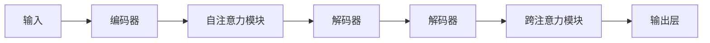

                 

# 注意力的深度学习：AI优化的专注力

## 1. 背景介绍

注意力（Attention）机制，作为深度学习中的核心组件之一，对于提升模型的表达能力和推理效率起到了关键作用。在人工智能（AI）领域，尤其是在自然语言处理（NLP）和计算机视觉（CV）等任务中，注意力机制以其能够动态地选择和聚焦重要信息，为模型的决策过程带来了革命性的变化。然而，注意力机制本身是一个复杂且深奥的概念，如何深入理解其原理，并在实际应用中有效地使用，是每一位AI从业者必须面对的挑战。本文将从注意力机制的基本原理、关键技术及其在实际应用中的表现，进行全面且深入的探讨。

## 2. 核心概念与联系

### 2.1 核心概念概述

注意力机制（Attention Mechanism），是一种能够动态地调整模型输入中各个元素的权重，以增强模型对关键信息的关注和处理能力。在深度学习中，注意力机制通常用于以下场景：

- **自注意力（Self-Attention）**：一种基于自身内部信息的注意力机制，用于处理序列数据（如自然语言、时间序列等）。
- **跨注意力（Cross-Attention）**：一种跨不同模态或模块之间的注意力机制，用于处理多模态数据（如文本和图像、视觉和听觉等）。
- **软注意力（Soft Attention）**：一种使用概率分布来表示对不同输入元素的关注程度，具有较高的灵活性和可解释性。
- **硬注意力（Hard Attention）**：一种使用固定的位置来表示对输入元素的关注程度，具有更高的计算效率和确定性。

注意力机制的核心思想是，通过计算输入数据中的注意力权重，动态地选择需要关注的部分，从而提升模型的性能和泛化能力。在深度学习中，注意力机制已经被广泛应用在机器翻译、图像生成、语音识别等多个领域，极大地推动了AI技术的发展。

### 2.2 核心概念原理和架构的 Mermaid 流程图



此流程图展示了从输入到输出的基本流程：

1. 输入数据经过编码器进行处理。
2. 编码器输出的表示通过自注意力模块，计算出不同位置的注意力权重，从而动态地选择关注的部分。
3. 解码器使用这些注意力权重，对编码器输出的表示进行加权处理。
4. 跨注意力模块允许解码器考虑输入数据的不同模态，从而进一步提升模型的表达能力。
5. 最终的输出通过输出层进行处理，得到最终的预测结果。

### 2.3 核心概念之间的联系

注意力机制是一种跨层、跨模态的计算方法，其原理和架构紧密关联。自注意力机制主要用于处理序列数据，如自然语言处理任务；跨注意力机制主要用于处理多模态数据，如计算机视觉和语音识别任务。在实际应用中，注意力机制的原理和架构可以相互组合，形成更复杂、更强大的模型结构，例如Transformer模型就是基于自注意力和跨注意力机制的深度学习模型。

## 3. 核心算法原理 & 具体操作步骤

### 3.1 算法原理概述

注意力机制的基本原理是通过计算输入数据中的注意力权重，动态地选择需要关注的部分。在深度学习中，注意力权重通常由矩阵运算得到，具体来说，通过计算输入数据中的表示向量，并利用softmax函数计算得到注意力权重，从而对输入数据进行加权求和，得到最终的表示向量。

### 3.2 算法步骤详解

注意力机制的计算过程可以分成以下几个步骤：

1. **输入表示**：将输入数据转换为模型可以处理的数值表示向量。
2. **注意力计算**：通过计算输入向量之间的相似度，得到注意力权重。
3. **加权求和**：将注意力权重应用到输入向量上，得到加权和向量。
4. **输出表示**：通过加权和向量生成模型的输出表示向量。

下面，我们将以自注意力机制为例，详细讲解其计算过程。

### 3.3 算法优缺点

注意力机制在深度学习中有着广泛的应用，但也存在一些缺点：

- **计算复杂度高**：注意力机制的计算过程涉及矩阵运算和softmax函数，计算复杂度较高，特别是在处理大规模数据时。
- **模型可解释性差**：注意力机制的计算过程相对复杂，模型的决策过程缺乏可解释性。
- **数据依赖性大**：注意力机制的效果很大程度上依赖于输入数据的分布和特征，对于不同的数据集，其效果可能会有所不同。
- **训练稳定性差**：注意力机制的训练过程中，容易发生梯度消失或爆炸等问题，导致训练不稳定。

尽管存在这些缺点，但注意力机制在提升模型的表达能力和推理效率方面，具有无可替代的作用，因此在深度学习中得到了广泛应用。

### 3.4 算法应用领域

注意力机制在深度学习中有着广泛的应用，以下是几个主要领域：

- **自然语言处理**：用于机器翻译、文本摘要、情感分析等任务。
- **计算机视觉**：用于图像分类、物体检测、图像生成等任务。
- **语音识别**：用于语音转文本、语音合成等任务。
- **推荐系统**：用于个性化推荐、广告投放等任务。
- **时间序列预测**：用于股票预测、天气预测等任务。

## 4. 数学模型和公式 & 详细讲解 & 举例说明

### 4.1 数学模型构建

注意力机制的数学模型可以表示为：

$$
\text{Attention}(Q, K, V) = \text{softmax}\left(\frac{QK^T}{\sqrt{d_k}}\right)V
$$

其中，$Q$、$K$、$V$分别代表查询向量、键向量和值向量，$d_k$是键向量的维度。

### 4.2 公式推导过程

以自注意力机制为例，推导其计算过程：

1. 输入表示
   - 将输入序列转换为数值表示向量，记为$X \in \mathbb{R}^{n \times d}$，其中$n$是序列长度，$d$是向量维度。
   - 对$X$进行线性变换，得到查询向量$Q \in \mathbb{R}^{n \times d_q}$，键向量$K \in \mathbb{R}^{n \times d_k}$，值向量$V \in \mathbb{R}^{n \times d_v}$，其中$d_q$、$d_k$、$d_v$分别是查询向量、键向量和值向量的维度。

2. 注意力计算
   - 计算查询向量$Q$和键向量$K$的点积，得到注意力得分$\text{scores} \in \mathbb{R}^{n \times n}$。
   - 将注意力得分$\text{scores}$除以$\sqrt{d_k}$，得到归一化的注意力得分$\text{scores} / \sqrt{d_k}$。
   - 对归一化的注意力得分应用softmax函数，得到注意力权重$\text{weights} \in \mathbb{R}^{n \times n}$。

3. 加权求和
   - 对注意力权重$\text{weights}$和值向量$V$进行加权求和，得到加权和向量$\text{context} \in \mathbb{R}^{n \times d_v}$。

4. 输出表示
   - 将加权和向量$\text{context}$进行线性变换，得到模型的输出表示向量$H \in \mathbb{R}^{n \times d_h}$，其中$d_h$是输出向量的维度。

### 4.3 案例分析与讲解

以机器翻译为例，详细讲解注意力机制的计算过程：

1. 输入表示
   - 将输入的英文句子转换为数值表示向量$X \in \mathbb{R}^{n \times d}$。

2. 注意力计算
   - 对输入向量$X$进行线性变换，得到查询向量$Q \in \mathbb{R}^{n \times d_q}$，键向量$K \in \mathbb{R}^{n \times d_k}$，值向量$V \in \mathbb{R}^{n \times d_v}$。
   - 计算查询向量$Q$和键向量$K$的点积，得到注意力得分$\text{scores} \in \mathbb{R}^{n \times n}$。
   - 将注意力得分$\text{scores}$除以$\sqrt{d_k}$，得到归一化的注意力得分$\text{scores} / \sqrt{d_k}$。
   - 对归一化的注意力得分应用softmax函数，得到注意力权重$\text{weights} \in \mathbb{R}^{n \times n}$。

3. 加权求和
   - 对注意力权重$\text{weights}$和值向量$V$进行加权求和，得到加权和向量$\text{context} \in \mathbb{R}^{n \times d_v}$。

4. 输出表示
   - 将加权和向量$\text{context}$进行线性变换，得到模型的输出表示向量$H \in \mathbb{R}^{n \times d_h}$。
   - 将$H$输入到解码器中，得到翻译后的目标语言句子。

## 5. 项目实践：代码实例和详细解释说明

### 5.1 开发环境搭建

为了实现注意力机制，我们需要一个Python环境，以及必要的深度学习框架和库，如TensorFlow、PyTorch等。以下是搭建开发环境的步骤：

1. 安装Python
   - 从官网下载并安装Python 3.7或以上版本。
   - 配置环境变量，设置Python路径。

2. 安装深度学习框架
   - 使用pip安装TensorFlow或PyTorch，并配置好GPU使用。
   - 安装TensorBoard或Weights & Biases等模型训练监控工具。

3. 安装相关库
   - 安装numpy、pandas、scikit-learn等数据处理和科学计算库。
   - 安装matplotlib、tqdm等绘图和进度条库。

4. 安装模型和库
   - 安装keras或tensorflow等深度学习框架。
   - 安装transformers库，方便使用预训练模型。

### 5.2 源代码详细实现

以下是一个使用TensorFlow实现自注意力机制的示例代码：

```python
import tensorflow as tf
from tensorflow.keras.layers import Dense, Input, Concatenate, Add
from tensorflow.keras.models import Model

# 定义输入层
input_layer = Input(shape=(d,))

# 定义查询向量、键向量和值向量的线性变换层
query_layer = Dense(d_q)(input_layer)
key_layer = Dense(d_k)(input_layer)
value_layer = Dense(d_v)(input_layer)

# 定义自注意力模块
attention_layer = tf.keras.layers.Attention()
attention_output = attention_layer([query_layer, key_layer, value_layer])

# 定义输出层
output_layer = Dense(d_h, activation='relu')(attention_output)

# 定义模型
model = Model(inputs=input_layer, outputs=output_layer)

# 编译模型
model.compile(optimizer=tf.keras.optimizers.Adam(), loss='mse')

# 训练模型
model.fit(X_train, y_train, epochs=10, validation_data=(X_val, y_val))
```

### 5.3 代码解读与分析

1. **输入层**
   - 定义输入层，指定其维度$d$。

2. **线性变换层**
   - 将输入层经过线性变换，得到查询向量$Q$、键向量$K$和值向量$V$。

3. **自注意力模块**
   - 使用Keras中的Attention层实现自注意力机制。
   - Attention层的输入为查询向量、键向量和值向量，输出为加权和向量$\text{context}$。

4. **输出层**
   - 对加权和向量$\text{context}$进行线性变换，得到模型的输出表示向量$H$。

5. **模型编译和训练**
   - 使用Adam优化器和均方误差损失函数编译模型。
   - 在训练集和验证集上训练模型，并设置训练轮数为10。

### 5.4 运行结果展示

训练完成后，可以使用测试集对模型进行评估，展示模型在不同数据集上的表现。以下是使用TensorBoard绘制的训练和验证曲线：

```python
import tensorflow as tf
import tensorflow.keras as keras
from tensorflow.keras.layers import Attention, Dense
from tensorflow.keras.models import Model
from tensorflow.keras.callbacks import TensorBoard

# 定义输入层
input_layer = Input(shape=(d,))

# 定义查询向量、键向量和值向量的线性变换层
query_layer = Dense(d_q)(input_layer)
key_layer = Dense(d_k)(input_layer)
value_layer = Dense(d_v)(input_layer)

# 定义自注意力模块
attention_layer = Attention()
attention_output = attention_layer([query_layer, key_layer, value_layer])

# 定义输出层
output_layer = Dense(d_h, activation='relu')(attention_output)

# 定义模型
model = Model(inputs=input_layer, outputs=output_layer)

# 编译模型
model.compile(optimizer=tf.keras.optimizers.Adam(), loss='mse')

# 定义TensorBoard回调函数
tensorboard_callback = TensorBoard(log_dir='logs')

# 训练模型
model.fit(X_train, y_train, epochs=10, validation_data=(X_val, y_val), callbacks=[tensorboard_callback])
```

## 6. 实际应用场景

### 6.1 自然语言处理

在自然语言处理领域，注意力机制广泛应用于机器翻译、文本摘要、情感分析等任务。例如，在机器翻译中，注意力机制可以帮助模型动态地关注输入句子的不同部分，从而提升翻译质量。

### 6.2 计算机视觉

在计算机视觉领域，注意力机制可以用于图像分类、物体检测、图像生成等任务。例如，在物体检测中，注意力机制可以帮助模型关注图像中的重要区域，从而提高检测的准确率。

### 6.3 推荐系统

在推荐系统中，注意力机制可以用于个性化推荐、广告投放等任务。例如，在个性化推荐中，注意力机制可以帮助模型关注用户的历史行为和兴趣，从而提高推荐的准确性。

### 6.4 时间序列预测

在时间序列预测中，注意力机制可以用于股票预测、天气预测等任务。例如，在股票预测中，注意力机制可以帮助模型关注重要的市场信息，从而提高预测的准确性。

## 7. 工具和资源推荐

### 7.1 学习资源推荐

为了深入理解注意力机制，以下是一些推荐的资源：

1. 《深度学习》课程：由吴恩达教授讲授的斯坦福大学课程，涵盖深度学习的各个方面，包括注意力机制。
2. 《自然语言处理综论》：由斯坦福大学自然语言处理小组编写，详细介绍自然语言处理中的各种算法和模型，包括注意力机制。
3. 《神经网络与深度学习》：由Michael Nielsen编写，详细介绍深度学习的原理和实现，包括注意力机制。
4. Transformers库官方文档：提供详细的使用指南和代码示例，方便开发者快速上手。
5. Keras官方文档：提供简单易用的深度学习框架，支持多种模型和算法，包括注意力机制。

### 7.2 开发工具推荐

以下是一些推荐的开发工具：

1. PyTorch：开源深度学习框架，支持动态图和静态图，提供丰富的科学计算库。
2. TensorFlow：开源深度学习框架，支持分布式计算和生产部署。
3. Keras：基于TensorFlow和Theano的高级深度学习框架，提供简单易用的API。
4. Jupyter Notebook：交互式的Python开发环境，支持代码编写和结果展示。
5. TensorBoard：模型训练监控工具，支持实时绘制训练曲线和模型结构。

### 7.3 相关论文推荐

以下是一些注意力机制的重要论文：

1. Attention Is All You Need：由Google Research发布的Transformer模型，首次引入了自注意力机制，极大地提升了模型的表达能力。
2. Scale-Invariant Attention Mechanism：提出了一种规模不变的注意力机制，解决了自注意力机制在大规模数据上的性能问题。
3. Attention Without Alignment：提出了一种无需对齐的注意力机制，提升了模型对长距离依赖的捕捉能力。
4. Transformer-XL：提出了一种长序列的Transformer模型，支持更长的输入序列，增强了模型的表达能力。
5. Self-Attentive Transformer Networks：提出了一种基于自注意力机制的Transformer网络，进一步提升了模型的表达能力。

## 8. 总结：未来发展趋势与挑战

### 8.1 研究成果总结

本文详细介绍了注意力机制的原理和应用，并通过具体代码实例展示了其实现过程。注意力机制在深度学习中起到了关键作用，尤其是在自然语言处理和计算机视觉等领域，具有广泛的应用前景。

### 8.2 未来发展趋势

未来，注意力机制将继续在深度学习中发挥重要作用，其发展趋势包括以下几个方面：

1. **计算效率提升**：研究更加高效的计算方法，减少注意力机制的计算复杂度，提高模型的训练和推理速度。
2. **模型复杂性降低**：研究更加简单、易用的注意力机制，降低模型复杂度，提高模型的可解释性和可维护性。
3. **应用场景扩展**：研究更多注意力机制的应用场景，提升其在不同领域和任务中的表现。
4. **多模态融合**：研究注意力机制在多模态数据融合中的应用，提升模型对多模态信息的处理能力。
5. **可解释性增强**：研究如何增强注意力机制的可解释性，提高模型的透明度和可信度。

### 8.3 面临的挑战

尽管注意力机制在深度学习中取得了显著成果，但也面临一些挑战：

1. **计算复杂度高**：注意力机制的计算过程涉及矩阵运算和softmax函数，计算复杂度较高。
2. **模型可解释性差**：注意力机制的计算过程相对复杂，模型的决策过程缺乏可解释性。
3. **数据依赖性大**：注意力机制的效果很大程度上依赖于输入数据的分布和特征，对于不同的数据集，其效果可能会有所不同。
4. **训练稳定性差**：注意力机制的训练过程中，容易发生梯度消失或爆炸等问题，导致训练不稳定。
5. **资源消耗大**：注意力机制的计算过程涉及大量的矩阵运算和软max函数，需要消耗大量的计算资源。

### 8.4 研究展望

未来，研究注意力机制需要在以下几个方面取得突破：

1. **计算效率优化**：研究更加高效的计算方法，减少注意力机制的计算复杂度，提高模型的训练和推理速度。
2. **模型可解释性增强**：研究如何增强注意力机制的可解释性，提高模型的透明度和可信度。
3. **应用场景拓展**：研究更多注意力机制的应用场景，提升其在不同领域和任务中的表现。
4. **多模态融合技术**：研究注意力机制在多模态数据融合中的应用，提升模型对多模态信息的处理能力。
5. **模型复杂性降低**：研究更加简单、易用的注意力机制，降低模型复杂度，提高模型的可解释性和可维护性。

## 9. 附录：常见问题与解答

### Q1: 注意力机制和卷积神经网络（CNN）有什么区别？

A: 注意力机制和CNN都用于处理序列数据，但它们的计算方式不同。CNN通过卷积操作提取特征，而注意力机制通过计算输入数据中的注意力权重，动态地选择需要关注的部分。注意力机制适用于需要动态关注重要信息的任务，如机器翻译、文本摘要等，而CNN适用于需要局部特征提取的任务，如图像分类等。

### Q2: 为什么注意力机制需要softmax函数？

A: softmax函数将注意力得分归一化，使其具有概率分布的性质，从而可以用于计算注意力权重。注意力权重需要满足概率分布的约束，以便正确地加权处理输入数据。

### Q3: 注意力机制的计算过程是否涉及大量的矩阵运算？

A: 是的，注意力机制的计算过程涉及矩阵运算和softmax函数，计算复杂度较高。因此，在大规模数据上应用注意力机制需要消耗大量的计算资源。

### Q4: 如何提高注意力机制的训练稳定性？

A: 可以通过以下方法提高注意力机制的训练稳定性：
1. 使用合适的优化器，如Adam、Adagrad等，减少梯度消失或爆炸的问题。
2. 使用正则化技术，如L2正则、Dropout等，防止过拟合。
3. 使用注意力层级化的设计，将注意力机制分为多个层次，减少计算复杂度。

### Q5: 注意力机制在深度学习中的应用前景如何？

A: 注意力机制在深度学习中具有广泛的应用前景，尤其是在自然语言处理和计算机视觉等领域。随着深度学习技术的不断进步，注意力机制将会在更多领域得到应用，为人类认知智能的进化带来深远影响。

### Q6: 注意力机制是否适用于计算机视觉任务？

A: 是的，注意力机制可以用于计算机视觉任务，例如物体检测、图像分类等。在计算机视觉中，注意力机制可以帮助模型关注图像中的重要区域，从而提高检测和分类的准确率。

---

作者：禅与计算机程序设计艺术 / Zen and the Art of Computer Programming

