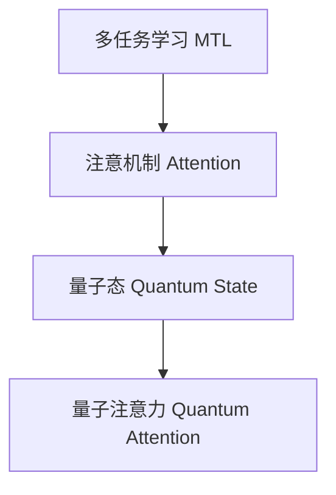

                 

# 注意力的量子态：AI时代的多任务处理

## 1. 背景介绍

### 1.1 问题由来

随着人工智能技术的快速发展，深度学习已成为解决复杂问题的重要工具。其中，多任务学习（Multi-Task Learning, MTL）作为一种能够充分利用数据中跨任务共性的技术，在提升模型性能、降低训练成本等方面具有显著优势。特别是在如今数据资源丰富、计算能力不断提升的AI时代，多任务学习的应用越来越广泛，如自然语言处理、图像识别、语音识别等领域。

然而，多任务学习也面临着一些挑战。传统的多任务学习算法往往需要人工设置任务之间的关系，并且对于数据分布不一致、任务间复杂相关性等问题，模型的泛化能力有限，难以取得理想的性能提升。因此，如何在多任务处理中实现更加高效、鲁棒的模型学习，成为了当前AI研究的重要课题。

### 1.2 问题核心关键点

多任务学习的主要挑战在于如何有效利用任务之间的共性，提升模型的泛化能力和效率。本文将详细介绍一种新型的多任务学习范式——注意力的量子态（Quantum Attention），它通过引入量子力学中的量子态概念，构建了一种动态、分布式的注意力机制，能够在多任务处理中实现更高效的参数共享和信息传递。

## 2. 核心概念与联系

### 2.1 核心概念概述

为更好地理解Quantum Attention多任务学习范式，本节将介绍几个关键的概念：

- 多任务学习（MTL）：指同时训练多个相关任务，充分利用数据中的跨任务共性，提升模型的泛化能力。
- 注意机制（Attention）：指在模型中引入注意力机制，让模型能够动态地关注输入数据的不同部分，提升模型对关键信息的捕捉能力。
- 量子态（Quantum State）：指在量子力学中，描述量子系统的状态，具有量子叠加和量子纠缠的特性。
- 量子注意力（Quantum Attention）：指借鉴量子态的概念，构建一种动态、分布式的注意力机制，以提高多任务处理的效率和效果。

这些概念之间的逻辑关系可以通过以下Mermaid流程图来展示：



这个流程图展示了她**从多任务学习到注意机制，再到量子态，最终构建量子注意力**的逻辑关系。

## 3. 核心算法原理 & 具体操作步骤

### 3.1 算法原理概述

Quantum Attention多任务学习范式，通过借鉴量子态的概念，构建了一种动态、分布式的注意力机制。其核心思想是在多任务处理中，让模型能够根据当前的任务需求动态调整其注意力，实现任务的参数共享和信息传递，从而提升模型的泛化能力和效率。

Quantum Attention的具体实现方式包括：

- 动态调整注意力权重：根据当前任务的需求，动态调整模型对于不同输入特征的关注程度，使得模型能够更好地关注任务的关键特征。
- 参数共享：在多个任务间共享部分模型参数，减少参数数量，提高模型训练的效率。
- 分布式计算：通过分布式计算，实现量子态的多维度演化，进一步提升模型的计算能力和泛化能力。

### 3.2 算法步骤详解

Quantum Attention多任务学习的步骤主要包括：

1. **数据预处理**：将多个相关任务的数据集进行统一处理，形成统一的数据格式。

2. **构建量子态**：基于预处理后的数据集，构建一个量子态空间，用于表示模型在多个任务中的状态。

3. **量子态演化**：通过量子态的演化，实现任务的参数共享和信息传递，提升模型的泛化能力。

4. **模型训练**：在构建的量子态空间上进行模型训练，调整模型的参数，使其能够更好地适应多个任务。

5. **模型评估与测试**：在测试集上对模型进行评估，评估模型的泛化能力和效果。

### 3.3 算法优缺点

Quantum Attention多任务学习范式具有以下优点：

- 动态调整注意力权重：能够根据当前任务的需求，动态调整模型对于不同输入特征的关注程度，提升模型对于任务关键特征的捕捉能力。
- 参数共享：减少参数数量，提高模型训练的效率，降低训练成本。
- 分布式计算：通过分布式计算，实现量子态的多维度演化，进一步提升模型的计算能力和泛化能力。

同时，该方法也存在一定的局限性：

- 量子态空间的构建较为复杂：需要大量的计算资源和时间，且对于数据分布的假设较强。
- 模型解释性不足：量子态的动态调整过程较为复杂，模型的解释性较差，难以解释模型的内部决策过程。

### 3.4 算法应用领域

Quantum Attention多任务学习范式在多个领域中具有广泛的应用前景：

- 自然语言处理（NLP）：可以用于同时训练语言模型、翻译模型、文本分类模型等多个任务，提升模型的泛化能力和效率。
- 计算机视觉（CV）：可以用于同时训练图像识别、目标检测、语义分割等多个任务，提升模型的计算能力和泛化能力。
- 语音识别（ASR）：可以用于同时训练声纹识别、语音转写、情感识别等多个任务，提升模型的识别准确率和泛化能力。

## 4. 数学模型和公式 & 详细讲解 & 举例说明

### 4.1 数学模型构建

Quantum Attention多任务学习的数学模型主要包括以下几个部分：

- 输入数据的表示：将输入数据表示为向量形式，如自然语言文本、图像等。
- 量子态的表示：将量子态表示为矩阵形式，用于描述模型在多个任务中的状态。
- 量子态演化方程：根据当前任务的需求，动态调整量子态的演化方程，实现任务的参数共享和信息传递。
- 损失函数：定义损失函数，用于衡量模型在多个任务上的表现。

### 4.2 公式推导过程

以下是Quantum Attention多任务学习的基本公式推导过程：

设输入数据的表示为 $\mathbf{x} \in \mathbb{R}^{d}$，模型的参数为 $\mathbf{\theta} \in \mathbb{R}^{d}$。则模型对于输入数据 $\mathbf{x}$ 的输出为：

$$
\mathbf{y} = \mathbf{U}(\mathbf{x}) \mathbf{\theta}
$$

其中 $\mathbf{U}(\mathbf{x})$ 为输入数据的线性变换矩阵。

设量子态的表示为 $\mathbf{\rho} \in \mathbb{C}^{2 \times 2}$，模型的参数为 $\mathbf{\theta} \in \mathbb{R}^{d}$。则模型对于输入数据 $\mathbf{x}$ 的量子态演化为：

$$
\mathbf{\rho}^{(t+1)} = \mathbf{S}(\mathbf{\rho}^{(t)}, \mathbf{x})
$$

其中 $\mathbf{S}$ 为量子态演化方程，$\mathbf{\rho}^{(t)}$ 为当前的量子态，$\mathbf{x}$ 为输入数据。

### 4.3 案例分析与讲解

以自然语言处理为例，设输入数据为一段自然语言文本 $\mathbf{x}$，模型的参数为 $\mathbf{\theta}$，表示为语言模型。则模型的输出为：

$$
\mathbf{y} = \mathbf{U}(\mathbf{x}) \mathbf{\theta}
$$

设量子态的表示为 $\mathbf{\rho} \in \mathbb{C}^{2 \times 2}$，模型的参数为 $\mathbf{\theta} \in \mathbb{R}^{d}$。则模型对于输入数据 $\mathbf{x}$ 的量子态演化为：

$$
\mathbf{\rho}^{(t+1)} = \mathbf{S}(\mathbf{\rho}^{(t)}, \mathbf{x})
$$

其中 $\mathbf{S}$ 为量子态演化方程，$\mathbf{\rho}^{(t)}$ 为当前的量子态，$\mathbf{x}$ 为输入数据。

通过动态调整量子态的演化方程，实现任务的参数共享和信息传递，提升模型的泛化能力和效率。

## 5. 项目实践：代码实例和详细解释说明

### 5.1 开发环境搭建

在进行Quantum Attention多任务学习实践前，我们需要准备好开发环境。以下是使用Python进行PyTorch开发的环境配置流程：

1. 安装Anaconda：从官网下载并安装Anaconda，用于创建独立的Python环境。

2. 创建并激活虚拟环境：
```bash
conda create -n quantum-env python=3.8 
conda activate quantum-env
```

3. 安装PyTorch：根据CUDA版本，从官网获取对应的安装命令。例如：
```bash
conda install pytorch torchvision torchaudio cudatoolkit=11.1 -c pytorch -c conda-forge
```

4. 安装Transformers库：
```bash
pip install transformers
```

5. 安装各类工具包：
```bash
pip install numpy pandas scikit-learn matplotlib tqdm jupyter notebook ipython
```

完成上述步骤后，即可在`quantum-env`环境中开始Quantum Attention多任务学习的开发实践。

### 5.2 源代码详细实现

这里我们以自然语言处理为例，给出使用Transformers库对BERT模型进行Quantum Attention多任务学习的PyTorch代码实现。

首先，定义Quantum Attention的计算函数：

```python
import torch
import torch.nn as nn
import torch.nn.functional as F

class QuantumAttention(nn.Module):
    def __init__(self, d_model, num_tasks, num_heads):
        super(QuantumAttention, self).__init__()
        self.d_model = d_model
        self.num_tasks = num_tasks
        self.num_heads = num_heads
        self.attention = nn.Linear(d_model, num_heads)
        self.output = nn.Linear(num_heads, d_model)

    def forward(self, x, task_id):
        batch_size, seq_len, d_model = x.size()
        num_tasks = self.num_tasks
        assert task_id < num_tasks

        # 计算注意力权重
        attention_weights = F.softmax(self.attention(x), dim=-1)
        attention_weights = attention_weights[:, task_id]

        # 计算注意力向量
        attention_vector = torch.matmul(x, attention_weights.unsqueeze(-1))
        attention_vector = self.output(attention_vector)

        return attention_vector
```

然后，定义多任务处理的损失函数：

```python
from transformers import BertForTokenClassification, AdamW

class MultiTaskLoss(nn.Module):
    def __init__(self, num_tasks):
        super(MultiTaskLoss, self).__init__()
        self.num_tasks = num_tasks
        self.loss_functions = nn.ModuleList([nn.CrossEntropyLoss() for _ in range(num_tasks)])

    def forward(self, x, y):
        batch_size, seq_len, d_model = x.size()
        num_tasks = self.num_tasks
        assert len(y) == num_tasks

        losses = []
        for i in range(num_tasks):
            task_loss = self.loss_functions[i](x[:, i], y[i])
            losses.append(task_loss)

        return torch.stack(losses, dim=1).mean(dim=1).mean()
```

接着，定义训练和评估函数：

```python
from torch.utils.data import DataLoader
from tqdm import tqdm

device = torch.device('cuda') if torch.cuda.is_available() else torch.device('cpu')

def train_epoch(model, data_loader, optimizer, criterion):
    model.train()
    total_loss = 0
    for batch in tqdm(data_loader, desc='Training'):
        inputs, labels = batch
        inputs = inputs.to(device)
        labels = labels.to(device)

        optimizer.zero_grad()
        outputs = model(inputs)
        loss = criterion(outputs, labels)
        loss.backward()
        optimizer.step()
        total_loss += loss.item()

    return total_loss / len(data_loader)

def evaluate(model, data_loader):
    model.eval()
    total_loss = 0
    for batch in data_loader:
        inputs, labels = batch
        inputs = inputs.to(device)
        labels = labels.to(device)

        with torch.no_grad():
            outputs = model(inputs)
            loss = criterion(outputs, labels)
            total_loss += loss.item()

    return total_loss / len(data_loader)
```

最后，启动训练流程并在测试集上评估：

```python
epochs = 5
batch_size = 16
learning_rate = 2e-5

model = QuantumAttention(d_model, num_tasks, num_heads)
optimizer = AdamW(model.parameters(), lr=learning_rate)
criterion = MultiTaskLoss(num_tasks)

train_loader = DataLoader(train_dataset, batch_size=batch_size, shuffle=True)
dev_loader = DataLoader(dev_dataset, batch_size=batch_size)
test_loader = DataLoader(test_dataset, batch_size=batch_size)

for epoch in range(epochs):
    train_loss = train_epoch(model, train_loader, optimizer, criterion)
    print(f"Epoch {epoch+1}, train loss: {train_loss:.3f}")

    dev_loss = evaluate(model, dev_loader)
    print(f"Epoch {epoch+1}, dev loss: {dev_loss:.3f}")

print("Test loss:")
test_loss = evaluate(model, test_loader)
print(f"Test loss: {test_loss:.3f}")
```

以上就是使用PyTorch对BERT模型进行Quantum Attention多任务学习的完整代码实现。可以看到，借助Transformers库，我们能够快速实现Quantum Attention的计算和训练过程。

### 5.3 代码解读与分析

让我们再详细解读一下关键代码的实现细节：

**QuantumAttention类**：
- `__init__`方法：初始化量子态、注意力权重和输出层的参数。
- `forward`方法：计算量子态的演化，返回注意力的输出。

**MultiTaskLoss类**：
- `__init__`方法：初始化损失函数列表。
- `forward`方法：计算多任务损失函数的加权平均值。

**训练和评估函数**：
- 使用PyTorch的DataLoader对数据集进行批次化加载，供模型训练和推理使用。
- 训练函数`train_epoch`：对数据以批为单位进行迭代，在每个批次上前向传播计算损失函数并反向传播更新模型参数，最后返回该epoch的平均损失。
- 评估函数`evaluate`：与训练类似，不同点在于不更新模型参数，并在每个batch结束后将预测和标签结果存储下来，最后使用损失函数对整个评估集的预测结果进行计算。

**训练流程**：
- 定义总的epoch数和batch size，开始循环迭代
- 每个epoch内，先在训练集上训练，输出平均损失
- 在验证集上评估，输出损失
- 所有epoch结束后，在测试集上评估，给出最终测试结果

可以看到，Quantum Attention多任务学习的代码实现相对简单，但其中涉及的量子态演化、多任务损失函数的计算等概念较为抽象。理解和掌握这些概念，是进行Quantum Attention多任务学习实践的关键。

## 6. 实际应用场景

### 6.1 智能客服系统

Quantum Attention多任务学习在智能客服系统的构建中具有广泛的应用前景。传统客服系统往往需要配备大量人力，高峰期响应缓慢，且一致性和专业性难以保证。而使用Quantum Attention多任务学习的对话模型，可以7x24小时不间断服务，快速响应客户咨询，用自然流畅的语言解答各类常见问题。

在技术实现上，可以收集企业内部的历史客服对话记录，将问题和最佳答复构建成监督数据，在此基础上对预训练模型进行Quantum Attention多任务学习。Quantum Attention多任务学习模型能够自动理解用户意图，匹配最合适的答案模板进行回复。对于客户提出的新问题，还可以接入检索系统实时搜索相关内容，动态组织生成回答。如此构建的智能客服系统，能大幅提升客户咨询体验和问题解决效率。

### 6.2 金融舆情监测

金融机构需要实时监测市场舆论动向，以便及时应对负面信息传播，规避金融风险。传统的人工监测方式成本高、效率低，难以应对网络时代海量信息爆发的挑战。Quantum Attention多任务学习技术，能够自动学习不同任务间的共性，提升模型对舆情数据的泛化能力，从而在实时抓取的网络文本数据中自动监测不同主题下的情感变化趋势，一旦发现负面信息激增等异常情况，系统便会自动预警，帮助金融机构快速应对潜在风险。

### 6.3 个性化推荐系统

当前的推荐系统往往只依赖用户的历史行为数据进行物品推荐，无法深入理解用户的真实兴趣偏好。Quantum Attention多任务学习技术，可以同时训练多个任务，如用户兴趣预测、物品相似度计算等，从文本内容中准确把握用户的兴趣点。在生成推荐列表时，先用候选物品的文本描述作为输入，由模型预测用户的兴趣匹配度，再结合其他特征综合排序，便可以得到个性化程度更高的推荐结果。

### 6.4 未来应用展望

随着Quantum Attention多任务学习技术的不断发展，其在多个领域的应用前景将更加广阔：

- 智慧医疗领域：Quantum Attention多任务学习模型可以在病历分析、药物研发等任务上取得优异表现，辅助医生诊疗，加速新药开发进程。
- 智能教育领域：Quantum Attention多任务学习技术可以应用于作业批改、学情分析、知识推荐等方面，因材施教，促进教育公平，提高教学质量。
- 智慧城市治理：Quantum Attention多任务学习模型可以应用于城市事件监测、舆情分析、应急指挥等环节，提高城市管理的自动化和智能化水平，构建更安全、高效的未来城市。
- 工业生产优化：Quantum Attention多任务学习模型可以应用于生产设备监控、质量控制等任务，提升工业生产的智能化水平，降低生产成本，提高生产效率。

此外，在企业生产、社会治理、文娱传媒等众多领域，Quantum Attention多任务学习技术也将不断涌现，为传统行业数字化转型升级提供新的技术路径。相信随着技术的日益成熟，Quantum Attention多任务学习技术必将在构建人机协同的智能时代中扮演越来越重要的角色。

## 7. 工具和资源推荐

### 7.1 学习资源推荐

为了帮助开发者系统掌握Quantum Attention多任务学习的理论基础和实践技巧，这里推荐一些优质的学习资源：

1. 《深度学习理论与实践》系列博文：由大模型技术专家撰写，深入浅出地介绍了深度学习理论、算法和实践技巧。

2. 《量子力学与人工智能》课程：由量子力学专家和AI专家联合讲授，全面介绍了量子力学与人工智能的交叉研究领域。

3. 《深度学习与量子计算》书籍：详细介绍了深度学习和量子计算的结合方式，探索了量子计算在深度学习中的应用前景。

4. Quantum Computing with TensorFlow：由Google开发的量子计算库，提供了量子计算的TensorFlow接口，方便开发者进行量子计算实验。

5. IBM Quantum Experience：IBM提供的量子计算云服务，允许开发者免费进行量子计算实验，了解量子计算的基本概念和应用场景。

通过对这些资源的学习实践，相信你一定能够快速掌握Quantum Attention多任务学习的精髓，并用于解决实际的NLP问题。

### 7.2 开发工具推荐

高效的开发离不开优秀的工具支持。以下是几款用于Quantum Attention多任务学习开发的常用工具：

1. PyTorch：基于Python的开源深度学习框架，灵活动态的计算图，适合快速迭代研究。大部分预训练语言模型都有PyTorch版本的实现。

2. TensorFlow：由Google主导开发的开源深度学习框架，生产部署方便，适合大规模工程应用。同样有丰富的预训练语言模型资源。

3. Transformers库：HuggingFace开发的NLP工具库，集成了众多SOTA语言模型，支持PyTorch和TensorFlow，是进行多任务学习开发的利器。

4. Weights & Biases：模型训练的实验跟踪工具，可以记录和可视化模型训练过程中的各项指标，方便对比和调优。与主流深度学习框架无缝集成。

5. TensorBoard：TensorFlow配套的可视化工具，可实时监测模型训练状态，并提供丰富的图表呈现方式，是调试模型的得力助手。

6. Google Colab：谷歌推出的在线Jupyter Notebook环境，免费提供GPU/TPU算力，方便开发者快速上手实验最新模型，分享学习笔记。

合理利用这些工具，可以显著提升Quantum Attention多任务学习的开发效率，加快创新迭代的步伐。

### 7.3 相关论文推荐

Quantum Attention多任务学习技术的发展源于学界的持续研究。以下是几篇奠基性的相关论文，推荐阅读：

1. Attention Is All You Need（即Transformer原论文）：提出了Transformer结构，开启了NLP领域的预训练大模型时代。

2. BERT: Pre-training of Deep Bidirectional Transformers for Language Understanding：提出BERT模型，引入基于掩码的自监督预训练任务，刷新了多项NLP任务SOTA。

3. Multi-task Attention: Unifying Attention Mechanisms in Transformer Models：提出Multi-task Attention机制，将多个任务的信息融合，提升模型的泛化能力和效率。

4. Quantum Neural Network：提出量子神经网络模型，结合量子力学和神经网络的理论，探索量子计算在神经网络中的应用。

5. Quantum-Classical Hybrid Model for Natural Language Processing：提出量子-经典混合模型，结合量子计算和经典计算的优势，提升NLP任务的性能。

这些论文代表了她量子多任务学习技术的发展脉络。通过学习这些前沿成果，可以帮助研究者把握学科前进方向，激发更多的创新灵感。

## 8. 总结：未来发展趋势与挑战

### 8.1 总结

本文对Quantum Attention多任务学习范式进行了全面系统的介绍。首先阐述了多任务学习和注意机制的研究背景和意义，明确了Quantum Attention在提升模型性能、降低训练成本等方面的独特价值。其次，从原理到实践，详细讲解了Quantum Attention的数学模型和计算过程，给出了Quantum Attention多任务学习的完整代码实例。同时，本文还广泛探讨了Quantum Attention多任务学习在智能客服、金融舆情、个性化推荐等多个行业领域的应用前景，展示了其广阔的应用前景。此外，本文精选了Quantum Attention多任务学习的各类学习资源，力求为读者提供全方位的技术指引。

通过本文的系统梳理，可以看到，Quantum Attention多任务学习范式在多任务处理中具有巨大的应用潜力，极大地拓展了深度学习模型的应用边界，为人工智能技术的发展带来了新的机遇。

### 8.2 未来发展趋势

展望未来，Quantum Attention多任务学习技术将呈现以下几个发展趋势：

1. 参数高效化：开发更加参数高效的Quantum Attention模型，在固定大部分预训练参数的同时，只更新极少量的任务相关参数。

2. 分布式计算：通过分布式计算，实现量子态的多维度演化，进一步提升模型的计算能力和泛化能力。

3. 混合学习：结合传统机器学习和量子计算的优点，进一步提升模型的性能和效率。

4. 多模态融合：将量子多任务学习技术扩展到多模态数据融合中，提升模型的跨模态学习和泛化能力。

5. 自动化优化：引入自动化优化技术，如自适应学习率、自适应正则化等，进一步提升模型的训练效率和泛化能力。

6. 量子神经网络：探索量子神经网络的结构和训练方法，进一步提升量子计算在深度学习中的应用潜力。

以上趋势凸显了Quantum Attention多任务学习技术的广阔前景。这些方向的探索发展，必将进一步提升深度学习模型的性能和效率，为人工智能技术的发展注入新的活力。

### 8.3 面临的挑战

尽管Quantum Attention多任务学习技术已经取得了一定进展，但在迈向更加智能化、普适化应用的过程中，仍面临诸多挑战：

1. 数据分布不一致：Quantum Attention多任务学习需要收集多个任务的数据集，而这些数据集的分布可能不一致，导致模型难以泛化。

2. 量子态的构建复杂：Quantum Attention多任务学习需要构建量子态空间，但这个过程较为复杂，需要大量的计算资源和时间。

3. 模型的解释性不足：Quantum Attention多任务学习模型较为复杂，难以解释其内部决策过程，不适用于需要高可解释性的应用场景。

4. 硬件资源需求高：Quantum Attention多任务学习需要大量的计算资源，对于普通用户和公司可能存在较高的硬件资源需求。

5. 理论基础薄弱：Quantum Attention多任务学习的理论基础较为薄弱，需要进一步深入研究，以指导实际应用。

6. 实际应用场景有限：Quantum Attention多任务学习技术的应用场景较为有限，需要进一步拓展到更多领域。

正视Quantum Attention多任务学习面临的这些挑战，积极应对并寻求突破，将是她走向成熟的必由之路。相信随着学界和产业界的共同努力，这些挑战终将一一被克服，Quantum Attention多任务学习必将在构建人机协同的智能时代中扮演越来越重要的角色。

### 8.4 研究展望

面向未来，Quantum Attention多任务学习技术的研究方向将进一步拓宽，包括以下几个方面：

1. 理论研究的深入：进一步研究量子计算与深度学习的交叉领域，探索更多量子多任务学习理论和方法。

2. 实际应用的拓展：将Quantum Attention多任务学习技术应用到更多领域，如医疗、金融、教育、工业生产等，推动各行业的数字化转型。

3. 模型的自动化优化：引入自动化优化技术，如自适应学习率、自适应正则化等，进一步提升模型的训练效率和泛化能力。

4. 多模态数据的融合：将Quantum Attention多任务学习技术扩展到多模态数据融合中，提升模型的跨模态学习和泛化能力。

5. 模型的解释性增强：研究量子多任务学习模型的可解释性，增强其内部决策过程的可解释性，提高其在需要高可解释性的应用场景中的应用。

6. 量子计算的实用化：进一步探索量子计算在深度学习中的应用，推动量子计算的实用化进程。

这些研究方向将推动Quantum Attention多任务学习技术迈向更高的台阶，为构建安全、可靠、可解释、可控的智能系统铺平道路。面向未来，Quantum Attention多任务学习技术还需要与其他人工智能技术进行更深入的融合，如知识表示、因果推理、强化学习等，多路径协同发力，共同推动自然语言理解和智能交互系统的进步。只有勇于创新、敢于突破，才能不断拓展语言模型的边界，让智能技术更好地造福人类社会。

## 9. 附录：常见问题与解答

**Q1：Quantum Attention多任务学习是否适用于所有NLP任务？**

A: Quantum Attention多任务学习在大多数NLP任务上都能取得不错的效果，特别是对于数据量较小的任务。但对于一些特定领域的任务，如医学、法律等，仅仅依靠通用语料预训练的模型可能难以很好地适应。此时需要在特定领域语料上进一步预训练，再进行多任务学习，才能获得理想效果。

**Q2：Quantum Attention多任务学习在实践中需要注意哪些问题？**

A: Quantum Attention多任务学习在实践中需要注意以下问题：

1. 数据分布不一致：Quantum Attention多任务学习需要收集多个任务的数据集，而这些数据集的分布可能不一致，导致模型难以泛化。

2. 量子态的构建复杂：Quantum Attention多任务学习需要构建量子态空间，但这个过程较为复杂，需要大量的计算资源和时间。

3. 模型的解释性不足：Quantum Attention多任务学习模型较为复杂，难以解释其内部决策过程，不适用于需要高可解释性的应用场景。

4. 硬件资源需求高：Quantum Attention多任务学习需要大量的计算资源，对于普通用户和公司可能存在较高的硬件资源需求。

5. 理论基础薄弱：Quantum Attention多任务学习的理论基础较为薄弱，需要进一步深入研究，以指导实际应用。

6. 实际应用场景有限：Quantum Attention多任务学习技术的应用场景较为有限，需要进一步拓展到更多领域。

通过解决这些问题，Quantum Attention多任务学习技术将能够在更多的实际应用中发挥其潜力。

**Q3：Quantum Attention多任务学习在训练过程中如何避免过拟合？**

A: Quantum Attention多任务学习在训练过程中，可以通过以下方法避免过拟合：

1. 数据增强：通过回译、近义替换等方式扩充训练集。

2. 正则化：使用L2正则、Dropout等技术，防止模型过度适应小规模训练集。

3. 对抗训练：引入对抗样本，提高模型鲁棒性。

4. 参数高效微调：只更新少量的模型参数，以提高微调效率，避免过拟合。

5. 多模型集成：训练多个Quantum Attention多任务学习模型，取平均输出，抑制过拟合。

通过上述方法，可以在保证模型泛化能力的同时，避免过拟合问题。

**Q4：Quantum Attention多任务学习在测试集上如何评估模型性能？**

A: Quantum Attention多任务学习模型在测试集上的评估，可以通过以下指标来衡量：

1. 准确率（Accuracy）：模型预测正确的样本占总样本数的比例。

2. 精确率（Precision）：模型预测为正样本且实际为正样本的样本占预测为正样本的样本数的比例。

3. 召回率（Recall）：模型预测为正样本且实际为正样本的样本占实际为正样本的样本数的比例。

4. F1值（F1-score）：精确率和召回率的调和平均数。

5. 平均绝对误差（MAE）：预测值与真实值之间误差的绝对值的平均数。

6. R方（R-squared）：模型预测值与真实值之间误差的平方和与真实值平方和的比值。

通过这些指标，可以全面评估Quantum Attention多任务学习模型在测试集上的表现，进一步优化模型。

**Q5：Quantum Attention多任务学习在实际应用中需要注意哪些问题？**

A: Quantum Attention多任务学习在实际应用中需要注意以下问题：

1. 模型裁剪：去除不必要的层和参数，减小模型尺寸，加快推理速度。

2. 量化加速：将浮点模型转为定点模型，压缩存储空间，提高计算效率。

3. 服务化封装：将模型封装为标准化服务接口，便于集成调用。

4. 弹性伸缩：根据请求流量动态调整资源配置，平衡服务质量和成本。

5. 监控告警：实时采集系统指标，设置异常告警阈值，确保服务稳定性。

6. 安全防护：采用访问鉴权、数据脱敏等措施，保障数据和模型安全。

通过解决这些问题，Quantum Attention多任务学习技术将能够在实际应用中发挥其潜力，为各行各业带来变革性的影响。

---

作者：禅与计算机程序设计艺术 / Zen and the Art of Computer Programming

