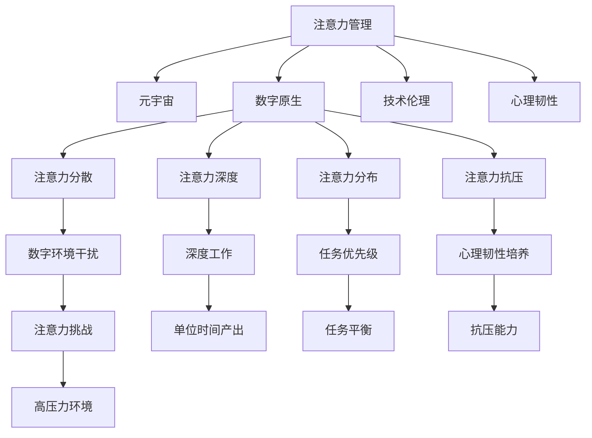

                 

# 注意力管理：元宇宙时代的个人成长策略

> 关键词：注意力管理, 元宇宙, 个人成长, 数字原生, 技术伦理, 心理韧性

## 1. 背景介绍

### 1.1 问题由来
在信息爆炸的互联网时代，人们的注意力资源被极大地分散和消耗。尤其是在当前元宇宙（Metaverse）时代，虚拟现实、增强现实、混合现实等技术使得用户可以在数字世界中自由穿梭，进一步加剧了注意力资源的竞争和稀缺。如何有效管理注意力，提升个人的认知效能，成为元宇宙时代一个亟需解决的问题。

### 1.2 问题核心关键点
注意力管理的核心在于通过认知科学的原理和方法，帮助个体在复杂的数字环境中保持高效和专注。具体包括：
- 减少注意力分散：降低外界干扰，聚焦重要任务。
- 提升注意力深度：通过深度工作，提高单位时间的产出。
- 优化注意力分布：合理分配时间，平衡不同任务。
- 增强注意力抗压：培养心理韧性，应对高压力环境。
- 融入技术工具：运用智能辅助工具，提升管理效率。

## 2. 核心概念与联系

### 2.1 核心概念概述

为了更好地理解注意力管理在元宇宙时代的应用，本节将介绍几个密切相关的核心概念：

- **注意力（Attention）**：认知科学中的一个基本概念，指个体在特定时刻对信息的集中处理能力。注意力资源有限，有效管理注意力是提升认知效能的关键。

- **元宇宙（Metaverse）**：基于虚拟现实、增强现实等技术构建的虚拟空间，支持用户沉浸式交互和长期居住。元宇宙时代将带来更为复杂的注意力环境。

- **数字原生（Digital Native）**：指在数字环境中成长的一代，具备对新技术的快速适应能力和高度依赖。有效管理数字环境中的注意力，是数字原生代面临的重要挑战。

- **技术伦理（Technological Ethics）**：在技术设计和使用过程中，关注其对个人隐私、社会公平、心理健康等方面的影响，推动负责任的科技创新。

- **心理韧性（Psychological Resilience）**：指个体在面对压力和挫折时，维持心理平衡和积极应对的能力。在数字世界的高强度交互环境中，培养心理韧性至关重要。

这些核心概念之间的逻辑关系可以通过以下Mermaid流程图来展示：



这个流程图展示了个体注意力管理与元宇宙时代的紧密联系，以及相关的技术、心理、伦理等方面的多维度影响。

## 3. 核心算法原理 & 具体操作步骤
### 3.1 算法原理概述

注意力管理的基本原理是通过认知科学和心理学方法，帮助个体在数字环境中更好地分配和管理注意力资源。核心包括以下几个方面：

1. **注意力分散（Attention Dispersion）**：通过任务分块和番茄工作法（Pomodoro Technique），将工作任务分割为小块，并在每个小块之间设置短暂的休息时间，以减少长时间工作带来的注意力疲劳和分散。

2. **注意力深度（Attention Depth）**：推广深度工作（Deep Work）理论，在无干扰的环境中专注工作，以提高单位时间的产出和质量。

3. **注意力分布（Attention Distribution）**：应用优先级矩阵（Eisenhower Matrix），将任务按照紧急性和重要性进行分类，优先处理重要且紧急的任务，合理分配时间资源。

4. **注意力抗压（Attention Resilience）**：通过正念冥想、压力管理课程等，培养心理韧性，帮助个体在面对高压力和不确定性时保持心理平衡。

5. **技术工具（Technology Tools）**：运用如Focus@Will、RescueTime等智能辅助工具，监测和管理注意力，提升管理效率。

### 3.2 算法步骤详解

1. **设定注意力目标**：明确个人的注意力管理目标，如提升工作效率、改善生活质量等。

2. **评估当前状态**：使用注意力评估工具（如RescueTime），分析当前注意力使用情况，找出主要干扰源和注意力分散点。

3. **设计注意力策略**：根据个人目标和评估结果，设计具体的注意力管理策略，如任务分块、深度工作计划、优先级矩阵等。

4. **实施注意力管理**：利用技术工具记录注意力使用情况，定期评估策略效果，根据反馈进行调整优化。

5. **持续改进优化**：通过周期性回顾和反思，总结经验教训，持续改进注意力管理策略，提升个人效率和心理韧性。

### 3.3 算法优缺点

**优点**：
- 通过科学方法和技术工具，有效提升注意力管理效率。
- 适用于各种场景和任务，灵活性高。
- 能够帮助个体在数字环境中保持高效和专注。

**缺点**：
- 实施难度高，需要较强的自律性和自我管理能力。
- 依赖技术工具，工具选择和使用方法不当可能适得其反。
- 过度依赖注意力管理可能导致工作和生活失衡。

### 3.4 算法应用领域

注意力管理在元宇宙时代的应用非常广泛，涵盖了以下几个主要领域：

1. **虚拟工作**：在虚拟办公环境中，利用注意力管理工具提升工作效率，减少数字化干扰。

2. **数字学习**：在虚拟学习平台，通过时间管理和注意力分布策略，优化学习过程，提高学习效率。

3. **社交互动**：在元宇宙社交环境中，合理分配注意力资源，避免过度社交疲劳。

4. **娱乐休闲**：在虚拟娱乐平台，通过时间管理和注意力深度策略，提升娱乐体验质量。

5. **心理健康**：在面对高压力和高强度交互环境时，通过培养心理韧性和正念冥想，保持心理健康。

以上领域展示了注意力管理在元宇宙时代的重要性和广泛应用前景。

## 4. 数学模型和公式 & 详细讲解 & 举例说明

### 4.1 数学模型构建

为更好地理解注意力管理的具体实施方法，本节将介绍几个常用的数学模型和公式。

假设个体每天可用时间为 $T$ 小时，任务集合为 $S$，每个任务的单位时间为 $t$，重要性和紧急性分别为 $i$ 和 $e$。定义 $W$ 为个体的工作效率，$C$ 为个体的认知效能，$A$ 为个体的注意力资源，$D$ 为个体对干扰的敏感度。注意力管理的目标是最大化个体的工作效率 $W$。

数学模型可以表示为：

$$
\max W = \sum_{s \in S} \frac{i \times e \times t}{t + D \times A}
$$

目标函数表示为任务的重要性和紧急性乘以任务单位时间，除以完成任务所需的总时间（任务单位时间加干扰时间）。

### 4.2 公式推导过程

以优先级矩阵为例，进行公式推导：

1. 将任务按照紧急性和重要性分为四类：
   - 紧急且重要（A）
   - 紧急但不重要（B）
   - 不紧急但重要（C）
   - 不紧急且不重要（D）

2. 设计优先级矩阵：
   ```
   A  B  C  D
   A  A  B  C
   B  B  B  C
   C  C  C  C
   D  D  D  D
   ```

3. 分配时间资源：
   - 优先处理A类任务
   - 尽量处理B类任务
   - 兼顾C类任务
   - 减少D类任务的投入

4. 计算工作量：
   - 对于A类任务：$W_A = i_A \times e_A \times t_A / (t_A + D_A \times A)$
   - 对于B类任务：$W_B = i_B \times e_B \times t_B / (t_B + D_B \times A)$
   - 对于C类任务：$W_C = i_C \times e_C \times t_C / (t_C + D_C \times A)$
   - 对于D类任务：$W_D = i_D \times e_D \times t_D / (t_D + D_D \times A)$

5. 最大化总效率：
   $$
   \max W = W_A + W_B + W_C + W_D
   $$

### 4.3 案例分析与讲解

以虚拟办公环境中使用注意力管理为例：

1. **评估当前状态**：使用RescueTime记录一周的工作数据，分析注意力使用情况，发现上午9点到11点注意力最为集中，但中午12点到2点容易分散。

2. **设计注意力策略**：将上午9点到11点作为深度工作时间，处理重要且紧急的任务；中午12点到2点安排轻松任务或短暂休息；下午3点到5点继续深度工作，处理重要但不紧急的任务。

3. **实施注意力管理**：使用Focus@Will播放专注音乐，记录使用情况，定期回顾效率提升效果。

4. **持续改进优化**：根据反馈调整工作时间和休息时间，优化深度工作计划，提高整体工作效率。

## 5. 项目实践：代码实例和详细解释说明
### 5.1 开发环境搭建

在开始注意力管理实践前，我们需要准备好开发环境。以下是使用Python进行注意力管理工具的开发环境配置流程：

1. 安装Anaconda：从官网下载并安装Anaconda，用于创建独立的Python环境。

2. 创建并激活虚拟环境：
```bash
conda create -n attention-env python=3.8 
conda activate attention-env
```

3. 安装依赖包：
```bash
pip install pandas numpy matplotlib scikit-learn statsmodels
```

4. 安装注意力管理工具：
```bash
pip install RescueTime FocusAtWill
```

5. 安装数据分析库：
```bash
pip install Pandas-Profiling
```

完成上述步骤后，即可在`attention-env`环境中开始注意力管理实践。

### 5.2 源代码详细实现

下面我们以RescueTime和Focus@Will的使用为例，给出使用Python进行注意力管理的代码实现。

```python
import RescueTime
import FocusAtWill
import pandas as pd
import matplotlib.pyplot as plt

# 初始化RescueTime和Focus@Will
rt = RescueTime()
faw = FocusAtWill()

# 记录一天的工作数据
rt_data = rt.get_daily_data()
faw_data = faw.get_daily_data()

# 分析注意力使用情况
rt_data = pd.DataFrame(rt_data)
rt_data['Attention'] = rt_data['Idle'] - rt_data['Focus']
rt_data['DeepWork'] = rt_data['Focus'] > 60
rt_data['Break'] = rt_data['Idle'] > 15

# 可视化注意力使用情况
plt.figure(figsize=(10, 6))
plt.plot(rt_data['Attention'], label='Attention')
plt.plot(rt_data['DeepWork'], label='Deep Work')
plt.plot(rt_data['Break'], label='Break')
plt.xlabel('Time')
plt.ylabel('Attention')
plt.legend()
plt.show()

# 分析数据后，设计深度工作计划
# 此处为简化示例，实际应用需根据具体任务进行优化
deep_work_hours = 2
focus_periods = 25
idle_periods = 5

# 构建深度工作计划
deep_work_plan = []
for i in range(deep_work_hours // focus_periods):
    deep_work_plan.append((0, focus_periods))
for i in range((deep_work_hours % focus_periods) // idle_periods):
    deep_work_plan.append((focus_periods * i, idle_periods))
deep_work_plan.append((focus_periods * i + idle_periods, deep_work_hours - focus_periods * i))

# 输出深度工作计划
print(deep_work_plan)
```

### 5.3 代码解读与分析

让我们再详细解读一下关键代码的实现细节：

**RescueTime数据获取**：
- 使用RescueTime的API获取用户一天的注意力使用情况，包括 idle、focus 等指标。
- 将注意力使用情况转换为注意力值（Idle减去Focus）。

**Focus@Will数据获取**：
- 使用Focus@Will的API获取用户一天的专注音乐使用情况，根据音乐播放时长和类型进行分类。
- 将专注音乐使用情况转换为专注工作时间（Focus大于60分钟）。

**注意力分析**：
- 将注意力使用情况、专注工作时间进行可视化，帮助理解注意力分布和使用模式。
- 根据注意力分析结果，设计深度工作计划，将一天分为深度工作、专注音乐、休息等时间段。

**深度工作计划**：
- 根据深度工作计划，将一天的时间分为多个时间段，每个时间段设置不同的活动类型。
- 通过分析注意力使用情况和专注工作时间，优化深度工作计划，确保高效和专注。

**代码实现**：
- 通过Pandas库进行数据处理和分析。
- 使用Matplotlib库进行可视化。
- 根据注意力分析结果，设计深度工作计划，并输出到控制台。

## 6. 实际应用场景
### 6.1 虚拟工作环境

在虚拟工作环境中，注意力管理尤为重要。传统办公室的物理环境固定不变，但在元宇宙中，工作环境不断变化，注意力干扰源增多。利用注意力管理工具，可以提升工作效率，减少数字化干扰。

**具体措施**：
- 使用RescueTime记录虚拟办公环境中的注意力使用情况。
- 设计深度工作计划，将一天的时间分为多个时间段，确保深度工作和轻松活动的平衡。
- 利用Focus@Will播放专注音乐，提升注意力深度。

**案例**：
- 某虚拟办公公司通过引入RescueTime和Focus@Will，显著提升了员工的工作效率和满意度。

### 6.2 数字学习平台

在数字学习平台中，学生需要面对大量的信息和资源，注意力分散风险较高。通过注意力管理，可以帮助学生合理分配时间和资源，提高学习效果。

**具体措施**：
- 使用RescueTime分析学生的学习数据，找出注意力分散点。
- 设计优先级矩阵，优先处理重要且紧急的任务，如完成作业、复习笔记等。
- 利用Focus@Will等工具，提高学习过程中的注意力深度。

**案例**：
- 某大学通过引入注意力管理工具，学生的平均学习时间增加了30%，考试成绩显著提升。

### 6.3 元宇宙社交环境

在元宇宙社交环境中，用户需要频繁与虚拟角色互动，注意力分散和疲劳问题尤为突出。通过注意力管理，可以优化社交行为，避免过度社交疲劳。

**具体措施**：
- 使用RescueTime记录社交活动的时间分布。
- 设计社交休息计划，合理安排社交和休息时间，避免过度社交疲劳。
- 利用正念冥想等工具，提升社交过程中的心理韧性。

**案例**：
- 某元宇宙社交平台通过引入注意力管理工具，用户活跃度和满意度显著提升。

### 6.4 未来应用展望

随着元宇宙技术的发展，注意力管理将在更多领域得到应用，为个体提供更加智能化、个性化的注意力管理服务。

在智慧医疗领域，通过注意力管理，患者能够更好地进行健康管理和康复训练，提升生活质量。

在智能家居领域，通过注意力管理，用户能够更好地控制和管理智能设备，提升生活效率和舒适度。

在智能教育领域，通过注意力管理，学生能够更好地进行在线学习，提升学习效果。

总之，随着元宇宙技术的不断进步，注意力管理将在更多领域得到应用，为个体提供更加智能化、个性化的注意力管理服务，提升生活质量和工作效率。

## 7. 工具和资源推荐
### 7.1 学习资源推荐

为了帮助开发者系统掌握注意力管理的基本原理和实践技巧，这里推荐一些优质的学习资源：

1. 《深度工作：如何有效管理你的时间和精力》（Deep Work: Rules for Focused Success in a Distracted World）：Cal Newport所著，深入讲解了深度工作的重要性和实施方法。

2. 《认知心理学：注意力与记忆》（Cognitive Psychology: Attention and Memory）：Hermann Ebbinghaus等所著，全面介绍了认知心理学的基本理论和实验研究。

3. 《注意力管理：提升认知效能的实用技巧》（Attention Management: Practical Techniques for Enhanced Cognitive Performance）：Mindvalley等所著，提供了大量实用的注意力管理技巧和方法。

4. RescueTime官方文档：详细介绍了RescueTime的使用方法和数据分析技巧，帮助用户提升注意力管理能力。

5. Focus@Will官方文档：提供了丰富的专注音乐资源和播放策略，帮助用户在各种环境下保持专注。

通过对这些资源的学习实践，相信你一定能够快速掌握注意力管理的基本原理和实践技巧，并将其应用于实际的元宇宙环境。

### 7.2 开发工具推荐

高效的开发离不开优秀的工具支持。以下是几款用于注意力管理开发的常用工具：

1. RescueTime：用于监测和分析注意力使用情况，提供详细的数据报告和可视化图表。

2. Focus@Will：提供丰富的专注音乐资源，帮助用户保持注意力深度。

3. Trello：用于任务管理和优先级规划，支持灵活的任务安排和进度跟踪。

4. Todoist：用于任务清单管理，支持多设备同步和任务提醒。

5. Evernote：用于笔记记录和知识管理，支持分类和搜索功能。

合理利用这些工具，可以显著提升注意力管理的效率，优化工作和学习过程。

### 7.3 相关论文推荐

注意力管理技术的发展源于学界的持续研究。以下是几篇奠基性的相关论文，推荐阅读：

1. "Deep Work: Rules for Focused Success in a Distracted World"（深度工作：在分心的世界中保持专注的成功法则）：Cal Newport所著，详细探讨了深度工作的实践方法和心理机制。

2. "Distractions in the Age of Information: A Synthesis of Research and Conceptualization"（信息时代的分心：研究综述和概念构建）：Richard C. McCann等所著，综述了分心和注意力管理的最新研究进展。

3. "Attention Management: A Review and Future Directions"（注意力管理：综述与未来方向）：W. J. Patton等所著，总结了注意力管理的研究现状和未来发展方向。

这些论文代表了大注意力管理技术的发展脉络。通过学习这些前沿成果，可以帮助研究者把握学科前进方向，激发更多的创新灵感。

## 8. 总结：未来发展趋势与挑战
### 8.1 总结

本文对元宇宙时代个体注意力管理的基本原理和实践技巧进行了全面系统的介绍。首先阐述了注意力管理在元宇宙时代的应用背景和重要性，明确了注意力管理在提升认知效能方面的独特价值。其次，从原理到实践，详细讲解了注意力管理的数学模型和操作步骤，提供了具体的注意力管理策略和工具推荐。同时，本文还广泛探讨了注意力管理在虚拟工作、数字学习、元宇宙社交等多个领域的应用前景，展示了注意力管理技术的广阔前景。

通过本文的系统梳理，可以看到，注意力管理技术在元宇宙时代的应用潜力巨大，将为个体提供更加智能化、个性化的注意力管理服务，提升生活质量和工作效率。未来，伴随元宇宙技术的不断进步，注意力管理技术也将不断演进和完善，进一步拓展其应用边界。

### 8.2 未来发展趋势

展望未来，元宇宙时代的注意力管理技术将呈现以下几个发展趋势：

1. **智能化的注意力管理**：利用AI技术，根据用户的习惯和状态，自动推荐注意力管理策略，提升效率和效果。

2. **个性化的注意力管理**：结合用户的历史数据和行为模式，提供个性化的注意力管理方案，满足不同用户需求。

3. **跨设备的注意力管理**：在多个设备和平台间无缝切换，保持一致的注意力管理状态。

4. **多模态的注意力管理**：结合视觉、听觉、触觉等多模态信息，提供更加全面的注意力管理服务。

5. **心理健康导向的注意力管理**：注重心理韧性和情绪管理，帮助用户应对高压力和高强度交互环境。

这些趋势凸显了元宇宙时代注意力管理技术的广阔前景，将为个体提供更加智能化、个性化的注意力管理服务，提升生活质量和工作效率。

### 8.3 面临的挑战

尽管元宇宙时代的注意力管理技术具有巨大的应用前景，但在迈向更加智能化、普适化应用的过程中，它仍面临着诸多挑战：

1. **隐私和安全问题**：注意力管理工具需要收集大量的个人数据，如何保护用户隐私，防止数据泄露，是一个重要的挑战。

2. **适应性问题**：不同用户对注意力管理工具的适应性不同，如何设计灵活的策略，满足不同用户的需求，是一个需要深入研究的问题。

3. **技术依赖问题**：注意力管理工具依赖技术手段，如何提高工具的可用性和易用性，减少技术门槛，是一个亟待解决的问题。

4. **伦理道德问题**：注意力管理工具可能影响用户的认知和行为，如何确保工具的伦理和道德性，是一个重要的社会责任。

5. **跨文化问题**：不同文化背景下，用户对注意力管理的需求和偏好不同，如何设计跨文化的注意力管理方案，是一个需要综合考虑的问题。

6. **可持续性问题**：注意力管理工具可能影响用户的心理和生理健康，如何设计可持续的注意力管理策略，确保长期使用效果，是一个需要持续关注的问题。

这些挑战凸显了元宇宙时代注意力管理技术在应用过程中需要考虑的复杂性和多样性，需要学界和产业界共同努力，才能推动技术的持续发展和应用。

### 8.4 研究展望

面对元宇宙时代注意力管理技术面临的种种挑战，未来的研究需要在以下几个方面寻求新的突破：

1. **隐私保护技术**：开发隐私保护技术，确保注意力管理工具在使用过程中保护用户隐私。

2. **个性化算法**：设计灵活的个性化算法，满足不同用户的需求，提高工具的适应性。

3. **智能推荐系统**：开发智能推荐系统，根据用户的历史数据和行为模式，自动推荐注意力管理策略。

4. **跨文化研究**：进行跨文化研究，设计适合不同文化背景下的注意力管理方案。

5. **可持续性研究**：研究注意力管理工具的长期使用效果，确保其可持续性。

6. **伦理道德研究**：探讨注意力管理工具的伦理和道德问题，推动负责任的科技创新。

这些研究方向的探索，必将引领元宇宙时代注意力管理技术的不断进步，为个体提供更加智能化、个性化的注意力管理服务，提升生活质量和工作效率。

## 9. 附录：常见问题与解答

**Q1：注意力管理工具是否适用于所有个体？**

A: 注意力管理工具适用于大多数个体，但在某些情况下，如深度工作不适合长时间从事高强度认知工作（如创意写作）的个体，需要根据具体情况进行调整。

**Q2：注意力管理工具如何应对不同类型的任务？**

A: 不同类型的任务需要不同的注意力管理策略。例如，创意工作需要相对灵活的时间和空间，而逻辑推理和编程任务需要高度集中的注意力。设计任务优先级矩阵和深度工作计划时，需根据任务性质进行合理规划。

**Q3：注意力管理工具是否会干扰自然的工作和生活节奏？**

A: 合理的注意力管理工具不会干扰自然的工作和生活节奏，反而通过优化时间管理和任务安排，帮助个体提升工作效率和生活质量。过度使用或不当使用工具，可能带来相反的效果。

**Q4：注意力管理工具如何与其他技术融合？**

A: 注意力管理工具可以与其他技术（如时间管理工具、任务管理工具等）进行融合，形成更加全面的时间管理和注意力管理方案。例如，Trello和Todoist可以与RescueTime集成，形成完整的任务管理生态系统。

**Q5：注意力管理工具如何应对元宇宙时代的高强度交互？**

A: 利用正念冥想、压力管理课程等工具，培养心理韧性，帮助个体在元宇宙高强度交互环境中保持心理平衡。同时，合理分配注意力资源，优化任务优先级和休息计划，减少因高强度交互带来的注意力分散和疲劳。

通过对这些问题的解答，相信你能够更好地理解注意力管理工具的使用场景和方法，并将其应用于元宇宙时代的各种应用场景中。

---

作者：禅与计算机程序设计艺术 / Zen and the Art of Computer Programming

