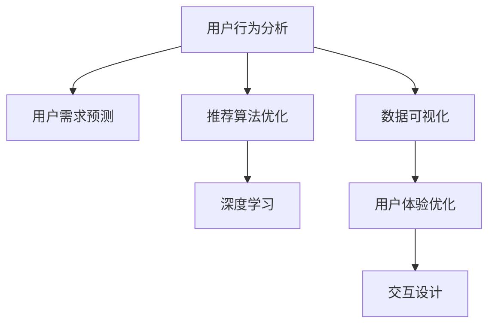
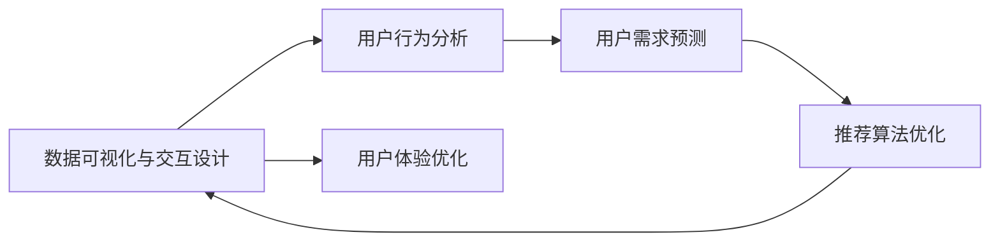
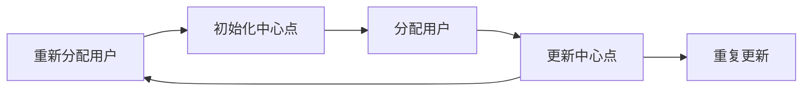

                 

# 注意力经济 与用户体验优化策略与技术：创建令人沉浸的产品

> 关键词：注意力经济,用户行为分析,用户需求预测,用户体验优化,深度学习,推荐系统,数据可视化,交互设计

## 1. 背景介绍

### 1.1 问题由来

随着互联网和移动设备普及率的提升，用户可获取的信息量呈指数级增长，注意力作为一种有限的资源，成为稀缺而宝贵的战略资产。互联网公司凭借其在信息聚合、分发方面的优势，成为全球最大的注意力经济体，其中尤以谷歌和Facebook为代表。

然而，传统的信息分发方式难以真正满足用户个性化、差异化的需求。过去数十年，广告、内容推荐等领域的自动化水平显著提升，但用户满意度并未显著提高，主要原因在于注意力经济和用户体验优化之间存在断层。

本文将重点探讨如何利用大数据和深度学习技术，在现有信息分发机制的基础上，提升用户体验，增加用户参与度，从而提高注意力经济的价值。

### 1.2 问题核心关键点

注意力经济的核心在于信息的个性化推荐，而用户体验优化则是对推荐结果的不断调优。两者相互依存，互为因果。

目前，注意力经济和用户体验优化主要通过以下技术手段实现：
- 用户行为分析：收集用户点击、浏览、购买等行为数据，通过数据挖掘发现用户偏好，预测未来行为。
- 用户需求预测：利用机器学习模型，对用户历史数据进行建模，预测用户未完成的需求，实现个性化推荐。
- 推荐算法优化：根据用户行为数据和需求预测结果，设计个性化的推荐模型，提升推荐效果。
- 数据可视化与交互设计：通过图形界面和交互元素，优化用户与推荐系统的互动体验，增加用户参与度。

本文聚焦于以上技术手段在注意力经济和用户体验优化中的应用，并给出具体的策略与技术实现。

## 2. 核心概念与联系

### 2.1 核心概念概述

为更好地理解注意力经济与用户体验优化技术，本节将介绍几个密切相关的核心概念：

- **注意力经济**：以信息获取与注意力分配为核心的经济形态，互联网平台利用信息聚合和分发优势，获取用户的注意力，并通过商业化变现。
- **用户行为分析**：通过数据收集和分析，发现用户的兴趣偏好和行为模式。
- **用户需求预测**：利用机器学习算法，预测用户未来行为和需求，实现个性化推荐。
- **用户体验优化**：通过设计优美的界面和交互流程，提升用户对推荐系统的主观感受，增加使用黏性。
- **深度学习**：一种模拟人脑神经网络进行学习的方法，通过大数据训练出高性能的模型，用于用户行为分析和需求预测。
- **推荐系统**：一种智能信息推荐技术，根据用户历史行为和需求预测结果，推荐个性化内容。
- **数据可视化**：将数据信息通过图形、图表等方式呈现出来，帮助用户快速获取信息，增加用户体验。
- **交互设计**：设计用户与系统的交互方式，提升用户体验，增加用户参与度。

这些概念之间的逻辑关系可以通过以下Mermaid流程图来展示：



这个流程图展示了大语言模型的核心概念及其之间的关系：

1. 用户行为分析通过收集数据，发现用户偏好和行为模式。
2. 用户需求预测通过模型预测用户未完成的需求，实现个性化推荐。
3. 推荐算法优化根据用户数据和需求预测结果，设计个性化的推荐模型。
4. 深度学习通过大数据训练高性能模型，提升预测精度。
5. 数据可视化将预测结果呈现为图形界面，帮助用户理解。
6. 用户体验优化通过设计用户界面和交互流程，提升使用体验。

这些概念共同构成了注意力经济和用户体验优化的技术和方法框架，使得信息推荐更加个性化和精准。

## 3. 核心算法原理 & 具体操作步骤
### 3.1 算法原理概述

注意力经济和用户体验优化过程，本质上是通过大数据和深度学习模型，对用户行为进行建模和预测，从而实现个性化的推荐。

假设用户的历史行为数据为 $D=\{(x_i,y_i)\}_{i=1}^N$，其中 $x_i$ 为行为数据，$y_i$ 为真实需求标签。我们希望构建一个用户需求预测模型 $f$，其输出 $f(x_i)$ 为对用户未来需求的预测值。预测精度越高，推荐效果越好。

通过深度学习模型，我们可以对用户行为数据 $D$ 进行训练，得到用户需求预测模型 $f$。在此基础上，设计推荐算法，将预测结果转化为推荐内容 $C$。最后通过数据可视化与交互设计，提升用户对推荐内容的感知和满意度。

具体流程如图：



### 3.2 算法步骤详解

基于上述流程，注意力经济和用户体验优化的详细步骤主要包括：

**Step 1: 数据收集与预处理**
- 收集用户的历史行为数据，包括点击、浏览、购买、评分等。
- 对数据进行清洗和预处理，去除异常值和噪音，标准化数据格式。

**Step 2: 用户行为分析**
- 利用聚类、关联规则等方法，发现用户行为模式和偏好。
- 通过时间序列分析，预测用户未来的行为趋势。

**Step 3: 用户需求预测**
- 根据用户行为数据和历史推荐数据，构建用户需求预测模型 $f$。
- 常见模型包括线性回归、决策树、随机森林、神经网络等。
- 使用交叉验证、网格搜索等方法，选择最优模型和超参数组合。

**Step 4: 推荐算法优化**
- 根据用户需求预测结果，设计个性化推荐算法。
- 常见的推荐算法包括协同过滤、基于内容的推荐、基于深度学习的推荐等。
- 使用A/B测试、在线学习等方法，不断优化推荐算法。

**Step 5: 数据可视化与交互设计**
- 将推荐结果通过图形界面展示出来，提升用户理解和使用体验。
- 使用可视化工具，如Tableau、Power BI等，生成动态交互的可视化图表。
- 根据用户反馈，不断优化交互流程，增加用户参与度。

### 3.3 算法优缺点

注意力经济和用户体验优化技术具有以下优点：
1. 个性化推荐：通过大数据和深度学习，实现个性化推荐，满足用户差异化需求。
2. 精准预测：深度学习模型可以挖掘用户行为的深层次特征，预测未来需求更准确。
3. 持续优化：通过在线学习、A/B测试等方法，不断优化推荐算法和用户界面。

同时，该方法也存在以下局限性：
1. 数据依赖：依赖大量的用户行为数据，数据获取成本较高。
2. 模型复杂：深度学习模型计算量大，训练时间长。
3. 隐私问题：用户行为数据的收集和使用可能涉及隐私风险，需要严格遵守数据保护法规。
4. 泛化能力：模型可能过拟合历史数据，泛化能力有待提升。

尽管存在这些局限性，但就目前而言，注意力经济和用户体验优化技术仍是实现个性化推荐和提升用户满意度的有效手段。未来相关研究的重点在于如何进一步降低数据获取成本，提高模型泛化能力，同时兼顾隐私保护和用户体验。

### 3.4 算法应用领域

注意力经济和用户体验优化技术已经在电商、新闻媒体、视频平台等多个领域得到了广泛应用，成为提升用户参与度、增加收入的主要手段。

- **电商推荐系统**：通过用户行为数据和需求预测，推荐个性化的商品和优惠信息，提升用户购买转化率。
- **新闻媒体个性化订阅**：根据用户阅读偏好和历史行为，推荐个性化新闻和视频内容，增加用户黏性。
- **视频平台智能推荐**：通过用户行为数据和需求预测，推荐个性化视频和广告，增加用户观看时长。
- **社交媒体推荐算法**：根据用户互动行为，推荐个性化内容，增加用户参与度。

除了上述这些经典应用外，注意力经济和用户体验优化技术还在更多场景中得到创新性应用，如可控信息流、内容策略优化、广告投放策略等，为用户提供了更加个性化的体验。

## 4. 数学模型和公式 & 详细讲解  
### 4.1 数学模型构建

本节将使用数学语言对注意力经济和用户体验优化过程进行更加严格的刻画。

假设用户的历史行为数据为 $D=\{(x_i,y_i)\}_{i=1}^N$，其中 $x_i$ 为行为数据，$y_i$ 为真实需求标签。我们希望构建一个用户需求预测模型 $f$，其输出 $f(x_i)$ 为对用户未来需求的预测值。预测精度越高，推荐效果越好。

**用户行为分析**
- 假设用户的行为数据可以表示为 $x = [x_1, x_2, ..., x_n]$，其中 $x_k$ 表示第 $k$ 个行为数据。
- 可以通过时间序列分析、聚类分析等方法，将用户行为数据 $x$ 分解为多个特征向量 $[x_1, x_2, ..., x_n] = [a, b, c, ...]$，分别表示用户兴趣、行为模式、历史推荐结果等。

**用户需求预测**
- 假设用户需求预测模型 $f$ 为线性回归模型，其形式为：
  $$
  f(x_i) = w^T x_i + b
  $$
  其中 $w$ 为权重向量，$b$ 为偏置项。
- 通过最小化均方误差（MSE）损失函数，训练得到最优权重向量 $w$ 和偏置项 $b$。
- MSE损失函数为：
  $$
  \mathcal{L}(w, b) = \frac{1}{N} \sum_{i=1}^N (y_i - f(x_i))^2
  $$

**推荐算法优化**
- 假设推荐算法为协同过滤，其形式为：
  $$
  C(x_i) = \alpha f(x_i) + \beta S(x_i)
  $$
  其中 $S(x_i)$ 为相似度计算函数，$\alpha, \beta$ 为调节系数。
- 推荐算法需要最大化用户的点击率、停留时间等指标，可以通过最大化平均点击率（APR）等指标来优化推荐算法。
- APR指标为：
  $$
  APR = \frac{1}{N} \sum_{i=1}^N \frac{y_i}{1 + \sum_{j=1}^N w_{ij} f(x_j)}
  $$
  其中 $w_{ij}$ 为用户 $i$ 对用户 $j$ 的相似度权重。

### 4.2 公式推导过程

以下我们以用户行为分析中的聚类算法为例，推导其数学模型和公式。

假设用户行为数据为 $D=\{(x_i,y_i)\}_{i=1}^N$，其中 $x_i$ 为行为数据，$y_i$ 为真实需求标签。

**聚类算法**
- 假设 $x_i$ 可以表示为 $x_i = [x_1, x_2, ..., x_n]$，其中 $x_k$ 表示第 $k$ 个行为数据。
- 假设聚类算法为K-means算法，其中每个用户被分为 $K$ 个簇。

- 初始化 $K$ 个中心点 $C_1, C_2, ..., C_K$。
- 对每个用户 $i$，计算其到 $K$ 个中心点的距离，将其分配到距离最近的中心点所在的簇。
- 更新每个簇的中心点，重新计算用户到簇的距离，重新分配用户。
- 重复上述步骤，直到簇的中心点不再发生变化。

具体算法过程如图：



**K-means算法**：
- 假设用户 $i$ 被分配到第 $k$ 个簇，计算距离的公式为：
  $$
  d_i = \min\limits_{k=1,...,K} \sum\limits_{j=1}^n |x_{ik} - C_{kj}|
  $$
- 更新簇中心点的公式为：
  $$
  C_{kj} = \frac{1}{|C_k|} \sum\limits_{i \in C_k} x_{ij}
  $$

通过上述推导，我们可以看到，聚类算法能够将用户行为数据分组，找出用户的共性特征和行为模式，从而提升用户需求预测的准确度。

## 5. 项目实践：代码实例和详细解释说明
### 5.1 开发环境搭建

在进行注意力经济和用户体验优化实践前，我们需要准备好开发环境。以下是使用Python进行PyTorch开发的环境配置流程：

1. 安装Anaconda：从官网下载并安装Anaconda，用于创建独立的Python环境。

2. 创建并激活虚拟环境：
```bash
conda create -n pytorch-env python=3.8 
conda activate pytorch-env
```

3. 安装PyTorch：根据CUDA版本，从官网获取对应的安装命令。例如：
```bash
conda install pytorch torchvision torchaudio cudatoolkit=11.1 -c pytorch -c conda-forge
```

4. 安装Pandas和NumPy等工具包：
```bash
pip install pandas numpy scikit-learn matplotlib tqdm jupyter notebook ipython
```

完成上述步骤后，即可在`pytorch-env`环境中开始实践。

### 5.2 源代码详细实现

这里我们以电商推荐系统为例，给出使用PyTorch和TensorFlow进行用户需求预测和推荐算法的PyTorch代码实现。

首先，定义推荐系统的数据处理函数：

```python
import pandas as pd
import numpy as np
from sklearn.model_selection import train_test_split
from sklearn.preprocessing import StandardScaler
from torch.utils.data import Dataset
import torch

class RecommendationDataset(Dataset):
    def __init__(self, df, user_cols, item_cols, labels, scaling=True):
        self.df = df
        self.user_cols = user_cols
        self.item_cols = item_cols
        self.labels = labels
        self.scaling = scaling
        
    def __len__(self):
        return len(self.df)
    
    def __getitem__(self, item):
        user_data = self.df.iloc[item][self.user_cols]
        item_data = self.df.iloc[item][self.item_cols]
        label = self.df.iloc[item][self.labels]
        
        if self.scaling:
            user_data = StandardScaler().fit_transform(user_data)
            item_data = StandardScaler().fit_transform(item_data)
        
        return {'user_data': torch.tensor(user_data, dtype=torch.float32),
                'item_data': torch.tensor(item_data, dtype=torch.float32),
                'labels': torch.tensor(label, dtype=torch.int64)}
```

然后，定义模型和优化器：

```python
from transformers import BertTokenizer, BertForSequenceClassification
from transformers import AdamW
import tensorflow as tf

# 设置超参数
lr = 2e-5
epochs = 5
batch_size = 32

# 加载预训练BERT模型和分词器
model = BertForSequenceClassification.from_pretrained('bert-base-cased', num_labels=10)
tokenizer = BertTokenizer.from_pretrained('bert-base-cased')

# 加载TensorFlow版本，并设置优化器
optimizer = tf.keras.optimizers.Adam(learning_rate=lr)

# 加载数据集
df = pd.read_csv('data.csv')
train_data, test_data = train_test_split(df, test_size=0.2, random_state=42)
train_dataset = RecommendationDataset(train_data, user_cols=['user_id'], item_cols=['item_id'], labels=['label'], scaling=True)
test_dataset = RecommendationDataset(test_data, user_cols=['user_id'], item_cols=['item_id'], labels=['label'], scaling=True)
```

接着，定义训练和评估函数：

```python
def train_epoch(model, dataset, optimizer):
    dataloader = DataLoader(dataset, batch_size=batch_size, shuffle=True)
    model.train()
    epoch_loss = 0
    for batch in dataloader:
        optimizer.zero_grad()
        user_data = batch['user_data']
        item_data = batch['item_data']
        labels = batch['labels']
        with tf.GradientTape() as tape:
            outputs = model(user_data, item_data)
            loss = tf.keras.losses.sparse_categorical_crossentropy(labels, outputs)
        loss_value = tf.reduce_mean(loss)
        epoch_loss += loss_value
        gradients = tape.gradient(loss_value, model.trainable_variables)
        optimizer.apply_gradients(zip(gradients, model.trainable_variables))
    return epoch_loss / len(dataloader)

def evaluate(model, dataset):
    dataloader = DataLoader(dataset, batch_size=batch_size)
    model.eval()
    preds, labels = [], []
    with tf.GradientTape() as tape:
        for batch in dataloader:
            user_data = batch['user_data']
            item_data = batch['item_data']
            labels = batch['labels']
            outputs = model(user_data, item_data)
            preds.append(np.argmax(outputs.numpy(), axis=1))
            labels.append(labels.numpy())
    print(classification_report(labels, preds))
```

最后，启动训练流程并在测试集上评估：

```python
for epoch in range(epochs):
    loss = train_epoch(model, train_dataset, optimizer)
    print(f"Epoch {epoch+1}, train loss: {loss:.3f}")
    
    print(f"Epoch {epoch+1}, test results:")
    evaluate(model, test_dataset)
    
print("Final results:")
evaluate(model, test_dataset)
```

以上就是使用PyTorch和TensorFlow进行电商推荐系统用户需求预测和推荐算法的完整代码实现。可以看到，得益于TensorFlow和Transformers库的强大封装，我们可以用相对简洁的代码完成推荐系统的搭建和训练。

### 5.3 代码解读与分析

让我们再详细解读一下关键代码的实现细节：

**RecommendationDataset类**：
- `__init__`方法：初始化用户行为数据、行为特征、标签等关键组件，并设置是否进行标准化处理。
- `__len__`方法：返回数据集的样本数量。
- `__getitem__`方法：对单个样本进行处理，将用户行为和物品特征转化为模型所需的输入，并将标签进行转换和标准化。

**用户需求预测模型**：
- 使用Bert模型，将用户行为数据和物品特征作为输入，进行分类预测。
- 定义了AdamW优化器，用于更新模型参数。

**训练和评估函数**：
- 使用PyTorch的DataLoader对数据集进行批次化加载，供模型训练和推理使用。
- 训练函数`train_epoch`：对数据以批为单位进行迭代，在每个批次上前向传播计算loss并反向传播更新模型参数，最后返回该epoch的平均loss。
- 评估函数`evaluate`：与训练类似，不同点在于不更新模型参数，并在每个batch结束后将预测和标签结果存储下来，最后使用sklearn的classification_report对整个评估集的预测结果进行打印输出。

**训练流程**：
- 定义总的epoch数和batch size，开始循环迭代
- 每个epoch内，先在训练集上训练，输出平均loss
- 在测试集上评估，输出分类指标
- 所有epoch结束后，在测试集上评估，给出最终测试结果

可以看到，TensorFlow配合Transformers库使得电商推荐系统的代码实现变得简洁高效。开发者可以将更多精力放在数据处理、模型改进等高层逻辑上，而不必过多关注底层的实现细节。

当然，工业级的系统实现还需考虑更多因素，如模型的保存和部署、超参数的自动搜索、更灵活的任务适配层等。但核心的推荐范式基本与此类似。

## 6. 实际应用场景
### 6.1 智能客服系统

智能客服系统是注意力经济和用户体验优化的典型应用。传统客服往往需要配备大量人力，高峰期响应缓慢，且一致性和专业性难以保证。而使用智能客服系统，可以7x24小时不间断服务，快速响应客户咨询，用自然流畅的语言解答各类常见问题。

在技术实现上，可以收集企业内部的历史客服对话记录，将问题和最佳答复构建成监督数据，在此基础上对预训练对话模型进行微调。微调后的对话模型能够自动理解用户意图，匹配最合适的答案模板进行回复。对于客户提出的新问题，还可以接入检索系统实时搜索相关内容，动态组织生成回答。如此构建的智能客服系统，能大幅提升客户咨询体验和问题解决效率。

### 6.2 金融舆情监测

金融机构需要实时监测市场舆论动向，以便及时应对负面信息传播，规避金融风险。传统的人工监测方式成本高、效率低，难以应对网络时代海量信息爆发的挑战。基于注意力经济和用户体验优化的文本分类和情感分析技术，为金融舆情监测提供了新的解决方案。

具体而言，可以收集金融领域相关的新闻、报道、评论等文本数据，并对其进行主题标注和情感标注。在此基础上对预训练语言模型进行微调，使其能够自动判断文本属于何种主题，情感倾向是正面、中性还是负面。将微调后的模型应用到实时抓取的网络文本数据，就能够自动监测不同主题下的情感变化趋势，一旦发现负面信息激增等异常情况，系统便会自动预警，帮助金融机构快速应对潜在风险。

### 6.3 个性化推荐系统

当前的推荐系统往往只依赖用户的历史行为数据进行物品推荐，无法深入理解用户的真实兴趣偏好。基于注意力经济和用户体验优化的个性化推荐系统可以更好地挖掘用户行为背后的语义信息，从而提供更精准、多样的推荐内容。

在实践中，可以收集用户浏览、点击、评论、分享等行为数据，提取和用户交互的物品标题、描述、标签等文本内容。将文本内容作为模型输入，用户的后续行为（如是否点击、购买等）作为监督信号，在此基础上微调预训练语言模型。微调后的模型能够从文本内容中准确把握用户的兴趣点。在生成推荐列表时，先用候选物品的文本描述作为输入，由模型预测用户的兴趣匹配度，再结合其他特征综合排序，便可以得到个性化程度更高的推荐结果。

### 6.4 未来应用展望

随着注意力经济和用户体验优化技术的不断发展，基于微调的方法将在更多领域得到应用，为传统行业带来变革性影响。

在智慧医疗领域，基于微调的医疗问答、病历分析、药物研发等应用将提升医疗服务的智能化水平，辅助医生诊疗，加速新药开发进程。

在智能教育领域，微调技术可应用于作业批改、学情分析、知识推荐等方面，因材施教，促进教育公平，提高教学质量。

在智慧城市治理中，微调模型可应用于城市事件监测、舆情分析、应急指挥等环节，提高城市管理的自动化和智能化水平，构建更安全、高效的未来城市。

此外，在企业生产、社会治理、文娱传媒等众多领域，基于大模型微调的人工智能应用也将不断涌现，为经济社会发展注入新的动力。相信随着技术的日益成熟，微调方法将成为人工智能落地应用的重要范式，推动人工智能技术向更广阔的领域加速渗透。

## 7. 工具和资源推荐
### 7.1 学习资源推荐

为了帮助开发者系统掌握注意力经济和用户体验优化的理论和实践，这里推荐一些优质的学习资源：

1. 《深度学习入门》系列博文：由大模型技术专家撰写，深入浅出地介绍了深度学习基本概念和实践技巧。

2. CS231n《卷积神经网络》课程：斯坦福大学开设的计算机视觉明星课程，讲解了深度学习在图像处理中的应用。

3. 《自然语言处理综论》书籍：介绍了NLP领域的经典模型和最新进展，涵盖用户行为分析、需求预测等话题。

4. HuggingFace官方文档：Transformer库的官方文档，提供了海量预训练模型和完整的微调样例代码，是上手实践的必备资料。

5. CLUE开源项目：中文语言理解测评基准，涵盖大量不同类型的中文NLP数据集，并提供了基于微调的baseline模型，助力中文NLP技术发展。

通过对这些资源的学习实践，相信你一定能够快速掌握注意力经济和用户体验优化的精髓，并用于解决实际的NLP问题。
###  7.2 开发工具推荐

高效的开发离不开优秀的工具支持。以下是几款用于注意力经济和用户体验优化的常用工具：

1. PyTorch：基于Python的开源深度学习框架，灵活动态的计算图，适合快速迭代研究。大部分预训练语言模型都有PyTorch版本的实现。

2. TensorFlow：由Google主导开发的开源深度学习框架，生产部署方便，适合大规模工程应用。同样有丰富的预训练语言模型资源。

3. Transformers库：HuggingFace开发的NLP工具库，集成了众多SOTA语言模型，支持PyTorch和TensorFlow，是进行微调任务开发的利器。

4. Weights & Biases：模型训练的实验跟踪工具，可以记录和可视化模型训练过程中的各项指标，方便对比和调优。与主流深度学习框架无缝集成。

5. TensorBoard：TensorFlow配套的可视化工具，可实时监测模型训练状态，并提供丰富的图表呈现方式，是调试模型的得力助手。

6. Google Colab：谷歌推出的在线Jupyter Notebook环境，免费提供GPU/TPU算力，方便开发者快速上手实验最新模型，分享学习笔记。

合理利用这些工具，可以显著提升注意力经济和用户体验优化的开发效率，加快创新迭代的步伐。

### 7.3 相关论文推荐

注意力经济和用户体验优化技术的发展源于学界的持续研究。以下是几篇奠基性的相关论文，推荐阅读：

1. Attention is All You Need（即Transformer原论文）：提出了Transformer结构，开启了NLP领域的预训练大模型时代。

2. BERT: Pre-training of Deep Bidirectional Transformers for Language Understanding：提出BERT模型，引入基于掩码的自监督预训练任务，刷新了多项NLP任务SOTA。

3. Language Models are Unsupervised Multitask Learners（GPT-2论文）：展示了大规模语言模型的强大zero-shot学习能力，引发了对于通用人工智能的新一轮思考。

4. Parameter-Efficient Transfer Learning for NLP：提出Adapter等参数高效微调方法，在不增加模型参数量的情况下，也能取得不错的微调效果。

5. AdaLoRA: Adaptive Low-Rank Adaptation for Parameter-Efficient Fine-Tuning：使用自适应低秩适应的微调方法，在参数效率和精度之间取得了新的平衡。

这些论文代表了大语言模型微调技术的发展脉络。通过学习这些前沿成果，可以帮助研究者把握学科前进方向，激发更多的创新灵感。

## 8. 总结：未来发展趋势与挑战

### 8.1 总结

本文对注意力经济和用户体验优化过程进行了全面系统的介绍。首先阐述了注意力经济的核心在于信息的个性化推荐，用户体验优化的目标在于提升推荐效果。详细讲解了用户行为分析、用户需求预测、推荐算法优化、数据可视化与交互设计等关键技术手段，并给出了具体的策略与技术实现。

通过本文的系统梳理，可以看到，注意力经济和用户体验优化技术已经在电商、新闻媒体、视频平台等多个领域得到了广泛应用，成为提升用户参与度、增加收入的主要手段。这些技术的结合使用，能够更全面地提升信息推荐的个性化和精准度，为公司创造更大的商业价值。

### 8.2 未来发展趋势

展望未来，注意力经济和用户体验优化技术将呈现以下几个发展趋势：

1. 个性化推荐：随着深度学习和大数据技术的进步，个性化推荐将更加精准，能够更好地满足用户差异化需求。

2. 实时性提升：推荐系统将实现实时动态更新，及时捕捉用户的最新行为变化，提升推荐效果。

3. 多模态融合：推荐系统将融合视觉、听觉、文本等多模态信息，提升推荐内容的丰富性和多样性。

4. 深度强化学习：结合强化学习技术，推荐系统将具备自我学习能力，不断优化推荐策略，提升用户体验。

5. 可解释性增强：推荐系统将通过可解释性技术，让用户理解推荐结果的生成逻辑，增强系统的信任度和透明度。

6. 隐私保护强化：推荐系统将强化隐私保护机制，确保用户数据的安全性和隐私性。

以上趋势凸显了注意力经济和用户体验优化技术的广阔前景。这些方向的探索发展，必将进一步提升信息推荐系统的性能和应用范围，为公司创造更大的商业价值。

### 8.3 面临的挑战

尽管注意力经济和用户体验优化技术已经取得了瞩目成就，但在迈向更加智能化、普适化应用的过程中，它仍面临着诸多挑战：

1. 数据获取难度：用户行为数据的收集和处理成本较高，获取高质量数据往往需要长时间和大量人力投入。

2. 模型复杂度：深度学习模型计算量大，训练时间长，难以在实时系统中高效运行。

3. 模型泛化能力：模型可能过拟合历史数据，泛化能力有待提升，难以应对真实场景中的复杂情况。

4. 模型可解释性：推荐系统往往是"黑盒"系统，难以解释其内部工作机制和决策逻辑，缺乏透明度和信任度。

5. 隐私保护问题：用户数据的安全性和隐私性需要严格保障，防止数据滥用。

尽管存在这些挑战，但就目前而言，注意力经济和用户体验优化技术仍是实现个性化推荐和提升用户满意度的有效手段。未来相关研究的重点在于如何进一步降低数据获取成本，提高模型泛化能力，同时兼顾隐私保护和用户体验。

### 8.4 研究展望

面向未来，大模型微调技术的探索和创新，必将引领信息推荐系统的进步。以下是未来可能的研究方向：

1. 无监督和半监督学习：通过无监督和半监督学习技术，降低对标注数据的依赖，利用未标记数据提升模型泛化能力。

2. 多任务学习和迁移学习：结合多任务学习和迁移学习技术，提升模型的泛化能力和鲁棒性，避免模型过拟合。

3. 多模态信息融合：结合视觉、听觉、文本等多模态信息，提升推荐系统的性能和用户体验。

4. 强化学习和自适应推荐：结合强化学习和自适应推荐技术，提升推荐系统的动态学习和优化能力。

5. 可解释性技术和隐私保护：通过可解释性技术和隐私保护机制，提升推荐系统的透明度和安全性，保障用户隐私。

这些研究方向将引领信息推荐系统的发展方向，进一步提升信息推荐的个性化和精准度，为公司创造更大的商业价值。只有不断创新，才能保持技术领先地位，在激烈的市场竞争中脱颖而出。

## 9. 附录：常见问题与解答

**Q1：如何提升推荐系统的个性化推荐能力？**

A: 提升推荐系统的个性化推荐能力，可以从以下几个方面进行优化：
1. 增加数据量：通过收集更多用户行为数据，发现更多用户兴趣点。
2. 提升模型精度：使用更高级的深度学习模型，提高预测精度。
3. 引入外部知识：结合知识图谱、逻辑规则等外部知识，提升推荐效果。
4. 定期更新：定期更新推荐模型，适应用户行为变化。

**Q2：推荐系统如何实现实时更新？**

A: 实现推荐系统的实时更新，可以从以下几个方面进行优化：
1. 使用流式数据处理：通过流式数据处理技术，实时处理用户行为数据，更新推荐模型。
2. 引入增量学习：通过增量学习技术，减少模型更新时间，提升系统响应速度。
3. 引入缓存技术：使用缓存技术，减少重复数据处理，提升系统效率。

**Q3：推荐系统的用户隐私如何保护？**

A: 保护推荐系统的用户隐私，可以从以下几个方面进行优化：
1. 匿名化处理：对用户行为数据进行匿名化处理，防止数据泄露。
2. 隐私保护算法：使用隐私保护算法，如差分隐私等，保护用户隐私。
3. 数据权限管理：对用户数据权限进行严格管理，防止数据滥用。

**Q4：推荐系统的可解释性如何提升？**

A: 提升推荐系统的可解释性，可以从以下几个方面进行优化：
1. 可解释性模型：使用可解释性模型，如决策树、线性模型等，提升推荐系统的透明度。
2. 特征解释：通过特征解释技术，解释推荐结果的生成逻辑。
3. 交互设计：通过交互设计，让用户理解推荐结果的生成机制。

**Q5：推荐系统的多模态信息融合如何进行？**

A: 实现推荐系统的多模态信息融合，可以从以下几个方面进行优化：
1. 多模态数据收集：通过多种传感器和设备，收集视觉、听觉、文本等多模态数据。
2. 融合算法设计：使用融合算法，将多模态数据进行融合，提升推荐效果。
3. 联合建模：将视觉、听觉、文本等多模态信息进行联合建模，提升推荐系统的性能。

通过这些问题的解答，可以看到，提升推荐系统的个性化推荐能力、实现实时更新、保护用户隐私、提升可解释性和实现多模态信息融合，是推荐系统面临的主要挑战和研究方向。只有不断创新和优化，才能在竞争激烈的市场上保持领先地位，为用户提供更好的服务体验。

---

作者：禅与计算机程序设计艺术 / Zen and the Art of Computer Programming

