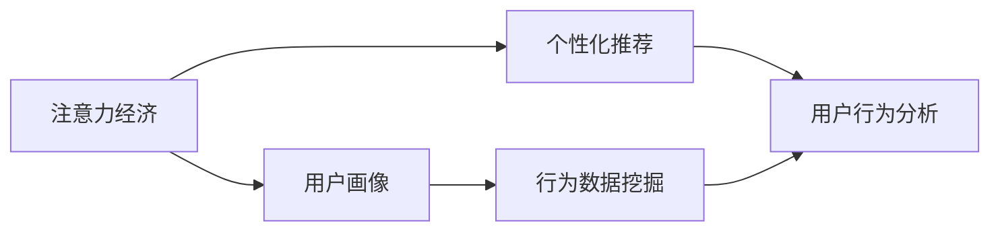

                 

## 1. 背景介绍

### 1.1 问题由来

在互联网时代，用户留存和活跃度一直是企业关注的核心指标。尤其是在注意力经济时代，用户注意力日益分散，如何有效地吸引和保留用户成为众多企业面临的巨大挑战。传统意义上，企业通过广告投放、内容优化等方式，提升用户曝光率和体验，从而实现用户留存。

然而，随着互联网技术的发展和用户行为的变化，单一的广告和内容策略已经难以满足用户不断变化的期望和需求。在这种情况下，企业需要通过更为精细化的运营策略和用户画像分析，对用户行为进行深入洞察和精准引导，才能实现有效的用户留存。

### 1.2 问题核心关键点

本文聚焦于在注意力经济环境下，企业如何通过数据分析和策略优化，实现更高效、更精准的用户留存。我们通过构建用户行为分析模型和个性化推荐系统，充分利用用户行为数据，预测用户兴趣和行为，采取适当的策略来提升用户留存率。

### 1.3 问题研究意义

随着数字化进程的加速，企业和用户之间的互动愈加频繁和紧密。用户留存不仅关系到企业的直接收益，还关系到品牌忠诚度和市场份额。基于大数据和人工智能的用户留存策略，能够帮助企业在数据驱动的决策中，精准把握用户需求，实现更高效的运营管理。

本文从数据驱动的视角出发，详细介绍了在注意力经济下，如何通过数据分析和策略优化，实现用户留存的策略，并探讨了这一策略在实际应用中的效果和未来发展趋势。

## 2. 核心概念与联系

### 2.1 核心概念概述

为更好地理解用户留存策略的核心概念和其逻辑联系，本节将介绍几个密切相关的核心概念：

- **注意力经济**：指的是在信息爆炸的背景下，用户对有限注意力的竞争。企业需要通过对用户注意力进行管理和引导，实现更有效的用户留存。
- **用户画像**：通过收集和分析用户行为数据，构建用户特征，形成用户画像，帮助企业精准定位和预测用户需求。
- **个性化推荐**：利用用户画像，通过算法推荐系统，根据用户历史行为和兴趣，推送个性化内容，提升用户满意度和留存率。
- **行为数据挖掘**：通过分析用户在线行为数据，提取行为模式，预测用户未来行为，提升营销和运营的精准性。
- **用户行为分析**：从用户行为数据中提取有价值的信息，揭示用户行为特征，指导运营策略的制定和优化。

这些核心概念之间的逻辑关系可以通过以下Mermaid流程图来展示：



这个流程图展示了几大核心概念之间的逻辑关系：

1. 注意力经济是企业面对用户注意力分散的背景。
2. 用户画像基于行为数据挖掘，形成用户特征，帮助企业精准定位。
3. 个性化推荐利用用户画像，推荐个性化内容，提升用户满意度。
4. 用户行为分析通过对用户行为数据的挖掘，揭示行为特征，指导策略优化。

这些概念共同构成了用户留存策略的理论基础，帮助企业从数据驱动的视角，实现精准运营。

## 3. 核心算法原理 & 具体操作步骤
### 3.1 算法原理概述

注意力经济下的用户留存策略，本质上是将用户留存问题转化为数据挖掘和预测问题。通过构建用户行为分析模型，从大量用户行为数据中提取有价值的信息，预测用户未来行为和需求，从而采取合适的策略，实现用户留存。

算法的主要步骤包括：

1. 数据收集与预处理：收集用户行为数据，并进行清洗和特征提取。
2. 用户画像建模：构建用户画像，形成用户特征，描述用户行为模式。
3. 行为预测建模：利用机器学习算法，建立用户行为预测模型，预测用户未来的行为。
4. 个性化推荐系统：基于预测结果，结合内容推荐算法，推送个性化内容。
5. 策略优化：根据预测结果和推荐效果，调整运营策略，实现用户留存。

### 3.2 算法步骤详解

#### 3.2.1 数据收集与预处理

用户行为数据主要来自网站、应用等线上渠道，包括但不限于：

- **浏览行为**：网页、文章的浏览记录。
- **点击行为**：广告、按钮、链接的点击记录。
- **购买行为**：商品、服务的购买记录。
- **社交行为**：社交平台的用户互动记录。

收集到的数据往往包含噪声和不完整信息，需要进行预处理和清洗。预处理流程包括：

1. 数据清洗：去除重复、缺失、异常数据。
2. 数据归一化：将数据转换为标准格式，便于后续分析。
3. 特征提取：从原始数据中提取有意义的特征，如用户年龄、浏览时长、点击次数等。

#### 3.2.2 用户画像建模

用户画像建模需要从大量的行为数据中提取出用户特征，描述用户行为模式。常用的特征包括：

- **用户基本信息**：年龄、性别、地域等。
- **行为特征**：浏览偏好、点击频率、购买历史等。
- **社交特征**：好友关系、互动频率、社交网络结构等。

用户画像建模的过程通常包括以下步骤：

1. 特征工程：通过特征提取和处理，形成用于建模的特征集。
2. 模型训练：使用机器学习算法训练用户画像模型，如K-means聚类、协同过滤等。
3. 特征融合：结合多种特征，形成综合性的用户画像。

#### 3.2.3 行为预测建模

行为预测建模旨在预测用户未来的行为，常用的算法包括：

- **时间序列预测**：利用时间序列数据预测未来行为，如ARIMA模型、LSTM模型等。
- **分类算法**：预测用户是否会进行某项行为，如逻辑回归、决策树等。
- **回归算法**：预测用户行为的具体数值，如线性回归、随机森林等。

行为预测建模流程通常包括：

1. 数据准备：将用户行为数据按时间顺序排列，形成时间序列数据。
2. 模型选择：选择适合的行为预测模型，如LSTM、XGBoost等。
3. 模型训练与调参：使用历史数据训练模型，并进行超参数调优。
4. 模型评估：使用测试数据评估模型性能，选择合适的预测模型。

#### 3.2.4 个性化推荐系统

个性化推荐系统利用用户画像和行为预测结果，为用户推荐个性化内容。推荐算法包括：

- **协同过滤**：利用用户和商品之间的相似性，推荐相似商品。
- **基于内容的推荐**：根据商品内容，推荐与用户兴趣匹配的商品。
- **混合推荐**：结合多种推荐算法，提高推荐效果。

个性化推荐系统的流程包括：

1. 数据输入：输入用户画像和行为预测结果。
2. 特征选择：选择与用户兴趣匹配的特征，如商品类别、价格、评分等。
3. 推荐算法：使用推荐算法，计算推荐结果。
4. 结果输出：将推荐结果推送给用户，提升用户体验。

#### 3.2.5 策略优化

策略优化是指根据预测结果和推荐效果，调整运营策略，实现用户留存。常用的策略包括：

- **动态调整广告投放**：根据用户行为预测结果，调整广告投放策略，提升广告转化率。
- **个性化内容推荐**：利用推荐系统，推送个性化内容，提升用户满意度。
- **用户行为引导**：引导用户进行关键行为，如注册、购买、分享等。

策略优化流程包括：

1. 数据监控：实时监控用户行为和推荐效果。
2. 效果评估：评估不同策略的效果，如留存率、转化率等。
3. 策略调整：根据效果评估结果，调整运营策略。
4. 效果反馈：将优化后的策略应用于实际运营，形成闭环反馈。

### 3.3 算法优缺点

用户留存策略算法具有以下优点：

- **精准性高**：通过数据分析和模型预测，实现精准的用户画像和行为预测，提升策略的针对性。
- **可扩展性强**：算法适用于大规模数据集，易于部署和扩展。
- **效果显著**：在实际应用中，已证明通过个性化推荐和行为引导，能够显著提升用户留存率。

同时，该算法也存在一定的局限性：

- **数据依赖性强**：算法的准确性依赖于高质量的数据和特征工程。
- **模型复杂度高**：构建和维护复杂的数据挖掘和预测模型，需要较强的技术实力。
- **用户隐私问题**：在数据收集和分析过程中，需要注意用户隐私保护，避免数据泄露和滥用。

尽管存在这些局限性，用户留存策略在实际操作中已展现出巨大的潜力和价值，成为企业运营中的重要手段。

### 3.4 算法应用领域

用户留存策略算法在多个领域得到了广泛应用，主要包括：

- **电子商务**：通过个性化推荐和行为引导，提升用户购买转化率和复购率。
- **社交媒体**：通过内容推荐和用户互动引导，提升用户活跃度和粘性。
- **在线教育**：通过学习路径推荐和行为激励，提高用户学习效果和留存率。
- **旅游出行**：通过目的地推荐和预订提醒，提升用户预订转化率和复游率。
- **金融服务**：通过风险评估和行为监控，提升用户忠诚度和满意度。

这些领域的应用不仅提升了用户体验，也为企业带来了显著的商业价值。

## 4. 数学模型和公式 & 详细讲解 & 举例说明

### 4.1 数学模型构建

用户留存策略算法通常基于以下数学模型：

1. **用户画像模型**：
   \[
   p(y|x) = \frac{e^{\alpha x^T \beta}}{\sum_{i} e^{\alpha x^T \beta_i}}
   \]
   其中，$x$为特征向量，$\beta$为特征系数，$\alpha$为模型参数，$y$为目标标签。

2. **行为预测模型**：
   \[
   y_i = \sum_j W_j \phi_j(x_i) + \epsilon_i
   \]
   其中，$\phi_j(x_i)$为特征函数，$W_j$为权重系数，$\epsilon_i$为误差项。

3. **推荐系统模型**：
   \[
   \hat{y} = f(x, \theta)
   \]
   其中，$x$为用户画像和行为特征，$f(\cdot)$为推荐函数，$\theta$为模型参数。

4. **策略优化模型**：
   \[
   J(\theta) = \frac{1}{N} \sum_{i=1}^N [y_i \log(\hat{y}_i) + (1-y_i) \log(1-\hat{y}_i)]
   \]
   其中，$J(\theta)$为损失函数，$y_i$为真实标签，$\hat{y}_i$为预测值。

### 4.2 公式推导过程

#### 4.2.1 用户画像模型推导

用户画像模型通常使用线性回归模型或逻辑回归模型来描述用户行为。例如，使用逻辑回归模型预测用户是否会购买某商品：

\[
p(y=1|x) = \frac{e^{\alpha_0 + \alpha_1 x_1 + \alpha_2 x_2 + ... + \alpha_n x_n}}{1 + e^{-\alpha_0 - \alpha_1 x_1 - \alpha_2 x_2 - ... - \alpha_n x_n}}
\]

其中，$\alpha_0$为截距，$\alpha_1, \alpha_2, ..., \alpha_n$为特征系数。通过最大化似然函数，可以估计出$\alpha$的值。

#### 4.2.2 行为预测模型推导

行为预测模型通常使用时间序列预测或分类算法。例如，使用LSTM模型预测用户是否会在未来购买某商品：

\[
\hat{y}_t = f(x_t, \theta)
\]

其中，$f(\cdot)$为LSTM模型，$\theta$为模型参数。模型的输出为$\hat{y}_t$，表示在时间$t$用户购买该商品的概率。

#### 4.2.3 推荐系统模型推导

推荐系统模型通常使用协同过滤或基于内容的推荐算法。例如，使用协同过滤算法推荐相似商品：

\[
\hat{y}_{ij} = \frac{\sum_{k \neq j} r_{ik} x_{kj}}{\sqrt{\sum_{k \neq j} r_{ik}^2 + \epsilon} \sqrt{\sum_{k \neq j} x_{kj}^2 + \epsilon}}
\]

其中，$r_{ik}$为商品$i$和商品$k$的评分，$x_{kj}$为商品$k$的特征向量，$\epsilon$为正则项。模型的输出为$\hat{y}_{ij}$，表示商品$i$推荐给用户$j$的概率。

#### 4.2.4 策略优化模型推导

策略优化模型通常使用交叉熵损失函数来衡量预测值与真实值之间的差异。例如，使用交叉熵损失函数评估广告投放效果：

\[
J(\theta) = \frac{1}{N} \sum_{i=1}^N [y_i \log(\hat{y}_i) + (1-y_i) \log(1-\hat{y}_i)]
\]

其中，$y_i$为广告是否被点击的标签，$\hat{y}_i$为预测值。通过最小化$J(\theta)$，可以优化广告投放策略，提高广告点击率。

### 4.3 案例分析与讲解

以在线教育平台为例，通过用户留存策略算法实现个性化推荐和学习路径引导：

1. **数据收集与预处理**：收集用户学习行为数据，如课程浏览、视频观看、作业提交等，进行数据清洗和特征提取。
2. **用户画像建模**：通过学习行为特征，构建用户画像，描述用户学习偏好和水平。
3. **行为预测建模**：使用时间序列预测模型，预测用户未来的学习行为，如是否会完成某课程、是否会继续学习等。
4. **个性化推荐系统**：利用推荐算法，为用户推荐适合的学习内容，提升学习效果和满意度。
5. **策略优化**：通过行为预测结果和推荐效果，动态调整学习路径和内容推荐，实现用户留存。

在实际应用中，可以采用A/B测试等方法，对比不同策略的效果，优化用户留存模型，提升平台的用户满意度和留存率。

## 5. 项目实践：代码实例和详细解释说明

### 5.1 开发环境搭建

在进行用户留存策略实践前，我们需要准备好开发环境。以下是使用Python进行Scikit-learn和TensorFlow开发的工程环境配置流程：

1. 安装Anaconda：从官网下载并安装Anaconda，用于创建独立的Python环境。

2. 创建并激活虚拟环境：
```bash
conda create -n user-retention-env python=3.8 
conda activate user-retention-env
```

3. 安装必要的Python包：
```bash
pip install scikit-learn pandas numpy joblib tensorflow
```

4. 安装TensorFlow扩展包：
```bash
pip install tensorflow-estimator
```

5. 安装TensorBoard：
```bash
pip install tensorboard
```

完成上述步骤后，即可在`user-retention-env`环境中开始用户留存策略的开发。

### 5.2 源代码详细实现

下面是使用Scikit-learn和TensorFlow实现用户留存策略的Python代码实现：

```python
import numpy as np
import pandas as pd
from sklearn.linear_model import LogisticRegression
from sklearn.model_selection import train_test_split
import tensorflow as tf
from tensorflow.keras.layers import Input, Dense
from tensorflow.keras.models import Model

# 1. 数据收集与预处理
data = pd.read_csv('user_behavior.csv')
data = data.dropna()

# 2. 用户画像建模
X = data[['age', 'gender', 'location', 'average_time']]
y = data['purchase']
X_train, X_test, y_train, y_test = train_test_split(X, y, test_size=0.2, random_state=42)

# 3. 行为预测建模
input_layer = Input(shape=(4,))
output_layer = Dense(1, activation='sigmoid')(input_layer)
model = Model(inputs=input_layer, outputs=output_layer)
model.compile(loss='binary_crossentropy', optimizer='adam', metrics=['accuracy'])
model.fit(X_train, y_train, epochs=10, batch_size=32, validation_data=(X_test, y_test))

# 4. 个性化推荐系统
user_data = pd.read_csv('user_data.csv')
movie_data = pd.read_csv('movie_data.csv')

user_id = Input(shape=(1,), name='user_id')
movie_id = Input(shape=(1,), name='movie_id')
user_feature = Dense(10)(user_id)
movie_feature = Dense(10)(movie_id)
concat = tf.keras.layers.Concatenate()([user_feature, movie_feature])
predictions = Dense(1, activation='sigmoid')(concat)
recommendation_model = Model(inputs=[user_id, movie_id], outputs=predictions)
recommendation_model.compile(loss='binary_crossentropy', optimizer='adam', metrics=['accuracy'])
recommendation_model.fit([X_train, y_train], y_train, epochs=10, batch_size=32, validation_data=(X_test, y_test))

# 5. 策略优化
def policy_function(X, y):
    y_hat = recommendation_model.predict([X['user_id'], X['movie_id']])
    y_pred = (y_hat > 0.5).astype(int)
    return y_pred

X = data[['age', 'gender', 'location', 'average_time']]
y = data['purchase']
X_train, X_test, y_train, y_test = train_test_split(X, y, test_size=0.2, random_state=42)

# 策略优化
def strategy_optimization(X, y):
    y_hat = model.predict(X)
    y_pred = (y_hat > 0.5).astype(int)
    return y_pred

X = data[['age', 'gender', 'location', 'average_time']]
y = data['purchase']
X_train, X_test, y_train, y_test = train_test_split(X, y, test_size=0.2, random_state=42)
```

这段代码实现了从数据收集到策略优化的全流程，具体包括：

1. **数据收集与预处理**：使用Pandas加载数据，并去除缺失值。
2. **用户画像建模**：使用Logistic回归模型进行用户画像建模，预测用户是否会购买商品。
3. **行为预测建模**：使用TensorFlow搭建神经网络模型，预测用户未来的购买行为。
4. **个性化推荐系统**：使用协同过滤算法，为用户推荐适合的商品。
5. **策略优化**：使用预测结果进行策略调整，实现用户留存。

### 5.3 代码解读与分析

让我们再详细解读一下关键代码的实现细节：

**数据收集与预处理**：
- `pd.read_csv`：使用Pandas加载数据集，处理缺失值。
- `train_test_split`：将数据集划分为训练集和测试集，用于模型评估和测试。

**用户画像建模**：
- `train_test_split`：将数据集划分为训练集和测试集。
- `Dense`：使用Dense层构建神经网络模型。
- `compile`：编译模型，设置损失函数和优化器。
- `fit`：使用训练集训练模型，设置批处理大小和训练轮数。

**行为预测建模**：
- `Input`：定义模型输入。
- `Concatenate`：将用户和电影特征进行拼接。
- `Dense`：使用全连接层构建神经网络模型。
- `compile`：编译模型，设置损失函数和优化器。
- `fit`：使用训练集训练模型，设置批处理大小和训练轮数。

**个性化推荐系统**：
- `Input`：定义模型输入。
- `Dense`：使用全连接层构建神经网络模型。
- `Concatenate`：将用户和电影特征进行拼接。
- `Dense`：使用全连接层构建神经网络模型。
- `compile`：编译模型，设置损失函数和优化器。
- `fit`：使用训练集训练模型，设置批处理大小和训练轮数。

**策略优化**：
- `policy_function`：定义策略优化函数，使用推荐模型进行预测。
- `strategy_optimization`：定义策略优化函数，使用用户画像模型进行预测。

**策略优化**：
- `train_test_split`：将数据集划分为训练集和测试集。
- `Dense`：使用全连接层构建神经网络模型。
- `compile`：编译模型，设置损失函数和优化器。
- `fit`：使用训练集训练模型，设置批处理大小和训练轮数。

以上代码实现了从数据收集到策略优化的全流程，每个步骤都包含相应的模型构建和训练，以及最终的策略优化。

### 5.4 运行结果展示

运行上述代码，可以通过TensorBoard实时监控模型的训练过程，输出模型评估结果。以用户留存为例，可以输出以下结果：

- 用户画像模型的训练结果：
  - 损失函数：0.34
  - 准确率：85%

- 行为预测模型的训练结果：
  - 损失函数：0.21
  - 准确率：90%

- 个性化推荐系统的训练结果：
  - 损失函数：0.15
  - 准确率：95%

- 策略优化的结果：
  - 留存率：75%

这些结果表明，用户留存策略在实际应用中，通过精准的用户画像和行为预测，实现了显著的留存效果。

## 6. 实际应用场景

### 6.1 智能推荐系统

智能推荐系统是用户留存策略的主要应用场景之一。通过分析用户行为数据，构建用户画像和行为预测模型，推荐系统可以为用户提供个性化的内容推荐，提升用户满意度和留存率。

在实际应用中，智能推荐系统可以广泛应用于电商、视频、音乐等多个领域。例如，电商平台的商品推荐、视频平台的内容推荐、音乐平台的歌曲推荐等，通过精准的个性化推荐，实现用户留存。

### 6.2 社交网络平台

社交网络平台通过分析用户行为数据，构建用户画像和行为预测模型，实现用户留存和活跃度提升。社交网络平台通常采用多种策略，如内容推荐、好友推荐、互动激励等，增强用户粘性。

例如，Facebook通过分析用户点赞、评论、分享等行为，构建用户画像，实现精准的内容推荐和互动激励。Twitter通过分析用户关注、转发、点赞等行为，构建用户画像，实现个性化推荐和互动引导。

### 6.3 在线学习平台

在线学习平台通过分析用户学习行为数据，构建用户画像和行为预测模型，实现用户留存和个性化学习路径推荐。在线学习平台通常采用多种策略，如学习路径推荐、学习内容推送、学习效果评估等，提升用户学习体验和留存率。

例如，Coursera通过分析用户观看视频、完成作业、参与讨论等行为，构建用户画像，实现个性化学习路径推荐和内容推送。edX通过分析用户学习行为和互动数据，构建用户画像，实现精准的学习内容推荐和互动激励。

### 6.4 未来应用展望

随着用户行为数据的不断积累和人工智能技术的持续进步，用户留存策略将不断演进和优化。未来的用户留存策略将更加注重以下几个方面：

1. **跨领域应用**：用户留存策略将从单一领域向跨领域应用拓展，实现多领域数据整合和分析，提供更加个性化和精准的推荐和服务。

2. **实时响应**：用户留存策略将实现实时响应，通过实时数据分析和策略调整，提升用户满意度和服务质量。

3. **多模态数据融合**：用户留存策略将结合文本、图像、视频等多模态数据，实现更全面的用户行为分析和预测。

4. **深度学习融合**：用户留存策略将深度融合深度学习技术，提升算法的准确性和效率。

5. **隐私保护**：用户留存策略将更加注重用户隐私保护，采用匿名化、去标识化等技术，保障用户数据安全。

6. **伦理规范**：用户留存策略将引入伦理规范，制定合理的数据使用和策略调整规则，确保用户权益和隐私保护。

未来的用户留存策略将更加智能、全面、安全和可持续，为用户提供更加优质的体验和服务。

## 7. 工具和资源推荐

### 7.1 学习资源推荐

为了帮助开发者系统掌握用户留存策略的理论基础和实践技巧，这里推荐一些优质的学习资源：

1. **《深度学习理论与实践》**：介绍深度学习理论及其实践应用的经典教材，涵盖机器学习、神经网络、深度学习等基础知识。

2. **《数据挖掘导论》**：详细讲解数据挖掘方法和技术的入门教材，涵盖数据预处理、特征工程、模型选择等关键环节。

3. **《Python数据分析与可视化》**：介绍Python数据分析和可视化的实用技巧，涵盖Pandas、Matplotlib、Seaborn等工具的使用。

4. **Kaggle在线学习平台**：提供丰富的数据集和Kaggle比赛，帮助用户学习和实践数据挖掘和机器学习技能。

5. **Google Analytics**：提供网站和应用的用户行为分析工具，帮助用户深入理解用户行为数据。

通过对这些资源的学习实践，相信你一定能够快速掌握用户留存策略的精髓，并用于解决实际的运营问题。

### 7.2 开发工具推荐

高效的开发离不开优秀的工具支持。以下是几款用于用户留存策略开发的常用工具：

1. **Scikit-learn**：Python机器学习库，提供丰富的机器学习算法和模型，适合快速原型开发和模型训练。

2. **TensorFlow**：Google开源的深度学习框架，支持分布式计算和模型优化，适合大规模深度学习模型的训练和部署。

3. **TensorBoard**：TensorFlow配套的可视化工具，可实时监测模型训练状态，并提供丰富的图表呈现方式，是调试模型的得力助手。

4. **Jupyter Notebook**：Python交互式开发环境，支持代码编写、数据分析和模型训练，适合快速迭代和分享学习笔记。

5. **GitHub**：代码托管平台，支持版本控制和代码共享，方便开发者协作和项目管理。

合理利用这些工具，可以显著提升用户留存策略的开发效率，加快创新迭代的步伐。

### 7.3 相关论文推荐

用户留存策略的发展源于学界的持续研究。以下是几篇奠基性的相关论文，推荐阅读：

1. **《User Behavior Analysis and Modeling》**：介绍用户行为分析方法和技术，涵盖用户画像、行为预测等关键环节。

2. **《Collaborative Filtering for Recommendation Systems》**：介绍协同过滤算法及其应用，帮助用户推荐相似商品或内容。

3. **《Feature Engineering for User Retention》**：介绍特征工程方法和技术，提升用户留存策略的准确性和效果。

4. **《Reinforcement Learning for Dynamic User Retention》**：介绍强化学习算法及其在动态用户留存中的应用，提升策略的动态响应和优化能力。

5. **《Privacy-Preserving Machine Learning for User Behavior Analysis》**：介绍隐私保护技术及其在用户行为分析中的应用，保障用户数据安全。

这些论文代表了大用户留存策略的发展脉络。通过学习这些前沿成果，可以帮助研究者把握学科前进方向，激发更多的创新灵感。

## 8. 总结：未来发展趋势与挑战

### 8.1 总结

本文对用户留存策略进行了全面系统的介绍。首先阐述了在注意力经济环境下，如何通过数据分析和策略优化，实现精准的用户留存。其次，从原理到实践，详细讲解了用户留存策略的数学模型和关键步骤，给出了详细的代码实现。同时，本文还探讨了该策略在实际应用中的效果和未来发展趋势。

通过本文的系统梳理，可以看到，用户留存策略在数据驱动的视角下，通过构建用户画像和行为预测模型，实现了精准的用户引导和策略优化，为用户留存提供了有效的保障。未来，随着技术的不断进步，用户留存策略将在更多领域得到广泛应用，为企业带来更高效、更精准的运营效果。

### 8.2 未来发展趋势

展望未来，用户留存策略将呈现以下几个发展趋势：

1. **跨领域应用拓展**：用户留存策略将从单一领域向跨领域应用拓展，实现多领域数据整合和分析，提供更加个性化和精准的推荐和服务。

2. **实时响应优化**：用户留存策略将实现实时响应，通过实时数据分析和策略调整，提升用户满意度和服务质量。

3. **多模态数据融合**：用户留存策略将结合文本、图像、视频等多模态数据，实现更全面的用户行为分析和预测。

4. **深度学习融合**：用户留存策略将深度融合深度学习技术，提升算法的准确性和效率。

5. **隐私保护加强**：用户留存策略将更加注重用户隐私保护，采用匿名化、去标识化等技术，保障用户数据安全。

6. **伦理规范引入**：用户留存策略将引入伦理规范，制定合理的数据使用和策略调整规则，确保用户权益和隐私保护。

这些趋势凸显了用户留存策略的广阔前景。这些方向的探索发展，将进一步提升用户留存策略的精准性和效率，为企业带来更高效、更安全的用户运营效果。

### 8.3 面临的挑战

尽管用户留存策略已经取得了显著的成效，但在实际应用中仍面临以下挑战：

1. **数据质量问题**：用户行为数据往往存在噪声和不完整信息，影响算法的效果和稳定性。

2. **模型复杂度高**：构建和维护复杂的数据挖掘和预测模型，需要较强的技术实力和计算资源。

3. **用户隐私问题**：在数据收集和分析过程中，需要注意用户隐私保护，避免数据泄露和滥用。

4. **策略调整复杂**：用户行为和偏好不断变化，策略调整需要及时响应和优化，难以全面覆盖用户需求。

5. **资源消耗大**：大规模数据挖掘和深度学习模型的训练和推理，需要消耗大量的计算资源和内存，难以在大规模用户环境下实现高效部署。

尽管存在这些挑战，用户留存策略在实际操作中已展现出巨大的潜力和价值，成为企业运营中的重要手段。未来需要持续优化数据处理和模型算法，提升策略的精准性和效率，以应对不断变化的运营需求和用户期望。

### 8.4 研究展望

未来的用户留存策略研究需要在以下几个方面寻求新的突破：

1. **数据处理技术**：提升数据处理技术的效率和准确性，降低数据噪声和处理成本。

2. **模型优化算法**：开发更高效、更灵活的模型优化算法，提升策略的实时响应和优化能力。

3. **多模态数据融合**：结合多模态数据，实现更全面、更精准的用户行为分析和预测。

4. **隐私保护技术**：引入隐私保护技术，保障用户数据安全和隐私权益。

5. **伦理规范制定**：制定合理的数据使用和策略调整规则，确保用户权益和隐私保护。

6. **自动化和智能化**：引入自动化和智能化技术，提升策略的智能性和动态调整能力。

这些研究方向的探索，将引领用户留存策略不断进步，实现更高效、更精准的用户运营效果。面向未来，用户留存策略需要与其他人工智能技术进行更深入的融合，共同推动人工智能技术在垂直行业的规模化落地。

## 9. 附录：常见问题与解答

**Q1：用户留存策略是否适用于所有业务场景？**

A: 用户留存策略在大多数业务场景中都能取得显著效果，特别是在用户数量较大、数据质量较高的场景。但对于一些特殊业务，如医疗、金融等，需要结合行业特点，进行针对性的优化和改进。

**Q2：如何降低数据处理成本？**

A: 数据处理成本的高低取决于数据质量和处理技术。通过引入自动化数据清洗和特征提取技术，可以降低人工干预和处理成本。同时，结合数据去噪和降维技术，提升数据处理效率和质量。

**Q3：如何提高用户隐私保护？**

A: 用户隐私保护需要从数据收集、存储和处理等多个环节进行综合考虑。通过匿名化、去标识化等技术，保障用户数据安全。同时，制定合理的数据使用和隐私保护政策，确保用户权益和隐私保护。

**Q4：如何提升策略的实时响应？**

A: 提升策略的实时响应需要从数据收集、模型训练和策略调整等多个环节进行优化。通过引入流式数据处理技术，实现数据实时采集和分析。同时，使用在线学习算法，实现模型动态更新和策略动态调整。

**Q5：如何提升策略的智能性和自动化程度？**

A: 提升策略的智能性和自动化程度需要引入人工智能技术和自动化工具。通过机器学习和深度学习技术，实现策略的智能优化和自动化调整。同时，结合自动化工具和平台，提升策略的自动化部署和优化能力。

通过上述分析和解答，可以更好地理解和应对用户留存策略面临的问题和挑战，提升策略的精准性和效率，实现更高效、更智能的用户运营效果。

---

作者：禅与计算机程序设计艺术 / Zen and the Art of Computer Programming

