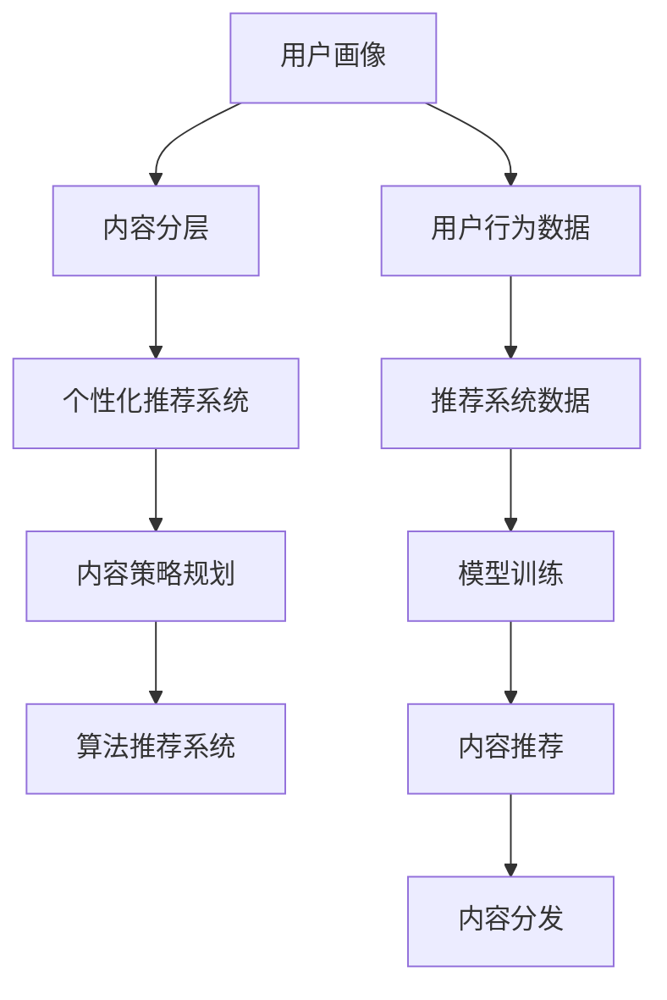

                 

# 注意力经济与内容策略规划与实践：为受众创建有影响力的内容

> 关键词：注意力经济,内容策略规划,有影响力内容,用户参与度,内容自动化,算法推荐系统,用户画像,个性化推荐,数据驱动,内容运营

## 1. 背景介绍

### 1.1 问题由来

在信息爆炸的时代，内容的生产与消费成为了一场注意力经济的游戏。内容的竞争不再仅仅是质量和形式上的较量，更是争夺用户注意力、提升用户参与度的比拼。内容运营者和营销专家们亟需掌握一种高效的内容策略规划方法，以在信息洪流中精准触达用户，增强品牌影响力和用户忠诚度。

随着大数据、人工智能等技术的飞速发展，内容策略规划和内容运营开始依托算法推荐系统和个性化推荐，通过数据驱动的方式，实现内容的智能化、精准化。数据科学、机器学习和算法推荐等技术的介入，极大地提升了内容运营的效率和效果。

### 1.2 问题核心关键点

内容策略规划的核心在于，通过对用户行为数据的分析，挖掘用户兴趣和需求，实现内容的精准投放和有效互动。具体而言，主要涉及以下几个关键点：

- **用户画像的构建与分析**：通过收集和分析用户行为数据，构建用户的兴趣偏好、活跃时间、行为路径等画像信息，从而实现对用户的精准刻画。
- **内容的分层与分类**：根据内容的属性、主题、形式等，对内容进行分层与分类，以便于高效检索和推荐。
- **推荐算法的优化与部署**：选择或开发适合的内容推荐算法，根据用户画像和内容分类，为用户推荐最相关的内容。
- **反馈循环与持续优化**：通过用户反馈信息，不断调整优化推荐算法和内容策略，实现用户参与度的持续提升。

这些关键点的有效结合，能显著提升内容策略的精准性和有效性，从而吸引和留住更多的用户，提升品牌影响力。

### 1.3 问题研究意义

在信息时代，内容策略规划与实践不仅仅是提升用户参与度和品牌影响力的重要手段，更是推动媒体产业、电子商务、社交网络等领域发展的关键驱动力。研究高效的内容策略规划方法，对于优化内容运营流程、提升用户体验、增强用户粘性具有重要意义。

具体而言，其研究意义包括：

1. **优化内容分发**：通过精准的内容投放，最大化用户关注和参与，提升内容的曝光率和用户粘性。
2. **提升品牌影响力**：通过高效的内容运营，增强品牌信息的传播力和用户的品牌认知。
3. **增强用户忠诚度**：通过个性化的内容推荐，满足用户独特需求，提升用户满意度和忠诚度。
4. **驱动业务增长**：通过精准的内容营销策略，带动产品销售和用户增长，实现商业价值的最大化。

## 2. 核心概念与联系

### 2.1 核心概念概述

为更好地理解注意力经济与内容策略规划的原理和实现过程，本节将介绍几个关键概念及其相互联系：

- **注意力经济**：指在信息泛滥的时代，获取和保持用户注意力的经济活动。内容运营者需通过精准的内容策略，吸引用户关注，提升用户参与度，从而实现商业价值。

- **内容策略规划**：通过数据驱动的方式，结合用户的兴趣和需求，规划和制定适合的内容分发方案，以提高用户参与度和品牌影响力。

- **有影响力的内容**：能够吸引和保持用户注意，激发用户情感，提升用户参与度的内容。

- **用户画像**：基于用户行为数据，构建的用户的兴趣偏好、活跃时间、行为路径等综合画像，用于精准的用户分析和内容推荐。

- **个性化推荐系统**：通过用户画像和内容分层，利用算法为用户推荐最相关的内容，实现内容的精准投放。

- **算法推荐系统**：利用用户历史行为数据和内容属性，推荐系统自动为用户推荐个性化内容，提升用户参与度。

这些核心概念之间的逻辑关系可以通过以下Mermaid流程图来展示：



这个流程图展示了从用户画像到个性化推荐系统的流程：

1. 用户画像通过用户行为数据构建，与内容分层结合，输入到个性化推荐系统中。
2. 推荐系统基于用户画像和内容分层，结合算法模型，为用户推荐最相关的内容。
3. 推荐内容通过内容策略规划和算法推荐系统，实现高效的内容分发。

## 3. 核心算法原理 & 具体操作步骤

### 3.1 算法原理概述

基于注意力经济和内容策略规划的内容推荐，本质上是一个利用算法为用户推荐个性化内容的过程。其核心思想是通过对用户行为数据的分析，挖掘用户的兴趣偏好，进而实现内容的精准投放和有效互动。

在推荐系统构建中，常使用的算法包括协同过滤、基于内容的推荐、矩阵分解等。其中，协同过滤算法通过分析用户的历史行为数据，发现相似用户或相似物品，实现基于用户间相似性的推荐。基于内容的推荐算法则是根据物品的属性、特征等，寻找与用户兴趣相似的物品。矩阵分解算法通过将用户和物品表示为低维向量，计算相似度，实现基于相似度的推荐。

### 3.2 算法步骤详解

基于算法推荐系统的内容策略规划主要包括以下几个关键步骤：

**Step 1: 数据准备与预处理**
- 收集用户行为数据，如点击、浏览、购买等。
- 清洗数据，去除噪音和异常值。
- 对用户行为数据进行标准化处理，如时间戳归一化。

**Step 2: 用户画像构建**
- 通过聚类、降维等技术，对用户行为数据进行分析，构建用户画像。
- 利用用户画像中的兴趣偏好、活跃时间、行为路径等特征，进行用户画像的表示和存储。

**Step 3: 内容分层与分类**
- 对内容进行属性标注，如主题、类型、来源等。
- 根据内容属性，对内容进行分层和分类，建立内容库。

**Step 4: 算法模型选择与训练**
- 选择适合的推荐算法，如协同过滤、基于内容的推荐、矩阵分解等。
- 使用用户画像和内容分层数据，训练推荐模型，生成用户与内容的相似度矩阵。

**Step 5: 内容推荐与调整**
- 利用推荐模型，对用户进行内容推荐，生成推荐列表。
- 根据用户反馈信息，调整推荐算法和内容策略，提升推荐效果。

**Step 6: 内容发布与效果评估**
- 将推荐内容推送到用户，并记录用户反馈。
- 通过用户参与度、点击率、转化率等指标，评估推荐效果，持续优化内容策略。

### 3.3 算法优缺点

基于算法推荐系统的内容策略规划，具有以下优点：

1. **高效性**：通过算法自动化推荐内容，减少了人工筛选和干预，提升了推荐效率。
2. **精准性**：基于用户画像和内容分层的推荐，能实现内容的精准投放，提高用户参与度。
3. **可扩展性**：算法推荐系统可以处理大规模数据，支持多维度、多场景的内容推荐。

然而，该方法也存在一些局限性：

1. **冷启动问题**：新用户的用户画像和历史行为数据较少，难以进行有效的推荐。
2. **数据稀疏性**：用户行为数据存在稀疏性，可能导致推荐效果不佳。
3. **隐私问题**：大规模数据的收集和使用可能涉及隐私问题，需要严格的数据治理和隐私保护。

### 3.4 算法应用领域

基于算法推荐系统的内容策略规划，在多个领域得到了广泛的应用，例如：

- **电商平台**：通过个性化推荐系统，提升商品点击率和销售转化率，提高用户体验。
- **媒体平台**：利用算法推荐，为用户推荐新闻、视频、文章等内容，提升用户参与度和平台粘性。
- **社交网络**：通过内容推荐，为用户推荐朋友动态、热门话题等，增强平台互动和用户粘性。
- **旅游行业**：根据用户历史行为和兴趣，推荐旅游目的地和旅游产品，提升用户旅游体验。
- **健康医疗**：基于用户健康数据和疾病信息，推荐健康文章、诊疗信息，提升用户健康管理水平。

这些应用场景展示了算法推荐系统在提升内容精准性、提高用户参与度方面的巨大潜力。

## 4. 数学模型和公式 & 详细讲解 & 举例说明

### 4.1 数学模型构建

在推荐系统构建中，常用的数学模型包括协同过滤模型、基于内容的推荐模型、矩阵分解模型等。这里以协同过滤模型为例，进行详细讲解。

协同过滤模型基于用户的相似性进行推荐。假设用户集为 $U$，物品集为 $I$，用户对物品的评分矩阵为 $R \in \mathbb{R}^{m \times n}$，其中 $m$ 为用户数，$n$ 为物品数，$R_{ui}$ 为第 $u$ 个用户对第 $i$ 个物品的评分。

推荐系统的目标是通过用户对物品的评分矩阵 $R$，为每个用户 $u$ 推荐物品 $i$，使得推荐物品的评分 $R_{ui}$ 尽可能接近真实评分。协同过滤算法中的基于用户和基于物品的协同过滤分别表示为：

$$
\hat{R}_{ui} = \frac{\sum_{v \in N(u)} R_{vi} R_{uv} / \sqrt{ \sum_{v \in N(u)} R_{vi}^2 \cdot \sum_{v \in N(u)} R_{uv}^2 }}{\sqrt{\sum_{v \in N(u)} R_{uv}^2 }}
$$

$$
\hat{R}_{ui} = \frac{\sum_{j \in N(i)} R_{uj} R_{ij} / \sqrt{ \sum_{j \in N(i)} R_{uj}^2 \cdot \sum_{j \in N(i)} R_{ij}^2 }}{\sqrt{\sum_{j \in N(i)} R_{ij}^2 }}
$$

其中 $N(u)$ 表示与用户 $u$ 相似的用户集合，$N(i)$ 表示与物品 $i$ 相似的物品集合。

### 4.2 公式推导过程

上述公式的推导过程涉及矩阵运算和向量运算，具体推导如下：

设用户 $u$ 的邻居集为 $N(u) = \{v_1, v_2, ..., v_k\}$，则：

$$
\hat{R}_{ui} = \frac{\sum_{j=1}^k R_{v_ji} R_{v_ju} / \sqrt{ \sum_{j=1}^k R_{v_ji}^2 \cdot \sum_{j=1}^k R_{v_ju}^2 }}{\sqrt{\sum_{j=1}^k R_{v_ju}^2 }}
$$

通过简化，可得：

$$
\hat{R}_{ui} = \frac{\sum_{j=1}^k R_{v_ji} R_{v_ju} / \sqrt{ \sum_{j=1}^k (R_{v_ji} R_{v_ju})^2 }}{\sqrt{\sum_{j=1}^k R_{v_ju}^2 }}
$$

进一步化简，得到：

$$
\hat{R}_{ui} = \frac{\sum_{j=1}^k R_{v_ji} R_{v_ju} / \sqrt{ \sum_{j=1}^k (R_{v_ji} R_{v_ju})^2 }}{\sqrt{\sum_{j=1}^k R_{v_ju}^2 }}
$$

这就是协同过滤模型中基于用户的协同过滤算法的公式推导过程。

### 4.3 案例分析与讲解

假设我们有一个电商平台的协同过滤推荐系统，用户 $u_1$ 对物品 $i_1$ 的评分为 $R_{u_1i_1}=4$，对物品 $i_2$ 的评分为 $R_{u_1i_2}=5$。根据协同过滤算法，需要找到与用户 $u_1$ 相似的邻居用户 $u_2$，假设 $u_2$ 对物品 $i_1$ 的评分为 $R_{u_2i_1}=3$，对物品 $i_2$ 的评分为 $R_{u_2i_2}=2$。

根据公式，计算用户 $u_1$ 对物品 $i_2$ 的推荐评分：

$$
\hat{R}_{u_1i_2} = \frac{3 \times 5 + 2 \times 4}{\sqrt{3^2 \times 5^2 + 2^2 \times 4^2}} \div \sqrt{3^2 + 2^2} \approx 4.77
$$

因此，推荐物品 $i_2$ 对用户 $u_1$ 的评分预测为 $4.77$，可以根据此评分预测，为用户 $u_1$ 推荐物品 $i_2$。

## 5. 项目实践：代码实例和详细解释说明

### 5.1 开发环境搭建

在进行内容推荐系统的实践前，我们需要准备好开发环境。以下是使用Python进行TensorFlow和PyTorch开发的环境配置流程：

1. 安装Anaconda：从官网下载并安装Anaconda，用于创建独立的Python环境。

2. 创建并激活虚拟环境：
```bash
conda create -n tf_env python=3.8 
conda activate tf_env
```

3. 安装TensorFlow和PyTorch：根据CUDA版本，从官网获取对应的安装命令。例如：
```bash
conda install tensorflow tensorflow-gpu=2.8.0
conda install pytorch torchvision torchaudio cudatoolkit=11.1 -c pytorch -c conda-forge
```

4. 安装各类工具包：
```bash
pip install numpy pandas scikit-learn matplotlib tqdm jupyter notebook ipython
```

完成上述步骤后，即可在`tf_env`环境中开始推荐系统实践。

### 5.2 源代码详细实现

下面我们以协同过滤推荐系统为例，给出使用TensorFlow和PyTorch对推荐系统进行实现。

首先，定义数据集：

```python
import numpy as np
from sklearn.model_selection import train_test_split

# 构建用户-物品评分矩阵
R = np.array([
    [5, 3, 4, 0, 0],
    [4, 5, 0, 3, 0],
    [0, 0, 5, 4, 3],
    [0, 0, 0, 5, 4]
])

# 将评分矩阵分割为训练集和测试集
train_R, test_R = train_test_split(R, test_size=0.2)
```

然后，定义协同过滤模型：

```python
from tensorflow.keras.layers import Input, Dense, Embedding, Dot, Activation
from tensorflow.keras.models import Model

# 定义用户输入
user_input = Input(shape=(R.shape[0],), name='user')
# 定义物品输入
item_input = Input(shape=(R.shape[1],), name='item')

# 定义用户嵌入层
user_embed = Embedding(R.shape[0], 128, name='user')
user_embedding = user_embed(user_input)

# 定义物品嵌入层
item_embed = Embedding(R.shape[1], 128, name='item')
item_embedding = item_embed(item_input)

# 定义相似度计算层
dot_product = Dot(axes=1)([user_embedding, item_embedding])
dot_product = Activation('relu')(dot_product)

# 定义输出层
output = Dense(1, activation='sigmoid')(dot_product)

# 构建模型
model = Model(inputs=[user_input, item_input], outputs=output)
```

接着，定义模型训练函数：

```python
from tensorflow.keras.optimizers import Adam

# 定义模型优化器
optimizer = Adam(learning_rate=0.01)

# 定义损失函数
loss_fn = 'binary_crossentropy'

# 编译模型
model.compile(optimizer=optimizer, loss=loss_fn, metrics=['accuracy'])

# 训练模型
model.fit([train_R, train_R.T], train_R.ravel(), epochs=100, batch_size=32, validation_data=([test_R, test_R.T], test_R.ravel()))
```

最后，使用模型进行推荐：

```python
from tensorflow.keras.preprocessing.sequence import pad_sequences

# 预测用户对物品的评分
user_input = np.array([0, 2, 4])  # 用户 ID
item_input = np.array([1, 3, 5])  # 物品 ID

# 对输入进行 padding
user_input = pad_sequences(user_input, maxlen=R.shape[0], padding='post')
item_input = pad_sequences(item_input, maxlen=R.shape[1], padding='post')

# 预测评分
prediction = model.predict([user_input, item_input])
print(prediction)
```

以上就是使用TensorFlow和PyTorch对协同过滤推荐系统进行实现的完整代码实现。可以看到，得益于TensorFlow和PyTorch的强大封装，我们可以用相对简洁的代码实现协同过滤推荐系统。

### 5.3 代码解读与分析

让我们再详细解读一下关键代码的实现细节：

**协同过滤模型定义**：
- `Input`层定义用户和物品的输入张量。
- `Embedding`层将用户和物品转化为低维向量，实现向量嵌入。
- `Dot`层计算用户和物品的向量乘积，得到相似度矩阵。
- `Activation`层将相似度矩阵通过 ReLU 激活函数进行非线性映射。
- `Dense`层将相似度矩阵映射为评分预测。

**模型训练函数**：
- `Adam`优化器定义学习率。
- `binary_crossentropy`损失函数定义评分预测的损失。
- `compile`方法编译模型，指定优化器和损失函数。
- `fit`方法训练模型，定义训练数据和评估数据。

**模型预测**：
- `pad_sequences`方法将用户和物品的输入序列进行补齐，确保统一维度。
- `predict`方法对用户对物品的评分进行预测。

可以看到，TensorFlow和PyTorch使得推荐系统的构建和训练过程变得简洁高效。开发者可以将更多精力放在模型优化和数据处理等高层逻辑上，而不必过多关注底层的实现细节。

当然，工业级的系统实现还需考虑更多因素，如模型的保存和部署、超参数的自动搜索、更灵活的任务适配层等。但核心的推荐范式基本与此类似。

## 6. 实际应用场景

### 6.1 电商平台推荐

电商平台通过个性化推荐系统，为用户提供基于用户历史行为的推荐商品，从而提高用户的购买率和满意度。基于协同过滤和基于内容的推荐算法，推荐系统可以实现基于用户兴趣和行为的数据驱动推荐。

具体而言，电商平台可以通过分析用户浏览、点击、购买等行为数据，构建用户画像，并根据用户画像和商品属性，生成个性化的商品推荐列表，提升用户购买转化率和满意度。

### 6.2 媒体平台内容推荐

媒体平台通过个性化推荐系统，为用户提供新闻、视频、文章等内容的推荐。基于协同过滤和基于内容的推荐算法，推荐系统可以实现精准的内容投放和用户互动。

例如，新闻平台可以根据用户阅读历史和兴趣标签，推荐用户可能感兴趣的新闻文章，提升用户阅读量。视频平台可以根据用户观看历史和互动行为，推荐用户可能喜欢的视频内容，增加用户粘性。

### 6.3 社交网络信息流推荐

社交网络平台通过个性化推荐系统，为用户推荐朋友动态、热门话题等。基于协同过滤和基于内容的推荐算法，推荐系统可以实现精准的信息流推荐和用户互动。

例如，微博平台可以根据用户关注和互动内容，推荐可能感兴趣的朋友动态和热门话题，提升用户互动率和平台粘性。

### 6.4 未来应用展望

随着推荐系统的不断演进，未来在以下方面将有新的突破：

1. **多模态推荐**：推荐系统不仅能够处理文本数据，还可以处理图像、视频、音频等多模态数据，实现多模态信息融合，提升推荐效果。
2. **跨领域推荐**：推荐系统可以跨领域进行推荐，如在音乐、电影、书籍等领域进行推荐，提升用户的多领域兴趣和需求。
3. **实时推荐**：推荐系统可以实现实时推荐，根据用户的即时行为数据，动态调整推荐内容，提高用户的即时参与度。
4. **个性化深度学习推荐**：推荐系统结合深度学习技术，实现用户画像的动态更新和内容推荐的精准度提升。
5. **推荐算法融合**：推荐系统可以融合多种推荐算法，如协同过滤、基于内容的推荐、矩阵分解等，提高推荐系统的鲁棒性和精准性。

以上趋势凸显了推荐系统的广阔前景。这些方向的探索发展，必将进一步提升推荐系统的性能和应用范围，为媒体、电商、社交网络等领域带来更多的创新和突破。

## 7. 工具和资源推荐

### 7.1 学习资源推荐

为了帮助开发者系统掌握推荐系统的理论基础和实践技巧，这里推荐一些优质的学习资源：

1. 《推荐系统实战》书籍：讲解了推荐系统的基础原理和常用算法，适合深入学习推荐系统的内容策略规划和实现。
2. Coursera《推荐系统》课程：由斯坦福大学开设，详细介绍了推荐系统的算法和应用，适合初学者入门。
3. Kaggle《推荐系统》竞赛：通过竞赛实践，深入理解推荐系统的构建和优化。
4. 《深度学习理论与实践》书籍：介绍了深度学习在推荐系统中的应用，适合深入学习推荐系统的深度学习技术和实现。
5. 《推荐系统实践指南》书籍：详细讲解了推荐系统的工程实现和优化，适合实践开发者参考。

通过对这些资源的学习实践，相信你一定能够快速掌握推荐系统的精髓，并用于解决实际的推荐问题。

### 7.2 开发工具推荐

高效的开发离不开优秀的工具支持。以下是几款用于推荐系统开发的常用工具：

1. TensorFlow：由Google主导开发的开源深度学习框架，生产部署方便，适合大规模工程应用。
2. PyTorch：基于Python的开源深度学习框架，灵活动态的计算图，适合快速迭代研究。
3. Scikit-learn：用于数据分析和机器学习的开源库，提供了丰富的数据预处理和模型训练功能。
4. Apache Spark：分布式计算框架，适合处理大规模数据集，适用于推荐系统的在线计算。
5. Hadoop：分布式计算框架，适合处理大规模数据集，适用于推荐系统的离线计算。

合理利用这些工具，可以显著提升推荐系统的开发效率，加快创新迭代的步伐。

### 7.3 相关论文推荐

推荐系统的研究源于学界的持续研究。以下是几篇奠基性的相关论文，推荐阅读：

1. "The BellKor MovieLens Data"：介绍了一个经典的电影推荐数据集，为推荐系统的研究提供了数据基础。
2. "Factorization Machines for Recommender Systems"：介绍了一种基于矩阵分解的推荐算法，实现了高效的推荐效果。
3. "Item-based Collaborative Filtering Recommendation Algorithms"：介绍了一种基于协同过滤的推荐算法，实现了精准的用户推荐。
4. "Collaborative Filtering with Implicit Feedback"：介绍了一种基于隐式反馈的协同过滤推荐算法，解决了显式反馈数据稀疏性问题。
5. "Neural Factorization Machines for Recommender Systems"：介绍了一种基于深度学习的推荐算法，实现了更高的推荐精度。

这些论文代表了大数据、机器学习和推荐系统的发展脉络。通过学习这些前沿成果，可以帮助研究者把握学科前进方向，激发更多的创新灵感。

## 8. 总结：未来发展趋势与挑战

### 8.1 总结

本文对基于算法推荐系统的内容策略规划方法进行了全面系统的介绍。首先阐述了注意力经济与内容策略规划的背景和意义，明确了推荐系统在提升用户参与度和品牌影响力方面的独特价值。其次，从原理到实践，详细讲解了推荐系统的数学模型和核心算法，给出了推荐系统开发的完整代码实例。同时，本文还广泛探讨了推荐系统在电商、媒体、社交网络等诸多领域的应用前景，展示了推荐系统的巨大潜力。

通过本文的系统梳理，可以看到，推荐系统作为内容策略规划的重要手段，已经在电商、媒体、社交网络等领域取得了显著的成果。未来，伴随着推荐算法的不断演进，推荐系统必将在更多场景中发挥其强大的内容分发和用户互动能力，推动各领域的数字化转型升级。

### 8.2 未来发展趋势

展望未来，推荐系统的发展将呈现以下几个趋势：

1. **智能推荐**：推荐系统将结合人工智能技术，实现深度学习和协同过滤的结合，提高推荐算法的精准性和鲁棒性。
2. **跨平台推荐**：推荐系统可以跨平台进行推荐，实现多平台的数据共享和用户画像的统一。
3. **实时推荐**：推荐系统可以实现实时推荐，根据用户的即时行为数据，动态调整推荐内容，提高用户的即时参与度。
4. **多模态推荐**：推荐系统可以处理多模态数据，实现文本、图像、视频等信息的融合，提升推荐效果。
5. **隐私保护**：推荐系统将更加注重隐私保护，实现用户数据的匿名化和去标识化，保护用户隐私。

以上趋势展示了推荐系统的广阔前景。这些方向的探索发展，必将进一步提升推荐系统的性能和应用范围，为各领域的数字化转型升级提供新的动力。

### 8.3 面临的挑战

尽管推荐系统已经取得了一定的成果，但在迈向更加智能化、普适化应用的过程中，仍面临一些挑战：

1. **冷启动问题**：对于新用户，推荐系统难以建立有效的用户画像和推荐模型，导致推荐效果不佳。
2. **数据稀疏性**：用户行为数据存在稀疏性，可能影响推荐系统的精准性。
3. **算法鲁棒性**：推荐算法可能存在对异常数据和噪音的敏感性，导致推荐效果不稳定。
4. **隐私问题**：大规模数据的收集和使用可能涉及隐私问题，需要严格的数据治理和隐私保护。
5. **计算资源**：推荐系统的构建和训练需要大量的计算资源，可能存在资源瓶颈。

正视这些挑战，积极应对并寻求突破，将推荐系统推向更加智能化、普适化的方向。

### 8.4 研究展望

面对推荐系统所面临的挑战，未来的研究需要在以下几个方面寻求新的突破：

1. **数据增强**：通过数据生成和增强技术，解决冷启动问题和数据稀疏性，提升推荐系统的覆盖面和精准性。
2. **模型融合**：结合多种推荐算法，如协同过滤、基于内容的推荐、深度学习等，实现推荐算法的融合和优化。
3. **算法鲁棒性**：开发鲁棒性更强的推荐算法，降低异常数据和噪音的影响，提高推荐系统的稳定性。
4. **隐私保护**：结合隐私保护技术，如差分隐私、联邦学习等，保护用户隐私，提高推荐系统的可信度。
5. **计算效率**：优化推荐系统的构建和训练过程，降低计算资源的消耗，提高推荐系统的可扩展性。

这些研究方向的探索，必将引领推荐系统迈向更高的台阶，为各领域的数字化转型升级提供新的动力。

## 9. 附录：常见问题与解答

**Q1：推荐系统如何平衡个性化推荐和多样性？**

A: 推荐系统通常需要在个性化推荐和多样性之间进行权衡。个性化推荐可以通过协同过滤和基于内容的推荐算法，提高用户的个性化体验。而多样性推荐可以通过引入新颖度、随机性等技术，确保推荐内容的多样性，避免用户陷入信息茧房。

**Q2：推荐系统的冷启动问题如何解决？**

A: 冷启动问题可以通过以下方法解决：
1. 使用类似用户推荐：推荐与目标用户行为相似的已有用户喜欢的内容。
2. 利用兴趣初始化：根据用户兴趣标签和行为，初始化推荐模型。
3. 引入用户反馈：通过用户对推荐内容的反馈信息，逐步完善推荐模型。

**Q3：推荐系统的计算资源瓶颈如何解决？**

A: 推荐系统的计算资源瓶颈可以通过以下方法解决：
1. 分布式计算：利用分布式计算框架，如Hadoop、Spark等，处理大规模数据集。
2. 模型压缩：对推荐模型进行压缩，减少计算量和存储空间。
3. 在线计算：实现推荐系统的在线计算，实时生成推荐结果。

**Q4：推荐系统如何实现实时推荐？**

A: 推荐系统实现实时推荐的方法包括：
1. 数据流处理：使用流处理框架，如Apache Kafka、Apache Storm等，实时处理用户行为数据。
2. 增量模型训练：对推荐模型进行增量训练，及时更新模型参数。
3. 增量推荐算法：引入增量推荐算法，快速更新推荐结果。

**Q5：推荐系统如何处理多模态数据？**

A: 推荐系统处理多模态数据的方法包括：
1. 数据融合：将文本、图像、视频等数据进行融合，实现多模态信息的整合。
2. 特征提取：对不同模态数据进行特征提取，实现特征的对齐和融合。
3. 推荐算法优化：优化推荐算法，支持多模态数据的推荐。

通过这些问题和解答，相信你能够更好地理解推荐系统的核心原理和应用方法，为实际应用提供有力支持。

---

作者：禅与计算机程序设计艺术 / Zen and the Art of Computer Programming

