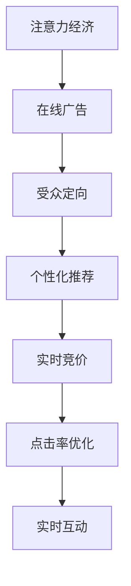

                 

# 注意力经济与在线广告：如何有效地针对受众而不牺牲用户体验

> 关键词：注意力经济, 在线广告, 受众定向, 用户体验, 点击率优化, 广告投放, 数据驱动, 实时竞价, 实时互动, 个性化推荐, 机器学习

## 1. 背景介绍

### 1.1 问题由来
随着互联网技术的迅猛发展，信息爆炸导致注意力资源愈发稀缺。如何有效地吸引和利用用户注意力，最大化广告收益，成为在线广告行业的重要课题。而通过精准的受众定向和个性化推荐，将广告投放到真正有意向的受众面前，既可以提升点击率(CTR)，也能在保证用户体验的前提下，实现广告收益的最大化。本文将从注意力经济和在线广告的视角，探讨如何通过技术手段实现有效受众定向，同时兼顾用户兴趣和感受。

### 1.2 问题核心关键点
- 注意力经济：如何高效利用稀缺的注意力资源，提升广告投放效果。
- 在线广告：如何在用户流量中选择最优的广告投放时机和对象，提升点击率和转化率。
- 受众定向：如何根据用户行为数据，精准匹配目标受众，避免无效曝光。
- 用户体验：如何在保证用户舒适的前提下，最大化广告收入。
- 点击率优化：如何设计模型和策略，优化广告点击率。
- 实时竞价：如何在动态广告市场中，灵活调整投放策略，获取最高ROI。
- 实时互动：如何利用技术手段，实时监控广告效果，进行策略优化。
- 个性化推荐：如何根据用户偏好，定制化广告内容，提升用户满意度。

这些问题构成了在线广告技术的重要组成部分，也是本文关注的核心议题。

## 2. 核心概念与联系

### 2.1 核心概念概述

为更好地理解本文所讨论的核心概念，这里首先进行概念性的梳理。

- **注意力经济**：指在信息爆炸时代，注意力资源愈发稀缺，对注意力的竞争成为经济活动的核心。
- **在线广告**：指通过互联网平台进行有偿宣传，以提升品牌知名度、产品销量等目标的广告形式。
- **受众定向**：指根据用户行为和属性，精准匹配目标受众的过程。
- **用户体验**：指用户在使用产品或服务过程中的感受，包括加载速度、页面设计、互动性等。
- **点击率优化**：指通过数据分析和算法优化，提升广告点击率的目标。
- **实时竞价**：指在广告投放时，根据市场变化动态调整出价，以获取最优ROI。
- **实时互动**：指通过技术手段，实时监控和优化广告投放效果的过程。
- **个性化推荐**：指根据用户偏好，定制化推荐内容，提升用户满意度和转化率。

这些概念紧密相连，共同构成了在线广告的技术生态。通过精准的受众定向和个性化推荐，可以提高广告投放的效率和效果，而实时竞价和点击率优化则能进一步提升广告收益，实时互动则确保广告策略的动态调整和优化。

### 2.2 核心概念原理和架构的 Mermaid 流程图



这个流程图展示了注意力经济与在线广告技术间的核心概念和联系。广告平台通过受众定向和个性化推荐，将广告精准地推送给目标用户，再通过实时竞价和点击率优化，提高广告收益和用户体验。

## 3. 核心算法原理 & 具体操作步骤

### 3.1 算法原理概述

基于注意力经济和在线广告的核心问题，我们探讨如何通过技术手段实现有效受众定向，同时兼顾用户兴趣和感受。

在线广告的核心目标在于最大化广告收益，而这通常依赖于两点：精准的受众定向和高效的点击率优化。

**精准受众定向**依赖于数据分析和机器学习模型。通过对用户行为数据（如浏览历史、购买记录、社交媒体互动等）的分析，构建用户画像，再利用这些画像特征进行受众匹配。

**点击率优化**则依赖于模型的训练和调整。通过点击率预测模型，评估不同广告素材和投放策略的效果，不断调整以实现更高的点击率。

### 3.2 算法步骤详解

#### 3.2.1 精准受众定向

1. **数据收集与处理**
   - 收集用户行为数据，如浏览历史、购买记录、搜索行为等。
   - 数据清洗和预处理，包括去重、缺失值处理、特征工程等。

2. **用户画像构建**
   - 利用聚类、分类等算法，将用户划分为不同的兴趣群体。
   - 提取用户的个性化特征，如年龄、性别、兴趣爱好、消费习惯等。

3. **受众匹配**
   - 使用协同过滤、矩阵分解等技术，对新广告与已有用户的兴趣特征进行匹配。
   - 应用多臂老虎机策略，动态调整投放策略，获取最优组合。

#### 3.2.2 点击率优化

1. **模型构建**
   - 使用深度学习模型，如CTR预估模型（如FTRL、DeepCTR等），构建点击率预测模型。
   - 模型训练时，利用历史广告数据和用户行为数据进行监督学习。

2. **特征选择与工程**
   - 进行特征选择，保留对点击率影响显著的特征。
   - 设计特征交叉和组合，提取更多的特征信息。

3. **模型优化**
   - 利用在线学习（如AdaGrad、AdaDelta）和增量学习（如Online LR），不断优化模型参数。
   - 应用正则化技术（如L1/L2正则、Dropout），防止模型过拟合。

#### 3.2.3 实时竞价与互动

1. **实时竞价策略**
   - 根据市场变化和用户行为数据，动态调整出价策略。
   - 利用机器学习模型（如线性回归、决策树、随机森林）进行预测和决策。

2. **实时互动监控**
   - 实时监控广告投放效果，如点击率、转化率、用户行为等。
   - 利用KPI指标（如CTR、CVR、Cost per Acquisition）进行效果评估。

3. **策略调整与优化**
   - 根据实时数据反馈，进行策略调整和优化。
   - 应用A/B测试和多臂老虎机策略，不断优化广告投放效果。

### 3.3 算法优缺点

精准受众定向和点击率优化的算法主要优点包括：

- **高效**：通过算法优化，极大提升了广告投放的效率和效果。
- **个性化**：能够根据用户行为和偏好，提供定制化的广告内容，提升用户体验。
- **实时性**：利用实时数据进行动态调整，能够快速响应市场变化。

但这些算法也存在一些缺点：

- **数据依赖**：对用户行为数据的依赖较大，缺乏数据的广告定向和优化效果会大打折扣。
- **模型复杂**：算法的实现和调参相对复杂，需要较高的技术门槛。
- **用户隐私**：在数据收集和使用过程中，需要关注用户隐私保护和数据安全。

### 3.4 算法应用领域

基于上述算法的特点，精准受众定向和点击率优化主要应用于以下几个领域：

- **电商广告**：如商品展示广告、搜索广告等。通过精准的用户定向和点击率优化，提升广告效果和ROI。
- **视频广告**：如视频贴片广告、原生广告等。利用视频数据和用户互动信息，进行更加精准的广告定向和效果评估。
- **社交广告**：如Facebook、Instagram等平台上的广告。通过用户社交行为和兴趣图谱，进行个性化推荐和点击率优化。
- **搜索引擎广告**：如Google AdWords等。通过搜索行为和关键词匹配，进行精准的广告投放和点击率优化。

这些领域都高度依赖于用户行为数据的精准分析和高效利用，因此精准受众定向和点击率优化的算法有着广泛的应用前景。

## 4. 数学模型和公式 & 详细讲解 & 举例说明

### 4.1 数学模型构建

为了更好地理解广告点击率优化的数学模型和算法步骤，我们先进行模型构建的介绍。

设广告素材为 $X$，用户特征为 $U$，点击率为 $Y$。点击率预测模型为：

$$
\hat{Y} = f(X, U; \theta)
$$

其中 $f$ 为点击率预测函数，$\theta$ 为模型参数。目标是最大化预测点击率与真实点击率的差异，即最小化损失函数 $L$：

$$
L(Y, \hat{Y}) = \sum_{i=1}^n (Y_i - \hat{Y}_i)^2
$$

常用的点击率预测模型包括线性回归、逻辑回归、随机森林、深度神经网络等。

### 4.2 公式推导过程

以线性回归模型为例，推导其预测公式和损失函数：

设 $X$ 为 $m \times n$ 的特征矩阵，$U$ 为 $n \times 1$ 的用户特征向量。则线性回归模型的预测公式为：

$$
\hat{Y} = \theta_0 + \sum_{j=1}^n \theta_j X_j
$$

其中 $\theta = (\theta_0, \theta_1, ..., \theta_n)$ 为模型参数。根据均方误差（Mean Squared Error, MSE）定义损失函数：

$$
L(Y, \hat{Y}) = \frac{1}{2} \sum_{i=1}^n (Y_i - \hat{Y}_i)^2
$$

通过梯度下降等优化算法，最小化损失函数：

$$
\frac{\partial L}{\partial \theta} = -\frac{1}{n} \sum_{i=1}^n (Y_i - \hat{Y}_i)X_i
$$

根据梯度信息，更新模型参数：

$$
\theta \leftarrow \theta - \eta \frac{\partial L}{\partial \theta}
$$

其中 $\eta$ 为学习率。

### 4.3 案例分析与讲解

#### 案例一：电商广告点击率优化

假设某电商平台收集到用户历史浏览记录和购买记录，其中每条记录包含商品ID、浏览时间、购买金额等特征。使用线性回归模型预测广告点击率，模型参数 $\theta$ 为商品ID对应的系数。在训练阶段，利用历史点击数据进行监督学习，得到模型参数 $\theta$。在新广告投放时，输入广告素材对应的特征 $X$，计算预测点击率 $\hat{Y}$，根据预测结果进行实时竞价和投放策略调整。

#### 案例二：视频广告点击率优化

假设某视频平台收集到用户观看视频的行为数据，如观看时长、点赞、评论等。使用深度神经网络模型（如DeepCTR）预测视频广告的点击率。模型结构包括输入层、隐藏层和输出层，其中隐藏层包含多个卷积和池化层，以提取视频特征。在训练阶段，利用历史点击数据进行监督学习，得到模型参数 $\theta$。在新广告投放时，输入视频片段特征 $X$，计算预测点击率 $\hat{Y}$，根据预测结果进行实时竞价和投放策略调整。

## 5. 项目实践：代码实例和详细解释说明

### 5.1 开发环境搭建

为了实现本文所述的算法，我们需要搭建一个数据驱动的广告投放系统。以下是一个基本的开发环境搭建流程：

1. **安装依赖库**：
   - Python 3.x
   - TensorFlow 或 PyTorch
   - Pandas
   - Scikit-learn
   - TensorBoard

2. **搭建数据存储系统**：
   - 使用Hadoop、Spark等分布式存储系统，存储和处理海量用户行为数据。

3. **搭建机器学习平台**：
   - 使用Dask或Spark MLlib，进行大规模数据处理和机器学习模型训练。

4. **搭建广告投放平台**：
   - 使用Flask或Django搭建Web服务，实现广告投放和效果评估。

5. **搭建实时监控系统**：
   - 使用Grafana、Prometheus等工具，实现实时监控和告警。

### 5.2 源代码详细实现

#### 5.2.1 数据预处理

```python
import pandas as pd
from sklearn.preprocessing import MinMaxScaler

# 读取用户行为数据
data = pd.read_csv('user_behavior.csv')

# 特征工程
features = data[['user_id', 'item_id', 'time', 'purchase_amount']]
X = features[['item_id', 'time', 'purchase_amount']]
X = MinMaxScaler().fit_transform(X)

# 划分训练集和测试集
train_size = int(len(data) * 0.8)
X_train, X_test = X[:train_size], X[train_size:]
y_train, y_test = data['click'][:train_size], data['click'][train_size:]
```

#### 5.2.2 模型训练

```python
import tensorflow as tf
from tensorflow.keras import layers, models

# 构建线性回归模型
model = models.Sequential()
model.add(layers.Dense(units=32, activation='relu', input_shape=(X_train.shape[1],)))
model.add(layers.Dense(units=1))

# 编译模型
model.compile(optimizer='adam', loss='mse')

# 训练模型
model.fit(X_train, y_train, epochs=10, validation_data=(X_test, y_test))
```

#### 5.2.3 实时竞价与投放策略

```python
import time

# 实时竞价函数
def realtime_bidding(price, CTR, budget):
    if CTR < price * budget:
        return False
    else:
        return True

# 测试
price = 0.5
CTR = 0.3
budget = 1000
bidding = realtime_bidding(price, CTR, budget)
print(bidding)
```

### 5.3 代码解读与分析

上述代码实现了广告点击率预测的线性回归模型训练，以及实时竞价策略。

- **数据预处理**：使用MinMaxScaler对特征进行归一化处理，提高模型训练效果。
- **模型训练**：使用Keras搭建线性回归模型，进行监督学习训练。
- **实时竞价**：定义一个简单的实时竞价函数，根据预测的CTR和预算，判断是否进行投放。

## 6. 实际应用场景

### 6.1 智能推荐系统

基于精准受众定向和点击率优化的算法，智能推荐系统可以为用户推荐符合其兴趣的商品或内容，从而提升用户满意度和转化率。

具体实现流程如下：

1. **数据收集与处理**：收集用户浏览、点击、购买等行为数据，提取用户特征。
2. **用户画像构建**：利用聚类和分类算法，构建用户画像，提取个性化特征。
3. **推荐模型训练**：利用点击率预测模型，预测用户对不同商品或内容的兴趣度。
4. **推荐策略调整**：根据用户历史行为和实时点击率，动态调整推荐策略，提升推荐效果。

### 6.2 搜索引擎广告

搜索引擎广告通过精准的关键词匹配和点击率优化，为广告主提供高效的目标受众定向。

具体实现流程如下：

1. **广告素材收集**：收集广告主提供的不同广告素材，如图片、视频、文字等。
2. **用户行为数据收集**：收集用户对不同广告的点击行为数据。
3. **模型训练**：利用点击率预测模型，预测不同广告素材的点击率。
4. **投放策略调整**：根据实时点击率和预算，动态调整投放策略，提升广告效果。

### 6.3 视频广告

视频广告通过精准的受众定向和点击率优化，提高广告点击率和用户互动效果。

具体实现流程如下：

1. **视频素材收集**：收集广告主提供的视频素材。
2. **用户行为数据收集**：收集用户对不同视频的观看行为数据，如观看时长、点赞、评论等。
3. **模型训练**：利用深度神经网络模型，预测视频广告的点击率。
4. **投放策略调整**：根据实时点击率和预算，动态调整投放策略，提升广告效果。

## 7. 工具和资源推荐

### 7.1 学习资源推荐

为了帮助开发者系统掌握注意力经济和在线广告的核心技术，这里推荐一些优质的学习资源：

1. **《推荐系统实战》**：介绍推荐系统的基础理论和实际应用，适合初学者入门。
2. **《深度学习与广告》**：介绍深度学习在广告推荐和效果评估中的应用，适合进阶学习。
3. **《在线广告优化》**：介绍在线广告的投放策略和效果评估，适合广告主和广告代理商。
4. **《机器学习实战》**：介绍机器学习模型的构建和优化，适合基础和进阶学习。

通过对这些资源的学习实践，相信你一定能够快速掌握注意力经济和在线广告的关键技术，并用于解决实际的广告问题。

### 7.2 开发工具推荐

为了提高开发效率和系统性能，这里推荐一些优质的开发工具：

1. **PyTorch**：开源深度学习框架，支持动态计算图和分布式训练。
2. **TensorFlow**：开源深度学习框架，支持大规模分布式训练和部署。
3. **Scikit-learn**：机器学习库，提供了丰富的算法实现和评估工具。
4. **Keras**：高层深度学习库，易于搭建和调试模型。
5. **Dask**：分布式计算框架，支持大规模数据处理和并行计算。

这些工具可以帮助开发者高效地进行模型构建、训练和优化，加速广告系统的开发和部署。

### 7.3 相关论文推荐

注意力经济和在线广告技术的发展离不开学界的持续研究。以下是几篇奠基性的相关论文，推荐阅读：

1. **ClickBots: An Algorithm for Finding Budget-Optimal Bidding Strategies in Real-Time Bidding**：介绍实时竞价算法，提高广告投放的效率和效果。
2. **DeepAd impression prediction: A deep learning framework for large-scale click-through rate prediction**：介绍深度神经网络在点击率预测中的应用，提高广告推荐的效果。
3. **Attention-based Advertisement Recommendation**：介绍注意力机制在广告推荐中的应用，提升广告推荐的个性化和精准度。
4. **A Deep Learning Framework for Online Real-time Bidding**：介绍深度学习在实时竞价中的应用，提高广告投放的效果和ROI。

这些论文代表了大数据和深度学习在广告领域的应用进展，可以帮助开发者深入理解技术原理和实现细节。

## 8. 总结：未来发展趋势与挑战

### 8.1 总结

本文从注意力经济和在线广告的视角，探讨了如何通过技术手段实现有效受众定向，同时兼顾用户兴趣和感受。首先介绍了注意力经济和在线广告的核心问题，然后从精准受众定向和点击率优化的角度，详细讲解了基于数据分析和机器学习的广告优化策略。最后结合实际应用场景，展示了广告推荐和搜索引擎广告等具体应用的实现方法。

通过本文的系统梳理，可以看到，基于大数据和深度学习的广告技术，已经在实际应用中取得了显著效果，极大提升了广告投放的效率和效果。未来，伴随技术手段的不断进步，广告定向和优化将更加精准和高效，助力广告主实现更高的ROI，为用户带来更加个性化的体验。

### 8.2 未来发展趋势

展望未来，基于注意力经济和在线广告的核心技术，将呈现以下几个发展趋势：

1. **深度学习与强化学习的结合**：利用深度学习和强化学习的思想，提升广告推荐和投放的效果，实现更加智能化的广告优化。
2. **多模态数据的融合**：利用文本、图像、视频等多种模态数据，进行更加全面和精准的广告推荐和定向。
3. **实时竞价与个性化推荐**：利用实时竞价和个性化推荐，实现广告投放和推荐的动态调整和优化。
4. **用户隐私保护**：在数据收集和使用过程中，加强用户隐私保护和数据安全，提升用户信任和满意度。
5. **跨平台广告投放**：通过统一的广告投放策略，实现跨平台（如PC、移动、社交媒体等）的精准广告投放和效果评估。

这些趋势将进一步推动广告技术的进步，提升广告投放的效率和效果，同时也带来新的挑战和机遇。

### 8.3 面临的挑战

尽管广告技术已经取得了显著进展，但在迈向更加智能化、普适化应用的过程中，仍面临诸多挑战：

1. **数据依赖问题**：广告定向和优化依赖于大量的用户行为数据，数据的获取和处理成本较高。
2. **模型复杂性**：广告推荐和优化模型相对复杂，需要较高的技术门槛和资源投入。
3. **用户隐私问题**：在数据收集和使用过程中，需要关注用户隐私保护和数据安全。
4. **广告欺诈问题**：广告平台面临广告欺诈的风险，需要加强广告验证和监控。
5. **模型稳定性**：在动态广告市场中，需要设计稳定的广告投放策略，避免策略波动和模型过拟合。

### 8.4 研究展望

针对广告技术面临的挑战，未来的研究需要在以下几个方面寻求新的突破：

1. **跨平台广告优化**：通过统一的广告投放策略，实现跨平台（如PC、移动、社交媒体等）的精准广告投放和效果评估。
2. **强化学习与在线学习**：利用强化学习和在线学习的思想，实现更加智能化的广告优化。
3. **多模态数据融合**：利用文本、图像、视频等多种模态数据，进行更加全面和精准的广告推荐和定向。
4. **实时竞价与个性化推荐**：利用实时竞价和个性化推荐，实现广告投放和推荐的动态调整和优化。
5. **用户隐私保护**：在数据收集和使用过程中，加强用户隐私保护和数据安全。

这些研究方向的探索将进一步推动广告技术的进步，提升广告投放的效率和效果，同时也带来新的挑战和机遇。

## 9. 附录：常见问题与解答

### Q1：如何平衡广告点击率和用户体验？

A: 广告点击率和用户体验之间存在一定的权衡。为了提升用户体验，广告推荐和投放策略需要尽可能地精准和个性化，避免频繁打扰用户。同时，广告点击率优化也需要不断调整投放策略，以获取更高的ROI。在实际操作中，可以采用多臂老虎机策略，动态调整广告投放策略，平衡广告效果和用户体验。

### Q2：如何处理广告欺诈问题？

A: 广告欺诈是广告平台面临的重要挑战。可以通过多种方式进行防范和处理，如：

- **广告验证**：利用IP地址、浏览器指纹、设备指纹等手段，验证广告点击的合法性。
- **监控告警**：实时监控广告投放效果，设置异常告警阈值，及时发现并处理异常点击行为。
- **白名单机制**：建立白名单机制，限制低质量流量进入广告投放系统。

### Q3：如何设计高效的广告投放策略？

A: 高效的广告投放策略需要考虑多个因素，如：

- **目标受众定位**：利用数据分析和机器学习算法，精准匹配目标受众，避免无效曝光。
- **广告素材优化**：选择最优的广告素材和创意，提升广告的吸引力和转化率。
- **实时竞价策略**：根据市场变化和用户行为数据，动态调整出价策略，获取最优ROI。
- **投放时间优化**：选择最佳的投放时间，提升广告效果和用户互动。

### Q4：如何利用深度学习进行广告推荐？

A: 利用深度学习进行广告推荐，通常需要构建点击率预测模型，具体步骤如下：

1. **数据收集与处理**：收集用户行为数据，提取用户特征。
2. **特征选择与工程**：进行特征选择和特征交叉，提取更多的特征信息。
3. **模型构建与训练**：利用深度学习模型（如DeepCTR），构建点击率预测模型，进行监督学习训练。
4. **模型评估与优化**：利用实时数据进行模型评估，不断调整和优化模型参数。

### Q5：如何实现跨平台广告投放？

A: 实现跨平台广告投放，需要建立统一的广告投放策略，具体步骤如下：

1. **数据收集与处理**：收集不同平台上的用户行为数据，提取用户特征。
2. **广告素材统一管理**：对不同平台上的广告素材进行统一管理，确保广告素材的通用性。
3. **投放策略统一设计**：设计统一的广告投放策略，实现跨平台的精准投放。
4. **效果评估与优化**：利用跨平台的数据和广告效果，进行效果评估和优化，提升广告投放的效果。

通过这些技术手段，广告平台可以实现更加精准、高效、智能化的广告投放和优化，为广告主和用户创造更大的价值。

