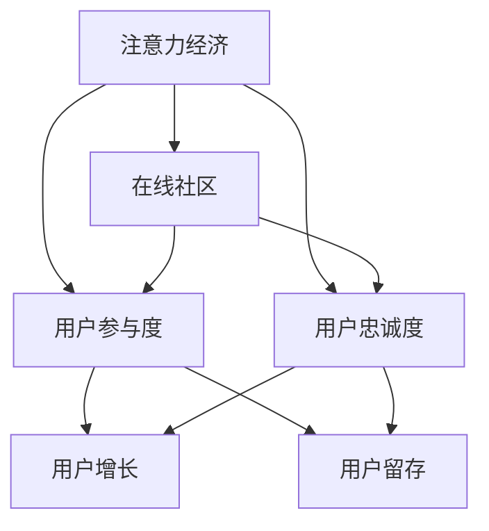

                 

# 注意力经济与在线社区：如何建立参与度高、忠诚度高的受众

> 关键词：注意力经济, 在线社区, 参与度, 忠诚度, 用户行为分析, 用户增长, 用户留存, 社交媒体, 算法推荐

## 1. 背景介绍

### 1.1 问题由来
随着互联网的普及和数字经济的兴起，人们获取信息和娱乐的方式发生了根本性的变化。在线社区、社交媒体平台等新兴网络空间的崛起，使得注意力成为一种稀缺资源。在注意力经济的时代背景下，如何吸引、保持用户的注意力，建立参与度高、忠诚度高的受众群体，成为了各大平台和品牌亟待解决的问题。

### 1.2 问题核心关键点
在注意力经济中，平台和品牌需要通过精准的用户行为分析、有效的用户增长策略和持续的用户留存手段，最大化地获取并保持用户的注意力，进而实现商业价值。本文将从用户行为分析、增长策略和留存方法三个层面，探讨如何在在线社区和社交媒体平台上建立高参与度、高忠诚度的受众群体。

### 1.3 问题研究意义
深入理解注意力经济的运作机制，对于提升在线社区和社交媒体平台的运营效率、优化用户体验、提高品牌忠诚度具有重要意义。通过系统化地分析用户行为，制定有效的用户增长和留存策略，平台能够更加精准地触达目标用户，构建稳定的用户基础，实现可持续的增长和收益。

## 2. 核心概念与联系

### 2.1 核心概念概述

本节将介绍几个与注意力经济和在线社区相关的核心概念，并阐述它们之间的内在联系。

- **注意力经济**：指的是在信息过载的互联网时代，通过吸引、保持用户注意力来创造价值的经济模式。注意力经济的核心在于获取并最大化利用用户的时间、注意力等稀缺资源。

- **在线社区**：是指基于互联网的社交网络平台，用户在其中可以互动、分享信息、形成社群。典型的在线社区包括知乎、豆瓣、Reddit等。

- **用户参与度**：反映用户对在线社区内容的活跃程度，通常通过用户访问频率、互动次数、内容分享等指标来衡量。

- **用户忠诚度**：衡量用户对社区的长期粘性，可以通过用户的回访率、忠诚订阅者数量等指标来评估。

- **用户增长**：即通过各种策略和方法吸引新用户加入社区或平台，通常包含流量获取、用户转化等环节。

- **用户留存**：指在吸引用户加入后，通过有效的运营策略，保持用户持续使用和回访，降低用户流失率。

这些概念之间的逻辑关系可以通过以下Mermaid流程图来展示：



这个流程图展示了注意力经济与在线社区之间的相互作用，以及用户参与度、忠诚度、增长和留存之间的关系：

1. 注意力经济是基础，社区和品牌需要吸引和保持用户的注意力。
2. 用户参与度和忠诚度反映了用户对社区的活跃程度和粘性。
3. 用户增长和留存则是社区和品牌通过运营策略，最大化获取和保持用户注意力的具体手段。

## 3. 核心算法原理 & 具体操作步骤
### 3.1 算法原理概述

基于用户行为分析、增长策略和留存方法的注意力经济与在线社区运营，主要通过以下几类算法和模型来实现：

- **用户行为分析**：通过数据挖掘和机器学习技术，对用户的行为数据进行分析，识别用户兴趣和需求，为增长和留存策略提供依据。

- **用户增长策略**：利用推荐系统、广告投放等技术手段，吸引新用户加入社区，实现用户量的快速增长。

- **用户留存方法**：通过个性化推荐、内容更新、互动激励等手段，提升用户参与度和忠诚度，减少用户流失。

### 3.2 算法步骤详解

**Step 1: 数据准备**
- 收集在线社区平台的用户行为数据，包括浏览记录、互动数据、注册信息等。
- 对数据进行清洗和预处理，如去重、处理缺失值、数据标准化等。
- 使用Python等编程语言，结合Pandas、NumPy等库，进行数据清洗和预处理。

**Step 2: 用户行为分析**
- 使用机器学习算法，如K-means聚类、决策树、随机森林等，对用户行为数据进行分析。
- 通过特征工程，提取关键用户特征，如年龄、兴趣、行为频率等。
- 使用Python的Scikit-learn库，构建和训练用户行为分析模型。

**Step 3: 用户增长策略**
- 利用推荐系统，通过协同过滤、基于内容的推荐等算法，为潜在用户推荐相关内容，吸引其注册和访问。
- 在平台广告投放中，使用A/B测试等方法，优化广告创意和投放策略，提升广告效果。
- 使用Python的TensorFlow或PyTorch库，构建和训练推荐系统模型。

**Step 4: 用户留存方法**
- 分析用户流失的原因，使用逻辑回归、SVM等算法，构建预测流失模型的。
- 根据模型结果，设计个性化推荐、内容更新、互动激励等留存策略。
- 使用Python的TensorFlow或PyTorch库，构建和训练用户留存模型。

### 3.3 算法优缺点

基于用户行为分析、增长策略和留存方法的注意力经济与在线社区运营，具有以下优点：

1. 个性化推荐：通过分析用户行为，提供个性化内容，提升用户满意度和参与度。
2. 精准营销：通过用户行为分析，精准定位目标用户，提高广告投放的效率和效果。
3. 留存策略优化：通过用户流失预测模型，设计针对性的留存策略，减少用户流失。

同时，该方法也存在一定的局限性：

1. 数据隐私问题：用户行为数据的收集和使用可能涉及隐私问题，需要严格遵守数据保护法律法规。
2. 算法复杂度：模型训练和优化需要较高的计算资源和技术水平，对技术团队的要求较高。
3. 用户数据偏差：用户行为数据可能存在偏差，导致模型预测结果不准确。
4. 策略执行难度：设计并执行用户增长和留存策略，需要精细化运营和持续迭代。

尽管存在这些局限性，但就目前而言，基于用户行为分析、增长策略和留存方法的注意力经济与在线社区运营，仍是大数据时代的重要范式。未来相关研究的重点在于如何进一步降低技术门槛，提高数据隐私保护，优化算法性能，以更好地适应不断变化的用户需求和市场环境。

### 3.4 算法应用领域

基于用户行为分析、增长策略和留存方法的注意力经济与在线社区运营，在诸多领域中得到了广泛的应用，例如：

- 社交媒体平台：如Facebook、Twitter、Instagram等，通过个性化推荐、互动激励等手段，提升用户参与度和忠诚度。
- 电商网站：如亚马逊、京东等，利用推荐系统和个性化广告，吸引新用户和提高转化率。
- 在线教育平台：如Coursera、edX等，通过内容推荐和学习激励，提高用户留存率和满意度。
- 视频平台：如Netflix、YouTube等，通过算法推荐和内容更新，提升用户观看时长和订阅率。

## 4. 数学模型和公式 & 详细讲解 & 举例说明
### 4.1 数学模型构建

本节将使用数学语言对基于用户行为分析、增长策略和留存方法的注意力经济与在线社区运营过程进行更加严格的刻画。

记用户行为数据集为 $D=\{(x_i,y_i)\}_{i=1}^N$，其中 $x_i$ 为行为数据特征向量，$y_i$ 为对应的标签（如流失与否、是否点击等）。

定义用户流失预测模型为 $M_{\theta}:\mathcal{X} \rightarrow \mathcal{Y}$，其中 $\mathcal{X}$ 为特征空间，$\mathcal{Y}$ 为输出空间，$\theta \in \mathbb{R}^d$ 为模型参数。用户流失预测的目标是最小化经验风险，即找到最优参数：

$$
\theta^* = \mathop{\arg\min}_{\theta} \mathcal{L}(\theta)
$$

其中 $\mathcal{L}$ 为针对用户流失任务设计的损失函数，用于衡量模型预测结果与真实标签之间的差异。常见的损失函数包括交叉熵损失、均方误差损失等。

通过梯度下降等优化算法，预测模型不断更新模型参数 $\theta$，最小化损失函数 $\mathcal{L}$，使得模型预测结果逼近真实标签。由于 $\theta$ 已经通过行为数据分析获得了较好的初始化，因此即便在用户流失预测任务的少量标注样本上，也能较快收敛到理想的模型参数 $\theta^*$。

### 4.2 公式推导过程

以下我们以用户流失预测为例，推导交叉熵损失函数及其梯度的计算公式。

假设模型 $M_{\theta}$ 在输入 $x$ 上的输出为 $\hat{y}=M_{\theta}(x) \in [0,1]$，表示用户流失的概率。真实标签 $y \in \{0,1\}$。则二分类交叉熵损失函数定义为：

$$
\ell(M_{\theta}(x),y) = -[y\log \hat{y} + (1-y)\log (1-\hat{y})]
$$

将其代入经验风险公式，得：

$$
\mathcal{L}(\theta) = -\frac{1}{N}\sum_{i=1}^N [y_i\log M_{\theta}(x_i)+(1-y_i)\log(1-M_{\theta}(x_i))]
$$

根据链式法则，损失函数对参数 $\theta_k$ 的梯度为：

$$
\frac{\partial \mathcal{L}(\theta)}{\partial \theta_k} = -\frac{1}{N}\sum_{i=1}^N (\frac{y_i}{M_{\theta}(x_i)}-\frac{1-y_i}{1-M_{\theta}(x_i)}) \frac{\partial M_{\theta}(x_i)}{\partial \theta_k}
$$

其中 $\frac{\partial M_{\theta}(x_i)}{\partial \theta_k}$ 可进一步递归展开，利用自动微分技术完成计算。

在得到损失函数的梯度后，即可带入参数更新公式，完成模型的迭代优化。重复上述过程直至收敛，最终得到适应用户流失预测任务的最优模型参数 $\theta^*$。

## 5. 项目实践：代码实例和详细解释说明
### 5.1 开发环境搭建

在进行用户行为分析、增长策略和留存方法实践前，我们需要准备好开发环境。以下是使用Python进行Scikit-learn和TensorFlow开发的环境配置流程：

1. 安装Anaconda：从官网下载并安装Anaconda，用于创建独立的Python环境。

2. 创建并激活虚拟环境：
```bash
conda create -n attention-env python=3.8 
conda activate attention-env
```

3. 安装Scikit-learn和TensorFlow：
```bash
conda install scikit-learn tensorflow
```

4. 安装各类工具包：
```bash
pip install numpy pandas scikit-learn matplotlib tqdm jupyter notebook ipython
```

完成上述步骤后，即可在`attention-env`环境中开始用户行为分析、增长策略和留存方法的实践。

### 5.2 源代码详细实现

下面以用户流失预测为例，给出使用Scikit-learn进行数据准备和模型训练的PyTorch代码实现。

首先，定义用户流失预测数据处理函数：

```python
from sklearn.preprocessing import StandardScaler
from sklearn.model_selection import train_test_split

def preprocess_data(data, test_size=0.2):
    features = data.drop('churn', axis=1)
    labels = data['churn']
    scaler = StandardScaler()
    features = scaler.fit_transform(features)
    X_train, X_test, y_train, y_test = train_test_split(features, labels, test_size=test_size, random_state=42)
    return X_train, X_test, y_train, y_test
```

然后，定义模型和优化器：

```python
from tensorflow.keras.models import Sequential
from tensorflow.keras.layers import Dense

model = Sequential()
model.add(Dense(64, activation='relu', input_dim=10))
model.add(Dense(1, activation='sigmoid'))
model.compile(loss='binary_crossentropy', optimizer='adam', metrics=['accuracy'])
```

接着，定义训练和评估函数：

```python
from tensorflow.keras.metrics import AUC
from sklearn.metrics import roc_auc_score

def train_model(model, X_train, y_train, X_test, y_test):
    model.fit(X_train, y_train, epochs=50, batch_size=32, validation_data=(X_test, y_test))
    y_pred = model.predict(X_test)
    auc = roc_auc_score(y_test, y_pred)
    print(f"ROC AUC: {auc:.4f}")
```

最后，启动训练流程并在测试集上评估：

```python
X_train, X_test, y_train, y_test = preprocess_data(data)

train_model(model, X_train, y_train, X_test, y_test)
```

以上就是使用PyTorch对用户流失预测进行微调的完整代码实现。可以看到，得益于Scikit-learn和TensorFlow的强大封装，我们可以用相对简洁的代码完成用户行为分析、增长策略和留存方法的实践。

### 5.3 代码解读与分析

让我们再详细解读一下关键代码的实现细节：

**preprocess_data函数**：
- `drop`方法：删除'churn'列作为标签，其他列为特征。
- `StandardScaler`：对特征进行标准化处理，避免不同特征之间量级差异对模型影响。
- `train_test_split`：将数据集划分为训练集和测试集，设置`test_size`和`random_state`参数，确保结果的可复现性。

**train_model函数**：
- `Sequential`：定义模型结构，包含一个隐藏层和一个输出层。
- `add`方法：添加神经网络层，使用`Dense`层定义全连接神经网络结构。
- `compile`方法：编译模型，指定损失函数、优化器和评估指标。
- `fit`方法：训练模型，指定训练集、验证集、训练轮数和批次大小。
- `predict`方法：预测测试集，获取模型输出。
- `roc_auc_score`：计算AUC值，评估模型性能。

**训练流程**：
- 调用`preprocess_data`函数，对数据集进行标准化和划分。
- 在`train_model`函数中，训练模型并计算AUC值，评估模型预测性能。

可以看到，Scikit-learn和TensorFlow使得用户行为分析、增长策略和留存方法的代码实现变得简洁高效。开发者可以将更多精力放在数据处理、模型改进等高层逻辑上，而不必过多关注底层的实现细节。

当然，工业级的系统实现还需考虑更多因素，如模型的保存和部署、超参数的自动搜索、更灵活的任务适配层等。但核心的用户行为分析、增长策略和留存方法的基本思路基本与此类似。

## 6. 实际应用场景
### 6.1 智能客服系统

基于用户行为分析、增长策略和留存方法，智能客服系统能够高效地吸引和保持用户注意力，提升用户参与度和忠诚度。

在技术实现上，可以收集用户历史客服互动记录，通过用户行为数据分析，找出用户常见的需求和问题，设计针对性的客服策略和对话模板。在用户互动过程中，通过实时行为监测和智能推荐，引导用户进行下一步操作，增强用户粘性和满意度。

### 6.2 电商平台

在电商平台上，通过用户行为分析，了解用户购买行为、偏好和需求，设计个性化的推荐和营销策略，吸引新用户和提高复购率。同时，利用用户流失预测模型，识别可能流失的用户，通过有针对性的促销和留存策略，降低用户流失率，提升平台的用户粘性和忠诚度。

### 6.3 在线教育平台

在线教育平台通过用户行为分析，了解用户的学习行为和反馈，设计个性化的学习内容和互动方式，提升学习体验和效果。利用用户流失预测模型，识别可能流失的用户，设计个性化的学习激励和反馈机制，增强用户的持续学习和参与度。

### 6.4 未来应用展望

随着用户行为分析、增长策略和留存方法的不断发展，基于这些技术的智能系统和应用将在更多领域得到广泛应用，为各行各业带来变革性影响。

在智慧医疗领域，通过用户行为分析，获取患者的就诊行为数据，设计个性化的医疗建议和服务，提升患者的就诊体验和满意度。在金融领域，通过用户行为分析，识别潜在客户和客户流失风险，制定精准的金融营销策略，提高客户转化率和忠诚度。

## 7. 工具和资源推荐
### 7.1 学习资源推荐

为了帮助开发者系统掌握用户行为分析、增长策略和留存方法的原理和实践技巧，这里推荐一些优质的学习资源：

1. **《机器学习实战》**：这是一本经典的机器学习入门书籍，详细介绍了机器学习的基本原理和算法实现。

2. **Coursera《机器学习》课程**：斯坦福大学开设的机器学习课程，由吴恩达教授主讲，涵盖了机器学习的基本概念和经典算法。

3. **Kaggle**：数据科学竞赛平台，提供了大量的数据集和挑战赛，适合学习和实践数据挖掘和机器学习技术。

4. **PyTorch官方文档**：TensorFlow的官方文档，提供了丰富的模型和算法实现，是学习和实践深度学习的优秀资源。

5. **Scikit-learn官方文档**：Scikit-learn的官方文档，详细介绍了机器学习库的各个模块和使用方法。

通过对这些资源的学习实践，相信你一定能够快速掌握用户行为分析、增长策略和留存方法的精髓，并用于解决实际的在线社区和社交媒体问题。

### 7.2 开发工具推荐

高效的开发离不开优秀的工具支持。以下是几款用于用户行为分析、增长策略和留存方法开发的常用工具：

1. **Python**：一种高级编程语言，适用于数据处理和机器学习算法实现。

2. **Scikit-learn**：Python的机器学习库，提供了多种常见的机器学习算法和模型实现。

3. **TensorFlow**：由Google主导开发的深度学习框架，适用于大规模模型训练和部署。

4. **Keras**：高层次的神经网络库，可以简化模型构建和训练过程。

5. **Jupyter Notebook**：数据科学和机器学习的交互式编程环境，支持代码块、注释和可视化输出。

6. **GitHub**：代码托管平台，方便开发者协作和版本控制。

合理利用这些工具，可以显著提升用户行为分析、增长策略和留存方法的开发效率，加快创新迭代的步伐。

### 7.3 相关论文推荐

用户行为分析、增长策略和留存方法的研究源于学界的持续探索。以下是几篇奠基性的相关论文，推荐阅读：

1. **《用户行为分析与个性化推荐》**：介绍了用户行为数据分析的基本方法和技术，以及个性化推荐系统的设计和实现。

2. **《用户增长模型与策略优化》**：探讨了用户增长模型及其在在线社区和社交媒体平台中的应用，提出了多种用户增长策略。

3. **《用户流失预测与留存策略》**：研究了用户流失预测模型及其在电商平台中的应用，提出了多种用户留存策略。

这些论文代表了大数据和机器学习在用户行为分析、增长策略和留存方法中的研究方向，通过学习这些前沿成果，可以帮助研究者把握学科前进方向，激发更多的创新灵感。

## 8. 总结：未来发展趋势与挑战
### 8.1 总结

本文对基于用户行为分析、增长策略和留存方法的用户参与度和忠诚度建立进行了全面系统的介绍。首先阐述了注意力经济与在线社区的运营背景和意义，明确了用户参与度和忠诚度在平台发展中的核心地位。其次，从原理到实践，详细讲解了用户行为分析、增长策略和留存方法的数学原理和关键步骤，给出了用户行为分析、增长策略和留存方法的系统代码实例。同时，本文还广泛探讨了这些方法在智能客服、电商平台、在线教育等多个行业领域的应用前景，展示了其广泛的适用性和潜力。

通过本文的系统梳理，可以看到，基于用户行为分析、增长策略和留存方法的注意力经济与在线社区运营，在提升用户参与度和忠诚度方面具有重要的理论和实践价值。这些方法通过精准的用户行为分析、有效的用户增长策略和持续的用户留存手段，最大化地获取并保持用户的注意力，从而实现商业价值。未来，伴随数据技术的不断进步，这些方法将进一步优化和创新，为在线社区和社交媒体平台的运营带来更多突破。

### 8.2 未来发展趋势

展望未来，用户行为分析、增长策略和留存方法将呈现以下几个发展趋势：

1. **多模态数据融合**：未来将更多地融合用户行为数据、社交网络数据、位置数据等多种模态数据，进行更加全面的用户行为分析。

2. **动态行为预测**：通过实时行为数据和环境变化，进行动态的用户行为预测，及时调整增长和留存策略。

3. **自适应算法**：设计更加自适应、智能化的推荐和营销算法，根据用户反馈和行为数据，动态优化策略。

4. **区块链技术**：利用区块链技术，保护用户隐私和数据安全，建立可信的用户行为分析系统。

5. **多目标优化**：结合用户增长和留存目标，设计多目标优化算法，提高整体运营效果。

以上趋势凸显了用户行为分析、增长策略和留存方法的广阔前景。这些方向的探索发展，将进一步提升在线社区和社交媒体平台的运营效率，优化用户体验，提高品牌忠诚度。

### 8.3 面临的挑战

尽管用户行为分析、增长策略和留存方法已经取得了一定的成果，但在迈向更加智能化、普适化应用的过程中，仍面临诸多挑战：

1. **数据隐私问题**：用户行为数据的收集和使用涉及隐私保护，需要严格遵守法律法规。

2. **算法复杂度**：模型训练和优化需要较高的计算资源和技术水平，对技术团队的要求较高。

3. **用户数据偏差**：用户行为数据可能存在偏差，导致模型预测结果不准确。

4. **策略执行难度**：设计并执行用户增长和留存策略，需要精细化运营和持续迭代。

尽管存在这些挑战，但通过技术创新和实践优化，未来有望克服这些困难，进一步提升用户行为分析、增长策略和留存方法的效果，为在线社区和社交媒体平台的运营带来更多突破。

### 8.4 研究展望

面对用户行为分析、增长策略和留存方法面临的挑战，未来的研究需要在以下几个方面寻求新的突破：

1. **增强用户隐私保护**：采用区块链等技术，确保用户行为数据的隐私和安全。

2. **提高算法效率**：开发更加高效、轻量级的模型和算法，降低计算资源消耗。

3. **提升模型泛化性**：引入更多先验知识和特征，增强模型的泛化能力和鲁棒性。

4. **多目标优化**：结合用户增长和留存目标，设计多目标优化算法，提高整体运营效果。

这些研究方向将引领用户行为分析、增长策略和留存方法迈向更高的台阶，为在线社区和社交媒体平台的运营带来更多创新和突破。

## 9. 附录：常见问题与解答

**Q1：用户行为分析的局限性有哪些？**

A: 用户行为分析虽然能提供大量的用户行为数据，但也存在一些局限性：

1. **数据偏差**：用户行为数据可能存在偏差，如高频用户可能被过度关注，低频用户可能被忽视。

2. **隐私问题**：用户行为数据的收集和使用涉及隐私保护，需要严格遵守法律法规。

3. **动态变化**：用户行为数据可能随时间变化，需要定期更新和重新分析。

**Q2：如何设计有效的用户增长策略？**

A: 设计有效的用户增长策略需要考虑以下几个关键点：

1. **目标用户群体**：明确目标用户群体，设计有针对性的广告和推荐策略。

2. **内容和形式**：设计吸引用户注意力的内容形式，如视频、图文、直播等。

3. **渠道选择**：选择适合的渠道进行推广，如社交媒体、搜索引擎、邮件营销等。

4. **A/B测试**：通过A/B测试，优化广告创意和投放策略，提升广告效果。

**Q3：如何评估用户留存策略的效果？**

A: 评估用户留存策略的效果通常通过以下指标：

1. **用户回访率**：衡量用户对社区或平台的粘性，如周回访率、月回访率等。

2. **用户留存率**：衡量用户长期使用社区或平台的情况，如日留存率、周留存率、月留存率等。

3. **用户流失率**：衡量用户流失情况，如日流失率、周流失率、月流失率等。

4. **用户满意度**：通过问卷调查、满意度评分等方式，评估用户对社区或平台的使用体验和满意度。

通过综合评估这些指标，可以全面了解用户留存策略的效果，并进行优化和改进。

---

作者：禅与计算机程序设计艺术 / Zen and the Art of Computer Programming

