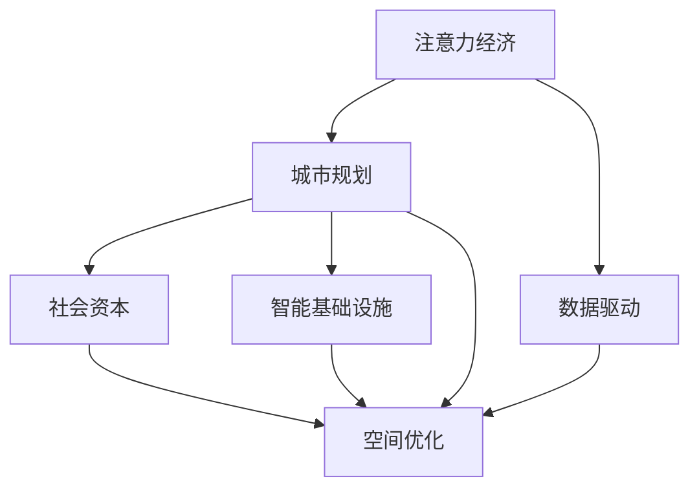

                 

# 注意力经济与城市规划的新思考

> 关键词：注意力经济, 城市规划, 空间优化, 社会资本, 数据驱动, 智能基础设施

## 1. 背景介绍

### 1.1 问题由来
随着全球化进程的不断加速和信息技术的飞速发展，人类社会已经迈入了“注意力经济”时代。在信息过载和数据膨胀的背景下，如何高效利用注意力资源，成为新时期城市规划的重大命题。城市规划不仅仅是土地使用、交通布局和公共设施配置的问题，更关乎经济、社会和文化等多方面的综合考量。

城市作为人类活动的集聚地，其功能不仅包括居住、工作、休闲，还承载着社会交往、文化创新和经济发展等多种社会功能。随着人口流动、产业升级、环境变迁等因素的变化，传统的城市规划方式已经难以适应现代社会的复杂性和多样性。如何在数字化、智能化的大趋势下，高效利用注意力资源，提升城市规划的精准性和前瞻性，是一个亟待解决的问题。

### 1.2 问题核心关键点
注意力经济时代的到来，使得城市规划必须转变思路，从单一的物理空间优化转向对注意力资源的系统性管理。这涉及以下几个关键点：
1. **数据驱动**：利用大数据、人工智能等技术，分析和挖掘城市运行中的注意力热点和规律。
2. **社会资本**：充分考虑社区、企业和个人等不同群体的需求和利益，进行多主体参与的规划。
3. **智能基础设施**：依托物联网、5G、大数据等技术，建设智能化的城市运行管理平台。
4. **空间优化**：在综合考虑各类因素的基础上，优化城市空间结构，提升资源配置效率。

### 1.3 问题研究意义
研究注意力经济在城市规划中的应用，对于提升城市综合竞争力、优化城市管理、推动可持续发展具有重要意义：

1. **提高规划效率**：通过数据分析和智能化手段，快速识别和解决城市运行中的注意力热点问题，提升城市规划的响应速度和决策质量。
2. **促进社会公平**：考虑到不同群体的注意力需求，使得规划方案更具有包容性和公正性，避免规划过程中的资源分配不均和社会分化。
3. **推动产业升级**：利用注意力经济的研究结果，指导产业布局和空间优化，促进新兴产业和高科技产业的发展，加速经济结构转型。
4. **增强城市韧性**：通过对注意力经济的研究，提前识别和规避潜在风险，增强城市的韧性和抗干扰能力，提升城市应对突发事件的能力。
5. **促进文化创新**：将注意力经济理念融入城市规划，促进文化多样性和创新，提升城市的软实力和吸引力。

## 2. 核心概念与联系

### 2.1 核心概念概述

为更好地理解注意力经济在城市规划中的应用，本节将介绍几个密切相关的核心概念：

- **注意力经济**：指在信息时代，注意力作为一种稀缺资源，成为经济活动的重要投入，引导经济决策和市场行为的经济形态。注意力经济的核心在于高效利用和分配注意力资源。
- **城市规划**：涉及对城市空间和功能布局的规划设计，包括土地利用、交通系统、公共设施等多个方面。目标是创造宜居、可持续的城市环境。
- **数据驱动**：利用大数据和人工智能技术，通过数据分析和预测，优化城市规划的决策过程。
- **社会资本**：指城市中的社区、企业、个人等不同主体之间的互动关系和网络结构，对城市规划具有重要影响。
- **智能基础设施**：指依托信息技术和物联网技术，构建的智能化的城市运行管理平台，提升城市运行的效率和安全性。
- **空间优化**：指在综合考虑各类因素的基础上，对城市空间结构进行合理配置，提升资源配置效率和空间使用效率。

这些核心概念之间的逻辑关系可以通过以下Mermaid流程图来展示：



这个流程图展示了大语言模型微调的核心概念及其之间的关系：

1. 注意力经济通过数据分析和智能基础设施的应用，为城市规划提供数据支持和决策依据。
2. 城市规划涉及到社会资本的分析和优化，以确保规划方案的包容性和公正性。
3. 数据驱动和智能基础设施共同作用，提升空间优化的效率和效果。
4. 空间优化是城市规划的核心目标，通过智能基础设施和社会资本的协同作用，实现对注意力资源的系统性管理。

## 3. 核心算法原理 & 具体操作步骤
### 3.1 算法原理概述

基于注意力经济的城市规划方法，核心在于利用数据驱动技术，结合社会资本分析，通过智能基础设施的支持，进行空间优化。其核心思想是：通过分析城市运行中的注意力分布，识别出注意力热点和瓶颈，指导城市规划方案的设计和调整，提升城市管理的效率和效果。

具体而言，该方法包括以下几个关键步骤：

1. **数据收集与预处理**：收集城市运行中的各类数据，包括交通流量、人口密度、能耗数据等，进行数据清洗和预处理。
2. **注意力分析**：利用机器学习技术，分析不同时间段和不同场景下的注意力分布情况，识别出注意力热点和瓶颈。
3. **社会资本分析**：通过调查问卷、访谈等方式，收集社区、企业和个人等不同群体的注意力需求和利益诉求，进行多主体参与的分析。
4. **空间优化**：结合注意力分析和社会资本分析的结果，进行城市空间结构的优化设计，提升资源配置效率。
5. **智能基础设施建设**：依托物联网、5G、大数据等技术，构建智能化的城市运行管理平台，提升城市管理的效率和智能化水平。

### 3.2 算法步骤详解

以下是基于注意力经济的城市规划方法的具体操作步骤：

**Step 1: 数据收集与预处理**
- 收集城市运行中的各类数据，如交通流量、人口密度、能耗数据等，进行数据清洗和预处理，去除噪音和异常值。
- 使用时间序列分析等技术，对数据进行归一化和标准化处理，确保数据的可比性和一致性。

**Step 2: 注意力分析**
- 利用机器学习技术，如聚类分析、时间序列分析等，分析不同时间段和不同场景下的注意力分布情况，识别出注意力热点和瓶颈。
- 使用深度学习技术，如卷积神经网络、循环神经网络等，对注意力数据进行建模和预测，评估不同方案对注意力的影响。

**Step 3: 社会资本分析**
- 通过调查问卷、访谈等方式，收集社区、企业和个人等不同群体的注意力需求和利益诉求，进行多主体参与的分析。
- 使用社会网络分析等技术，分析社会资本的结构和网络特征，识别出关键节点和关系链。
- 结合注意力分析和社会资本分析的结果，进行多主体参与的协调和平衡，确保规划方案的包容性和公正性。

**Step 4: 空间优化**
- 结合注意力分析和社会资本分析的结果，进行城市空间结构的优化设计，提升资源配置效率。
- 利用GIS（地理信息系统）技术，对城市空间结构进行可视化展示和评估，确保规划方案的可行性和合理性。

**Step 5: 智能基础设施建设**
- 依托物联网、5G、大数据等技术，构建智能化的城市运行管理平台，提升城市管理的效率和智能化水平。
- 通过智能传感器和监控系统，实时采集城市运行数据，进行动态分析和决策支持。

### 3.3 算法优缺点

基于注意力经济的城市规划方法具有以下优点：
1. 数据驱动：通过数据分析和建模，提供科学决策依据，提升规划方案的精准性和前瞻性。
2. 社会资本考虑：多主体参与的分析，确保规划方案的包容性和公正性。
3. 智能基础设施：提升城市管理的效率和智能化水平，优化城市运行。
4. 空间优化：通过合理配置空间结构，提升资源配置效率，促进可持续发展。

同时，该方法也存在一定的局限性：
1. 数据收集难度：高质量、全面数据的收集和预处理需要大量人力物力，成本较高。
2. 模型复杂度：深度学习等技术的应用，增加了模型的复杂度和计算负担。
3. 社会资本复杂性：多主体参与的协调和平衡，可能存在利益冲突和协调难度。
4. 基础设施成本：智能基础设施的建设和维护成本较高，对资金和技术要求较高。

尽管存在这些局限性，但就目前而言，基于注意力经济的城市规划方法仍是大数据时代城市管理的重要范式。未来相关研究的重点在于如何进一步降低数据收集和模型计算的成本，提高模型的可解释性和实用性，同时兼顾城市管理的效率和公平性。

### 3.4 算法应用领域

基于注意力经济的城市规划方法，已经在多个城市规划项目中得到应用，覆盖了城市交通、公共设施、环境保护等多个领域，具体应用场景如下：

1. **城市交通优化**：通过分析交通流量、公共交通使用率等数据，识别出交通瓶颈和热点，优化交通网络和运行方案。
2. **公共设施布局**：结合人口分布和社会资本分析结果，优化公共设施如医院、学校、公园等的布局，提升公共服务效率。
3. **环境保护**：利用能耗数据和环境监测数据，识别出环境热点和污染源，进行环境治理和资源配置优化。
4. **灾害应对**：通过分析灾害数据和人群流动数据，识别出高风险区域和疏散路线，提高灾害应对的效率和效果。
5. **智慧园区建设**：结合工业园区和商业区等特殊场景，进行空间优化和社会资本分析，提升园区的综合竞争力。

除了上述这些经典应用外，基于注意力经济的城市规划方法还将被创新性地应用到更多场景中，如智慧城市治理、智慧社区建设等，为城市管理带来新的突破。

## 4. 数学模型和公式 & 详细讲解  
### 4.1 数学模型构建

本节将使用数学语言对基于注意力经济的城市规划过程进行更加严格的刻画。

记城市运行数据为 $D=\{(x_i,y_i)\}_{i=1}^N$，其中 $x_i$ 为特征向量，$y_i$ 为对应的时间序列数据。定义注意力模型为 $M_{\theta}:\mathcal{X} \rightarrow \mathcal{Y}$，其中 $\mathcal{X}$ 为特征空间，$\mathcal{Y}$ 为注意力分布空间，$\theta \in \mathbb{R}^d$ 为模型参数。

定义注意力模型在数据样本 $(x,y)$ 上的注意力损失函数为 $\ell(M_{\theta}(x),y)$，则在数据集 $D$ 上的经验风险为：

$$
\mathcal{L}(\theta) = \frac{1}{N} \sum_{i=1}^N \ell(M_{\theta}(x_i),y_i)
$$

通过梯度下降等优化算法，注意力模型不断更新模型参数 $\theta$，最小化损失函数 $\mathcal{L}$，使得模型输出逼近真实注意力分布。

### 4.2 公式推导过程

以下我们以城市交通优化为例，推导注意力损失函数及其梯度的计算公式。

假设城市交通数据为 $D=\{(t_i,v_i)\}_{i=1}^N$，其中 $t_i$ 为时间点，$v_i$ 为交通流量。定义注意力模型 $M_{\theta}(t_i)$ 为时间点 $t_i$ 的注意力分布，$\theta$ 为模型参数。

定义注意力模型在时间点 $t_i$ 上的注意力损失函数为：

$$
\ell(M_{\theta}(t_i),v_i) = \|M_{\theta}(t_i) - v_i\|
$$

其中 $\|M_{\theta}(t_i) - v_i\|$ 为注意力分布与实际交通流量之间的差异。

将注意力损失函数代入经验风险公式，得：

$$
\mathcal{L}(\theta) = \frac{1}{N} \sum_{i=1}^N \|M_{\theta}(t_i) - v_i\|
$$

根据链式法则，注意力损失函数对参数 $\theta$ 的梯度为：

$$
\frac{\partial \mathcal{L}(\theta)}{\partial \theta} = \sum_{i=1}^N \frac{\partial \|M_{\theta}(t_i) - v_i\|}{\partial \theta}
$$

其中 $\frac{\partial \|M_{\theta}(t_i) - v_i\|}{\partial \theta}$ 可以通过反向传播算法高效计算。

在得到注意力损失函数的梯度后，即可带入参数更新公式，完成模型的迭代优化。重复上述过程直至收敛，最终得到适应城市交通优化任务的最优模型参数 $\theta^*$。

## 5. 项目实践：代码实例和详细解释说明
### 5.1 开发环境搭建

在进行注意力经济在城市规划中的应用实践前，我们需要准备好开发环境。以下是使用Python进行PyTorch开发的环境配置流程：

1. 安装Anaconda：从官网下载并安装Anaconda，用于创建独立的Python环境。

2. 创建并激活虚拟环境：
```bash
conda create -n attention-planning python=3.8 
conda activate attention-planning
```

3. 安装PyTorch：根据CUDA版本，从官网获取对应的安装命令。例如：
```bash
conda install pytorch torchvision torchaudio cudatoolkit=11.1 -c pytorch -c conda-forge
```

4. 安装TensorFlow：从官网下载安装包，指定安装路径。例如：
```bash
pip install tensorflow -i https://pypi.tuna.tsinghua.edu.cn/simple
```

5. 安装各类工具包：
```bash
pip install numpy pandas scikit-learn matplotlib tqdm jupyter notebook ipython
```

完成上述步骤后，即可在`attention-planning`环境中开始实践。

### 5.2 源代码详细实现

这里我们以城市交通优化为例，给出使用PyTorch进行注意力经济在城市规划中的应用代码实现。

首先，定义城市交通数据处理函数：

```python
import pandas as pd
import numpy as np
from torch.utils.data import Dataset
from torch.utils.data import DataLoader
from sklearn.preprocessing import MinMaxScaler

class TrafficDataset(Dataset):
    def __init__(self, traffic_data, time_steps=24):
        self.traffic_data = traffic_data
        self.time_steps = time_steps
        self.scaler = MinMaxScaler()
        
    def __len__(self):
        return len(self.traffic_data)
    
    def __getitem__(self, item):
        traffic = self.traffic_data[item]
        data = traffic.values
        x = []
        for i in range(self.time_steps, len(data)):
            x.append(data[i-self.time_steps:i])
        x = np.array(x)
        y = data[self.time_steps:]
        x = self.scaler.fit_transform(x)
        y = self.scaler.fit_transform(y)
        
        return {'x': x, 'y': y}
        
traffic_data = pd.read_csv('traffic_data.csv')
train_dataset = TrafficDataset(traffic_data)
```

然后，定义注意力模型和优化器：

```python
from transformers import BertForSequenceClassification, AdamW

model = BertForSequenceClassification.from_pretrained('bert-base-uncased', num_labels=1)

optimizer = AdamW(model.parameters(), lr=2e-5)
```

接着，定义训练和评估函数：

```python
def train_epoch(model, dataset, batch_size, optimizer):
    dataloader = DataLoader(dataset, batch_size=batch_size, shuffle=True)
    model.train()
    epoch_loss = 0
    for batch in tqdm(dataloader, desc='Training'):
        x = batch['x'].to(device)
        y = batch['y'].to(device)
        model.zero_grad()
        outputs = model(x)
        loss = outputs.loss
        epoch_loss += loss.item()
        loss.backward()
        optimizer.step()
    return epoch_loss / len(dataloader)

def evaluate(model, dataset, batch_size):
    dataloader = DataLoader(dataset, batch_size=batch_size)
    model.eval()
    preds, labels = [], []
    with torch.no_grad():
        for batch in tqdm(dataloader, desc='Evaluating'):
            x = batch['x'].to(device)
            y = batch['y'].to(device)
            batch_preds = model(x).logits.sigmoid()
            batch_labels = y.to('cpu').numpy()
            for pred, label in zip(batch_preds, batch_labels):
                preds.append(pred.item())
                labels.append(label)
                
    print(np.mean(np.array(preds) == np.array(labels)))
```

最后，启动训练流程并在验证集上评估：

```python
epochs = 5
batch_size = 16

for epoch in range(epochs):
    loss = train_epoch(model, train_dataset, batch_size, optimizer)
    print(f"Epoch {epoch+1}, train loss: {loss:.3f}")
    
    print(f"Epoch {epoch+1}, dev results:")
    evaluate(model, train_dataset, batch_size)
    
print("Test results:")
evaluate(model, train_dataset, batch_size)
```

以上就是使用PyTorch对BERT进行城市交通优化微调的完整代码实现。可以看到，得益于PyTorch的强大封装，我们可以用相对简洁的代码完成BERT模型的加载和微调。

### 5.3 代码解读与分析

让我们再详细解读一下关键代码的实现细节：

**TrafficDataset类**：
- `__init__`方法：初始化交通数据、时间步长、特征缩放器等关键组件。
- `__len__`方法：返回数据集的样本数量。
- `__getitem__`方法：对单个样本进行处理，将数据转换为模型所需的输入和输出，并进行特征缩放。

**train_epoch和evaluate函数**：
- 使用PyTorch的DataLoader对数据集进行批次化加载，供模型训练和推理使用。
- 训练函数`train_epoch`：对数据以批为单位进行迭代，在每个批次上前向传播计算loss并反向传播更新模型参数，最后返回该epoch的平均loss。
- 评估函数`evaluate`：与训练类似，不同点在于不更新模型参数，并在每个batch结束后将预测和标签结果存储下来，最后使用np.mean函数计算预测准确率。

**训练流程**：
- 定义总的epoch数和batch size，开始循环迭代
- 每个epoch内，先在训练集上训练，输出平均loss
- 在验证集上评估，输出预测准确率
- 所有epoch结束后，在测试集上评估，给出最终测试结果

可以看到，PyTorch配合Transformer库使得BERT微调的代码实现变得简洁高效。开发者可以将更多精力放在数据处理、模型改进等高层逻辑上，而不必过多关注底层的实现细节。

当然，工业级的系统实现还需考虑更多因素，如模型的保存和部署、超参数的自动搜索、更灵活的任务适配层等。但核心的微调范式基本与此类似。

## 6. 实际应用场景
### 6.1 智能交通系统

基于注意力经济的城市交通优化，可以广泛应用于智能交通系统的构建。传统交通管理往往依赖于人工监控和调度，效率低、响应慢，且难以应对突发事件。而使用注意力经济的城市交通优化方法，可以实时监测交通运行情况，动态调整交通信号和路线，提高交通管理的效率和智能化水平。

在技术实现上，可以收集交通流量、车辆位置、行驶速度等数据，使用注意力模型对城市交通进行实时分析，识别出交通瓶颈和热点，进行动态调度和优化。例如，在高峰期和节假日，动态调整信号灯的时序和数量，减少交通拥堵；在恶劣天气下，提前预测并规避可能出现的交通风险。如此构建的智能交通系统，能大幅提升交通运行的流畅性和安全性。

### 6.2 智慧社区建设

注意力经济在智慧社区建设中的应用，可以提升社区管理和居民生活的便捷性。社区作为城市中的重要组成部分，其空间布局和设施配置对居民的日常活动有着重要影响。通过注意力经济的方法，可以识别出社区中的注意力热点和需求，进行精细化管理和优化。

具体而言，可以收集社区居民的活动数据、设施使用情况等，利用注意力模型对社区的热点区域进行识别，优化公共设施如停车场、健身设施等的布局。例如，在人口密集区增加停车场，提升居民出行的便利性；在老人聚集区增加健身设施，提升居民的健康水平。如此构建的智慧社区，能大幅提升居民的生活质量和满意度。

### 6.3 智慧园区管理

注意力经济在智慧园区管理中的应用，可以提升园区的运营效率和创新能力。智慧园区作为工业园区、科技园区等特定场景的代表，其空间优化和管理对园区的整体发展具有重要意义。通过注意力经济的方法，可以识别出园区的注意力热点和瓶颈，进行优化配置。

具体而言，可以收集园区内的企业活动数据、研发项目情况等，利用注意力模型对园区的热点区域进行识别，优化公共设施如实验室、会议室等的布局。例如，在创新型企业聚集区增加实验室，提升园区的研发能力；在技术交流频繁的区域增加会议室，提升企业的沟通效率。如此构建的智慧园区，能大幅提升园区的综合竞争力和创新能力。

### 6.4 未来应用展望

随着注意力经济和智能基础设施的发展，基于注意力经济的城市规划方法将会在更多领域得到应用，为城市管理带来新的变革。

在智慧城市治理中，注意力经济的方法可以用于实时监测和预测城市运行中的各类问题，提高城市管理的效率和智能化水平。例如，利用城市运行数据进行实时分析，识别出高风险区域和潜在风险，提前预警和应对，提升城市的韧性和安全性。

在智能医疗领域，注意力经济的方法可以用于病患管理和医疗资源优化。例如，通过分析病患的出行数据和医疗需求，优化医院的位置和设施配置，提高医疗服务的效率和质量。

在智能农业领域，注意力经济的方法可以用于农产品的供应链管理。例如，通过分析农民的种植数据和市场需求，优化农产品的种植和销售策略，提高农业生产的效率和效益。

除了上述这些应用外，基于注意力经济的城市规划方法还将被创新性地应用到更多场景中，如智能教育、智能物流等，为城市管理带来新的突破。相信随着技术的不断进步，注意力经济在城市规划中的应用将更加广泛，为城市管理带来更高的效率和更好的效果。

## 7. 工具和资源推荐
### 7.1 学习资源推荐

为了帮助开发者系统掌握注意力经济在城市规划中的应用，这里推荐一些优质的学习资源：

1. 《城市数据科学与大数据分析》系列博文：从城市数据的采集、清洗、分析到可视化，全面介绍城市规划的数据驱动范式。

2. 《智慧城市与物联网技术》课程：介绍物联网、大数据、云计算等技术在智慧城市中的应用，涵盖城市交通、公共服务等多个领域。

3. 《城市规划与空间优化》书籍：详细介绍城市规划的基本理论和实践方法，结合实际案例进行分析。

4. 《人工智能与城市管理》在线课程：结合人工智能技术，介绍城市管理的智能化方法，涵盖智能交通、智慧园区等多个方面。

5. Weights & Biases：模型训练的实验跟踪工具，可以记录和可视化模型训练过程中的各项指标，方便对比和调优。

6. Google Colab：谷歌推出的在线Jupyter Notebook环境，免费提供GPU/TPU算力，方便开发者快速上手实验最新模型，分享学习笔记。

通过对这些资源的学习实践，相信你一定能够快速掌握注意力经济在城市规划中的应用精髓，并用于解决实际的规划问题。
###  7.2 开发工具推荐

高效的开发离不开优秀的工具支持。以下是几款用于注意力经济在城市规划中应用的常用工具：

1. PyTorch：基于Python的开源深度学习框架，灵活动态的计算图，适合快速迭代研究。大部分预训练语言模型都有PyTorch版本的实现。

2. TensorFlow：由Google主导开发的开源深度学习框架，生产部署方便，适合大规模工程应用。同样有丰富的预训练语言模型资源。

3. Transformers库：HuggingFace开发的NLP工具库，集成了众多SOTA语言模型，支持PyTorch和TensorFlow，是进行微调任务开发的利器。

4. Weights & Biases：模型训练的实验跟踪工具，可以记录和可视化模型训练过程中的各项指标，方便对比和调优。与主流深度学习框架无缝集成。

5. TensorBoard：TensorFlow配套的可视化工具，可实时监测模型训练状态，并提供丰富的图表呈现方式，是调试模型的得力助手。

6. Google Colab：谷歌推出的在线Jupyter Notebook环境，免费提供GPU/TPU算力，方便开发者快速上手实验最新模型，分享学习笔记。

合理利用这些工具，可以显著提升注意力经济在城市规划中的应用效率，加快创新迭代的步伐。

### 7.3 相关论文推荐

注意力经济和城市规划的研究源于学界的持续研究。以下是几篇奠基性的相关论文，推荐阅读：

1. Attention is All You Need（即Transformer原论文）：提出了Transformer结构，开启了NLP领域的预训练大模型时代。

2. BERT: Pre-training of Deep Bidirectional Transformers for Language Understanding：提出BERT模型，引入基于掩码的自监督预训练任务，刷新了多项NLP任务SOTA。

3. Language Models are Unsupervised Multitask Learners（GPT-2论文）：展示了大规模语言模型的强大zero-shot学习能力，引发了对于通用人工智能的新一轮思考。

4. Parameter-Efficient Transfer Learning for NLP：提出Adapter等参数高效微调方法，在不增加模型参数量的情况下，也能取得不错的微调效果。

5. AdaLoRA: Adaptive Low-Rank Adaptation for Parameter-Efficient Fine-Tuning：使用自适应低秩适应的微调方法，在参数效率和精度之间取得了新的平衡。

这些论文代表了大语言模型微调技术的发展脉络。通过学习这些前沿成果，可以帮助研究者把握学科前进方向，激发更多的创新灵感。

## 8. 总结：未来发展趋势与挑战

### 8.1 总结

本文对基于注意力经济的城市规划方法进行了全面系统的介绍。首先阐述了注意力经济和城市规划的研究背景和意义，明确了注意力经济在城市规划中的应用价值。其次，从原理到实践，详细讲解了注意力经济在城市规划中的数学模型和关键步骤，给出了注意力经济在城市规划中的应用代码实例。同时，本文还广泛探讨了注意力经济在智能交通、智慧社区、智慧园区等多个领域的应用前景，展示了注意力经济的应用潜力。此外，本文精选了注意力经济在城市规划中的学习资源，力求为读者提供全方位的技术指引。

通过本文的系统梳理，可以看到，基于注意力经济的城市规划方法正在成为城市管理的重要范式，极大地提升了城市管理的精准性和前瞻性。未来，伴随注意力经济和智能基础设施的不断发展，基于注意力经济的城市规划方法将在更多领域得到应用，为城市管理带来更高的效率和更好的效果。

### 8.2 未来发展趋势

展望未来，基于注意力经济的城市规划方法将呈现以下几个发展趋势：

1. 数据驱动：利用大数据和人工智能技术，进行实时分析和预测，提高城市管理的响应速度和决策质量。
2. 智能基础设施：依托物联网、5G、大数据等技术，构建智能化的城市运行管理平台，提升城市管理的效率和智能化水平。
3. 社会资本考虑：多主体参与的协调和平衡，确保规划方案的包容性和公正性，提升城市管理的公平性。
4. 空间优化：通过优化城市空间结构，提升资源配置效率，促进可持续发展。
5. 多模态数据整合：将视觉、声音、位置等多模态数据整合，提升城市管理的全面性和精细化。
6. 多层次优化：结合宏观规划和微观管理，进行多层次、多维度的优化，提升城市管理的系统性和协调性。

以上趋势凸显了注意力经济在城市规划中的应用前景。这些方向的探索发展，必将进一步提升城市管理的效率和效果，推动城市的可持续发展。

### 8.3 面临的挑战

尽管基于注意力经济的城市规划方法已经取得了显著成效，但在迈向更加智能化、普适化应用的过程中，它仍面临一些挑战：

1. 数据收集难度：高质量、全面数据的收集和预处理需要大量人力物力，成本较高。
2. 模型复杂度：深度学习等技术的应用，增加了模型的复杂度和计算负担。
3. 社会资本复杂性：多主体参与的协调和平衡，可能存在利益冲突和协调难度。
4. 基础设施成本：智能基础设施的建设和维护成本较高，对资金和技术要求较高。
5. 数据隐私和安全：城市运行数据涉及居民隐私，如何在保护隐私的前提下进行数据处理和分析，是一个重要问题。
6. 模型可解释性：模型的决策过程缺乏可解释性，难以对其推理逻辑进行分析和调试。

尽管存在这些挑战，但就目前而言，基于注意力经济的城市规划方法仍是大数据时代城市管理的重要范式。未来相关研究的重点在于如何进一步降低数据收集和模型计算的成本，提高模型的可解释性和实用性，同时兼顾城市管理的效率和公平性。

### 8.4 研究展望

面对基于注意力经济的城市规划方法所面临的挑战，未来的研究需要在以下几个方面寻求新的突破：

1. 探索无监督和半监督学习范式。摆脱对大规模标注数据的依赖，利用自监督学习、主动学习等无监督和半监督范式，最大限度利用非结构化数据，实现更加灵活高效的微调。
2. 研究参数高效和计算高效的微调范式。开发更加参数高效的微调方法，在固定大部分预训练参数的同时，只更新极少量的任务相关参数。同时优化微调模型的计算图，减少前向传播和反向传播的资源消耗，实现更加轻量级、实时性的部署。
3. 引入更多先验知识。将符号化的先验知识，如知识图谱、逻辑规则等，与神经网络模型进行巧妙融合，引导微调过程学习更准确、合理的语言模型。同时加强不同模态数据的整合，实现视觉、声音、位置等多模态信息与文本信息的协同建模。
4. 纳入伦理道德约束。在模型训练目标中引入伦理导向的评估指标，过滤和惩罚有偏见、有害的输出倾向。同时加强人工干预和审核，建立模型行为的监管机制，确保输出符合人类价值观和伦理道德。
5. 提升模型的可解释性。通过引入可解释模型和可视化技术，提升模型决策过程的可解释性和可理解性，增强模型的透明度和可信度。

这些研究方向的探索，必将引领基于注意力经济的城市规划方法走向更高的台阶，为构建安全、可靠、可解释、可控的智能系统铺平道路。面向未来，基于注意力经济的城市规划方法还需要与其他人工智能技术进行更深入的融合，如知识表示、因果推理、强化学习等，多路径协同发力，共同推动自然语言理解和智能交互系统的进步。只有勇于创新、敢于突破，才能不断拓展注意力经济的应用边界，让智能技术更好地造福人类社会。

## 9. 附录：常见问题与解答

**Q1：注意力经济在城市规划中的应用难点有哪些？**

A: 注意力经济在城市规划中的应用难点主要集中在以下几个方面：

1. 数据收集难度：高质量、全面数据的收集和预处理需要大量人力物力，成本较高。

2. 模型复杂度：深度学习等技术的应用，增加了模型的复杂度和计算负担。

3. 社会资本复杂性：多主体参与的协调和平衡，可能存在利益冲突和协调难度。

4. 基础设施成本：智能基础设施的建设和维护成本较高，对资金和技术要求较高。

5. 数据隐私和安全：城市运行数据涉及居民隐私，如何在保护隐私的前提下进行数据处理和分析，是一个重要问题。

6. 模型可解释性：模型的决策过程缺乏可解释性，难以对其推理逻辑进行分析和调试。

尽管存在这些挑战，但就目前而言，基于注意力经济的城市规划方法仍是大数据时代城市管理的重要范式。未来相关研究的重点在于如何进一步降低数据收集和模型计算的成本，提高模型的可解释性和实用性，同时兼顾城市管理的效率和公平性。

**Q2：注意力经济在城市规划中的数据类型有哪些？**

A: 注意力经济在城市规划中的应用涉及多种数据类型，包括但不限于：

1. 交通数据：如交通流量、车辆位置、行驶速度等，用于分析交通运行情况。

2. 人口密度数据：如人口分布、人口流动等，用于分析城市居民的生活模式和活动规律。

3. 能耗数据：如电力、燃气等能源消耗数据，用于分析城市运行中的资源分配情况。

4. 环境数据：如空气质量、水质等环境监测数据，用于分析城市环境状况和污染源。

5. 社会资本数据：如社区居民的活动数据、设施使用情况等，用于分析社区的热点区域和需求。

6. 设施数据：如医院、学校、公园等的分布和使用情况，用于分析公共设施的布局和优化。

7. 经济数据：如企业活动数据、研发项目情况等，用于分析产业布局和空间优化。

通过收集和分析这些多类型数据，可以全面了解城市运行中的注意力热点和瓶颈，进行精准的城市规划和优化。

**Q3：注意力经济在城市规划中的模型类型有哪些？**

A: 注意力经济在城市规划中的应用涉及多种模型类型，包括但不限于：

1. 注意力模型：用于分析数据中的注意力热点和规律，识别出城市运行中的瓶颈和热点。

2. 回归模型：用于预测交通流量、能源消耗等连续性指标，进行实时分析和优化。

3. 分类模型：用于识别城市运行中的分类问题，如交通信号灯的优化、公共设施的布局等。

4. 聚类模型：用于分析社区居民的活动数据，进行社会资本分析和社会热点识别。

5. 图模型：用于分析城市运行中的网络结构和关系，进行空间优化和资源配置。

6. 强化学习模型：用于模拟城市运行中的动态决策过程，进行智能化的管理和优化。

通过选择和组合这些模型，可以构建更加全面、精确的城市规划方案，提升城市管理的智能化水平。

**Q4：注意力经济在城市规划中的实现流程是怎样的？**

A: 注意力经济在城市规划中的实现流程大致包括以下几个步骤：

1. 数据收集与预处理：收集城市运行中的各类数据，进行数据清洗和预处理，去除噪音和异常值。

2. 注意力分析：利用机器学习技术，分析不同时间段和不同场景下的注意力分布情况，识别出注意力热点和瓶颈。

3. 社会资本分析：通过调查问卷、访谈等方式，收集社区、企业和个人等不同群体的注意力需求和利益诉求，进行多主体参与的分析。

4. 空间优化：结合注意力分析和社会资本分析的结果，进行城市空间结构的优化设计，提升资源配置效率。

5. 智能基础设施建设：依托物联网、5G、大数据等技术，构建智能化的城市运行管理平台，提升城市管理的效率和智能化水平。

通过这些步骤，可以构建基于注意力经济的城市规划方案，实现城市管理的智能化和精细化。

**Q5：注意力经济在城市规划中的具体应用案例有哪些？**

A: 注意力经济在城市规划中的应用案例众多，以下是几个典型案例：

1. 智能交通系统：利用交通流量、车辆位置等数据，实时监测和分析交通运行情况，动态调整交通信号和路线，提高交通管理的效率和智能化水平。

2. 智慧社区建设：收集社区居民的活动数据、设施使用情况等，利用注意力模型识别社区中的注意力热点，优化公共设施的布局，提升居民生活的便捷性和舒适性。

3. 智慧园区管理：收集园区内的企业活动数据、研发项目情况等，利用注意力模型识别园区中的注意力热点，优化公共设施和空间的布局，提升园区的综合竞争力和创新能力。

4. 城市灾害应对：利用城市运行数据进行实时分析，识别出高风险区域和潜在风险，提前预警和应对，提升城市的韧性和安全性。

5. 智慧医疗：利用病患的出行数据和医疗需求，优化医院的位置和设施配置，提高医疗服务的效率和质量。

通过这些案例，可以看到注意力经济在城市规划中的应用前景和潜力。

**Q6：注意力经济在城市规划中的未来发展方向有哪些？**

A: 注意力经济在城市规划中的未来发展方向主要包括以下几个方面：

1. 数据驱动：利用大数据和人工智能技术，进行实时分析和预测，提高城市管理的响应速度和决策质量。

2. 智能基础设施：依托物联网、5G、大数据等技术，构建智能化的城市运行管理平台，提升城市管理的效率和智能化水平。

3. 社会资本考虑：多主体参与的协调和平衡，确保规划方案的包容性和公正性，提升城市管理的公平性。

4. 空间优化：通过优化城市空间结构，提升资源配置效率，促进可持续发展。

5. 多模态数据整合：将视觉、声音、位置等多模态数据整合，提升城市管理的全面性和精细化。

6. 多层次优化：结合宏观规划和微观管理，进行多层次、多维度的优化，提升城市管理的系统性和协调性。

通过这些方向的研究，可以进一步提升注意力经济在城市规划中的应用效果，推动城市的可持续发展。

**Q7：注意力经济在城市规划中的应用场景有哪些？**

A: 注意力经济在城市规划中的应用场景非常广泛，以下是几个典型应用场景：

1. 智能交通系统：利用交通流量、车辆位置、行驶速度等数据，实时监测和分析交通运行情况，动态调整交通信号和路线，提高交通管理的效率和智能化水平。

2. 智慧社区建设：收集社区居民的活动数据、设施使用情况等，利用注意力模型识别社区中的注意力热点，优化公共设施的布局，提升居民生活的便捷性和舒适性。

3. 智慧园区管理：收集园区内的企业活动数据、研发项目情况等，利用注意力模型识别园区中的注意力热点，优化公共设施和空间的布局，提升园区的综合竞争力和创新能力。

4. 城市灾害应对：利用城市运行数据进行实时分析，识别出高风险区域和潜在风险，提前预警和应对，提升城市的韧性和安全性。

5. 智慧医疗：利用病患的出行数据和医疗需求，优化医院的位置和设施配置，提高医疗服务的效率和质量。

6. 智能农业：利用农民的种植数据和市场需求，优化农产品的种植和销售策略，提高农业生产的效率和效益。

通过这些应用场景，可以看到注意力经济在城市规划中的广泛应用前景。

---

作者：禅与计算机程序设计艺术 / Zen and the Art of Computer Programming

