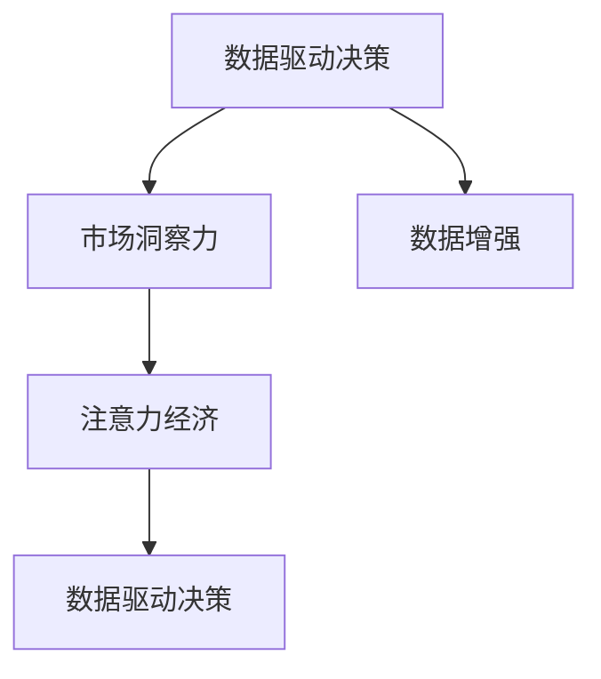
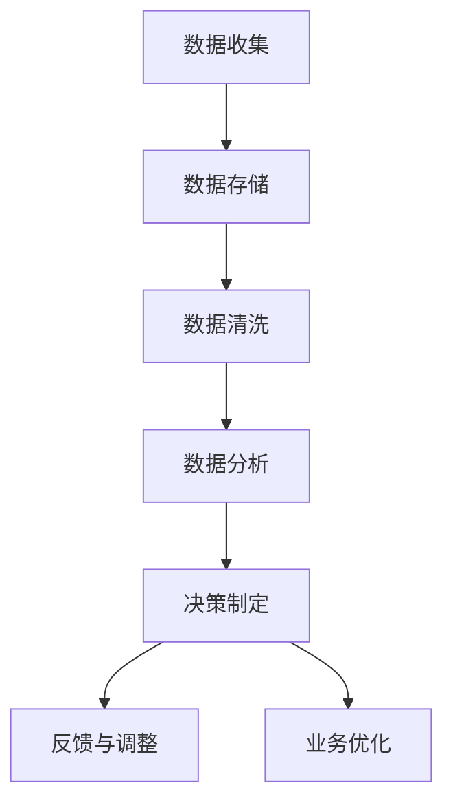

                 

# 注意力经济与数据驱动决策：利用数据增强业务和市场洞察力

在当今信息爆炸的时代，数据已逐渐成为经济活动中的核心资源。无论是企业决策、市场洞察，还是产品推荐，都依赖于对大量数据的挖掘和利用。本文将探讨注意力经济与数据驱动决策之间的关系，并利用数据增强业务和市场洞察力，揭示数据驱动决策在实践中的具体应用。

## 1. 背景介绍

### 1.1 数据驱动决策的兴起
数据驱动决策是指基于数据而不是直觉、经验或预设立场的决策过程。随着大数据技术的发展，企业能够从多个维度收集和分析数据，以发现趋势、预测未来并优化业务流程。例如，零售商可以利用销售数据预测未来趋势，根据需求变化调整库存；金融机构可以通过客户交易数据进行风险评估，优化投资组合；医疗行业可通过病历数据改进治疗方案，提升患者体验。

### 1.2 数据驱动决策的优势
1. **提升决策质量**：数据驱动决策可以避免因主观判断引起的偏差，提供更科学、客观的决策依据。
2. **实现业务优化**：数据可揭示业务流程中的瓶颈和问题，通过数据分析指导优化，提升业务效率。
3. **增强市场洞察力**：大数据分析可以帮助企业了解市场动态，把握竞争优势。
4. **个性化服务**：通过客户行为数据的分析，可以提供个性化的产品和服务，提升用户体验。

## 2. 核心概念与联系

### 2.1 核心概念概述

1. **注意力经济（Attention Economy）**：在信息泛滥的环境下，用户注意力成为稀缺资源。企业需要关注并分配资源以获取用户注意力，从而提升用户参与度和价值。

2. **数据增强（Data Augmentation）**：通过人工生成或规则化的方式增加数据样本，提升数据集的多样性和质量。

3. **数据驱动决策（Data-Driven Decision Making）**：基于数据进行决策的过程，旨在通过数据分析揭示业务规律，提升决策科学性和准确性。

4. **市场洞察力（Market Insight）**：通过对市场数据和用户行为数据的分析，揭示市场趋势和用户需求，为市场决策提供依据。

这些概念之间的关系可以通过以下Mermaid流程图来展示：



### 2.2 核心概念原理和架构的 Mermaid 流程图

在下面的Mermaid代码中，我们定义了数据驱动决策的架构，包括数据收集、数据处理、数据分析和决策输出四个关键环节。



## 3. 核心算法原理 & 具体操作步骤

### 3.1 算法原理概述

数据驱动决策的核心在于通过数据提取、分析、推理和反馈，实现对业务决策的科学支撑。在这一过程中，数据增强是提高决策质量的关键步骤。

数据增强指的是通过对原始数据进行扩充，增加数据多样性和数量，从而提升模型泛化能力和预测准确性。常见的数据增强方法包括：
- **随机裁剪与缩放**：通过对图像进行随机裁剪和缩放，增加图像多样性。
- **噪声添加**：在图像或音频信号中加入随机噪声，模拟真实环境。
- **颜色扰动与变形**：对图像进行颜色调整和变形处理，增强模型的鲁棒性。
- **文本扩充**：通过同义词替换、近义词生成等方式扩充文本数据。

### 3.2 算法步骤详解

数据增强的操作步骤可以归纳为以下几个步骤：

1. **数据收集**：收集多种数据源，包括历史交易记录、用户行为数据、市场趋势数据等。
2. **数据预处理**：对原始数据进行清洗和标准化，去除噪声和异常值。
3. **数据增强**：采用上述方法增加数据多样性，如对图像进行旋转、裁剪、翻转等操作，对文本进行同义词替换、近义词生成等。
4. **模型训练**：利用增强后的数据集进行模型训练，确保模型具有较好的泛化能力。
5. **模型评估**：通过在测试集上的表现评估模型效果，调整参数和增强策略。
6. **业务应用**：将训练好的模型应用到实际业务中，进行数据驱动决策。

### 3.3 算法优缺点

数据增强的优点在于：
1. **提升数据多样性**：通过扩充数据集，增强模型的泛化能力。
2. **缓解过拟合**：多样化的数据有助于避免模型对特定数据分布的过拟合。
3. **降低计算成本**：生成新数据相比获取新样本更便宜，成本更低。

然而，数据增强也存在以下缺点：
1. **数据质量控制**：数据增强可能导致数据质量下降，引入噪声和异常值。
2. **增强策略选择**：需要根据数据类型和任务特点选择合适的增强策略，可能需要一定的时间和实验成本。
3. **模型复杂度增加**：过度增强可能导致模型复杂度增加，影响训练速度和模型解释性。

### 3.4 算法应用领域

数据增强在多个领域中得到了广泛应用：

1. **计算机视觉**：增强图像数据的多样性，提升图像分类、目标检测等任务的性能。
2. **自然语言处理**：扩充文本数据，增强语言模型的泛化能力，提高文本分类、生成等任务的表现。
3. **声音处理**：通过加入噪声和合成数据，增强语音识别的鲁棒性。
4. **推荐系统**：利用用户行为数据的增强，提升个性化推荐的效果。
5. **金融分析**：增强交易数据和市场数据，提升风险评估和投资决策的准确性。
6. **医疗健康**：扩充病历数据和医疗影像数据，提升疾病诊断和治疗方案的优化。

## 4. 数学模型和公式 & 详细讲解 & 举例说明

### 4.1 数学模型构建

设原始数据集为 $D=\{(x_i,y_i)\}_{i=1}^N$，其中 $x_i$ 为输入特征，$y_i$ 为标签。数据增强后的数据集为 $D_{aug}=\{(x'_i,y'_i)\}_{i=1}^M$，其中 $x'_i$ 为增强后的输入特征，$y'_i$ 为增强后的标签。

目标是通过增强后的数据集训练模型 $f(x)$，使其能够更好地泛化到新的数据上。数据增强的目标函数可以定义为：

$$
\min_{x'} \mathcal{L}(f(x'),y')
$$

其中 $\mathcal{L}$ 为模型在数据集上的损失函数，$y'$ 为增强后标签。

### 4.2 公式推导过程

在数据增强中，常见的增强方法有随机裁剪、旋转、缩放、颜色扰动等。这里以图像增强为例，推导损失函数的定义：

假设原始图像为 $x$，经过随机旋转和裁剪后得到增强图像 $x'$，对应的标签仍为 $y$。增强后的损失函数可以定义为：

$$
\mathcal{L}(x',y) = \sum_{i=1}^N (f(x_i) - y_i)^2
$$

对于每个增强后的图像 $x'$，计算其对应的损失值。综合所有增强图像的损失，可以得到总损失函数：

$$
\mathcal{L}(x') = \frac{1}{N} \sum_{i=1}^N (f(x'_i) - y_i)^2
$$

### 4.3 案例分析与讲解

假设我们有一组用于识别人脸的图像数据，原始数据集包含 $10,000$ 张图像和对应的标签。为了提升模型的泛化能力，我们采用随机旋转和缩放的方法对图像进行增强，增加到 $50,000$ 张。

具体步骤如下：
1. 随机选择每张图像，以 $15^\circ$ 为步长旋转图像。
2. 对旋转后的图像进行缩放，范围在 $0.5$ 到 $2.0$ 之间。
3. 计算增强后的图像和原始图像的损失，并将其平均。
4. 在增强后的数据集上进行模型训练，提升模型的泛化能力。

## 5. 项目实践：代码实例和详细解释说明

### 5.1 开发环境搭建

为了进行数据增强实践，需要准备以下开发环境：

1. 安装Python和相关库，如TensorFlow、Keras、OpenCV等。
2. 收集并准备原始数据集，如图像、文本等。
3. 设置数据存储路径和模型保存路径。

### 5.2 源代码详细实现

以图像增强为例，以下是使用Keras实现数据增强的代码：

```python
from keras.preprocessing.image import ImageDataGenerator

# 设置数据增强参数
datagen = ImageDataGenerator(rotation_range=15, zoom_range=[0.5, 2.0])

# 加载原始数据集
train_generator = datagen.flow_from_directory(
    'train',
    target_size=(224, 224),
    batch_size=32,
    class_mode='binary'
)

# 模型训练
model.fit_generator(
    train_generator,
    steps_per_epoch=100,
    epochs=50,
    validation_data=validation_generator,
    validation_steps=50
)
```

### 5.3 代码解读与分析

上述代码中，`ImageDataGenerator` 类用于创建数据增强器，可以通过不同的参数控制增强方式。`flow_from_directory` 方法用于从目录中加载数据集，并进行随机裁剪、旋转、缩放等增强操作。`fit_generator` 方法用于训练模型，通过数据生成器生成增强后的数据进行训练。

### 5.4 运行结果展示

运行上述代码，可以观察到训练过程中模型在增强后的数据集上的表现，以及模型泛化能力的提升情况。

## 6. 实际应用场景

### 6.1 广告投放

广告投放是数据驱动决策的典型应用场景之一。广告主需要根据用户的行为数据和市场趋势，优化广告投放策略，提升广告效果。

通过数据增强，广告投放平台可以模拟不同场景和用户行为，评估不同广告策略的效果，从而优化广告投放方案。例如，通过增强用户点击数据和转化数据，优化广告内容和投放时间，提升转化率。

### 6.2 金融投资

金融投资决策依赖于大量的市场数据和用户行为数据。数据增强可以帮助投资者在复杂的市场环境中，更准确地预测趋势，制定投资策略。

例如，通过增强历史交易数据和市场新闻数据，投资者可以模拟不同市场条件下的投资策略，评估其风险和回报。通过增强用户交易数据，优化投资组合，提升投资收益。

### 6.3 零售销售

零售行业需要根据用户行为和市场趋势，优化商品库存和促销策略。数据增强可以帮助零售商更好地理解用户需求，优化库存管理和促销策略。

例如，通过增强用户购买数据和反馈数据，零售商可以模拟不同促销策略和库存水平的效果，从而优化商品管理。通过增强市场趋势数据，优化库存补货策略，提升销售效率。

## 7. 工具和资源推荐

### 7.1 学习资源推荐

1. **Kaggle**：Kaggle提供大量开源数据集和竞赛任务，可以用于学习和实践数据增强技术。
2. **TensorFlow** 和 **PyTorch** 官方文档：详细介绍了数据增强的实现方法，并提供了丰富的案例和示例代码。
3. **DataCamp**：提供数据增强和深度学习相关的在线课程，适合初学者学习。
4. **Coursera** 和 **Udacity** 课程：深入介绍数据增强和机器学习的原理和应用，适合进阶学习。

### 7.2 开发工具推荐

1. **TensorFlow**：谷歌开源的深度学习框架，提供丰富的数据增强库和工具。
2. **Keras**：基于TensorFlow的高级API，简化数据增强的实现过程。
3. **ImageNet**：包含大量图像数据集，适合图像增强实践。
4. **OpenCV**：开源计算机视觉库，提供图像处理和增强工具。

### 7.3 相关论文推荐

1. **《Image Augmentation for Deep Learning with Keras》**：介绍使用Keras进行图像增强的方法。
2. **《Deep Learning with Python》**：介绍深度学习在图像处理中的应用，包括数据增强和模型训练。
3. **《Data Augmentation in Natural Language Processing》**：介绍使用数据增强提升自然语言处理模型性能的方法。
4. **《Stochastic Depth for Generalization in Deep Neural Networks》**：介绍使用数据增强提升深度神经网络泛化能力的方法。

## 8. 总结：未来发展趋势与挑战

### 8.1 研究成果总结

本文详细介绍了注意力经济与数据驱动决策之间的关系，并探讨了数据增强在提升决策质量、增强市场洞察力等方面的重要性。通过数据增强，企业可以更科学、客观地进行决策，优化业务流程，提升市场竞争力。

### 8.2 未来发展趋势

数据增强技术在多个领域中已得到广泛应用，未来将呈现以下趋势：

1. **多模态数据增强**：除了图像和文本数据，声音、视频等多模态数据也将成为增强的重点，提升多模态数据融合的效果。
2. **自适应增强**：根据数据集的特点和任务的需求，自适应调整增强策略，提升增强效果。
3. **联邦增强**：在分布式环境中，利用联邦学习技术，实现数据增强，提升模型泛化能力。
4. **对抗增强**：通过生成对抗网络等方法，增加对抗样本，提升模型鲁棒性。
5. **无监督增强**：利用无监督学习方法，自动生成增强数据，减少人工干预。

### 8.3 面临的挑战

尽管数据增强在提升决策质量方面具有显著优势，但在实际应用中也面临以下挑战：

1. **数据隐私和安全**：增强过程中可能引入噪声和噪声样本，需要保护数据隐私和安全。
2. **计算资源消耗**：数据增强需要大量计算资源，尤其是在大规模数据集上，成本较高。
3. **数据质量和一致性**：增强策略可能导致数据质量下降，需要保持数据的一致性和完整性。
4. **模型复杂度增加**：过度增强可能导致模型复杂度增加，影响训练速度和模型解释性。

### 8.4 研究展望

未来的研究应着重解决上述挑战，探索新的数据增强方法，提升数据增强效果。同时，需要结合业务需求，灵活应用数据增强技术，提升决策质量和市场洞察力。

## 9. 附录：常见问题与解答

**Q1: 数据增强和数据扩充有何区别？**

A: 数据增强和数据扩充都是增加数据多样性的方法，但二者的目的和手段不同。数据扩充是指通过简单的数据变换增加数据量，如数据平移、旋转、缩放等，主要用于图像处理领域。数据增强则是通过更复杂的数据生成方法，如数据合成、对抗样本生成等，增加数据多样性和质量，适用于更多的应用场景。

**Q2: 数据增强是否会对数据分布产生影响？**

A: 数据增强可能对数据分布产生一定影响，尤其是对于图像和文本等数据。增强过程中，数据分布可能更加多样，但也可能引入噪声和异常值。因此，在数据增强过程中，需要根据任务特点和数据集特性，选择合适的增强策略，并进行数据质量控制。

**Q3: 数据增强是否会影响模型泛化能力？**

A: 数据增强的目的之一是通过增加数据多样性，提升模型的泛化能力。但过度增强可能导致模型复杂度增加，影响训练速度和模型解释性。因此，在数据增强过程中，需要根据数据集特点和任务需求，平衡增强策略和数据质量，避免引入过多噪声和异常值。

**Q4: 数据增强是否适用于所有领域？**

A: 数据增强虽然对提升模型泛化能力具有显著效果，但并不是所有领域都适用。对于某些领域，如医疗、金融等，数据增强可能会导致数据质量和隐私问题。因此，在数据增强过程中，需要根据领域特点和数据特性，选择合适的增强策略和数据处理方式，避免引入噪声和异常值。

总之，数据增强是提升数据驱动决策的重要手段，能够通过增加数据多样性和质量，提升模型泛化能力和决策质量。但在使用过程中，需要注意数据隐私、计算资源消耗、数据质量和一致性等问题，灵活应用数据增强技术，提升决策科学性和市场洞察力。

---

作者：禅与计算机程序设计艺术 / Zen and the Art of Computer Programming

