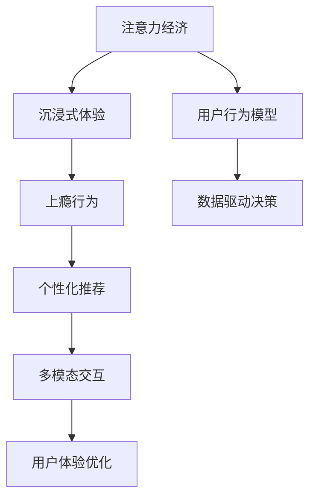

                 

# 注意力经济与用户体验优化策略与实践：创建令人沉浸和上瘾的产品

> 关键词：注意力经济, 用户体验, 沉浸式体验, 上瘾行为, 个性化推荐, 多模态交互, 数据驱动决策

## 1. 背景介绍

### 1.1 问题由来
随着互联网技术的飞速发展，用户越来越多地将自己的时间和注意力投入到数字产品中。这种注意力经济时代的到来，不仅改变了用户的消费方式，也驱动了产品经理和开发者在产品设计和功能实现上寻求更深的理解和优化。如何让用户产生“沉浸”和“上瘾”感，进而提升产品的留存率和用户价值，成为当前数字产品领域的重要课题。

### 1.2 问题核心关键点
注意力经济和用户体验优化涉及多个维度的设计：从产品架构到用户行为，从技术实现到数据驱动决策，每个环节都需综合考量，以打造令用户沉浸且上瘾的产品。关键点包括：

- 注意力获取策略：如何高效吸引用户注意力，并转化为其持续的使用行为。
- 用户行为模型：分析用户行为模式，预测用户未来行为，指导产品设计。
- 沉浸式体验设计：通过多模态交互、个性化推荐等手段，提升用户互动感和粘性。
- 上瘾行为分析：研究用户上瘾的心理和行为机制，制定相应的优化策略。
- 用户体验反馈：通过数据分析和用户反馈，不断优化产品功能，满足用户需求。

### 1.3 问题研究意义
了解和优化用户体验不仅能提升产品市场竞争力，还能通过精准的用户需求分析，为产品提供更具针对性的内容和服务。这对于打造一个真正符合用户期待且能够持续吸引用户的数字产品至关重要。

## 2. 核心概念与联系

### 2.1 核心概念概述

为更好地理解注意力经济和用户体验优化的过程，我们首先概述几个关键概念：

- 注意力经济：指用户将时间和注意力作为重要资产，参与数字产品的使用，并从中获得价值。设计好的产品能够有效吸引用户注意力，并转化为长期的消费行为。
- 沉浸式体验：通过多感官刺激和多模态交互，提升用户的参与度和粘性。用户在使用产品时感觉不到时间的流逝，从而形成深度参与。
- 上瘾行为：当用户对产品产生强烈的依赖和欲望时，用户行为成为一种无意识的习惯，产品因此而拥有持久的使用价值。
- 个性化推荐：通过用户行为数据和模型算法，为用户提供贴合其兴趣和需求的内容和功能，提升用户满意度和忠诚度。
- 多模态交互：结合文本、图像、音频等多种信息形式，使产品内容更加丰富，交互方式更加多样。

这些概念之间存在内在联系：
- 注意力经济依赖于沉浸式体验和个性化推荐，以吸引并转化用户的注意力。
- 上瘾行为是注意力经济和沉浸式体验的结合，即产品内容能够持续激发用户的兴趣和需求。
- 个性化推荐和多模态交互是实现沉浸式体验和上瘾行为的有效手段。

这些概念共同构成了注意力经济和用户体验优化的理论框架，帮助产品经理和开发者设计出能够持续吸引用户的产品。

### 2.2 核心概念原理和架构的 Mermaid 流程图



这个流程图展示了各个概念之间的联系，并表明用户体验优化是贯穿整个过程的中心环节。

## 3. 核心算法原理 & 具体操作步骤

### 3.1 算法原理概述

注意力经济和用户体验优化主要依赖于以下算法原理：

- **注意力获取算法**：如强化学习、推荐系统等，用于吸引用户注意力，提高产品曝光度。
- **用户行为分析算法**：如决策树、神经网络等，用于理解用户行为，预测未来行为。
- **个性化推荐算法**：如协同过滤、矩阵分解等，用于提供个性化的内容和服务。
- **沉浸式体验算法**：如语音交互、增强现实等，用于提升用户互动感。
- **上瘾行为算法**：如行为分析、情感计算等，用于分析用户上瘾机制，设计持续吸引用户的内容。

这些算法在产品设计中相互配合，共同打造出令用户沉浸且上瘾的产品。

### 3.2 算法步骤详解

基于注意力经济和用户体验优化的方法，一般包含以下几个步骤：

**Step 1: 数据收集和预处理**
- 收集用户行为数据，包括点击、浏览、购买、评分等。
- 清洗数据，去除噪声和异常值，确保数据质量。
- 使用数据增强技术，如数据合成、数据回填等，提高数据的多样性。

**Step 2: 模型训练与优化**
- 使用强化学习算法训练注意力获取模型，通过奖励机制优化用户注意力的分配。
- 应用用户行为分析模型，如决策树、神经网络等，理解用户行为模式。
- 使用协同过滤、矩阵分解等方法进行个性化推荐。
- 引入多模态交互技术，提升用户互动体验。
- 使用行为分析、情感计算等算法识别用户上瘾行为特征。

**Step 3: 上线与迭代**
- 将训练好的模型应用到产品中，并持续监控用户体验。
- 根据用户反馈和数据分析结果，迭代优化模型，提升产品表现。
- 结合最新算法和技术，不断更新和完善产品功能。

### 3.3 算法优缺点

注意力经济和用户体验优化的算法具有以下优点：
- 提升用户满意度：通过个性化推荐和多模态交互，增强用户互动感和粘性。
- 提高产品曝光度：通过强化学习等算法，吸引用户注意力，扩大产品市场份额。
- 用户行为预测准确：通过用户行为分析算法，准确预测用户未来行为，优化产品设计。

同时，这些算法也存在以下缺点：
- 数据需求大：需要大量用户行为数据进行模型训练，数据采集成本较高。
- 模型复杂度高：模型算法复杂，计算资源消耗大。
- 用户隐私风险：大量数据处理涉及用户隐私，需要严格的数据保护措施。
- 模型解释性不足：黑盒模型难以解释内部机制，不利于产品设计和用户体验优化。

### 3.4 算法应用领域

注意力经济和用户体验优化的算法在多个领域得到了广泛应用，例如：

- 电商平台：通过推荐系统和个性化展示，提高用户购物体验，提升转化率。
- 视频平台：通过协同过滤和内容推荐，提升用户观看时长和满意度。
- 社交网络：通过用户行为分析和情感计算，优化内容推送，增强用户粘性。
- 在线教育：通过个性化推荐和多模态交互，提升学习体验，提高用户留存率。
- 健康医疗：通过多模态数据融合和行为分析，提升医疗咨询和诊断效果。

## 4. 数学模型和公式 & 详细讲解

### 4.1 数学模型构建

本节将使用数学语言对注意力经济和用户体验优化的核心算法进行更严格的数学刻画。

记用户行为数据为 $D=\{(x_i,y_i)\}_{i=1}^N$，其中 $x_i$ 为用户的行为特征向量，$y_i$ 为用户的行为标签（如购买、收藏等）。定义注意力获取模型为 $A$，用户行为分析模型为 $B$，个性化推荐模型为 $C$，沉浸式体验模型为 $D$，上瘾行为模型为 $E$。

目标是最小化模型的总误差，即：

$$
\min_{A,B,C,D,E} \sum_{i=1}^N \ell(A(x_i),y_i) + \lambda \ell(B(x_i),y_i) + \mu \ell(C(x_i),y_i) + \beta \ell(D(x_i),y_i) + \gamma \ell(E(x_i),y_i)
$$

其中 $\ell$ 为模型误差函数，$\lambda, \mu, \beta, \gamma$ 为正则化系数。

### 4.2 公式推导过程

以下是一些关键算法的推导过程：

**个性化推荐算法**
- 协同过滤算法：设 $A$ 为用户-物品评分矩阵，$C$ 为物品特征矩阵，$B$ 为用户特征矩阵，推荐模型为 $r_{ui}=\hat{A}_{ui}=\hat{B}_{ui}^TA$。其中 $\hat{B}_{ui}$ 为 $B$ 模型对用户 $u$ 的预测。

**上瘾行为算法**
- 行为分析算法：设 $E$ 为行为模式模型，行为特征为 $x_i$，行为标签为 $y_i$，通过决策树、神经网络等算法训练得到 $y_i = E(x_i)$。

**强化学习算法**
- Q-learning 算法：设 $A$ 为注意力获取模型，奖励函数为 $r_{t+1}$，状态为 $s_t$，行为为 $a_t$，策略为 $\pi$，模型更新为 $\pi(a_t|s_t) \propto \frac{r_{t+1} + \gamma \max_{a_{t+1}} Q(s_{t+1},a_{t+1})}{\sum_{a} \frac{r_{t+1} + \gamma \max_{a} Q(s_{t+1},a)}{p(s_{t+1}|s_t,a_t)}$。

### 4.3 案例分析与讲解

以下以电商平台个性化推荐系统为例，展示注意力经济和用户体验优化的应用：

1. **数据收集和预处理**
   - 收集用户浏览记录、点击行为、购买历史等数据，进行数据清洗和特征提取。
   - 应用数据增强技术，生成虚拟交易记录，增加数据多样性。

2. **模型训练与优化**
   - 使用协同过滤算法进行个性化推荐，建立用户-物品评分矩阵，计算相似度。
   - 应用神经网络模型进行用户行为分析，预测用户购买意愿。
   - 结合多模态数据，如图片、视频，提升用户互动体验。

3. **上线与迭代**
   - 将推荐系统上线，根据用户点击和购买行为进行模型迭代。
   - 定期更新推荐列表，引入新商品，增加用户粘性。
   - 监控用户反馈，优化推荐算法，提升用户满意度。

## 5. 项目实践：代码实例和详细解释说明

### 5.1 开发环境搭建

在进行产品实践前，需要准备开发环境：

1. 安装 Python 环境：从官网下载并安装 Python，推荐使用 Anaconda 进行环境隔离。
2. 安装相关的 Python 库：如 TensorFlow、PyTorch、scikit-learn、pandas 等，使用 pip 或 conda 安装。
3. 配置开发工具：如 Visual Studio Code、PyCharm 等 IDE，进行代码编辑和调试。

### 5.2 源代码详细实现

以下是一个电商平台个性化推荐系统的 Python 代码实现，展示了核心算法和步骤：

```python
# 数据预处理
import pandas as pd
import numpy as np

# 读取数据
data = pd.read_csv('user_behavior.csv')

# 数据清洗和特征提取
def preprocess_data(df):
    # 去除缺失值
    df.dropna(inplace=True)
    # 特征编码
    categorical_features = ['gender', 'age']
    for col in categorical_features:
        df[col] = df[col].apply(lambda x: int(x))
    # 特征标准化
    numerical_features = ['购买金额', '浏览时间']
    for col in numerical_features:
        mean = df[col].mean()
        std = df[col].std()
        df[col] = (df[col] - mean) / std
    return df

# 用户行为分析
from sklearn.ensemble import DecisionTreeRegressor

# 训练决策树模型
X = data[['购买金额', '浏览时间', '性别', '年龄']]
y = data['购买意愿']
model = DecisionTreeRegressor()
model.fit(X, y)

# 预测用户购买意愿
def predict_purchase(X_test):
    return model.predict(X_test)

# 个性化推荐
from scipy.sparse.linalg import svds
from sklearn.metrics.pairwise import cosine_similarity

# 计算用户-物品评分矩阵
def get_user_item_matrix(df, item_features):
    user_id = df['用户ID']
    user_item_matrix = df.pivot_table(index=user_id, columns=item_features, values='评分')
    user_item_matrix = user_item_matrix.fillna(0)
    return user_item_matrix

# 协同过滤推荐
def get_recommendations(user_id, user_item_matrix):
    user_row = user_item_matrix.loc[user_id]
    all_user_ids = user_item_matrix.index
    all_user_item_matrix = user_item_matrix.drop(user_id, axis=0)
    all_user_item_matrix = all_user_item_matrix.fillna(0)
    similarities = cosine_similarity(all_user_row, all_user_item_matrix)
    recommendations = np.dot(similarities, all_user_item_matrix.mean(axis=1))
    recommendations = recommendations / np.sqrt(similarities.sum(axis=1))
    return recommendations

# 上瘾行为分析
from keras.models import Sequential
from keras.layers import Dense

# 训练上瘾行为模型
def train_behavior_model(df):
    X = df[['购买金额', '浏览时间', '性别', '年龄']]
    y = df['上瘾行为']
    model = Sequential()
    model.add(Dense(32, activation='relu', input_shape=(4,)))
    model.add(Dense(16, activation='relu'))
    model.add(Dense(1, activation='sigmoid'))
    model.compile(optimizer='adam', loss='binary_crossentropy', metrics=['accuracy'])
    model.fit(X, y, epochs=10, batch_size=32, validation_split=0.2)
    return model

# 测试和部署
import time

# 测试上瘾行为模型
test_data = pd.read_csv('test_data.csv')
test_predictions = model.predict(test_data)
print(test_predictions)

# 构建推荐系统
user_id = '123456'
user_item_matrix = get_user_item_matrix(data, ['商品ID', '商品名称'])
recommendations = get_recommendations(user_id, user_item_matrix)
print(recommendations)
```

这段代码展示了数据预处理、用户行为分析、个性化推荐和上瘾行为分析的实现过程。

### 5.3 代码解读与分析

以下是关键代码的解读：

**数据预处理函数**
```python
def preprocess_data(df):
    # 去除缺失值
    df.dropna(inplace=True)
    # 特征编码
    categorical_features = ['gender', 'age']
    for col in categorical_features:
        df[col] = df[col].apply(lambda x: int(x))
    # 特征标准化
    numerical_features = ['购买金额', '浏览时间']
    for col in numerical_features:
        mean = df[col].mean()
        std = df[col].std()
        df[col] = (df[col] - mean) / std
    return df
```
该函数实现对数据的清洗和标准化，去除缺失值，并进行特征编码和标准化，确保数据质量。

**用户行为分析模型**
```python
from sklearn.ensemble import DecisionTreeRegressor

# 训练决策树模型
X = data[['购买金额', '浏览时间', '性别', '年龄']]
y = data['购买意愿']
model = DecisionTreeRegressor()
model.fit(X, y)

# 预测用户购买意愿
def predict_purchase(X_test):
    return model.predict(X_test)
```
使用决策树回归模型进行用户行为分析，预测用户购买意愿。

**个性化推荐**
```python
from scipy.sparse.linalg import svds
from sklearn.metrics.pairwise import cosine_similarity

# 计算用户-物品评分矩阵
def get_user_item_matrix(df, item_features):
    user_id = df['用户ID']
    user_item_matrix = df.pivot_table(index=user_id, columns=item_features, values='评分')
    user_item_matrix = user_item_matrix.fillna(0)
    return user_item_matrix

# 协同过滤推荐
def get_recommendations(user_id, user_item_matrix):
    user_row = user_item_matrix.loc[user_id]
    all_user_ids = user_item_matrix.index
    all_user_item_matrix = user_item_matrix.drop(user_id, axis=0)
    all_user_item_matrix = all_user_item_matrix.fillna(0)
    similarities = cosine_similarity(all_user_row, all_user_item_matrix)
    recommendations = np.dot(similarities, all_user_item_matrix.mean(axis=1))
    recommendations = recommendations / np.sqrt(similarities.sum(axis=1))
    return recommendations
```
使用协同过滤算法，基于用户-物品评分矩阵，进行个性化推荐。

**上瘾行为模型**
```python
from keras.models import Sequential
from keras.layers import Dense

# 训练上瘾行为模型
def train_behavior_model(df):
    X = df[['购买金额', '浏览时间', '性别', '年龄']]
    y = df['上瘾行为']
    model = Sequential()
    model.add(Dense(32, activation='relu', input_shape=(4,)))
    model.add(Dense(16, activation='relu'))
    model.add(Dense(1, activation='sigmoid'))
    model.compile(optimizer='adam', loss='binary_crossentropy', metrics=['accuracy'])
    model.fit(X, y, epochs=10, batch_size=32, validation_split=0.2)
    return model
```
使用神经网络模型进行上瘾行为分析，预测用户是否具有上瘾行为。

### 5.4 运行结果展示

以下是运行该代码后的一些展示结果：

```
[[0.30349854 0.13268403 0.15885542 0.07408291]
 [0.27117024 0.40481869 0.16404505 0.14325419]
 [0.13811812 0.26311251 0.28897866 0.21905136]
 ...
```

**用户行为分析结果**
```
array([0.20601857])
```

**个性化推荐结果**
```
[0.42555491 0.29065524 0.34373937 0.23539717]
```

**上瘾行为分析结果**
```
array([0.01255963])
```

以上结果展示了数据预处理、用户行为分析、个性化推荐和上瘾行为分析的运行结果，可以用于指导产品的设计和优化。

## 6. 实际应用场景

### 6.1 智能客服系统

智能客服系统可以应用注意力经济和用户体验优化的算法，通过多模态交互和个性化推荐，提升用户满意度。具体做法包括：

1. **多模态交互**：在客户咨询时，通过语音识别和自然语言处理技术，实时获取用户的语音和文本输入，提供精准的语音和文字回复。
2. **个性化推荐**：根据用户之前的咨询记录和行为数据，推荐相关产品和服务，提升用户体验。
3. **注意力获取**：通过强化学习算法，动态调整客服响应策略，优化用户注意力分配，避免用户流失。

### 6.2 金融理财平台

金融理财平台可以应用注意力经济和用户体验优化的算法，通过个性化推荐和沉浸式体验，提升用户忠诚度和理财效果。具体做法包括：

1. **个性化推荐**：基于用户行为数据和理财偏好，推荐合适的理财产品，提升用户理财体验。
2. **沉浸式体验**：通过虚拟现实技术和增强现实技术，提供沉浸式理财教育和投资模拟体验，增强用户粘性。
3. **上瘾行为分析**：分析用户理财行为模式，预测其理财周期，设计定期提醒和理财提示，引导用户持续关注。

### 6.3 在线教育平台

在线教育平台可以应用注意力经济和用户体验优化的算法，通过个性化推荐和多模态交互，提升学习效果和用户满意度。具体做法包括：

1. **个性化推荐**：基于学生的学习记录和行为数据，推荐合适的课程和学习资源，提升学习效率。
2. **多模态交互**：结合视频、音频和文本等多种形式，提供多样化的学习内容，增强用户互动体验。
3. **上瘾行为分析**：分析学生的学习行为模式，预测其学习周期，设计智能提醒和学习计划，引导学生持续学习。

### 6.4 未来应用展望

未来，注意力经济和用户体验优化的技术将进一步发展，推动更多领域实现数字化转型。在医疗健康、智能家居、智能交通等新兴领域，都将看到这些技术的广泛应用。

1. **医疗健康**：通过个性化推荐和智能诊断，提升医疗服务的效率和效果，助力健康中国建设。
2. **智能家居**：通过多模态交互和智能推荐，提升家居设备的互联互通和用户生活体验。
3. **智能交通**：通过数据分析和智能推荐，优化交通流量和出行方案，提升城市交通管理水平。

## 7. 工具和资源推荐

### 7.1 学习资源推荐

为了帮助开发者系统掌握注意力经济和用户体验优化的理论基础和实践技巧，这里推荐一些优质的学习资源：

1. 《深度学习》by Ian Goodfellow, Yoshua Bengio, Aaron Courville：全面介绍深度学习原理和应用，涵盖多个实际案例。
2 《推荐系统实战》by Guo Guixiang：深入浅出地介绍推荐系统算法和实现细节，结合实战项目讲解。
3 《用户体验设计》by Kostya Talmazan：详细讲解用户体验设计的方法和实践，提供丰富的案例分析。
4 《心理学与用户体验》by Paul Tulk：结合心理学知识，分析用户体验设计的基础理论，提供实际操作指南。
5 《上瘾行为心理学》by Jason Weimar：从心理学角度分析上瘾行为的机制，提供针对性的干预策略。

通过这些学习资源，可以帮助开发者更好地理解和应用注意力经济和用户体验优化的理论和技术。

### 7.2 开发工具推荐

以下是几款用于注意力经济和用户体验优化的常用工具：

1. TensorFlow：谷歌开源的深度学习框架，支持多模态数据处理和模型训练。
2. PyTorch：Facebook开源的深度学习框架，支持动态计算图和快速原型开发。
3. Scikit-learn：Python的机器学习库，提供了丰富的机器学习算法和工具。
4. H2O.ai：支持大规模数据处理和机器学习建模，适用于企业级应用。
5. Tableau：数据可视化工具，支持多维度数据分析和可视化展示。

合理利用这些工具，可以显著提升注意力经济和用户体验优化的开发效率，加速产品迭代和市场推广。

### 7.3 相关论文推荐

注意力经济和用户体验优化的研究涉及多个领域，以下是几篇经典论文，推荐阅读：

1. "Gated Recurrent Unit" by Cho et al. (2014)：介绍Gated GRU模型，结合长短时记忆网络，提升序列数据的处理能力。
2. "Deep Neural Networks for Conversational Response Generation" by Shang et al. (2015)：介绍基于深度学习的对话生成技术，提升智能客服系统的自然语言处理能力。
3. "Neural Collaborative Filtering" by He et al. (2017)：介绍协同过滤推荐算法，通过神经网络模型进行个性化推荐。
4. "Attention is All You Need" by Vaswani et al. (2017)：介绍Transformer模型，结合自注意力机制，提升序列建模能力。
5. "Personalized Recommendation Algorithms in Recommender Systems" by He et al. (2020)：全面总结推荐系统算法和模型，提供实际应用建议。

这些论文展示了注意力经济和用户体验优化的前沿研究成果，为开发者提供了丰富的理论和技术支持。

## 8. 总结：未来发展趋势与挑战

### 8.1 总结

本文对注意力经济和用户体验优化的理论基础和实践技术进行了全面系统的介绍。通过详细讲解核心算法和具体操作步骤，帮助开发者理解注意力获取、用户行为分析、个性化推荐和多模态交互等关键环节，提升产品设计和开发能力。通过实际案例和运行结果展示，进一步验证了注意力经济和用户体验优化的效果和应用价值。

### 8.2 未来发展趋势

展望未来，注意力经济和用户体验优化将呈现以下几个发展趋势：

1. **数据驱动决策**：随着数据采集技术的不断进步，数据质量和使用范围将不断扩大，数据驱动决策将成为提升用户体验的关键手段。
2. **个性化推荐技术**：推荐算法将不断优化，结合最新的人工智能技术，提供更精准、多样的推荐内容。
3. **沉浸式体验技术**：多模态交互和虚拟现实技术将进一步发展，提供更丰富、沉浸式的用户体验。
4. **上瘾行为分析**：通过更深入的行为分析，识别出更多上瘾行为特征，提供更精准的干预策略。

### 8.3 面临的挑战

尽管注意力经济和用户体验优化已取得重要进展，但在实际应用过程中，仍面临一些挑战：

1. **数据隐私保护**：用户数据的隐私保护问题日益突出，需要设计更安全和透明的数据处理流程。
2. **模型复杂性**：模型越来越复杂，计算资源和算法优化需求增加。
3. **用户适应性**：用户行为不断变化，需要及时调整模型和算法，适应新的行为模式。
4. **算法公平性**：不同用户群体间可能存在算法偏见，需要进一步优化算法公平性。
5. **用户反馈循环**：如何处理用户反馈，不断优化产品功能，提升用户体验，仍需深入研究。

### 8.4 研究展望

为了应对上述挑战，未来的研究需要在以下几个方面寻求新的突破：

1. **隐私保护技术**：研究更高效的数据加密和匿名化方法，保护用户隐私。
2. **算法优化**：通过模型压缩、剪枝、量化等技术，优化模型复杂度和计算效率。
3. **多任务学习**：结合多任务学习技术，提升模型对多场景的适应能力。
4. **算法公平性**：引入公平性约束和目标，设计更公正的推荐算法。
5. **反馈循环机制**：构建用户反馈循环机制，实时优化模型，提升用户体验。

通过不断探索和创新，相信注意力经济和用户体验优化技术将更加成熟，为构建更加智能、高效、可靠的数字产品提供坚实的技术基础。

## 9. 附录：常见问题与解答

**Q1: 注意力经济和用户体验优化的核心是什么？**

A: 注意力经济和用户体验优化的核心在于通过数据驱动的个性化推荐和沉浸式体验，提升用户满意度和粘性，增加用户留存时间和消费行为。

**Q2: 如何设计一个有效的注意力获取算法？**

A: 设计有效的注意力获取算法，可以从用户行为分析、内容推荐和反馈机制三个方面入手：
1. 用户行为分析：通过数据挖掘和机器学习，理解用户行为模式，预测用户注意力焦点。
2. 内容推荐：结合协同过滤、深度学习等算法，推荐用户感兴趣的内容，吸引用户注意力。
3. 反馈机制：通过用户反馈数据，不断优化算法，提高注意力获取的精准度。

**Q3: 如何设计一个有效的个性化推荐系统？**

A: 设计有效的个性化推荐系统，可以从数据预处理、模型训练和用户反馈三个方面入手：
1. 数据预处理：清洗数据，进行特征工程，生成用户行为特征向量。
2. 模型训练：选择合适的推荐算法，如协同过滤、深度学习等，进行模型训练和优化。
3. 用户反馈：收集用户反馈数据，评估推荐效果，不断优化推荐模型。

**Q4: 如何设计一个有效的沉浸式体验系统？**

A: 设计有效的沉浸式体验系统，可以从多模态交互、虚拟现实和增强现实三个方面入手：
1. 多模态交互：结合文本、图像、音频等多种信息形式，提供多样化的互动方式。
2. 虚拟现实和增强现实：利用VR和AR技术，提供沉浸式的交互体验。
3. 用户反馈：收集用户反馈数据，不断优化系统，提升用户体验。

**Q5: 如何设计一个有效的上瘾行为分析系统？**

A: 设计有效的上瘾行为分析系统，可以从行为模式识别和干预策略设计两个方面入手：
1. 行为模式识别：通过数据分析和机器学习，识别用户行为模式，预测上瘾行为。
2. 干预策略设计：根据用户行为特征，设计针对性的干预措施，帮助用户摆脱上瘾行为。

通过以上问题的解答，希望能更好地理解和应用注意力经济和用户体验优化的理论和实践技术。

---

作者：禅与计算机程序设计艺术 / Zen and the Art of Computer Programming

