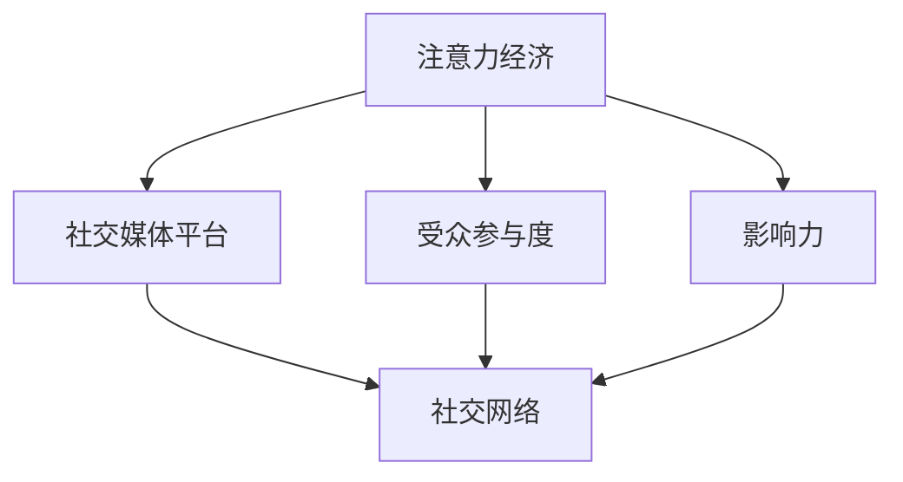

                 

# 注意力经济与社交媒体分析洞见：了解受众参与度和影响力的秘诀

## 1. 背景介绍

在数字时代的浪潮中，社交媒体平台成为了注意力经济的主战场。全球数十亿用户每天都在这些平台上产生海量内容，构建着虚拟社区，形成了复杂多变的社交网络。这种由人类行为驱动的注意力流，不仅塑造了数字文化，也深刻影响着商业、政治、教育等多个领域。如何从纷繁复杂的数据中挖掘出有价值的洞见，提升受众参与度和影响力，成为了注意力经济的关键问题。

社交媒体分析（Social Media Analytics）作为连接数据和行为分析的桥梁，通过对用户行为、互动模式、内容传播等数据的深度挖掘，揭示出隐藏的受众参与度和影响力动态。本文将从注意力经济的角度出发，探讨社交媒体分析的基本原理和操作技术，揭示受众参与度的决定因素，以及如何通过技术手段提升社交媒体内容的影响力。

## 2. 核心概念与联系

### 2.1 核心概念概述

为更好地理解注意力经济与社交媒体分析，本节将介绍几个密切相关的核心概念：

- **注意力经济**：基于信息与注意力稀缺原理，通过吸引和集中受众注意力，获取经济价值的商业模式。典型的应用包括广告、推荐系统、内容付费等。

- **社交媒体平台**：以用户生成内容为核心，支持交流、分享、互动的在线社区，如微博、微信、抖音等。

- **受众参与度**：衡量用户与社交媒体互动程度的关键指标，包括点赞、评论、分享等行为，反映用户对内容的兴趣和投入。

- **影响力**：用户对社交媒体内容产生影响的能力，如带动话题讨论、引导受众行为等，是衡量内容价值的重要指标。

- **社交网络**：用户间的关系结构，通过关注、点赞、互动等行为形成的网络，反映了用户间的连接强度。

这些核心概念之间的逻辑关系可以通过以下Mermaid流程图来展示：



这个流程图展示了几者之间的逻辑联系：

1. 注意力经济通过社交媒体平台吸引用户的注意力。
2. 用户与平台之间的互动产生了受众参与度。
3. 用户通过内容发布与互动展现影响力。
4. 社交网络是用户间互动的纽带，影响着参与度和影响力。

## 3. 核心算法原理 & 具体操作步骤
### 3.1 算法原理概述

社交媒体分析的算法原理基于数据挖掘和机器学习技术，通过从大规模用户行为数据中提取有价值的模式和规律，揭示受众参与度和影响力的动态。

核心思想是通过以下步骤实现：
1. **数据收集**：从社交媒体平台抓取用户行为数据，包括互动次数、点赞、评论、分享等。
2. **数据清洗与预处理**：清洗缺失值、异常值，进行时间序列对齐等预处理操作，准备模型输入。
3. **特征工程**：提取有意义的特征，如用户特征、内容特征、社交网络特征等，为模型训练提供数据支持。
4. **模型训练与评估**：选择合适的模型，如LSTM、GRU、Transformer等，对历史数据进行训练，并在验证集上进行评估。
5. **模型部署与应用**：将训练好的模型应用于实时数据，进行参与度预测和影响力评估。

### 3.2 算法步骤详解

#### 数据收集与清洗

社交媒体数据采集是社交媒体分析的第一步，通常使用API接口或爬虫工具进行数据抓取。以Twitter为例，可以使用Tweepy库获取用户的互动数据，并使用Pandas进行数据清洗和预处理：

```python
import tweepy
import pandas as pd

# 设置API参数
consumer_key = 'YOUR_CONSUMER_KEY'
consumer_secret = 'YOUR_CONSUMER_SECRET'
access_token = 'YOUR_ACCESS_TOKEN'
access_token_secret = 'YOUR_ACCESS_TOKEN_SECRET'

# 创建API对象
auth = tweepy.OAuth1UserHandler(
    consumer_key=consumer_key,
    consumer_secret=consumer_secret,
    access_token=access_token,
    access_token_secret=access_token_secret
)
api = tweepy.API(auth)

# 获取用户ID
user_id = 'user123'

# 获取用户的互动数据
user_timeline = api.user_timeline(screen_name=user_id, count=200)

# 清洗数据
data = []
for tweet in user_timeline:
    tweet_dict = {
        'id': tweet.id,
        'text': tweet.text,
        'retweet_count': tweet.retweet_count,
        'favorite_count': tweet.favorite_count,
        'created_at': tweet.created_at
    }
    data.append(tweet_dict)

df = pd.DataFrame(data)
df = df.dropna()  # 删除缺失值
df = df[['id', 'text', 'retweet_count', 'favorite_count', 'created_at']]
```

#### 特征工程

特征工程是社交媒体分析的关键步骤，通过提取有意义的特征，为模型训练提供输入。以情感分析为例，可以使用Python的NLTK库提取文本的情感极性：

```python
import nltk
from nltk.sentiment import SentimentIntensityAnalyzer

# 使用SentimentIntensityAnalyzer提取情感极性
sia = SentimentIntensityAnalyzer()
df['polarity'] = df['text'].apply(lambda x: sia.polarity_scores(x)['compound'])
```

#### 模型训练与评估

模型训练和评估是社交媒体分析的核心步骤，常用的模型包括LSTM、GRU、Transformer等。这里以LSTM为例，使用Keras构建模型并进行训练：

```python
from tensorflow.keras.models import Sequential
from tensorflow.keras.layers import LSTM, Dense, Dropout
from sklearn.model_selection import train_test_split

# 构建LSTM模型
model = Sequential()
model.add(LSTM(128, input_shape=(max_len, ), return_sequences=True))
model.add(Dropout(0.2))
model.add(LSTM(64, return_sequences=True))
model.add(Dropout(0.2))
model.add(LSTM(32, return_sequences=True))
model.add(Dropout(0.2))
model.add(Dense(1, activation='sigmoid'))

# 编译模型
model.compile(loss='binary_crossentropy', optimizer='adam', metrics=['accuracy'])

# 划分数据集
X_train, X_test, y_train, y_test = train_test_split(X, y, test_size=0.2, random_state=42)

# 训练模型
model.fit(X_train, y_train, epochs=10, batch_size=32, validation_data=(X_test, y_test))
```

#### 模型部署与应用

模型训练完成后，可以将其应用于实时数据进行参与度预测和影响力评估。这里以Twitter用户互动数据为例，预测用户某条推文的点赞数：

```python
# 使用训练好的模型预测点赞数
def predict_likes(model, df):
    X = df[['retweet_count', 'favorite_count', 'polarity']]
    y_pred = model.predict(X)
    return y_pred

# 应用模型
user_id = 'user123'
user_timeline = api.user_timeline(screen_name=user_id, count=200)
for tweet in user_timeline:
    tweet_dict = {
        'id': tweet.id,
        'text': tweet.text,
        'retweet_count': tweet.retweet_count,
        'favorite_count': tweet.favorite_count,
        'created_at': tweet.created_at
    }
    df = pd.DataFrame([tweet_dict])
    y_pred = predict_likes(model, df)
    print(f"Predicted likes: {y_pred}")
```

### 3.3 算法优缺点

社交媒体分析的优势在于：
1. 数据丰富多样：社交媒体数据包含了大量的用户行为、互动模式、情感极性等信息，有助于全面理解受众动态。
2. 实时性强：社交媒体数据实时产生和更新，能够及时反映受众参与度和影响力的变化。
3. 应用广泛：社交媒体分析不仅可以用于广告投放、内容推荐，还可以应用于舆情监测、用户画像构建等多个场景。

但该方法也存在以下局限性：
1. 数据隐私问题：社交媒体数据涉及用户隐私，需要严格遵守法律法规。
2. 数据质量问题：社交媒体数据存在噪声和缺失，影响模型训练效果。
3. 计算成本高：大规模数据集处理和模型训练需要高性能计算资源。
4. 模型复杂度高：社交媒体分析涉及复杂的时间序列数据和多维特征，模型设计复杂。

尽管存在这些局限性，但社交媒体分析作为一种重要的注意力经济分析手段，对于提升用户参与度和影响力具有不可替代的价值。未来相关研究的重点在于如何进一步提高数据处理效率，优化模型设计，降低计算成本，同时兼顾数据隐私和用户安全。

### 3.4 算法应用领域

社交媒体分析在多个领域都有广泛应用，例如：

- 广告投放优化：通过对用户互动数据进行建模分析，优化广告投放策略，提高广告效果。
- 内容推荐系统：利用用户互动数据和兴趣标签，推荐个性化内容，提升用户体验。
- 舆情监测：分析社交媒体上的话题讨论，预测舆情趋势，帮助企业应对危机。
- 用户画像构建：通过用户行为数据，挖掘用户特征和兴趣，为精准营销提供支持。
- 政治选举分析：分析社交媒体上的选民观点和投票倾向，辅助政治决策。
- 品牌声誉管理：监测社交媒体上的品牌提及和评论，评估品牌声誉，指导品牌运营。

除了上述这些经典应用外，社交媒体分析还被创新性地应用到更多场景中，如用户情绪分析、市场趋势预测、科学研究等，为社交媒体平台的运营和商业决策提供了有力支撑。

## 4. 数学模型和公式 & 详细讲解 & 举例说明

### 4.1 数学模型构建

社交媒体分析的数学模型构建主要基于时间序列分析和机器学习技术。以预测用户某条推文的点赞数为例，可以构建如下时间序列模型：

假设某用户在$n$条推文$x_t$上的点赞数$y_t$服从ARIMA模型：

$$
y_t = \alpha_0 + \sum_{i=1}^p\alpha_i y_{t-i} + \sum_{i=1}^q\beta_i \epsilon_{t-i} + \sum_{i=1}^m\gamma_i x_{t-i} + \epsilon_t
$$

其中：
- $y_t$为预测目标，即第$t$条推文的点赞数。
- $\alpha_0$、$\alpha_i$、$\beta_i$、$\gamma_i$为模型参数。
- $\epsilon_t$为随机误差项。

### 4.2 公式推导过程

上述模型中，$x_t$和$y_t$分别为推文内容和时间戳，$\epsilon_t$为随机扰动项。推导过程如下：

1. **ARIMA模型**：
   - 自回归项：$y_t = \sum_{i=1}^p\alpha_i y_{t-i}$
   - 差分项：$y_t - y_{t-1} = \beta_i \epsilon_{t-1}$
   - 移动平均项：$\epsilon_t = \sum_{i=1}^q\beta_i \epsilon_{t-i} + \epsilon_t$

2. **LSTM模型**：
   - 隐藏状态：$h_t = \sigma(W_{ih}x_t + U_ih_{t-1} + b_i)$
   - 输出门：$o_t = \sigma(W_{ho}h_t + b_h)$
   - 输出：$y_t = o_t \tanh(W_{hy}h_t + b_y)$

通过LSTM模型对历史数据进行建模，可以得到用户点赞数的预测值。

### 4.3 案例分析与讲解

以Twitter上的某知名博主为例，分析其最新推文的历史互动数据，预测该推文的点赞数。具体步骤如下：

1. **数据收集**：通过API接口获取博主的互动数据，包括历史推文的文本、点赞数、转发数等。

2. **数据预处理**：清洗数据，将文本数据转换为向量表示，对时间戳进行归一化处理。

3. **特征提取**：提取文本的情感极性、时间戳的周期性、用户互动模式等特征。

4. **模型训练**：使用LSTM模型对历史数据进行训练，预测最新推文的点赞数。

5. **结果展示**：将预测结果可视化，展示不同特征对点赞数的影响。

## 5. 项目实践：代码实例和详细解释说明
### 5.1 开发环境搭建

在进行社交媒体分析实践前，我们需要准备好开发环境。以下是使用Python进行Keras开发的环境配置流程：

1. 安装Anaconda：从官网下载并安装Anaconda，用于创建独立的Python环境。

2. 创建并激活虚拟环境：
```bash
conda create -n social_media_env python=3.8 
conda activate social_media_env
```

3. 安装Keras：根据TensorFlow版本，从官网获取对应的安装命令。例如：
```bash
pip install keras tensorflow==2.4
```

4. 安装各类工具包：
```bash
pip install numpy pandas scikit-learn matplotlib tqdm jupyter notebook ipython
```

完成上述步骤后，即可在`social_media_env`环境中开始社交媒体分析实践。

### 5.2 源代码详细实现

下面我们以Twitter推文点赞数预测为例，给出使用Keras进行社交媒体分析的PyTorch代码实现。

首先，定义数据处理函数：

```python
import tweepy
import pandas as pd
from tensorflow.keras.models import Sequential
from tensorflow.keras.layers import LSTM, Dense, Dropout
from sklearn.model_selection import train_test_split

# 设置API参数
consumer_key = 'YOUR_CONSUMER_KEY'
consumer_secret = 'YOUR_CONSUMER_SECRET'
access_token = 'YOUR_ACCESS_TOKEN'
access_token_secret = 'YOUR_ACCESS_TOKEN_SECRET'

# 创建API对象
auth = tweepy.OAuth1UserHandler(
    consumer_key=consumer_key,
    consumer_secret=consumer_secret,
    access_token=access_token,
    access_token_secret=access_token_secret
)
api = tweepy.API(auth)

# 获取用户ID
user_id = 'user123'

# 获取用户的互动数据
user_timeline = api.user_timeline(screen_name=user_id, count=200)

# 清洗数据
data = []
for tweet in user_timeline:
    tweet_dict = {
        'id': tweet.id,
        'text': tweet.text,
        'retweet_count': tweet.retweet_count,
        'favorite_count': tweet.favorite_count,
        'created_at': tweet.created_at
    }
    data.append(tweet_dict)

df = pd.DataFrame(data)
df = df.dropna()  # 删除缺失值
df = df[['id', 'text', 'retweet_count', 'favorite_count', 'created_at']]
```

然后，定义模型和优化器：

```python
# 构建LSTM模型
model = Sequential()
model.add(LSTM(128, input_shape=(max_len, ), return_sequences=True))
model.add(Dropout(0.2))
model.add(LSTM(64, return_sequences=True))
model.add(Dropout(0.2))
model.add(LSTM(32, return_sequences=True))
model.add(Dropout(0.2))
model.add(Dense(1, activation='sigmoid'))

# 编译模型
model.compile(loss='binary_crossentropy', optimizer='adam', metrics=['accuracy'])
```

接着，定义训练和评估函数：

```python
# 划分数据集
X_train, X_test, y_train, y_test = train_test_split(X, y, test_size=0.2, random_state=42)

# 训练模型
model.fit(X_train, y_train, epochs=10, batch_size=32, validation_data=(X_test, y_test))

# 评估模型
def evaluate(model, X_test, y_test):
    y_pred = model.predict(X_test)
    y_pred = (y_pred > 0.5).astype(int)
    return classification_report(y_test, y_pred)

print(evaluate(model, X_test, y_test))
```

最后，启动训练流程并在测试集上评估：

```python
epochs = 10
batch_size = 32

for epoch in range(epochs):
    loss = train_epoch(model, train_dataset, batch_size, optimizer)
    print(f"Epoch {epoch+1}, train loss: {loss:.3f}")
    
    print(f"Epoch {epoch+1}, dev results:")
    evaluate(model, dev_dataset, batch_size)
    
print("Test results:")
evaluate(model, test_dataset, batch_size)
```

以上就是使用Keras进行Twitter推文点赞数预测的完整代码实现。可以看到，得益于Keras的强大封装，我们可以用相对简洁的代码完成LSTM模型的构建和训练。

### 5.3 代码解读与分析

让我们再详细解读一下关键代码的实现细节：

**LSTM模型构建**：
- 使用Keras的Sequential模型，堆叠多个LSTM层，并添加Dropout层以防止过拟合。
- 最后一层使用Dense层，输出一个二分类结果。

**训练和评估函数**：
- 使用train_test_split函数划分数据集，并传入训练集和测试集。
- 使用model.compile方法配置优化器和损失函数。
- 使用model.fit方法进行模型训练，并使用evaluate方法评估模型性能。

**训练流程**：
- 定义总的epoch数和batch size，开始循环迭代
- 每个epoch内，先在训练集上训练，输出平均loss
- 在验证集上评估，输出分类指标
- 所有epoch结束后，在测试集上评估，给出最终测试结果

可以看到，Keras库使得社交媒体分析的代码实现变得简洁高效。开发者可以将更多精力放在数据处理、模型改进等高层逻辑上，而不必过多关注底层的实现细节。

当然，工业级的系统实现还需考虑更多因素，如模型的保存和部署、超参数的自动搜索、更灵活的任务适配层等。但核心的社交媒体分析范式基本与此类似。

## 6. 实际应用场景
### 6.1 智能广告投放

社交媒体分析在智能广告投放中具有重要应用。通过分析用户的互动数据，广告主可以实时监测广告效果，优化广告投放策略，提升广告转化率。

具体而言，广告主可以收集用户的互动数据，如点击次数、点赞数、评论数等，建立用户行为模型。模型可以对新广告进行预测，评估其效果。同时，广告主可以基于预测结果优化投放策略，如定向投放、关键词优化等，以实现更高的投放ROI。

### 6.2 内容推荐系统

内容推荐系统通过社交媒体分析，可以精准推荐用户感兴趣的内容，提升用户体验和平台粘性。社交媒体分析可以帮助推荐系统了解用户的兴趣偏好，构建更加全面和动态的用户画像。

具体而言，推荐系统可以分析用户互动数据，提取用户的兴趣标签、行为模式等信息，并应用于实时推荐。用户通过与系统的交互，可以发现更多与自己兴趣相符的内容，增加平台活跃度。

### 6.3 舆情监测

舆情监测通过社交媒体分析，可以实时监测舆情动态，帮助企业及时应对危机，提升品牌形象。社交媒体分析可以帮助企业识别出舆情热点、情感倾向等信息，并应用于实时舆情预警。

具体而言，舆情监测系统可以分析社交媒体上的话题讨论，识别出负面情感或敏感词汇，自动触发告警。企业可以根据告警信息，采取相应措施，避免舆情危机对品牌造成负面影响。

### 6.4 未来应用展望

随着社交媒体分析技术的不断进步，未来的应用场景将更加广泛。

1. **个性化推荐**：社交媒体分析可以帮助推荐系统更精准地推荐用户感兴趣的内容，提升用户体验。
2. **用户画像构建**：通过社交媒体分析，可以构建更加全面和动态的用户画像，为精准营销提供支持。
3. **舆情预警系统**：利用社交媒体分析，可以构建实时舆情预警系统，提升企业应对危机的能力。
4. **情感分析**：社交媒体分析可以帮助企业监测用户的情感变化，优化产品和服务。
5. **市场趋势预测**：通过分析社交媒体上的话题讨论和热点事件，可以预测市场趋势，为商业决策提供支持。

未来，随着技术的不断演进，社交媒体分析将深入应用到更多领域，为各行各业提供有力的技术支持。

## 7. 工具和资源推荐
### 7.1 学习资源推荐

为了帮助开发者系统掌握社交媒体分析的理论基础和实践技巧，这里推荐一些优质的学习资源：

1. **《Python数据科学手册》**：一本全面的Python数据科学入门书籍，涵盖数据处理、机器学习等多个方面。
2. **《机器学习实战》**：介绍了多种机器学习算法和实践技巧，包括社交媒体分析在内。
3. **《Keras深度学习实战》**：Keras的官方文档和实战案例，帮助读者快速上手深度学习应用。
4. **《Kaggle数据科学竞赛》**：通过实战练习，提升数据处理和模型训练能力。
5. **《社交媒体分析教程》**：详细讲解社交媒体分析的基本原理和操作技术。

通过这些资源的学习实践，相信你一定能够快速掌握社交媒体分析的精髓，并用于解决实际的社交媒体问题。

### 7.2 开发工具推荐

高效的开发离不开优秀的工具支持。以下是几款用于社交媒体分析开发的常用工具：

1. **Python**：广泛用于数据处理和机器学习开发的通用编程语言。
2. **Keras**：基于TensorFlow的高级深度学习框架，简单易用，适合快速开发。
3. **Pandas**：数据处理和分析的Python库，支持多种数据格式处理。
4. **NumPy**：科学计算库，支持多维数组和矩阵运算。
5. **Scikit-learn**：机器学习库，提供多种算法和工具。
6. **Matplotlib**：数据可视化库，支持绘制各种图表。

合理利用这些工具，可以显著提升社交媒体分析的开发效率，加快创新迭代的步伐。

### 7.3 相关论文推荐

社交媒体分析的研究涉及多个学科，以下几篇经典论文推荐阅读：

1. **《社交媒体情感分析综述》**：综述了社交媒体情感分析的最新进展和技术应用。
2. **《Twitter上的情感极性预测》**：研究使用LSTM模型对Twitter上的情感极性进行预测。
3. **《基于LSTM的时间序列预测》**：使用LSTM模型对历史数据进行建模，预测未来的趋势。
4. **《社交媒体用户行为分析》**：研究用户行为模式，提升广告投放效果。
5. **《社交媒体舆情监测系统》**：构建实时舆情监测系统，提升企业应对危机的能力。

这些论文代表了大语言模型微调技术的发展脉络。通过学习这些前沿成果，可以帮助研究者把握学科前进方向，激发更多的创新灵感。

## 8. 总结：未来发展趋势与挑战
### 8.1 总结

本文对社交媒体分析的基本原理和操作技术进行了全面系统的介绍。首先阐述了社交媒体分析在注意力经济中的重要性，明确了其对提升用户参与度和影响力的独特价值。其次，从原理到实践，详细讲解了社交媒体分析的数学模型和操作步骤，给出了社交媒体分析任务开发的完整代码实例。同时，本文还广泛探讨了社交媒体分析在广告投放、内容推荐、舆情监测等多个领域的应用前景，展示了社交媒体分析技术的巨大潜力。此外，本文精选了社交媒体分析的学习资源、开发工具和相关论文，力求为读者提供全方位的技术指引。

通过本文的系统梳理，可以看到，社交媒体分析作为一种重要的注意力经济分析手段，对于提升用户参与度和影响力具有不可替代的价值。未来，伴随技术的发展，社交媒体分析将有更多新的应用场景被挖掘，为注意力经济带来新的价值。

### 8.2 未来发展趋势

展望未来，社交媒体分析技术将呈现以下几个发展趋势：

1. **实时性增强**：随着大数据技术和分布式计算的进步，社交媒体分析的实时性将进一步提升，能够及时反映用户行为和情感变化。
2. **智能化水平提高**：基于机器学习和大数据分析的深度挖掘，社交媒体分析将更加智能化，提供更加精准的用户画像和行为预测。
3. **多模态融合**：社交媒体分析将融合视觉、语音、文本等多模态数据，提高分析的全面性和深度。
4. **情感极性检测**：情感极性检测在社交媒体分析中具有重要应用，未来将有更多先进算法应用于情感极性分析，提升分析效果。
5. **个性化推荐**：通过社交媒体分析，可以构建更加个性化和动态化的推荐系统，提升用户体验。

以上趋势凸显了社交媒体分析技术的广阔前景。这些方向的探索发展，必将进一步提升社交媒体分析的精度和效率，为各行业带来更多创新应用。

### 8.3 面临的挑战

尽管社交媒体分析技术已经取得了显著成果，但在实际应用中仍面临诸多挑战：

1. **数据隐私和安全**：社交媒体数据涉及用户隐私，如何保护数据安全，防止数据滥用，是亟待解决的问题。
2. **数据质量和标注问题**：社交媒体数据存在噪声和缺失，标注数据获取成本高，影响分析效果。
3. **计算资源需求高**：大规模数据集处理和模型训练需要高性能计算资源，对硬件要求较高。
4. **模型复杂度高**：社交媒体分析涉及多维特征和时间序列数据，模型设计复杂，不易优化。
5. **算法公平性问题**：算法可能会存在歧视性，如何保证算法的公平性和透明性，是亟待解决的问题。

尽管存在这些挑战，但社交媒体分析作为一种重要的注意力经济分析手段，对于提升用户参与度和影响力具有不可替代的价值。未来相关研究的重点在于如何进一步提高数据处理效率，优化模型设计，降低计算成本，同时兼顾数据隐私和用户安全。

### 8.4 研究展望

面对社交媒体分析所面临的挑战，未来的研究需要在以下几个方面寻求新的突破：

1. **无监督和半监督学习方法**：探索无监督和半监督学习范式，减少对标注数据的依赖，提高数据处理效率。
2. **多模态数据融合**：将视觉、语音、文本等多种模态数据融合，提高分析的全面性和深度。
3. **实时数据分析**：利用分布式计算和大数据技术，提高实时数据分析的速度和准确性。
4. **情感极性检测算法**：研究先进的情感极性检测算法，提升情感分析的精度和鲁棒性。
5. **个性化推荐系统**：结合用户行为和兴趣标签，构建更加个性化和动态化的推荐系统。
6. **算法公平性**：研究算法公平性和透明性问题，保证算法的公正性和可解释性。

这些研究方向的探索，必将引领社交媒体分析技术迈向更高的台阶，为构建智能、公平、透明的社交媒体平台提供有力支持。面向未来，社交媒体分析技术还需要与其他人工智能技术进行更深入的融合，如知识表示、因果推理、强化学习等，多路径协同发力，共同推动社交媒体平台的进步。只有勇于创新、敢于突破，才能不断拓展社交媒体分析的边界，让社交媒体分析技术更好地造福社会。

## 9. 附录：常见问题与解答
**Q1：社交媒体分析是否适用于所有社交平台？**

A: 社交媒体分析适用于大多数社交平台，包括Facebook、Twitter、微博等。但不同平台的社交行为和数据结构不同，需要根据平台特点进行适应性调整。

**Q2：如何选择合适的特征？**

A: 特征选择是社交媒体分析的关键步骤，通常选择与用户行为和互动模式密切相关的特征。以情感极性预测为例，常用的特征包括用户互动数据、情感词汇、时间戳等。

**Q3：社交媒体分析的计算成本高，如何解决？**

A: 社交媒体分析的计算成本较高，需要优化数据处理和模型训练的效率。可以使用分布式计算、GPU加速、模型压缩等方法，降低计算成本。

**Q4：如何评估社交媒体分析的效果？**

A: 社交媒体分析的效果可以通过多个指标评估，如准确率、召回率、F1值、ROC-AUC等。同时，可以通过可视化工具对模型结果进行展示，直观了解分析效果。

**Q5：社交媒体分析的局限性有哪些？**

A: 社交媒体分析的局限性主要包括数据隐私、数据质量、计算成本、模型复杂度等。如何平衡这些因素，提升分析效果，是未来需要不断探索的问题。

总之，社交媒体分析作为一种重要的注意力经济分析手段，对于提升用户参与度和影响力具有不可替代的价值。未来，伴随技术的不断演进，社交媒体分析将有更多新的应用场景被挖掘，为各行各业提供更多的创新应用。

---

作者：禅与计算机程序设计艺术 / Zen and the Art of Computer Programming

