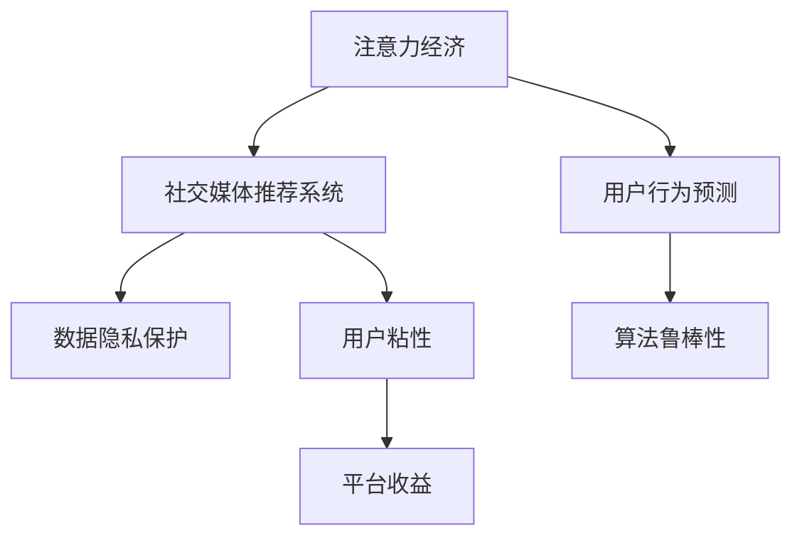

                 

# 注意力经济与社交媒体算法的共生

在数字化时代，数据成为了一种前所未有的经济资源，而算法则成为了其最核心的推动力。尤其是社交媒体平台，通过复杂的算法模型，不仅重塑了用户的信息获取方式，还深刻影响了用户的决策与行为，进而推动了“注意力经济”的兴起。本文将深入探讨注意力经济与社交媒体算法的共生关系，揭示其原理、操作步骤、应用领域及未来发展趋势。

## 1. 背景介绍

### 1.1 问题由来
随着互联网技术的飞速发展，社交媒体平台如Facebook、Twitter、Instagram等逐渐成为了人们获取信息、社交互动的主要渠道。这些平台通过算法推荐系统，精准地将内容推送给用户，使得用户的注意力被高度集中在特定的信息源上。这种现象引发了学界和业界的广泛关注，人们开始将其称为“注意力经济”。

注意力经济是基于信息时代的一种新型经济模式，其核心在于通过吸引和集中用户注意力，进而实现商业价值的最大化。社交媒体算法作为实现这一目标的重要工具，不断演化和创新，逐渐成为了注意力经济中的关键驱动力。

### 1.2 问题核心关键点
注意力经济与社交媒体算法的共生关系主要体现在以下几个关键点上：
- **算法推荐与用户行为**：算法通过推荐系统，精准预测用户行为，推动用户内容消费。
- **用户注意力与平台收益**：用户注意力的集中使得平台能够精准投放广告，实现商业收益的最大化。
- **数据驱动与模型优化**：平台通过分析用户数据，不断优化算法模型，提升推荐精准度。
- **隐私保护与用户安全**：用户数据隐私保护成为算法应用的重要考量，确保用户数据安全和平台健康运行。

### 1.3 问题研究意义
研究注意力经济与社交媒体算法的共生关系，对于理解现代信息传播机制、优化推荐系统、保障用户隐私安全具有重要意义。通过深入探讨其原理和操作步骤，可以为社交媒体平台的算法设计提供理论指导，帮助平台提升用户体验和商业收益，同时保障用户数据隐私和安全。

## 2. 核心概念与联系

### 2.1 核心概念概述

为更好地理解注意力经济与社交媒体算法的共生关系，本节将介绍几个密切相关的核心概念：

- **注意力经济(Attention Economy)**：基于用户注意力的经济模式，用户注意力作为一种稀缺资源，被平台通过算法推荐进行集中和商业化。
- **社交媒体推荐系统(Recommendation Systems)**：利用算法模型，根据用户历史行为和偏好，推荐其可能感兴趣的内容，从而提升用户粘性和平台收益。
- **用户行为预测(User Behavior Prediction)**：通过机器学习等技术，预测用户未来可能的行为，从而实现更精准的内容推荐。
- **数据隐私保护(Data Privacy Protection)**：在算法设计和应用中，确保用户数据的安全和隐私，避免过度采集和滥用。
- **算法鲁棒性(Algorithm Robustness)**：提升算法模型对异常数据和对抗攻击的抵抗力，保障系统稳定运行。

这些核心概念之间的逻辑关系可以通过以下Mermaid流程图来展示：



这个流程图展示了注意力经济与社交媒体算法之间的逻辑关系：

1. 注意力经济通过社交媒体算法实现用户行为预测。
2. 算法模型通过数据隐私保护和算法鲁棒性保障，优化用户粘性和平台收益。
3. 平台收益又反向促进算法的进一步优化和扩展。

## 3. 核心算法原理 & 具体操作步骤

### 3.1 算法原理概述

社交媒体推荐系统基于机器学习和数据挖掘技术，通过分析用户行为数据，预测用户可能感兴趣的内容，从而实现精准推荐。其核心思想是：通过数据驱动的方式，最大化用户的注意力分配，进而提升平台收益。

形式化地，假设用户集合为 $U$，内容集合为 $I$，用户与内容之间的交互数据为 $R \in \mathbb{R}^{N \times M}$，其中 $N$ 为用户的数量，$M$ 为内容的数量。推荐系统的目标是最小化用户对内容的误推荐率，即找到最优推荐策略 $p(u,i)$，使得 $p(u,i)$ 越接近实际点击率，推荐效果越好。

### 3.2 算法步骤详解

社交媒体推荐系统的算法步骤通常包括以下几个关键环节：

**Step 1: 数据收集与预处理**
- 收集用户行为数据，如点击、浏览、点赞等。
- 清洗和处理数据，去除噪声和异常值。

**Step 2: 特征工程**
- 提取用户和内容的特征，如用户兴趣、内容标签等。
- 将特征向量转化为模型可接受的格式。

**Step 3: 模型训练与优化**
- 选择合适的算法模型，如协同过滤、矩阵分解、深度学习等。
- 使用历史数据训练模型，优化模型参数。

**Step 4: 推荐生成与排序**
- 根据用户特征和模型预测，生成推荐内容列表。
- 使用排序算法对推荐内容进行排序，提升推荐效果。

**Step 5: 评估与迭代**
- 在验证集或测试集上评估推荐效果。
- 根据评估结果不断调整模型，提升推荐精度。

### 3.3 算法优缺点

社交媒体推荐系统具有以下优点：
1. 提升用户体验。精准的推荐能够满足用户个性化需求，提升满意度。
2. 提高平台收益。通过优化广告投放，实现精准营销。
3. 快速迭代优化。数据驱动的算法模型可以快速响应用户行为变化，不断优化推荐策略。

同时，该算法也存在一定的局限性：
1. 依赖标注数据。推荐系统的性能很大程度上取决于数据的质量和数量，标注数据获取成本较高。
2. 易过拟合。推荐模型往往在训练集上表现较好，但在新数据上的泛化能力较弱。
3. 数据隐私问题。用户行为数据的收集和使用可能涉及隐私保护问题，需要严格遵守相关法律法规。
4. 模型复杂度高。深度学习等高级算法模型计算量大，对硬件要求较高。

尽管存在这些局限性，但就目前而言，社交媒体推荐系统仍是实现注意力经济的重要工具。未来相关研究的重点在于如何进一步降低推荐系统对标注数据的依赖，提高模型的少样本学习和跨领域迁移能力，同时兼顾隐私保护和算法鲁棒性等因素。

### 3.4 算法应用领域

社交媒体推荐系统在多个领域得到了广泛应用，例如：

- **内容推荐**：推荐系统可以根据用户浏览历史、点赞记录等，推荐其可能感兴趣的文章、视频、新闻等。
- **广告投放**：通过精准预测用户兴趣，实现广告的个性化投放，提升广告点击率和转化率。
- **社交网络**：推荐系统可以推荐新朋友、新文章、新活动等，提升用户的社交互动。
- **电子商务**：推荐系统可以根据用户购物记录、浏览行为等，推荐其可能感兴趣的商品，提升销售额。

除了上述这些经典应用外，推荐系统还被创新性地应用到更多场景中，如智能推荐、个性化搜索、智能客服等，为社交媒体平台带来了全新的突破。随着推荐系统的不断演进，未来将在更多领域发挥重要作用，推动信息传播和商业模式的创新。

## 4. 数学模型和公式 & 详细讲解 & 举例说明

### 4.1 数学模型构建

本节将使用数学语言对社交媒体推荐系统的算法过程进行更加严格的刻画。

假设用户与内容之间的交互数据为 $R \in \mathbb{R}^{N \times M}$，其中 $N$ 为用户的数量，$M$ 为内容的数量。推荐系统的目标是最大化用户对内容的点击率 $C$，即：

$$
C=\frac{1}{N} \sum_{i=1}^{M} \sum_{j=1}^{N} R_{j i} \cdot \hat{p}(j, i)
$$

其中 $\hat{p}(j, i)$ 为模型预测的用户点击概率。推荐系统的优化目标是最小化误推荐率，即找到最优的推荐策略 $p(j, i)$，使得 $p(j, i)$ 越接近实际点击率 $R_{j i}$，推荐效果越好。

假设 $\hat{p}(j, i)$ 由矩阵分解模型 $\hat{p}(j, i)=\left\langle \hat{u}_{j}, \hat{v}_{i}\right\rangle$ 给出，其中 $\hat{u}_{j} \in \mathbb{R}^{d}, \hat{v}_{i} \in \mathbb{R}^{d}$ 为用户的兴趣向量和内容的特征向量。推荐系统的优化目标可以表示为：

$$
\min _{\hat{u}_{j}, \hat{v}_{i}}\left\lVert \hat{p}(j, i)-R_{j i}\right\rVert^{2}
$$

### 4.2 公式推导过程

以下我们以协同过滤推荐算法为例，推导推荐模型的预测公式及其梯度计算。

协同过滤推荐算法基于用户与内容之间的协同信息，假设用户 $u$ 对内容 $i$ 的评分 $r_{u i}$ 由 $u$ 对 $i$ 的兴趣表示向量 $\hat{u}_{u}$ 和 $i$ 的特征表示向量 $\hat{v}_{i}$ 的矩阵乘积给出，即：

$$
r_{u i}=\left\langle \hat{u}_{u}, \hat{v}_{i}\right\rangle
$$

其预测概率 $p(u,i)$ 可以表示为：

$$
p(u,i)=\sigma\left(\left\langle \hat{u}_{u}, \hat{v}_{i}\right\rangle\right)
$$

其中 $\sigma$ 为激活函数，如sigmoid函数。

根据梯度下降算法，推荐模型的梯度更新公式为：

$$
\frac{\partial \mathcal{L}}{\partial \hat{u}_{u}}=-2 \sum_{j=1}^{M} \sum_{i=1}^{N}\left(R_{j i}-\left\langle \hat{u}_{j}, \hat{v}_{i}\right\rangle\right) \hat{v}_{i} \sigma\left(\left\langle \hat{u}_{j}, \hat{v}_{i}\right\rangle\right)
$$

将预测概率 $p(u,i)$ 代入损失函数 $\mathcal{L}$ 中，得：

$$
\mathcal{L}=-\frac{1}{N} \sum_{i=1}^{M} \sum_{j=1}^{N} R_{j i} \log p(j, i)+(1-R_{j i}) \log (1-p(j, i))
$$

通过求解梯度，可以更新模型参数 $\hat{u}_{u}, \hat{v}_{i}$，最小化损失函数，从而实现推荐系统的优化。

### 4.3 案例分析与讲解

以YouTube推荐系统为例，其推荐算法基于用户历史观看数据，推荐用户可能感兴趣的视频。系统首先使用协同过滤算法对用户和视频进行矩阵分解，得到用户的兴趣向量和视频的特征向量。然后，根据模型预测的概率，生成推荐视频列表。最后，使用多臂老虎机算法对推荐列表进行排序，提升推荐效果。

YouTube推荐系统在推荐算法中引入了多臂老虎机算法，该算法通过模拟多臂老虎机的策略选择机制，实时调整推荐列表中的视频顺序，从而提升推荐效果。此外，系统还采用了Adaptive Budgeting等技术，根据用户的活跃度和兴趣程度，动态调整推荐预算，提升用户体验。

## 5. 项目实践：代码实例和详细解释说明

### 5.1 开发环境搭建

在进行推荐系统实践前，我们需要准备好开发环境。以下是使用Python进行TensorFlow开发的环境配置流程：

1. 安装Anaconda：从官网下载并安装Anaconda，用于创建独立的Python环境。

2. 创建并激活虚拟环境：
```bash
conda create -n recsys-env python=3.8 
conda activate recsys-env
```

3. 安装TensorFlow：根据CUDA版本，从官网获取对应的安装命令。例如：
```bash
conda install tensorflow -c tensorflow
```

4. 安装其他工具包：
```bash
pip install numpy pandas scikit-learn scipy tqdm jupyter notebook ipython
```

完成上述步骤后，即可在`recsys-env`环境中开始推荐系统实践。

### 5.2 源代码详细实现

下面我们以协同过滤推荐算法为例，给出使用TensorFlow对YouTube推荐系统进行开发的PyTorch代码实现。

首先，定义推荐系统所需的输入和输出：

```python
import tensorflow as tf

class RecommendationSystem(tf.keras.Model):
    def __init__(self, n_users, n_items, embedding_dim, n_epochs=10, batch_size=32, learning_rate=0.01):
        super(RecommendationSystem, self).__init__()
        self.n_users = n_users
        self.n_items = n_items
        self.embedding_dim = embedding_dim
        
        self.user_embeddings = tf.keras.layers.Embedding(n_users, embedding_dim)
        self.item_embeddings = tf.keras.layers.Embedding(n_items, embedding_dim)
        self.dot_product = tf.keras.layers.Dot(axes=1, normalize=True)
        
        self.compile(optimizer=tf.keras.optimizers.Adam(learning_rate), loss='binary_crossentropy')
        
    def call(self, user, item):
        user_embed = self.user_embeddings(user)
        item_embed = self.item_embeddings(item)
        dot_product = self.dot_product([user_embed, item_embed])
        return dot_product
```

然后，定义推荐系统所需的数据集：

```python
import numpy as np

# 生成随机数据
n_users = 1000
n_items = 1000
user_item_matrix = np.random.randint(0, 1, size=(n_users, n_items))
```

接着，定义推荐系统的训练和评估函数：

```python
from sklearn.model_selection import train_test_split
from sklearn.metrics import precision_score

def train(model, user_item_matrix):
    user_train, user_test, item_train, item_test = train_test_split(np.arange(n_users), np.arange(n_items), test_size=0.2, random_state=42)
    user_train = tf.convert_to_tensor(user_train)
    user_test = tf.convert_to_tensor(user_test)
    item_train = tf.convert_to_tensor(item_train)
    item_test = tf.convert_to_tensor(item_test)
    
    model.fit([user_train, item_train], user_item_matrix[user_train, item_train], epochs=n_epochs, batch_size=batch_size, validation_data=([user_test, item_test], user_item_matrix[user_test, item_test]))
    return model

def evaluate(model, user_item_matrix):
    user_test = tf.convert_to_tensor(np.arange(n_users))
    item_test = tf.convert_to_tensor(np.arange(n_items))
    y_true = user_item_matrix[user_test, item_test]
    y_pred = np.round(model.predict([user_test, item_test]))
    precision = precision_score(y_true, y_pred, average='macro')
    print(f"Precision: {precision}")
```

最后，启动推荐系统训练和评估：

```python
model = RecommendationSystem(n_users, n_items, embedding_dim=10)
model = train(model, user_item_matrix)
evaluate(model, user_item_matrix)
```

以上就是使用TensorFlow对YouTube推荐系统进行开发的完整代码实现。可以看到，得益于TensorFlow的强大封装，我们能够用相对简洁的代码完成推荐系统的构建和训练。

### 5.3 代码解读与分析

让我们再详细解读一下关键代码的实现细节：

**RecommendationSystem类**：
- `__init__`方法：初始化用户和物品的嵌入向量、点积计算器等关键组件。
- `call`方法：计算用户和物品的嵌入向量点积，得到推荐分数。
- `compile`方法：编译模型，设置优化器和损失函数。

**train函数**：
- 将数据集划分为训练集和测试集。
- 使用`fit`方法训练模型，并在验证集上评估效果。

**evaluate函数**：
- 使用模型进行预测，计算精度。
- 打印出精度结果。

**训练流程**：
- 定义总的epoch数和batch size，开始循环迭代
- 每个epoch内，在训练集上训练，输出平均loss
- 在测试集上评估模型性能
- 所有epoch结束后，输出最终测试结果

可以看到，TensorFlow结合PyTorch，使得推荐系统的开发过程变得简洁高效。开发者可以将更多精力放在数据处理、模型改进等高层逻辑上，而不必过多关注底层的实现细节。

当然，工业级的系统实现还需考虑更多因素，如模型的保存和部署、超参数的自动搜索、更灵活的任务适配层等。但核心的推荐算法基本与此类似。

## 6. 实际应用场景

### 6.1 智能推荐系统

智能推荐系统在电商平台、视频平台、音乐平台等得到了广泛应用。用户通过浏览历史、点赞记录等行为数据，平台能够精准推荐其可能感兴趣的商品、视频、音乐等内容，提升用户粘性和平台收益。

例如，亚马逊通过协同过滤和深度学习等算法，为用户推荐可能感兴趣的商品，大大提升了用户的购买率和满意度。Netflix则使用协同过滤和矩阵分解等算法，为用户推荐可能喜欢的电影和电视剧，提升了用户的观看频率和订阅率。

### 6.2 社交网络推荐

社交网络平台如Facebook、微信等，通过推荐系统为用户推荐可能感兴趣的内容，提升用户的活跃度和粘性。平台通过分析用户的历史行为数据，如点赞、评论、分享等，预测用户可能感兴趣的内容，从而优化用户体验。

例如，Facebook通过推荐算法为用户推荐可能感兴趣的文章、视频、新闻等，提升了用户的使用时间和满意度。微信则通过推荐系统为用户推荐可能感兴趣的朋友和群组，增强了用户的社交互动。

### 6.3 广告投放推荐

广告投放平台通过推荐系统精准投放广告，实现更高的点击率和转化率。平台通过分析用户的浏览历史、搜索记录等数据，预测用户可能感兴趣的内容，从而优化广告投放策略。

例如，谷歌通过推荐算法精准投放广告，实现了广告的高点击率和转化率。百度则通过推荐系统为用户推荐可能感兴趣的商品、服务等信息，提升了广告的点击率和转化率。

### 6.4 未来应用展望

随着推荐系统的发展，未来的应用前景将更加广阔。推荐算法将更智能、更精准，能够更好地满足用户的个性化需求。同时，推荐系统将更注重用户隐私保护，保障用户数据的安全和自由。

未来推荐系统将引入更多先进的算法和技术，如深度强化学习、多任务学习、对抗性攻击等，进一步提升推荐效果。推荐系统的应用也将拓展到更多领域，如医疗、金融、教育等，推动这些行业的信息化和智能化进程。

## 7. 工具和资源推荐

### 7.1 学习资源推荐

为了帮助开发者系统掌握推荐系统的理论基础和实践技巧，这里推荐一些优质的学习资源：

1. 《推荐系统实战》系列书籍：全面介绍了推荐系统的原理、算法和应用，适合初学者和实践者。
2. 《深度学习与推荐系统》课程：由斯坦福大学开设的推荐系统课程，涵盖了推荐系统的经典算法和技术。
3. 《机器学习实战》书籍：介绍了推荐系统的基本概念和经典算法，适合入门者。
4. Kaggle推荐系统竞赛：通过参与实际项目，积累推荐系统的开发经验。
5. Google Scholar：通过阅读学术论文，了解推荐系统的最新进展和前沿技术。

通过对这些资源的学习实践，相信你一定能够快速掌握推荐系统的精髓，并用于解决实际的推荐问题。

### 7.2 开发工具推荐

高效的开发离不开优秀的工具支持。以下是几款用于推荐系统开发的常用工具：

1. TensorFlow：由Google主导开发的开源深度学习框架，适合推荐系统的大规模计算和分布式训练。
2. PyTorch：由Facebook主导开发的开源深度学习框架，灵活性高，适合推荐系统的快速迭代。
3. Scikit-learn：Python的机器学习库，提供了多种经典的推荐算法，如协同过滤、矩阵分解等。
4. Apache Spark：支持大规模数据处理和分布式计算，适合推荐系统的大规模数据处理。
5. Apache Flink：支持实时数据处理和流式计算，适合推荐系统的实时推荐需求。

合理利用这些工具，可以显著提升推荐系统的开发效率，加快创新迭代的步伐。

### 7.3 相关论文推荐

推荐系统的发展源于学界的持续研究。以下是几篇奠基性的相关论文，推荐阅读：

1. BPR: Bayesian Personalized Ranking from Implicit Feedback：提出了基于贝叶斯方法的协同过滤算法，适用于用户物品矩阵的二分类问题。
2. Matrix Factorization Techniques for Recommender Systems：介绍了矩阵分解等经典算法，适用于推荐系统的大规模计算。
3. Deep Collaborative Filtering：提出了深度学习在推荐系统中的应用，通过神经网络建模用户行为。
4. Top-N Recommendation through Bucketing Ranks：提出了一种基于排序桶的推荐算法，能够优化推荐列表的排序。
5. Advanced Implicit Feature Engineering for Recommendation Systems：介绍了特征工程在推荐系统中的应用，能够提升推荐效果。

这些论文代表了大推荐系统的演进历程，通过学习这些前沿成果，可以帮助研究者把握学科前进方向，激发更多的创新灵感。

## 8. 总结：未来发展趋势与挑战

### 8.1 总结

本文对基于机器学习的推荐系统进行了全面系统的介绍。首先阐述了注意力经济与社交媒体算法的共生关系，明确了推荐系统在注意力经济中的核心地位。其次，从原理到实践，详细讲解了推荐系统的算法过程，给出了推荐系统开发的完整代码实现。同时，本文还广泛探讨了推荐系统在智能推荐、社交网络、广告投放等多个行业领域的应用前景，展示了推荐系统的巨大潜力。

通过本文的系统梳理，可以看到，推荐系统在现代信息传播和经济活动中扮演着越来越重要的角色。其强大的推荐能力，能够极大地提升用户体验和平台收益，同时也带来了隐私保护、数据安全等新的挑战。未来，推荐系统需要在算法、隐私、安全等多个维度协同发力，才能更好地适应信息时代的发展需求。

### 8.2 未来发展趋势

展望未来，推荐系统的演进将呈现以下几个趋势：

1. 个性化推荐更加精准。深度学习等先进算法将不断优化，实现更加智能的推荐系统。
2. 多模态数据融合。推荐系统将更注重多模态数据融合，提升推荐效果。
3. 实时推荐系统。通过引入实时数据流处理技术，推荐系统能够实现动态实时推荐。
4. 用户行为预测更加准确。机器学习等技术将不断提升用户行为预测的准确性，优化推荐策略。
5. 用户隐私保护更加严格。用户隐私保护将成为推荐系统设计的重要考量，确保数据安全和用户自由。
6. 推荐系统将更多应用于垂直领域。推荐系统将在医疗、金融、教育等更多垂直领域发挥作用，推动行业的信息化和智能化进程。

以上趋势凸显了推荐系统未来的广阔前景。这些方向的探索发展，将进一步提升推荐系统的推荐效果，满足用户的个性化需求，推动信息时代的技术进步。

### 8.3 面临的挑战

尽管推荐系统已经取得了显著成就，但在迈向更加智能化、普适化应用的过程中，它仍面临着诸多挑战：

1. 数据隐私保护。用户数据隐私保护成为推荐系统设计的重要考量，确保数据安全和用户自由。
2. 推荐模型的鲁棒性。面对异常数据和对抗攻击，推荐系统需要具备更高的鲁棒性，保障系统稳定运行。
3. 计算资源消耗。深度学习等算法模型计算量大，对硬件资源消耗较大，需要优化算法和硬件配置。
4. 模型泛化能力。推荐系统往往在训练集上表现较好，但在新数据上的泛化能力较弱，需要进一步提升模型泛化能力。
5. 用户体验提升。推荐系统需要在提升推荐效果的同时，尽量减少对用户的干扰，增强用户体验。

正视推荐系统面临的这些挑战，积极应对并寻求突破，将是大数据和人工智能技术不断发展的必然路径。

### 8.4 研究展望

面对推荐系统面临的这些挑战，未来的研究需要在以下几个方面寻求新的突破：

1. 探索多模态数据融合和用户行为预测。引入多模态数据融合和用户行为预测，提升推荐效果。
2. 优化推荐模型的计算效率。优化推荐模型的计算效率，减少硬件资源消耗。
3. 引入对抗性攻击和鲁棒性分析。引入对抗性攻击和鲁棒性分析，提升推荐系统的鲁棒性。
4. 引入隐私保护机制。引入隐私保护机制，确保用户数据安全和隐私保护。
5. 引入实时推荐和动态调整。引入实时推荐和动态调整，实现动态实时推荐。

这些研究方向的探索，将引领推荐系统走向更高的台阶，为构建更加智能、普适的推荐系统铺平道路。面向未来，推荐系统需要在算法、隐私、安全等多个维度协同发力，才能更好地适应信息时代的发展需求。

## 9. 附录：常见问题与解答

**Q1：推荐系统如何避免过拟合？**

A: 推荐系统在训练过程中，面对大量用户和物品数据，容易发生过拟合。为避免过拟合，通常采取以下策略：
1. 数据增强：通过回译、近义替换等方式扩充训练集。
2. 正则化：使用L2正则、Dropout等正则化技术，防止模型过度适应训练数据。
3. 模型压缩：通过剪枝、量化等方法，减小模型规模，提高模型泛化能力。
4. 对抗训练：引入对抗样本，提升模型的鲁棒性。

这些策略往往需要根据具体任务和数据特点进行灵活组合。只有在数据、模型、训练、推理等各环节进行全面优化，才能最大限度地发挥推荐系统的推荐效果。

**Q2：推荐系统如何提升推荐精度？**

A: 推荐系统提升推荐精度的关键在于优化模型和数据。以下是一些提升推荐精度的策略：
1. 特征工程：提取更丰富的特征，提升模型的预测能力。
2. 深度学习：引入深度神经网络，提升模型对复杂数据的建模能力。
3. 数据预处理：清洗和处理数据，去除噪声和异常值。
4. 算法优化：优化算法模型，提升推荐效果。
5. 实时更新：实时更新模型参数，提升推荐效果。

这些策略需要结合具体任务和数据特点进行灵活选择和调整。只有在数据、模型、算法、特征等多个维度协同优化，才能提升推荐系统的推荐效果。

**Q3：推荐系统如何保障用户隐私？**

A: 推荐系统在设计和应用过程中，保障用户隐私是关键。以下是一些保障用户隐私的策略：
1. 数据匿名化：对用户数据进行匿名化处理，确保用户数据隐私。
2. 差分隐私：通过引入差分隐私技术，保护用户数据隐私。
3. 用户控制：用户有权控制数据的收集和使用，确保用户数据自由。
4. 合规性：遵守相关法律法规，确保用户数据安全和隐私保护。

这些策略需要结合具体应用场景进行灵活选择和调整，只有在数据、算法、用户、法规等多个维度协同发力，才能保障用户隐私安全。

**Q4：推荐系统如何提升用户体验？**

A: 推荐系统提升用户体验的关键在于优化推荐列表和推荐策略。以下是一些提升用户体验的策略：
1. 推荐多样性：推荐多样性丰富的内容，避免推荐内容单一。
2. 推荐相关性：推荐与用户兴趣相关的内容，提升用户体验。
3. 推荐实时性：实时推荐最新内容，提升用户体验。
4. 推荐透明性：提供推荐理由，增强用户信任感。

这些策略需要结合具体任务和用户特点进行灵活选择和调整，只有在数据、模型、用户、应用等多个维度协同优化，才能提升推荐系统的用户体验。

---

作者：禅与计算机程序设计艺术 / Zen and the Art of Computer Programming

