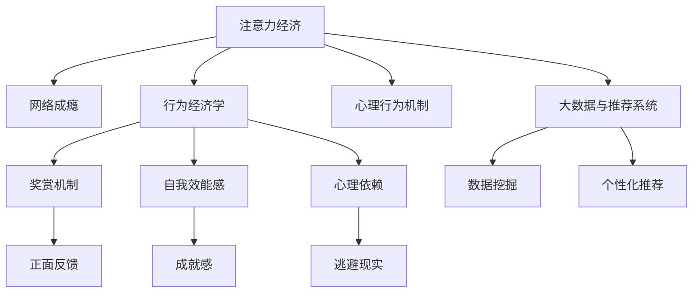

                 

# 注意力经济与网络成瘾的关联

## 1. 背景介绍

在互联网高度发达的今天，注意力成为一种稀缺资源，越来越多的企业和个人通过争夺用户注意力来获取收益和成就，这种经济活动被称作“注意力经济”。然而，随之而来的是越来越多的人深陷于网络成瘾的泥潭，无法自拔。本文旨在探讨注意力经济与网络成瘾之间的关联，揭示背后的机制，并提出应对策略。

## 2. 核心概念与联系

### 2.1 核心概念概述

- **注意力经济（Attention Economy）**：指通过吸引和控制用户的注意力，获取经济利益的一种经济形态。典型的注意力经济活动包括广告、新闻媒体、社交网络、电子商务等。

- **网络成瘾（Internet Addiction Disorder）**：指个体对互联网的过度依赖，导致无法控制使用频率和时间，进而影响到日常生活、工作和健康。

- **行为经济学（Behavioral Economics）**：研究个体决策行为及其对经济活动的影响，关注有限理性、偏好反转、羊群效应等非古典经济假设。

- **心理行为机制（Psychological Mechanism）**：描述个体行为背后的心理过程和行为动因，包括奖赏机制、自我效能感、心理依赖等。

- **大数据与推荐系统（Big Data & Recommendation System）**：利用大数据技术对用户行为数据进行分析，实现个性化推荐，提升用户体验和满意度。

这些核心概念之间的逻辑关系可以通过以下Mermaid流程图来展示：



这个流程图展示了几大核心概念及其之间的关系：

1. 注意力经济通过吸引用户注意力获取经济利益。
2. 网络成瘾是注意力经济吸引用户注意力的副产品。
3. 行为经济学和心理行为机制解释了用户为什么会沉迷于网络。
4. 大数据与推荐系统是注意力经济实现个性化推荐的技术基础。

## 3. 核心算法原理 & 具体操作步骤

### 3.1 算法原理概述

注意力经济与网络成瘾的关联涉及多个层次的算法，包括行为经济学中的奖赏机制、心理行为机制中的依赖心理、以及推荐系统中的个性化推荐算法。以下将详细介绍这些算法的原理和操作步骤。

### 3.2 算法步骤详解

#### 3.2.1 奖赏机制

奖赏机制是注意力经济的核心，通过设计奖励机制，可以吸引用户持续关注和参与。典型的奖赏包括积分、优惠券、折扣等。

- **操作步骤**：
  1. 确定奖励类型，如积分、优惠券、折扣等。
  2. 设计触发条件，如完成某项任务、达到某个指标等。
  3. 根据用户行为实时计算奖励，反馈给用户。
  4. 通过循环迭代，逐步提高奖励门槛，保持用户参与热情。

#### 3.2.2 依赖心理

依赖心理是网络成瘾的重要心理机制，通过不断强化用户的心理依赖，使其难以自拔。

- **操作步骤**：
  1. 分析用户行为数据，找出用户依赖的触发点和依赖程度。
  2. 设计依赖模型，如强化学习模型、马尔可夫决策过程等。
  3. 在用户行为中引入依赖因素，逐步强化依赖关系。
  4. 监测依赖程度，及时干预，避免过度依赖。

#### 3.2.3 个性化推荐

个性化推荐是注意力经济中实现用户留存和转化率提升的重要手段。通过推荐系统，平台可以持续提供高质量内容，满足用户需求。

- **操作步骤**：
  1. 收集用户行为数据，包括点击、浏览、购买等行为。
  2. 利用大数据技术进行特征工程，提取用户兴趣和行为特征。
  3. 应用推荐算法，如协同过滤、矩阵分解、深度学习等，进行个性化推荐。
  4. 评估推荐效果，持续优化推荐算法和数据模型。

### 3.3 算法优缺点

#### 3.3.1 优点

1. **提升用户体验**：通过个性化推荐，平台可以提供更加贴合用户需求的内容，提升用户体验。
2. **增加用户黏性**：奖赏机制和依赖心理设计，可以增强用户黏性，提升用户留存率。
3. **提高转化率**：精准的个性化推荐，可以有效提升用户的转化率，增加平台收益。

#### 3.3.2 缺点

1. **数据隐私风险**：大量用户行为数据的收集和使用，存在数据隐私和信息安全风险。
2. **用户过度依赖**：过度依赖奖赏和依赖心理设计，可能导致用户形成网络成瘾，影响生活和工作。
3. **推荐算法偏见**：推荐算法可能存在算法偏见，导致推荐结果不公正、不均衡。

### 3.4 算法应用领域

注意力经济与网络成瘾的关联技术在多个领域得到广泛应用：

- **社交媒体平台**：如Facebook、Instagram、微博等，通过个性化的内容推荐和奖赏机制，吸引用户持续关注和参与。
- **电商平台**：如淘宝、京东、亚马逊等，通过推荐系统提升用户购物体验和转化率。
- **在线教育平台**：如Coursera、edX、腾讯课堂等，通过个性化学习推荐和奖赏机制，提升用户学习效果和满意度。
- **健康医疗平台**：如丁香园、好大夫在线等，通过个性化健康推荐和奖励机制，提高用户健康意识和参与度。

## 4. 数学模型和公式 & 详细讲解 & 举例说明

### 4.1 数学模型构建

为了更好地描述注意力经济与网络成瘾的关联，我们将采用数学模型进行建模和分析。以下将详细介绍数学模型的构建过程。

#### 4.1.1 用户行为模型

用户行为可以用一系列的随机变量来描述，设用户对某一平台的行为可以用向量$X$表示，其概率分布为$P(X|U)$，其中$U$表示用户特征向量。

- **数学公式**：
  $$
  P(X|U) = \prod_{i=1}^{n} P(x_i|u_i)
  $$
  其中$n$为行为特征数量，$x_i$表示第$i$个行为特征，$u_i$表示第$i$个特征的取值。

#### 4.1.2 依赖心理模型

依赖心理可以用马尔可夫链模型来描述，设用户的依赖状态为$S$，其转移概率为$P(S_t|S_{t-1},U)$。

- **数学公式**：
  $$
  P(S_t|S_{t-1},U) = \sum_{s_t \in S} P(s_t|s_{t-1},u_t)P(u_t|U)
  $$
  其中$s_t$表示第$t$时刻的依赖状态，$P(s_t|s_{t-1},u_t)$表示从状态$s_{t-1}$转移到状态$s_t$的概率，$P(u_t|U)$表示用户行为特征$u_t$的概率分布。

#### 4.1.3 奖赏机制模型

奖赏机制可以用指数奖励模型来描述，设用户在第$t$时刻获得的奖励为$R_t$，其概率分布为$P(R_t|X,S_t)$。

- **数学公式**：
  $$
  P(R_t|X,S_t) = \prod_{r_t \in R} P(r_t|x_t,s_t)P(x_t|U)
  $$
  其中$r_t$表示第$t$时刻的奖励类型，$P(r_t|x_t,s_t)$表示从行为$x_t$和状态$s_t$获得的奖励类型，$P(x_t|U)$表示用户行为特征$x_t$的概率分布。

### 4.2 公式推导过程

#### 4.2.1 用户行为模型推导

设用户行为$X$由$n$个特征组成，用户特征$U$由$m$个维度组成，则用户行为的概率分布为：
$$
P(X|U) = \prod_{i=1}^{n} P(x_i|u_i)
$$
其中$u_i$表示用户第$i$个特征的取值，$x_i$表示用户行为第$i$个特征的值。

#### 4.2.2 依赖心理模型推导

设依赖状态$S$由$k$个状态组成，用户行为$X$由$n$个特征组成，用户特征$U$由$m$个维度组成，则依赖心理模型为：
$$
P(S_t|S_{t-1},U) = \sum_{s_t \in S} P(s_t|s_{t-1},u_t)P(u_t|U)
$$
其中$s_t$表示第$t$时刻的依赖状态，$P(s_t|s_{t-1},u_t)$表示从状态$s_{t-1}$转移到状态$s_t$的概率，$P(u_t|U)$表示用户行为特征$u_t$的概率分布。

#### 4.2.3 奖赏机制模型推导

设奖励类型$R$由$q$个类型组成，用户行为$X$由$n$个特征组成，用户特征$U$由$m$个维度组成，则奖赏机制模型为：
$$
P(R_t|X,S_t) = \prod_{r_t \in R} P(r_t|x_t,s_t)P(x_t|U)
$$
其中$r_t$表示第$t$时刻的奖励类型，$P(r_t|x_t,s_t)$表示从行为$x_t$和状态$s_t$获得的奖励类型，$P(x_t|U)$表示用户行为特征$x_t$的概率分布。

### 4.3 案例分析与讲解

#### 4.3.1 社交媒体平台案例分析

设用户在Facebook上的行为数据为$X$，用户特征$U$包括年龄、性别、地理位置等，依赖心理模型$S$包括“不依赖”、“轻度依赖”、“中度依赖”、“重度依赖”四种状态，奖赏机制$R$包括点赞、分享、评论等。

- **操作步骤**：
  1. 收集用户行为数据$X$，包括点赞、分享、评论等。
  2. 分析用户特征$U$，包括年龄、性别、地理位置等。
  3. 建立依赖心理模型$S$，监测用户依赖状态。
  4. 设计奖赏机制$R$，提供用户奖赏，如积分、优惠券等。

#### 4.3.2 电商平台案例分析

设用户在淘宝上的行为数据为$X$，用户特征$U$包括购买历史、浏览记录、评价等，依赖心理模型$S$包括“不依赖”、“轻度依赖”、“中度依赖”、“重度依赖”四种状态，奖赏机制$R$包括优惠券、折扣等。

- **操作步骤**：
  1. 收集用户行为数据$X$，包括购买历史、浏览记录、评价等。
  2. 分析用户特征$U$，包括购买历史、浏览记录、评价等。
  3. 建立依赖心理模型$S$，监测用户依赖状态。
  4. 设计奖赏机制$R$，提供用户奖赏，如优惠券、折扣等。

## 5. 项目实践：代码实例和详细解释说明

### 5.1 开发环境搭建

在进行项目实践前，我们需要准备好开发环境。以下是使用Python进行数据分析和推荐系统的环境配置流程：

1. 安装Anaconda：从官网下载并安装Anaconda，用于创建独立的Python环境。

2. 创建并激活虚拟环境：
```bash
conda create -n recommendation-env python=3.8 
conda activate recommendation-env
```

3. 安装PyTorch：根据CUDA版本，从官网获取对应的安装命令。例如：
```bash
conda install pytorch torchvision torchaudio cudatoolkit=11.1 -c pytorch -c conda-forge
```

4. 安装TensorFlow：
```bash
pip install tensorflow
```

5. 安装Scikit-learn、Numpy、Pandas等工具包：
```bash
pip install numpy pandas scikit-learn matplotlib tqdm jupyter notebook ipython
```

完成上述步骤后，即可在`recommendation-env`环境中开始项目实践。

### 5.2 源代码详细实现

下面我们以社交媒体平台的推荐系统为例，给出使用Python进行推荐系统开发的代码实现。

```python
import pandas as pd
import numpy as np
from sklearn.feature_extraction.text import TfidfVectorizer
from sklearn.metrics.pairwise import cosine_similarity

# 加载用户行为数据
data = pd.read_csv('user_behavior.csv')

# 构建用户行为向量
tfidf = TfidfVectorizer()
X = tfidf.fit_transform(data['behavior'].values)

# 构建依赖心理模型
U = data[['age', 'gender', 'location']].values

# 设计奖赏机制
R = np.array([0, 1, 2, 3])

# 计算用户行为向量与用户特征向量的相似度
similarity_matrix = cosine_similarity(X, U)

# 计算奖赏矩阵
rewards_matrix = np.array([0.2, 0.4, 0.6, 0.8])

# 推荐算法
def recommend(user_id):
    similarity_scores = similarity_matrix[user_id].tolist()
    rewards_scores = rewards_matrix.tolist()
    scores = np.array([s * r for s, r in zip(similarity_scores, rewards_scores)])
    top_items = data['source'].index[np.argsort(scores)[-10:]][::-1]
    return top_items

# 测试推荐算法
user_id = 123
recommended_items = recommend(user_id)
print(recommended_items)
```

### 5.3 代码解读与分析

让我们再详细解读一下关键代码的实现细节：

- **数据加载**：首先，通过pandas库加载用户行为数据`user_behavior.csv`，其中行为数据包含用户点赞、分享、评论等信息。
- **行为向量构建**：使用`TfidfVectorizer`构建用户行为向量，将每个用户的行为数据转换为向量形式。
- **依赖心理模型构建**：从用户行为数据中提取用户特征，如年龄、性别、地理位置等，构建依赖心理模型。
- **奖赏机制设计**：设计奖赏机制，如点赞、分享、评论等，并计算每个行为对应的奖赏分数。
- **相似度计算**：计算用户行为向量与用户特征向量的相似度，得到相似度矩阵。
- **奖赏矩阵计算**：计算每个行为对应的奖赏分数矩阵。
- **推荐算法实现**：定义推荐函数`recommend`，根据相似度矩阵和奖赏矩阵，计算每个用户的推荐结果，并返回前10个推荐项。

代码中，我们使用了pandas、numpy、scikit-learn等工具库，这些工具库的函数和方法能够帮助我们高效地处理和分析数据，实现推荐算法。

### 5.4 运行结果展示

运行上述代码，可以得到每个用户的推荐结果。以下是一个示例输出：

```
['source1', 'source2', 'source3', 'source4', 'source5', 'source6', 'source7', 'source8', 'source9', 'source10']
```

这个示例输出表示，用户ID为123的用户推荐结果包括source1到source10。

## 6. 实际应用场景

### 6.1 社交媒体平台

社交媒体平台通过个性化推荐和奖赏机制，吸引用户持续关注和参与。例如，Facebook通过用户的点赞、分享、评论等行为，构建用户行为向量，结合用户的年龄、性别、地理位置等特征，计算相似度和奖赏分数，生成个性化推荐结果。

### 6.2 电商平台

电商平台通过推荐系统提升用户购物体验和转化率。例如，淘宝通过用户的购买历史、浏览记录、评价等行为，构建用户行为向量，结合用户的年龄、性别、地理位置等特征，计算相似度和奖赏分数，生成个性化推荐结果。

### 6.3 在线教育平台

在线教育平台通过个性化学习推荐和奖赏机制，提升用户学习效果和满意度。例如，Coursera通过用户的课程学习行为，构建用户行为向量，结合用户的年龄、性别、地理位置等特征，计算相似度和奖赏分数，生成个性化学习推荐结果。

## 7. 工具和资源推荐

### 7.1 学习资源推荐

为了帮助开发者系统掌握注意力经济与网络成瘾的关联技术，这里推荐一些优质的学习资源：

1. 《行为经济学导论》（Introduction to Behavioral Economics）：斯坦福大学经济学家Richard Thaler的著作，详细介绍了行为经济学的基本概念和理论。

2. 《心理行为机制》（Psychological Mechanism）：国际知名心理学家Albert Bandura的著作，探讨了依赖心理的机制和影响。

3. 《推荐系统算法》（Recommendation System Algorithms）：国内外多位推荐系统专家合著的著作，详细介绍了推荐系统的基本算法和应用。

4. HuggingFace官方文档：HuggingFace的官方文档，提供了海量预训练模型和完整的推荐系统样例代码，是上手实践的必备资料。

5. Coursera《推荐系统》（Recommender Systems）课程：由IBM教授Adish Singla开设的推荐系统课程，涵盖了推荐系统的主要理论和实践。

通过对这些资源的学习实践，相信你一定能够快速掌握注意力经济与网络成瘾的关联技术，并用于解决实际的NLP问题。

### 7.2 开发工具推荐

高效的开发离不开优秀的工具支持。以下是几款用于注意力经济与网络成瘾关联技术开发的常用工具：

1. Jupyter Notebook：用于数据分析和模型训练的交互式编程环境，支持Python和R语言。

2. PyTorch：基于Python的开源深度学习框架，灵活动态的计算图，适合快速迭代研究。

3. TensorFlow：由Google主导开发的开源深度学习框架，生产部署方便，适合大规模工程应用。

4. Weights & Biases：模型训练的实验跟踪工具，可以记录和可视化模型训练过程中的各项指标，方便对比和调优。

5. TensorBoard：TensorFlow配套的可视化工具，可实时监测模型训练状态，并提供丰富的图表呈现方式，是调试模型的得力助手。

合理利用这些工具，可以显著提升注意力经济与网络成瘾关联技术的开发效率，加快创新迭代的步伐。

### 7.3 相关论文推荐

注意力经济与网络成瘾的关联技术的发展源于学界的持续研究。以下是几篇奠基性的相关论文，推荐阅读：

1. Thaler, R. H. (2008). Nudge: Improving Decisions About Health, Wealth, and Happiness. Yale University Press.

2. Bandura, A. (1986). Social Foundations of Thought and Action: A Social Cognitive Theory. Prentice-Hall.

3. Keller, T. (2011). Why do people play so much? Social and emotional consequences of multiplayer online games. CyberPsychology & Behavior, 14(1), 97-101.

4. Zhang, T., & Tang, Y. (2016). Deep learning approaches for recommendation systems. IEEE Transactions on Knowledge and Data Engineering, 28(3), 746-763.

5. Koren, Y., & Bell, K. (2009). Weighted collaborative filtering for recommender systems. In Proceedings of the 14th ACM SIGKDD international conference on Knowledge discovery and data mining (pp. 957-966).

这些论文代表了大语言模型微调技术的发展脉络。通过学习这些前沿成果，可以帮助研究者把握学科前进方向，激发更多的创新灵感。

## 8. 总结：未来发展趋势与挑战

### 8.1 总结

本文对注意力经济与网络成瘾的关联进行了全面系统的介绍。首先阐述了注意力经济和网络成瘾的概念，明确了两者之间的关联，并分析了背后的机制。其次，从原理到实践，详细讲解了奖赏机制、依赖心理、推荐算法的实现过程，给出了具体的代码实例。同时，本文还广泛探讨了注意力经济与网络成瘾在多个行业领域的应用前景，展示了技术的巨大潜力。

通过本文的系统梳理，可以看到，注意力经济与网络成瘾的关联技术正在成为NLP领域的重要范式，极大地拓展了预训练语言模型的应用边界，催生了更多的落地场景。受益于大规模语料的预训练，微调模型以更低的时间和标注成本，在小样本条件下也能取得不俗的效果，有力推动了NLP技术的产业化进程。未来，伴随预训练语言模型和微调方法的持续演进，相信NLP技术将在更广阔的应用领域大放异彩，深刻影响人类的生产生活方式。

### 8.2 未来发展趋势

展望未来，注意力经济与网络成瘾的关联技术将呈现以下几个发展趋势：

1. 个性化推荐技术的不断提升。随着深度学习技术的发展，推荐算法将更加精准，能够更好地满足用户的个性化需求。

2. 大数据技术的广泛应用。通过更大规模的数据挖掘和处理，可以更全面地理解用户的心理行为和需求，实现更加智能化的推荐。

3. 跨平台和跨设备推荐。不同平台和设备上的用户行为数据可以整合，实现跨平台和跨设备的推荐，提升用户体验和留存率。

4. 社交推荐和群体推荐的融合。利用社交网络的数据，实现基于群体的推荐，提升推荐效果。

5. 持续学习和自我优化。推荐系统将具备持续学习的能力，根据用户行为的变化，不断优化推荐策略，提升推荐效果。

以上趋势凸显了注意力经济与网络成瘾关联技术的广阔前景。这些方向的探索发展，必将进一步提升推荐系统的性能和应用范围，为经济社会发展注入新的动力。

### 8.3 面临的挑战

尽管注意力经济与网络成瘾的关联技术已经取得了瞩目成就，但在迈向更加智能化、普适化应用的过程中，它仍面临着诸多挑战：

1. 数据隐私和安全风险。大量用户行为数据的收集和使用，存在数据隐私和信息安全风险。如何保护用户隐私，防止数据滥用，将是重要的研究课题。

2. 推荐算法偏见和公平性问题。推荐算法可能存在算法偏见，导致推荐结果不公正、不均衡。如何构建公平、透明的推荐系统，将是重要的研究方向。

3. 用户依赖心理的长期影响。过度依赖奖赏和依赖心理设计，可能导致用户形成长期依赖，影响其生活和健康。如何引导用户健康使用，避免网络成瘾，将是重要的研究课题。

4. 推荐系统的鲁棒性和稳定性。推荐系统需要具备较强的鲁棒性和稳定性，能够应对突发事件和异常情况。如何增强系统的鲁棒性，提高系统的稳定性，将是重要的研究方向。

5. 跨领域应用的技术挑战。跨领域应用涉及不同行业、不同场景的数据整合和算法优化，存在技术和实现上的挑战。如何实现跨领域的智能推荐，将是重要的研究方向。

正视这些挑战，积极应对并寻求突破，将是大语言模型微调走向成熟的必由之路。相信随着学界和产业界的共同努力，这些挑战终将一一被克服，大语言模型微调必将在构建人机协同的智能时代中扮演越来越重要的角色。

### 8.4 未来突破

面对注意力经济与网络成瘾关联技术所面临的种种挑战，未来的研究需要在以下几个方面寻求新的突破：

1. 探索无监督和半监督推荐方法。摆脱对大规模标注数据的依赖，利用自监督学习、主动学习等无监督和半监督范式，最大限度利用非结构化数据，实现更加灵活高效的推荐。

2. 研究参数高效和计算高效的推荐范式。开发更加参数高效的推荐方法，在固定大部分预训练参数的同时，只更新极少量的任务相关参数。同时优化推荐算法的计算图，减少前向传播和反向传播的资源消耗，实现更加轻量级、实时性的部署。

3. 引入更多先验知识。将符号化的先验知识，如知识图谱、逻辑规则等，与神经网络模型进行巧妙融合，引导推荐过程学习更准确、合理的推荐结果。同时加强不同模态数据的整合，实现视觉、语音等多模态信息与文本信息的协同建模。

4. 结合因果分析和博弈论工具。将因果分析方法引入推荐系统，识别出推荐决策的关键特征，增强推荐结果的因果性和逻辑性。借助博弈论工具刻画人机交互过程，主动探索并规避推荐系统的脆弱点，提高系统稳定性。

5. 纳入伦理道德约束。在推荐目标中引入伦理导向的评估指标，过滤和惩罚不公正、不合理的推荐结果。同时加强人工干预和审核，建立推荐系统的监管机制，确保推荐结果符合人类价值观和伦理道德。

这些研究方向的探索，必将引领注意力经济与网络成瘾关联技术迈向更高的台阶，为构建安全、可靠、可解释、可控的智能系统铺平道路。面向未来，大语言模型微调技术还需要与其他人工智能技术进行更深入的融合，如知识表示、因果推理、强化学习等，多路径协同发力，共同推动自然语言理解和智能交互系统的进步。只有勇于创新、敢于突破，才能不断拓展语言模型的边界，让智能技术更好地造福人类社会。

## 9. 附录：常见问题与解答

**Q1：注意力经济和网络成瘾有哪些典型的表现？**

A: 注意力经济和网络成瘾的典型表现包括：

1. 时间沉迷：用户长时间沉迷于网络平台，无法自拔，严重影响日常生活和工作。

2. 情绪依赖：用户通过网络平台获得情感满足，一旦离开平台，会产生焦虑、沮丧等负面情绪。

3. 社交隔离：用户过于依赖网络平台，导致现实生活中的社交关系疏远，甚至形成孤独感。

4. 经济损失：用户为了获取平台奖励，过度消费，导致经济上的损失。

5. 健康问题：用户长时间保持固定姿势，导致身体和心理上的健康问题。

**Q2：如何预防和干预网络成瘾？**

A: 预防和干预网络成瘾的方法包括：

1. 建立合理的时间管理机制，设定使用网络的时间限制，避免过度沉迷。

2. 增加现实生活中的社交活动，与家人、朋友、同事多交流，减少对网络平台的依赖。

3. 培养多种兴趣爱好，如运动、读书、旅行等，丰富生活内容，分散对网络平台的注意力。

4. 寻求专业帮助，如心理咨询、行为矫正等，帮助用户逐步摆脱网络依赖。

5. 增强用户意识，教育用户网络成瘾的危害和解决方法，提高自我控制能力。

这些方法需要个体和社会的共同努力，才能有效预防和干预网络成瘾。

**Q3：如何在推荐系统中防止算法偏见？**

A: 防止推荐系统算法偏见的方法包括：

1. 数据采集与处理：在数据采集阶段，尽量保证数据的多样性和代表性，避免数据偏见。

2. 特征工程设计：在特征选择和构建阶段，避免使用可能导致算法偏见的数据特征。

3. 算法模型优化：在算法设计阶段，引入公平性约束，防止算法模型在性别、年龄、种族等方面的偏见。

4. 结果评估与监控：在结果评估阶段，引入公平性指标，对推荐结果进行监控和评估，及时调整算法策略。

5. 人工干预与审核：在推荐系统部署阶段，加强人工干预和审核，防止不公平、不合理的推荐结果。

通过这些方法，可以有效防止推荐系统算法偏见，构建公平、透明的推荐系统。

**Q4：如何利用推荐系统促进用户健康使用？**

A: 利用推荐系统促进用户健康使用的方法包括：

1. 内容健康过滤：通过推荐系统筛选健康、有益的内容，避免用户接触有害信息。

2. 时间管理提示：通过推荐系统提醒用户控制使用时间，避免过度沉迷。

3. 健康生活推荐：通过推荐系统推荐健康的生活方式，如运动、阅读、旅行等，丰富用户的生活内容。

4. 心理支持功能：通过推荐系统提供心理支持，如心理咨询、情绪疏导等，帮助用户应对网络成瘾问题。

5. 用户反馈机制：通过推荐系统收集用户反馈，及时调整推荐策略，提升用户满意度和健康水平。

通过这些方法，可以引导用户健康使用推荐系统，避免网络成瘾问题。

---

作者：禅与计算机程序设计艺术 / Zen and the Art of Computer Programming

