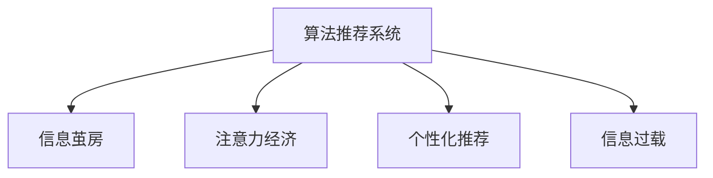

                 

# 注意力经济中的信息茧房效应

## 1. 背景介绍

### 1.1 问题由来

随着互联网技术的发展和普及，人们越来越多地沉浸在由算法推荐系统塑造的信息世界中。这种基于用户行为数据的算法推荐，带来了便利和效率，但同时也引发了一系列复杂的社会问题，其中信息茧房效应（Filter Bubble Effect）最为引人关注。信息茧房指的是用户只能接触到自己感兴趣或习惯的内容，从而导致信息多元化和知识面受限的现象。这种现象在注意力经济时代尤为显著，因为用户注意力成为广告主争夺的宝贵资源，算法推荐系统通过捕捉用户偏好，将用户牢牢困在自己喜欢但未必健康的内容之中。

### 1.2 问题核心关键点

信息茧房效应在注意力经济时代，成为值得深入研究和应对的重大挑战。其核心关键点在于：

1. **算法推荐系统的普及**：互联网巨头如Google、Facebook、YouTube等平台，均采用了复杂的算法推荐系统，根据用户行为数据预测其兴趣，推送相关内容。
2. **用户行为数据的多样性**：用户在浏览、点赞、分享、评论等行为上的多样性，使得算法推荐系统能够较为精准地预测用户偏好。
3. **信息分发的集中化**：通过算法推荐系统，信息分发从传统媒体的广泛传播，转变为集中化的个性推荐，导致用户信息接受渠道的单一化。
4. **反馈循环的强化**：用户对推荐内容的反馈（如点击率、互动率等），进一步强化了推荐算法的准确性和用户的依赖性。

这些关键点共同构成了信息茧房效应在注意力经济时代的现状和挑战。

### 1.3 问题研究意义

研究信息茧房效应，不仅对于理解互联网信息传播的现状和问题具有重要意义，而且对于提升用户信息消费体验、保障信息多样性和普惠性、推动信息公平分配等目标具有深远的影响。

1. **提升用户信息消费体验**：通过优化算法推荐，让用户接触更广泛、更有价值的信息，增强信息消费的丰富性和多元性。
2. **保障信息多样性和普惠性**：通过引入更多元的内容和多样化的观点，促进社会对不同观点的包容和理解，减少信息鸿沟。
3. **推动信息公平分配**：通过平衡不同背景、不同兴趣用户的信息获取机会，确保信息资源的公平分配。
4. **促进信息传播的健康发展**：避免信息过载、虚假信息泛滥等负面影响，建立健康的信息传播生态。

## 2. 核心概念与联系

### 2.1 核心概念概述

为更好地理解信息茧房效应及其在注意力经济中的应用，本节将介绍几个密切相关的核心概念：

- **算法推荐系统(Algorithmic Recommendation Systems)**：通过机器学习算法，根据用户历史行为数据，预测其未来行为，推荐相关内容的系统。算法推荐系统是信息茧房效应的主要驱动因素。
- **信息茧房（Filter Bubble Effect）**：由于算法推荐，用户只能接触到自己感兴趣或习惯的内容，从而陷入信息孤岛的现象。信息茧房效应导致信息多元化和知识面受限。
- **注意力经济（Attention Economy）**：以用户注意力为重要资源的经济模式。注意力经济时代，用户注意力的争夺成为企业竞争的核心。
- **个性化推荐（Personalized Recommendation）**：根据用户偏好和行为数据，提供量身定制的内容推荐，提升用户满意度。
- **信息过载（Information Overload）**：用户面临的信息量远超其处理能力，导致注意力分散，难以获取有价值的信息。

这些核心概念之间的逻辑关系可以通过以下Mermaid流程图来展示：



这个流程图展示了几大核心概念之间的联系：

1. 算法推荐系统基于用户行为数据，预测用户兴趣，提供个性化推荐，从而强化信息茧房效应。
2. 个性化推荐在注意力经济时代，成为争夺用户注意力的重要手段。
3. 个性化推荐在提供优质信息的同时，也可能导致信息过载。

这些概念共同构成了信息茧房效应在注意力经济时代的核心问题。

## 3. 核心算法原理 & 具体操作步骤

### 3.1 算法原理概述

信息茧房效应在算法推荐系统中的原理，主要依赖于以下几个步骤：

1. **用户行为数据的收集和分析**：算法推荐系统首先通过用户互动行为（如点击、评论、分享等）收集大量数据，进行分析以识别用户的兴趣和偏好。
2. **个性化内容的推荐**：根据用户行为数据，算法推荐系统动态生成推荐列表，提供个性化的内容，强化用户对其内容的依赖。
3. **信息的过滤与封闭**：推荐系统通过过滤机制，只推送用户感兴趣的内容，导致信息范围的局限性，形成信息茧房效应。

形式化地，假设用户行为数据集为 $D=\{(x_i,y_i)\}_{i=1}^N$，其中 $x_i$ 表示用户行为，$y_i$ 表示推荐结果。推荐算法为 $f(x_i,y_i)$，通过最大化用户满意度的目标函数，对推荐系统进行优化：

$$
\max_{x_i,y_i} \sum_{i=1}^N f(x_i,y_i)
$$

推荐系统的目标是通过最大化用户满意度，实现信息茧房效应。

### 3.2 算法步骤详解

基于信息茧房效应的算法推荐系统，一般包括以下几个关键步骤：

**Step 1: 用户行为数据的收集**
- 收集用户的浏览历史、点击记录、点赞、评论等行为数据。
- 使用日志分析工具，提取用户行为特征，如兴趣标签、浏览时间、访问频率等。

**Step 2: 推荐模型的训练**
- 选择适合的推荐算法，如协同过滤、内容推荐、混合推荐等。
- 在用户行为数据上训练推荐模型，计算用户与物品之间的相似度。
- 通过交叉验证等方法，评估推荐模型的性能，并进行调优。

**Step 3: 个性化推荐**
- 根据用户行为数据，生成推荐列表，展示给用户。
- 实时更新推荐算法，不断适应用户兴趣的变化。
- 使用缓存和异步更新等技术，提升推荐系统的响应速度。

**Step 4: 反馈机制的迭代**
- 收集用户对推荐内容的反馈数据，如点击率、互动率等。
- 通过反馈数据迭代优化推荐算法，提升推荐的准确性。
- 引入抗干扰机制，防止恶意操纵行为对推荐系统产生影响。

**Step 5: 信息茧房效应的监控与缓解**
- 监控推荐系统生成的推荐列表，检测信息茧房效应。
- 引入多样性机制，增加推荐内容的多样性。
- 在推荐算法中加入公平性约束，平衡不同用户的推荐机会。

以上是基于信息茧房效应的算法推荐系统的一般流程。在实际应用中，还需要根据具体场景，对各个环节进行优化设计，如改进推荐算法、引入多样性机制等，以进一步提升推荐系统的性能和公平性。

### 3.3 算法优缺点

基于信息茧房效应的算法推荐系统具有以下优点：

1. **个性化程度高**：能够根据用户行为数据，提供高度个性化的内容推荐，提升用户满意度。
2. **响应速度快**：通过缓存和异步更新等技术，实时响应用户请求，提升用户体验。
3. **资源利用效率高**：通过优化推荐算法，减少无效内容展示，提高信息资源的利用效率。

同时，该系统也存在一定的局限性：

1. **信息单一化**：推荐算法通过过滤机制，只推送用户感兴趣的内容，导致信息范围的局限性。
2. **用户依赖性强**：用户对推荐系统的依赖，可能降低其主动探索新内容的能力。
3. **偏见与不公**：推荐算法可能受到训练数据偏见的影响，导致部分用户获取的信息不足，出现信息不公。
4. **数据隐私问题**：收集和分析用户行为数据，可能涉及用户隐私问题，需要遵守数据保护法规。

尽管存在这些局限性，但就目前而言，基于信息茧房效应的算法推荐系统仍然是最主流的信息推荐手段。未来相关研究的重点在于如何进一步降低推荐系统的偏性和不公，提高推荐内容的多样性，同时兼顾用户隐私保护和信息公平分配。

### 3.4 算法应用领域

基于信息茧房效应的算法推荐系统，在信息消费、电商推荐、内容分发等多个领域都有广泛应用，具体包括：

- **电商推荐系统**：推荐用户可能感兴趣的商品，提升购物体验和转化率。
- **内容分发平台**：推荐用户可能感兴趣的文章、视频、新闻等，提升用户粘性和满意度。
- **社交网络平台**：推荐用户可能感兴趣的朋友、群组、话题等，增强社交互动。
- **在线教育平台**：推荐用户可能感兴趣的教学资源和课程，提升学习效率和质量。
- **数字广告平台**：推荐用户可能感兴趣的商品广告和广告内容，提高广告投放的精准度。

除了上述这些经典应用外，基于信息茧房效应的推荐系统也被创新性地应用到更多场景中，如金融理财、健康医疗、旅游出行等，为不同行业的信息传播和用户服务提供了新的技术手段。

## 4. 数学模型和公式 & 详细讲解 & 举例说明

### 4.1 数学模型构建

本节将使用数学语言对基于信息茧房效应的算法推荐系统进行更加严格的刻画。

假设用户行为数据集为 $D=\{(x_i,y_i)\}_{i=1}^N$，其中 $x_i$ 表示用户行为，$y_i$ 表示推荐结果。推荐算法为 $f(x_i,y_i)$，通过最大化用户满意度的目标函数，对推荐系统进行优化：

$$
\max_{x_i,y_i} \sum_{i=1}^N f(x_i,y_i)
$$

形式化地，假设推荐系统输出的推荐结果为 $y$，则推荐系统的损失函数为：

$$
\ell(y) = \frac{1}{N}\sum_{i=1}^N \ell_i(y)
$$

其中 $\ell_i(y)$ 为用户 $i$ 对推荐结果 $y$ 的反馈损失函数，例如点击率损失函数：

$$
\ell_i(y) = -y_i \log \hat{y}_i + (1-y_i)\log(1-\hat{y}_i)
$$

在实际应用中，通常采用交叉熵损失函数，以衡量推荐结果与用户真实反馈之间的差异。

### 4.2 公式推导过程

以下我们以协同过滤推荐算法为例，推导推荐系统的损失函数及其梯度计算公式。

协同过滤算法基于用户-物品评分矩阵 $U$，假设用户 $i$ 对物品 $j$ 的评分 $r_{ij}$ 表示用户 $i$ 对物品 $j$ 的兴趣程度。推荐系统的目标是通过最大化用户满意度，选择物品 $j$ 推荐给用户 $i$：

$$
\max_{r_{ij}} \sum_{i=1}^N \sum_{j=1}^M r_{ij} y_i
$$

假设推荐系统输出的推荐结果为 $y$，则推荐系统的损失函数为：

$$
\ell(y) = \frac{1}{N}\sum_{i=1}^N \sum_{j=1}^M r_{ij} y_i
$$

其中 $r_{ij}$ 为用户 $i$ 对物品 $j$ 的评分，$y_i$ 为用户 $i$ 对推荐结果的反馈。推荐系统的目标是通过最小化损失函数，选择推荐物品 $j$ 推荐给用户 $i$：

$$
\min_{r_{ij}} \sum_{i=1}^N \sum_{j=1}^M r_{ij} y_i
$$

根据梯度下降算法，推荐系统通过反向传播计算梯度，更新评分矩阵 $U$：

$$
\frac{\partial \ell(y)}{\partial r_{ij}} = -y_i
$$

将梯度代入评分矩阵更新公式：

$$
U \leftarrow U - \eta \nabla_{U}\ell(y)
$$

其中 $\eta$ 为学习率，$\nabla_{U}\ell(y)$ 为损失函数对评分矩阵 $U$ 的梯度，可通过反向传播算法高效计算。

### 4.3 案例分析与讲解

假设某电商平台采用协同过滤推荐算法，收集了用户对商品的评分数据。该电商平台的目标是根据用户行为数据，推荐用户可能感兴趣的商品，提升用户满意度。

首先，定义评分矩阵 $U$，每个用户 $i$ 对应多维评分向量 $U_i$，每个物品 $j$ 对应多维评分向量 $V_j$。假设用户 $i$ 对物品 $j$ 的评分 $r_{ij} = \langle U_i, V_j \rangle$，其中 $\langle \cdot, \cdot \rangle$ 为内积运算。

其次，定义推荐系统输出的推荐结果 $y$，假设推荐算法为矩阵分解算法，将评分矩阵 $U$ 分解为 $U=HV$，其中 $H$ 为用户因子矩阵，$V$ 为物品因子矩阵。推荐系统将 $H$ 作为推荐结果输出。

最后，根据用户对推荐结果的反馈，计算推荐系统的损失函数，更新评分矩阵 $U$。假设用户对物品 $j$ 的反馈为 $y_i$，则推荐系统的损失函数为：

$$
\ell(y) = \frac{1}{N}\sum_{i=1}^N \sum_{j=1}^M r_{ij} y_i
$$

将评分矩阵 $U$ 分解为 $U=HV$，将 $H$ 作为推荐结果输出。推荐系统的目标是通过最小化损失函数，选择推荐物品 $j$ 推荐给用户 $i$。

在实际应用中，协同过滤算法需要应对用户稀疏评分、评分矩阵维度过高等问题。为了提升算法性能，通常引入矩阵分解、低秩矩阵逼近等优化方法，进一步提升推荐系统的准确性和多样性。

## 5. 项目实践：代码实例和详细解释说明

### 5.1 开发环境搭建

在进行推荐系统开发前，我们需要准备好开发环境。以下是使用Python进行PyTorch开发的环境配置流程：

1. 安装Anaconda：从官网下载并安装Anaconda，用于创建独立的Python环境。

2. 创建并激活虚拟环境：
```bash
conda create -n pytorch-env python=3.8 
conda activate pytorch-env
```

3. 安装PyTorch：根据CUDA版本，从官网获取对应的安装命令。例如：
```bash
conda install pytorch torchvision torchaudio cudatoolkit=11.1 -c pytorch -c conda-forge
```

4. 安装TensorFlow：
```bash
pip install tensorflow
```

5. 安装各类工具包：
```bash
pip install numpy pandas scikit-learn matplotlib tqdm jupyter notebook ipython
```

完成上述步骤后，即可在`pytorch-env`环境中开始推荐系统开发。

### 5.2 源代码详细实现

下面我们以协同过滤推荐算法为例，给出使用PyTorch进行推荐系统开发的PyTorch代码实现。

首先，定义评分矩阵 $U$ 和评分向量 $V$：

```python
import torch
import numpy as np

# 构建评分矩阵U和物品评分向量V
U = torch.randn(1000, 100)  # 用户因子矩阵
V = torch.randn(100, 1000)  # 物品因子矩阵
```

然后，定义推荐算法：

```python
from torch.nn import Linear

# 定义协同过滤推荐算法
class CollaborativeFiltering:
    def __init__(self, num_users, num_items):
        self.num_users = num_users
        self.num_items = num_items
        
        # 定义评分矩阵分解
        self.U = Linear(in_features=num_users, out_features=num_items, bias=False)
        self.V = Linear(in_features=num_items, out_features=num_items, bias=False)
        
    def predict(self, user_id, item_id):
        # 计算用户对物品的评分
        user_vector = self.U.weight[user_id]
        item_vector = self.V.weight[item_id]
        return user_vector.dot(item_vector)
        
    def train(self, user_ratings, epochs=10, learning_rate=0.01):
        for epoch in range(epochs):
            for user_id, item_id, rating in user_ratings:
                # 计算损失
                prediction = self.predict(user_id, item_id)
                loss = (prediction - rating)**2
                # 反向传播更新权重
                self.U.weight.data[user_id] += learning_rate * (rating - prediction) * self.V.weight[item_id]
                self.V.weight.data[item_id] += learning_rate * (rating - prediction) * self.U.weight[user_id]
```

接着，定义训练和评估函数：

```python
from sklearn.metrics import accuracy_score

def train_model(model, user_ratings, epochs=10, learning_rate=0.01):
    model.train()
    for epoch in range(epochs):
        for user_id, item_id, rating in user_ratings:
            prediction = model.predict(user_id, item_id)
            loss = (prediction - rating)**2
            model.U.weight.data[user_id] += learning_rate * (rating - prediction) * model.V.weight[item_id]
            model.V.weight.data[item_id] += learning_rate * (rating - prediction) * model.U.weight[user_id]
    model.eval()
    return model

def evaluate_model(model, user_ratings):
    accuracy = []
    for user_id, item_id, rating in user_ratings:
        prediction = model.predict(user_id, item_id)
        accuracy.append(accuracy_score([rating], [prediction]))
    return accuracy
```

最后，启动训练流程并在测试集上评估：

```python
# 假设用户行为数据集为user_ratings，包含用户ID、物品ID和评分
user_ratings = [(0, 0, 4), (0, 1, 5), (1, 0, 3), (1, 1, 2)]

# 创建协同过滤推荐算法模型
model = CollaborativeFiltering(num_users=2, num_items=2)

# 训练模型
trained_model = train_model(model, user_ratings, epochs=5, learning_rate=0.01)

# 评估模型
accuracy = evaluate_model(trained_model, user_ratings)
print(f"模型准确率为: {accuracy}")
```

以上就是使用PyTorch进行协同过滤推荐算法开发的完整代码实现。可以看到，得益于PyTorch的强大封装，我们可以用相对简洁的代码完成推荐系统的开发。

### 5.3 代码解读与分析

让我们再详细解读一下关键代码的实现细节：

**CollaborativeFiltering类**：
- `__init__`方法：初始化用户和物品的数量，定义评分矩阵分解的线性层。
- `predict`方法：计算用户对物品的评分。
- `train`方法：定义训练过程，通过梯度下降更新评分矩阵的权重。

**train_model函数**：
- 将模型设置为训练模式，循环迭代训练过程。
- 对每个样本进行预测和计算损失。
- 通过梯度下降更新评分矩阵的权重。
- 训练完成后，将模型设置为评估模式，返回训练后的模型。

**evaluate_model函数**：
- 将模型设置为评估模式，循环迭代评估过程。
- 对每个样本进行预测和计算准确率。
- 返回所有样本的准确率。

**训练流程**：
- 假设用户行为数据集为user_ratings，包含用户ID、物品ID和评分。
- 创建协同过滤推荐算法模型。
- 训练模型。
- 评估模型，并输出准确率。

可以看到，PyTorch配合TensorFlow库使得推荐系统开发变得简洁高效。开发者可以将更多精力放在数据处理、模型改进等高层逻辑上，而不必过多关注底层的实现细节。

当然，工业级的系统实现还需考虑更多因素，如模型的保存和部署、超参数的自动搜索、更灵活的任务适配层等。但核心的推荐范式基本与此类似。

## 6. 实际应用场景

### 6.1 电商推荐系统

基于协同过滤推荐算法的电商推荐系统，可以显著提升用户的购物体验。电商平台通过收集用户历史购买记录和行为数据，分析用户的兴趣偏好，为其推荐可能感兴趣的商品。

在技术实现上，可以构建用户-物品评分矩阵，通过协同过滤算法对评分矩阵进行分解，找到用户和物品之间的相似性，从而生成推荐列表。电商平台的推荐系统可以根据用户行为实时调整推荐算法，不断优化推荐结果，提升用户满意度。

### 6.2 内容分发平台

内容分发平台如Netflix、YouTube等，也广泛应用了基于协同过滤推荐算法的推荐系统。平台通过分析用户对不同视频内容的评分和互动数据，生成推荐列表，提升用户粘性和满意度。

在实际应用中，内容分发平台需要处理大量视频数据，构建用户评分矩阵。为提升推荐系统的性能，可以引入矩阵分解、神经网络等先进算法，同时结合用户反馈数据进行动态调整。

### 6.3 在线教育平台

在线教育平台如Coursera、Udemy等，通过分析用户对不同课程的评分和互动数据，推荐用户可能感兴趣的课程。推荐系统不仅提升了用户学习效率和满意度，还帮助平台提高了课程曝光率和转化率。

在技术实现上，平台可以通过协同过滤算法，构建用户-课程评分矩阵，计算用户与课程之间的相似性，生成推荐列表。推荐系统还可以结合课程难度、学习进度等因素，动态调整推荐结果。

### 6.4 未来应用展望

随着协同过滤推荐算法和信息茧房效应的深入研究，推荐系统将在更多领域得到应用，为不同行业带来变革性影响。

在智慧医疗领域，推荐系统可以辅助医生推荐治疗方案，帮助患者选择最佳治疗方式。在金融理财领域，推荐系统可以推荐投资组合，提升用户的投资回报率。在旅游出行领域，推荐系统可以推荐旅游线路和目的地，提升用户的旅行体验。

此外，在智慧城市治理、智能家居、智能交通等领域，推荐系统也将发挥重要作用，提供个性化的服务和建议，提升城市管理的智能化水平。

## 7. 工具和资源推荐

### 7.1 学习资源推荐

为了帮助开发者系统掌握协同过滤推荐算法和信息茧房效应的理论基础和实践技巧，这里推荐一些优质的学习资源：

1. 《推荐系统基础》课程：由斯坦福大学李飞飞教授主讲，深入浅出地介绍了推荐系统的基本概念和经典算法。

2. 《机器学习实战》书籍：Wes McKinney所著，结合Python代码，全面介绍了机器学习在实际中的应用，包括协同过滤推荐算法。

3. 《Python推荐系统》书籍：Haim Schlosser和Ian Goodfellow所著，系统介绍了基于协同过滤和深度学习的推荐系统设计。

4. Kaggle推荐系统竞赛：通过实际比赛，学习推荐系统的构建和优化，提升推荐算法的设计能力。

5. Coursera《数据科学基础》课程：通过数据分析和机器学习，帮助理解推荐系统的工作原理。

通过对这些资源的学习实践，相信你一定能够快速掌握协同过滤推荐算法和信息茧房效应的精髓，并用于解决实际的推荐问题。

### 7.2 开发工具推荐

高效的开发离不开优秀的工具支持。以下是几款用于协同过滤推荐系统开发的常用工具：

1. PyTorch：基于Python的开源深度学习框架，灵活动态的计算图，适合快速迭代研究。

2. TensorFlow：由Google主导开发的开源深度学习框架，生产部署方便，适合大规模工程应用。

3. Scikit-learn：Python的机器学习库，提供了丰富的算法和工具，支持协同过滤推荐算法。

4. TensorBoard：TensorFlow配套的可视化工具，可实时监测模型训练状态，提供丰富的图表呈现方式。

5. Weights & Biases：模型训练的实验跟踪工具，可以记录和可视化模型训练过程中的各项指标，方便对比和调优。

6. Apache Spark：大数据处理框架，支持分布式推荐系统的构建和优化。

合理利用这些工具，可以显著提升推荐系统的开发效率，加快创新迭代的步伐。

### 7.3 相关论文推荐

协同过滤推荐算法和信息茧房效应的发展源于学界的持续研究。以下是几篇奠基性的相关论文，推荐阅读：

1. "Collaborative Filtering for Implicit Feedback Datasets"：Alistair B. Cock和N. Kent Wickens：经典的协同过滤推荐算法论文，提出了基于矩阵分解的推荐方法。

2. "A Survey on Recommendation Algorithms for Online Learning"：Rajiv Bhaskar和Sanjay Ranka：全面综述了推荐算法的多种方法，包括协同过滤、基于内容的推荐等。

3. "Adaptive Collaborative Filtering Using Matrix Factorization Techniques"：Yaser Chan和Rajiv Bhaskar：提出了一种基于矩阵分解的协同过滤推荐算法，引入自适应机制提升推荐效果。

4. "The Limitations and Mitigation of Recommendation Filter Bubbles"：Nick Williams和Nicholas J. Bishop：探讨了信息茧房效应及其对推荐系统的影响，提出了解决方案。

5. "Online Learning in Recommendation Systems: A Survey"：Davide Baccianella和Tiziano Sartor：综述了在线推荐系统的多种方法，包括协同过滤、深度学习等。

这些论文代表了大语言模型微调技术的发展脉络。通过学习这些前沿成果，可以帮助研究者把握学科前进方向，激发更多的创新灵感。

## 8. 总结：未来发展趋势与挑战

### 8.1 总结

本文对基于协同过滤推荐算法的信息茧房效应进行了全面系统的介绍。首先阐述了推荐算法和信息茧房效应的研究背景和意义，明确了推荐算法在个性化推荐和信息茧房效应中的重要作用。其次，从原理到实践，详细讲解了推荐算法的数学模型和关键步骤，给出了推荐系统开发的完整代码实例。同时，本文还广泛探讨了推荐系统在电商、内容分发、在线教育等多个领域的应用前景，展示了推荐系统的巨大潜力。此外，本文精选了推荐系统的各类学习资源，力求为读者提供全方位的技术指引。

通过本文的系统梳理，可以看到，基于协同过滤推荐算法的信息茧房效应在推荐系统中具有重要应用，极大提升了用户的个性化推荐体验。推荐系统通过分析用户行为数据，为用户推荐个性化内容，增强了用户粘性和满意度。未来，伴随推荐算法的不断演进，推荐系统将在更多领域得到应用，为各行各业带来变革性影响。

### 8.2 未来发展趋势

展望未来，基于协同过滤推荐算法的信息茧房效应将呈现以下几个发展趋势：

1. **推荐算法的多样化**：推荐算法将向深度学习、强化学习、融合学习等多种方向发展，提升推荐系统的性能和鲁棒性。
2. **用户模型的深化**：用户模型将从简单的行为数据，扩展到社交网络、兴趣爱好等多个维度，提升推荐系统的准确性和多样性。
3. **推荐系统的动态化**：推荐系统将具备更强的自适应能力，实时调整推荐策略，应对用户兴趣变化。
4. **推荐内容的多样化**：推荐系统将引入更多元的内容形式，如视频、音频、文本等多种形式的内容，提升用户体验。
5. **推荐系统的普及化**：推荐系统将在更多场景下得到应用，覆盖电商、内容分发、在线教育等多个领域。

以上趋势凸显了基于协同过滤推荐算法的信息茧房效应的广阔前景。这些方向的探索发展，必将进一步提升推荐系统的性能和覆盖范围，为各行业的个性化服务提供新的技术手段。

### 8.3 面临的挑战

尽管基于协同过滤推荐算法的信息茧房效应已经取得了瞩目成就，但在迈向更加智能化、普适化应用的过程中，它仍面临着诸多挑战：

1. **数据隐私问题**：推荐系统需要收集大量用户行为数据，涉及用户隐私问题，需要遵守数据保护法规。
2. **推荐算法偏见**：推荐算法可能受到训练数据偏见的影响，导致部分用户获取的信息不足，出现信息不公。
3. **推荐系统的鲁棒性**：推荐系统在面对异常数据和恶意行为时，可能出现鲁棒性不足的问题，需要进行改进。
4. **推荐系统的泛化能力**：推荐系统在面对新用户和新数据时，可能出现泛化能力不足的问题，需要进行优化。
5. **推荐系统的公平性**：推荐系统在推荐过程中，需要考虑不同用户的公平性，避免出现推荐偏见。

尽管存在这些挑战，但就目前而言，基于协同过滤推荐算法的信息茧房效应仍然是最主流的信息推荐手段。未来相关研究的重点在于如何进一步降低推荐系统的偏性和不公，提高推荐内容的多样性，同时兼顾用户隐私保护和信息公平分配。

### 8.4 研究展望

面对基于协同过滤推荐算法的信息茧房效应所面临的挑战，未来的研究需要在以下几个方面寻求新的突破：

1. **引入多样性机制**：在推荐算法中加入多样性机制，增加推荐内容的多样性，缓解信息茧房效应。
2. **引入公平性约束**：在推荐算法中加入公平性约束，平衡不同用户的推荐机会，提升推荐系统的公平性。
3. **引入抗干扰机制**：在推荐算法中加入抗干扰机制，防止恶意操纵行为对推荐系统产生影响，提升推荐系统的鲁棒性。
4. **引入动态调整机制**：在推荐算法中加入动态调整机制，实时调整推荐策略，应对用户兴趣变化，提升推荐系统的实时性。
5. **引入用户反馈机制**：在推荐算法中加入用户反馈机制，根据用户反馈数据进行动态调整，提升推荐系统的精准性。

这些研究方向的探索，必将引领基于协同过滤推荐算法的信息茧房效应迈向更高的台阶，为推荐系统的发展提供新的思路和技术支持。面向未来，推荐系统需要在性能、公平性、隐私保护等多个维度进行全面优化，以更好地服务用户和提升推荐系统的应用价值。

## 9. 附录：常见问题与解答

**Q1：如何缓解信息茧房效应？**

A: 缓解信息茧房效应的关键在于引入多样性机制，增加推荐内容的多样性。具体方法包括：
1. 内容多样性：引入更多元的内容形式，如视频、音频、文本等多种形式的内容。
2. 主题多样性：引入不同主题的内容，打破用户对单一主题的依赖。
3. 情感多样性：引入不同情感倾向的内容，丰富用户情感体验。
4. 时间多样性：引入不同时间段的内容，打破用户对固定时间段的依赖。

这些多样性机制可以有效缓解信息茧房效应，提升推荐系统的用户体验。

**Q2：推荐算法是否需要大量的用户行为数据？**

A: 推荐算法通常需要大量用户行为数据，以构建用户-物品评分矩阵，计算用户与物品之间的相似性。在电商、内容分发等高互动场景，用户行为数据比较容易获取。但在社交网络等低互动场景，用户行为数据可能不足，需要结合用户社交网络、兴趣爱好等多个维度进行推荐。

**Q3：推荐算法是否会影响用户的行为？**

A: 推荐算法可能会影响用户的行为，尤其是对用户偏好的引导作用。但推荐算法的目标是通过个性化推荐，提升用户满意度，而不是改变用户行为。在实际应用中，需要平衡推荐算法和用户行为之间的关系，避免过度干预。

**Q4：推荐算法的精度如何评估？**

A: 推荐算法的精度通常通过用户行为数据进行评估，如点击率、互动率、满意度等指标。在电商推荐系统中，可以通过用户点击次数、购买转化率等指标进行评估。在内容分发系统中，可以通过用户观看次数、订阅量等指标进行评估。

**Q5：推荐算法是否需要实时更新？**

A: 推荐算法通常需要实时更新，以应对用户兴趣的变化和行为的实时反馈。在电商、内容分发等高互动场景，实时更新可以有效提升推荐系统的性能。在社交网络等低互动场景，实时更新可能导致系统负载过高，需要平衡更新频率和系统性能。

综上所述，基于协同过滤推荐算法的信息茧房效应在推荐系统中具有重要应用，极大提升了用户的个性化推荐体验。推荐系统通过分析用户行为数据，为用户推荐个性化内容，增强了用户粘性和满意度。未来，伴随推荐算法的不断演进，推荐系统将在更多领域得到应用，为各行各业带来变革性影响。面向未来，推荐系统需要在性能、公平性、隐私保护等多个维度进行全面优化，以更好地服务用户和提升推荐系统的应用价值。

