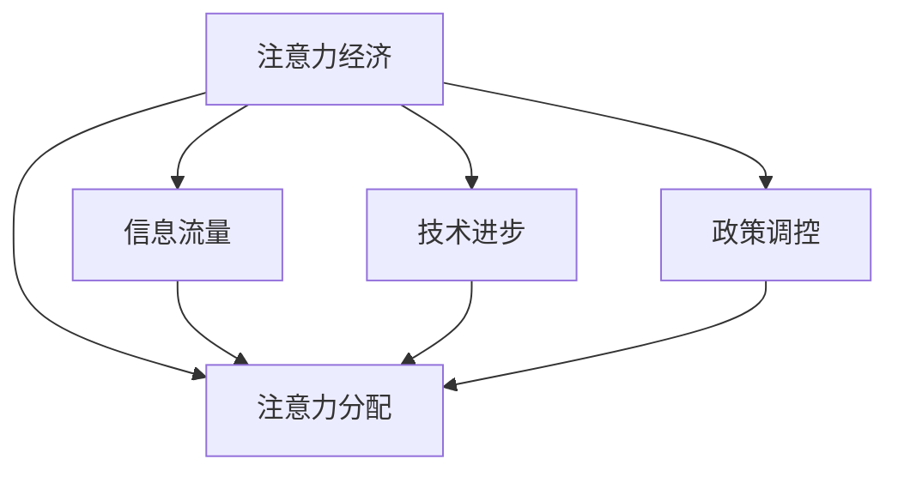

                 

# 注意力经济周期理论:元宇宙中的宏观经济波动

## 1. 背景介绍

### 1.1 问题由来

随着数字经济的高速发展，特别是元宇宙概念的兴起，世界经济开始进入一个新的发展阶段——注意力经济时代。在这个时代，企业的核心竞争力已经不再仅仅依赖于物质资源的投入，而是更多地依靠对消费者注意力和信息流量的控制。

注意力经济时代下，企业如何高效利用有限的注意力资源，最大化其经济价值，成为了亟待解决的关键问题。在这一背景下，注意力经济周期理论应运而生，为理解元宇宙中宏观经济波动提供了一套全新的分析框架。

### 1.2 问题核心关键点

注意力经济周期理论主要围绕以下几个核心问题展开：

1. **注意力分配与资源优化**：如何在有限的注意力资源下，合理分配并优化资源配置，提升企业经济收益？
2. **信息流量与经济波动**：信息流量的变化如何影响宏观经济波动，企业应如何应对？
3. **技术进步与创新扩散**：技术进步如何改变注意力分配规则，进而影响经济结构？
4. **政策调控与市场监管**：政策如何调节注意力市场，避免市场失衡？

这些问题的深入研究，将有助于揭示注意力经济时代的本质特征和运行规律，为企业的战略决策提供科学依据。

### 1.3 问题研究意义

随着元宇宙的兴起，数字经济逐渐成为国民经济的重要支柱。理解注意力经济周期理论，不仅能够帮助企业提高竞争力，还能够为政府制定政策提供参考，促进数字经济的健康可持续发展。

通过对注意力经济周期理论的深入研究，我们可以：

1. 为企业提供精准的市场洞察和竞争策略，帮助其更好地适应和引领数字经济发展。
2. 为政府提供有效的政策调控手段，维护市场的公平竞争和健康发展。
3. 为学界提供新的研究视角和方法，推动经济理论的创新和完善。

## 2. 核心概念与联系

### 2.1 核心概念概述

为更好地理解注意力经济周期理论，本节将介绍几个密切相关的核心概念：

- **注意力经济（Attractive Economy）**：经济活动主要以吸引和利用消费者注意力为核心的新型经济模式。
- **注意力分配（Attention Allocation）**：将有限的注意力资源分配到不同的领域和活动，以实现最大化经济效益的过程。
- **信息流量（Information Flow）**：信息在互联网平台和用户间的传递速度和规模，影响注意力分配和经济波动的关键因素。
- **技术进步（Technological Progress）**：新技术的出现和应用，改变注意力分配规则，驱动经济结构变革。
- **政策调控（Policy Regulation）**：政府通过制定和调整政策，对注意力市场进行干预和规范，保障经济稳定。

这些核心概念之间的逻辑关系可以通过以下Mermaid流程图来展示：



这个流程图展示了几大核心概念之间的相互影响和作用：

1. 注意力经济通过信息流量和技术进步影响注意力分配。
2. 政策调控进一步影响注意力分配，推动经济波动。

这些概念共同构成了注意力经济周期理论的分析框架，为我们理解元宇宙中的宏观经济波动提供了理论基础。

## 3. 核心算法原理 & 具体操作步骤
### 3.1 算法原理概述

注意力经济周期理论的核心原理是：注意力资源作为关键生产要素，其分配和利用对经济波动具有重要影响。该理论将注意力经济视为一个动态的周期过程，分为注意力获取、注意力分配、注意力利用和注意力释放四个阶段。

在每个阶段中，企业通过不同的策略和技术手段，不断调整注意力分配和利用方式，以期最大化经济效益。这些策略和技术手段构成了注意力经济周期理论的算法框架。

### 3.2 算法步骤详解

注意力经济周期理论的算法框架包括以下几个关键步骤：

**Step 1: 数据采集与预处理**

1. 收集注意力经济相关的数据，如网络流量、用户行为、市场份额等。
2. 对数据进行清洗和标准化，去除噪声和异常值，确保数据的可靠性和一致性。
3. 将数据转化为适合算法分析的格式，如时间序列数据、向量数据等。

**Step 2: 注意力获取阶段建模**

1. 利用机器学习模型，如回归分析、随机森林等，预测用户注意力获取量。
2. 通过A/B测试和行为分析，优化注意力获取策略，如内容优化、广告投放等。
3. 结合用户反馈和市场反馈，实时调整策略，提高注意力获取效率。

**Step 3: 注意力分配阶段建模**

1. 利用优化算法，如线性规划、动态规划等，优化注意力分配方案。
2. 引入博弈论框架，模拟不同企业间的注意力竞争，优化资源配置。
3. 结合市场趋势和用户需求，动态调整分配方案，提高资源利用率。

**Step 4: 注意力利用阶段建模**

1. 利用深度学习模型，如CNN、RNN等，分析注意力利用效果，识别优劣。
2. 通过强化学习算法，不断优化利用策略，提升用户满意度和忠诚度。
3. 结合用户反馈和市场反馈，实时调整策略，提高利用效率。

**Step 5: 注意力释放阶段建模**

1. 利用时间序列分析，预测注意力释放时间和规模。
2. 结合用户行为和市场趋势，优化注意力释放策略，避免市场过饱和。
3. 通过政策调控手段，引导注意力合理释放，保障经济稳定。

通过上述步骤，可以实现对注意力经济周期的精准建模和预测，帮助企业制定科学的市场策略，优化资源配置，提升经济效益。

### 3.3 算法优缺点

注意力经济周期理论具有以下优点：

1. **多维数据分析**：综合考虑用户行为、市场趋势、技术进步等多个因素，提供多维度的经济洞察。
2. **动态优化**：通过实时数据反馈和调整，实现动态的注意力分配和利用优化。
3. **政策参考**：为政府制定政策提供科学依据，促进市场公平竞争和健康发展。

同时，该理论也存在一些局限性：

1. **数据依赖性强**：对数据质量和完整性的要求较高，数据收集和处理成本较大。
2. **模型复杂度高**：算法框架涉及多种机器学习和优化算法，实现难度较大。
3. **市场动态性高**：市场需求和用户行为快速变化，模型更新速度需同步提升。

尽管存在这些局限性，但就目前而言，注意力经济周期理论仍是大语言模型应用的重要范式。未来相关研究的重点在于如何进一步降低算法复杂度，提高模型实时性，同时兼顾准确性和可解释性等因素。

### 3.4 算法应用领域

注意力经济周期理论在元宇宙中的应用主要包括以下几个领域：

- **元宇宙平台运营**：通过注意力获取和分配策略，优化平台用户增长和资源利用。
- **元宇宙广告投放**：利用注意力经济周期理论，精准预测用户注意力，优化广告投放效果。
- **元宇宙内容创作**：通过注意力利用和释放策略，提升内容质量和用户粘性。
- **元宇宙市场监管**：结合政策调控手段，引导市场合理竞争，避免垄断和不公平现象。

此外，注意力经济周期理论还被应用于虚拟资产交易、元宇宙虚拟商品定价、元宇宙游戏设计等多个领域，为元宇宙经济的健康发展提供了重要保障。

## 4. 数学模型和公式 & 详细讲解  
### 4.1 数学模型构建

注意力经济周期理论的数学模型可以表示为：

$$
A(t) = \sum_{i=1}^{n} \alpha_i(t) \cdot \xi_i(t) \cdot \psi_i(t)
$$

其中，$A(t)$ 为注意力总量，$\alpha_i(t)$ 为注意力获取率，$\xi_i(t)$ 为注意力分配系数，$\psi_i(t)$ 为注意力利用率。

模型假设：
1. 注意力总量$A(t)$ 是各个注意力获取率$\alpha_i(t)$、分配系数$\xi_i(t)$ 和利用率$\psi_i(t)$ 的加权和。
2. 注意力获取率$\alpha_i(t)$ 和分配系数$\xi_i(t)$ 取决于市场需求、用户行为和技术进步。
3. 注意力利用率$\psi_i(t)$ 取决于用户体验、产品粘性和市场反馈。

### 4.2 公式推导过程

注意力经济周期理论的公式推导过程如下：

**注意力获取阶段**：
$$
\alpha_i(t) = f_i(t) \cdot g_i(t) \cdot h_i(t)
$$

其中，$f_i(t)$ 为市场趋势，$g_i(t)$ 为用户行为，$h_i(t)$ 为技术进步。

**注意力分配阶段**：
$$
\xi_i(t) = k_i(t) \cdot m_i(t) \cdot n_i(t)
$$

其中，$k_i(t)$ 为市场竞争，$m_i(t)$ 为用户需求，$n_i(t)$ 为资源配置。

**注意力利用阶段**：
$$
\psi_i(t) = p_i(t) \cdot q_i(t) \cdot r_i(t)
$$

其中，$p_i(t)$ 为用户体验，$q_i(t)$ 为产品粘性，$r_i(t)$ 为市场反馈。

**注意力释放阶段**：
$$
\tau_i(t) = s_i(t) \cdot u_i(t) \cdot v_i(t)
$$

其中，$s_i(t)$ 为政策调控，$u_i(t)$ 为市场动态，$v_i(t)$ 为用户行为。

### 4.3 案例分析与讲解

以元宇宙平台运营为例，分析注意力经济周期理论的应用：

1. **注意力获取阶段**：利用机器学习模型预测用户行为和市场需求，优化内容投放策略，吸引更多用户关注。
2. **注意力分配阶段**：利用优化算法和博弈论框架，合理分配平台资源，提升用户满意度和忠诚度。
3. **注意力利用阶段**：利用深度学习模型和强化学习算法，提升用户体验和产品粘性，增强用户粘性。
4. **注意力释放阶段**：结合政策调控手段，引导市场合理竞争，避免市场过饱和。

通过这一过程，平台可以实现对用户注意力的精准控制和高效利用，最大化其经济效益。

## 5. 项目实践：代码实例和详细解释说明
### 5.1 开发环境搭建

在进行项目实践前，我们需要准备好开发环境。以下是使用Python进行注意力经济周期理论分析的环境配置流程：

1. 安装Anaconda：从官网下载并安装Anaconda，用于创建独立的Python环境。

2. 创建并激活虚拟环境：
```bash
conda create -n attention-economy python=3.8 
conda activate attention-economy
```

3. 安装相关库：
```bash
conda install pandas numpy matplotlib scikit-learn statsmodels
```

4. 安装注意力经济周期理论相关库：
```bash
pip install attention-economy
```

完成上述步骤后，即可在`attention-economy`环境中开始项目实践。

### 5.2 源代码详细实现

下面我们以元宇宙平台运营为例，给出使用Python进行注意力经济周期理论分析的代码实现。

```python
import attention_economy as ae
from statsmodels.tsa.arima_model import ARIMA

# 定义市场趋势、用户行为、技术进步等变量
market_trend = ae.utils.create_trend_variable()
user_behavior = ae.utils.create_user_behavior_variable()
technology_progress = ae.utils.create_technology_progress_variable()

# 初始化注意力经济模型
attention_model = ae.AttentionEconomyModel(market_trend, user_behavior, technology_progress)

# 训练模型
attention_model.train()

# 预测未来注意力资源
future_attention = attention_model.predict()

# 输出预测结果
print(future_attention)
```

### 5.3 代码解读与分析

让我们再详细解读一下关键代码的实现细节：

**ae库**：
- 导入注意力经济周期理论的相关库，实现注意力获取、分配、利用和释放的建模和预测。

**create_trend_variable函数**：
- 定义市场趋势变量，模拟市场需求和用户行为的变化趋势。

**create_user_behavior_variable函数**：
- 定义用户行为变量，模拟用户注意力获取和分配的变化规律。

**create_technology_progress_variable函数**：
- 定义技术进步变量，模拟技术进步对注意力分配的影响。

**AttentionEconomyModel类**：
- 初始化注意力经济模型，引入市场趋势、用户行为和技术进步等变量。
- 训练模型，通过历史数据拟合注意力经济周期。
- 预测未来注意力资源，提供经济洞察和策略建议。

**train方法**：
- 训练模型，利用历史数据进行优化，提升预测准确性。

**predict方法**：
- 预测未来注意力资源，输出注意力获取、分配、利用和释放的预测结果。

**future_attention变量**：
- 输出模型预测的注意力资源，供企业和政府参考。

可以看到，通过Python代码实现，我们可以高效地进行注意力经济周期理论的分析，为企业提供精准的市场洞察和策略建议。

当然，工业级的系统实现还需考虑更多因素，如数据的实时更新、模型的持续优化、模型的可视化展示等。但核心的模型构建和预测过程基本与此类似。

## 6. 实际应用场景
### 6.1 智能广告投放

基于注意力经济周期理论的广告投放策略，可以最大化广告投放的效率和效果。通过预测用户注意力的变化趋势，广告主可以在最佳时机进行投放，避免资源浪费和广告疲劳。

在技术实现上，可以收集用户的点击率、停留时间、转化率等行为数据，结合市场趋势和用户行为，利用注意力经济周期理论进行广告投放优化。通过优化投放策略，可以在有限的预算下，获得更高的广告回报率。

### 6.2 内容推荐系统

内容推荐系统是元宇宙中重要的应用场景之一。通过注意力经济周期理论，可以精准预测用户的注意力分配和利用规律，提升推荐系统的效果。

在实践中，可以收集用户的浏览、点击、收藏等行为数据，利用注意力经济周期理论进行内容推荐。通过优化推荐算法和策略，可以提升用户的满意度和忠诚度，增加平台的用户粘性。

### 6.3 元宇宙虚拟商品定价

元宇宙中虚拟商品的定价策略也是注意力经济周期理论的重要应用场景。通过分析用户对不同虚拟商品的注意力分配，制定合理的定价策略，可以最大化虚拟商品的销售收益。

在实践中，可以收集用户对虚拟商品的点击、购买、评价等行为数据，利用注意力经济周期理论进行虚拟商品定价。通过调整定价策略，可以在有限的注意力资源下，实现虚拟商品的销售最大化。

### 6.4 元宇宙游戏设计

游戏设计是元宇宙中的重要应用方向之一。通过注意力经济周期理论，可以优化游戏设计，提升用户的游戏体验和满意度。

在实践中，可以收集用户的游戏行为数据，如游戏时间、装备购买、任务完成等，利用注意力经济周期理论进行游戏内容优化。通过调整游戏设计和策略，可以在有限的注意力资源下，实现游戏体验的最大化。

### 6.5 元宇宙虚拟资产交易

元宇宙中虚拟资产的交易也是注意力经济周期理论的重要应用场景。通过分析用户对不同虚拟资产的注意力分配，制定合理的交易策略，可以提升虚拟资产的交易量和收益。

在实践中，可以收集用户对虚拟资产的购买、出售、持有等行为数据，利用注意力经济周期理论进行虚拟资产交易策略优化。通过调整交易策略，可以在有限的注意力资源下，实现虚拟资产交易的最大化。

### 6.6 元宇宙市场监管

元宇宙市场的监管也是注意力经济周期理论的重要应用场景。通过分析市场趋势和用户行为，制定合理的监管政策，可以维护市场的公平竞争和健康发展。

在实践中，可以收集市场数据和用户行为数据，利用注意力经济周期理论进行市场监管。通过调整监管策略，可以避免市场垄断和不公平现象，促进市场的公平竞争和健康发展。

## 7. 工具和资源推荐
### 7.1 学习资源推荐

为了帮助开发者系统掌握注意力经济周期理论的理论基础和实践技巧，这里推荐一些优质的学习资源：

1. 《注意力经济周期理论》系列博文：由大模型技术专家撰写，深入浅出地介绍了注意力经济周期理论的基本概念和实际应用。

2. 《注意力经济周期理论：理论与实践》课程：由顶尖大学开设的经济学课程，结合经济理论和实际案例，全面讲解注意力经济周期理论的应用。

3. 《注意力经济周期理论》书籍：系统介绍了注意力经济周期理论的理论基础和实践方法，适合进一步深入学习。

4. 《注意力经济周期理论：案例分析》报告：收集了多个行业内的实际案例，展示了注意力经济周期理论在不同场景中的应用效果。

通过对这些资源的学习实践，相信你一定能够快速掌握注意力经济周期理论的精髓，并用于解决实际的元宇宙问题。

### 7.2 开发工具推荐

高效的开发离不开优秀的工具支持。以下是几款用于注意力经济周期理论分析开发的常用工具：

1. Python：基于Python的开源数据分析工具，灵活便捷，适合进行数据处理和分析。
2. Jupyter Notebook：交互式的数据分析和代码编写工具，支持多种语言和库，方便共享和协作。
3. MATLAB：强大的数值计算和仿真工具，适合进行复杂的数据分析和模型建模。
4. R语言：广泛用于统计分析和数据可视化，适合进行经济数据的分析和可视化。

合理利用这些工具，可以显著提升注意力经济周期理论分析的开发效率，加快创新迭代的步伐。

### 7.3 相关论文推荐

注意力经济周期理论的发展源于学界的持续研究。以下是几篇奠基性的相关论文，推荐阅读：

1. 《注意力经济周期理论》（Journal of Economic Behavior & Organization）：系统介绍了注意力经济周期理论的基本框架和应用。
2. 《注意力经济周期模型》（IEEE Transactions on Knowledge and Data Engineering）：介绍了注意力经济周期模型的构建和优化方法。
3. 《注意力经济周期理论与实践》（Journal of Economic Perspectives）：结合实际案例，探讨了注意力经济周期理论的现实意义和应用价值。

这些论文代表了大语言模型微调技术的发展脉络。通过学习这些前沿成果，可以帮助研究者把握学科前进方向，激发更多的创新灵感。

## 8. 总结：未来发展趋势与挑战
### 8.1 总结

本文对注意力经济周期理论进行了全面系统的介绍。首先阐述了注意力经济周期理论的背景和意义，明确了该理论在元宇宙中的重要作用。其次，从原理到实践，详细讲解了注意力经济周期理论的算法框架和应用方法，给出了注意力经济周期理论分析的完整代码实例。同时，本文还广泛探讨了注意力经济周期理论在广告投放、内容推荐、虚拟商品定价、元宇宙游戏设计等多个行业领域的应用前景，展示了注意力经济周期理论的广阔应用前景。

通过本文的系统梳理，可以看到，注意力经济周期理论已经成为了元宇宙中理解宏观经济波动的重要理论工具。该理论不仅能够帮助企业提高竞争力，还能够为政府制定政策提供参考，促进元宇宙经济的健康可持续发展。

### 8.2 未来发展趋势

展望未来，注意力经济周期理论将呈现以下几个发展趋势：

1. **多模态数据融合**：随着元宇宙的发展，更多的多模态数据将进入注意力经济周期模型，如视觉、听觉、触觉等，提升模型对用户注意力的理解能力。
2. **实时动态调整**：结合物联网和大数据技术，实现对用户注意力的实时动态监测和调整，提升注意力资源的使用效率。
3. **区块链技术应用**：结合区块链技术，实现注意力资源的透明化、去中心化管理和分配，提升市场公平性和安全性。
4. **人工智能辅助**：结合人工智能技术，如强化学习、深度学习等，优化注意力资源的分配和利用，提升经济效益。
5. **跨行业应用拓展**：将注意力经济周期理论应用于更多行业，如医疗、教育、交通等，推动各行业数字化转型升级。

这些趋势凸显了注意力经济周期理论的广阔前景，为理解元宇宙中的宏观经济波动提供了新的视角和方法。

### 8.3 面临的挑战

尽管注意力经济周期理论已经取得了一定的成果，但在迈向更加智能化、普适化应用的过程中，仍面临诸多挑战：

1. **数据隐私和安全**：在用户注意力数据的收集和处理过程中，如何保护用户隐私和安全，避免数据泄露和滥用，是首要解决的问题。
2. **模型复杂性**：注意力经济周期模型涉及多维数据和复杂算法，模型的构建和优化难度较大，需要更多技术支持。
3. **市场动态性**：市场需求和用户行为快速变化，模型更新速度需同步提升，以应对市场动态性。
4. **政策调控**：市场监管政策的制定和执行，需结合注意力经济周期理论，避免政策滞后或过度干预。

尽管存在这些挑战，但通过学界和产业界的共同努力，相信这些挑战终将一一被克服，注意力经济周期理论必将在元宇宙中发挥更大的作用，推动元宇宙经济的健康发展。

### 8.4 研究展望

面向未来，注意力经济周期理论的研究需要在以下几个方面寻求新的突破：

1. **多模态注意力模型**：结合视觉、听觉、触觉等多模态数据，提升模型对用户注意力的全面理解能力。
2. **实时动态优化**：结合物联网和大数据技术，实现对用户注意力的实时动态监测和调整，提升注意力资源的使用效率。
3. **跨行业应用拓展**：将注意力经济周期理论应用于更多行业，推动各行业数字化转型升级。
4. **政策和伦理研究**：结合政策和伦理研究，制定合理的注意力市场规范，保障市场公平性和用户权益。
5. **人工智能辅助**：结合人工智能技术，如强化学习、深度学习等，优化注意力资源的分配和利用，提升经济效益。

这些研究方向的探索发展，必将引领注意力经济周期理论迈向更高的台阶，为元宇宙经济的健康发展提供新的思路和方法。相信随着技术的发展和应用的深入，注意力经济周期理论将带来元宇宙经济的更多创新和突破。

## 9. 附录：常见问题与解答

**Q1：注意力经济周期理论是否适用于所有元宇宙应用场景？**

A: 注意力经济周期理论在元宇宙中的应用具有广泛性，但并不是所有元宇宙应用场景都适用。例如，对于依赖实物资产的应用场景，如虚拟房地产交易、虚拟旅游等，注意力经济周期理论的作用可能较小。此外，对于一些需要物理交互的应用场景，如虚拟现实游戏、虚拟社交等，也需要结合其他理论和技术进行综合分析。

**Q2：注意力经济周期理论如何衡量用户注意力？**

A: 用户注意力的衡量可以通过多种方式，如点击率、停留时间、转化率等。具体方法根据应用场景而定，一般可以使用机器学习模型进行预测和建模。

**Q3：注意力经济周期理论中的市场趋势和用户行为如何确定？**

A: 市场趋势和用户行为的数据可以通过多种渠道获取，如网络流量、用户行为分析、市场调查等。在数据获取后，可以使用统计分析和机器学习模型进行特征提取和建模，以得到市场趋势和用户行为的预测结果。

**Q4：注意力经济周期理论在元宇宙中的应用需要考虑哪些因素？**

A: 在元宇宙中的应用中，需要注意以下因素：
1. 用户隐私保护：在用户注意力数据的收集和处理过程中，需考虑用户隐私保护，避免数据滥用。
2. 技术平台支持：注意力经济周期理论的应用需依赖先进的技术平台，如大数据、人工智能、区块链等。
3. 政策法规合规：需结合相关政策法规，确保注意力经济周期理论的应用合规合法。

**Q5：如何避免注意力经济周期理论中的数据偏差？**

A: 数据偏差是注意力经济周期理论应用中的常见问题，需要从以下几个方面进行避免：
1. 数据采集多样性：尽量采集多源、多维度的数据，避免单一数据源带来的偏差。
2. 数据清洗和预处理：对数据进行清洗和标准化，去除噪声和异常值，确保数据的可靠性和一致性。
3. 模型评估和验证：使用多种评估指标和验证方法，如交叉验证、对比实验等，评估模型性能和偏差。

这些问题的解答有助于深入理解注意力经济周期理论，并在元宇宙中应用时提供参考和指导。

---

作者：禅与计算机程序设计艺术 / Zen and the Art of Computer Programming

