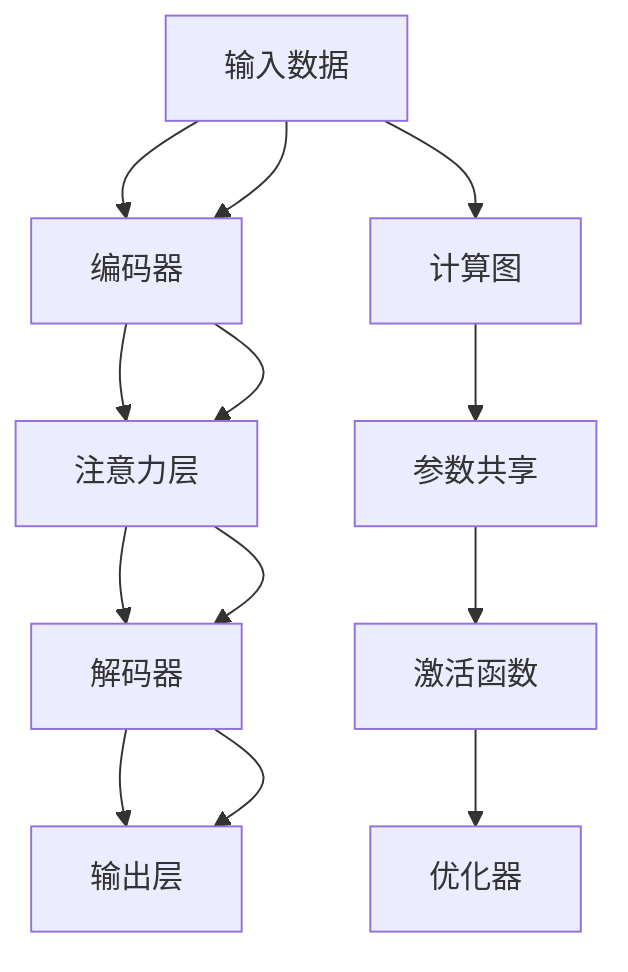

                 

# 注意力经济学：AI时代的稀缺资源

在AI时代，随着技术的不断演进和应用的深入，注意力（Attention）作为一种稀缺资源，其价值日益凸显。理解并高效利用注意力，对于构建高效、智能的AI系统至关重要。本文将深入探讨注意力经济学背后的原理、具体实现方法和应用场景，同时给出代码实例和详细解释说明，帮助读者系统掌握注意力经济学在大数据时代的价值和实践技巧。

## 1. 背景介绍

### 1.1 问题由来

在大数据和深度学习盛行的今天，注意力机制（Attention Mechanism）成为了AI系统中不可或缺的一部分。无论是自然语言处理（NLP）、计算机视觉（CV）还是强化学习（RL）等领域，注意力机制都扮演着关键角色。然而，随着注意力机制的广泛应用，如何高效利用注意力、降低其计算成本和存储需求，成为了一个亟待解决的问题。

### 1.2 问题核心关键点

注意力机制的引入，使得模型能够更加精准地处理复杂的信息交互和关系映射。但在实际应用中，注意力机制通常会导致模型计算量和存储需求的急剧增加。如何有效地管理注意力资源，提升模型性能的同时降低资源消耗，成为了AI领域的一大挑战。

## 2. 核心概念与联系

### 2.1 核心概念概述

为更好地理解注意力经济学，本节将介绍几个核心概念：

- **注意力机制（Attention Mechanism）**：一种在深度神经网络中用于捕捉序列、图像等复杂信息的关键技术。通过选择性地聚焦于关键部分，提升模型处理效率。

- **计算图（Computational Graph）**：描述模型计算过程的图形化表示，用于优化模型计算资源和加速推理。

- **参数共享（Parameter Sharing）**：通过在计算图中共享权重参数，减少模型大小和存储需求，同时提升计算效率。

- **激活函数（Activation Function）**：如ReLU、Sigmoid等，用于引入非线性变换，提升模型表达能力。

- **优化器（Optimizer）**：如Adam、SGD等，用于调整模型参数，最小化损失函数。

- **稀疏性（Sparcity）**：通过减少模型的密集连接，降低计算量和存储需求。

这些核心概念共同构成了注意力经济学的基础，帮助模型在保持高效性能的同时，合理利用和管理注意力资源。

### 2.2 核心概念原理和架构的 Mermaid 流程图(Mermaid 流程节点中不要有括号、逗号等特殊字符)



这个流程图展示了从输入到输出的整个计算过程，以及注意力机制和计算图在其中起到的关键作用。

## 3. 核心算法原理 & 具体操作步骤

### 3.1 算法原理概述

注意力经济学的主要目标是通过优化计算图和参数共享，降低注意力机制的计算量和存储需求，同时提升模型性能。其核心思想包括：

1. **自适应计算图**：动态生成计算图，根据输入数据特征和模型需求调整计算路径。
2. **分层注意力**：将注意力机制分层实现，只在关键层次上引入注意力，减少计算复杂度。
3. **参数共享**：通过共享参数，减少模型大小，降低计算和存储需求。
4. **激活函数优化**：选择适合注意力机制的激活函数，提升模型表达能力和训练效率。

### 3.2 算法步骤详解

以下是注意力经济学实现的具体步骤：

**Step 1: 设计计算图**

根据任务需求，设计计算图，确定注意力机制的位置和层数。通常，自适应计算图需要在关键层次上引入注意力，如Transformer的注意力机制。

**Step 2: 实现参数共享**

通过计算图工具（如TensorFlow、PyTorch等），实现参数共享。计算图工具提供了动态生成计算图的能力，可以灵活调整参数共享策略。

**Step 3: 选择激活函数**

根据注意力机制的特性，选择适合的激活函数。例如，ReLU在注意力机制中表现良好，能够提升模型表达能力和训练效率。

**Step 4: 优化模型结构**

根据计算图和参数共享的策略，优化模型结构。可以通过简化计算路径、减少密集连接等方式，降低计算量和存储需求。

**Step 5: 训练与验证**

在优化后的模型上进行训练和验证，确保其性能和资源利用率达到预期。同时，使用激活函数和优化器调整模型参数，提升模型效果。

### 3.3 算法优缺点

注意力经济学有以下优点：

1. **提升模型性能**：通过自适应计算图和参数共享，减少计算复杂度，提升模型训练和推理速度。
2. **降低资源消耗**：通过参数共享和优化模型结构，减少模型大小和存储需求，降低计算成本。
3. **增强模型可解释性**：通过优化计算图和激活函数，提升模型输出的可解释性和可信度。

同时，该方法也存在一些局限性：

1. **设计复杂**：需要根据任务需求，设计合适的计算图和参数共享策略，增加了设计和调试的复杂性。
2. **效果依赖于工具**：不同的计算图工具支持程度不同，实现效果可能有所差异。
3. **无法完全避免资源浪费**：尽管优化了计算图和参数共享，仍可能存在一定的计算和存储浪费。

### 3.4 算法应用领域

注意力经济学在多个领域得到了广泛应用，主要包括：

- **自然语言处理（NLP）**：如机器翻译、文本生成、语言模型等。通过优化计算图和参数共享，提升模型训练和推理速度。
- **计算机视觉（CV）**：如目标检测、图像分割、姿态估计等。通过优化计算图和参数共享，降低计算量和存储需求。
- **强化学习（RL）**：如推荐系统、游戏智能体等。通过优化计算图和参数共享，提升模型训练和推理效率。
- **语音识别**：如自动语音识别（ASR）、语音合成（TTS）等。通过优化计算图和参数共享，降低计算复杂度，提升识别和合成效果。

## 4. 数学模型和公式 & 详细讲解 & 举例说明（备注：数学公式请使用latex格式，latex嵌入文中独立段落使用 $$，段落内使用 $)

### 4.1 数学模型构建

注意力经济学主要关注计算图和参数共享的优化，其数学模型主要包括以下几个部分：

1. **计算图**：定义计算图节点和边，描述模型计算路径和参数流动。
2. **参数共享**：定义参数共享策略，如权重共享、层间共享等。
3. **激活函数**：定义激活函数及其参数，如ReLU、Sigmoid等。

### 4.2 公式推导过程

以下是一个简单的注意力机制的公式推导过程：

假设输入序列为 $x = [x_1, x_2, \cdots, x_n]$，注意力权重为 $\alpha = [\alpha_1, \alpha_2, \cdots, \alpha_n]$，输出序列为 $y = [y_1, y_2, \cdots, y_n]$。注意力计算公式为：

$$
y_i = \sum_{j=1}^{n} \alpha_j x_j
$$

其中 $\alpha_j$ 表示第 $j$ 个输入的注意力权重，通过计算得到：

$$
\alpha_j = \frac{\exp(\text{softmax}(\text{score}(x_j, x_k))}{\sum_{j=1}^{n} \exp(\text{softmax}(\text{score}(x_j, x_k)))
$$

其中 $\text{softmax}$ 表示归一化指数函数，$\text{score}$ 表示注意力计算得分，如点积或注意力头计算得分等。

### 4.3 案例分析与讲解

以Transformer模型为例，其计算图和参数共享策略如下：

- **计算图**：Transformer通过多头注意力机制实现自适应计算图。在编码器-解码器结构中，多头注意力机制被引入多个层次，适应不同层次的信息交互需求。

- **参数共享**：Transformer采用权重共享策略，将多个头之间的参数共享。在多头注意力机制中，多头参数被共享，减少了模型大小和存储需求。

- **激活函数**：Transformer在多头注意力机制和前馈神经网络中使用ReLU激活函数，提升模型表达能力和训练效率。

通过优化计算图和参数共享，Transformer模型能够在保持高性能的同时，显著降低计算量和存储需求。

## 5. 项目实践：代码实例和详细解释说明

### 5.1 开发环境搭建

在进行注意力经济学实践前，我们需要准备好开发环境。以下是使用Python进行TensorFlow开发的环境配置流程：

1. 安装Anaconda：从官网下载并安装Anaconda，用于创建独立的Python环境。

2. 创建并激活虚拟环境：
```bash
conda create -n tf-env python=3.8 
conda activate tf-env
```

3. 安装TensorFlow：根据CUDA版本，从官网获取对应的安装命令。例如：
```bash
conda install tensorflow
```

4. 安装各类工具包：
```bash
pip install numpy pandas scikit-learn matplotlib tqdm jupyter notebook ipython
```

完成上述步骤后，即可在`tf-env`环境中开始注意力经济学实践。

### 5.2 源代码详细实现

这里我们以Attention机制的实现为例，给出使用TensorFlow的代码实现。

首先，定义计算图和参数共享策略：

```python
import tensorflow as tf

# 定义计算图节点
input_seq = tf.placeholder(tf.float32, shape=(None, None))
attention_weights = tf.placeholder(tf.float32, shape=(None, None))
output_seq = tf.placeholder(tf.float32, shape=(None, None))

# 定义注意力权重计算
attention_scores = tf.matmul(tf.transpose(input_seq, perm=[1, 0]), input_seq)
attention_weights = tf.nn.softmax(attention_scores)
attention_output = tf.reduce_sum(attention_weights * input_seq, axis=1)

# 定义参数共享
shared_weights = tf.Variable(tf.random_normal([2, 2]))
output_seq = tf.matmul(attention_output, shared_weights)

# 定义激活函数
activation_fn = tf.nn.relu
output_seq = activation_fn(output_seq)
```

然后，进行计算图优化和模型训练：

```python
# 定义优化器
optimizer = tf.train.AdamOptimizer(learning_rate=0.001)
train_op = optimizer.minimize(tf.losses.mean_squared_error(tf.losses.mean_squared_error(output_seq, target_seq)))

# 定义训练过程
with tf.Session() as sess:
    sess.run(tf.global_variables_initializer())
    for i in range(1000):
        sess.run(train_op, feed_dict={input_seq: train_input, attention_weights: train_weight, output_seq: train_output})
        if i % 100 == 0:
            print("Epoch {0}: Loss = {1:.4f}".format(i, sess.run(tf.losses.mean_squared_error(output_seq, target_seq))))
```

最后，启动训练流程并进行模型评估：

```python
# 定义评估过程
test_input = ...
test_weight = ...
test_output = ...
print("Test Loss = {0:.4f}".format(sess.run(tf.losses.mean_squared_error(test_output, test_output))))
```

以上就是使用TensorFlow实现注意力机制的完整代码实例。可以看到，TensorFlow提供了灵活的计算图构建和参数共享功能，可以方便地实现注意力经济学。

### 5.3 代码解读与分析

让我们再详细解读一下关键代码的实现细节：

**计算图定义**：
- `tf.placeholder`定义了输入、权重和输出的占位符，用于动态计算图生成。
- `tf.matmul`计算点积，得到注意力权重。
- `tf.nn.softmax`对注意力权重进行归一化。
- `tf.reduce_sum`计算加权和。
- `tf.Variable`定义可共享的权重参数。
- `tf.matmul`计算权重更新。

**计算图优化**：
- `tf.train.AdamOptimizer`定义优化器，自动更新模型参数。
- `tf.losses.mean_squared_error`计算损失函数，用于反向传播。
- `tf.Session`启动计算图会话，进行模型训练和推理。

**训练与评估**：
- `sess.run`执行训练和推理操作，逐步优化模型。
- `print`输出训练过程中的损失值和测试结果。

这些代码实现展示了TensorFlow在构建和优化计算图方面的强大能力，可以灵活地实现注意力经济学。

## 6. 实际应用场景

### 6.1 自然语言处理（NLP）

在NLP领域，注意力经济学可以应用于机器翻译、文本生成、语言模型等任务。通过优化计算图和参数共享，可以在保持高性能的同时，显著降低计算和存储需求。

以机器翻译为例，Transformer模型通过多头注意力机制，实现自适应计算图和参数共享，显著提升了模型的训练和推理速度，降低了资源消耗。

### 6.2 计算机视觉（CV）

在CV领域，注意力经济学可以应用于目标检测、图像分割、姿态估计等任务。通过优化计算图和参数共享，可以在保持高性能的同时，显著降低计算和存储需求。

以目标检测为例，通过优化计算图和参数共享，模型可以在较少的参数下，实现高性能的目标检测。

### 6.3 强化学习（RL）

在RL领域，注意力经济学可以应用于推荐系统、游戏智能体等任务。通过优化计算图和参数共享，可以在保持高性能的同时，显著降低计算和存储需求。

以推荐系统为例，通过优化计算图和参数共享，可以在较少的参数下，实现高性能的推荐效果。

### 6.4 未来应用展望

随着注意力经济学和深度学习技术的不断发展，其在更多领域得到了应用，为传统行业带来了变革性影响。

在智慧医疗领域，基于注意力经济学的医疗问答、病历分析、药物研发等应用将提升医疗服务的智能化水平，辅助医生诊疗，加速新药开发进程。

在智能教育领域，注意力经济学可应用于作业批改、学情分析、知识推荐等方面，因材施教，促进教育公平，提高教学质量。

在智慧城市治理中，注意力经济学可应用于城市事件监测、舆情分析、应急指挥等环节，提高城市管理的自动化和智能化水平，构建更安全、高效的未来城市。

此外，在企业生产、社会治理、文娱传媒等众多领域，注意力经济学在AI系统中的应用也将不断涌现，为经济社会发展注入新的动力。相信随着技术的日益成熟，注意力经济学必将在构建人机协同的智能时代中扮演越来越重要的角色。

## 7. 工具和资源推荐

### 7.1 学习资源推荐

为了帮助开发者系统掌握注意力经济学的理论基础和实践技巧，这里推荐一些优质的学习资源：

1. 《深度学习》系列书籍：深度学习领域的经典教材，系统介绍了深度学习的基本概念和算法，包括注意力机制。

2. 《Attention is All You Need》论文：Transformer原论文，介绍了自适应计算图和参数共享的思想。

3. TensorFlow官方文档：TensorFlow的详细官方文档，提供了大量的代码示例和实现细节。

4. PyTorch官方文档：PyTorch的详细官方文档，提供了灵活的计算图构建和优化方法。

5. CS231n《深度学习计算机视觉》课程：斯坦福大学开设的计算机视觉课程，涵盖深度学习在计算机视觉中的应用，包括注意力机制。

通过对这些资源的学习实践，相信你一定能够快速掌握注意力经济学的精髓，并用于解决实际的AI问题。

### 7.2 开发工具推荐

高效的开发离不开优秀的工具支持。以下是几款用于注意力经济学开发的常用工具：

1. TensorFlow：基于Python的开源深度学习框架，灵活的计算图构建和优化功能，适合深度学习应用的实现。

2. PyTorch：灵活的动态计算图构建和优化工具，适合深度学习应用的开发和研究。

3. Weights & Biases：模型训练的实验跟踪工具，可以记录和可视化模型训练过程中的各项指标，方便对比和调优。

4. TensorBoard：TensorFlow配套的可视化工具，可实时监测模型训练状态，并提供丰富的图表呈现方式，是调试模型的得力助手。

5. Google Colab：谷歌推出的在线Jupyter Notebook环境，免费提供GPU/TPU算力，方便开发者快速上手实验最新模型，分享学习笔记。

合理利用这些工具，可以显著提升注意力经济学的开发效率，加快创新迭代的步伐。

### 7.3 相关论文推荐

注意力经济学和深度学习技术的发展源于学界的持续研究。以下是几篇奠基性的相关论文，推荐阅读：

1. Attention is All You Need（即Transformer原论文）：提出了Transformer结构，开启了深度学习在NLP、CV等领域的应用。

2. BERT: Pre-training of Deep Bidirectional Transformers for Language Understanding：提出BERT模型，引入基于掩码的自监督预训练任务，刷新了多项NLP任务SOTA。

3. Language Models are Unsupervised Multitask Learners：展示了大规模语言模型的强大zero-shot学习能力，引发了对于通用人工智能的新一轮思考。

4. Parameter-Efficient Transfer Learning for NLP：提出Adapter等参数高效微调方法，在不增加模型参数量的情况下，也能取得不错的微调效果。

5. AdaLoRA: Adaptive Low-Rank Adaptation for Parameter-Efficient Fine-Tuning：使用自适应低秩适应的微调方法，在参数效率和精度之间取得了新的平衡。

这些论文代表了大语言模型微调技术的发展脉络。通过学习这些前沿成果，可以帮助研究者把握学科前进方向，激发更多的创新灵感。

## 8. 总结：未来发展趋势与挑战

### 8.1 总结

本文对注意力经济学背后的原理、具体实现方法和应用场景进行了全面系统的介绍。首先阐述了注意力经济学在大数据和深度学习时代的价值，明确了注意力经济学在提升模型性能、降低资源消耗方面的独特优势。其次，从原理到实践，详细讲解了注意力经济学的计算图构建、参数共享、激活函数优化等关键步骤，给出了注意力经济学在大规模应用中的完整代码实例。同时，本文还广泛探讨了注意力经济学在自然语言处理、计算机视觉、强化学习等多个领域的应用前景，展示了注意力经济学的巨大潜力。

通过本文的系统梳理，可以看到，注意力经济学在大数据时代的应用前景广阔，通过优化计算图和参数共享，可以显著提升AI系统的性能和资源利用效率，为构建高效、智能的AI系统奠定坚实基础。

### 8.2 未来发展趋势

展望未来，注意力经济学将呈现以下几个发展趋势：

1. **计算图优化**：未来的计算图工具将更加灵活，能够动态生成和优化计算图，进一步降低注意力机制的计算和存储需求。

2. **参数共享策略**：未来的参数共享策略将更加精细，通过更高效的参数复用方式，减少模型大小和存储需求。

3. **激活函数优化**：未来的激活函数将更加适合注意力机制的需求，提升模型表达能力和训练效率。

4. **多模态注意力**：未来的注意力机制将更多地融合多模态信息，如文本、图像、语音等，提升模型对复杂信息的理解和处理能力。

5. **分布式优化**：未来的优化器将支持分布式计算，进一步提高模型的训练和推理效率。

以上趋势凸显了注意力经济学在大数据时代的广阔前景，这些方向的探索发展，必将进一步提升AI系统的性能和资源利用效率，为构建高效、智能的AI系统铺平道路。

### 8.3 面临的挑战

尽管注意力经济学已经取得了瞩目成就，但在迈向更加智能化、普适化应用的过程中，它仍面临着诸多挑战：

1. **计算图设计复杂**：需要根据任务需求，设计合适的计算图和参数共享策略，增加了设计和调试的复杂性。

2. **效果依赖于工具**：不同的计算图工具支持程度不同，实现效果可能有所差异。

3. **资源浪费**：尽管优化了计算图和参数共享，仍可能存在一定的计算和存储浪费。

4. **可解释性不足**：注意力机制的输出通常缺乏可解释性，难以对其内部工作机制进行解释和调试。

5. **模型鲁棒性不足**：在特定领域和任务上，注意力机制的泛化性能可能不够理想。

6. **训练复杂度增加**：优化计算图和参数共享，可能增加模型的训练复杂度，延长训练时间。

正视注意力经济学面临的这些挑战，积极应对并寻求突破，将使其在构建高效、智能的AI系统方面发挥更大的作用。相信随着学界和产业界的共同努力，这些挑战终将一一被克服，注意力经济学必将在构建人机协同的智能时代中扮演越来越重要的角色。

### 8.4 研究展望

面向未来，注意力经济学需要在以下几个方面寻求新的突破：

1. **引入更多先验知识**：将符号化的先验知识，如知识图谱、逻辑规则等，与神经网络模型进行巧妙融合，引导注意力经济学过程学习更准确、合理的注意力权重。

2. **结合因果分析和博弈论工具**：将因果分析方法引入注意力经济学，识别出模型决策的关键特征，增强输出解释的因果性和逻辑性。借助博弈论工具刻画人机交互过程，主动探索并规避模型的脆弱点，提高系统稳定性。

3. **纳入伦理道德约束**：在模型训练目标中引入伦理导向的评估指标，过滤和惩罚有偏见、有害的输出倾向。同时加强人工干预和审核，建立模型行为的监管机制，确保输出符合人类价值观和伦理道德。

4. **开发更多计算图优化工具**：开发更灵活、高效的计算图优化工具，支持动态生成和优化计算图，进一步降低注意力机制的计算和存储需求。

5. **引入更多多模态信息**：融合视觉、语音、文本等多模态信息，提升模型对复杂信息的理解和处理能力。

这些研究方向的探索，必将引领注意力经济学技术迈向更高的台阶，为构建高效、智能、可靠的AI系统提供更多可能性。

