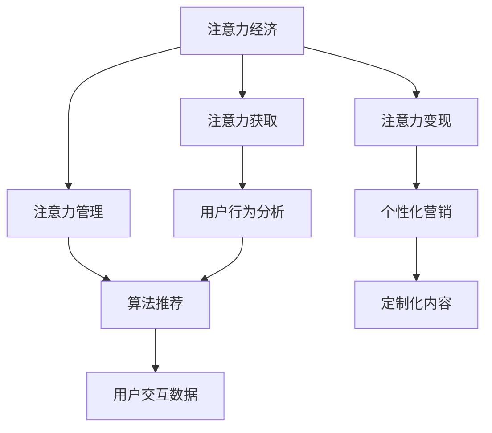

                 

## 1. 背景介绍

### 1.1 问题由来

在数字化转型浪潮下，注意力作为一种稀缺资源，其经济价值日益凸显。企业不再单纯依赖传统的资金、物资等要素驱动增长，而是转向对消费者注意力的争夺与利用，即所谓“注意力经济”。注意力经济的崛起，对企业组织结构产生了深远影响。

### 1.2 问题核心关键点

注意力经济的核心在于将企业的核心竞争优势从“生产能力”转移到“注意力获取与利用”上。具体体现在以下几个方面：
- **注意力获取**：通过广告、内容营销、社交媒体等渠道吸引用户注意力。
- **注意力管理**：通过数据分析、算法推荐等技术，优化用户注意力分配。
- **注意力变现**：通过精准营销、个性化服务等方式，实现注意力的商业化转化。

这些关键点不仅改变了企业的运营模式，也对传统组织结构提出了新的挑战与要求。

### 1.3 问题研究意义

研究注意力经济对企业组织结构的影响，对于理解数字化转型下的企业组织重构、优化运营效率、提升商业价值具有重要意义：
- **组织重构**：提供基于注意力经济的新型组织设计理念，指导企业应对市场变化。
- **运营优化**：探索注意力管理的最佳实践，提升营销与服务的精准性。
- **价值提升**：通过注意力变现模型，为企业创造新的盈利增长点。

## 2. 核心概念与联系

### 2.1 核心概念概述

为更好地理解注意力经济对企业组织结构的影响，本节将介绍几个密切相关的核心概念：

- **注意力经济**：基于消费者的注意力资源，通过商业化变现以获取经济价值的模式。
- **注意力获取**：通过各种营销手段，吸引用户关注。
- **注意力管理**：通过技术手段，优化用户注意力分配，提升用户体验。
- **注意力变现**：将用户注意力转化为实际的经济收益。
- **用户体验**：用户与企业互动过程中产生的感受和体验。

这些核心概念之间的逻辑关系可以通过以下Mermaid流程图来展示：



这个流程图展示了几大核心概念及其之间的关系：

1. 注意力经济以用户注意力为核心驱动，获取与管理注意力是关键环节。
2. 用户行为分析、算法推荐、个性化营销等技术手段，共同作用于注意力管理的各个环节。
3. 通过用户交互数据，优化算法推荐和个性化营销，提升用户体验，从而实现注意力变现。

这些概念共同构成了注意力经济的应用框架，使得企业在数字化转型过程中能够更高效地利用注意力资源，实现商业价值最大化。

## 3. 核心算法原理 & 具体操作步骤

### 3.1 算法原理概述

注意力经济中的关键算法原理主要基于以下几个核心概念：
- **用户行为分析**：通过日志、点击流、社交网络等数据，了解用户行为模式。
- **算法推荐**：基于协同过滤、内容推荐等技术，为用户推荐个性化的内容。
- **个性化营销**：通过数据分析和机器学习，实现精准投放。
- **注意力变现**：通过定价策略、广告优化等手段，实现注意力资源的商业化。

这些算法原理在注意力经济中扮演着重要角色，共同支撑着企业对用户注意力的高效管理与变现。

### 3.2 算法步骤详解

以下是注意力经济中核心算法的具体操作步骤：

**Step 1: 数据收集与预处理**
- 收集用户行为数据，包括点击行为、浏览记录、社交互动等。
- 清洗和预处理数据，去除噪声和异常值。

**Step 2: 用户行为分析**
- 使用机器学习算法，如决策树、随机森林等，分析用户行为模式。
- 识别出高价值用户群体，了解他们的兴趣、需求和行为特征。

**Step 3: 算法推荐**
- 使用协同过滤算法，如矩阵分解、向量空间模型等，为用户推荐个性化内容。
- 引入内容推荐算法，如TF-IDF、神经协同过滤等，提高推荐精准度。

**Step 4: 个性化营销**
- 通过聚类和分类算法，将用户进行细分，定制化营销方案。
- 使用回归和分类算法，预测用户行为和转化率，优化广告投放。

**Step 5: 注意力变现**
- 根据用户行为数据，设计多层次的定价策略，如会员制度、优惠券等。
- 使用A/B测试等技术，优化广告效果和用户参与度。

### 3.3 算法优缺点

注意力经济中的算法主要具有以下优点：
1. **个性化**：通过分析用户行为和需求，提供定制化内容和服务，提升用户体验。
2. **精准营销**：通过精准投放和推荐，实现高效率的商业转化。
3. **数据驱动**：利用大量数据和先进算法，提高决策科学性和效率。
4. **市场适应性强**：能够快速响应市场变化，适应不同的用户需求。

同时，这些算法也存在一定的局限性：
1. **数据隐私问题**：用户行为数据的收集和处理可能侵犯隐私，引发法律和道德问题。
2. **推荐算法偏见**：基于数据偏差的推荐算法可能导致不公平的结果。
3. **技术复杂性**：算法设计和实施需要较高的技术门槛，企业需要投入大量资源。
4. **模型更新难度**：用户行为和市场环境不断变化，模型需要定期更新，维护成本较高。

尽管存在这些局限性，但注意力经济中的算法在实现精准营销、优化用户体验等方面取得了显著效果，已成为数字化转型中的重要工具。

### 3.4 算法应用领域

注意力经济中的算法在多个领域得到了广泛应用，具体包括：

- **电子商务**：通过个性化推荐和精准营销，提升用户购买率和忠诚度。
- **内容平台**：如视频网站、社交媒体，通过算法推荐提高用户粘性。
- **金融服务**：通过用户行为分析，优化贷款审批和金融产品推荐。
- **旅游业**：通过个性化推荐和广告投放，提高用户预订和参与度。
- **娱乐行业**：通过数据驱动的内容推荐，提高用户观看率和满意度。

这些应用领域展示了注意力经济算法的多样性和广泛适用性，为企业提供了丰富的实践案例。

## 4. 数学模型和公式 & 详细讲解 & 举例说明

### 4.1 数学模型构建

本节将使用数学语言对注意力经济中的算法进行更加严格的刻画。

记用户行为数据集为 $D=\{(x_i, y_i)\}_{i=1}^N, x_i \in \mathbb{R}^d, y_i \in \{0,1\}$，其中 $x_i$ 为特征向量，$y_i$ 表示用户是否对 $x_i$ 产生行为（例如点击、购买等）。

定义用户行为分析模型为 $M_{\theta}$，其中 $\theta$ 为模型参数。则用户行为分析的目标是最小化预测错误，即：

$$
\min_{\theta} \frac{1}{N} \sum_{i=1}^N \ell(y_i, M_{\theta}(x_i))
$$

其中 $\ell$ 为预测错误的损失函数，如0-1损失、平方损失等。

算法推荐模型的输入为 $x_i$，输出为推荐内容 $c$，目标是最大化推荐内容的相关性。设推荐模型为 $R_{\phi}$，其中 $\phi$ 为模型参数。则推荐目标函数为：

$$
\max_{\phi} \sum_{i=1}^N r(y_i, R_{\phi}(x_i))
$$

其中 $r$ 为相关性的度量函数，如余弦相似度、皮尔逊相关系数等。

个性化营销模型 $P_{\lambda}$ 基于用户行为数据，预测用户未来的行为，目标函数为：

$$
\min_{\lambda} \frac{1}{N} \sum_{i=1}^N \ell(y_{i+1}, P_{\lambda}(x_i))
$$

其中 $y_{i+1}$ 为用户的未来行为，$\ell$ 为预测错误的损失函数。

注意力变现模型 $V_{\beta}$ 通过定价策略和广告优化，最大化注意力变现的收益，目标函数为：

$$
\max_{\beta} V_{\beta}(\mathcal{D}) = \int_{\Omega} v(x)d\mu(x)
$$

其中 $\Omega$ 为行为空间，$v(x)$ 为不同行为的价值函数，$\mu$ 为行为分布。

### 4.2 公式推导过程

以下我们以个性化推荐为例，推导基于协同过滤的推荐模型的具体计算过程。

假设用户对物品的评分数据为 $M_{ij} \in \{0,1,2,\cdots,N\}$，其中 $i$ 为用户，$j$ 为物品。推荐模型 $R_{\phi}$ 的输入为用户特征向量 $x_i$，输出为物品 $j$ 的评分 $c_j$。

协同过滤算法基于用户-物品评分矩阵 $R$，通过矩阵分解技术，将矩阵分解为用户特征矩阵 $U$ 和物品特征矩阵 $V$。设分解后的矩阵为 $R = UV$，则推荐目标函数为：

$$
\min_{U,V} ||R - UV||_F^2
$$

其中 $||\cdot||_F$ 为矩阵的Frobenius范数。通过优化上述目标函数，可以求得最优的 $U$ 和 $V$，进而得到推荐评分 $c_j = U_iV_j^T$。

具体计算步骤如下：
1. 对用户-物品评分矩阵 $R$ 进行SVD分解，得到 $U$ 和 $V$。
2. 根据用户特征向量 $x_i$ 和物品特征向量 $V$，计算推荐评分 $c_j = U_iV_j^T$。
3. 将推荐评分 $c_j$ 归一化处理，得到最终的推荐物品。

### 4.3 案例分析与讲解

以电子商务平台为例，分析注意力经济中算法的实际应用。

假设一家电子商务平台通过用户行为分析，识别出高价值用户群体，并对其进行个性化推荐。平台收集用户浏览、点击、购买等行为数据，分析用户行为模式，并使用协同过滤算法进行推荐。具体步骤如下：
1. 收集用户行为数据，清洗和预处理数据。
2. 通过协同过滤算法，对用户进行细分，识别出高价值用户。
3. 对高价值用户进行个性化推荐，提升其购买率。
4. 通过A/B测试，优化广告投放效果，提升用户参与度。

通过上述步骤，平台实现了基于用户注意力的精准营销，显著提升了用户满意度和转化率。

## 5. 项目实践：代码实例和详细解释说明

### 5.1 开发环境搭建

在进行注意力经济相关的项目实践前，我们需要准备好开发环境。以下是使用Python进行开发的环境配置流程：

1. 安装Anaconda：从官网下载并安装Anaconda，用于创建独立的Python环境。

2. 创建并激活虚拟环境：
```bash
conda create -n attention-env python=3.8 
conda activate attention-env
```

3. 安装相关库：
```bash
pip install pandas numpy scikit-learn joblib tqdm
```

4. 安装机器学习框架：
```bash
pip install scikit-learn joblib
```

完成上述步骤后，即可在`attention-env`环境中开始实践。

### 5.2 源代码详细实现

下面我们以电子商务平台的个性化推荐系统为例，给出使用Scikit-learn实现协同过滤算法的代码实现。

```python
from sklearn.decomposition import TruncatedSVD
from sklearn.metrics.pairwise import cosine_similarity
import numpy as np
import pandas as pd

# 加载数据集
data = pd.read_csv('user_item_ratings.csv', sep=',', header=None)
user_ids = data[0].tolist()
item_ids = data[1].tolist()
ratings = data[2].tolist()

# 构建用户-物品评分矩阵
R = np.zeros((len(user_ids), len(item_ids)))
for i in range(len(user_ids)):
    for j in range(len(item_ids)):
        R[i][j] = ratings[i][j]

# 使用TruncatedSVD进行矩阵分解
svd = TruncatedSVD(n_components=50, random_state=42)
U = svd.fit_transform(R)

# 计算推荐评分
V = svd.components_
scores = np.dot(U, V.T)

# 获取推荐物品
top_n = 10
user_ids = np.random.choice(len(user_ids), size=100, replace=False)
for user_id in user_ids:
    top_items = np.argsort(scores[user_id])[-top_n:]
    print(f'推荐物品：{top_items}')
```

在这个代码示例中，我们使用了Scikit-learn库中的TruncatedSVD算法，对用户-物品评分矩阵进行SVD分解，得到用户和物品的特征向量。通过计算推荐评分，最终得到用户的推荐物品。

### 5.3 代码解读与分析

让我们再详细解读一下关键代码的实现细节：

**数据加载与预处理**：
- 使用pandas库读取用户行为数据，进行数据清洗和预处理。
- 构建用户-物品评分矩阵 $R$，并将其归一化处理，以便进行后续计算。

**矩阵分解与特征提取**：
- 使用TruncatedSVD算法对评分矩阵 $R$ 进行SVD分解，得到用户特征矩阵 $U$ 和物品特征矩阵 $V$。
- 通过计算 $U$ 和 $V$ 的乘积，得到推荐评分矩阵 $S$。

**推荐物品获取**：
- 通过选择评分矩阵 $S$ 中用户评分最高的物品，进行推荐。

可以看到，Scikit-learn库提供了强大的机器学习工具，使得算法实现变得相对简单。但工业级的系统实现还需考虑更多因素，如模型选择、超参数调优、特征工程等，这些都需要开发者根据具体任务进行精心设计。

## 6. 实际应用场景

### 6.1 智能客服系统

基于注意力经济中的算法，企业可以构建智能客服系统，提升客户服务体验和效率。智能客服系统通过收集用户互动数据，分析用户行为，实现个性化推荐和自动化答复。具体应用如下：
- **用户行为分析**：通过NLP技术，分析用户提问内容，识别出用户情绪和需求。
- **算法推荐**：根据用户行为数据，推荐相应的知识库和模板。
- **个性化答复**：通过NLP和机器学习技术，生成个性化的回答。

通过以上步骤，智能客服系统能够实现高效的自动化服务，提升客户满意度和使用频率。

### 6.2 金融风险管理

金融行业对用户注意力的管理尤为关键。通过注意力经济中的算法，金融企业可以实现风险预警和精准营销。具体应用如下：
- **用户行为分析**：通过金融交易数据，分析用户行为模式和交易风险。
- **算法推荐**：根据用户行为和交易数据，推荐适合的金融产品。
- **个性化营销**：通过个性化推荐和精准投放，提升用户参与度和转化率。

通过上述应用，金融企业能够更有效地管理用户注意力，降低风险，提升收益。

### 6.3 健康管理平台

健康管理平台通过个性化推荐和精准营销，提升用户健康管理和疾病预防的意识和行为。具体应用如下：
- **用户行为分析**：通过健康数据和行为记录，分析用户健康状况和行为模式。
- **算法推荐**：根据用户健康数据，推荐个性化的健康建议和计划。
- **个性化营销**：通过个性化的内容推荐和精准投放，提升用户参与度和健康行为。

通过这些应用，健康管理平台能够更有效地引导用户健康行为，提升用户健康水平。

### 6.4 未来应用展望

随着注意力经济和算法技术的不断发展，未来的应用场景将更加多样化，涵盖更多行业和领域。以下是一些未来的展望：

1. **智能家居**：通过个性化推荐和精准营销，提升用户居家体验和产品满意度。
2. **智能交通**：通过用户行为分析和推荐，优化交通规划和服务，提升用户体验。
3. **智能教育**：通过个性化推荐和精准投放，提升教育资源分配的公平性和效率。
4. **智慧城市**：通过用户行为分析和推荐，优化城市管理和服务，提升居民生活质量。

这些应用场景展示了注意力经济和算法技术的广阔前景，为数字化转型提供了新的方向和可能性。

## 7. 工具和资源推荐

### 7.1 学习资源推荐

为了帮助开发者系统掌握注意力经济和算法的理论基础和实践技巧，这里推荐一些优质的学习资源：

1. **机器学习与数据挖掘**：这是一门由清华大学举办的在线课程，介绍了机器学习的基本概念和算法，适合初学者入门。
2. **深度学习与NLP**：由斯坦福大学和微软联合开发的课程，深入讲解了深度学习和自然语言处理的技术和应用。
3. **推荐系统原理与算法**：这是一本经典的推荐系统书籍，详细介绍了推荐系统的理论基础和算法实现。
4. **《Python数据科学手册》**：这是一本全面的数据科学入门书籍，涵盖数据处理、机器学习、数据可视化等多个方面。
5. **Kaggle竞赛平台**：这是一个知名的数据科学竞赛平台，提供了大量的实际应用案例和算法挑战，适合实践训练。

通过对这些资源的学习实践，相信你一定能够快速掌握注意力经济和算法的精髓，并用于解决实际的商业问题。

### 7.2 开发工具推荐

高效的开发离不开优秀的工具支持。以下是几款用于注意力经济和算法开发常用的工具：

1. **Python**：作为数据科学和机器学习的主流编程语言，Python拥有丰富的库和工具，适合各种应用场景。
2. **R语言**：主要用于数据分析和统计，拥有强大的数据处理能力和可视化工具。
3. **Scikit-learn**：一个流行的机器学习库，提供了丰富的算法实现和工具支持。
4. **TensorFlow**：谷歌开源的深度学习框架，支持大规模分布式计算和高效模型训练。
5. **PyTorch**：一个灵活的深度学习框架，支持动态计算图和模型部署。

合理利用这些工具，可以显著提升注意力经济和算法的开发效率，加快创新迭代的步伐。

### 7.3 相关论文推荐

注意力经济和算法技术的不断发展，得益于学界的持续研究。以下是几篇奠基性的相关论文，推荐阅读：

1. **推荐系统：基础和趋势**：介绍了推荐系统的基本概念和应用，是领域内经典文献之一。
2. **协同过滤算法**：介绍了协同过滤算法的原理和实现方法，是推荐系统中的核心算法之一。
3. **深度学习在推荐系统中的应用**：探讨了深度学习在推荐系统中的各种应用，包括CTR预测、序列推荐等。
4. **用户行为分析**：介绍了用户行为分析的基本方法和技术，是注意力经济中的关键环节。
5. **个性化推荐系统**：详细介绍了个性化推荐系统的构建方法和实践案例，是领域内权威综述之一。

这些论文代表了大数据和算法技术的最新进展，通过学习这些前沿成果，可以帮助研究者把握学科前进方向，激发更多的创新灵感。

## 8. 总结：未来发展趋势与挑战

### 8.1 总结

本文对注意力经济中的核心算法进行了全面系统的介绍。首先阐述了注意力经济的核心概念和原理，明确了算法在注意力管理中的重要作用。其次，从原理到实践，详细讲解了注意力经济中的算法实现，给出了具体的代码实例。同时，本文还广泛探讨了算法的应用场景，展示了其广泛适用性。

通过本文的系统梳理，可以看到，注意力经济和算法技术正在成为数字化转型中的重要工具，极大地提升企业的运营效率和商业价值。未来，伴随技术不断演进，这些技术将进一步拓展应用领域，为各行业带来更多的变革性影响。

### 8.2 未来发展趋势

展望未来，注意力经济和算法技术将呈现以下几个发展趋势：

1. **自动化与智能化**：通过自动化和智能化技术，提升算法的效率和精度，减少人工干预。
2. **跨领域应用**：将算法技术应用于更多领域，如智能家居、智能交通、智慧城市等，推动各行业数字化转型。
3. **深度学习融合**：将深度学习技术引入算法模型，提升推荐和分析的准确性。
4. **数据融合与互联**：实现多源数据的融合与互联，提升用户行为分析的全面性和准确性。
5. **个性化与定制化**：通过用户行为分析和个性化推荐，提升用户体验和满意度。

这些趋势凸显了注意力经济和算法技术的广阔前景，为数字化转型提供了新的方向和可能性。

### 8.3 面临的挑战

尽管注意力经济和算法技术已经取得了显著成果，但在迈向更加智能化、普适化应用的过程中，仍面临诸多挑战：

1. **数据隐私问题**：用户行为数据的收集和处理可能侵犯隐私，引发法律和道德问题。
2. **算法偏见**：基于数据偏差的算法可能导致不公平的结果，增加社会不平等。
3. **技术复杂性**：算法设计和实施需要较高的技术门槛，企业需要投入大量资源。
4. **模型更新难度**：用户行为和市场环境不断变化，模型需要定期更新，维护成本较高。
5. **用户信任与接受度**：用户对算法的接受度和使用意愿可能较低，影响效果。

尽管存在这些挑战，但随着技术不断发展和应用成熟，这些难题有望逐步解决。通过多学科交叉合作，实现技术与社会、伦理的良性互动，注意力经济和算法技术将迎来更加广泛的应用前景。

### 8.4 研究展望

面对注意力经济和算法技术所面临的挑战，未来的研究需要在以下几个方面寻求新的突破：

1. **隐私保护技术**：研究数据保护和隐私技术，确保用户数据的安全和隐私。
2. **公平性算法**：开发公平性算法，减少数据偏差，提高算法的公平性和透明性。
3. **自动化与智能化**：通过自动化和智能化技术，提升算法的效率和精度。
4. **跨领域应用**：将算法技术应用于更多领域，推动各行业的数字化转型。
5. **人机协作**：研究人机协作机制，提升用户对算法的信任和接受度。

这些研究方向将进一步拓展注意力经济和算法技术的应用边界，推动技术与社会、伦理的良性互动，实现更广泛的社会价值。

## 9. 附录：常见问题与解答

**Q1：注意力经济对企业组织结构的影响主要体现在哪些方面？**

A: 注意力经济对企业组织结构的影响主要体现在以下几个方面：
1. **部门重构**：将注意力获取与管理部门作为核心部门，整合营销、技术、数据等多个职能。
2. **团队协作**：通过跨部门协作，实现用户行为分析和推荐。
3. **激励机制**：引入KPI和OKR等激励机制，鼓励团队成员专注于注意力变现。

**Q2：注意力经济中的算法如何提升用户体验？**

A: 注意力经济中的算法通过以下方式提升用户体验：
1. **个性化推荐**：根据用户行为和兴趣，推荐个性化的内容和服务。
2. **精准营销**：通过数据分析和算法推荐，实现精准投放，提升用户参与度和满意度。
3. **实时互动**：通过智能客服和个性化服务，提升用户互动体验。

**Q3：企业在实施注意力经济时，需要注意哪些问题？**

A: 企业在实施注意力经济时，需要注意以下问题：
1. **数据隐私**：合理收集和处理用户数据，确保数据安全和隐私保护。
2. **算法透明性**：提高算法的透明性和可解释性，增强用户信任。
3. **公平性**：确保算法的公平性，避免数据偏见和算法偏见。
4. **技术可扩展性**：选择可扩展性强的技术和工具，适应快速变化的市场需求。

**Q4：如何评估注意力经济中的算法效果？**

A: 评估注意力经济中的算法效果主要通过以下指标：
1. **点击率**：衡量推荐系统的效果，反映用户对推荐的兴趣。
2. **转化率**：衡量推荐系统的商业效果，反映用户对推荐的购买行为。
3. **用户满意度**：通过问卷调查和用户反馈，评估用户对推荐系统和服务的使用满意度。
4. **用户留存率**：衡量用户对平台的粘性，反映推荐系统的长期效果。

**Q5：注意力经济中，如何应对数据隐私问题？**

A: 在注意力经济中，应对数据隐私问题主要通过以下措施：
1. **数据匿名化**：对用户数据进行匿名化处理，确保数据无法识别个体身份。
2. **数据加密**：对数据进行加密存储和传输，防止数据泄露。
3. **合规审查**：遵守相关法律法规，如GDPR、CCPA等，确保数据合规使用。
4. **用户控制**：提供用户数据访问和控制权限，增强用户隐私保护。

这些措施能够有效应对数据隐私问题，保障用户数据安全，提升用户信任度。

---

作者：禅与计算机程序设计艺术 / Zen and the Art of Computer Programming

