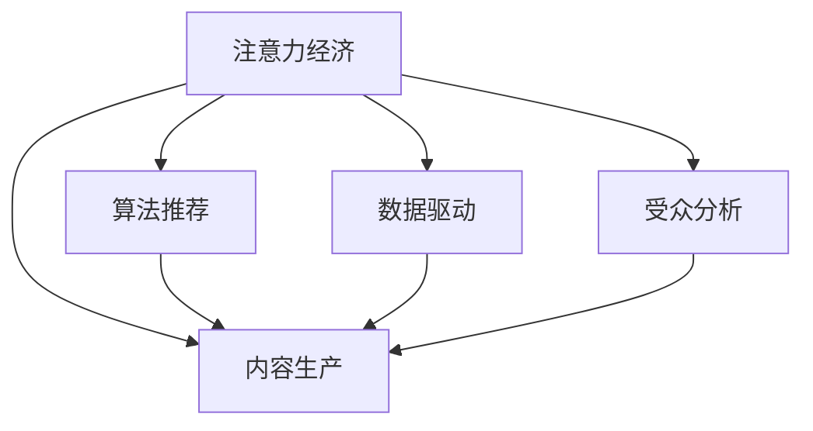

                 

# 注意力经济对传统媒体内容生产的影响

> 关键词：注意力经济, 内容生产, 算法推荐, 数据驱动, 受众分析

## 1. 背景介绍

随着互联网和数字技术的迅猛发展，信息过载成为了一个全球性问题。在爆炸式增长的海量信息面前，用户的时间和注意力成了最为宝贵的资源。因此，如何将有限的注意力有效转化为经济效益，成为了一个令人深思的问题。传统媒体机构面临着巨大的转型压力，必须找到新的途径，以提升内容生产效率和市场竞争力。在这样的背景下，“注意力经济”（Attention Economy）的概念应运而生，它强调以用户注意力为中心，通过算法推荐和数据驱动的方式，优化内容生产和传播，从而实现更高效、更精准、更个性化的信息匹配和价值创造。

## 2. 核心概念与联系

### 2.1 核心概念概述

为更好地理解注意力经济对传统媒体内容生产的影响，本节将介绍几个核心概念：

- **注意力经济（Attention Economy）**：是指在信息过载的时代，通过优化信息分配，将用户注意力有效转化为经济价值的经济模式。在媒体领域，主要表现为通过精准的算法推荐，将用户有限的注意力吸引到高质量内容上，从而提高内容价值和传播效率。

- **内容生产（Content Production）**：指媒体机构制作、编辑、传播新闻、文章、视频、音频等各类信息内容的整个过程。随着数字技术的发展，内容生产方式正在从传统的线性编辑向协同、智能化方向转变。

- **算法推荐（Algorithm Recommendation）**：利用机器学习算法，根据用户的历史行为、偏好、兴趣等信息，自动推荐相关内容。通过持续迭代优化，算法推荐能够更好地满足用户的个性化需求，提高用户满意度。

- **数据驱动（Data-Driven）**：指通过收集、分析海量用户数据，了解用户行为模式和偏好，指导内容生产和传播策略。数据驱动不仅提高了内容生产的精准性和有效性，还为个性化推荐提供了坚实基础。

- **受众分析（Audience Analysis）**：通过分析用户的年龄、性别、地理位置、兴趣等特征，精准定位目标受众，指导内容定制和广告投放策略。受众分析使得媒体机构能够更精准地触达用户，提升用户粘性和转化率。

这些核心概念之间的逻辑关系可以通过以下Mermaid流程图来展示：



这个流程图展示了注意力经济与其他核心概念之间的联系：注意力经济通过算法推荐、数据驱动和受众分析，指导内容生产，最终实现用户注意力的有效转化。

## 3. 核心算法原理 & 具体操作步骤

### 3.1 算法原理概述

注意力经济的本质是通过算法推荐技术，将用户有限的注意力资源进行有效分配，转化为经济价值。其核心思想是利用机器学习算法，分析用户行为数据，预测用户兴趣和需求，从而实现内容的高效匹配和传播。以下是基于注意力经济的算法推荐流程：

1. **用户画像构建**：收集用户的历史行为数据（如浏览记录、点击次数、评分等），利用聚类、分类等算法，构建用户画像，了解用户的兴趣偏好。
2. **内容标签提取**：对内容进行文本分析、图像识别等处理，提取内容特征，生成内容标签。
3. **相似度计算**：利用向量空间模型、余弦相似度等方法，计算内容标签之间的相似度。
4. **排序算法设计**：设计排序算法（如协同过滤、深度学习模型等），根据相似度排序，推荐与用户画像匹配度高的内容。
5. **持续优化**：利用在线学习、增量学习等技术，不断迭代优化推荐模型，提升推荐效果。

### 3.2 算法步骤详解

以协同过滤算法为例，详细讲解算法步骤：

**Step 1: 用户画像构建**

收集用户历史行为数据，构建用户画像。假设用户集为 $U$，每个用户的历史行为数据为一个向量 $x_i$，其中 $i \in U$。

**Step 2: 内容标签提取**

对内容进行预处理，提取内容特征。假设内容集为 $I$，每个内容的历史行为数据为一个向量 $y_j$，其中 $j \in I$。

**Step 3: 相似度计算**

计算用户和内容之间的相似度。假设 $x_i$ 和 $y_j$ 的相似度为 $s_{ij}$，利用余弦相似度公式：

$$
s_{ij} = \frac{\sum_{k=1}^{n} x_{ik}y_{jk}}{\sqrt{\sum_{k=1}^{n} x_{ik}^2}\sqrt{\sum_{k=1}^{n} y_{jk}^2}}
$$

**Step 4: 排序算法设计**

设计协同过滤算法，推荐与用户画像匹配度高的内容。假设用户 $i$ 对内容 $j$ 的兴趣度为 $p_{ij}$，利用协同过滤公式：

$$
p_{ij} = \frac{s_{ij}\sum_{k=1}^{n} y_{kj}}{\sum_{k=1}^{n} s_{ik}y_{kj}}
$$

**Step 5: 持续优化**

通过在线学习等技术，不断迭代优化推荐模型。例如，使用梯度下降算法，最小化预测误差，更新模型参数。

### 3.3 算法优缺点

基于注意力经济的算法推荐具有以下优点：

- **高效性**：通过算法推荐，能够快速匹配用户兴趣和内容，减少用户搜索和筛选的时间成本。
- **精准性**：算法推荐能够根据用户历史行为和兴趣，提供个性化的推荐结果，提高用户满意度。
- **可扩展性**：算法推荐技术可以轻松应用于各种内容形式，如文字、图片、视频等。
- **实时性**：通过在线学习等技术，推荐模型能够实时更新，适应用户行为变化。

同时，该方法也存在一些局限性：

- **数据依赖性**：算法推荐的准确性很大程度上取决于用户数据的丰富程度。数据稀疏或噪声较多的情况下，推荐效果会大打折扣。
- **冷启动问题**：新用户或新内容的推荐效果往往较差，需要通过其他方式进行引导和补充。
- **算法复杂性**：高阶算法（如深度学习模型）的计算和存储成本较高，需要高性能设备和算力支持。
- **隐私问题**：算法推荐需要收集和分析大量用户数据，存在隐私泄露的风险。

尽管存在这些局限性，但基于注意力经济的算法推荐目前已经成为提高内容生产效率和市场竞争力的重要手段。未来相关研究将集中在如何更好地平衡效率和隐私、解决冷启动问题等方面。

### 3.4 算法应用领域

基于注意力经济的算法推荐已经广泛应用于以下领域：

- **新闻媒体**：通过个性化推荐，提升新闻阅读量和用户粘性。如《纽约时报》、《卫报》等媒体，利用推荐算法推荐新闻文章，显著提高了用户留存率。
- **视频平台**：如Netflix、YouTube等视频平台，通过推荐算法为用户推荐视频内容，显著提升了用户观看时间和平台使用频率。
- **音乐平台**：如Spotify、网易云音乐等音乐平台，通过推荐算法为用户推荐歌曲和播放列表，提高了用户音乐消费体验。
- **电子商务**：如Amazon、淘宝等电商平台，通过推荐算法为用户推荐商品，显著提升了销售额和用户购买转化率。

除了上述这些经典应用外，算法推荐还被创新性地应用于更多场景中，如智能家居、智能穿戴设备等，为数字经济的各个领域带来了新的突破。随着推荐技术的不断进步，未来算法推荐将在更多场景中发挥重要作用。

## 4. 数学模型和公式 & 详细讲解  
### 4.1 数学模型构建

本节将使用数学语言对基于注意力经济的算法推荐过程进行更加严格的刻画。

记用户集为 $U$，内容集为 $I$，用户对内容的兴趣度矩阵为 $P \in \mathbb{R}^{m \times n}$，其中 $m=|U|$ 为用户数，$n=|I|$ 为内容数。假设用户 $i$ 对内容 $j$ 的兴趣度为 $p_{ij}$，内容 $j$ 的历史行为数据为 $y_j$，用户 $i$ 的历史行为数据为 $x_i$。

定义内容标签提取函数 $f_j(y_j)$，将内容 $y_j$ 映射为特征向量。

假设用户画像和内容标签之间的相似度为 $s_{ij}$，利用余弦相似度公式：

$$
s_{ij} = \frac{\sum_{k=1}^{n} x_{ik}f_j(y_{jk})}{\sqrt{\sum_{k=1}^{n} x_{ik}^2}\sqrt{\sum_{k=1}^{n} f_j(y_{jk})^2}}
$$

定义协同过滤公式 $p_{ij}$：

$$
p_{ij} = \frac{s_{ij}\sum_{k=1}^{n} y_{kj}}{\sum_{k=1}^{n} s_{ik}y_{kj}}
$$

通过迭代优化算法，不断更新用户画像和内容标签，最终得到最优推荐结果。

### 4.2 公式推导过程

以协同过滤算法为例，推导其数学原理。

假设用户画像和内容标签之间的相似度矩阵为 $S \in \mathbb{R}^{m \times n}$，协同过滤公式为 $P \in \mathbb{R}^{m \times n}$。定义内容标签提取函数 $f_j(y_j)$，将内容 $y_j$ 映射为特征向量。

**Step 1: 相似度矩阵计算**

利用余弦相似度公式，计算用户画像和内容标签之间的相似度矩阵 $S$：

$$
S_{ij} = \frac{\sum_{k=1}^{n} x_{ik}f_j(y_{jk})}{\sqrt{\sum_{k=1}^{n} x_{ik}^2}\sqrt{\sum_{k=1}^{n} f_j(y_{jk})^2}}
$$

**Step 2: 协同过滤公式计算**

利用协同过滤公式，计算用户对内容的兴趣度矩阵 $P$：

$$
P_{ij} = \frac{S_{ij}\sum_{k=1}^{n} y_{kj}}{\sum_{k=1}^{n} S_{ik}y_{kj}}
$$

### 4.3 案例分析与讲解

以Spotify的个性化推荐算法为例，展示其在音乐推荐中的应用。

Spotify通过收集用户的历史听歌记录、评分、时长等行为数据，构建用户画像。同时，Spotify对每首歌曲提取音乐特征，如节奏、调性、情感等，生成内容标签。利用协同过滤公式，Spotify计算用户对每首歌曲的兴趣度，并通过推荐算法排序，为用户推荐音乐。

通过持续迭代优化推荐算法，Spotify能够高效匹配用户兴趣和内容，显著提升了用户听歌体验和平台粘性。例如，Spotify的“Discover Weekly”功能，通过个性化推荐每周音乐合集，赢得了大量用户的喜爱和推荐。

## 5. 项目实践：代码实例和详细解释说明
### 5.1 开发环境搭建

在进行算法推荐实践前，我们需要准备好开发环境。以下是使用Python进行Scikit-learn开发的环境配置流程：

1. 安装Anaconda：从官网下载并安装Anaconda，用于创建独立的Python环境。

2. 创建并激活虚拟环境：
```bash
conda create -n pyrec-env python=3.8 
conda activate pyrec-env
```

3. 安装Scikit-learn：
```bash
conda install scikit-learn
```

4. 安装pandas、numpy等工具包：
```bash
pip install pandas numpy scipy matplotlib seaborn
```

完成上述步骤后，即可在`pyrec-env`环境中开始算法推荐实践。

### 5.2 源代码详细实现

这里以协同过滤算法为例，给出使用Scikit-learn库对电影评分数据进行推荐预测的Python代码实现。

```python
from sklearn.neighbors import NearestNeighbors
import pandas as pd
import numpy as np

# 读取电影评分数据
data = pd.read_csv('movie_ratings.csv')

# 构建用户-电影评分矩阵
rating_matrix = np.array(data[['user_id', 'item_id', 'rating']])

# 构建用户画像和内容标签
user_profile = rating_matrix[:, 0]
item_profile = rating_matrix[:, 1]

# 计算用户画像和内容标签之间的相似度矩阵
similarity_matrix = np.dot(user_profile, item_profile.T) / (np.linalg.norm(user_profile, axis=1) * np.linalg.norm(item_profile, axis=1))

# 计算协同过滤公式
weight_matrix = similarity_matrix @ np.dot(np.dot(rating_matrix, item_profile.T), np.ones((rating_matrix.shape[0], 1)))

# 预测推荐结果
recommender = NearestNeighbors(metric='cosine', algorithm='brute')
recommender.fit(similarity_matrix)
user_idx = 0
neighbor_idx = recommender.kneighbors(similarity_matrix[user_idx], return_distance=False)
weights = weight_matrix[user_idx, neighbor_idx]
recommendations = rating_matrix[neighbor_idx, 2]
recommendations = recommendations * weights
recommendations = np.argmax(recommendations)
```

上述代码实现了协同过滤算法的推荐预测过程，通过计算用户画像和内容标签之间的相似度矩阵，利用协同过滤公式计算推荐结果。需要注意的是，实际应用中还需要考虑数据的预处理、特征提取等细节，才能得到理想的推荐效果。

### 5.3 代码解读与分析

让我们再详细解读一下关键代码的实现细节：

**数据读取和处理**

```python
data = pd.read_csv('movie_ratings.csv')
```

- `movie_ratings.csv`：电影评分数据集，包含用户ID、电影ID、评分等字段。

**构建用户画像和内容标签**

```python
user_profile = rating_matrix[:, 0]
item_profile = rating_matrix[:, 1]
```

- `rating_matrix`：用户-电影评分矩阵，每个用户对每部电影的评分。

**相似度矩阵计算**

```python
similarity_matrix = np.dot(user_profile, item_profile.T) / (np.linalg.norm(user_profile, axis=1) * np.linalg.norm(item_profile, axis=1))
```

- 利用余弦相似度计算用户画像和内容标签之间的相似度矩阵。

**协同过滤公式计算**

```python
weight_matrix = similarity_matrix @ np.dot(np.dot(rating_matrix, item_profile.T), np.ones((rating_matrix.shape[0], 1)))
```

- 利用协同过滤公式计算用户对每部电影的兴趣度矩阵。

**推荐结果预测**

```python
recommender = NearestNeighbors(metric='cosine', algorithm='brute')
recommender.fit(similarity_matrix)
user_idx = 0
neighbor_idx = recommender.kneighbors(similarity_matrix[user_idx], return_distance=False)
weights = weight_matrix[user_idx, neighbor_idx]
recommendations = rating_matrix[neighbor_idx, 2]
recommendations = recommendations * weights
recommendations = np.argmax(recommendations)
```

- 利用相似度矩阵和协同过滤公式，预测用户最感兴趣的影片。

需要注意的是，实际应用中还需要考虑数据的预处理、特征提取等细节，才能得到理想的推荐效果。

## 6. 实际应用场景

### 6.1 视频平台推荐

视频平台如Netflix、YouTube等，通过算法推荐技术，为用户推荐视频内容，显著提升了用户观看时间和平台使用频率。视频平台通常会收集用户的观看历史、评分、时长等行为数据，构建用户画像和内容标签，利用协同过滤、深度学习等算法，为用户推荐视频。例如，Netflix通过个性化推荐算法，向用户推荐电影、电视剧、纪录片等视频内容，显著提升了用户粘性和平台留存率。

### 6.2 电商网站推荐

电商网站如Amazon、淘宝等，通过推荐算法为用户推荐商品，显著提升了销售额和用户购买转化率。电商网站通常会收集用户的浏览、点击、购买等行为数据，构建用户画像和商品标签，利用协同过滤、深度学习等算法，为用户推荐商品。例如，Amazon通过个性化推荐算法，向用户推荐相关商品，显著提升了用户的购物体验和平台留存率。

### 6.3 音乐平台推荐

音乐平台如Spotify、网易云音乐等，通过推荐算法为用户推荐音乐，提高了用户音乐消费体验。音乐平台通常会收集用户的听歌历史、评分、时长等行为数据，构建用户画像和音乐标签，利用协同过滤、深度学习等算法，为用户推荐音乐。例如，Spotify的“Discover Weekly”功能，通过个性化推荐每周音乐合集，赢得了大量用户的喜爱和推荐。

### 6.4 未来应用展望

随着算法推荐技术的不断发展，基于注意力经济的推荐系统将在更多领域得到应用，为传统行业带来变革性影响。

在智慧城市治理中，推荐系统可以用于智能交通、智慧医疗、智慧教育等领域，提高城市管理效率和服务质量。例如，智能交通系统可以根据实时交通数据，推荐最优路线和交通工具，优化交通流量。智慧医疗系统可以根据用户健康数据，推荐最合适的医生和医院，提高医疗服务质量。智慧教育系统可以根据学生学习数据，推荐最合适的课程和学习资源，提升教育效果。

在企业生产管理中，推荐系统可以用于智能制造、供应链管理、市场营销等领域，提高企业运营效率和市场竞争力。例如，智能制造系统可以根据设备运行数据，推荐最优的生产计划和设备维护策略，提高生产效率。供应链管理系统可以根据市场数据，推荐最优的采购和库存策略，降低运营成本。市场营销系统可以根据用户行为数据，推荐最优的市场营销策略，提升市场占有率。

在社交网络中，推荐系统可以用于内容推荐、好友推荐、广告推荐等领域，提高用户活跃度和平台粘性。例如，社交网络可以根据用户兴趣和行为数据，推荐最合适的内容和好友，提升用户体验。广告系统可以根据用户行为数据，推荐最合适的广告和产品，提高广告效果。

## 7. 工具和资源推荐
### 7.1 学习资源推荐

为了帮助开发者系统掌握基于注意力经济的推荐技术，这里推荐一些优质的学习资源：

1. **《推荐系统实战》**：一本详细介绍推荐系统算法和实践的书籍，涵盖协同过滤、深度学习等推荐算法，并提供了丰富的案例和代码实现。

2. **Coursera《推荐系统》课程**：由加州大学圣地亚哥分校开设的推荐系统课程，系统介绍了推荐系统的理论和实践，提供了在线实验平台和作业。

3. **Kaggle推荐系统竞赛**：Kaggle平台提供了大量的推荐系统竞赛，开发者可以通过竞赛实践推荐算法，提升实战能力。

4. **Scikit-learn官方文档**：Scikit-learn库的官方文档，提供了详细的API文档和示例代码，是学习推荐算法的好帮手。

5. **Recommender Systems Python Cookbook**：一本详细介绍推荐算法实现的书籍，提供了丰富的代码实现和算法案例。

通过对这些资源的学习实践，相信你一定能够快速掌握基于注意力经济的推荐技术，并用于解决实际的推荐问题。

### 7.2 开发工具推荐

高效的开发离不开优秀的工具支持。以下是几款用于算法推荐开发的常用工具：

1. **Python**：一个功能强大的编程语言，具有丰富的第三方库和工具支持，适合推荐算法的开发。

2. **Scikit-learn**：一个简单易用的机器学习库，提供了丰富的推荐算法实现，如协同过滤、深度学习等。

3. **TensorFlow**：一个功能强大的深度学习框架，适合复杂推荐模型的开发和训练。

4. **PyTorch**：一个灵活的深度学习框架，支持动态计算图，适合推荐算法的实验和优化。

5. **Hadoop**：一个分布式计算平台，适合大规模推荐算法的并行处理和存储。

合理利用这些工具，可以显著提升推荐系统的开发效率，加快创新迭代的步伐。

### 7.3 相关论文推荐

基于注意力经济的推荐技术不断发展，以下是几篇奠基性的相关论文，推荐阅读：

1. **《协同过滤推荐算法》**：详细介绍了协同过滤推荐算法的基本原理和实现方法。

2. **《基于深度学习的推荐系统》**：介绍了深度学习在推荐系统中的应用，如CNN、RNN等神经网络模型。

3. **《多模态推荐算法》**：介绍了多模态推荐算法的基本原理和实现方法，如文本、图像、音频等多模态数据的融合。

4. **《推荐系统的在线学习》**：介绍了在线学习算法在推荐系统中的应用，如随机梯度下降、增量学习等。

5. **《推荐系统的可解释性》**：介绍了推荐系统的可解释性问题，如用户画像构建、特征工程等。

这些论文代表了大规模推荐技术的发展脉络。通过学习这些前沿成果，可以帮助研究者把握学科前进方向，激发更多的创新灵感。

## 8. 总结：未来发展趋势与挑战

### 8.1 研究成果总结

本文对基于注意力经济的推荐算法进行了全面系统的介绍。首先阐述了注意力经济对传统媒体内容生产的影响，明确了推荐算法在提高内容生产效率和市场竞争力方面的独特价值。其次，从原理到实践，详细讲解了推荐算法的数学原理和关键步骤，给出了推荐任务开发的完整代码实例。同时，本文还广泛探讨了推荐算法在视频平台、电商网站、音乐平台等多个行业领域的应用前景，展示了推荐算法的巨大潜力。此外，本文精选了推荐算法的各类学习资源，力求为读者提供全方位的技术指引。

通过本文的系统梳理，可以看到，基于注意力经济的推荐算法正在成为推荐系统的核心范式，极大地提高了内容生产效率和市场竞争力。未来，伴随推荐算法的不断进步，推荐系统将在更多领域得到应用，为传统行业带来变革性影响。

### 8.2 未来发展趋势

展望未来，基于注意力经济的推荐系统将呈现以下几个发展趋势：

1. **个性化程度提升**：推荐系统将更加注重个性化，通过深度学习等算法，对用户行为进行更精细的分析和预测，提高推荐精准性。

2. **多模态融合**：推荐系统将融合文本、图像、视频、音频等多模态数据，提升推荐的全面性和多样化。

3. **实时性增强**：推荐系统将利用在线学习、增量学习等技术，实时更新推荐模型，适应用户行为变化。

4. **隐私保护加强**：推荐系统将更加注重用户隐私保护，通过差分隐私、联邦学习等技术，保护用户数据安全。

5. **透明度提高**：推荐系统将更加注重算法透明度，通过可解释性模型和用户反馈机制，增强用户对推荐结果的理解和信任。

6. **跨领域应用拓展**：推荐系统将拓展到更多领域，如智慧城市、智慧医疗、智慧教育等，提高各个领域的运营效率和服务质量。

以上趋势凸显了基于注意力经济的推荐算法的广阔前景。这些方向的探索发展，必将进一步提升推荐系统的性能和应用范围，为数字经济的发展注入新的动力。

### 8.3 面临的挑战

尽管基于注意力经济的推荐系统已经取得了瞩目成就，但在迈向更加智能化、普适化应用的过程中，它仍面临着诸多挑战：

1. **数据质量问题**：推荐系统的效果很大程度上取决于数据的丰富程度和质量。数据稀疏或噪声较多的情况下，推荐效果会大打折扣。

2. **冷启动问题**：新用户或新内容的推荐效果往往较差，需要通过其他方式进行引导和补充。

3. **计算资源需求高**：高阶算法（如深度学习模型）的计算和存储成本较高，需要高性能设备和算力支持。

4. **算法复杂性高**：高阶算法的设计和实现难度较大，需要深厚的数学和算法基础。

5. **用户隐私问题**：推荐系统需要收集和分析大量用户数据，存在隐私泄露的风险。

6. **模型公平性问题**：推荐系统可能会学习到有偏见的数据，导致输出结果的公平性不足。

尽管存在这些挑战，但基于注意力经济的推荐系统仍然具备强大的生命力和发展潜力。未来研究需要针对这些问题进行深入探讨，推动推荐系统的进一步优化和完善。

### 8.4 研究展望

面对基于注意力经济的推荐系统所面临的挑战，未来的研究需要在以下几个方面寻求新的突破：

1. **数据预处理和特征工程**：提高数据的丰富程度和质量，优化特征工程方法，减少噪声和偏差。

2. **多模态数据融合**：融合文本、图像、视频、音频等多模态数据，提升推荐的全面性和多样化。

3. **实时推荐系统**：利用在线学习、增量学习等技术，实时更新推荐模型，适应用户行为变化。

4. **隐私保护技术**：利用差分隐私、联邦学习等技术，保护用户数据安全，增强用户信任。

5. **算法可解释性**：设计可解释性模型，增强用户对推荐结果的理解和信任，提高推荐系统的透明度和可信度。

6. **跨领域应用拓展**：将推荐系统拓展到更多领域，如智慧城市、智慧医疗、智慧教育等，提高各个领域的运营效率和服务质量。

这些研究方向的探索，必将引领推荐系统迈向更高的台阶，为数字经济的发展注入新的动力。面向未来，推荐系统还需要与其他人工智能技术进行更深入的融合，如自然语言处理、图像识别等，多路径协同发力，共同推动智能推荐系统的进步。

## 9. 附录：常见问题与解答

**Q1：推荐算法如何处理冷启动问题？**

A: 冷启动问题指的是新用户或新内容的推荐效果较差，需要通过其他方式进行引导和补充。以下是几种常见的冷启动策略：

1. **基于人口统计学的推荐**：利用用户的基本信息（如年龄、性别、地域等）进行推荐，适用于新用户和冷启动场景。

2. **基于内容的推荐**：利用内容的特征（如标签、关键词、分类等）进行推荐，适用于新内容场景。

3. **混合推荐**：将基于人口统计学的推荐和基于内容的推荐结合起来，提高推荐效果。

4. **基于机器学习的推荐**：利用机器学习算法对用户数据进行训练，预测用户兴趣和需求，适用于新用户和冷启动场景。

**Q2：推荐算法如何解决数据质量问题？**

A: 推荐算法的效果很大程度上取决于数据的丰富程度和质量。以下是几种常见的数据处理策略：

1. **数据清洗**：去除重复、噪声和异常数据，提高数据的质量。

2. **数据增强**：通过数据增强技术（如回译、近义词替换等）扩充数据集，提高数据的丰富程度。

3. **数据补全**：利用协同过滤、矩阵分解等技术，补全缺失的数据，提高数据的完整性。

4. **特征工程**：设计合适的特征工程方法，提取有意义的特征，减少数据的噪声和偏差。

**Q3：推荐算法如何实现实时推荐？**

A: 推荐算法利用在线学习、增量学习等技术，实时更新推荐模型，适应用户行为变化。以下是几种常见的实时推荐策略：

1. **增量学习**：利用增量学习技术，实时更新推荐模型，适应用户行为变化。

2. **在线学习**：利用在线学习技术，实时更新推荐模型，提高推荐效果。

3. **数据流处理**：利用流处理技术，实时处理用户行为数据，更新推荐模型。

4. **分布式计算**：利用分布式计算技术，加速推荐模型的训练和更新。

**Q4：推荐算法如何提高隐私保护？**

A: 推荐算法需要收集和分析大量用户数据，存在隐私泄露的风险。以下是几种常见的隐私保护策略：

1. **差分隐私**：通过添加噪声和扰动技术，保护用户隐私，防止数据泄露。

2. **联邦学习**：利用联邦学习技术，在本地设备上训练模型，减少数据传输和隐私泄露风险。

3. **匿名化技术**：通过匿名化技术，保护用户隐私，防止数据泄露。

4. **数据加密**：通过数据加密技术，保护用户隐私，防止数据泄露。

**Q5：推荐算法如何提高公平性？**

A: 推荐算法可能会学习到有偏见的数据，导致输出结果的公平性不足。以下是几种常见的公平性策略：

1. **公平性约束**：在推荐算法中加入公平性约束，防止输出结果的偏见。

2. **多人群公平性**：考虑多个人群的公平性，防止对某些人群的偏见。

3. **数据再平衡**：对数据进行再平衡，减少数据偏见，提高推荐的公平性。

4. **模型多样性**：设计多样性的推荐模型，减少输出结果的偏见。

**Q6：推荐算法如何提高透明度？**

A: 推荐算法需要设计可解释性模型，增强用户对推荐结果的理解和信任，提高推荐系统的透明度和可信度。以下是几种常见的透明度策略：

1. **可解释性模型**：设计可解释性模型，增强用户对推荐结果的理解和信任。

2. **用户反馈机制**：利用用户反馈机制，优化推荐算法，提高推荐系统的透明度和可信度。

3. **数据可视化**：通过数据可视化技术，展示推荐算法的内部工作机制，增强用户理解。

4. **用户解释报告**：提供用户解释报告，说明推荐算法的决策过程和推荐理由。

通过这些措施，可以最大限度地提高推荐系统的透明度和可信度，增强用户对推荐结果的理解和信任。

---

作者：禅与计算机程序设计艺术 / Zen and the Art of Computer Programming

