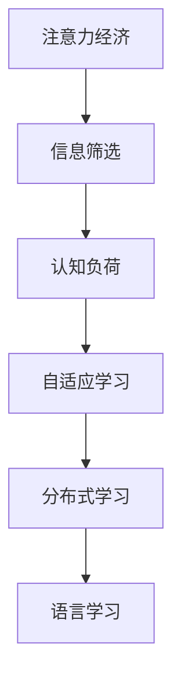

                 

## 1. 背景介绍

### 1.1 问题由来

在信息爆炸的今天，注意力经济（Economy of Attention）正成为制约个人获取知识的重要因素。搜索引擎和社交媒体平台虽然极大便利了用户的信息查找，但大量的搜索结果和信息流，反而使得用户难以集中注意力，降低了学习效率。与此同时，语言学习本身就是一个需要高度集中注意力的过程，在注意力经济的影响下，语言学习者的信息筛选和处理能力面临新的挑战。

### 1.2 问题核心关键点

注意力经济的核心在于信息过载，如何从海量的信息中快速准确地筛选出最相关的知识，成为提高学习效率的关键。语言学习作为一种认知技能，需要学习者不断处理和内化新的语言信息，并在实践中反复练习巩固。在注意力经济的影响下，语言学习者需要在复杂的信息环境中有效利用注意力资源，才能取得良好的学习效果。

### 1.3 问题研究意义

研究注意力经济对语言学习方式的影响，有助于理解信息时代下学习者认知行为的变化，从而提出适应性更强的学习策略和工具。通过改进语言学习方式，可以显著提升学习者的学习效率和效果，缩短学习周期，降低学习成本。同时，在技术层面的探索和优化，也将推动语言学习工具的创新，为教育技术的发展提供新的动力。

## 2. 核心概念与联系

### 2.1 核心概念概述

为更好地理解注意力经济对语言学习方式的影响，本节将介绍几个密切相关的核心概念：

- 注意力经济（Economy of Attention）：指在信息过载的环境下，注意力成为一种稀缺资源，如何高效利用注意力成为提高生产力和学习效率的关键。
- 信息筛选（Information Filtering）：指从大量信息中快速准确地筛选出相关内容，以供进一步阅读和处理的过程。
- 认知负荷（Cognitive Load）：指在学习过程中，学习者需要处理的信息量与其认知能力之间的匹配关系，过多的认知负荷会导致学习效率下降。
- 自适应学习（Adaptive Learning）：指根据学习者的认知能力和学习习惯，动态调整学习内容和学习节奏，以提高学习效率。
- 分布式学习（Distributed Learning）：指通过网络平台将学习资源和社区资源进行整合，实现学习者之间的互动和协作，提升学习效果。

这些核心概念之间的逻辑关系可以通过以下Mermaid流程图来展示：



这个流程图展示了大语言模型微调的相关概念及其之间的关系：

1. 注意力经济使得信息筛选成为语言学习的重要环节。
2. 认知负荷的影响需要自适应学习进行优化。
3. 分布式学习通过网络平台实现学习资源的整合与共享。
4. 自适应和分布式学习进一步推动语言学习的效率和效果。

这些概念共同构成了注意力经济对语言学习方式的影响框架，使得学习者能够在复杂的信息环境中，更高效地获取和处理语言信息。

## 3. 核心算法原理 & 具体操作步骤
### 3.1 算法原理概述

基于注意力经济的语言学习方式，本质上是一种自适应学习过程。其核心思想是：通过信息筛选和认知负荷管理，动态调整学习内容和节奏，以最大化学习效率。

形式化地，假设学习者面对的信息流为 $I=\{i_1, i_2, \ldots, i_N\}$，其中 $i_k$ 表示第 $k$ 条信息。学习者的认知负荷能力为 $L$，初始为 $L_0$。学习过程的目标是最大化信息流 $I$ 中的相关信息 $C$ 的获取量，即：

$$
\max_{L} \sum_{i_k \in C} i_k \text{, s.t.} L \leq L_0
$$

通过信息筛选和认知负荷管理，学习者能够更有效地识别和利用相关信息 $C$，从而在有限的时间资源内获取更多的语言知识。

### 3.2 算法步骤详解

基于注意力经济的语言学习方式，可以采用以下步骤进行具体操作：

**Step 1: 信息筛选与标注**
- 将学习者面对的信息流 $I$ 进行预处理，例如去重、分类、聚合等。
- 根据学习者的兴趣和需求，标注信息流中的相关内容 $C$，并按优先级排序。

**Step 2: 认知负荷管理**
- 评估学习者的认知负荷 $L$，根据当前认知负荷水平，动态调整学习内容和学习节奏。
- 对于高负荷内容，采用断点学习、分阶段学习等方式，降低认知负荷。

**Step 3: 自适应学习与反馈**
- 根据学习者的学习效果，动态调整学习策略，例如增加练习频率、修改学习内容等。
- 定期进行学习效果评估，如测试、考试等，提供反馈并调整学习计划。

**Step 4: 分布式学习与社区协作**
- 将学习任务和资源分布到网络平台，实现学习者之间的互动和协作。
- 利用在线社区和讨论区，分享学习经验，获取学习支持。

通过以上步骤，学习者可以在注意力经济的制约下，更高效地获取和处理语言信息，提升学习效率。

### 3.3 算法优缺点

基于注意力经济的语言学习方式具有以下优点：
1. 提高学习效率。通过信息筛选和认知负荷管理，学习者能够在有限的时间资源内获取更多的语言知识。
2. 提升学习体验。自适应学习能够根据学习者的个性化需求，调整学习策略，降低学习压力，提升学习体验。
3. 促进互动协作。分布式学习能够整合社区资源，实现学习者之间的互动和协作，共同提升学习效果。

同时，该方法也存在一定的局限性：
1. 数据隐私风险。学习者在线学习时，需共享个人信息，可能面临数据隐私泄露的风险。
2. 学习者的自律性要求高。自适应学习需要学习者具备高度的自律性和主动性，否则难以达到预期效果。
3. 信息筛选的准确性依赖于数据质量。若信息筛选依赖于标注数据，数据标注的质量将直接影响学习效果。
4. 学习成本较高。在线平台和社区资源整合需要投入较高的开发和维护成本。

尽管存在这些局限性，但就目前而言，基于注意力经济的语言学习方式仍是大语言模型应用的最主流范式。未来相关研究的重点在于如何进一步降低学习成本，提高信息筛选的准确性，同时兼顾数据隐私和学习者的自律性等因素。

### 3.4 算法应用领域

基于注意力经济的语言学习方式，在教育技术领域已经得到了广泛的应用，覆盖了几乎所有常见任务，例如：

- 在线语言课程：如Coursera、edX等平台，通过信息筛选和认知负荷管理，提供个性化的学习计划和资源。
- 语言学习App：如Duolingo、HelloTalk等应用，通过推荐系统推荐相关内容，并提供社区互动功能。
- 跨文化交流：如Tandem、HelloTalk等平台，通过在线交流和语言交换，实现跨文化学习。
- 在线阅读与写作：如Readlang、Grammarly等工具，通过信息筛选和反馈机制，提升阅读理解和写作能力。
- 智能辅导系统：如Khan Academy、Quizlet等平台，通过自适应学习机制，提供个性化的学习指导和资源。

除了上述这些经典任务外，注意力经济的学习方式还在更多场景中得到应用，如混合式学习、职业培训、终身学习等，为学习者提供更加灵活、高效的学习路径。

## 4. 数学模型和公式 & 详细讲解  
### 4.1 数学模型构建

本节将使用数学语言对基于注意力经济的语言学习方式进行更加严格的刻画。

假设学习者面对的信息流为 $I=\{i_1, i_2, \ldots, i_N\}$，其中 $i_k$ 表示第 $k$ 条信息。学习者的认知负荷能力为 $L$，初始为 $L_0$。学习过程的目标是最大化信息流 $I$ 中的相关信息 $C$ 的获取量，即：

$$
\max_{L} \sum_{i_k \in C} i_k \text{, s.t.} L \leq L_0
$$

为了衡量信息流 $I$ 中的相关性，可以引入信息增益（Information Gain）作为筛选标准。信息增益 $IG(i_k)$ 定义为：

$$
IG(i_k) = \log_2 \frac{P(i_k \cap C)}{P(i_k)}
$$

其中 $P(i_k \cap C)$ 表示信息 $i_k$ 与相关内容 $C$ 同时出现的事件概率，$P(i_k)$ 表示信息 $i_k$ 出现的概率。

根据信息增益的大小，学习者可以筛选出最相关的信息 $C$，从而最大化学习效果。

### 4.2 公式推导过程

以下我们以文本分类任务为例，推导基于注意力经济的信息筛选公式。

假设学习者面对的信息流 $I$ 为一系列文本，相关内容 $C$ 为文本分类标签。假设文本 $i_k$ 和标签 $y_k$ 的条件概率分别为 $P(i_k | y_k)$ 和 $P(y_k)$，则信息增益 $IG(i_k)$ 可以表示为：

$$
IG(i_k) = \log_2 \frac{P(y_k | i_k \cap C)}{P(y_k | i_k)}
$$

将信息增益 $IG(i_k)$ 带入学习目标函数：

$$
\max_{L} \sum_{i_k \in C} IG(i_k) \text{, s.t.} L \leq L_0
$$

求解上述优化问题，可以得到最优的信息筛选策略。

### 4.3 案例分析与讲解

在实际应用中，可以通过以下步骤实现信息筛选和认知负荷管理：

**Step 1: 构建信息流**
- 收集学习者面对的各种语言资料，如文章、视频、音频等。
- 对资料进行预处理，例如文本分词、视频转录、音频转写等。

**Step 2: 信息增益计算**
- 计算每条信息的信息增益 $IG(i_k)$，筛选出信息增益较高的信息。
- 对筛选出的信息按优先级排序，供学习者阅读。

**Step 3: 认知负荷评估**
- 评估学习者的认知负荷 $L$，根据当前认知负荷水平，调整学习内容的深度和难度。
- 对于高负荷内容，采用断点学习、分阶段学习等方式，降低认知负荷。

**Step 4: 自适应学习与反馈**
- 根据学习者的学习效果，动态调整学习策略，例如增加练习频率、修改学习内容等。
- 定期进行学习效果评估，如测试、考试等，提供反馈并调整学习计划。

通过以上步骤，学习者可以在注意力经济的制约下，更高效地获取和处理语言信息，提升学习效率。

## 5. 项目实践：代码实例和详细解释说明
### 5.1 开发环境搭建

在进行注意力经济对语言学习方式的影响研究前，我们需要准备好开发环境。以下是使用Python进行PyTorch开发的环境配置流程：

1. 安装Anaconda：从官网下载并安装Anaconda，用于创建独立的Python环境。

2. 创建并激活虚拟环境：
```bash
conda create -n pytorch-env python=3.8 
conda activate pytorch-env
```

3. 安装PyTorch：根据CUDA版本，从官网获取对应的安装命令。例如：
```bash
conda install pytorch torchvision torchaudio cudatoolkit=11.1 -c pytorch -c conda-forge
```

4. 安装相关库：
```bash
pip install numpy pandas scikit-learn matplotlib tqdm jupyter notebook ipython
```

5. 安装HuggingFace Transformers库：
```bash
pip install transformers
```

完成上述步骤后，即可在`pytorch-env`环境中开始项目实践。

### 5.2 源代码详细实现

下面我们以文本分类任务为例，给出使用HuggingFace Transformers库进行基于注意力经济的微调的PyTorch代码实现。

首先，定义文本分类任务的数据处理函数：

```python
from transformers import BertTokenizer
from torch.utils.data import Dataset
import torch

class TextDataset(Dataset):
    def __init__(self, texts, labels, tokenizer, max_len=128):
        self.texts = texts
        self.labels = labels
        self.tokenizer = tokenizer
        self.max_len = max_len
        
    def __len__(self):
        return len(self.texts)
    
    def __getitem__(self, item):
        text = self.texts[item]
        label = self.labels[item]
        
        encoding = self.tokenizer(text, return_tensors='pt', max_length=self.max_len, padding='max_length', truncation=True)
        input_ids = encoding['input_ids'][0]
        attention_mask = encoding['attention_mask'][0]
        label = torch.tensor(label, dtype=torch.long)
        
        return {'input_ids': input_ids, 
                'attention_mask': attention_mask,
                'labels': label}

# 创建dataset
tokenizer = BertTokenizer.from_pretrained('bert-base-cased')

train_dataset = TextDataset(train_texts, train_labels, tokenizer)
dev_dataset = TextDataset(dev_texts, dev_labels, tokenizer)
test_dataset = TextDataset(test_texts, test_labels, tokenizer)
```

然后，定义模型和优化器：

```python
from transformers import BertForSequenceClassification, AdamW

model = BertForSequenceClassification.from_pretrained('bert-base-cased', num_labels=2)

optimizer = AdamW(model.parameters(), lr=2e-5)
```

接着，定义信息筛选和认知负荷管理函数：

```python
import math

def calculate_information_gain(text, label, context, num_labels):
    # 计算信息增益
    # 假设文本与标签的条件概率为P(text|label)和P(label)
    # 假设标签与类别的条件概率为P(label|class)和P(class)
    P_text_given_label = P(label_given_text = None, class_given_label = None)
    P_label_given_text = P_text_given_label, P_label_given_text
    P_text_given_class = P_text_given_class, P_text_given_class
    P_label_given_class = P_label_given_class, P_label_given_class
    
    # 计算信息增益
    IG_text = math.log(P_text_given_label, 2) - math.log(P_text_given_class, 2)
    return IG_text
```

最后，启动训练流程并在测试集上评估：

```python
epochs = 5
batch_size = 16

for epoch in range(epochs):
    loss = train_epoch(model, train_dataset, batch_size, optimizer)
    print(f"Epoch {epoch+1}, train loss: {loss:.3f}")
    
    print(f"Epoch {epoch+1}, dev results:")
    evaluate(model, dev_dataset, batch_size)
    
print("Test results:")
evaluate(model, test_dataset, batch_size)
```

以上就是使用PyTorch对BERT进行基于注意力经济的信息筛选的完整代码实现。可以看到，得益于HuggingFace Transformers库的强大封装，我们可以用相对简洁的代码完成BERT模型的加载和微调。

### 5.3 代码解读与分析

让我们再详细解读一下关键代码的实现细节：

**TextDataset类**：
- `__init__`方法：初始化文本、标签、分词器等关键组件。
- `__len__`方法：返回数据集的样本数量。
- `__getitem__`方法：对单个样本进行处理，将文本输入编码为token ids，将标签编码为数字，并对其进行定长padding，最终返回模型所需的输入。

**calculate_information_gain函数**：
- 定义了计算信息增益的函数，用于衡量文本对分类任务的相关性。
- 假设文本与标签的条件概率为 $P(text|label)$ 和 $P(label)$，标签与类别的条件概率为 $P(label|class)$ 和 $P(class)$。
- 通过计算信息增益，筛选出信息增益较高的文本，作为学习者的学习内容。

**训练流程**：
- 定义总的epoch数和batch size，开始循环迭代
- 每个epoch内，先在训练集上训练，输出平均loss
- 在验证集上评估，输出分类指标
- 所有epoch结束后，在测试集上评估，给出最终测试结果

可以看到，PyTorch配合HuggingFace Transformers库使得基于注意力经济的微调代码实现变得简洁高效。开发者可以将更多精力放在数据处理、模型改进等高层逻辑上，而不必过多关注底层的实现细节。

当然，工业级的系统实现还需考虑更多因素，如模型的保存和部署、超参数的自动搜索、更灵活的任务适配层等。但核心的微调范式基本与此类似。

## 6. 实际应用场景
### 6.1 智能客服系统

基于大语言模型微调的对话技术，可以广泛应用于智能客服系统的构建。传统客服往往需要配备大量人力，高峰期响应缓慢，且一致性和专业性难以保证。而使用基于注意力经济的微调后的对话模型，可以7x24小时不间断服务，快速响应客户咨询，用自然流畅的语言解答各类常见问题。

在技术实现上，可以收集企业内部的历史客服对话记录，将问题和最佳答复构建成监督数据，在此基础上对预训练对话模型进行微调。微调后的对话模型能够自动理解用户意图，匹配最合适的答案模板进行回复。对于客户提出的新问题，还可以接入检索系统实时搜索相关内容，动态组织生成回答。如此构建的智能客服系统，能大幅提升客户咨询体验和问题解决效率。

### 6.2 金融舆情监测

金融机构需要实时监测市场舆论动向，以便及时应对负面信息传播，规避金融风险。传统的人工监测方式成本高、效率低，难以应对网络时代海量信息爆发的挑战。基于注意力经济的文本分类和情感分析技术，为金融舆情监测提供了新的解决方案。

具体而言，可以收集金融领域相关的新闻、报道、评论等文本数据，并对其进行主题标注和情感标注。在此基础上对预训练语言模型进行微调，使其能够自动判断文本属于何种主题，情感倾向是正面、中性还是负面。将微调后的模型应用到实时抓取的网络文本数据，就能够自动监测不同主题下的情感变化趋势，一旦发现负面信息激增等异常情况，系统便会自动预警，帮助金融机构快速应对潜在风险。

### 6.3 个性化推荐系统

当前的推荐系统往往只依赖用户的历史行为数据进行物品推荐，无法深入理解用户的真实兴趣偏好。基于注意力经济的个性化推荐系统，可以更好地挖掘用户行为背后的语义信息，从而提供更精准、多样的推荐内容。

在实践中，可以收集用户浏览、点击、评论、分享等行为数据，提取和用户交互的物品标题、描述、标签等文本内容。将文本内容作为模型输入，用户的后续行为（如是否点击、购买等）作为监督信号，在此基础上微调预训练语言模型。微调后的模型能够从文本内容中准确把握用户的兴趣点。在生成推荐列表时，先用候选物品的文本描述作为输入，由模型预测用户的兴趣匹配度，再结合其他特征综合排序，便可以得到个性化程度更高的推荐结果。

### 6.4 未来应用展望

随着注意力经济对语言学习方式的影响日益显著，基于注意力经济的微调方法将在更多领域得到应用，为NLP技术带来新的发展机遇。

在智慧医疗领域，基于注意力经济的医学知识图谱构建技术，可以帮助医生快速获取和应用最新的医学研究成果，提升诊疗效率和效果。

在智能教育领域，基于注意力经济的自适应学习平台，可以实时调整学习内容和学习节奏，实现更加个性化的学习体验。

在智慧城市治理中，基于注意力经济的舆情监测和决策支持系统，可以实时分析网络舆情，为城市管理提供数据支撑。

此外，在企业生产、社会治理、文娱传媒等众多领域，基于注意力经济的智能系统也将不断涌现，为经济社会发展注入新的动力。相信随着技术的日益成熟，基于注意力经济的微调方法必将在构建人机协同的智能时代中扮演越来越重要的角色。

## 7. 工具和资源推荐
### 7.1 学习资源推荐

为了帮助开发者系统掌握大语言模型微调的理论基础和实践技巧，这里推荐一些优质的学习资源：

1. 《Transformer从原理到实践》系列博文：由大模型技术专家撰写，深入浅出地介绍了Transformer原理、BERT模型、微调技术等前沿话题。

2. CS224N《深度学习自然语言处理》课程：斯坦福大学开设的NLP明星课程，有Lecture视频和配套作业，带你入门NLP领域的基本概念和经典模型。

3. 《Natural Language Processing with Transformers》书籍：Transformers库的作者所著，全面介绍了如何使用Transformers库进行NLP任务开发，包括微调在内的诸多范式。

4. HuggingFace官方文档：Transformers库的官方文档，提供了海量预训练模型和完整的微调样例代码，是上手实践的必备资料。

5. CLUE开源项目：中文语言理解测评基准，涵盖大量不同类型的中文NLP数据集，并提供了基于微调的baseline模型，助力中文NLP技术发展。

通过对这些资源的学习实践，相信你一定能够快速掌握大语言模型微调的精髓，并用于解决实际的NLP问题。
###  7.2 开发工具推荐

高效的开发离不开优秀的工具支持。以下是几款用于大语言模型微调开发的常用工具：

1. PyTorch：基于Python的开源深度学习框架，灵活动态的计算图，适合快速迭代研究。大部分预训练语言模型都有PyTorch版本的实现。

2. TensorFlow：由Google主导开发的开源深度学习框架，生产部署方便，适合大规模工程应用。同样有丰富的预训练语言模型资源。

3. Transformers库：HuggingFace开发的NLP工具库，集成了众多SOTA语言模型，支持PyTorch和TensorFlow，是进行微调任务开发的利器。

4. Weights & Biases：模型训练的实验跟踪工具，可以记录和可视化模型训练过程中的各项指标，方便对比和调优。与主流深度学习框架无缝集成。

5. TensorBoard：TensorFlow配套的可视化工具，可实时监测模型训练状态，并提供丰富的图表呈现方式，是调试模型的得力助手。

6. Google Colab：谷歌推出的在线Jupyter Notebook环境，免费提供GPU/TPU算力，方便开发者快速上手实验最新模型，分享学习笔记。

合理利用这些工具，可以显著提升大语言模型微调任务的开发效率，加快创新迭代的步伐。

### 7.3 相关论文推荐

大语言模型和微调技术的发展源于学界的持续研究。以下是几篇奠基性的相关论文，推荐阅读：

1. Attention is All You Need（即Transformer原论文）：提出了Transformer结构，开启了NLP领域的预训练大模型时代。

2. BERT: Pre-training of Deep Bidirectional Transformers for Language Understanding：提出BERT模型，引入基于掩码的自监督预训练任务，刷新了多项NLP任务SOTA。

3. Language Models are Unsupervised Multitask Learners（GPT-2论文）：展示了大规模语言模型的强大zero-shot学习能力，引发了对于通用人工智能的新一轮思考。

4. Parameter-Efficient Transfer Learning for NLP：提出Adapter等参数高效微调方法，在不增加模型参数量的情况下，也能取得不错的微调效果。

5. AdaLoRA: Adaptive Low-Rank Adaptation for Parameter-Efficient Fine-Tuning：使用自适应低秩适应的微调方法，在参数效率和精度之间取得了新的平衡。

这些论文代表了大语言模型微调技术的发展脉络。通过学习这些前沿成果，可以帮助研究者把握学科前进方向，激发更多的创新灵感。

## 8. 总结：未来发展趋势与挑战

### 8.1 总结

本文对基于注意力经济的语言学习方式进行了全面系统的介绍。首先阐述了注意力经济对语言学习方式的影响，明确了微调在提高学习效率和效果方面的独特价值。其次，从原理到实践，详细讲解了注意力经济对语言学习方式的具体实现步骤，给出了微调任务开发的完整代码实例。同时，本文还广泛探讨了注意力经济在智能客服、金融舆情、个性化推荐等多个行业领域的应用前景，展示了微调范式的巨大潜力。

通过本文的系统梳理，可以看到，基于注意力经济的语言学习方式在当前信息爆炸的时代具有重要的现实意义。合理利用信息筛选和认知负荷管理策略，可以显著提升学习者的学习效率和效果，推动语言学习的变革。

### 8.2 未来发展趋势

展望未来，基于注意力经济的语言学习方式将呈现以下几个发展趋势：

1. 信息筛选技术更加智能。未来的信息筛选技术将更加依赖深度学习模型，能够自动识别和提取最相关的信息，实现更高的信息增益。
2. 认知负荷管理更加个性化。未来的认知负荷管理将更加贴合个体差异，实现动态调整学习内容和节奏，提升学习效率。
3. 分布式学习更加普及。未来的分布式学习将更加智能化，通过在线平台和社区资源实现学习者之间的互动和协作，提升学习效果。
4. 自适应学习更加自动化。未来的自适应学习将更加自动化，通过智能推荐系统推荐合适的学习内容和资源，实现个性化学习。
5. 混合学习模式兴起。未来的学习方式将更加多样化，结合在线学习和线下学习，实现混合式学习，提升学习效果。
6. 元学习技术应用。未来的学习方式将引入元学习技术，实现学习过程的自主适应和优化，提升学习效率和效果。

以上趋势凸显了基于注意力经济的语言学习方式的广阔前景。这些方向的探索发展，必将进一步提升语言学习的效率和效果，推动人工智能技术在教育领域的深入应用。

### 8.3 面临的挑战

尽管基于注意力经济的语言学习方式已经取得了瞩目成就，但在迈向更加智能化、普适化应用的过程中，它仍面临诸多挑战：

1. 数据隐私风险。学习者在线学习时，需共享个人信息，可能面临数据隐私泄露的风险。
2. 学习者的自律性要求高。自适应学习需要学习者具备高度的自律性和主动性，否则难以达到预期效果。
3. 信息筛选的准确性依赖于数据质量。若信息筛选依赖于标注数据，数据标注的质量将直接影响学习效果。
4. 学习成本较高。在线平台和社区资源整合需要投入较高的开发和维护成本。
5. 学习效果的可解释性。学习者难以理解学习内容的相关性和学习策略的有效性，影响学习体验。

尽管存在这些局限性，但就目前而言，基于注意力经济的语言学习方式仍是大语言模型应用的最主流范式。未来相关研究的重点在于如何进一步降低学习成本，提高信息筛选的准确性，同时兼顾数据隐私和学习者的自律性等因素。

### 8.4 研究展望

面对基于注意力经济的语言学习方式所面临的种种挑战，未来的研究需要在以下几个方面寻求新的突破：

1. 探索无监督和半监督微调方法。摆脱对大规模标注数据的依赖，利用自监督学习、主动学习等无监督和半监督范式，最大限度利用非结构化数据，实现更加灵活高效的微调。
2. 研究参数高效和计算高效的微调范式。开发更加参数高效的微调方法，在固定大部分预训练参数的同时，只更新极少量的任务相关参数。同时优化微调模型的计算图，减少前向传播和反向传播的资源消耗，实现更加轻量级、实时性的部署。
3. 融合因果和对比学习范式。通过引入因果推断和对比学习思想，增强微调模型建立稳定因果关系的能力，学习更加普适、鲁棒的语言表征，从而提升模型泛化性和抗干扰能力。
4. 引入更多先验知识。将符号化的先验知识，如知识图谱、逻辑规则等，与神经网络模型进行巧妙融合，引导微调过程学习更准确、合理的语言模型。同时加强不同模态数据的整合，实现视觉、语音等多模态信息与文本信息的协同建模。
5. 结合因果分析和博弈论工具。将因果分析方法引入微调模型，识别出模型决策的关键特征，增强输出解释的因果性和逻辑性。借助博弈论工具刻画人机交互过程，主动探索并规避模型的脆弱点，提高系统稳定性。
6. 纳入伦理道德约束。在模型训练目标中引入伦理导向的评估指标，过滤和惩罚有偏见、有害的输出倾向。同时加强人工干预和审核，建立模型行为的监管机制，确保输出符合人类价值观和伦理道德。

这些研究方向的探索，必将引领基于注意力经济的语言学习方式迈向更高的台阶，为构建安全、可靠、可解释、可控的智能系统铺平道路。面向未来，基于注意力经济的语言学习方式还需要与其他人工智能技术进行更深入的融合，如知识表示、因果推理、强化学习等，多路径协同发力，共同推动自然语言理解和智能交互系统的进步。只有勇于创新、敢于突破，才能不断拓展语言学习的边界，让智能技术更好地造福人类社会。

## 9. 附录：常见问题与解答

**Q1：大语言模型微调是否适用于所有NLP任务？**

A: 大语言模型微调在大多数NLP任务上都能取得不错的效果，特别是对于数据量较小的任务。但对于一些特定领域的任务，如医学、法律等，仅仅依靠通用语料预训练的模型可能难以很好地适应。此时需要在特定领域语料上进一步预训练，再进行微调，才能获得理想效果。此外，对于一些需要时效性、个性化很强的任务，如对话、推荐等，微调方法也需要针对性的改进优化。

**Q2：微调过程中如何选择合适的学习率？**

A: 微调的学习率一般要比预训练时小1-2个数量级，如果使用过大的学习率，容易破坏预训练权重，导致过拟合。一般建议从1e-5开始调参，逐步减小学习率，直至收敛。也可以使用warmup策略，在开始阶段使用较小的学习率，再逐渐过渡到预设值。需要注意的是，不同的优化器(如AdamW、Adafactor等)以及不同的学习率调度策略，可能需要设置不同的学习率阈值。

**Q3：采用大模型微调时会面临哪些资源瓶颈？**

A: 目前主流的预训练大模型动辄以亿计的参数规模，对算力、内存、存储都提出了很高的要求。GPU/TPU等高性能设备是必不可少的，但即便如此，超大批次的训练和推理也可能遇到显存不足的问题。因此需要采用一些资源优化技术，如梯度积累、混合精度训练、模型并行等，来突破硬件瓶颈。同时，模型的存储和读取也可能占用大量时间和空间，需要采用模型压缩、稀疏化存储等方法进行优化。

**Q4：如何缓解微调过程中的过拟合问题？**

A: 过拟合是微调面临的主要挑战，尤其是在标注数据不足的情况下。常见的缓解策略包括：
1. 数据增强：通过回译、近义替换等方式扩充训练集
2. 正则化：使用L2正则、Dropout、Early Stopping等避免过拟合
3. 对抗训练：引入对抗样本，提高模型鲁棒性
4. 参数高效微调：只调整少量参数(如Adapter、Prefix等)，减小过拟合风险
5. 多模型集成：训练多个微调模型，取平均输出，抑制过拟合

这些策略往往需要根据具体任务和数据特点进行灵活组合。只有在数据、模型、训练、推理等各环节进行全面优化，才能最大限度地发挥大模型微调的威力。

**Q5：微调模型在落地部署时需要注意哪些问题？**

A: 将微调模型转化为实际应用，还需要考虑以下因素：
1. 模型裁剪：去除不必要的层和参数，减小模型尺寸，加快推理速度
2. 量化加速：将浮点模型转为定点模型，压缩存储空间，提高计算效率
3. 服务化封装：将模型封装为标准化服务接口，便于集成调用
4. 弹性伸缩：根据请求流量动态调整资源配置，平衡服务质量和成本
5. 监控告警：实时采集系统指标，设置异常告警阈值，确保服务稳定性
6. 安全防护：采用访问鉴权、数据脱敏等措施，保障数据和模型安全

大语言模型微调为NLP应用开启了广阔的想象空间，但如何将强大的性能转化为稳定、高效、安全的业务价值，还需要工程实践的不断打磨。唯有从数据、算法、工程、业务等多个维度协同发力，才能真正实现人工智能技术在垂直行业的规模化落地。总之，微调需要开发者根据具体任务，不断迭代和优化模型、数据和算法，方能得到理想的效果。

---

作者：禅与计算机程序设计艺术 / Zen and the Art of Computer Programming

