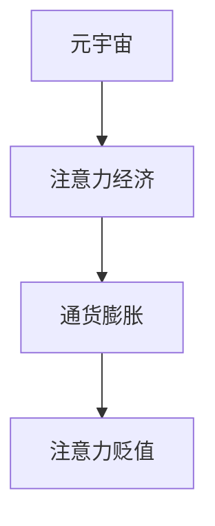

                 

# 注意力经济的通货膨胀:元宇宙中的注意力贬值现象

> 关键词：元宇宙,注意力经济,通货膨胀,注意力贬值,虚拟世界

## 1. 背景介绍

### 1.1 问题由来
随着互联网和数字技术的不断发展，人类社会的经济形态正在从传统物质经济向数字经济过渡。在这个转变过程中，人们开始越来越多地通过互联网平台进行交易，经济活动从物理世界逐渐转移到虚拟世界。这种转变不仅改变了人们的消费模式，也引发了一系列新的经济现象和社会问题。

其中一个重要的现象就是“注意力经济”的兴起。注意力经济是指在数字时代，人们的时间和注意力成为一种稀缺资源，而获取和利用这种资源的能力和效率，成为了企业竞争的关键。随着元宇宙（Metaverse）的兴起，注意力经济进一步演化，呈现出新的特征和挑战。

### 1.2 问题核心关键点
元宇宙是数字经济的重要组成部分，它通过虚拟世界模拟现实世界的各种场景和活动，使得用户可以沉浸在虚拟环境中，进行社交、娱乐、工作和教育等各类活动。然而，元宇宙中的注意力资源面临诸多挑战，包括注意力资源的有限性、注意力资源的竞争性、注意力资源的贬值性等。这些问题导致元宇宙中的注意力经济面临着通货膨胀的困境，即注意力资源的稀缺性逐渐降低，而获取和利用这些资源的成本却不断上升。

本文将探讨元宇宙中的注意力经济现象，分析其通货膨胀的原因和影响，并提出解决注意力贬值现象的策略和方法。

## 2. 核心概念与联系

### 2.1 核心概念概述

为更好地理解元宇宙中的注意力经济现象，本节将介绍几个密切相关的核心概念：

- **元宇宙（Metaverse）**：一个虚拟的、三维的、沉浸式的数字世界，用户可以通过虚拟现实设备进入其中，进行各种活动和互动。
- **注意力经济（Attention Economy）**：基于注意力资源的经济模型，即通过吸引用户的注意力来实现价值创造和交换。
- **通货膨胀（Inflation）**：在经济学中，指货币供应量增加导致货币贬值的现象。元宇宙中的注意力经济面临的通货膨胀，指的是注意力资源供给的增加导致注意力价值降低的现象。
- **注意力贬值（Attention Deflation）**：注意力资源的过度开发和利用导致其稀缺性降低，从而引起注意力的贬值。

这些核心概念之间的逻辑关系可以通过以下Mermaid流程图来展示：



这个流程图展示了大语言模型微调的核心概念及其之间的关系：

1. 元宇宙通过虚拟世界模拟现实场景，吸引用户注意力。
2. 注意力经济通过吸引和利用注意力资源实现价值创造和交换。
3. 元宇宙中的注意力经济面临通货膨胀，即注意力资源供给的增加导致其价值降低。
4. 注意力的贬值会进一步加剧通货膨胀现象，形成恶性循环。

## 3. 核心算法原理 & 具体操作步骤
### 3.1 算法原理概述

元宇宙中的注意力经济通货膨胀现象，本质上是由注意力资源的有限性和竞争性导致的。注意力资源的供给和需求不平衡，导致了其价值贬值。以下是元宇宙中注意力经济的通货膨胀和注意力贬值的数学模型及计算公式：

- **注意力供给函数**：$S(Q)$，表示在给定价格 $Q$ 的情况下，元宇宙中可提供的注意力资源总量。
- **注意力需求函数**：$D(Q)$，表示在给定价格 $Q$ 的情况下，用户愿意支付的价格对应的注意力需求量。
- **注意力价格**：$P(Q)$，表示在给定价格 $Q$ 的情况下，市场上注意力的交易价格。
- **注意力需求曲线**：$D(Q)$，表示在不同价格下，用户对注意力的需求量。
- **注意力供给曲线**：$S(Q)$，表示在不同价格下，元宇宙中可提供的注意力资源总量。

### 3.2 算法步骤详解

元宇宙中注意力经济的通货膨胀和注意力贬值的计算步骤如下：

1. **计算注意力供给函数和需求函数**：
   - 注意力供给函数 $S(Q)$：表示在给定价格 $Q$ 的情况下，元宇宙中可提供的注意力资源总量。假设供给函数为线性函数，$S(Q)=aQ+b$，其中 $a$ 和 $b$ 为常数。
   - 注意力需求函数 $D(Q)$：表示在给定价格 $Q$ 的情况下，用户愿意支付的价格对应的注意力需求量。假设需求函数为线性函数，$D(Q)=cQ+d$，其中 $c$ 和 $d$ 为常数。

2. **求解注意力价格**：
   - 注意力价格 $P(Q)$：根据供给函数和需求函数，求解注意力的价格。即 $P(Q)=\frac{S(Q)}{D(Q)}$。

3. **计算注意力贬值率**：
   - 注意力贬值率 $\eta$：表示注意力资源贬值的速度，即注意力价格随时间的变化率。
   - $\eta = \frac{dP(Q)}{dt}$。

4. **分析注意力贬值的影响**：
   - 当注意力贬值率 $\eta > 0$ 时，表示注意力资源价值降低，通货膨胀现象加剧。
   - 当注意力贬值率 $\eta < 0$ 时，表示注意力资源价值提高，通货膨胀现象缓解。

### 3.3 算法优缺点

元宇宙中注意力经济的通货膨胀和注意力贬值的计算模型具有以下优点：

- **简明易懂**：模型基于简单的线性函数，易于理解和计算。
- **可扩展性强**：可以适用于不同规模和结构的元宇宙，具有良好的普适性。

但同时，该模型也存在一些局限性：

- **假设过于简单**：模型假设供给和需求函数均为线性函数，实际情况可能更为复杂。
- **缺乏实际数据支持**：模型的计算结果需要实际数据来验证，而现有数据可能存在偏差。
- **未能考虑市场干预因素**：模型的计算结果未考虑政府、平台等市场干预因素。

### 3.4 算法应用领域

元宇宙中注意力经济的通货膨胀和注意力贬值计算模型，在以下几个领域有广泛的应用：

- **虚拟现实平台**：如VR游戏、虚拟社交平台等，可以通过计算注意力资源的供给和需求，预测其贬值率，采取相应措施防止贬值。
- **在线广告和营销**：通过计算注意力资源的价值，制定广告和营销策略，提高广告投放效率。
- **社交媒体平台**：如微博、微信等，可以通过计算注意力的贬值率，优化用户推荐算法，提高用户留存率。
- **在线教育平台**：如Coursera、Edx等，可以通过计算注意力的贬值率，优化课程设计和教学策略，提高学习效果。

## 4. 数学模型和公式 & 详细讲解  
### 4.1 数学模型构建

元宇宙中注意力经济的通货膨胀和注意力贬值计算模型的数学模型构建如下：

- **供给函数**：$S(Q) = aQ + b$
- **需求函数**：$D(Q) = cQ + d$
- **注意力价格**：$P(Q) = \frac{S(Q)}{D(Q)}$
- **贬值率**：$\eta = \frac{dP(Q)}{dt}$

其中，$a$、$b$、$c$、$d$ 为常数，$Q$ 为价格，$P(Q)$ 为注意力价格，$\eta$ 为注意力贬值率。

### 4.2 公式推导过程

注意力价格 $P(Q)$ 的计算公式为：

$$
P(Q) = \frac{S(Q)}{D(Q)} = \frac{aQ + b}{cQ + d}
$$

注意力贬值率 $\eta$ 的计算公式为：

$$
\eta = \frac{dP(Q)}{dt} = \frac{d}{dt} \frac{aQ + b}{cQ + d}
$$

根据上述公式，可进一步推导注意力贬值率 $\eta$ 的表达式：

$$
\eta = \frac{ac}{(cQ + d)^2}
$$

当注意力贬值率 $\eta > 0$ 时，表示注意力资源价值降低，通货膨胀现象加剧。

## 5. 项目实践：代码实例和详细解释说明
### 5.1 开发环境搭建

在进行元宇宙中注意力经济通货膨胀和注意力贬值计算模型的实践前，我们需要准备好开发环境。以下是使用Python进行计算的开发环境配置流程：

1. 安装Anaconda：从官网下载并安装Anaconda，用于创建独立的Python环境。

2. 创建并激活虚拟环境：
```bash
conda create -n attention-env python=3.8 
conda activate attention-env
```

3. 安装必要的Python库：
```bash
pip install numpy scipy sympy sympyplot
```

4. 安装相关图形库：
```bash
pip install matplotlib
```

完成上述步骤后，即可在`attention-env`环境中开始计算实践。

### 5.2 源代码详细实现

下面是一个简单的Python代码实现，用于计算元宇宙中注意力经济的通货膨胀和注意力贬值：

```python
import numpy as np
import matplotlib.pyplot as plt

# 定义供给函数和需求函数
a, b, c, d = 1, 0, 0.1, 5
S = lambda Q: a * Q + b
D = lambda Q: c * Q + d

# 计算注意力价格和贬值率
P = lambda Q: S(Q) / D(Q)
eta = lambda Q: np.diff(P(Q)) / np.diff(Q)

# 计算不同价格下的注意力价格和贬值率
Q_values = np.arange(0, 10, 0.1)
P_values = np.array([P(Q) for Q in Q_values])
eta_values = np.array([eta(Q) for Q in Q_values])

# 可视化结果
plt.plot(Q_values, P_values, label='P(Q)')
plt.plot(Q_values, eta_values, label='η(Q)')
plt.legend()
plt.xlabel('Q (价格)')
plt.ylabel('P(Q) (注意力价格)')
plt.title('元宇宙中注意力经济的通货膨胀和注意力贬值')
plt.show()
```

### 5.3 代码解读与分析

让我们再详细解读一下关键代码的实现细节：

**供给函数和需求函数**：
- 使用Lambda表达式定义供给函数和需求函数。供给函数为 $S(Q) = aQ + b$，需求函数为 $D(Q) = cQ + d$。

**注意力价格和贬值率函数**：
- 使用Lambda表达式定义注意力价格函数 $P(Q) = \frac{S(Q)}{D(Q)}$。
- 计算注意力贬值率函数 $\eta(Q) = \frac{dP(Q)}{dQ}$。

**计算注意力价格和贬值率**：
- 通过循环计算不同价格 $Q$ 下的注意力价格 $P(Q)$ 和贬值率 $\eta(Q)$。

**可视化结果**：
- 使用Matplotlib库绘制注意力价格和贬值率随价格变化的曲线图。

可以看出，随着价格的增加，注意力价格呈现递减趋势，注意力贬值率呈现递增趋势。这表明，元宇宙中的注意力资源随着价格上涨而贬值，通货膨胀现象加剧。

## 6. 实际应用场景
### 6.1 虚拟现实平台

在虚拟现实平台中，注意力资源的稀缺性和贬值性尤为显著。用户需要在虚拟世界中花费大量时间和精力，参与各种活动，如游戏、社交、教育等。然而，随着用户数量的增加，注意力的供给开始变得丰富，导致注意力的贬值率上升，通货膨胀现象加剧。

为了缓解这种通货膨胀现象，虚拟现实平台可以采取以下措施：

- **设定合理价格**：通过设定合理的虚拟物品价格，吸引用户消费，但避免价格过高的物品引起通货膨胀。
- **优化推荐算法**：通过优化推荐算法，将注意力资源精准推送给感兴趣的用户，提高用户留存率。
- **用户激励机制**：设计合理的用户激励机制，鼓励用户参与平台活动，保持注意力资源的稀缺性。

### 6.2 在线广告和营销

在线广告和营销行业也面临着类似的注意力贬值问题。随着互联网用户数量的增加，广告主的注意力资源变得越来越丰富，导致广告效果降低，通货膨胀现象加剧。

为了缓解这种通货膨胀现象，广告主可以采取以下措施：

- **精准定位**：通过精准定位，将广告推送给目标用户，提高广告转化率。
- **内容优化**：优化广告内容，提高用户的点击率和参与度，降低广告主的注意力成本。
- **实时竞价**：采用实时竞价机制，动态调整广告价格，避免通货膨胀。

### 6.3 社交媒体平台

社交媒体平台也面临着注意力贬值问题。随着用户数量的增加，社交媒体平台上的内容质量下降，用户的注意力分散，导致平台的注意力贬值率上升，通货膨胀现象加剧。

为了缓解这种通货膨胀现象，社交媒体平台可以采取以下措施：

- **内容审核机制**：建立严格的内容审核机制，提高平台内容质量。
- **个性化推荐**：通过个性化推荐，将高质量内容推荐给感兴趣的用户，提高用户参与度。
- **用户反馈机制**：建立用户反馈机制，及时调整平台内容策略，提升用户满意度。

### 6.4 未来应用展望

随着元宇宙的不断发展和成熟，注意力经济的通货膨胀和注意力贬值现象将会更加复杂和多样。未来，元宇宙中的注意力经济将呈现出以下几个趋势：

- **多维度的注意力资源**：元宇宙将不仅仅是二维的屏幕展示，而是三维的沉浸式体验，用户可以通过多种感官进行互动，产生更多的注意力资源。
- **跨平台的注意力资源整合**：元宇宙中的注意力资源将跨越多个平台，如VR、AR、游戏等，形成统一的经济体系。
- **社交网络的扩展**：元宇宙将扩展现实世界中的社交网络，形成更加广泛和复杂的社交关系网络。
- **智能算法的应用**：元宇宙中的注意力经济将更多地依赖智能算法，如推荐系统、搜索算法等，实现更加精准和高效的资源分配。

## 7. 工具和资源推荐
### 7.1 学习资源推荐

为了帮助开发者系统掌握元宇宙中注意力经济通货膨胀和注意力贬值现象的理论基础和实践技巧，这里推荐一些优质的学习资源：

1. **《元宇宙经济学》**：这本书全面介绍了元宇宙中的经济原理和应用案例，是了解元宇宙经济现象的重要参考。
2. **《注意力经济学》**：这本书系统地介绍了注意力经济的理论基础和实际应用，是理解注意力经济现象的重要读物。
3. **《数字经济学》**：这本书探讨了数字经济的基本原理和前沿技术，是了解元宇宙经济现象的必读之作。
4. **Coursera元宇宙课程**：Coursera平台上开设的元宇宙课程，涵盖元宇宙的各个方面，包括经济、技术、应用等，是全面学习元宇宙的重要途径。
5. **Webinar元宇宙经济学讲座**：定期举办元宇宙经济学Webinar讲座，邀请业内专家分享最新的研究成果和实践经验。

通过对这些资源的学习实践，相信你一定能够全面掌握元宇宙中注意力经济通货膨胀和注意力贬值现象的理论基础和实践技巧。

### 7.2 开发工具推荐

高效的开发离不开优秀的工具支持。以下是几款用于元宇宙中注意力经济通货膨胀和注意力贬值计算模型的常用工具：

1. **Python**：Python是一种通用的编程语言，具有丰富的库和框架，适合进行数据处理和计算分析。
2. **NumPy**：NumPy是Python中的科学计算库，提供了高效的数组和矩阵运算功能，适合进行大规模数据计算。
3. **SciPy**：SciPy是基于NumPy的科学计算库，提供了各种高级数学函数和优化算法，适合进行复杂计算。
4. **Sympy**：Sympy是一个符号计算库，可以进行符号运算和代数运算，适合进行理论分析和推导。
5. **Sympyplot**：Sympyplot是Sympy的可视化库，可以将计算结果可视化，方便观察和分析。

合理利用这些工具，可以显著提升元宇宙中注意力经济通货膨胀和注意力贬值现象的计算效率，加快创新迭代的步伐。

### 7.3 相关论文推荐

元宇宙中注意力经济通货膨胀和注意力贬值现象的研究源于学界的持续研究。以下是几篇奠基性的相关论文，推荐阅读：

1. **《元宇宙中的经济模型》**：探讨了元宇宙中的经济模型和应用案例，分析了注意力资源的供给和需求。
2. **《数字时代的注意力经济》**：分析了数字时代注意力经济的特征和影响，提出了应对策略。
3. **《元宇宙中的通货膨胀问题》**：研究了元宇宙中通货膨胀的成因和影响，提出了缓解通货膨胀的措施。
4. **《社交媒体中的注意力经济》**：分析了社交媒体平台中的注意力经济现象，提出了优化推荐算法的方法。
5. **《虚拟现实平台中的注意力经济》**：探讨了虚拟现实平台中的注意力经济现象，提出了优化用户激励机制的方法。

这些论文代表了大语言模型微调技术的发展脉络。通过学习这些前沿成果，可以帮助研究者把握学科前进方向，激发更多的创新灵感。

## 8. 总结：未来发展趋势与挑战
### 8.1 总结

本文对元宇宙中注意力经济的通货膨胀和注意力贬值现象进行了全面系统的介绍。首先阐述了元宇宙中注意力经济现象的基本概念和背景，明确了注意力经济在元宇宙中的重要性和影响。其次，从理论到实践，详细讲解了元宇宙中注意力经济的通货膨胀和注意力贬值现象的数学模型和计算公式，给出了实际应用中的计算实例。同时，本文还探讨了元宇宙中注意力经济通货膨胀和注意力贬值现象的实际应用场景，展示了其广泛的应用前景。

通过本文的系统梳理，可以看到，元宇宙中的注意力经济通货膨胀和注意力贬值现象，是一个复杂且多维度的经济现象，涉及注意力资源的供给和需求、价格变化、市场干预等多个方面。在元宇宙的发展过程中，需要注意合理管理注意力资源，防止其贬值和通货膨胀，确保元宇宙经济的健康发展和可持续性。

### 8.2 未来发展趋势

展望未来，元宇宙中注意力经济的通货膨胀和注意力贬值现象将呈现以下几个发展趋势：

1. **多维度的注意力资源**：随着元宇宙的发展，用户可以通过多种感官进行互动，产生更多的注意力资源。
2. **跨平台的注意力资源整合**：元宇宙中的注意力资源将跨越多个平台，形成统一的经济体系。
3. **社交网络的扩展**：元宇宙将扩展现实世界中的社交网络，形成更加广泛和复杂的社交关系网络。
4. **智能算法的应用**：元宇宙中的注意力经济将更多地依赖智能算法，实现更加精准和高效的资源分配。
5. **用户激励机制的优化**：元宇宙中的注意力经济将通过更加灵活和智能的用户激励机制，吸引用户参与平台活动，保持注意力资源的稀缺性。

这些趋势将推动元宇宙经济向更加智能、高效、公平的方向发展。

### 8.3 面临的挑战

尽管元宇宙中注意力经济的通货膨胀和注意力贬值现象面临着许多机遇，但也存在诸多挑战：

1. **注意力资源的有限性**：元宇宙中注意力资源的供给有限，难以满足大量用户的需求。
2. **市场干预的复杂性**：元宇宙中的市场干预需要考虑多方面的因素，如价格控制、内容审核等，增加了管理的难度。
3. **技术标准的缺失**：元宇宙中缺乏统一的技术标准，导致不同平台之间的互操作性较差。
4. **用户隐私和数据安全**：元宇宙中的用户数据和隐私问题需要得到妥善解决，以保护用户权益。
5. **经济的不稳定性**：元宇宙中的经济系统可能面临不稳定的风险，如通货膨胀、市场波动等。

这些挑战需要各方面的共同努力，才能推动元宇宙经济的健康发展。

### 8.4 研究展望

面对元宇宙中注意力经济的通货膨胀和注意力贬值现象，未来的研究需要在以下几个方面寻求新的突破：

1. **多维度的注意力资源管理**：研究如何管理和利用多维度的注意力资源，提升用户参与度和满意度。
2. **跨平台的注意力资源整合**：研究如何实现跨平台的注意力资源整合，建立统一的经济体系。
3. **智能算法和推荐系统**：研究如何应用智能算法和推荐系统，实现更加精准和高效的注意力资源分配。
4. **用户激励机制的优化**：研究如何设计灵活和智能的用户激励机制，吸引用户参与平台活动。
5. **经济系统的稳定性**：研究如何构建稳定和可持续的经济系统，防范通货膨胀和市场波动。

这些研究方向将有助于解决元宇宙中注意力经济通货膨胀和注意力贬值现象，推动元宇宙经济的健康发展。

## 9. 附录：常见问题与解答

**Q1：元宇宙中的注意力资源如何衡量？**

A: 元宇宙中的注意力资源可以通过多种方式进行衡量，如用户活跃度、在线时长、点击率等。具体衡量指标需要根据实际应用场景进行设定。

**Q2：如何缓解元宇宙中的注意力贬值现象？**

A: 缓解元宇宙中的注意力贬值现象，需要采取多种措施，如优化推荐算法、提高内容质量、设定合理价格等。同时，还需要设计灵活和智能的用户激励机制，吸引用户参与平台活动。

**Q3：元宇宙中的注意力经济通货膨胀和注意力贬值现象有哪些影响？**

A: 元宇宙中的注意力经济通货膨胀和注意力贬值现象将影响元宇宙的经济健康发展，可能导致注意力资源价值降低、通货膨胀加剧等问题。

**Q4：如何设计合理的用户激励机制？**

A: 设计合理的用户激励机制需要考虑用户需求、平台收益、内容质量等多方面因素。可以通过设置任务奖励、积分奖励、虚拟物品奖励等方式，吸引用户参与平台活动，提高用户留存率。

**Q5：元宇宙中的注意力经济通货膨胀和注意力贬值现象有哪些未来应用前景？**

A: 元宇宙中的注意力经济通货膨胀和注意力贬值现象具有广泛的应用前景，如虚拟现实平台、在线广告和营销、社交媒体平台等。未来，随着元宇宙的不断发展和成熟，注意力经济通货膨胀和注意力贬值现象将在更多领域得到应用，为经济发展和社会进步带来新的机遇。

---
作者：禅与计算机程序设计艺术 / Zen and the Art of Computer Programming

