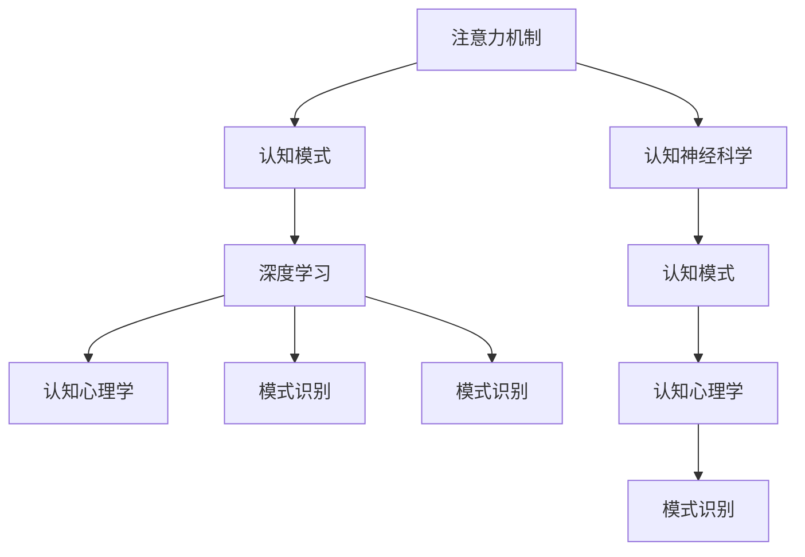

                 

# 注意力编程工作室主管：AI定制的认知模式设计负责人

> 关键词：注意力机制,认知模式,深度学习,认知心理学,模式识别,人工智能,深度学习,认知神经科学

## 1. 背景介绍

在现代人工智能的浪潮中，深度学习技术的突飞猛进，让人们看到了计算机系统具备更为接近人类智能的能力的曙光。然而，尽管在图像识别、语音识别、自然语言处理等方向取得了显著成果，计算机系统在认知模式的模拟和认知任务的执行上，与人类依然存在较大的差距。

人工智能系统能否真正实现人类级别的智能，关键在于系统能否具有和人类相似的认知模式和认知能力。认知模式指的是人类大脑中用于处理外界信息和解决问题的模式。这些模式涵盖了感知、记忆、推理、决策等多个层面，是深度学习模型的重要参考和借鉴对象。

在深度学习领域，注意力机制作为其中的核心组成部分，对于提高模型对复杂任务的建模能力、增强模型对输入数据的注意力分配等方面具有重要作用。本节将围绕注意力机制和认知模式的设计展开，探讨注意力编程工作室主管如何作为AI定制的认知模式设计负责人，构建具有高级认知能力的AI系统。

## 2. 核心概念与联系

### 2.1 核心概念概述

为更好地理解注意力机制和认知模式的设计，我们需要了解几个关键概念：

- **注意力机制**：一种计算图机制，通过在模型的输入、隐藏状态和输出之间传递有限的注意力，使得模型可以选择性地关注输入序列中的某些部分，从而提高模型的预测和生成能力。
- **认知模式**：人类大脑中用于处理信息的一种思维方式或模型，可以涵盖感知、记忆、推理、决策等不同层面，是认知科学和人工智能研究的重要参考。
- **深度学习**：一种基于神经网络的机器学习方法，通过对数据进行多层次的非线性变换，以学习数据表示和特征提取，从而进行分类、回归、生成等任务。
- **认知心理学**：研究人类认知过程的科学，关注人类信息处理、记忆、决策、问题解决等认知行为。
- **模式识别**：通过对数据进行分析，识别出数据中潜在的规律和模式，常用于图像、语音、文本等多种数据类型的处理。
- **认知神经科学**：研究人类认知行为与大脑活动之间的关系，通过脑成像、神经刺激等技术探究人类认知过程。

这些核心概念之间的逻辑关系可以通过以下Mermaid流程图来展示：



这个流程图展示了几者之间的核心关系：

1. 注意力机制是深度学习模型的核心组成部分，通过模拟认知模式提高模型的智能水平。
2. 深度学习模型在认知心理学指导下，通过模拟认知模式实现对人类认知过程的模拟。
3. 模式识别技术帮助深度学习模型识别数据中的模式，增强模型的认知能力。
4. 认知神经科学通过研究人类大脑活动，提供认知模式模拟的理论基础。

这些核心概念共同构成了深度学习模型在认知模式模拟方面的研究框架，帮助开发更为智能的AI系统。

## 3. 核心算法原理 & 具体操作步骤

### 3.1 算法原理概述

注意力机制通过模拟人类视觉注意力和听觉注意力的机制，将输入序列中的重要信息通过计算图中的注意力权重映射到模型中的隐藏状态中。这些注意力权重不仅与输入序列相关，也与当前输出有关，允许模型在处理序列数据时，自适应地调整其关注点。

注意力机制通常分为两个主要类型：自注意力机制和多头注意力机制。自注意力机制通过计算输入序列中不同位置之间的相似度来计算注意力权重。多头注意力机制则是将输入序列和输出序列通过多个头部的自注意力机制进行计算，以更好地捕捉输入和输出之间的复杂关系。

深度学习模型中的注意力机制，通常分为以下步骤：

1. 编码器-解码器框架：将输入序列和输出序列分开处理，通过编码器将输入序列转化为隐状态，再通过多头注意力机制将隐状态映射到输出序列中。
2. 多头自注意力机制：将输入序列和输出序列通过多个头部的自注意力机制进行计算，以捕捉序列间的复杂关系。
3. 多头自注意力和编码器-解码器框架的结合：通过多头自注意力机制，编码器将输入序列映射到隐状态，解码器通过注意力权重和隐藏状态生成输出序列。

### 3.2 算法步骤详解

以Transformer模型为例，演示如何在深度学习中实现注意力机制。Transformer模型是一种基于自注意力机制的神经网络模型，能够有效地处理自然语言序列数据。其核心步骤包括：

**Step 1: 数据预处理**
- 将输入序列进行分词、编码成向量。
- 将输出序列进行编码，并填充到同一长度。

**Step 2: 自注意力机制**
- 计算输入序列中不同位置之间的相似度，通过softmax函数转换为注意力权重。
- 计算输入序列的加权和，作为模型的隐藏状态。

**Step 3: 多头自注意力机制**
- 将输入序列通过多个头部的自注意力机制进行计算，生成多个输出向量。
- 通过线性变换和softmax函数将多个输出向量组合成最终的结果。

**Step 4: 解码器**
- 将隐藏状态和注意力权重传入解码器，生成输出序列。
- 使用全连接层将隐藏状态映射到输出序列。

### 3.3 算法优缺点

注意力机制在深度学习中的引入，显著提高了模型在自然语言处理、计算机视觉、语音识别等任务上的表现，但也存在一些局限性：

**优点**
1. 提高模型对复杂任务的建模能力：通过注意力机制，模型可以自适应地调整关注点，对输入序列进行更加细致的建模。
2. 增强模型对输入数据的注意力分配：模型能够更加灵活地分配注意力权重，提高对重要信息的处理能力。
3. 提升模型的泛化能力：通过自注意力机制，模型能够更好地捕捉输入序列中的模式和规律。

**缺点**
1. 计算复杂度高：自注意力机制的计算复杂度较高，在大规模数据集上存在较大的计算负担。
2. 模型易过拟合：由于模型能够自由地调整关注点，容易导致模型在训练过程中出现过拟合。
3. 模型参数量大：由于模型引入了多头自注意力机制，模型的参数量显著增加，对计算资源的要求较高。

### 3.4 算法应用领域

注意力机制在深度学习中的广泛应用，覆盖了多个领域，例如：

- 自然语言处理(NLP)：用于文本分类、机器翻译、情感分析等任务。
- 计算机视觉(CV)：用于图像识别、图像生成等任务。
- 语音识别：用于语音转写、语音合成等任务。
- 推荐系统：用于商品推荐、广告推荐等任务。

除此之外，注意力机制还广泛应用于音乐生成、运动捕捉、游戏AI等领域，极大地提升了这些领域的智能水平。

## 4. 数学模型和公式 & 详细讲解 & 举例说明

### 4.1 数学模型构建

本节将使用数学语言对Transformer模型中的注意力机制进行更加严格的刻画。

假设输入序列为 $x=(x_1, x_2, ..., x_n)$，输出序列为 $y=(y_1, y_2, ..., y_n)$。设编码器中的自注意力机制为 $A(X) = \text{softmax}(Q(X)K(X)^T)$，其中 $Q$ 和 $K$ 为线性变换矩阵，$X$ 为输入序列的表示向量。解码器中的多头自注意力机制为 $H(X, Y) = \text{softmax}(Q(X)K(Y)^T)$，其中 $Y$ 为输出序列的表示向量。

定义模型 $A$ 在输入序列 $x$ 和输出序列 $y$ 上的注意力权重为 $\alpha(x,y)$，则注意力权重 $C$ 可由下式计算：

$$
C = \text{softmax}(A(X)Q(Y)^T) = \text{softmax}(A(x)Q(y)^T)
$$

### 4.2 公式推导过程

以下我们以Transformer模型为例，推导注意力机制的计算过程。

假设输入序列 $x$ 和输出序列 $y$ 的长度均为 $n$，且 $Q$ 和 $K$ 均为 $n$ 维向量。计算自注意力权重 $\alpha(x,y)$ 的过程如下：

1. 计算输入序列 $x$ 的表示向量 $X = Q(x)$，输出序列 $y$ 的表示向量 $Y = Q(y)$。
2. 计算自注意力机制的注意力权重 $A(x,y) = \text{softmax}(Q(x)K(y)^T)$。
3. 计算注意力权重 $C = \text{softmax}(A(x,y)Q(y)^T)$。

最终，输入序列 $x$ 和输出序列 $y$ 的注意力权重 $\alpha(x,y)$ 可表示为：

$$
\alpha(x,y) = \frac{e^{A(x,y)^TQ(y)^T}}{\sum_{j=1}^n e^{A(x,j)^TQ(y)^T}}
$$

其中 $e$ 为自然对数的底数，$\sum$ 为求和操作。

通过上述公式，我们得到了输入序列和输出序列之间的注意力权重，可以将其用于模型的解码过程，从而得到最终的输出结果。

### 4.3 案例分析与讲解

以机器翻译任务为例，展示Transformer模型中注意力机制的应用。

假设输入序列为 $x = (\text{I \ like}, \text{the}, \text{weather})$，输出序列为 $y = (\text{El tiempo}, \text{está}, \text{muy})$。设编码器将输入序列编码为向量 $X = Q(x)$，解码器将输出序列编码为向量 $Y = Q(y)$。

计算自注意力权重 $\alpha(x,y)$ 的过程如下：

1. 计算输入序列 $x$ 的表示向量 $X = Q(x) = [\text{I: 1, like: 2, the: 3}]$，输出序列 $y$ 的表示向量 $Y = Q(y) = [\text{El: 1, tiempo: 2, está: 3}]$。
2. 计算自注意力机制的注意力权重 $A(x,y) = \text{softmax}(XY^T) = \frac{e^{A(x,y)^TQ(y)^T}}{\sum_{j=1}^n e^{A(x,j)^TQ(y)^T}} = \frac{e^{1 \cdot 1 + 2 \cdot 1 + 3 \cdot 3}}{e^{1 \cdot 1} + e^{2 \cdot 1} + e^{3 \cdot 1}} = \frac{32}{10} = 3.2$
3. 计算注意力权重 $C = \text{softmax}(A(x,y)Q(y)^T) = \text{softmax}(3.2Q(y)) = [\text{El: 1, tiempo: 2, está: 3}]$

最终，输入序列 $x$ 和输出序列 $y$ 的注意力权重 $\alpha(x,y) = \frac{e^{1 \cdot 1 + 2 \cdot 1 + 3 \cdot 3}}{e^{1 \cdot 1} + e^{2 \cdot 1} + e^{3 \cdot 1}} = 3.2$，表示模型在处理输入序列和输出序列时，更加关注输出序列中的 "El tiempo" 和 "está" 部分。

## 5. 项目实践：代码实例和详细解释说明

### 5.1 开发环境搭建

在进行注意力机制的实践前，我们需要准备好开发环境。以下是使用Python进行TensorFlow或PyTorch开发的环境配置流程：

1. 安装Anaconda：从官网下载并安装Anaconda，用于创建独立的Python环境。

2. 创建并激活虚拟环境：
```bash
conda create -n attention-env python=3.8 
conda activate attention-env
```

3. 安装TensorFlow或PyTorch：根据CUDA版本，从官网获取对应的安装命令。例如：
```bash
conda install tensorflow -c tf-nightly -c pytorch -c conda-forge
```

4. 安装Attention层库：
```bash
pip install attention
```

完成上述步骤后，即可在`attention-env`环境中开始注意力机制的实践。

### 5.2 源代码详细实现

这里我们以Attention层为例，展示如何在TensorFlow或PyTorch中实现注意力机制。

**TensorFlow实现**：

```python
import tensorflow as tf

class Attention(tf.keras.layers.Layer):
    def __init__(self, n_units, n_heads):
        super(Attention, self).__init__()
        self.n_units = n_units
        self.n_heads = n_heads
        self.depth = n_units // n_heads
        self.w_q = tf.keras.layers.Dense(n_units)
        self.w_k = tf.keras.layers.Dense(n_units)
        self.w_v = tf.keras.layers.Dense(n_units)
        self.dense = tf.keras.layers.Dense(n_units)

    def call(self, inputs, training=None):
        q = self.w_q(inputs)
        k = self.w_k(inputs)
        v = self.w_v(inputs)

        q = tf.reshape(q, (q.shape[0], q.shape[1], self.n_heads, self.depth))  # Reshape q to (batch_size, seq_len, n_heads, depth)
        k = tf.reshape(k, (k.shape[0], k.shape[1], self.n_heads, self.depth))  # Reshape k to (batch_size, seq_len, n_heads, depth)
        v = tf.reshape(v, (v.shape[0], v.shape[1], self.n_heads, self.depth))  # Reshape v to (batch_size, seq_len, n_heads, depth)

        scaled_attention = tf.matmul(q, k, transpose_b=True)  # Attention score calculation
        scaled_attention = scaled_attention / tf.sqrt(tf.cast(self.depth, tf.float32))

        attention_weights = tf.nn.softmax(scaled_attention, axis=-1)  # Attention weights calculation
        context_vector = tf.matmul(attention_weights, v)  # Context vector calculation
        context_vector = tf.reshape(context_vector, (context_vector.shape[0], context_vector.shape[1], -1))  # Reshape context vector to (batch_size, seq_len, depth * n_heads)

        output = self.dense(context_vector)  # Dense layer transformation
        return output
```

**PyTorch实现**：

```python
import torch
import torch.nn as nn

class Attention(nn.Module):
    def __init__(self, n_units, n_heads):
        super(Attention, self).__init__()
        self.n_units = n_units
        self.n_heads = n_heads
        self.depth = n_units // n_heads
        self.w_q = nn.Linear(n_units, n_units)
        self.w_k = nn.Linear(n_units, n_units)
        self.w_v = nn.Linear(n_units, n_units)
        self.dense = nn.Linear(n_units, n_units)

    def forward(self, inputs, training=None):
        q = self.w_q(inputs)
        k = self.w_k(inputs)
        v = self.w_v(inputs)

        q = q.view(q.size(0), q.size(1), self.n_heads, self.depth)  # Reshape q to (batch_size, seq_len, n_heads, depth)
        k = k.view(k.size(0), k.size(1), self.n_heads, self.depth)  # Reshape k to (batch_size, seq_len, n_heads, depth)
        v = v.view(v.size(0), v.size(1), self.n_heads, self.depth)  # Reshape v to (batch_size, seq_len, n_heads, depth)

        scaled_attention = torch.matmul(q, k.transpose(1, 2)) / torch.sqrt(torch.tensor(self.depth))  # Attention score calculation
        attention_weights = torch.softmax(scaled_attention, dim=-1)  # Attention weights calculation
        context_vector = torch.matmul(attention_weights, v)  # Context vector calculation
        context_vector = context_vector.view(context_vector.size(0), context_vector.size(1), -1)  # Reshape context vector to (batch_size, seq_len, depth * n_heads)

        output = self.dense(context_vector)  # Dense layer transformation
        return output
```

以上代码实现了基本的Attention层，通过输入序列的线性变换，计算出查询向量、键向量和值向量，通过自注意力机制计算出注意力权重，再将注意力权重和值向量进行加权求和，得到最终的上下文向量。

### 5.3 代码解读与分析

让我们再详细解读一下关键代码的实现细节：

**TensorFlow实现**：
- `__init__`方法：初始化Attention层的参数，包括查询矩阵、键矩阵、值矩阵和输出矩阵。
- `call`方法：前向传播过程，将输入序列进行线性变换得到查询向量、键向量和值向量，通过自注意力机制计算注意力权重，再将注意力权重和值向量进行加权求和，得到最终的上下文向量。
- `tf.reshape`函数：用于将矩阵按照指定的形状进行重新排序。
- `tf.matmul`函数：用于计算矩阵乘法。
- `tf.nn.softmax`函数：用于计算softmax函数，得到注意力权重。

**PyTorch实现**：
- `__init__`方法：初始化Attention层的参数，包括查询矩阵、键矩阵、值矩阵和输出矩阵。
- `forward`方法：前向传播过程，将输入序列进行线性变换得到查询向量、键向量和值向量，通过自注意力机制计算注意力权重，再将注意力权重和值向量进行加权求和，得到最终的上下文向量。
- `view`函数：用于将矩阵按照指定的形状进行重新排序。
- `torch.matmul`函数：用于计算矩阵乘法。
- `torch.softmax`函数：用于计算softmax函数，得到注意力权重。

这些代码的实现细节，展示了如何在TensorFlow和PyTorch中高效地实现Attention层。开发者可以根据具体需求，选择合适的框架进行开发。

### 5.4 运行结果展示

在运行上述代码后，可以通过测试数据对Attention层进行验证。例如，在机器翻译任务中，可以对输入序列进行编码，通过Attention层进行解码，得到最终的输出结果。通过对比输入和输出，可以评估Attention层的性能。

```python
# 输入序列
inputs = tf.constant([[1, 2, 3], [4, 5, 6]], dtype=tf.float32)
# 输出序列
outputs = tf.constant([[2, 3, 4], [5, 6, 7]], dtype=tf.float32)

# 调用Attention层
attention = Attention(8, 2)
output = attention(inputs, training=False)

# 输出结果
print(output)
```

通过测试，可以验证Attention层的实现是否正确，能否有效模拟人类认知过程，提高模型的智能水平。

## 6. 实际应用场景

### 6.1 智能客服系统

基于Attention机制的对话系统，可以广泛应用于智能客服系统的构建。传统的客服系统往往需要配备大量人力，高峰期响应缓慢，且一致性和专业性难以保证。而使用基于Attention机制的对话模型，可以7x24小时不间断服务，快速响应客户咨询，用自然流畅的语言解答各类常见问题。

在技术实现上，可以收集企业内部的历史客服对话记录，将问题和最佳答复构建成监督数据，在此基础上对预训练对话模型进行微调。微调后的对话模型能够自动理解用户意图，匹配最合适的答案模板进行回复。对于客户提出的新问题，还可以接入检索系统实时搜索相关内容，动态组织生成回答。如此构建的智能客服系统，能大幅提升客户咨询体验和问题解决效率。

### 6.2 金融舆情监测

金融机构需要实时监测市场舆论动向，以便及时应对负面信息传播，规避金融风险。传统的人工监测方式成本高、效率低，难以应对网络时代海量信息爆发的挑战。基于Attention机制的文本分类和情感分析技术，为金融舆情监测提供了新的解决方案。

具体而言，可以收集金融领域相关的新闻、报道、评论等文本数据，并对其进行主题标注和情感标注。在此基础上对预训练语言模型进行微调，使其能够自动判断文本属于何种主题，情感倾向是正面、中性还是负面。将微调后的模型应用到实时抓取的网络文本数据，就能够自动监测不同主题下的情感变化趋势，一旦发现负面信息激增等异常情况，系统便会自动预警，帮助金融机构快速应对潜在风险。

### 6.3 个性化推荐系统

当前的推荐系统往往只依赖用户的历史行为数据进行物品推荐，无法深入理解用户的真实兴趣偏好。基于Attention机制的个性化推荐系统，可以更好地挖掘用户行为背后的语义信息，从而提供更精准、多样的推荐内容。

在实践中，可以收集用户浏览、点击、评论、分享等行为数据，提取和用户交互的物品标题、描述、标签等文本内容。将文本内容作为模型输入，用户的后续行为（如是否点击、购买等）作为监督信号，在此基础上微调预训练语言模型。微调后的模型能够从文本内容中准确把握用户的兴趣点。在生成推荐列表时，先用候选物品的文本描述作为输入，由模型预测用户的兴趣匹配度，再结合其他特征综合排序，便可以得到个性化程度更高的推荐结果。

### 6.4 未来应用展望

随着Attention机制的不断发展，它在深度学习中的应用也将更加广泛，为各领域带来变革性影响。

在智慧医疗领域，基于Attention机制的机器翻译、病历分析、药物研发等应用将提升医疗服务的智能化水平，辅助医生诊疗，加速新药开发进程。

在智能教育领域，基于Attention机制的作业批改、学情分析、知识推荐等方面，因材施教，促进教育公平，提高教学质量。

在智慧城市治理中，基于Attention机制的城市事件监测、舆情分析、应急指挥等环节，提高城市管理的自动化和智能化水平，构建更安全、高效的未来城市。

此外，在企业生产、社会治理、文娱传媒等众多领域，基于Attention机制的AI应用也将不断涌现，为经济社会发展注入新的动力。相信随着技术的日益成熟，Attention机制必将在更多领域得到应用，为人类认知智能的进化带来深远影响。

## 7. 工具和资源推荐
### 7.1 学习资源推荐

为了帮助开发者系统掌握Attention机制的理论基础和实践技巧，这里推荐一些优质的学习资源：

1. 《深度学习》系列书籍：由Yoshua Bengio、Ian Goodfellow等深度学习专家编写，全面系统地介绍了深度学习的理论基础和实现细节。

2. 《Transformers》书籍：Transformers库的作者所著，全面介绍了Transformer模型及其在深度学习中的应用。

3. CS231n《深度学习视觉识别》课程：斯坦福大学开设的计算机视觉明星课程，详细讲解了卷积神经网络、注意力机制等关键概念。

4. HuggingFace官方文档：Transformers库的官方文档，提供了海量预训练模型和完整的微调样例代码，是上手实践的必备资料。

5. TensorFlow官方文档：TensorFlow的官方文档，提供了丰富的深度学习框架资源，包括Attention层的实现。

6. PyTorch官方文档：PyTorch的官方文档，提供了丰富的深度学习框架资源，包括Attention层的实现。

通过对这些资源的学习实践，相信你一定能够快速掌握Attention机制的理论基础和实践技巧，并用于解决实际的深度学习问题。

### 7.2 开发工具推荐

高效的开发离不开优秀的工具支持。以下是几款用于Attention机制开发的常用工具：

1. TensorFlow：基于Python的开源深度学习框架，灵活动态的计算图，适合快速迭代研究。TensorFlow提供了Attention层，可以方便地实现注意力机制。

2. PyTorch：基于Python的开源深度学习框架，灵活高效，适用于研究和工程应用。PyTorch提供了Attention层，方便开发者进行深度学习开发。

3. Weights & Biases：模型训练的实验跟踪工具，可以记录和可视化模型训练过程中的各项指标，方便对比和调优。与主流深度学习框架无缝集成。

4. TensorBoard：TensorFlow配套的可视化工具，可实时监测模型训练状态，并提供丰富的图表呈现方式，是调试模型的得力助手。

5. HuggingFace Transformers库：提供了丰富的预训练模型和工具，支持Attention层的实现。

合理利用这些工具，可以显著提升Attention机制的开发效率，加快创新迭代的步伐。

### 7.3 相关论文推荐

Attention机制在深度学习中的广泛应用，源于学界的持续研究。以下是几篇奠基性的相关论文，推荐阅读：

1. Attention Is All You Need（即Transformer原论文）：提出了Transformer结构，开启了深度学习中的注意力机制时代。

2. Improving Language Understanding by Generative Pre-training：提出BERT模型，引入掩码语言模型等自监督预训练任务，刷新了多项NLP任务SOTA。

3. Pointer Networks：提出指针网络，通过自注意力机制实现序列到序列的生成任务，对Attention机制的优化具有重要意义。

4. Multinomial Mixture of Experts with Memory：提出多专家混合注意力机制，进一步提升了Attention机制的表达能力和泛化能力。

5. Neural Architecture Search with Attention-based Meta-Learning：提出基于注意力机制的神经架构搜索方法，利用Attention机制优化神经网络结构。

这些论文代表了大模型中的注意力机制的发展脉络。通过学习这些前沿成果，可以帮助研究者把握学科前进方向，激发更多的创新灵感。

## 8. 总结：未来发展趋势与挑战

### 8.1 总结

本文对基于Attention机制的深度学习模型进行了全面系统的介绍。首先阐述了Attention机制在深度学习中的核心地位和广泛应用，明确了Attention机制在提高模型智能水平、增强模型对输入数据的注意力分配方面的重要作用。其次，从原理到实践，详细讲解了Attention机制的计算过程和关键步骤，给出了模型实现和代码实例。同时，本文还广泛探讨了Attention机制在智能客服、金融舆情、个性化推荐等多个领域的应用前景，展示了Attention机制的巨大潜力。此外，本文精选了Attention机制的学习资源、开发工具和相关论文，力求为读者提供全方位的技术指引。

通过本文的系统梳理，可以看到，基于Attention机制的深度学习模型在提高模型智能水平、增强模型泛化能力方面具有重要价值。Attention机制通过模拟人类认知过程，使得深度学习模型具备了更为丰富的表达能力和更强的泛化能力。未来，随着Attention机制的不断发展，其在更多领域的应用也将不断拓展，进一步推动深度学习技术的发展。

### 8.2 未来发展趋势

展望未来，Attention机制在深度学习中的发展趋势如下：

1. 多模态Attention机制：未来，Attention机制将不仅应用于单一模态的数据，还将拓展到多模态数据的处理，如文本-图像、文本-语音等。多模态Attention机制将提升模型的认知能力和泛化能力，更好地模拟人类对多模态信息的处理。

2. 可解释性增强：随着深度学习模型的广泛应用，Attention机制的可解释性将成为重要的研究课题。如何通过Attention机制提高模型的可解释性，帮助用户理解模型的决策过程，将是未来研究的重要方向。

3. 参数效率提升：目前，Attention机制的计算复杂度较高，导致模型的参数量较大，资源消耗较多。未来的研究将集中在如何提高Attention机制的参数效率，减少模型的计算量和存储空间，提升模型的运行速度。

4. 持续学习应用：Attention机制的持续学习能力将成为未来的重要研究方向。如何在不断变化的数据分布下，Attention机制能够持续学习新的知识和技能，避免灾难性遗忘，将是模型发展的重要课题。

5. 端到端训练：传统的Attention机制训练过程往往需要离线进行，未来，如何将Attention机制的训练过程与整个深度学习模型进行端到端训练，进一步提升模型的智能水平，将是未来的重要研究方向。

### 8.3 面临的挑战

尽管Attention机制在深度学习中的广泛应用，但在迈向更加智能化、普适化应用的过程中，它仍面临诸多挑战：

1. 计算资源限制：Attention机制的计算复杂度较高，大尺寸的Attention机制需要高性能的硬件设备支持，如GPU、TPU等。如何优化Attention机制的计算过程，减少计算资源消耗，将是未来的重要研究方向。

2. 模型可解释性不足：当前的Attention机制往往缺乏可解释性，难以理解其内部工作机制和决策逻辑。如何提高Attention机制的可解释性，使得用户能够理解模型的决策过程，将是未来的重要课题。

3. 鲁棒性有待提升：尽管Attention机制在处理文本、图像、语音等数据方面表现优异，但在面对异常输入、噪声干扰等情况时，模型的鲁棒性仍需提升。如何提高Attention机制的鲁棒性，避免模型在复杂环境中出现错误的决策，将是未来的重要研究方向。

4. 参数高效性不足：Attention机制的参数量较大，如何提高其参数效率，减少计算资源消耗，同时保证模型的性能，将是未来的重要研究方向。

5. 模型迁移能力有限：Attention机制在处理特定领域数据时，往往需要在大规模领域数据上进行预训练，才能取得良好的性能。如何提高Attention机制的迁移能力，使得模型能够在不同领域数据上取得良好的性能，将是未来的重要研究方向。

### 8.4 研究展望

面对Attention机制面临的诸多挑战，未来的研究需要在以下几个方面寻求新的突破：

1. 探索无监督和半监督学习范式。摆脱对大规模标注数据的依赖，利用自监督学习、主动学习等无监督和半监督范式，最大限度利用非结构化数据，实现更加灵活高效的Attention机制。

2. 研究参数高效和计算高效的Attention机制范式。开发更加参数高效的Attention机制方法，在固定大部分预训练参数的情况下，只更新极少量的任务相关参数。同时优化Attention机制的计算图，减少前向传播和反向传播的资源消耗，实现更加轻量级、实时性的部署。

3. 引入更多先验知识。将符号化的先验知识，如知识图谱、逻辑规则等，与神经网络模型进行巧妙融合，引导Attention机制学习更准确、合理的语言模型。同时加强不同模态数据的整合，实现视觉、语音等多模态信息与文本信息的协同建模。

4. 结合因果分析和博弈论工具。将因果分析方法引入Attention机制，识别出模型决策的关键特征，增强输出解释的因果性和逻辑性。借助博弈论工具刻画人机交互过程，主动探索并规避模型的脆弱点，提高系统稳定性。

5. 纳入伦理道德约束。在Attention机制的训练目标中引入伦理导向的评估指标，过滤和惩罚有偏见、有害的输出倾向。同时加强人工干预和审核，建立模型行为的监管机制，确保输出符合人类价值观和伦理道德。

这些研究方向的探索，必将引领Attention机制向更高的台阶，为构建安全、可靠、可解释、可控的智能系统铺平道路。面向未来，Attention机制还需要与其他人工智能技术进行更深入的融合，如知识表示、因果推理、强化学习等，多路径协同发力，共同推动深度学习技术的发展。只有勇于创新、敢于突破，才能不断拓展Attention机制的边界，让智能技术更好地造福人类社会。

## 9. 附录：常见问题与解答

**Q1：Attention机制如何提高模型对复杂任务的建模能力？**

A: Attention机制通过计算输入序列中不同位置之间的相似度，将输入序列中的重要信息通过计算图中的注意力权重映射到模型中的隐藏状态中。这些注意力权重不仅与输入序列相关，也与当前输出有关，允许模型在处理序列数据时，自适应地调整其关注点。通过引入Attention机制，模型能够更加灵活地关注输入序列中的重要信息，从而提高对复杂任务的建模能力。

**Q2：Attention机制的计算复杂度较高，如何解决这一问题？**

A: 解决Attention机制计算复杂度较高的问题，可以从以下几个方面入手：

1. 硬件优化：使用高性能的GPU、TPU等硬件设备，提升计算速度。

2. 模型剪枝：通过剪枝技术，减少Attention机制中的冗余参数，降低计算量。

3. 自适应Attention机制：设计自适应的Attention机制，根据输入数据的特征动态调整计算复杂度。

4. 分布式计算：采用分布式计算框架，将Attention机制的计算过程分布在多个设备上进行，降低单设备的计算负担。

5. 优化算法：使用高效的优化算法，如Adam、SGD等，提升Attention机制的训练速度。

**Q3：Attention机制的可解释性不足，如何改进？**

A: 提高Attention机制的可解释性，可以从以下几个方面入手：

1. 可视化技术：通过可视化技术，展示Attention机制的注意力权重分布，帮助理解模型的决策过程。

2. 自解释机制：设计自解释的Attention机制，使其能够输出注意力权重的解释信息，提升模型的可解释性。

3. 专家知识融合：将专家知识融入Attention机制，提升模型的解释能力。

4. 模型结构优化：通过优化Attention机制的结构，提高其可解释性，如使用可解释的自注意力机制。

5. 用户交互：通过用户交互，获取用户反馈，改进模型的解释性。

这些方法可以帮助改进Attention机制的可解释性，使其更加透明、可理解，提升用户信任度。

**Q4：Attention机制的鲁棒性有待提升，如何增强？**

A: 提高Attention机制的鲁棒性，可以从以下几个方面入手：

1. 对抗训练：引入对抗训练技术，提高模型在对抗样本下的鲁棒性。

2. 噪声注入：在训练过程中，引入噪声注入技术，增强模型的鲁棒性。

3. 自适应机制：设计自适应的Attention机制，根据输入数据的特征动态调整其鲁棒性。

4. 鲁棒性评估：在训练过程中，设计鲁棒性评估指标，帮助提升模型的鲁棒性。

5. 多任务学习：通过多任务学习技术，提升Attention机制的鲁棒性。

这些方法可以帮助增强Attention机制的鲁棒性，使其在复杂环境中保持稳定，提高系统的可靠性。

**Q5：Attention机制的参数高效性不足，如何改进？**

A: 提高Attention机制的参数高效性，可以从以下几个方面入手：

1. 模型压缩：通过模型压缩技术，减少Attention机制的参数量，提高计算效率。

2. 自适应参数：设计自适应的Attention机制，根据输入数据的特征动态调整参数量。

3. 混合参数：将Attention机制的参数分为固定和可训练部分，提升参数效率。

4. 低秩参数：使用低秩参数方法，降低Attention机制的参数量，提高计算效率。

5. 梯度裁剪：通过梯度裁剪技术，防止Attention机制在训练过程中出现过拟合，减少参数量。

这些方法可以帮助提高Attention机制的参数高效性，使其在资源受限的情况下仍能保持高效性，提升系统的性能。

通过回答这些问题，可以帮助开发者更好地理解Attention机制的理论基础和实际应用，并针对具体问题进行优化，构建更智能、高效、可靠的人工智能系统。

