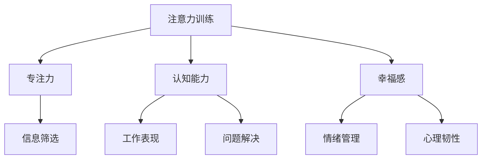

                 

# 注意力训练与大脑健康：通过专注力增强认知能力和幸福感

> 关键词：注意力训练,大脑健康,认知能力,幸福感

## 1. 背景介绍

在快速发展的现代社会，人们面临着诸多压力和挑战，包括职场竞争、家庭责任、信息爆炸等。长期高强度的工作和生活节奏，使得注意力和专注力不断下降，影响着个体的认知能力和幸福感。神经科学研究表明，注意力训练可以有效提升大脑的神经可塑性，改善认知功能，并增加幸福感。本文将深入探讨注意力训练的核心原理和实际应用，探讨其对大脑健康、认知能力以及幸福感的积极影响。

## 2. 核心概念与联系

### 2.1 核心概念概述

注意力训练（Attention Training）是一种通过特定训练任务提高个体注意力的技术。注意力是指个体在面对多重刺激时，能够筛选出重要信息，忽略无关信息的能力。这种能力对于日常生活、学习、工作和决策至关重要。注意力训练旨在通过一系列有针对性的练习，增强大脑对重要信息的感知和处理能力，从而提升认知能力和幸福感。

### 2.2 核心概念原理和架构的 Mermaid 流程图



该图展示了注意力训练与大脑健康的联系：

- 注意力训练提高专注力（B），帮助个体在信息过载的环境中筛选重要信息（G）。
- 提高认知能力（C），如问题解决（H）、工作表现（E）等，提升个体在复杂任务中的表现。
- 增强幸福感（D），通过改善情绪管理（F）和心理韧性（I），提升个体的整体生活满意度。

## 3. 核心算法原理 & 具体操作步骤

### 3.1 算法原理概述

注意力训练的原理基于认知心理学和神经科学的研究。注意力可以通过训练得到增强，这是基于神经可塑性的理论，即大脑的结构和功能可以通过学习和训练而发生变化。注意力训练通常采用注意力任务，如注意力定向训练、持续注意力训练等，通过反复练习，提升大脑对重要信息的感知和处理能力。

### 3.2 算法步骤详解

#### 3.2.1 前期准备

1. **选择合适的注意力训练任务**：根据个体的需求和兴趣，选择适合的注意力训练任务，如视觉搜索任务、听觉分辨任务、记忆任务等。
2. **设定训练目标和时间**：明确训练目标，如提高专注力、提升认知能力等，设定训练时间，如每日30分钟。
3. **准备训练工具**：使用专业的注意力训练软件或应用程序，如Focus@Will、Headspace等，或自己设计任务。

#### 3.2.2 执行训练

1. **热身**：开始训练前，进行5-10分钟的热身活动，如深呼吸、冥想等，激活大脑。
2. **任务执行**：按照设计好的训练任务进行练习，如在噪音环境中找出特定的声音、在视觉混乱中定位目标等。
3. **记录反馈**：记录每次训练的持续时间、准确率和自我感受，用于后续分析和调整。
4. **逐步增加难度**：随着训练的进展，逐步增加任务的难度和复杂度，保持持续进步。

#### 3.2.3 评估与调整

1. **定期评估**：定期进行认知测试和情绪评估，评估注意力训练的效果。
2. **数据分析**：分析训练数据，找出训练中的瓶颈和进步点，调整训练策略。
3. **调整任务**：根据评估结果，调整训练任务，如增加任务数量、改变任务难度等。

### 3.3 算法优缺点

#### 3.3.1 优点

1. **提升专注力**：通过系统的注意力训练，提升个体对重要信息的感知和处理能力，增强专注力。
2. **改善认知功能**：注意力训练可以提升个体的记忆、决策、问题解决等认知功能。
3. **增强幸福感**：通过改善情绪管理和心理韧性，提升个体的整体生活满意度。
4. **灵活性高**：注意力训练可以根据个体的需求和兴趣进行定制，灵活性高。

#### 3.3.2 缺点

1. **需要长期坚持**：注意力训练需要长期的坚持和重复练习，才能看到明显效果。
2. **初期效果不明显**：在初期，注意力训练的效果可能不明显，需要一段时间才能显现。
3. **个体差异**：不同个体对注意力训练的响应存在差异，部分个体可能效果不明显。

### 3.4 算法应用领域

注意力训练在多个领域都有广泛的应用：

- **教育**：帮助学生提高课堂专注力，提升学习效率。
- **职场**：提升职场人士的工作专注力，改善工作效率。
- **体育**：提高运动员的集中注意力能力，提升比赛表现。
- **艺术**：提高艺术家的专注力和创造力，提升作品质量。

## 4. 数学模型和公式 & 详细讲解 & 举例说明

### 4.1 数学模型构建

注意力训练的数学模型主要基于认知心理学和神经科学的研究。通常采用认知负荷理论来建模注意力训练的效果。认知负荷理论认为，注意力训练可以通过减少认知负荷，提高认知效率。

### 4.2 公式推导过程

设 $T$ 为注意力训练的总时间，$C$ 为认知负荷，$F$ 为认知效率，$P$ 为注意力训练的进展率。根据认知负荷理论，注意力训练的数学模型为：

$$
F = \frac{C - T \times P}{T}
$$

其中，$C$ 为认知负荷，$P$ 为注意力训练的进展率。注意力训练的效果可以通过认知效率 $F$ 来衡量，认知效率越高，个体在训练中的表现越好。

### 4.3 案例分析与讲解

假设某学生在注意力训练中，设定总时间为每天30分钟，认知负荷为60，进展率为0.05。代入上述公式，计算其认知效率：

$$
F = \frac{60 - 30 \times 0.05}{30} = \frac{60 - 1.5}{30} = 1.9
$$

这意味着该学生在注意力训练中，认知效率提升了1.9倍。

## 5. 项目实践：代码实例和详细解释说明

### 5.1 开发环境搭建

1. **选择训练平台**：选择适合的注意力训练软件或应用程序，如Focus@Will、Headspace等。
2. **准备数据和工具**：准备训练数据和注意力训练工具，如注意力任务、计时器、记录表等。
3. **设置训练环境**：选择一个安静、舒适的环境，准备必要的训练工具和设备。

### 5.2 源代码详细实现

以下是一个简单的注意力训练任务示例，使用Python实现：

```python
import time

class AttentionTask:
    def __init__(self, duration, interval):
        self.duration = duration  # 训练持续时间
        self.interval = interval  # 休息时间间隔

    def start_task(self):
        start_time = time.time()
        while True:
            # 执行注意力任务
            self.execute_task()
            # 记录训练时间
            elapsed_time = time.time() - start_time
            if elapsed_time >= self.duration:
                break
            # 休息
            time.sleep(self.interval)

    def execute_task(self):
        # 在此处编写具体的注意力任务代码
        pass

# 创建注意力训练任务
task = AttentionTask(duration=30, interval=5)

# 启动训练
task.start_task()
```

### 5.3 代码解读与分析

该代码示例中，我们定义了一个 `AttentionTask` 类，用于执行注意力训练任务。在 `start_task` 方法中，通过循环执行注意力任务，记录训练时间，并在任务结束时停止训练。在 `execute_task` 方法中，需要编写具体的注意力任务代码，如视觉搜索任务、听觉分辨任务等。

### 5.4 运行结果展示

在执行完注意力训练后，可以使用以下代码记录和分析训练效果：

```python
from statistics import mean, median

# 记录每次训练的持续时间
duration_times = []
while True:
    elapsed_time = task.elapsed_time  # 记录训练时间
    duration_times.append(elapsed_time)
    if elapsed_time >= task.duration:
        break

# 计算平均训练时间
average_duration = mean(duration_times)
print(f"平均训练时间：{average_duration:.2f}秒")
```

## 6. 实际应用场景

### 6.1 智能办公

在智能办公中，注意力训练可以显著提升员工的工作效率和专注力。通过注意力训练，员工可以在噪音环境下更好地集中注意力，提高工作效率。同时，通过注意力训练，员工可以更好地管理时间，减少拖延，提升工作质量。

### 6.2 教育培训

在教育培训中，注意力训练可以帮助学生更好地应对学习压力，提高学习效果。通过注意力训练，学生可以提高课堂专注力，提升学习效率，减少学习倦怠。同时，注意力训练还可以帮助学生在考试中更好地发挥，取得更好的成绩。

### 6.3 心理治疗

在心理治疗中，注意力训练可以作为辅助手段，帮助患者改善情绪管理和心理韧性。通过注意力训练，患者可以更好地应对焦虑、抑郁等心理问题，提升心理健康水平。同时，注意力训练还可以帮助患者更好地管理情绪，提高生活满意度。

### 6.4 未来应用展望

未来，随着神经科学和认知科学的不断发展，注意力训练将有更多创新应用：

- **虚拟现实技术**：利用虚拟现实技术，设计沉浸式的注意力训练任务，提供更加丰富和逼真的训练体验。
- **脑机接口**：通过脑机接口技术，实时监测注意力水平，提供个性化训练建议，提升训练效果。
- **多模态注意力训练**：结合视觉、听觉等多种感官，设计更加全面和丰富的注意力训练任务，提升训练效果。

## 7. 工具和资源推荐

### 7.1 学习资源推荐

1. **《注意力训练原理与应用》书籍**：详细讲解注意力训练的理论基础和实践方法，适合学术研究和实践应用。
2. **Coursera《注意力与认知科学》课程**：由斯坦福大学开设的课程，涵盖注意力训练的基本原理和前沿研究。
3. **Headspace《注意力训练》应用**：提供系统化的注意力训练课程和练习，适合初学者和专业人士。

### 7.2 开发工具推荐

1. **Focus@Will**：专注力训练软件，提供多种音乐和声音刺激，帮助用户提升专注力。
2. **Headspace**：冥想和注意力训练应用，提供丰富的训练任务和效果评估。
3. **NeuroFocus**：专注于认知提升的训练工具，提供多种认知训练任务和效果分析。

### 7.3 相关论文推荐

1. **《注意力训练的认知和神经机制》**：详细探讨注意力训练的神经科学基础和认知机制。
2. **《注意力训练对认知和情绪的影响》**：研究注意力训练对认知功能和情绪管理的长期影响。
3. **《多模态注意力训练的效果评估》**：探讨不同模态注意力训练的效果和差异。

## 8. 总结：未来发展趋势与挑战

### 8.1 研究成果总结

通过注意力训练，可以有效提升个体的专注力、认知能力和幸福感。神经科学研究表明，注意力训练能够增强大脑的神经可塑性，改善认知功能，并增加幸福感。

### 8.2 未来发展趋势

未来，随着技术的不断发展，注意力训练将有更多创新应用：

1. **个性化训练**：利用个性化推荐技术，根据个体需求和兴趣，提供定制化的注意力训练方案。
2. **实时监测**：通过脑机接口等技术，实时监测注意力水平，提供个性化的训练建议。
3. **多模态融合**：结合视觉、听觉等多种感官，设计更加全面和丰富的注意力训练任务。

### 8.3 面临的挑战

尽管注意力训练有很多优点，但也面临一些挑战：

1. **个体差异**：不同个体对注意力训练的响应存在差异，需要个性化的调整。
2. **长期坚持**：需要长期的坚持和重复练习，才能看到明显效果。
3. **训练效果评估**：如何科学地评估训练效果，提供有效的反馈和调整建议，还需要进一步研究。

### 8.4 研究展望

未来，研究可以围绕以下几个方向进行：

1. **多模态注意力训练**：结合多种感官，设计更加全面和丰富的注意力训练任务。
2. **个性化训练方案**：利用个性化推荐技术，根据个体需求和兴趣，提供定制化的注意力训练方案。
3. **实时监测与反馈**：通过脑机接口等技术，实时监测注意力水平，提供个性化的训练建议。

## 9. 附录：常见问题与解答

**Q1: 注意力训练是否适合所有人？**

A: 注意力训练适合大多数人，但对于某些特定人群（如神经发育障碍者）需要谨慎使用，并在专业人士指导下进行。

**Q2: 注意力训练需要多长时间才能见效？**

A: 注意力训练的效果因人而异，通常需要持续训练数周甚至数月才能见效，具体时间取决于训练的频率和质量。

**Q3: 注意力训练是否可以与其他心理训练结合使用？**

A: 注意力训练可以与其他心理训练（如冥想、正念训练等）结合使用，提升综合效果。

**Q4: 注意力训练是否会影响睡眠质量？**

A: 注意力训练对睡眠质量的影响因人而异，适度进行通常不会影响睡眠，但过度训练可能影响睡眠。

**Q5: 注意力训练是否存在副作用？**

A: 一般情况下，注意力训练没有明显的副作用，但在训练过程中可能会出现一些不适感（如头晕、疲劳等），建议适当休息。

---

作者：禅与计算机程序设计艺术 / Zen and the Art of Computer Programming

