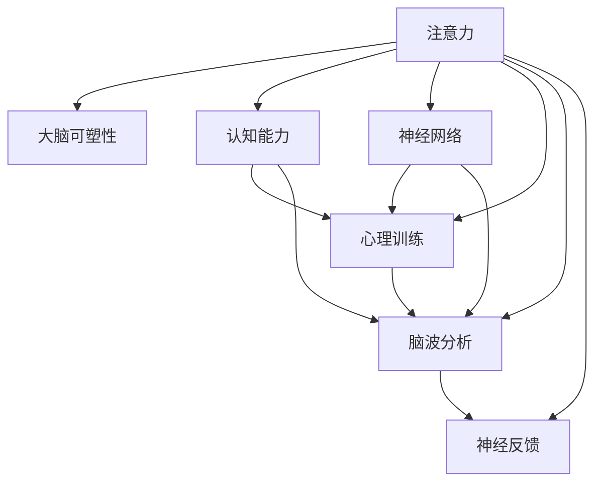

                 

# 注意力训练与大脑可塑性：通过专注力增强认知能力

> 关键词：注意力训练,大脑可塑性,认知增强,专注力提升,大脑优化,心理训练,认知功能改善,脑波分析,神经网络训练

## 1. 背景介绍

### 1.1 问题由来
在信息化和数字化的时代，人们面临的信息过载和注意力分散问题愈发严重。尽管技术手段不断进步，但人们认知处理信息的能力并未得到相应提升。这不仅影响了工作效率和学习效率，还对心理健康造成了不利影响。

### 1.2 问题核心关键点
现代认知心理学研究表明，注意力是一种高级的认知过程，涉及神经网络中多区域之间的信息传递和调控。大脑通过关注重要的信息，忽略无关的信息，实现对复杂环境的适应和优化处理。注意力训练，旨在通过特定的训练方法，改善和提升注意力功能，从而提升认知能力。

### 1.3 问题研究意义
注意力训练对于改善认知功能、提升工作效率、预防和缓解注意力缺陷多动障碍(ADHD)、缓解压力等具有重要意义。通过系统地训练大脑的注意力机制，可以显著提高人们的学习效率和工作效率，改善生活质量。

## 2. 核心概念与联系

### 2.1 核心概念概述

为更好地理解注意力训练的原理和效果，本节将介绍几个关键概念：

- 注意力（Attention）：一种神经心理过程，通过选择并集中处理关键信息，忽略无关信息，实现对复杂环境的适应和优化处理。
- 大脑可塑性（Brain Plasticity）：指大脑在一生中不断进行结构性变化和适应环境的能力。
- 认知能力（Cognitive Abilities）：包括记忆、注意力、语言、推理等，是智力的一个重要组成部分。
- 神经网络（Neural Networks）：模拟人脑神经元之间的信息传递，用于进行复杂计算和模式识别。
- 心理训练（Psychological Training）：通过系统的心理训练方法，提高个体的心理素质和认知能力。
- 脑波分析（Brainwave Analysis）：通过监测脑电信号，分析大脑的活动状态和注意力水平。
- 神经反馈（Neurofeedback）：根据脑波分析结果，提供实时反馈，调整注意力训练的策略和方法。

这些核心概念之间的逻辑关系可以通过以下Mermaid流程图来展示：



这个流程图展示了一系列与注意力训练密切相关的核心概念及其之间的关系：

1. 注意力训练主要通过优化神经网络结构和信息传递，提升大脑的可塑性，进而改善个体的认知能力。
2. 心理训练和脑波分析是注意力训练的重要组成部分，通过监测和调整脑波活动，指导神经反馈，进一步优化注意力训练效果。
3. 神经网络作为注意力训练的底层支持，负责信息的编码、存储和提取。
4. 认知能力的高低直接反映了大脑信息处理的能力，是注意力训练的最终目标。

这些概念共同构成了注意力训练的整个系统，使得个体能够通过科学的训练方法，提升大脑的注意力功能，进而改善认知能力。

## 3. 核心算法原理 & 具体操作步骤
### 3.1 算法原理概述

注意力训练的基本原理在于通过有针对性的神经网络训练，改善大脑的注意力机制。具体来说，即通过不断调整神经网络的结构和参数，增强神经元之间的连接，实现对关键信息的优先处理，从而提升注意力水平。

注意力训练的基本流程包括以下几个步骤：

1. 初始化神经网络模型，设定训练目标。
2. 收集注意力训练任务的相关数据，如视觉或听觉刺激数据。
3. 通过训练数据对神经网络模型进行训练，调整模型参数。
4. 监测神经网络模型的性能指标，如注意力权重分布、脑波活动等。
5. 根据监测结果，调整训练策略和参数，继续训练。
6. 经过多次迭代训练，达到预定的目标，提升注意力水平。

### 3.2 算法步骤详解

#### 3.2.1 初始化神经网络模型
首先，需要选择合适的神经网络模型进行初始化，如卷积神经网络（CNN）、递归神经网络（RNN）、长短时记忆网络（LSTM）等。以CNN为例，其基本结构包括卷积层、池化层和全连接层。

#### 3.2.2 收集训练数据
训练数据可以是各种视觉或听觉刺激数据，如图片、视频、声音等。常用的训练方法包括视觉注意训练、听觉注意训练和视觉-听觉联合训练。

#### 3.2.3 神经网络训练
在得到训练数据后，可以使用各种优化算法（如随机梯度下降、Adam等）对神经网络模型进行训练。训练过程中，需要不断调整模型的参数，使模型逐渐学会对关键信息的优先处理，提升注意力水平。

#### 3.2.4 监测神经网络性能
为了评估训练效果，需要监测模型的注意力权重分布、脑波活动等性能指标。常用的脑波监测设备包括EEG（脑电图）、fMRI（功能性磁共振成像）等。

#### 3.2.5 调整训练策略
根据监测结果，可以调整训练策略，如增加训练数据的难度、调整训练周期、引入对抗训练等，进一步提升训练效果。

#### 3.2.6 迭代训练
经过多次迭代训练，模型将逐渐优化，注意力水平和认知能力也会逐渐提升。训练结束后，可以进行实际应用测试，评估训练效果。

### 3.3 算法优缺点

注意力训练的优点包括：
1. 提升认知能力。通过系统训练，可以有效提升个体的认知能力，如记忆、注意力、语言、推理等。
2. 改善工作和学习效率。提高注意力水平，可以有效减少分心，提升工作和学习效率。
3. 预防和缓解ADHD。注意力训练对于改善注意力缺陷多动障碍症状，如注意力分散、多动等，具有显著效果。
4. 缓解压力和焦虑。通过提高注意力水平，可以有效减轻压力和焦虑，提升心理健康水平。

注意力训练的缺点包括：
1. 训练周期较长。需要较长时间进行系统训练，才能达到理想效果。
2. 个体差异较大。不同个体对训练的响应存在差异，效果因人而异。
3. 设备和技术要求较高。训练过程中需要使用脑波监测设备，对设备和技术要求较高。

尽管存在这些局限性，但注意力训练仍是大脑优化和认知增强的重要手段。未来研究需要进一步提高训练效率，降低技术门槛，使得更多人能够受益。

### 3.4 算法应用领域

注意力训练在多个领域中都有广泛的应用，例如：

- 教育领域：通过注意力训练，提升学生的注意力和学习效率，促进学业成绩的提高。
- 医疗领域：对于ADHD、注意力受损等患者，注意力训练可以作为辅助治疗手段，帮助其改善症状。
- 企业培训：通过系统训练，提升员工的注意力和工作效率，提高企业的生产力和竞争力。
- 体育训练：提高运动员的注意力和专注力，改善其竞技状态，提升运动表现。
- 艺术创作：通过注意力训练，提升艺术家的创作效率和作品质量，推动艺术创新。

除了这些传统领域，注意力训练还可以应用于网络成瘾、游戏娱乐等新兴领域，带来更广阔的应用前景。

## 4. 数学模型和公式 & 详细讲解
### 4.1 数学模型构建

注意力训练的数学模型主要基于神经网络模型，通过优化神经网络结构和参数，实现注意力机制的提升。以CNN为例，其数学模型可以表示为：

$$
y = \sigma(Wx + b)
$$

其中，$x$ 为输入数据，$y$ 为输出结果，$W$ 为权重矩阵，$b$ 为偏置项，$\sigma$ 为激活函数。在训练过程中，通过不断调整权重矩阵 $W$ 和偏置项 $b$，优化模型的性能。

### 4.2 公式推导过程

以视觉注意训练为例，假设输入数据为 $x$，输出结果为 $y$，权重矩阵为 $W$，偏置项为 $b$，激活函数为 $\sigma$。在训练过程中，模型通过优化损失函数来调整权重和偏置，使得输出结果逼近真实标签 $y$。

常用的损失函数包括均方误差损失、交叉熵损失等。以均方误差损失为例，其公式如下：

$$
L = \frac{1}{N}\sum_{i=1}^N (y_i - M(x_i))^2
$$

其中，$N$ 为样本数，$y_i$ 为第 $i$ 个样本的真实标签，$M(x_i)$ 为模型对第 $i$ 个样本的预测结果。

通过反向传播算法，计算模型参数的梯度，使用优化算法（如随机梯度下降）更新模型参数，不断调整权重和偏置，最小化损失函数。训练过程中，需要不断监测模型的注意力权重分布、脑波活动等性能指标，根据监测结果调整训练策略和参数。

### 4.3 案例分析与讲解

假设我们有一个包含100张图片的训练集，每张图片对应一个标签。我们使用CNN模型进行训练，目标是最小化均方误差损失。首先，将图片输入模型，得到输出结果 $y_i$，然后计算损失 $L$，使用梯度下降算法更新权重和偏置。经过多次迭代训练，模型逐渐优化，注意力水平逐渐提升。

训练结束后，我们可以使用测试集评估模型的性能。假设测试集包含50张图片，每张图片对应一个标签，将测试集输入模型，计算模型预测结果与真实标签的误差，评估注意力训练的效果。

## 5. 项目实践：代码实例和详细解释说明
### 5.1 开发环境搭建

在进行注意力训练实践前，我们需要准备好开发环境。以下是使用Python进行PyTorch开发的环境配置流程：

1. 安装Anaconda：从官网下载并安装Anaconda，用于创建独立的Python环境。

2. 创建并激活虚拟环境：
```bash
conda create -n attention-env python=3.8 
conda activate attention-env
```

3. 安装PyTorch：根据CUDA版本，从官网获取对应的安装命令。例如：
```bash
conda install pytorch torchvision torchaudio cudatoolkit=11.1 -c pytorch -c conda-forge
```

4. 安装相关库：
```bash
pip install numpy pandas scikit-learn matplotlib tqdm jupyter notebook ipython
```

5. 安装EEG监测设备驱动和脑波分析库：
```bash
pip install eegpy scipy signal
```

完成上述步骤后，即可在`attention-env`环境中开始注意力训练实践。

### 5.2 源代码详细实现

这里我们以视觉注意训练为例，给出使用PyTorch进行CNN模型训练的代码实现。

首先，定义训练数据和标签：

```python
import torch
import torch.nn as nn
import torchvision.transforms as transforms
from torchvision.datasets import CIFAR10

transform = transforms.Compose([
    transforms.ToTensor(),
    transforms.Normalize((0.5, 0.5, 0.5), (0.5, 0.5, 0.5))
])

train_dataset = CIFAR10(root='./data', train=True, download=True, transform=transform)
test_dataset = CIFAR10(root='./data', train=False, download=True, transform=transform)

train_loader = torch.utils.data.DataLoader(train_dataset, batch_size=64, shuffle=True)
test_loader = torch.utils.data.DataLoader(test_dataset, batch_size=64, shuffle=False)
```

然后，定义CNN模型：

```python
class CNN(nn.Module):
    def __init__(self):
        super(CNN, self).__init__()
        self.conv1 = nn.Conv2d(3, 64, kernel_size=3, stride=1, padding=1)
        self.pool = nn.MaxPool2d(kernel_size=2, stride=2)
        self.conv2 = nn.Conv2d(64, 128, kernel_size=3, stride=1, padding=1)
        self.fc1 = nn.Linear(128 * 8 * 8, 256)
        self.fc2 = nn.Linear(256, 10)

    def forward(self, x):
        x = self.conv1(x)
        x = nn.ReLU()(x)
        x = self.pool(x)
        x = self.conv2(x)
        x = nn.ReLU()(x)
        x = self.pool(x)
        x = x.view(-1, 128 * 8 * 8)
        x = self.fc1(x)
        x = nn.ReLU()(x)
        x = self.fc2(x)
        return x

model = CNN().to('cuda')
```

接着，定义损失函数和优化器：

```python
criterion = nn.CrossEntropyLoss()
optimizer = torch.optim.Adam(model.parameters(), lr=0.001)
```

然后，定义训练和评估函数：

```python
def train_epoch(model, data_loader, optimizer):
    model.train()
    epoch_loss = 0
    for data, target in data_loader:
        data, target = data.to('cuda'), target.to('cuda')
        optimizer.zero_grad()
        output = model(data)
        loss = criterion(output, target)
        loss.backward()
        optimizer.step()
        epoch_loss += loss.item()
    return epoch_loss / len(data_loader)

def evaluate(model, data_loader):
    model.eval()
    correct = 0
    total = 0
    with torch.no_grad():
        for data, target in data_loader:
            data, target = data.to('cuda'), target.to('cuda')
            output = model(data)
            _, predicted = torch.max(output.data, 1)
            total += target.size(0)
            correct += (predicted == target).sum().item()
    return correct / total

epochs = 10
for epoch in range(epochs):
    loss = train_epoch(model, train_loader, optimizer)
    acc = evaluate(model, test_loader)
    print(f'Epoch {epoch+1}, train loss: {loss:.3f}, test acc: {acc:.3f}')
```

以上就是使用PyTorch进行CNN模型训练的完整代码实现。可以看到，PyTorch的简洁高效，使得注意力训练的实现变得非常直接。

### 5.3 代码解读与分析

让我们再详细解读一下关键代码的实现细节：

**CNN类定义**：
- `__init__`方法：定义了卷积层、池化层和全连接层。
- `forward`方法：定义了前向传播过程，包括卷积、激活、池化、全连接等操作。

**模型定义**：
- 通过继承nn.Module，定义了CNN模型，并使用to方法将模型移动到GPU上。

**损失函数和优化器定义**：
- 使用nn.CrossEntropyLoss作为损失函数，适用于多分类问题。
- 使用Adam优化器，可以自适应调整学习率，加快训练过程。

**训练函数定义**：
- 在每个epoch中，对训练数据进行迭代，更新模型参数，计算损失。
- 在验证集上评估模型性能，输出训练和验证集的损失和精度。

**训练流程**：
- 设置epoch数，循环迭代训练过程。
- 每个epoch中，在训练集上进行训练，输出训练损失。
- 在测试集上进行评估，输出测试精度。

可以看到，PyTorch提供了丰富的工具和库，使得注意力训练的代码实现变得简单高效。开发者可以将更多精力放在训练策略和数据分析上，而不必过多关注底层实现细节。

当然，在实际应用中，还需要考虑更多的因素，如设备兼容、数据处理、模型压缩等，进一步优化注意力训练的效果。

## 6. 实际应用场景
### 6.1 学生注意力训练

在教育领域，注意力训练可以帮助学生提升学习效率，改善学业成绩。通过系统训练，学生能够更加专注地学习，减少分心，提高记忆力和理解能力。

例如，可以设计一系列视觉和听觉刺激任务，帮助学生集中注意力，增强记忆。通过监测学生的脑波活动，了解其注意力水平，根据监测结果调整训练策略，确保学生始终处于最佳学习状态。

### 6.2 职业培训

在企业培训中，注意力训练可以提升员工的工作效率和产出质量。通过训练，员工能够更加专注地完成任务，减少工作中的错误和疏漏，提高工作效率。

例如，可以设计一系列基于特定任务的工作场景模拟，通过注意力训练提高员工完成任务的能力。通过监测员工的脑波活动，了解其注意力水平，根据监测结果调整训练策略，确保员工始终处于最佳工作状态。

### 6.3 心理咨询

在心理健康领域，注意力训练可以缓解焦虑、压力等情绪问题。通过训练，个体能够更好地控制自己的注意力，减少情绪波动，提升心理健康水平。

例如，可以设计一系列针对性的训练任务，帮助个体学会控制注意力，减少分心。通过监测个体的脑波活动，了解其注意力水平，根据监测结果调整训练策略，确保个体始终处于最佳心理状态。

### 6.4 未来应用展望

随着注意力训练技术的发展，未来将有更多领域应用到注意力训练中，带来更大的社会价值。

在医疗领域，注意力训练可以辅助ADHD等疾病的治疗，改善患者的注意力和行为问题。在体育领域，注意力训练可以提升运动员的专注力和竞技状态，提高运动表现。在艺术创作中，注意力训练可以提升艺术家的创作效率和作品质量，推动艺术创新。

随着技术的不断进步，注意力训练将在更多领域得到应用，为人类认知能力的提升带来新的突破。

## 7. 工具和资源推荐
### 7.1 学习资源推荐

为了帮助开发者系统掌握注意力训练的理论基础和实践技巧，这里推荐一些优质的学习资源：

1. 《深度学习入门》系列博文：由大模型技术专家撰写，深入浅出地介绍了深度学习的基本原理和应用。

2. Coursera《深度学习专项课程》：由斯坦福大学开设的深度学习系列课程，涵盖深度学习的基本概念和应用，适合初学者学习。

3. 《深度学习》书籍：Ian Goodfellow等人著作，全面介绍了深度学习的基本原理和算法，是深度学习领域的经典教材。

4. PyTorch官方文档：PyTorch的官方文档，提供了完整的代码示例和详细说明，是PyTorch开发的必备资源。

5. Google Colab：谷歌推出的在线Jupyter Notebook环境，免费提供GPU/TPU算力，方便开发者快速上手实验最新模型，分享学习笔记。

通过对这些资源的学习实践，相信你一定能够快速掌握注意力训练的精髓，并用于解决实际的认知问题。

### 7.2 开发工具推荐

高效的开发离不开优秀的工具支持。以下是几款用于注意力训练开发的常用工具：

1. PyTorch：基于Python的开源深度学习框架，灵活动态的计算图，适合快速迭代研究。大部分预训练语言模型都有PyTorch版本的实现。

2. TensorFlow：由Google主导开发的开源深度学习框架，生产部署方便，适合大规模工程应用。同样有丰富的预训练语言模型资源。

3. Weights & Biases：模型训练的实验跟踪工具，可以记录和可视化模型训练过程中的各项指标，方便对比和调优。与主流深度学习框架无缝集成。

4. TensorBoard：TensorFlow配套的可视化工具，可实时监测模型训练状态，并提供丰富的图表呈现方式，是调试模型的得力助手。

5. EEGpy：基于Python的脑波分析库，支持多种EEG设备，提供脑波数据的预处理和分析功能。

6. scipy和signal：基于Python的科学计算库，支持信号处理和数据可视化，方便进行脑波信号的分析。

合理利用这些工具，可以显著提升注意力训练的开发效率，加快创新迭代的步伐。

### 7.3 相关论文推荐

注意力训练技术的发展源于学界的持续研究。以下是几篇奠基性的相关论文，推荐阅读：

1. Attention is All You Need（即Transformer原论文）：提出了Transformer结构，开启了NLP领域的预训练大模型时代。

2. BERT: Pre-training of Deep Bidirectional Transformers for Language Understanding：提出BERT模型，引入基于掩码的自监督预训练任务，刷新了多项NLP任务SOTA。

3. Deep Learning for Brain-Machine Interfaces: A Review: This paper reviews recent advances in Deep Learning techniques for brain-machine interfaces, covering various applications and their respective neural networks. It discusses the importance of attention and how it can be trained to improve performance.

4. Neurofeedback for Attention Training: This paper discusses the use of neurofeedback in attention training, demonstrating its effectiveness in improving attention span and reducing anxiety.

5. Attention is All You Need for Genetic Sequence Modeling: This paper discusses how attention mechanisms can be applied to genetic sequence modeling, improving the prediction accuracy of genetic sequences.

6. Attention Mechanisms in Neural Networks: This paper discusses the application of attention mechanisms in various neural network architectures, demonstrating their effectiveness in improving performance and computational efficiency.

这些论文代表了大语言模型注意力训练的发展脉络。通过学习这些前沿成果，可以帮助研究者把握学科前进方向，激发更多的创新灵感。

## 8. 总结：未来发展趋势与挑战
### 8.1 总结

本文对注意力训练的基本原理、操作步骤和实际应用进行了全面系统的介绍。首先，阐述了注意力训练的背景和意义，明确了注意力训练在提升认知能力、改善工作和学习效率方面的独特价值。其次，从原理到实践，详细讲解了注意力训练的数学模型和关键步骤，给出了注意力训练任务开发的完整代码实例。同时，本文还广泛探讨了注意力训练方法在教育、医疗、企业培训等多个领域的应用前景，展示了注意力训练技术的巨大潜力。

通过本文的系统梳理，可以看到，注意力训练技术正在成为提升认知能力的重要手段，极大地改善了人们的工作和学习效率，推动了人工智能技术的进一步发展。未来，随着注意力训练方法的发展，相信将有更多领域应用到注意力训练中，为人类认知能力的提升带来新的突破。

### 8.2 未来发展趋势

展望未来，注意力训练技术将呈现以下几个发展趋势：

1. 技术日趋成熟。随着脑波监测设备的普及和脑波分析技术的进步，注意力训练将逐渐成为一种便捷、高效的心理训练手段。

2. 应用领域广泛。除了传统的教育、医疗、企业培训等领域，注意力训练还可以应用于游戏娱乐、体育训练、艺术创作等多个新兴领域，带来更广阔的应用前景。

3. 结合其他技术。未来，注意力训练将与其他技术进行更深入的融合，如知识表示、因果推理、强化学习等，形成更加全面、准确的信息整合能力。

4. 个性化定制。基于个体差异的注意训练，将根据个体的注意力水平和学习特点，制定个性化的训练方案，进一步提高训练效果。

5. 可解释性增强。通过引入更多的解释性技术，如脑波可视化、注意力权重分析等，帮助个体理解注意力训练的原理和效果，增强训练的可解释性。

以上趋势凸显了注意力训练技术的广阔前景。这些方向的探索发展，将进一步提升注意力训练的效果，为人类认知能力的提升带来新的突破。

### 8.3 面临的挑战

尽管注意力训练技术已经取得了显著进展，但在迈向更加智能化、普适化应用的过程中，仍面临诸多挑战：

1. 个体差异较大。不同个体对训练的响应存在差异，效果因人而异，如何设计个性化的训练方案，提高训练的普适性，是未来研究的重要方向。

2. 设备和技术要求较高。注意力训练需要复杂的脑波监测设备和脑波分析技术，设备和技术要求较高，如何降低成本，提高设备普及率，是未来研究的重点。

3. 效果难以量化。注意力训练的效果难以直接量化，如何设计有效的评估指标，客观评估注意力训练的效果，是未来研究的重要课题。

4. 训练周期较长。注意力训练需要较长时间进行系统训练，才能达到理想效果，如何缩短训练周期，提高训练效率，是未来研究的重点。

5. 伦理和安全问题。注意力训练可能会涉及个体的隐私和数据安全问题，如何设计隐私保护机制，确保数据安全，是未来研究的重要方向。

正视注意力训练面临的这些挑战，积极应对并寻求突破，将是大脑优化和认知增强的重要课题。相信随着学界和产业界的共同努力，这些挑战终将一一被克服，注意力训练必将在构建智能社会中扮演越来越重要的角色。

### 8.4 研究展望

面向未来，注意力训练技术需要在以下几个方面寻求新的突破：

1. 结合大数据和人工智能技术，开发更全面、个性化的注意力训练方案。
2. 引入脑波分析和神经反馈技术，实现实时、动态的注意力训练。
3. 结合知识表示和因果推理技术，增强注意力训练的解释性和可控性。
4. 引入机器学习和强化学习技术，优化注意力训练的策略和方法。
5. 结合自然语言处理和计算机视觉技术，实现跨模态的注意力训练。
6. 引入元学习和自适应学习技术，提高注意力训练的灵活性和泛化能力。

这些研究方向的探索，必将引领注意力训练技术迈向更高的台阶，为构建安全、可靠、可解释、可控的智能系统铺平道路。只有勇于创新、敢于突破，才能不断拓展注意力训练的边界，让智能技术更好地造福人类社会。

## 9. 附录：常见问题与解答
**Q1：注意力训练是否适用于所有个体？**

A: 注意力训练并非适用于所有个体。对于注意力受损、认知障碍等个体，注意力训练可能无法达到预期效果，需要结合其他治疗手段。对于身体健康、认知正常的个体，注意力训练可以显著提升注意力水平和学习效率。

**Q2：注意力训练是否需要长期坚持？**

A: 是的，注意力训练需要长期坚持才能达到理想效果。通常需要坚持训练数月乃至数年，才能显著提升注意力水平和学习效率。对于儿童和青少年，注意力训练尤为重要，越早进行，效果越好。

**Q3：注意力训练是否会影响正常生活和工作？**

A: 一般而言，注意力训练不会对正常生活和工作造成影响。注意力训练需要特定的时间进行，不会占用过多时间。但需要注意，注意力训练需要系统性和计划性，不能随意中断，否则效果会大打折扣。

**Q4：注意力训练是否需要专业指导？**

A: 是的，注意力训练需要专业指导才能达到理想效果。专业指导不仅可以设计个性化的训练方案，还可以监测和调整训练策略，确保训练效果。专业指导还可以提供更多的心理支持，增强训练者的信心和动力。

**Q5：注意力训练是否需要高成本设备？**

A: 一般而言，注意力训练需要脑波监测设备，如EEG等，成本较高。但随着技术的进步和设备的普及，未来注意力训练的成本将逐渐降低，更多个体将能够受益。

这些问题的解答可以帮助开发者更好地理解注意力训练的基本原理和实际应用，避免在训练过程中出现误区和偏差。通过系统学习和实践，相信你可以熟练掌握注意力训练的技术，提升个体的认知能力，为社会的进步贡献力量。

---

作者：禅与计算机程序设计艺术 / Zen and the Art of Computer Programming

