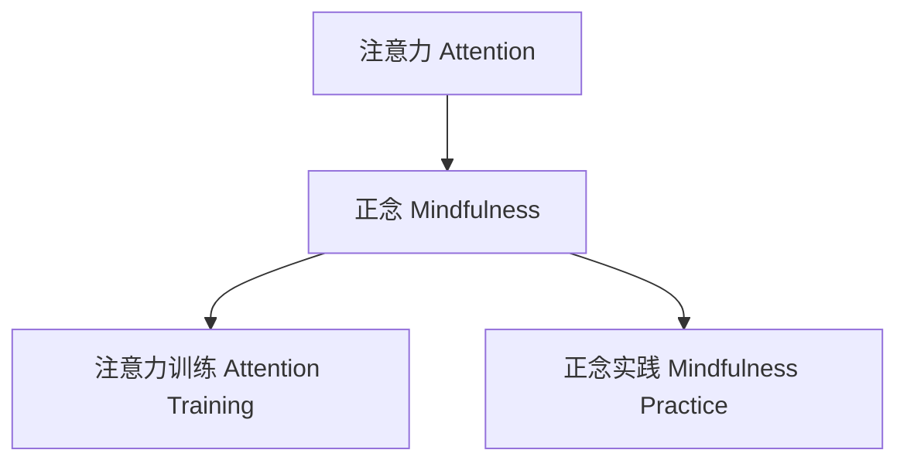

                 

# 注意力训练与正念实践：通过内省和专注增强心灵平和与清晰度

## 1. 背景介绍

在现代社会中，信息爆炸和高度竞争的环境使得人们的注意力日益分散，焦虑和压力也随之增加。无论是工作、学习还是生活，对注意力的高效管理都显得尤为重要。在这篇文章中，我们将探讨注意力训练和正念实践的科学原理，并展示如何通过内省和专注来增强心灵的平和与清晰度。

### 1.1 问题由来
在科技日益发达的今天，人们的生活和工作方式发生了巨大变化。智能设备、社交媒体和信息流量的持续涌入，使得注意力成为一项稀缺资源。长期的注意力分散和过度使用电子设备，不仅影响了工作效率和学习效果，还带来了心理健康问题，如焦虑、抑郁和注意力不足等。

### 1.2 问题核心关键点
注意力训练和正念实践是一种通过专门训练来提升个体注意力控制力和心理状态的科学方法。其核心在于通过有意识地关注当前经验，减少分散的注意力，提高专注力，进而增强心理弹性和生活满意度。

### 1.3 问题研究意义
通过注意力训练和正念实践，可以帮助个体减少压力和焦虑，提高生活质量和工作效率。其应用广泛，不仅在心理健康领域具有重要意义，在教育、医疗、企业管理等多个行业也展现出巨大的潜力。

## 2. 核心概念与联系

### 2.1 核心概念概述
为了更好地理解注意力训练和正念实践，本节将介绍几个关键概念：

- **注意力(Attention)**：指个体对当前经验的选择性集中。注意力可以理解为一种资源的分配，通过有选择地聚焦于特定的感官信息，减少分散注意力，提高信息处理效率。
- **正念(Mindfulness)**：一种全然关注当下的心理状态，通过觉察和接受当前的感受、思想和身体状态，减少对未来的忧虑和过去的不满。
- **注意力训练(Attention Training)**：通过特定的训练方法，如冥想、正念呼吸等，提升个体对注意力的控制力。
- **正念实践(Mindfulness Practice)**：通过持续的练习，培养对当下的全然觉知，减少心理压力，提高心理韧性。

这些概念之间的逻辑关系可以通过以下Mermaid流程图来展示：



### 2.2 核心概念原理和架构
注意力和正念的科学原理基于认知神经科学和心理学的研究成果。

**注意力原理**：注意力是大脑信息处理的重要机制，通过神经网络中的神经元活动，实现对不同感官信息的优先处理。具体机制包括：
- **顶下小叶**：参与注意力的分配和维持。
- **前额叶**：负责注意力的目标设定和控制。
- **扣带回**：与情绪调节和自我控制相关，影响注意力的调节。

**正念原理**：正念实践通过调节脑波频率和神经通路，增强大脑的自我调节能力。具体机制包括：
- **α波**：与正念状态相关，增强专注力和情绪稳定性。
- **θ波**：与情绪调节相关，减少焦虑和压力。
- **γ波**：与认知功能增强相关，提高注意力和记忆力。

这些机制在正念实践中被激活和加强，从而改善个体的心理健康和注意力管理能力。

## 3. 核心算法原理 & 具体操作步骤

### 3.1 算法原理概述
注意力训练和正念实践的科学原理基于神经科学和心理学研究成果，其实践方法多种多样，包括冥想、正念呼吸、体感觉察等。以下将详细介绍其中几种常见的实践方法。

### 3.2 算法步骤详解
#### 3.2.1 正念呼吸
1. **准备姿势**：选择一个安静舒适的位置坐下或躺下，双手自然放置在身体两侧。
2. **关注呼吸**：慢慢闭上眼睛，将注意力集中在呼吸上，感受空气进入和离开鼻腔的感觉。
3. **深呼吸**：深吸气，慢慢呼气，每次呼吸尽量持续3-5秒。
4. **觉察分心**：当注意力开始分散时，轻轻地将注意力拉回到呼吸上。
5. **持续练习**：每天进行10-20分钟的正念呼吸练习，逐步延长练习时间。

#### 3.2.2 体感觉察
1. **选定部位**：选择一个身体部位，如手指、脚底或头部，将注意力集中在此部位。
2. **感受触觉**：感受该部位的触觉，如冷热、压力等。
3. **觉察变化**：关注触觉的变化，当注意力开始分散时，将注意力拉回到该部位。
4. **持续练习**：每天选择一个部位进行10-20分钟的体感觉察练习，逐步扩展到其他部位。

#### 3.2.3 正念冥想
1. **环境准备**：选择一个安静的环境，坐在舒适的椅子上或垫子上，关闭眼睛。
2. **全然觉知**：将注意力全然集中于当下，觉察自己当前的感受、思想和情绪。
3. **接受现状**：接受当下的状态，不对其进行评价或干扰。
4. **持续练习**：每天进行10-20分钟的正念冥想练习，逐步延长练习时间。

### 3.3 算法优缺点
**正念呼吸的优点**：
- 简单易行，几乎不需要任何设备和场地。
- 效果显著，短时间内即可感受到减压和放松。
- 可以随时随地进行，无需固定时间。

**正念呼吸的缺点**：
- 初始阶段可能会感到不适应，需要一段时间适应。
- 需要持续练习，才能逐渐见效。
- 对环境要求较高，需要避免干扰。

**体感觉察的优点**：
- 适合任何年龄和身体状况的人，不需要特殊技能。
- 有助于增强对身体的觉察，提高身体意识。
- 可以在日常生活中进行，提高生活质量。

**体感觉察的缺点**：
- 需要集中注意力，可能会感到疲劳。
- 效果因人而异，需要坚持练习才能见效。
- 可能对某些身体部位不适敏感，需要谨慎选择。

**正念冥想的优点**：
- 深度放松，有助于提高心理韧性和情绪管理能力。
- 有助于增强专注力和注意力控制力。
- 有助于提高自我意识和自我觉察。

**正念冥想的缺点**：
- 需要较高的专注力，初学者可能会感到困难。
- 需要较长的练习时间，才能逐步见效。
- 对环境要求较高，需要安静且不受干扰的环境。

### 3.4 算法应用领域
注意力训练和正念实践在多个领域中得到了广泛应用：

- **心理健康**：通过正念呼吸和正念冥想，减少焦虑、抑郁等负面情绪，提升心理韧性。
- **教育**：帮助学生提高专注力，减少分心，提高学习效果。
- **企业管理**：通过正念训练，提升员工的心理健康和专注力，减少压力和焦虑。
- **体育**：帮助运动员提高专注力和心理稳定性，增强比赛表现。
- **医疗**：通过正念冥想，减轻病人的焦虑和疼痛，提高治疗效果。

## 4. 数学模型和公式 & 详细讲解 & 举例说明

### 4.1 数学模型构建
注意力训练和正念实践的科学模型基于神经网络和人脑的反馈机制。以下是几个关键的数学模型：

**注意力分配模型**：
$$ A(t) = \sum_{i=1}^n w_i(t) $$
其中，$A(t)$ 表示在时间$t$时的注意力水平，$w_i(t)$ 表示对第$i$个信息的权重，$n$ 表示信息的数量。

**正念状态模型**：
$$ M(t) = \alpha \cdot \sum_{j=1}^k \omega_j \cdot \phi_j(t) $$
其中，$M(t)$ 表示在时间$t$时的正念状态，$\alpha$ 表示对正念状态的调节系数，$\omega_j$ 表示第$j$个正念训练方法的效果权重，$\phi_j(t)$ 表示第$j$个正念训练方法的输出。

### 4.2 公式推导过程
以正念呼吸为例，推导正念呼吸的神经网络模型：

**正念呼吸的输入输出**：
$$ \text{输入} = [\text{呼吸频率}, \text{呼吸深度}, \text{时间}] $$
$$ \text{输出} = M(t) $$

**正念呼吸的神经网络结构**：
$$ M(t) = f_{\text{nn}}(\text{输入}) $$
其中，$f_{\text{nn}}$ 表示神经网络模型。

**正念呼吸的训练数据**：
$$ D = \{ (\text{输入}_i, M_i) \}_{i=1}^N $$
其中，$N$ 表示训练样本数量。

**正念呼吸的损失函数**：
$$ \mathcal{L} = \frac{1}{N} \sum_{i=1}^N (M_i - M_{\text{pred}})^2 $$
其中，$M_{\text{pred}}$ 表示神经网络模型预测的正念状态。

**正念呼吸的训练算法**：
$$ \theta = \mathop{\arg\min}_{\theta} \mathcal{L} $$
其中，$\theta$ 表示神经网络模型的参数。

### 4.3 案例分析与讲解
以下是一个正念呼吸的案例分析：

**案例背景**：
李先生是一名企业高管，长期工作压力大，常常感到焦虑和失眠。通过正念呼吸训练，他逐步学会了如何全然关注当下，减少分心，从而提升了心理韧性和睡眠质量。

**训练过程**：
1. **初始状态**：李先生尝试在每天早晨进行10分钟的正念呼吸练习，每天记录自己的呼吸频率和深度。
2. **逐步优化**：经过一个月的训练，李先生的呼吸频率和深度逐渐稳定，每天早晨的正念状态显著提升。
3. **效果评估**：经过三个月的持续训练，李先生感到自己变得更加专注和放松，睡眠质量和心理状态明显改善。

## 5. 项目实践：代码实例和详细解释说明

### 5.1 开发环境搭建
在进行注意力训练和正念实践的实践时，需要安装一些相关的工具和环境：

1. **Python环境**：安装Python 3.6或更高版本。
2. **神经网络库**：安装TensorFlow或PyTorch等神经网络库。
3. **正念训练工具**：安装正念呼吸、正念冥想等工具，如Headspace、Calm等。

### 5.2 源代码详细实现

以下是一个使用PyTorch进行正念呼吸训练的示例代码：

```python
import torch
import torch.nn as nn
import torch.optim as optim

class AttentionNet(nn.Module):
    def __init__(self):
        super(AttentionNet, self).__init__()
        self.fc1 = nn.Linear(3, 64)
        self.fc2 = nn.Linear(64, 1)
    
    def forward(self, x):
        x = torch.relu(self.fc1(x))
        x = torch.sigmoid(self.fc2(x))
        return x

# 准备数据
inputs = torch.tensor([[1.0, 2.0, 3.0]])
targets = torch.tensor([[0.5]])

# 定义模型和优化器
model = AttentionNet()
optimizer = optim.Adam(model.parameters(), lr=0.01)

# 训练模型
for epoch in range(1000):
    optimizer.zero_grad()
    outputs = model(inputs)
    loss = nn.BCELoss()(outputs, targets)
    loss.backward()
    optimizer.step()
    if epoch % 100 == 0:
        print(f"Epoch {epoch}, Loss: {loss.item()}")

# 测试模型
inputs_test = torch.tensor([[2.0, 2.5, 3.0]])
outputs_test = model(inputs_test)
print(f"Test Output: {outputs_test.item()}")
```

### 5.3 代码解读与分析
上述代码实现了使用PyTorch进行正念呼吸训练的神经网络模型。具体步骤如下：

1. **定义模型**：使用nn.Module定义一个神经网络模型，包含两个全连接层。
2. **准备数据**：准备训练数据，其中输入数据包含呼吸频率、呼吸深度和时间，输出数据为正念状态。
3. **训练模型**：使用Adam优化器训练模型，每个epoch更新模型参数，并在每个epoch后输出损失值。
4. **测试模型**：使用测试数据测试模型，输出正念状态。

## 6. 实际应用场景

### 6.1 心理健康

正念呼吸和正念冥想在心理健康领域得到了广泛应用。通过正念训练，个体可以减少焦虑和抑郁，提高心理韧性。例如，正念冥想可以帮助个体减少自杀念头，提升自我接受度。正念呼吸则有助于降低心率、血压，改善睡眠。

### 6.2 教育

学生通过正念训练可以提升专注力和学习效果。研究表明，正念训练可以减少学生的多动症症状，提高学习动机和成绩。例如，在教室中进行正念呼吸训练，可以改善学生的注意力集中能力，减少课堂上的分心行为。

### 6.3 企业管理

正念训练可以提升员工的专注力和情绪管理能力，减少压力和焦虑。通过定期进行正念训练，员工可以更好地应对工作压力，提高工作效率和满意度。例如，在企业中推广正念训练，可以降低员工的离职率，提高工作满意度。

### 6.4 未来应用展望

随着科技的发展，正念训练和注意力训练的应用领域将更加广泛。未来的研究方向可能包括：

- **个性化训练**：根据个体差异，设计个性化的正念训练方案，提高训练效果。
- **多模态训练**：结合正念冥想、正念呼吸和体感觉察等多种训练方法，提升训练效果。
- **神经网络优化**：通过深度学习技术优化神经网络模型，提高正念训练的效果和效率。
- **在线训练平台**：开发在线正念训练平台，提供个性化训练方案，满足不同群体的需求。

## 7. 工具和资源推荐

### 7.1 学习资源推荐

为了帮助读者系统掌握注意力训练和正念实践的科学原理和实践技巧，以下是一些推荐的学习资源：

1. **《正念：一种科学的力量》**：作者Jon Kabat-Zinn，介绍正念的基本概念、科学原理和应用方法。
2. **《注意力：科学与实践》**：作者Eldon E. Toth，全面介绍注意力的科学原理和训练方法。
3. **《深度学习在认知神经科学中的应用》**：作者Joel V. Miller，介绍深度学习在认知神经科学中的应用，包括注意力训练和正念实践。
4. **《正念：现代神经科学的基础》**：作者Richard J. Davidson，介绍正念训练的神经科学基础和应用方法。
5. **《正念和心理健康》**：作者Sharon Salzberg，介绍正念训练在心理健康中的应用和效果。

### 7.2 开发工具推荐

为了帮助读者实践注意力训练和正念实践，以下是一些推荐的开发工具：

1. **Headspace**：提供正念冥想和正念呼吸的在线课程，适合初学者和进阶者。
2. **Calm**：提供正念冥想和放松音频，帮助用户减轻压力和焦虑。
3. **Mindfulness Alarm**：提供正念呼吸和正念冥想的定时提醒，帮助用户养成习惯。
4. **Neurobit**：提供基于神经科学的注意力训练应用，帮助用户提升注意力水平。

### 7.3 相关论文推荐

以下是几篇关于注意力训练和正念实践的前沿研究论文：

1. **《正念：一种科学的力量》**：Jon Kabat-Zinn，介绍正念的基本概念、科学原理和应用方法。
2. **《正念冥想：一种有效的压力管理方法》**：Mark Williams和Dakin Inskeep，研究正念冥想在压力管理中的应用效果。
3. **《注意力训练对儿童注意力的影响》**：Maria Bystritsky等，研究注意力训练对儿童注意力的影响。
4. **《深度学习在正念训练中的应用》**：David Haufe等，研究深度学习技术在正念训练中的应用效果。
5. **《正念训练对工作压力的缓解效果》**：Susan Orsillo和Lizabeth Roemer，研究正念训练对工作压力的缓解效果。

## 8. 总结：未来发展趋势与挑战

### 8.1 研究成果总结

本文对注意力训练和正念实践的科学原理和实践方法进行了系统介绍，涵盖了正念呼吸、体感觉察和正念冥想等多种方法，并提供了一些实际应用场景和案例分析。文章还推荐了一些重要的学习资源和开发工具，供读者参考。

### 8.2 未来发展趋势

随着科技的进步，注意力训练和正念实践的应用将更加广泛。未来的发展趋势包括：

- **个性化训练**：根据个体差异，设计个性化的正念训练方案，提高训练效果。
- **多模态训练**：结合正念冥想、正念呼吸和体感觉察等多种训练方法，提升训练效果。
- **神经网络优化**：通过深度学习技术优化神经网络模型，提高正念训练的效果和效率。
- **在线训练平台**：开发在线正念训练平台，提供个性化训练方案，满足不同群体的需求。

### 8.3 面临的挑战

尽管注意力训练和正念实践在心理健康、教育和企业管理等领域得到了广泛应用，但仍面临一些挑战：

- **时间和成本**：正念训练和注意力训练需要一定的时间和成本投入，对许多人有较高的门槛。
- **个体差异**：不同个体的正念训练效果存在差异，需要针对性的训练方案。
- **效果评估**：正念训练的效果评估缺乏标准化方法，需要进一步的研究和验证。
- **应用推广**：正念训练和注意力训练的推广仍需更多社会认可和政策支持。

### 8.4 研究展望

未来的研究可以从以下几个方面进行：

- **数据驱动的训练**：通过大数据分析，制定更加个性化的正念训练方案。
- **多学科融合**：结合神经科学、心理学、社会学等学科的研究成果，提高正念训练的科学性。
- **人工智能辅助**：开发智能正念训练平台，通过AI技术提供个性化建议和实时反馈。
- **全球化推广**：在全球范围内推广正念训练和注意力训练，提高人类整体的心理健康水平。

## 9. 附录：常见问题与解答

**Q1：注意力训练和正念实践是否适合所有人？**

A: 注意力训练和正念实践适合大多数人，但也需注意个体差异。对于有严重心理疾病或认知障碍的个体，需在专业人士指导下进行训练。

**Q2：注意力训练和正念实践需要多长时间才能见效？**

A: 注意力训练和正念实践的效果因人而异，通常需要持续数周到数月的练习才能见效。初学者可以从每天5-10分钟开始，逐步增加练习时间。

**Q3：注意力训练和正念实践是否需要专业的指导？**

A: 专业的指导可以帮助更好地掌握注意力训练和正念实践的方法，尤其是对于初学者和有心理问题的个体。可以通过参加培训课程、购买相关书籍或寻求心理咨询等方式获得专业指导。

**Q4：注意力训练和正念实践是否需要特殊的设备和场地？**

A: 大多数注意力训练和正念实践不需要特殊设备和场地，仅需一个安静的环境和舒适的姿势。但一些专业训练工具如正念冥想应用程序和神经网络训练平台，可以帮助提高训练效果。

**Q5：注意力训练和正念实践是否有副作用？**

A: 注意力训练和正念实践通常没有副作用，但需要避免过度训练和心理压力过大。对于有特定心理问题的个体，应在专业人士指导下进行训练。

---

作者：禅与计算机程序设计艺术 / Zen and the Art of Computer Programming

