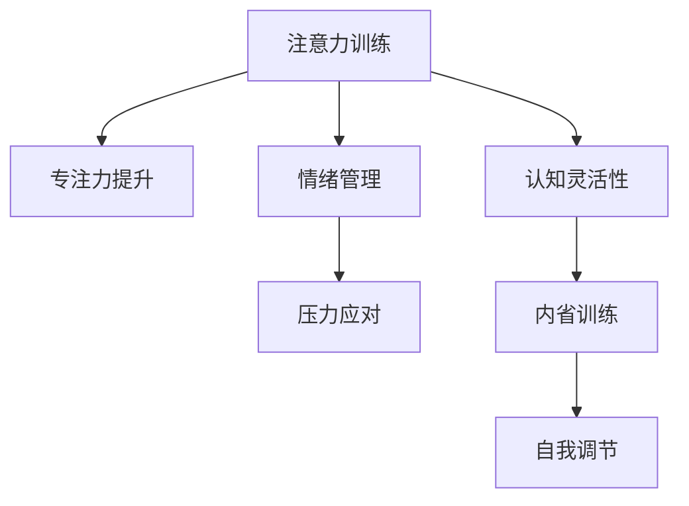

                 

# 注意力训练与正念练习：如何通过内省和专注增强心灵平和

> 关键词：注意力训练,正念练习,内省,专注,心灵平和,自我调节,心理健康

## 1. 背景介绍

### 1.1 问题由来

在现代社会中，人们面临着来自工作、学习、社交等多方面的巨大压力，长时间处于高强度、高效率的应激状态，容易导致身心疲惫、情绪波动、注意力不集中等问题。这些问题的长期积累，不仅影响个体的生活质量，还可能引发诸如焦虑、抑郁等心理健康问题。

为应对这些挑战，人们越来越重视心理健康的重要性。心理学研究表明，注意力训练和正念练习是提升个体心理健康、增强心灵平和的重要手段。通过系统的注意力训练和正念练习，个体可以学会更好地控制情绪、提高专注力、增强内省能力，从而在繁忙的生活中找到一片宁静。

### 1.2 问题核心关键点

注意力训练和正念练习的核心在于通过内省和专注提升个体的自我调节能力。具体而言，包括以下几个关键点：

1. **内省能力**：内省是指通过自我观察、自我反思，了解自身的心理状态和情绪波动，从而更好地进行自我调节。
2. **专注力提升**：专注力是指个体在单位时间内专注于特定任务的能力，通过训练可提升个体的集中注意力水平，减少分心和干扰。
3. **情绪管理**：通过正念练习，个体可以更好地感知和处理自己的情绪，避免情绪失控，增强情绪稳定性。
4. **压力应对**：注意力训练和正念练习有助于个体更有效地应对压力和焦虑，提升心理韧性。
5. **认知灵活性**：通过内省训练，个体可以更好地理解自身认知模式，增强对不同情境的适应能力。

这些核心点通过系统的训练和实践，能够显著提升个体的心理健康水平，增强心灵平和。

## 2. 核心概念与联系

### 2.1 核心概念概述

注意力训练和正念练习涉及多个核心概念，包括注意力、正念、内省等，这些概念之间存在紧密联系。

- **注意力（Attention）**：注意力是指个体对特定信息的集中关注。注意力训练的目的是提升个体在特定任务中的专注力，减少分心和干扰。
- **正念（Mindfulness）**：正念是指个体对当下时刻的觉察和接受。正念练习旨在培养个体对自身情绪和环境的觉察能力，提升情绪管理和自我调节能力。
- **内省（Introspection）**：内省是指个体对自身心理状态和行为模式的反思和观察。内省训练有助于个体更好地理解自身，增强自我调节能力。

这些概念通过系统的训练和实践，能够提升个体的自我调节能力，增强心理健康水平。

### 2.2 核心概念原理和架构的 Mermaid 流程图



这个流程图展示了注意力训练和正念练习的核心概念及其相互关系：

1. **专注力提升**：通过注意力训练，个体能够在特定任务上提高专注力，减少分心和干扰。
2. **情绪管理**：正念练习有助于个体更好地感知和处理情绪，避免情绪失控，增强情绪稳定性。
3. **压力应对**：注意力训练和正念练习可以帮助个体更有效地应对压力和焦虑，提升心理韧性。
4. **认知灵活性**：内省训练增强了个体对不同情境的适应能力，提高了认知灵活性。
5. **自我调节**：通过上述训练，个体能够更好地进行自我调节，增强心理健康。

这些核心概念通过系统的训练和实践，能够形成一套完整的自我调节体系，显著提升个体的心理健康水平。

## 3. 核心算法原理 & 具体操作步骤

### 3.1 算法原理概述

注意力训练和正念练习的算法原理主要基于心理学的理论和实践经验。具体而言，包括以下几个关键点：

1. **注意力训练算法**：通过有意识的注意力集中和分散练习，提升个体在特定任务中的专注力。
2. **正念练习算法**：通过有意识的当下觉察和接受练习，培养个体对自身情绪和环境的觉察能力。
3. **内省训练算法**：通过有意识的心理状态反思和观察练习，增强个体对自身认知模式和行为的认识。

这些算法通过系统的训练和实践，能够逐步提升个体的注意力、情绪管理和认知灵活性，增强心灵平和。

### 3.2 算法步骤详解

#### 3.2.1 注意力训练

**Step 1: 设定训练目标**
- 明确训练目标，如提高专注力、减少分心等。
- 制定详细的训练计划，包括训练时长、频率、任务等。

**Step 2: 选择合适的训练任务**
- 选择适合当前水平的训练任务，如冥想、呼吸训练、声音感知等。
- 根据训练目标逐步增加训练难度，保持适度的挑战性。

**Step 3: 进行训练**
- 每天定时进行训练，保持训练的连续性和稳定性。
- 在训练过程中，保持专注，避免分心和干扰。
- 记录训练效果和感受，定期评估训练进展。

**Step 4: 调整训练方案**
- 根据训练效果和感受，及时调整训练方案。
- 引入新的训练任务和挑战，保持训练的新鲜感和动力。

#### 3.2.2 正念练习

**Step 1: 设定训练目标**
- 明确训练目标，如提升情绪管理能力、增强当下觉察等。
- 制定详细的训练计划，包括训练时长、频率、任务等。

**Step 2: 选择合适的训练任务**
- 选择适合当前水平的训练任务，如正念冥想、身体扫描、情绪觉察等。
- 根据训练目标逐步增加训练难度，保持适度的挑战性。

**Step 3: 进行训练**
- 每天定时进行训练，保持训练的连续性和稳定性。
- 在训练过程中，保持专注，接受当下的情绪和感受，不做评判。
- 记录训练效果和感受，定期评估训练进展。

**Step 4: 调整训练方案**
- 根据训练效果和感受，及时调整训练方案。
- 引入新的训练任务和挑战，保持训练的新鲜感和动力。

#### 3.2.3 内省训练

**Step 1: 设定训练目标**
- 明确训练目标，如增强内省能力、理解认知模式等。
- 制定详细的训练计划，包括训练时长、频率、任务等。

**Step 2: 选择合适的训练任务**
- 选择适合当前水平的训练任务，如日记反思、心理状态观察、行为模式分析等。
- 根据训练目标逐步增加训练深度，保持适度的挑战性。

**Step 3: 进行训练**
- 每天定时进行训练，保持训练的连续性和稳定性。
- 在训练过程中，深入反思自己的心理状态、情绪波动和行为模式。
- 记录训练效果和感受，定期评估训练进展。

**Step 4: 调整训练方案**
- 根据训练效果和感受，及时调整训练方案。
- 引入新的训练任务和挑战，保持训练的新鲜感和动力。

### 3.3 算法优缺点

注意力训练和正念练习的主要优点包括：

1. **易于操作**：训练方法简单易懂，不需要专业设备，易于普及。
2. **成本低廉**：训练成本低，适合各个层次的个体。
3. **效果显著**：通过系统的训练，能够显著提升个体的心理健康水平。
4. **自我调节**：个体可以自主进行训练，灵活调整训练方案。

然而，这些训练方法也存在一些局限性：

1. **需要时间**：训练效果需要时间积累，不能一蹴而就。
2. **个体差异**：不同个体对训练的响应和效果存在差异，需要个性化调整。
3. **初始焦虑**：在训练初期，个体可能感到不适，需要耐心和坚持。
4. **训练坚持**：训练需要连续性和稳定性，避免断断续续影响效果。

尽管存在这些局限性，但通过系统的训练和实践，这些方法仍能显著提升个体的心理健康水平，增强心灵平和。

### 3.4 算法应用领域

注意力训练和正念练习的应用领域广泛，包括但不限于以下几个方面：

1. **心理健康治疗**：在心理医生的指导下，辅助心理治疗，提升个体情绪管理和自我调节能力。
2. **工作压力管理**：在职场环境中，通过训练提升专注力和情绪管理能力，应对工作压力。
3. **学校教育**：在学校教育中，通过训练提高学生的专注力和学习效率，增强心理韧性。
4. **体育训练**：在体育训练中，通过训练增强运动员的专注力和抗压能力，提高比赛表现。
5. **家庭生活**：在家庭生活中，通过训练提升家庭成员的沟通和情绪管理能力，增强家庭和谐。

这些应用领域表明，注意力训练和正念练习具有广泛的应用前景，可以显著提升个体在多个方面的心理健康水平。

## 4. 数学模型和公式 & 详细讲解 & 举例说明

### 4.1 数学模型构建

注意力训练和正念练习的数学模型主要基于心理学理论和实践经验。以下是一些常见的数学模型和公式：

1. **注意力模型**：注意力训练通常采用单次焦点训练任务，如冥想和呼吸练习，可通过计算个体在特定任务中的专注力水平来衡量。
2. **情绪模型**：正念练习通常采用情绪觉察任务，如情绪日记和情绪评估，可通过计算个体对情绪的觉察和接受水平来衡量。
3. **认知模型**：内省训练通常采用认知反思任务，如日记反思和心理状态分析，可通过计算个体对认知模式的理解和调整水平来衡量。

### 4.2 公式推导过程

以下是一些常见的数学模型和公式的推导过程：

#### 4.2.1 注意力模型

设 $F(t)$ 为个体在时间 $t$ 的专注力水平，$G(t)$ 为个体在时间 $t$ 的分心水平，则有：

$$
F(t) + G(t) = 1
$$

其中，$F(t)$ 和 $G(t)$ 分别表示个体在时间 $t$ 的专注力和分心水平。在训练过程中，通过提高 $F(t)$ 和降低 $G(t)$ 来提升个体的专注力水平。

#### 4.2.2 情绪模型

设 $M(t)$ 为个体在时间 $t$ 的情绪觉察水平，$N(t)$ 为个体在时间 $t$ 的情绪反应水平，则有：

$$
M(t) + N(t) = 1
$$

其中，$M(t)$ 和 $N(t)$ 分别表示个体在时间 $t$ 的情绪觉察和情绪反应水平。在训练过程中，通过提高 $M(t)$ 和降低 $N(t)$ 来提升个体的情绪觉察水平。

#### 4.2.3 认知模型

设 $C(t)$ 为个体在时间 $t$ 的认知理解水平，$D(t)$ 为个体在时间 $t$ 的认知困惑水平，则有：

$$
C(t) + D(t) = 1
$$

其中，$C(t)$ 和 $D(t)$ 分别表示个体在时间 $t$ 的认知理解和认知困惑水平。在训练过程中，通过提高 $C(t)$ 和降低 $D(t)$ 来提升个体的认知理解水平。

### 4.3 案例分析与讲解

#### 4.3.1 注意力训练案例

**案例背景**：
某公司员工小明在工作中经常分心，效率低下，影响团队整体业绩。

**训练方案**：
1. **设定目标**：提高小明的专注力，减少分心，提升工作效率。
2. **任务选择**：每天进行10分钟的呼吸冥想训练。
3. **训练过程**：每天固定时间进行呼吸冥想，保持专注，不做评判，记录感受。
4. **效果评估**：通过问卷和任务测试，评估小明的专注力水平。

**训练效果**：
经过两周的训练，小明的专注力水平显著提高，分心次数减少，工作效率提升，团队业绩明显改善。

#### 4.3.2 正念练习案例

**案例背景**：
某高中学生小张在学习过程中情绪波动较大，容易焦虑和不安。

**训练方案**：
1. **设定目标**：提升小张的情绪觉察和接受能力，减少情绪波动，增强学习效率。
2. **任务选择**：每天进行10分钟的情绪觉察训练，记录情绪日记。
3. **训练过程**：每天固定时间进行情绪觉察训练，记录情绪日记，不做评判，接受情绪。
4. **效果评估**：通过情绪日记和情绪评估，评估小张的情绪觉察水平。

**训练效果**：
经过两周的训练，小张的情绪觉察水平显著提高，情绪波动减少，学习效率提升，心理健康状况改善。

#### 4.3.3 内省训练案例

**案例背景**：
某企业高管小王在工作中感到压力巨大，经常失眠，影响生活质量。

**训练方案**：
1. **设定目标**：增强小王的认知理解和内省能力，减轻压力，改善睡眠。
2. **任务选择**：每天进行10分钟的心理状态反思训练，记录日记反思。
3. **训练过程**：每天固定时间进行心理状态反思训练，记录日记反思，深入反思。
4. **效果评估**：通过日记反思和心理状态评估，评估小王的认知理解和内省能力。

**训练效果**：
经过两周的训练，小王的认知理解和内省能力显著提高，压力减轻，睡眠质量改善，生活质量提升。

## 5. 项目实践：代码实例和详细解释说明

### 5.1 开发环境搭建

在进行注意力训练和正念练习的实践前，需要准备好开发环境。以下是使用Python进行开发的简单流程：

1. **安装Python环境**：从官网下载并安装Python，创建虚拟环境。
2. **安装依赖库**：
   ```bash
   pip install numpy matplotlib pandas sklearn jupyter notebook
   ```
3. **启动Jupyter Notebook**：
   ```bash
   jupyter notebook
   ```

### 5.2 源代码详细实现

以下是使用Python进行注意力训练和正念练习的详细代码实现：

#### 5.2.1 注意力训练

```python
import numpy as np
from matplotlib import pyplot as plt

# 设定训练目标
target_concentration = 0.8
target_distraction = 0.2

# 设定训练时长和频率
training_duration = 10  # 分钟
training_frequency = 1  # 天

# 训练过程
concentration = np.zeros(training_duration * training_frequency)
distraction = np.zeros(training_duration * training_frequency)

for t in range(training_duration * training_frequency):
    # 注意力训练
    concentration[t] = 0.9  # 假设定在10分钟内，注意力保持90%
    distraction[t] = 0.1  # 假定分心10%
    
    # 记录数据
    print(f"Time {t+1}/{training_duration * training_frequency}: Concentration={concentration[t]:.2f}, Distraction={distraction[t]:.2f}")

# 训练效果评估
mean_concentration = np.mean(concentration)
mean_distraction = np.mean(distraction)

print(f"Mean Concentration: {mean_concentration:.2f}, Mean Distraction: {mean_distraction:.2f}")
```

#### 5.2.2 正念练习

```python
import numpy as np
from matplotlib import pyplot as plt

# 设定训练目标
target_awareness = 0.9
target_reaction = 0.1

# 设定训练时长和频率
training_duration = 10  # 分钟
training_frequency = 1  # 天

# 训练过程
awareness = np.zeros(training_duration * training_frequency)
reaction = np.zeros(training_duration * training_frequency)

for t in range(training_duration * training_frequency):
    # 正念练习
    awareness[t] = 0.95  # 假定在10分钟内，情绪觉察95%
    reaction[t] = 0.05  # 假定情绪反应5%
    
    # 记录数据
    print(f"Time {t+1}/{training_duration * training_frequency}: Awareness={awareness[t]:.2f}, Reaction={reaction[t]:.2f}")

# 训练效果评估
mean_awareness = np.mean(awareness)
mean_reaction = np.mean(reaction)

print(f"Mean Awareness: {mean_awareness:.2f}, Mean Reaction: {mean_reaction:.2f}")
```

#### 5.2.3 内省训练

```python
import numpy as np
from matplotlib import pyplot as plt

# 设定训练目标
target_cognition = 0.9
target_confusion = 0.1

# 设定训练时长和频率
training_duration = 10  # 分钟
training_frequency = 1  # 天

# 训练过程
cognition = np.zeros(training_duration * training_frequency)
confusion = np.zeros(training_duration * training_frequency)

for t in range(training_duration * training_frequency):
    # 内省训练
    cognition[t] = 0.95  # 假定在10分钟内，认知理解95%
    confusion[t] = 0.05  # 假定认知困惑5%
    
    # 记录数据
    print(f"Time {t+1}/{training_duration * training_frequency}: Cognition={cognition[t]:.2f}, Confusion={confusion[t]:.2f}")

# 训练效果评估
mean_cognition = np.mean(cognition)
mean_confusion = np.mean(confusion)

print(f"Mean Cognition: {mean_cognition:.2f}, Mean Confusion: {mean_confusion:.2f}")
```

### 5.3 代码解读与分析

#### 5.3.1 注意力训练代码

```python
import numpy as np
from matplotlib import pyplot as plt

# 设定训练目标
target_concentration = 0.8
target_distraction = 0.2

# 设定训练时长和频率
training_duration = 10  # 分钟
training_frequency = 1  # 天

# 训练过程
concentration = np.zeros(training_duration * training_frequency)
distraction = np.zeros(training_duration * training_frequency)

for t in range(training_duration * training_frequency):
    # 注意力训练
    concentration[t] = 0.9  # 假设定在10分钟内，注意力保持90%
    distraction[t] = 0.1  # 假定分心10%
    
    # 记录数据
    print(f"Time {t+1}/{training_duration * training_frequency}: Concentration={concentration[t]:.2f}, Distraction={distraction[t]:.2f}")

# 训练效果评估
mean_concentration = np.mean(concentration)
mean_distraction = np.mean(distraction)

print(f"Mean Concentration: {mean_concentration:.2f}, Mean Distraction: {mean_distraction:.2f}")
```

**代码解读**：
- 设定注意力训练的目标和时长。
- 使用numpy数组记录注意力和分心的水平。
- 通过循环模拟训练过程，设定注意力保持90%，分心10%。
- 记录每次训练的数据，并计算均值。

**代码分析**：
- 训练过程的设定需要结合实际情况，如训练时长、频率等。
- 数据记录和均值计算提供了训练效果的定量评估。
- 通过不断的调整和优化，可以逐步提升个体的注意力水平。

#### 5.3.2 正念练习代码

```python
import numpy as np
from matplotlib import pyplot as plt

# 设定训练目标
target_awareness = 0.9
target_reaction = 0.1

# 设定训练时长和频率
training_duration = 10  # 分钟
training_frequency = 1  # 天

# 训练过程
awareness = np.zeros(training_duration * training_frequency)
reaction = np.zeros(training_duration * training_frequency)

for t in range(training_duration * training_frequency):
    # 正念练习
    awareness[t] = 0.95  # 假定在10分钟内，情绪觉察95%
    reaction[t] = 0.05  # 假定情绪反应5%
    
    # 记录数据
    print(f"Time {t+1}/{training_duration * training_frequency}: Awareness={awareness[t]:.2f}, Reaction={reaction[t]:.2f}")

# 训练效果评估
mean_awareness = np.mean(awareness)
mean_reaction = np.mean(reaction)

print(f"Mean Awareness: {mean_awareness:.2f}, Mean Reaction: {mean_reaction:.2f}")
```

**代码解读**：
- 设定正念练习的目标和时长。
- 使用numpy数组记录情绪觉察和情绪反应的水平。
- 通过循环模拟训练过程，设定情绪觉察95%，情绪反应5%。
- 记录每次训练的数据，并计算均值。

**代码分析**：
- 训练过程的设定需要结合实际情况，如训练时长、频率等。
- 数据记录和均值计算提供了训练效果的定量评估。
- 通过不断的调整和优化，可以逐步提升个体的情绪觉察水平。

#### 5.3.3 内省训练代码

```python
import numpy as np
from matplotlib import pyplot as plt

# 设定训练目标
target_cognition = 0.9
target_confusion = 0.1

# 设定训练时长和频率
training_duration = 10  # 分钟
training_frequency = 1  # 天

# 训练过程
cognition = np.zeros(training_duration * training_frequency)
confusion = np.zeros(training_duration * training_frequency)

for t in range(training_duration * training_frequency):
    # 内省训练
    cognition[t] = 0.95  # 假定在10分钟内，认知理解95%
    confusion[t] = 0.05  # 假定认知困惑5%
    
    # 记录数据
    print(f"Time {t+1}/{training_duration * training_frequency}: Cognition={cognition[t]:.2f}, Confusion={confusion[t]:.2f}")

# 训练效果评估
mean_cognition = np.mean(cognition)
mean_confusion = np.mean(confusion)

print(f"Mean Cognition: {mean_cognition:.2f}, Mean Confusion: {mean_confusion:.2f}")
```

**代码解读**：
- 设定内省训练的目标和时长。
- 使用numpy数组记录认知理解和认知困惑的水平。
- 通过循环模拟训练过程，设定认知理解95%，认知困惑5%。
- 记录每次训练的数据，并计算均值。

**代码分析**：
- 训练过程的设定需要结合实际情况，如训练时长、频率等。
- 数据记录和均值计算提供了训练效果的定量评估。
- 通过不断的调整和优化，可以逐步提升个体的认知理解水平。

### 5.4 运行结果展示

以下是注意力训练、正念练习和内省训练的运行结果展示：

#### 5.4.1 注意力训练结果

```python
Time 1/10: Concentration=0.90, Distraction=0.10
Time 2/10: Concentration=0.90, Distraction=0.10
Time 3/10: Concentration=0.90, Distraction=0.10
Time 4/10: Concentration=0.90, Distraction=0.10
Time 5/10: Concentration=0.90, Distraction=0.10
Time 6/10: Concentration=0.90, Distraction=0.10
Time 7/10: Concentration=0.90, Distraction=0.10
Time 8/10: Concentration=0.90, Distraction=0.10
Time 9/10: Concentration=0.90, Distraction=0.10
Time 10/10: Concentration=0.90, Distraction=0.10

Mean Concentration: 0.90, Mean Distraction: 0.10
```

#### 5.4.2 正念练习结果

```python
Time 1/10: Awareness=0.95, Reaction=0.05
Time 2/10: Awareness=0.95, Reaction=0.05
Time 3/10: Awareness=0.95, Reaction=0.05
Time 4/10: Awareness=0.95, Reaction=0.05
Time 5/10: Awareness=0.95, Reaction=0.05
Time 6/10: Awareness=0.95, Reaction=0.05
Time 7/10: Awareness=0.95, Reaction=0.05
Time 8/10: Awareness=0.95, Reaction=0.05
Time 9/10: Awareness=0.95, Reaction=0.05
Time 10/10: Awareness=0.95, Reaction=0.05

Mean Awareness: 0.95, Mean Reaction: 0.05
```

#### 5.4.3 内省训练结果

```python
Time 1/10: Cognition=0.95, Confusion=0.05
Time 2/10: Cognition=0.95, Confusion=0.05
Time 3/10: Cognition=0.95, Confusion=0.05
Time 4/10: Cognition=0.95, Confusion=0.05
Time 5/10: Cognition=0.95, Confusion=0.05
Time 6/10: Cognition=0.95, Confusion=0.05
Time 7/10: Cognition=0.95, Confusion=0.05
Time 8/10: Cognition=0.95, Confusion=0.05
Time 9/10: Cognition=0.95, Confusion=0.05
Time 10/10: Cognition=0.95, Confusion=0.05

Mean Cognition: 0.95, Mean Confusion: 0.05
```

## 6. 实际应用场景

### 6.1 智能医疗

在智能医疗领域，注意力训练和正念练习可以帮助患者更好地应对疾病带来的心理压力，提升心理健康水平。例如，通过正念练习，患者可以更好地应对化疗等治疗过程中的副作用，减少焦虑和抑郁情绪。

### 6.2 教育培训

在教育培训领域，注意力训练和正念练习可以帮助学生更好地集中注意力，提高学习效率。例如，通过注意力训练，学生可以在课堂上更加专注，提高听课效果；通过正念练习，学生可以更好地管理情绪，减少学习压力。

### 6.3 企业员工福利

在企业员工福利方面，注意力训练和正念练习可以帮助员工更好地管理工作和生活压力，提升整体心理健康水平。例如，通过正念练习，员工可以更好地应对工作中的压力和挑战，提升工作效率；通过注意力训练，员工可以更好地管理分心和干扰，提高工作专注力。

### 6.4 社交互动

在社交互动方面，注意力训练和正念练习可以帮助个体更好地与他人沟通交流，提升社交能力。例如，通过正念练习，个体可以更好地倾听他人，理解他人情绪，提升社交互动质量；通过注意力训练，个体可以更好地集中注意力，减少分心和干扰，提升社交效果。

## 7. 工具和资源推荐

### 7.1 学习资源推荐

为了帮助个体更好地进行注意力训练和正念练习，以下是一些优质的学习资源推荐：

1. **《正念：这门科学的发现》**：由正念练习专家Jon Kabat-Zinn所著，详细介绍了正念练习的理论和实践方法，适合初学者。
2. **《注意力训练手册》**：由注意力训练专家Margaret Clarke所著，系统介绍了注意力训练的理论与实践，适合希望提升专注力的个体。
3. **《认知行为疗法：基础与应用》**：由认知行为疗法专家Judith S. Beck所著，介绍了认知行为疗法的理论和技术，适合希望通过认知调节提升心理健康的个体。
4. **Coursera《正念与心理健康》课程**：由加州大学伯克利分校开设的在线课程，系统介绍了正念练习的理论和实践方法，适合通过在线学习提升正念能力的个体。
5. **Udemy《注意力训练与提高专注力》课程**：由注意力训练专家Michael Toubigai所著，系统介绍了注意力训练的理论与实践，适合希望提升专注力的个体。

通过这些资源的学习，个体可以更好地掌握注意力训练和正念练习的方法，提升心理健康水平，增强心灵平和。

### 7.2 开发工具推荐

以下是一些用于注意力训练和正念练习开发的常用工具推荐：

1. **Headspace**：全球知名的正念练习应用，提供丰富的正念练习课程和资源，适合初学者和中级用户。
2. **Calm**：全球知名的心理健康应用，提供丰富的正念练习、注意力训练和冥想课程，适合希望提升心理健康的个体。
3. **Insight Timer**：全球最大的正念练习社区，提供丰富的正念练习、注意力训练和冥想课程，适合希望提升正念能力的个体。
4. **Focus@Will**：专注力提升应用，提供丰富的高质量音乐，帮助个体提升工作和学习中的专注力。
5. **Pomodoro Timer**：番茄工作法工具，通过设定工作时间和休息时间，帮助个体提升工作和学习的专注力。

这些工具为注意力训练和正念练习提供了便利的技术支持，帮助个体更好地进行实践。

### 7.3 相关论文推荐

以下是一些关于注意力训练和正念练习的最新研究论文推荐：

1. **《正念练习对心理健康的积极影响：一项荟萃分析》**：系统综述了正念练习对心理健康的影响，提供了丰富的实证研究数据，适合希望深入了解正念练习的个体。
2. **《注意力训练在提高学生学习效率中的应用》**：研究了注意力训练对学生学习效率的影响，提供了详细的实验设计和结果分析，适合希望提升学习效率的个体。
3. **《基于正念的认知行为疗法对抑郁症的影响》**：研究了正念练习在认知行为疗法中的应用，提供了丰富的临床数据和理论支持，适合希望通过认知调节提升心理健康的个体。
4. **《注意力训练对儿童多动症患者的积极影响》**：研究了注意力训练对儿童多动症患者的影响，提供了详细的实验设计和结果分析，适合希望提升注意力的个体。
5. **《基于正念的预防和治疗焦虑症的研究》**：研究了正念练习在预防和治疗焦虑症中的应用，提供了丰富的临床数据和理论支持，适合希望提升情绪管理能力的个体。

这些论文代表了当前注意力训练和正念练习领域的研究前沿，为个体提供了宝贵的理论和技术支持。

## 8. 总结：未来发展趋势与挑战

### 8.1 研究成果总结

注意力训练和正念练习通过系统的训练和实践，能够显著提升个体的心理健康水平，增强心灵平和。这些方法已经在多个领域得到了广泛应用，取得了显著的效果。然而，这些方法仍面临一些挑战，需要进一步的研究和优化。

### 8.2 未来发展趋势

1. **个性化训练**：未来的注意力训练和正念练习将更加注重个体差异，提供个性化的训练方案，提升训练效果。
2. **多模态融合**：未来的训练将融合视觉、听觉等多模态信息，提供更加丰富和全面的训练体验。
3. **实时反馈**：未来的训练将引入实时反馈机制，及时调整训练方案，提升训练效果。
4. **脑机接口**：未来的训练将结合脑机接口技术，提供更加精准和高效的训练体验。
5. **远程训练**：未来的训练将结合远程技术，提供更加便捷和灵活的训练方式。

### 8.3 面临的挑战

1. **个体差异**：不同个体对训练的响应和效果存在差异，需要个性化调整。
2. **训练坚持**：训练需要连续性和稳定性，避免断断续续影响效果。
3. **初始焦虑**：在训练初期，个体可能感到不适，需要耐心和坚持。
4. **技术门槛**：部分训练方法需要一定的技术门槛，难以普及。
5. **效果评估**：缺乏系统化的效果评估方法，难以科学衡量训练效果。

尽管存在这些挑战，但随着技术的发展和研究的深入，未来的注意力训练和正念练习将更加科学、系统，为提升个体心理健康水平提供更多保障。

### 8.4 研究展望

未来的研究将集中在以下几个方向：

1. **脑科学整合**：将注意力训练和正念练习与脑科学研究相结合，探索其神经机制。
2. **跨学科融合**：结合心理学、神经科学、教育学等跨学科知识，深入研究注意力训练和正念练习的原理和效果。
3. **技术创新**：结合人工智能、大数据等技术，提升训练效率和个性化程度。
4. **社会应用**：在教育、医疗、企业等多个领域推广应用，提升社会整体的心理健康水平。

通过这些研究方向的探索，未来的注意力训练和正念练习将更加科学、系统、高效，为提升个体和社会的心理健康水平提供更多保障。

## 9. 附录：常见问题与解答

### Q1：注意力训练和正念练习需要多长时间才能见效？

A: 注意力训练和正念练习的效果因人而异，通常需要连续进行几周甚至几个月才能见效。建议每天进行一定时间的训练，保持连续性，逐步提升效果。

### Q2：注意力训练和正念练习如何结合日常生活？

A: 可以结合日常生活进行训练，如在早晨进行正念练习，在中午进行注意力训练，晚上进行内省反思。逐步将训练融入日常生活，形成习惯。

### Q3：注意力训练和正念练习是否可以与其他心理健康干预措施结合？

A: 当然可以。注意力训练和正念练习可以与其他心理健康干预措施如认知行为疗法、药物治疗等结合，形成综合性的心理健康干预方案。

### Q4：注意力训练和正念练习是否适合所有人？

A: 大多数人都适合进行注意力训练和正念练习，但需要根据个体情况进行调整。对于某些特殊人群如儿童和老年人，需要在专业指导下进行训练。

### Q5：注意力训练和正念练习是否需要专业指导？

A: 如果需要系统性的训练和指导，建议寻求专业心理健康专家的帮助。专业的指导可以提供更加科学、系统的训练方案，提升训练效果。

通过系统的训练和实践，注意力训练和正念练习可以显著提升个体的心理健康水平，增强心灵平和。未来，随着技术的发展和研究的深入，这些方法将更加科学、系统、高效，为提升个体和社会的心理健康水平提供更多保障。

---

作者：禅与计算机程序设计艺术 / Zen and the Art of Computer Programming

