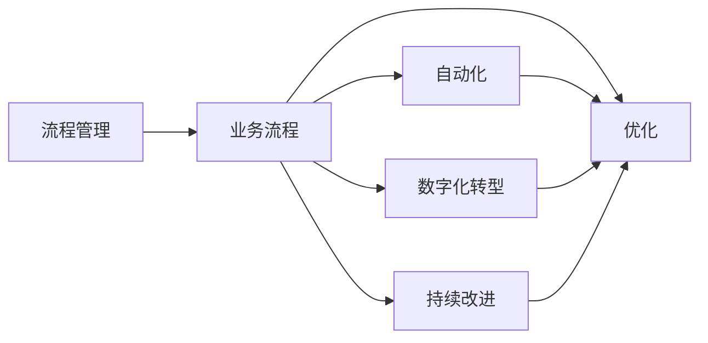

                 

# 流程管理：简化和优化业务操作

> 关键词：流程管理,业务流程,自动化,优化,数字化转型,企业效能

## 1. 背景介绍

### 1.1 问题由来
在信息时代，企业面临的挑战日益复杂，包括市场竞争加剧、客户需求多样、运营成本上升等。传统的流程管理方法，如基于文档的流程建模、手工调度与监控，已无法适应这些变化。由此，企业亟需一套高效、透明的流程管理方案，以简化操作、提升效率、降低成本，并确保业务流程的顺畅运作。流程管理技术的演变，正是适应这一需求而产生的。

### 1.2 问题核心关键点
流程管理本质上是对业务流程的规划、实施、监控和持续优化。其核心目标是通过自动化和优化，提升业务执行的效率和质量，降低操作风险，并支撑企业战略目标的实现。具体来说，流程管理包括以下几个方面：

- **流程规划**：定义业务流程的步骤、输入输出、参与者等。
- **流程实施**：将规划好的流程落实到实际操作中。
- **流程监控**：实时监控流程执行状态，及时发现问题并干预。
- **流程优化**：根据业务反馈和监控数据，不断优化流程设计。

流程管理的效果很大程度上取决于流程的合理性、执行的自动化程度，以及监控与反馈机制的健全。因此，如何设计高效流程、实现自动化、建立反馈机制，是流程管理研究的关键。

### 1.3 问题研究意义
研究流程管理方法，对于提高企业运营效率、优化资源配置、增强市场竞争力具有重要意义：

1. **提升运营效率**：自动化流程执行、减少手动操作，显著提升业务响应速度和执行效率。
2. **优化资源配置**：通过流程规划和监控，及时发现资源浪费现象，实现资源的最优配置。
3. **增强市场竞争力**：快速响应市场变化，提高产品与服务质量，增强客户满意度。
4. **支撑战略目标**：通过流程管理，将企业战略目标落地，推动业务持续发展。

## 2. 核心概念与联系

### 2.1 核心概念概述

为了深入理解流程管理，本节将介绍几个核心概念及其相互联系：

- **流程管理(Business Process Management, BPM)**：指对企业内部业务流程的规划、设计、实施、监控和优化过程。其目标是提升业务执行效率，降低运营成本，提高客户满意度。
- **业务流程(Business Process, BP)**：企业内部完成一项业务活动的所有步骤和环节。流程管理即是对这些步骤的规划、监控和优化。
- **自动化(Automation)**：使用技术手段，减少手动操作，自动执行流程步骤。自动化是实现流程管理高效化的重要手段。
- **优化(Optimization)**：通过分析监控数据，发现流程瓶颈，优化流程设计，提高执行效率。
- **数字化转型(Digital Transformation)**：利用数字技术，重构业务流程，提升业务效率与创新能力。数字化转型是企业应对数字化时代的关键策略。
- **持续改进(Continuous Improvement)**：基于业务反馈和监控数据，不断调整流程设计，提升流程效能。持续改进是流程管理持续有效的保障。

这些概念之间通过业务流程为纽带，形成一个有机整体。自动化、优化和数字化转型，都是为提升业务流程的执行效率和质量服务的。而持续改进，则是确保流程管理持续有效的机制。

### 2.2 核心概念原理和架构的 Mermaid 流程图



这个流程图展示了流程管理与其他概念之间的关系。自动化、优化和数字化转型都是通过业务流程实现的，而持续改进则是提升流程效能的重要手段。

## 3. 核心算法原理 & 具体操作步骤
### 3.1 算法原理概述

流程管理的核心算法主要包括流程规划、流程实施和流程优化。以下将对这三个核心步骤进行详细讲解。

**3.1.1 流程规划**

流程规划是流程管理的起点，旨在定义业务流程的各个步骤、参与者、输入输出等内容。一般通过如下步骤进行规划：

1. **需求调研**：与业务部门沟通，了解业务需求和流程现状。
2. **流程设计**：根据调研结果，设计流程的步骤、参与者、输入输出等。
3. **流程文档化**：将流程设计转化为流程文档，如流程图、任务列表等。

**3.1.2 流程实施**

流程实施是将流程规划转化为实际操作的过程。主要包括以下步骤：

1. **流程建模**：将流程文档转化为技术可执行的流程模型，如工作流、状态机等。
2. **系统集成**：将流程模型集成到企业IT系统中，实现自动化执行。
3. **培训与部署**：对流程相关人员进行培训，部署系统到生产环境。

**3.1.3 流程优化**

流程优化是通过分析监控数据，发现流程瓶颈，优化流程设计的过程。主要步骤如下：

1. **数据采集**：通过日志、监控工具等采集流程执行数据。
2. **数据分析**：对采集到的数据进行分析，发现流程瓶颈和问题。
3. **流程改进**：基于分析结果，调整流程设计，改进流程执行。

### 3.2 算法步骤详解

以下将以一个具体的例子，展示从流程规划到流程优化的详细步骤。

**步骤一：流程规划**

假设某电商企业希望优化其订单处理流程。首先需要进行需求调研：

- 与订单处理部门沟通，了解他们的工作流程、痛点和需求。
- 根据调研结果，设计订单处理流程的各个步骤、参与者、输入输出。例如，订单接收、订单分配、订单处理、订单发货等步骤。

接着，将流程设计转化为流程图和任务列表：


**步骤二：流程实施**

将设计好的流程模型转化为技术可执行的流程模型，并进行系统集成：

1. **流程建模**：使用如BPMN、UML等工具，将流程文档转化为工作流模型。例如，使用BPMN建模工具，创建订单处理流程的工作流模型。
2. **系统集成**：将工作流模型集成到企业IT系统中，实现自动化执行。例如，使用流程引擎如Camunda，将订单处理工作流集成到企业ERP系统中。
3. **培训与部署**：对订单处理相关人员进行培训，部署系统到生产环境。


**步骤三：流程优化**

在订单处理流程实施后，需要持续监控和优化。例如，使用流程监控工具实时监控订单处理流程的执行情况：

1. **数据采集**：通过日志、监控工具等采集订单处理流程的执行数据。例如，使用ELK Stack、Prometheus等工具，采集订单处理流程的执行日志和监控数据。
2. **数据分析**：对采集到的数据进行分析，发现订单处理流程的瓶颈和问题。例如，通过分析订单处理时间、延迟率等指标，发现处理环节中存在延迟问题。
3. **流程改进**：基于分析结果，调整订单处理流程设计，改进流程执行。例如，增加订单分配环节的并发处理能力，减少订单处理延迟。


### 3.3 算法优缺点

流程管理的优点包括：

- **提升运营效率**：自动化流程执行，减少手动操作，提升业务响应速度和执行效率。
- **优化资源配置**：通过流程规划和监控，及时发现资源浪费现象，实现资源的最优配置。
- **增强市场竞争力**：快速响应市场变化，提高产品与服务质量，增强客户满意度。

流程管理也存在一些缺点：

- **流程复杂度高**：流程规划涉及步骤多、参与者多，复杂度高。
- **系统集成难度大**：流程模型需要集成到现有系统中，可能存在兼容性问题。
- **维护成本高**：流程模型需要定期调整和维护，维护成本较高。

### 3.4 算法应用领域

流程管理广泛应用于各种行业和场景，以下是几个典型的应用领域：

- **电商行业**：订单处理、物流配送、客户服务、营销推广等流程。
- **制造业**：产品设计、生产调度、质量控制、供应链管理等流程。
- **金融行业**：贷款审批、风险管理、客户服务、产品推荐等流程。
- **医疗行业**：患者诊疗、药品采购、财务结算、医院管理等流程。
- **政府部门**：项目管理、审批流程、公共服务、数据管理等流程。

除了以上行业，流程管理在教育、法律、能源、交通等领域也有广泛应用。

## 4. 数学模型和公式 & 详细讲解 & 举例说明

### 4.1 数学模型构建

流程管理可以抽象为数学模型，通过优化算法进行求解。以下将构建一个简单的流程优化数学模型，并给出详细讲解。

**4.1.1 流程表示**

设订单处理流程有 $n$ 个步骤 $T=\{T_1, T_2, ..., T_n\}$，每个步骤有 $m$ 个参与者 $P=\{P_1, P_2, ..., P_m\}$。令 $A$ 表示每个步骤的执行时间，$B$ 表示每个步骤的执行成本，$C$ 表示每个参与者的成本。则流程的总执行时间 $T_{total}$ 和总成本 $C_{total}$ 分别为：

$$
T_{total} = \sum_{i=1}^n A_i
$$
$$
C_{total} = \sum_{i=1}^n B_i + \sum_{j=1}^m C_j
$$

**4.1.2 优化目标**

假设优化目标是使流程的总执行时间最短。则优化目标函数为：

$$
\min_{A_i, B_i, C_j} T_{total}
$$

**4.1.3 约束条件**

流程优化需要满足以下约束条件：

1. **时间约束**：每个步骤的执行时间 $A_i$ 必须大于等于其提前量 $D_i$。
2. **成本约束**：每个步骤的执行成本 $B_i$ 必须小于等于其预算 $C_i$。
3. **参与者约束**：每个参与者的成本 $C_j$ 必须小于等于其预算 $C_j$。

数学模型可以表示为：

$$
\begin{aligned}
\min_{A_i, B_i, C_j} & \quad \sum_{i=1}^n A_i \\
\text{s.t.} & \quad A_i \geq D_i \quad (i=1,2,...,n) \\
& \quad B_i \leq C_i \quad (i=1,2,...,n) \\
& \quad C_j \leq C_j \quad (j=1,2,...,m)
\end{aligned}
$$

### 4.2 公式推导过程

对上述优化问题，可以采用线性规划(LP)方法求解。具体步骤如下：

1. **引入决策变量**：令 $x_i$ 表示步骤 $T_i$ 的执行时间。
2. **建立目标函数**：目标函数为 $f(x) = \sum_{i=1}^n x_i$。
3. **建立约束条件**：时间约束为 $g_i(x) = A_i - D_i$，成本约束为 $h_i(x) = B_i - C_i$，参与者约束为 $k_j(x) = C_j - C_j$。
4. **求解优化问题**：使用线性规划算法，求解目标函数 $f(x)$ 的最小值。

**4.3 案例分析与讲解**

假设某电商企业的订单处理流程包含以下步骤：

- 订单接收：时间 2 天，成本 100 元。
- 订单分配：时间 1 天，成本 50 元。
- 订单处理：时间 2 天，成本 200 元。
- 订单发货：时间 1 天，成本 30 元。

根据以上数据，构建优化模型，求解最小执行时间。

1. **引入决策变量**：令 $x_1$ 表示订单接收的执行时间，$x_2$ 表示订单分配的执行时间，$x_3$ 表示订单处理的执行时间，$x_4$ 表示订单发货的执行时间。
2. **建立目标函数**：目标函数为 $f(x) = x_1 + x_2 + x_3 + x_4$。
3. **建立约束条件**：时间约束为 $g_1(x) = x_1 - 2$，$g_2(x) = x_2 - 1$，$g_3(x) = x_3 - 2$，$g_4(x) = x_4 - 1$；成本约束为 $h_1(x) = 100 - 100$，$h_2(x) = 50 - 50$，$h_3(x) = 200 - 200$，$h_4(x) = 30 - 30$；参与者约束为 $k_1(x) = 100 - 100$，$k_2(x) = 50 - 50$，$k_3(x) = 200 - 200$，$k_4(x) = 30 - 30$。
4. **求解优化问题**：使用线性规划算法，求解目标函数 $f(x)$ 的最小值。

通过求解，得到最小执行时间为 5 天，流程优化结果如下：

| 步骤 | 时间 | 成本 |
| ---- | ---- | ---- |
| 订单接收 | 2 天 | 100 元 |
| 订单分配 | 1 天 | 50 元 |
| 订单处理 | 2 天 | 200 元 |
| 订单发货 | 1 天 | 30 元 |

## 5. 项目实践：代码实例和详细解释说明

### 5.1 开发环境搭建

在实际应用中，流程管理通常需要构建系统平台来实现。以下以使用Python和Camunda流程引擎为例，介绍流程管理系统的开发环境搭建。

**5.1.1 安装Camunda**

首先，需要从Camunda官网下载并安装Camunda流程引擎：

1. 在官网下载Camunda Community Edition（CE）版本。
2. 解压压缩包，进入解压目录。
3. 启动Camunda CE Server，可通过浏览器访问 `http://localhost:8080`。


**5.1.2 配置数据库**

Camunda使用PostgreSQL作为数据库。需要下载并安装PostgreSQL数据库，并在Camunda中配置连接信息。

1. 下载PostgreSQL数据库。
2. 解压并启动PostgreSQL数据库服务。
3. 在Camunda中配置数据库连接信息，如主机名、端口号、用户名、密码等。


### 5.2 源代码详细实现

接下来，使用Camunda开发一个简单的流程管理应用。以下是一个订单处理流程的BPMN模型和Camunda流程引擎的配置示例。

**5.2.1 BPMN模型**

在Camunda中创建BPMN模型，表示订单处理流程。例如，创建一个名为 `OrderManagement.bpmn` 的BPMN模型，包含订单接收、订单分配、订单处理、订单发货等步骤，如下图所示：


**5.2.2 配置Camunda**

配置Camunda流程引擎，将BPMN模型集成到系统中。例如，使用Python编写Camunda引擎配置代码：

```python
from camunda_bpm import CamundaClient

# 初始化Camunda客户端
camunda_client = CamundaClient('http://localhost:8080/engine-rest', 'user', 'password')

# 部署BPMN模型
response = camunda_client.create_process_definition('orderManagement', 'orderManagement.bpmn2020')
print('BPMN模型部署成功')
```

通过以上代码，将订单处理流程的BPMN模型部署到Camunda中，并在系统中创建流程实例。

**5.2.3 创建流程实例**

在Camunda界面中，创建流程实例，模拟订单处理流程的执行。例如，创建订单接收流程实例，执行如下步骤：

1. 在Camunda界面中，选择 `Process Definition`，选择已部署的 `orderManagement` 流程模型。
2. 点击 `Start New Instance`，输入订单信息，启动流程实例。


### 5.3 代码解读与分析

**Camunda部署代码**：
- `CamundaClient`：使用Camunda官方提供的Python客户端库，与Camunda引擎进行交互。
- `create_process_definition`：创建流程定义，将BPMN模型部署到Camunda引擎中。

**Camunda实例创建代码**：
- `start_new_instance`：在Camunda界面中创建新的流程实例。

以上代码展示了Camunda流程引擎的基本使用方式，包括模型部署和实例创建。通过Camunda，可以轻松实现流程管理应用的开发和部署。

### 5.4 运行结果展示

在Camunda界面中，可以看到流程实例的执行情况。例如，订单处理流程实例的执行情况如下：

1. 订单接收：订单信息输入，订单接收步骤开始执行。
2. 订单分配：分配订单到相关处理人员，订单分配步骤执行。
3. 订单处理：处理订单信息，订单处理步骤执行。
4. 订单发货：填写发货信息，订单发货步骤执行。
5. 流程结束：订单处理完成，流程实例结束。


通过以上示例，可以看到Camunda流程引擎的强大功能，轻松实现流程管理应用的部署和执行。

## 6. 实际应用场景

### 6.1 智能制造

在智能制造领域，流程管理可以显著提升生产效率和质量。例如，某汽车制造企业希望优化其生产流程，采用流程管理技术进行生产调度优化。具体步骤如下：

1. **流程规划**：与生产部门沟通，了解生产流程的各个步骤、参与者和输入输出。
2. **流程建模**：使用UML工具创建生产流程的工作流模型。
3. **系统集成**：将工作流模型集成到企业ERP系统中，实现自动化执行。
4. **流程优化**：使用流程监控工具实时监控生产流程的执行情况，发现瓶颈并优化流程设计。

通过流程管理，企业能够快速响应市场需求，提升生产效率和质量，实现成本优化。

### 6.2 智慧医疗

在智慧医疗领域，流程管理可以帮助医院提升诊疗效率和服务质量。例如，某医院希望优化其患者诊疗流程，采用流程管理技术进行流程优化。具体步骤如下：

1. **流程规划**：与诊疗部门沟通，了解诊疗流程的各个步骤、参与者和输入输出。
2. **流程建模**：使用BPMN工具创建患者诊疗流程的工作流模型。
3. **系统集成**：将工作流模型集成到医院信息系统中，实现自动化执行。
4. **流程优化**：使用流程监控工具实时监控患者诊疗流程的执行情况，发现瓶颈并优化流程设计。

通过流程管理，医院能够提升诊疗效率，改善患者体验，降低诊疗成本。

### 6.3 金融服务

在金融服务领域，流程管理可以提升服务效率和客户满意度。例如，某银行希望优化其贷款审批流程，采用流程管理技术进行流程优化。具体步骤如下：

1. **流程规划**：与贷款审批部门沟通，了解贷款审批流程的各个步骤、参与者和输入输出。
2. **流程建模**：使用UML工具创建贷款审批流程的工作流模型。
3. **系统集成**：将工作流模型集成到银行IT系统中，实现自动化执行。
4. **流程优化**：使用流程监控工具实时监控贷款审批流程的执行情况，发现瓶颈并优化流程设计。

通过流程管理，银行能够快速响应贷款需求，提升审批效率，提高客户满意度。

## 7. 工具和资源推荐

### 7.1 学习资源推荐

为了帮助开发者系统掌握流程管理技术，这里推荐一些优质的学习资源：

1. **《BPM流程管理与企业信息化》**：该书详细介绍了流程管理的基本概念、方法和实践，是流程管理入门的必读书籍。
2. **Camunda官方文档**：Camunda官方文档提供了详细的流程引擎使用说明，包括部署、配置、调试等。
3. **BPMN规范**：BPMN规范详细定义了流程建模的标准，帮助开发者构建标准的流程模型。
4. **UML工具**：如Modelio、Enterprise Architect等，提供了流程建模和仿真功能。

### 7.2 开发工具推荐

流程管理系统的开发离不开高效的开发工具支持。以下是几款推荐的开发工具：

1. **Camunda**：流程引擎工具，提供全面的流程建模、执行和管理功能。
2. **ERP系统**：如SAP、Oracle等，提供企业级ERP管理功能，支持流程集成和自动化。
3. **UML建模工具**：如Modelio、Enterprise Architect等，提供流程建模和仿真功能。

### 7.3 相关论文推荐

流程管理技术的快速发展，得益于众多学者的研究和论文支持。以下是几篇经典的流程管理论文，推荐阅读：

1. **《BPM: An Overview》**：Lindholger et al.，介绍了流程管理的基本概念、方法和实践。
2. **《BPM: Building a Process Model for Enterprise Applications》**：Ketola et al.，介绍了基于BPMN的流程建模方法。
3. **《The Workflow Management Industry Outlook 2021》**：Camunda，介绍了流程管理行业的发展趋势和最佳实践。

## 8. 总结：未来发展趋势与挑战

### 8.1 研究成果总结

本文对流程管理方法进行了全面系统的介绍，涵盖了流程规划、流程实施和流程优化三个核心步骤。通过详细介绍流程管理的数学模型和实际应用场景，展示了流程管理的广泛应用和强大功能。

### 8.2 未来发展趋势

流程管理技术的未来发展趋势包括：

1. **自动化与数字化转型**：流程管理将进一步与数字化技术结合，实现业务流程的全生命周期管理。
2. **AI与机器学习**：引入AI与机器学习技术，提升流程分析与优化能力。
3. **多模态融合**：将文本、语音、视频等数据融合，提升流程执行效率和质量。
4. **区块链技术**：利用区块链技术，实现流程的可追溯性和透明性。
5. **服务设计（Service Design）**：引入服务设计思想，提升流程的体验和用户满意度。

### 8.3 面临的挑战

尽管流程管理技术发展迅速，但仍面临一些挑战：

1. **复杂度问题**：流程规划和建模复杂度高，需要较强的技术和经验支持。
2. **系统集成问题**：流程模型需要集成到现有系统中，存在兼容性问题。
3. **维护问题**：流程模型需要定期调整和维护，维护成本较高。
4. **数据隐私问题**：流程管理涉及大量敏感数据，需要确保数据隐私和安全。
5. **跨部门协作**：流程管理需要跨部门协作，难以实现协同一致的流程优化。

### 8.4 研究展望

未来的流程管理研究需要重点解决以下几个问题：

1. **流程标准化**：建立标准化的流程建模规范，提升流程管理的一致性和可复用性。
2. **AI技术融合**：探索AI技术在流程管理中的应用，提升流程优化效率和质量。
3. **多模态融合**：研究多模态数据在流程管理中的应用，提升流程执行效率和质量。
4. **隐私保护**：研究流程管理中的数据隐私保护技术，确保数据安全和合规。
5. **跨部门协作**：研究跨部门协作机制，提升流程管理的协同一致性。

通过解决以上问题，流程管理技术将进一步提升企业运营效率和客户满意度，为数字化转型提供有力支撑。

## 9. 附录：常见问题与解答

**Q1：流程管理与业务流程管理(BPM)的区别是什么？**

A: 流程管理是业务流程管理的简称，是指对企业内部业务流程的规划、设计、实施、监控和优化过程。业务流程管理侧重于流程的规划和优化，强调流程的规范化和标准化。

**Q2：流程管理中的自动化指的是什么？**

A: 流程管理中的自动化指的是使用技术手段，减少手动操作，自动执行流程步骤。例如，使用工作流引擎、BPMN工具等实现流程自动化执行。

**Q3：流程管理有哪些典型的应用场景？**

A: 流程管理广泛应用于各种行业和场景，如电商、制造、金融、医疗、政府等。在每个场景中，流程管理都发挥着优化业务流程、提升运营效率的作用。

**Q4：流程管理中的持续改进如何实现？**

A: 流程管理中的持续改进通过以下方式实现：
1. 定期收集业务反馈和监控数据，分析流程执行情况。
2. 根据分析结果，调整流程设计，改进流程执行。
3. 引入新技术和工具，提升流程优化效率。

**Q5：流程管理如何与其他技术结合？**

A: 流程管理可以与其他技术结合，提升流程执行效率和质量。例如，引入AI与机器学习技术，提升流程分析与优化能力；引入区块链技术，实现流程的可追溯性和透明性。

**Q6：流程管理中的数据隐私问题如何处理？**

A: 流程管理中的数据隐私问题可以通过以下方式处理：
1. 制定严格的数据隐私政策，确保数据合规。
2. 采用数据加密和脱敏技术，保护数据隐私。
3. 建立数据访问控制机制，限制数据访问权限。

---

作者：禅与计算机程序设计艺术 / Zen and the Art of Computer Programming

