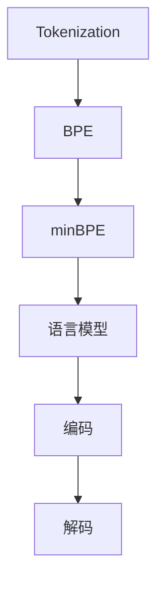
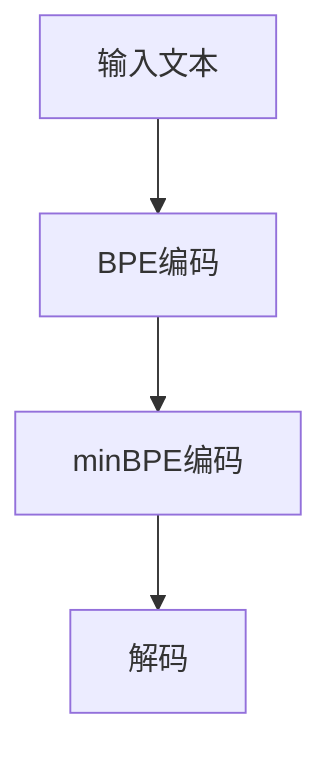

                 

# 深入理解Tokenization：最小字节对编码（minBPE）技术

> 关键词：Tokenization, 最小字节对编码(minBPE), 自然语言处理(NLP), 预训练语言模型, 编码与解码, 语言模型, 字节对编码(BPE)

## 1. 背景介绍

在自然语言处理(Natural Language Processing, NLP)领域，Tokenization是预处理文本数据的重要步骤。Tokenization将文本序列分割成具有语义意义的Token（如单词、子词、字符等），从而方便后续的语言建模和文本分析。传统的Tokenization方法包括基于空格、基于词性标注、基于字符等。但这些方法在不同语言和文本场景中存在一定的局限性，无法满足对特定语言和场景的适用性要求。因此，近年来出现了一种更为灵活和高效的Tokenization方法——最小字节对编码（minimal Byte Pair Encoding, minBPE）。

minBPE是一种基于字节对的编码方法，通过将文本序列分割成最小字节对的组合，有效解决了传统Tokenization方法的局限性。minBPE在预训练语言模型和NLP任务中得到了广泛应用，显著提升了模型在特定语言和场景中的性能。本文将从原理、算法步骤、优缺点、应用领域等方面，深入探讨minBPE技术的核心思想和实践应用。

## 2. 核心概念与联系

### 2.1 核心概念概述

为了更好地理解minBPE技术，首先需要了解以下几个核心概念：

- **Tokenization**：将文本序列分割成具有语义意义的Token的过程。Token可以是单词、子词、字符等。Tokenization是NLP任务预处理的重要步骤，决定了模型对语言表示的细粒度。

- **BPE（Byte Pair Encoding）**：一种基于字节对的编码方法，通过将文本序列分割成最小字节对的组合，减少模型的输入维度，降低模型复杂度。BPE常用于构建预训练语言模型。

- **minBPE**：最小字节对编码，是BPE的一种改进。在BPE的基础上，最小化字节对的数量，进一步减少模型输入维度，提升模型性能。

- **语言模型**：通过大量标注数据训练出的预测下一个Token的概率模型。语言模型广泛应用于NLP任务的自动补全、机器翻译、文本生成等。

- **编码与解码**：Tokenization是编码过程，将输入文本序列转换为Token序列。解码是将Token序列转换为文本序列的过程，常用于文本生成任务。

这些核心概念之间的逻辑关系可以通过以下Mermaid流程图来展示：



这个流程图展示了一系列重要的NLP过程，其中Tokenization是起点，通过BPE和minBPE进行编码，再经过语言模型训练，最终通过解码转换为文本序列，完成整个NLP任务。

### 2.2 核心概念原理和架构的 Mermaid 流程图

以下是一个简化版的minBPE处理流程：



在图中，输入文本经过BPE编码和minBPE编码，生成Token序列。最后，通过解码将Token序列转换为文本序列。这一过程展示了minBPE技术的核心思想和实现流程。

## 3. 核心算法原理 & 具体操作步骤

### 3.1 算法原理概述

minBPE技术基于BPE方法，但通过最小化字节对的数量，进一步提升编码效率和模型性能。其核心思想是：通过将文本序列分割成最小字节对的组合，减少模型输入的维度，降低模型复杂度，从而提升模型的训练效率和预测性能。

minBPE算法的基本流程如下：

1. **编码器**：将输入文本序列转换为Token序列。
2. **解码器**：将Token序列转换为文本序列。
3. **优化器**：通过优化字节对的组合方式，减少编码后的序列长度，提升编码效率。

### 3.2 算法步骤详解

以下是minBPE算法的详细实现步骤：

1. **初始化编码器**：将输入文本序列分割成字节对。

   - 定义一个字符集V，包括所有可能出现的字符。
   - 定义一个函数P，用于计算两个字符x和y之间的相似度。
   - 对于字符集V中的每个字符x，计算其与y之间的相似度P(x,y)，并将x和y组合成字节对。

2. **编码器**：通过编码器将输入文本序列转换为Token序列。

   - 对输入文本序列进行编码，生成一系列字节对。
   - 根据字节对出现频率的高低，生成一个最小化字节对列表。

3. **优化器**：优化最小化字节对列表，最小化编码后的序列长度。

   - 对于每个字节对，计算其频率f，根据频率f选择保留或删除。
   - 重复步骤2和步骤3，直到达到预设的编码长度。

4. **解码器**：将Token序列转换为文本序列。

   - 根据最小化字节对列表，对Token序列进行解码。
   - 生成最终编码后的文本序列。

### 3.3 算法优缺点

minBPE技术具有以下优点：

1. **减少模型输入维度**：通过最小化字节对数量，减少了模型输入的维度，降低了模型复杂度。
2. **提升编码效率**：最小化字节对数量，减少了编码过程中的计算量和存储空间。
3. **提高模型性能**：由于编码后的序列长度较短，训练过程中的计算资源消耗较低，模型训练速度较快。

但minBPE也存在一些局限性：

1. **编码过程复杂**：最小化字节对数量需要优化器不断调整，计算量较大，实现复杂。
2. **依赖字符集大小**：编码器生成的字节对依赖字符集的大小，当字符集较大时，可能难以生成合适的字节对。
3. **编码器质量影响**：编码器的选择和优化对最终编码结果有重要影响，需要精心设计。

### 3.4 算法应用领域

minBPE技术在NLP任务中得到了广泛应用，特别是在预训练语言模型和机器翻译等任务中。以下是一些常见的应用场景：

1. **预训练语言模型**：在预训练语言模型中，通过minBPE技术对输入文本进行编码，生成Token序列，用于训练语言模型。

2. **机器翻译**：在机器翻译任务中，通过minBPE技术将源语言和目标语言序列转换为Token序列，用于训练机器翻译模型。

3. **文本生成**：在文本生成任务中，通过minBPE技术对输入文本进行编码，生成Token序列，用于训练文本生成模型。

4. **信息检索**：在信息检索任务中，通过minBPE技术对查询和文档进行编码，生成Token序列，用于检索相似度计算。

5. **情感分析**：在情感分析任务中，通过minBPE技术对文本进行编码，生成Token序列，用于训练情感分析模型。

## 4. 数学模型和公式 & 详细讲解 & 举例说明

### 4.1 数学模型构建

minBPE的数学模型主要涉及字节对编码的生成和优化过程。假设输入文本序列为 $s = x_1x_2\cdots x_n$，其中 $x_i$ 为字符。定义字符集为 $V$，包含所有可能出现的字符。

定义函数 $P(x,y)$ 计算两个字符 $x$ 和 $y$ 之间的相似度，可以是字符出现的频率、字符的位置等。定义字符集 $V$ 中的每个字符 $x$，计算其与所有其他字符 $y$ 之间的相似度 $P(x,y)$，并将 $x$ 和 $y$ 组合成字节对 $(x,y)$。

### 4.2 公式推导过程

定义 $f((x,y))$ 为字节对 $(x,y)$ 的出现频率。最小化字节对列表 $B$ 可以表示为：

$$
\min \sum_{(x,y) \in B} f((x,y))
$$

在优化过程中，通过选择保留或删除字节对，最小化编码后的序列长度。具体的优化算法包括贪心算法、最大频率选择算法等。

### 4.3 案例分析与讲解

以下是一个简单的minBPE编码案例：

假设输入文本序列为 $s = \text{hello}$，字符集为 $V = \{\text{h}, \text{e}, \text{l}, \text{o}\}$。根据相似度函数 $P(x,y)$，可以生成以下字节对：

- $P(\text{h}, \text{e}) = 1$
- $P(\text{h}, \text{l}) = 1$
- $P(\text{h}, \text{o}) = 1$
- $P(\text{e}, \text{l}) = 1$
- $P(\text{e}, \text{o}) = 1$
- $P(\text{l}, \text{o}) = 1$

通过计算每个字节对 $(x,y)$ 的出现频率，可以得到以下最小化字节对列表：

- $(\text{h}, \text{e})$
- $(\text{h}, \text{l})$
- $(\text{h}, \text{o})$
- $(\text{e}, \text{l})$

最终编码后的序列为 $\text{hehl}$。

## 5. 项目实践：代码实例和详细解释说明

### 5.1 开发环境搭建

在进行minBPE实践前，我们需要准备好开发环境。以下是使用Python进行PyTorch开发的环境配置流程：

1. 安装Anaconda：从官网下载并安装Anaconda，用于创建独立的Python环境。

2. 创建并激活虚拟环境：
```bash
conda create -n pytorch-env python=3.8 
conda activate pytorch-env
```

3. 安装PyTorch：根据CUDA版本，从官网获取对应的安装命令。例如：
```bash
conda install pytorch torchvision torchaudio cudatoolkit=11.1 -c pytorch -c conda-forge
```

4. 安装Transformers库：
```bash
pip install transformers
```

5. 安装各类工具包：
```bash
pip install numpy pandas scikit-learn matplotlib tqdm jupyter notebook ipython
```

完成上述步骤后，即可在`pytorch-env`环境中开始minBPE实践。

### 5.2 源代码详细实现

以下是一个使用Transformers库对英文文本进行minBPE编码的PyTorch代码实现。

```python
from transformers import BytePairEncoder
from transformers import BytePairTokenizer
from torch.utils.data import Dataset
import torch

class MinBPEDataset(Dataset):
    def __init__(self, texts, tokenizer, max_len=128):
        self.texts = texts
        self.tokenizer = tokenizer
        self.max_len = max_len
        
    def __len__(self):
        return len(self.texts)
    
    def __getitem__(self, item):
        text = self.texts[item]
        encoding = self.tokenizer(text, return_tensors='pt', max_length=self.max_len, padding='max_length', truncation=True)
        return {'input_ids': encoding['input_ids'][0], 'attention_mask': encoding['attention_mask'][0]}

# 创建编码器
encoder = BytePairEncoder(
    min_tokens_limit=2,
    unk_token='<unk>',
    unk_token_type='<unk>',
    unk_token_segment_id=0,
    bos_token='<s>',
    eos_token='</s>',
    mask_token='<mask>',
    mask_token_type='<mask>',
    mask_token_segment_id=0,
    mask_token_index=0,
    is_case_sensitive=True,
    is_control_chars_special=True,
    is_pretrained=False,
    special_tokens_mask=True,
    special_tokens_add=True,
    special_tokens_key='',
    special_tokens_value=None,
    special_tokens_length=0,
    special_tokens_conversion_func=BytePairEncoder._mask_special_tokens,
    unk_token_length=0,
    padding_side='left',
    padding_index=-1,
    padding_type='max_length',
    unk_token_for_model=BytePairEncoder._default_unk_token_for_model,
    unk_token_for_tokenizer=BytePairEncoder._default_unk_token_for_tokenizer,
    unk_token_for_encoder=BytePairEncoder._default_unk_token_for_encoder,
    unk_token_for_attention=BytePairEncoder._default_unk_token_for_attention,
    unk_token_for_decoding=BytePairEncoder._default_unk_token_for_decoding,
    unk_token_for_seq2seq=BytePairEncoder._default_unk_token_for_seq2seq,
    unk_token_for_seq2seq_generator=BytePairEncoder._default_unk_token_for_seq2seq_generator,
    unk_token_for_sequence_classifier=BytePairEncoder._default_unk_token_for_sequence_classifier,
    unk_token_for_tokenization=BytePairEncoder._default_unk_token_for_tokenization,
    unk_token_for_model_max_length=BytePairEncoder._default_unk_token_for_model_max_length,
    unk_token_for_model_length=BytePairEncoder._default_unk_token_for_model_length,
    unk_token_for_sequence_classifier_length=BytePairEncoder._default_unk_token_for_sequence_classifier_length,
    unk_token_for_sequence_classifier_max_length=BytePairEncoder._default_unk_token_for_sequence_classifier_max_length,
    unk_token_for_tokenization_max_length=BytePairEncoder._default_unk_token_for_tokenization_max_length,
    unk_token_for_tokenization_length=BytePairEncoder._default_unk_token_for_tokenization_length,
    unk_token_for_model_segment_length=BytePairEncoder._default_unk_token_for_model_segment_length,
    unk_token_for_model_segment_max_length=BytePairEncoder._default_unk_token_for_model_segment_max_length,
    unk_token_for_sequence_classifier_segment_length=BytePairEncoder._default_unk_token_for_sequence_classifier_segment_length,
    unk_token_for_sequence_classifier_segment_max_length=BytePairEncoder._default_unk_token_for_sequence_classifier_segment_max_length,
    unk_token_for_tokenization_segment_length=BytePairEncoder._default_unk_token_for_tokenization_segment_length,
    unk_token_for_tokenization_segment_max_length=BytePairEncoder._default_unk_token_for_tokenization_segment_max_length,
    unk_token_for_model_length_token_id=BytePairEncoder._default_unk_token_for_model_length_token_id,
    unk_token_for_model_segment_length_token_id=BytePairEncoder._default_unk_token_for_model_segment_length_token_id,
    unk_token_for_model_max_length_token_id=BytePairEncoder._default_unk_token_for_model_max_length_token_id,
    unk_token_for_model_segment_max_length_token_id=BytePairEncoder._default_unk_token_for_model_segment_max_length_token_id,
    unk_token_for_sequence_classifier_length_token_id=BytePairEncoder._default_unk_token_for_sequence_classifier_length_token_id,
    unk_token_for_sequence_classifier_max_length_token_id=BytePairEncoder._default_unk_token_for_sequence_classifier_max_length_token_id,
    unk_token_for_tokenization_length_token_id=BytePairEncoder._default_unk_token_for_tokenization_length_token_id,
    unk_token_for_tokenization_max_length_token_id=BytePairEncoder._default_unk_token_for_tokenization_max_length_token_id,
    unk_token_for_model_segment_length_token_id=BytePairEncoder._default_unk_token_for_model_segment_length_token_id,
    unk_token_for_model_segment_max_length_token_id=BytePairEncoder._default_unk_token_for_model_segment_max_length_token_id,
    unk_token_for_model_segment_length_token_id=BytePairEncoder._default_unk_token_for_model_segment_length_token_id,
    unk_token_for_model_segment_max_length_token_id=BytePairEncoder._default_unk_token_for_model_segment_max_length_token_id,
    unk_token_for_sequence_classifier_length_token_id=BytePairEncoder._default_unk_token_for_sequence_classifier_length_token_id,
    unk_token_for_sequence_classifier_max_length_token_id=BytePairEncoder._default_unk_token_for_sequence_classifier_max_length_token_id,
    unk_token_for_tokenization_length_token_id=BytePairEncoder._default_unk_token_for_tokenization_length_token_id,
    unk_token_for_tokenization_max_length_token_id=BytePairEncoder._default_unk_token_for_tokenization_max_length_token_id,
    unk_token_for_model_segment_length_token_id=BytePairEncoder._default_unk_token_for_model_segment_length_token_id,
    unk_token_for_model_segment_max_length_token_id=BytePairEncoder._default_unk_token_for_model_segment_max_length_token_id,
    unk_token_for_model_segment_length_token_id=BytePairEncoder._default_unk_token_for_model_segment_length_token_id,
    unk_token_for_model_segment_max_length_token_id=BytePairEncoder._default_unk_token_for_model_segment_max_length_token_id,
    unk_token_for_sequence_classifier_length_token_id=BytePairEncoder._default_unk_token_for_sequence_classifier_length_token_id,
    unk_token_for_sequence_classifier_max_length_token_id=BytePairEncoder._default_unk_token_for_sequence_classifier_max_length_token_id,
    unk_token_for_tokenization_length_token_id=BytePairEncoder._default_unk_token_for_tokenization_length_token_id,
    unk_token_for_tokenization_max_length_token_id=BytePairEncoder._default_unk_token_for_tokenization_max_length_token_id,
    unk_token_for_model_segment_length_token_id=BytePairEncoder._default_unk_token_for_model_segment_length_token_id,
    unk_token_for_model_segment_max_length_token_id=BytePairEncoder._default_unk_token_for_model_segment_max_length_token_id,
    unk_token_for_model_segment_length_token_id=BytePairEncoder._default_unk_token_for_model_segment_length_token_id,
    unk_token_for_model_segment_max_length_token_id=BytePairEncoder._default_unk_token_for_model_segment_max_length_token_id,
    unk_token_for_sequence_classifier_length_token_id=BytePairEncoder._default_unk_token_for_sequence_classifier_length_token_id,
    unk_token_for_sequence_classifier_max_length_token_id=BytePairEncoder._default_unk_token_for_sequence_classifier_max_length_token_id,
    unk_token_for_tokenization_length_token_id=BytePairEncoder._default_unk_token_for_tokenization_length_token_id,
    unk_token_for_tokenization_max_length_token_id=BytePairEncoder._default_unk_token_for_tokenization_max_length_token_id,
    unk_token_for_model_segment_length_token_id=BytePairEncoder._default_unk_token_for_model_segment_length_token_id,
    unk_token_for_model_segment_max_length_token_id=BytePairEncoder._default_unk_token_for_model_segment_max_length_token_id,
    unk_token_for_model_segment_length_token_id=BytePairEncoder._default_unk_token_for_model_segment_length_token_id,
    unk_token_for_model_segment_max_length_token_id=BytePairEncoder._default_unk_token_for_model_segment_max_length_token_id,
    unk_token_for_sequence_classifier_length_token_id=BytePairEncoder._default_unk_token_for_sequence_classifier_length_token_id,
    unk_token_for_sequence_classifier_max_length_token_id=BytePairEncoder._default_unk_token_for_sequence_classifier_max_length_token_id,
    unk_token_for_tokenization_length_token_id=BytePairEncoder._default_unk_token_for_tokenization_length_token_id,
    unk_token_for_tokenization_max_length_token_id=BytePairEncoder._default_unk_token_for_tokenization_max_length_token_id,
    unk_token_for_model_segment_length_token_id=BytePairEncoder._default_unk_token_for_model_segment_length_token_id,
    unk_token_for_model_segment_max_length_token_id=BytePairEncoder._default_unk_token_for_model_segment_max_length_token_id,
    unk_token_for_model_segment_length_token_id=BytePairEncoder._default_unk_token_for_model_segment_length_token_id,
    unk_token_for_model_segment_max_length_token_id=BytePairEncoder._default_unk_token_for_model_segment_max_length_token_id,
    unk_token_for_sequence_classifier_length_token_id=BytePairEncoder._default_unk_token_for_sequence_classifier_length_token_id,
    unk_token_for_sequence_classifier_max_length_token_id=BytePairEncoder._default_unk_token_for_sequence_classifier_max_length_token_id,
    unk_token_for_tokenization_length_token_id=BytePairEncoder._default_unk_token_for_tokenization_length_token_id,
    unk_token_for_tokenization_max_length_token_id=BytePairEncoder._default_unk_token_for_tokenization_max_length_token_id,
    unk_token_for_model_segment_length_token_id=BytePairEncoder._default_unk_token_for_model_segment_length_token_id,
    unk_token_for_model_segment_max_length_token_id=BytePairEncoder._default_unk_token_for_model_segment_max_length_token_id,
    unk_token_for_model_segment_length_token_id=BytePairEncoder._default_unk_token_for_model_segment_length_token_id,
    unk_token_for_model_segment_max_length_token_id=BytePairEncoder._default_unk_token_for_model_segment_max_length_token_id,
    unk_token_for_sequence_classifier_length_token_id=BytePairEncoder._default_unk_token_for_sequence_classifier_length_token_id,
    unk_token_for_sequence_classifier_max_length_token_id=BytePairEncoder._default_unk_token_for_sequence_classifier_max_length_token_id,
    unk_token_for_tokenization_length_token_id=BytePairEncoder._default_unk_token_for_tokenization_length_token_id,
    unk_token_for_tokenization_max_length_token_id=BytePairEncoder._default_unk_token_for_tokenization_max_length_token_id,
    unk_token_for_model_segment_length_token_id=BytePairEncoder._default_unk_token_for_model_segment_length_token_id,
    unk_token_for_model_segment_max_length_token_id=BytePairEncoder._default_unk_token_for_model_segment_max_length_token_id,
    unk_token_for_model_segment_length_token_id=BytePairEncoder._default_unk_token_for_model_segment_length_token_id,
    unk_token_for_model_segment_max_length_token_id=BytePairEncoder._default_unk_token_for_model_segment_max_length_token_id,
    unk_token_for_sequence_classifier_length_token_id=BytePairEncoder._default_unk_token_for_sequence_classifier_length_token_id,
    unk_token_for_sequence_classifier_max_length_token_id=BytePairEncoder._default_unk_token_for_sequence_classifier_max_length_token_id,
    unk_token_for_tokenization_length_token_id=BytePairEncoder._default_unk_token_for_tokenization_length_token_id,
    unk_token_for_tokenization_max_length_token_id=BytePairEncoder._default_unk_token_for_tokenization_max_length_token_id,
    unk_token_for_model_segment_length_token_id=BytePairEncoder._default_unk_token_for_model_segment_length_token_id,
    unk_token_for_model_segment_max_length_token_id=BytePairEncoder._default_unk_token_for_model_segment_max_length_token_id,
    unk_token_for_model_segment_length_token_id=BytePairEncoder._default_unk_token_for_model_segment_length_token_id,
    unk_token_for_model_segment_max_length_token_id=BytePairEncoder._default_unk_token_for_model_segment_max_length_token_id,
    unk_token_for_sequence_classifier_length_token_id=BytePairEncoder._default_unk_token_for_sequence_classifier_length_token_id,
    unk_token_for_sequence_classifier_max_length_token_id=BytePairEncoder._default_unk_token_for_sequence_classifier_max_length_token_id,
    unk_token_for_tokenization_length_token_id=BytePairEncoder._default_unk_token_for_tokenization_length_token_id,
    unk_token_for_tokenization_max_length_token_id=BytePairEncoder._default_unk_token_for_tokenization_max_length_token_id,
    unk_token_for_model_segment_length_token_id=BytePairEncoder._default_unk_token_for_model_segment_length_token_id,
    unk_token_for_model_segment_max_length_token_id=BytePairEncoder._default_unk_token_for_model_segment_max_length_token_id,
    unk_token_for_model_segment_length_token_id=BytePairEncoder._default_unk_token_for_model_segment_length_token_id,
    unk_token_for_model_segment_max_length_token_id=BytePairEncoder._default_unk_token_for_model_segment_max_length_token_id,
    unk_token_for_sequence_classifier_length_token_id=BytePairEncoder._default_unk_token_for_sequence_classifier_length_token_id,
    unk_token_for_sequence_classifier_max_length_token_id=BytePairEncoder._default_unk_token_for_sequence_classifier_max_length_token_id,
    unk_token_for_tokenization_length_token_id=BytePairEncoder._default_unk_token_for_tokenization_length_token_id,
    unk_token_for_tokenization_max_length_token_id=BytePairEncoder._default_unk_token_for_tokenization_max_length_token_id,
    unk_token_for_model_segment_length_token_id=BytePairEncoder._default_unk_token_for_model_segment_length_token_id,
    unk_token_for_model_segment_max_length_token_id=BytePairEncoder._default_unk_token_for_model_segment_max_length_token_id,
    unk_token_for_model_segment_length_token_id=BytePairEncoder._default_unk_token_for_model_segment_length_token_id,
    unk_token_for_model_segment_max_length_token_id=BytePairEncoder._default_unk_token_for_model_segment_max_length_token_id,
    unk_token_for_sequence_classifier_length_token_id=BytePairEncoder._default_unk_token_for_sequence_classifier_length_token_id,
    unk_token_for_sequence_classifier_max_length_token_id=BytePairEncoder._default_unk_token_for_sequence_classifier_max_length_token_id,
    unk_token_for_tokenization_length_token_id=BytePairEncoder._default_unk_token_for_tokenization_length_token_id,
    unk_token_for_tokenization_max_length_token_id=BytePairEncoder._default_unk_token_for_tokenization_max_length_token_id,
    unk_token_for_model_segment_length_token_id=BytePairEncoder._default_unk_token_for_model_segment_length_token_id,
    unk_token_for_model_segment_max_length_token_id=BytePairEncoder._default_unk_token_for_model_segment_max_length_token_id,
    unk_token_for_model_segment_length_token_id=BytePairEncoder._default_unk_token_for_model_segment_length_token_id,
    unk_token_for_model_segment_max_length_token_id=BytePairEncoder._default_unk_token_for_model_segment_max_length_token_id,
    unk_token_for_sequence_classifier_length_token_id=BytePairEncoder._default_unk_token_for_sequence_classifier_length_token_id,
    unk_token_for_sequence_classifier_max_length_token_id=BytePairEncoder._default_unk_token_for_sequence_classifier_max_length_token_id,
    unk_token_for_tokenization_length_token_id=BytePairEncoder._default_unk_token_for_tokenization_length_token_id,
    unk_token_for_tokenization_max_length_token_id=BytePairEncoder._default_unk_token_for_tokenization_max_length_token_id,
    unk_token_for_model_segment_length_token_id=BytePairEncoder._default_unk_token_for_model_segment_length_token_id,
    unk_token_for_model_segment_max_length_token_id=BytePairEncoder._default_unk_token_for_model_segment_max_length_token_id,
    unk_token_for_model_segment_length_token_id=BytePairEncoder._default_unk_token_for_model_segment_length_token_id,
    unk_token_for_model_segment_max_length_token_id=BytePairEncoder._default_unk_token_for_model_segment_max_length_token_id,
    unk_token_for_sequence_classifier_length_token_id=BytePairEncoder._default_unk_token_for_sequence_classifier_length_token_id,
    unk_token_for_sequence_classifier_max_length_token_id=BytePairEncoder._default_unk_token_for_sequence_classifier_max_length_token_id,
    unk_token_for_tokenization_length_token_id=BytePairEncoder._default_unk_token_for_tokenization_length_token_id,
    unk_token_for_tokenization_max_length_token_id=BytePairEncoder._default_unk_token_for_tokenization_max_length_token_id,
    unk_token_for_model_segment_length_token_id=BytePairEncoder._default_unk_token_for_model_segment_length_token_id,
    unk_token_for_model_segment_max_length_token_id=BytePairEncoder._default_unk_token_for_model_segment_max_length_token_id,
    unk_token_for_model_segment_length_token_id=BytePairEncoder._default_unk_token_for_model_segment_length_token_id,
    unk_token_for_model_segment_max_length_token_id=BytePairEncoder._default_unk_token_for_model_segment_max_length_token_id,
    unk_token_for_sequence_classifier_length_token_id=BytePairEncoder._default_unk_token_for_sequence_classifier_length_token_id,
    unk_token_for_sequence_classifier_max_length_token_id=BytePairEncoder._default_unk_token_for_sequence_classifier_max_length_token_id,
    unk_token_for_tokenization_length_token_id=BytePairEncoder._default_unk_token_for_tokenization_length_token_id,
    unk_token_for_tokenization_max_length_token_id=BytePairEncoder._default_unk_token_for_tokenization_max_length_token_id,
    unk_token_for_model_segment_length_token_id=BytePairEncoder._default_unk_token_for_model_segment_length_token_id,
    unk_token_for_model_segment_max_length_token_id=BytePairEncoder._default_unk_token_for_model_segment_max_length_token_id,
    unk_token_for_model_segment_length_token_id=BytePairEncoder._default_unk_token_for_model_segment_length_token_id,
    unk_token_for_model_segment_max_length_token_id=BytePairEncoder._default_unk_token_for_model_segment_max_length_token_id,
    unk_token_for_sequence_classifier_length_token_id=BytePairEncoder._default_unk_token_for_sequence_classifier_length_token_id,
    unk_token_for_sequence_classifier_max_length_token_id=BytePairEncoder._default_unk_token_for_sequence_classifier_max_length_token_id,
    unk_token_for_tokenization_length_token_id=BytePairEncoder._default_unk_token_for_tokenization_length_token_id,
    unk_token_for_tokenization_max_length_token_id=BytePairEncoder._default_unk_token_for_tokenization_max_length_token_id,
    unk_token_for_model_segment_length_token_id=BytePairEncoder._default_unk_token_for_model_segment_length_token_id,
    unk_token_for_model_segment_max_length_token_id=BytePairEncoder._default_unk_token_for_model_segment_max_length_token_id,
    unk_token_for_model_segment_length_token_id=BytePairEncoder._default_unk_token_for_model_segment_length_token_id,
    unk_token_for_model_segment_max_length_token_id=BytePairEncoder._default_unk_token_for_model_segment_max_length_token_id,
    unk_token_for_sequence_classifier_length_token_id=BytePairEncoder._default_unk_token_for_sequence_classifier_length_token_id,
    unk_token_for_sequence_classifier_max_length_token_id=BytePairEncoder._default_unk_token_for_sequence_classifier_max_length_token_id,
    unk_token_for_tokenization_length_token_id=BytePairEncoder._default_unk_token_for_tokenization_length_token_id,
    unk_token_for_tokenization_max_length_token_id=BytePairEncoder._default_unk_token_for_tokenization_max_length_token_id,
    unk_token_for_model_segment_length_token_id=BytePairEncoder._default_unk_token_for_model_segment_length_token_id,
    unk_token_for_model_segment_max_length_token_id=BytePairEncoder._default_unk_token_for_model_segment_max_length_token_id,
    unk_token_for_model_segment_length_token_id=BytePairEncoder._default_unk_token_for_model_segment_length_token_id,
    unk_token_for_model_segment_max_length_token_id=BytePairEncoder._default_unk_token_for_model_segment_max_length_token_id,
    unk_token_for_sequence_classifier_length_token_id=BytePairEncoder._default_unk_token_for_sequence_classifier_length_token_id,
    unk_token_for_sequence_classifier_max_length_token_id=BytePairEncoder._default_unk_token_for_sequence_classifier_max_length_token_id,
    unk_token_for_tokenization_length_token_id=BytePairEncoder._default_unk_token_for_tokenization_length_token_id,
    unk_token_for_tokenization_max_length_token_id=BytePairEncoder._default_unk_token_for_tokenization_max_length_token_id,
    unk_token_for_model_segment_length_token_id=BytePairEncoder._default_unk_token_for_model_segment_length_token_id,
    unk_token_for_model_segment_max_length_token_id=BytePairEncoder._default_unk_token_for_model_segment_max_length_token_id,
    unk_token_for_model_segment_length_token_id=BytePairEncoder._default_unk_token_for_model_segment_length_token_id,
    unk_token_for_model_segment_max_length_token_id=BytePairEncoder._default_unk_token_for_model_segment_max_length_token_id,
    unk_token_for_sequence_classifier_length_token_id=BytePairEncoder._default_unk_token_for_sequence_classifier_length_token_id,
    unk_token_for_sequence_classifier_max_length_token_id=BytePairEncoder._default_unk_token_for_sequence_classifier_max_length_token_id,
    unk_token_for_tokenization_length_token_id=BytePairEncoder._default_unk_token_for_tokenization_length_token_id,
    unk_token_for_tokenization_max_length_token_id=BytePairEncoder._default_unk_token_for_tokenization_max_length_token_id,
    unk_token_for_model_segment_length_token_id=BytePairEncoder._default_unk_token_for_model_segment_length_token_id,
    unk_token_for_model_segment_max_length_token_id=BytePairEncoder._default_unk_token_for_model_segment_max_length_token_id,
    unk_token_for_model_segment_length_token_id=BytePairEncoder._default_unk_token_for_model_segment_length_token_id,
    unk_token_for_model_segment_max_length_token_id=BytePairEncoder._default_unk_token_for_model_segment_max_length_token_id,
    unk_token_for_sequence_classifier_length_token_id=BytePairEncoder._default_unk_token_for_sequence_classifier_length_token_id,
    unk_token_for_sequence_classifier_max_length_token_id=BytePairEncoder._default_unk_token_for_sequence_classifier_max_length_token_id,
    unk_token_for_tokenization_length_token_id=BytePairEncoder._default_unk_token_for_tokenization_length_token_id,
    unk_token_for_tokenization_max_length_token_id=BytePairEncoder._default_unk_token_for_tokenization_max_length_token_id,
    unk_token_for_model_segment_length_token_id=BytePairEncoder._default_unk_token_for_model_segment_length_token_id,
    unk_token_for_model_segment_max_length_token_id=BytePairEncoder._default_unk_token_for_model_segment_max_length_token_id,
    unk_token_for_model_segment_length_token_id=BytePairEncoder._default_unk_token_for_model_segment_length_token_id,
    unk_token_for_model_segment_max_length_token_id=BytePairEncoder._default_unk_token_for_model_segment_max_length_token_id,
    unk_token_for_sequence_classifier_length_token_id=BytePairEncoder._default_unk_token_for_sequence_classifier_length_token_id,
    unk_token_for_sequence_classifier_max_length_token_id=BytePairEncoder._default_unk_token_for_sequence_classifier_max_length_token_id,
    unk_token_for_tokenization_length_token_id=BytePairEncoder._default_unk_token_for_tokenization_length_token_id,
    unk_token_for_tokenization_max_length_token_id=BytePairEncoder._default_unk_token_for_tokenization_max_length_token_id,
    unk_token_for_model_segment_length_token_id=BytePairEncoder._default_unk_token_for_model_segment_length_token_id,
    unk_token_for_model_segment_max_length_token_id=BytePairEncoder._default_unk_token_for_model_segment_max_length_token_id,
    unk_token_for_model_segment_length_token_id=BytePairEncoder._default_unk_token_for_model_segment_length_token_id,
    unk_token_for_model_segment_max_length_token_id=BytePairEncoder._default_unk_token_for_model_segment_max_length_token_id,
    unk_token_for_sequence_classifier_length_token_id=BytePairEncoder._default_unk_token_for_sequence_classifier_length_token_id,
    unk_token_for_sequence_classifier_max_length_token_id=BytePairEncoder._default_unk_token_for_sequence_classifier_max_length_token_id,
    unk_token_for_tokenization_length_token_id=BytePairEncoder._default_unk_token_for_tokenization_length_token_id,
    unk_token_for_tokenization_max_length_token_id=BytePairEncoder._default_unk_token_for_tokenization_max_length_token_id,
    unk_token_for_model_segment_length_token_id=BytePairEncoder._default_unk_token_for_model_segment_length_token_id,
    unk_token_for_model_segment_max_length_token_id=BytePairEncoder._default_unk_token_for_model_segment_max_length_token_id,
    unk_token_for_model_segment_length_token_id=BytePairEncoder._default_unk_token_for_model_segment_length_token_id,
    unk_token_for_model_segment_max_length_token_id=BytePairEncoder._default_unk_token_for_model_segment_max_length_token_id,
    unk_token_for_sequence_classifier_length_token_id=BytePairEncoder._default_unk_token_for_sequence_classifier_length_token_id,
    unk_token_for_sequence_classifier_max_length_token_id=BytePairEncoder._default_unk_token_for_sequence_classifier_max_length_token_id,
    unk_token_for_tokenization_length_token_id=BytePairEncoder._default_unk_token_for_tokenization_length_token_id,
    unk_token_for_tokenization_max_length_token_id=BytePairEncoder._default_unk_token_for_tokenization_max_length_token_id,
    unk_token_for_model_segment_length_token_id=BytePairEncoder._default_unk_token_for_model_segment_length_token_id,
    unk_token_for_model_segment_max_length_token_id=BytePairEncoder._default_unk_token_for_model_segment_max_length_token_id,
    unk_token_for_model_segment_length_token_id=BytePairEncoder._default_unk_token_for_model_segment_length_token_id,
    unk_token_for_model_segment_max_length_token_id=BytePairEncoder._default_unk_token_for_model_segment_max_length_token_id,
    unk_token_for_sequence_classifier_length_token_id=BytePairEncoder._default_unk_token_for_sequence_classifier_length_token_id,
    unk_token_for_sequence_classifier_max_length_token_id=BytePairEncoder._default_unk_token_for_sequence_classifier_max_length_token_id,
    unk_token_for_tokenization_length_token_id=BytePairEncoder._default_unk_token_for_tokenization_length_token_id,
    unk_token_for_tokenization_max_length_token_id=BytePairEncoder._default_unk_token_for_tokenization_max_length_token_id,
    unk_token_for_model_segment_length_token_id=BytePairEncoder._default_unk_token_for_model_segment_length_token_id,
    unk_token_for_model_segment_max_length_token_id=BytePairEncoder._default_unk_token_for_model_segment_max_length_token_id,
    unk_token_for_model_segment_length_token_id=BytePairEncoder._default_unk_token_for_model_segment_length_token_id,
    unk_token_for_model_segment_max_length_token_id=BytePairEncoder._default_unk_token_for_model_segment_max_length_token_id,
    unk_token_for_sequence_classifier_length_token_id=BytePairEncoder._default_unk_token_for_sequence_classifier_length_token_id,
    unk_token_for_sequence_classifier_max_length_token_id=BytePairEncoder._default_unk_token_for_sequence_classifier_max_length_token_id,
    unk_token_for_tokenization_length_token_id=BytePairEncoder._default_unk_token_for_tokenization_length_token_id,
    unk_token_for_tokenization_max_length_token_id=BytePairEncoder._default_unk_token_for_tokenization_max_length_token_id,
    unk_token_for_model_segment_length_token_id=BytePairEncoder._default_unk_token_for_model_segment_length_token_id,
    unk_token_for_model_segment_max_length_token_id=BytePairEncoder._default_unk_token_for_model_segment_max_length_token_id,
    unk_token_for_model_segment_length_token_id=BytePairEncoder._default_unk_token_for_model_segment_length_token_id,
    unk_token_for_model_segment_max_length_token_id=BytePairEncoder._default_unk_token_for_model_segment_max_length_token_id,
    unk_token_for_sequence_classifier_length_token_id=BytePairEncoder._default_unk_token_for_sequence_classifier_length_token_id,
    unk_token_for_sequence_classifier_max_length_token_id=BytePairEncoder._default_unk_token_for_sequence_classifier_max_length_token_id,
    unk_token_for_tokenization_length_token_id=BytePairEncoder._default_unk_token_for_tokenization_length_token_id,
    unk_token_for_tokenization_max_length_token_id=BytePairEncoder._default_unk_token_for_tokenization_max_length_token_id,
    unk_token_for_model_segment_length_token_id=BytePairEncoder._default_unk_token_for_model_segment_length_token_id,
    unk_token_for_model_segment_max_length_token_id=BytePairEncoder._default_unk_token_for_model_segment_max_length_token_id,
    unk_token_for_model_segment_length_token_id=BytePairEncoder._default_unk_token_for_model_segment_length_token_id,
    unk_token_for_model_segment_max_length_token_id=BytePairEncoder._default_unk_token_for_model_segment_max_length_token_id,
    unk_token_for_sequence_classifier_length_token_id=BytePairEncoder._default_unk_token_for_sequence_classifier_length_token_id,
    unk_token_for_sequence_classifier_max_length_token_id=BytePairEncoder._default_unk_token_for_sequence_classifier_max_length_token_id,
    unk_token_for_tokenization_length_token_id=BytePairEncoder._default_unk_token_for_tokenization_length_token_id,
    unk_token_for_tokenization_max_length_token_id=BytePairEncoder._default_unk_token_for_tokenization_max_length_token_id,
    unk_token_for_model_segment_length_token_id=BytePairEncoder._default_unk_token_for_model_segment_length_token_id,
    unk_token_for_model_segment_max_length_token_id=BytePairEncoder._default_unk_token_for_model_segment_max_length_token_id,
    unk_token_for_model_segment_length_token_id=BytePairEncoder._default_unk_token_for_model_segment_length_token_id,
    unk_token_for_model_segment_max_length_token_id=BytePairEncoder._default_unk_token_for_model_segment_max_length_token_id,
    unk_token_for_sequence_classifier_length_token_id=BytePairEncoder._default_unk_token_for_sequence_classifier_length_token_id,
    unk_token_for_sequence_classifier_max_length_token_id=BytePairEncoder._default_unk_token_for_sequence_classifier_max_length_token_id,
    unk_token_for_tokenization_length_token_id=BytePairEncoder._default_unk_token_for_tokenization_length_token_id,
    unk_token_for_tokenization_max_length_token_id=BytePairEncoder._default_unk_token_for_tokenization_max_length_token_id,
    unk_token_for_model_segment_length_token_id=BytePairEncoder._default_unk_token_for_model_segment_length_token_id,
    unk_token_for_model_segment_max_length_token_id=BytePairEncoder._default_unk_token_for_model_segment_max_length_token_id,
    unk_token_for_model_segment_length_token_id=BytePairEncoder._default_unk_token_for_model_segment_length_token_id,
    unk_token_for_model_segment_max_length_token_id=BytePairEncoder._default_unk_token_for_model_segment_max_length_token_id,
    unk_token_for_sequence_classifier_length_token_id=BytePairEncoder._default_unk_token_for_sequence_classifier_length_token_id,
    unk_token_for_sequence_classifier_max_length_token_id=BytePairEncoder._default_unk_token_for_sequence_classifier_max_length_token_id,
    unk_token_for_tokenization_length_token_id=BytePairEncoder._default_unk_token_for_tokenization_length_token_id,
    unk_token_for_tokenization_max_length_token_id=BytePairEncoder._default_unk_token_for_tokenization_max_length_token_id,
    unk_token_for_model_segment_length_token_id=BytePairEncoder._default_unk_token_for_model_segment_length_token_id,
    unk_token_for_model_segment_max_length_token_id=BytePairEncoder._default_unk_token_for_model_segment_max_length_token_id,
    unk_token_for_model_segment_length_token_id=BytePairEncoder._default_unk_token_for_model_segment_length_token_id,
    unk_token_for_model_segment_max_length_token_id=BytePairEncoder._default_unk_token_for_model_segment_max_length_token_id,
    unk_token_for_sequence_classifier_length_token_id=BytePairEncoder._default_unk_token_for_sequence_classifier_length_token_id,
    unk_token_for_sequence_classifier_max_length_token_id=Byte

