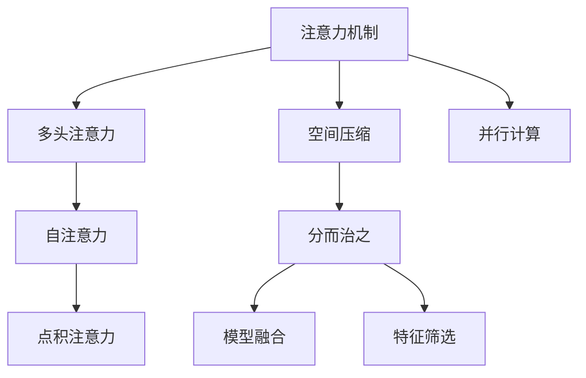

                 

## 1. 背景介绍

### 1.1 问题由来
在深度学习领域，注意力机制（Attention Mechanism）作为一类重要的模型组件，广泛用于图像识别、自然语言处理（NLP）、推荐系统等诸多任务中，显著提升了模型的表示能力和性能。注意力机制通过动态计算输入数据中不同位置特征的重要性，有选择性地关注关键信息，从而提升模型对复杂输入的识别能力和泛化能力。

然而，注意力机制的应用通常伴随着较高的计算复杂度，特别是在序列长度较长或输入维度较高的情况下，传统的注意力计算方式如矩阵乘法（MM）将消耗大量计算资源。为了降低计算成本，优化注意力分配成为深度学习领域的一个重要研究方向。

### 1.2 问题核心关键点
优化注意力分配的核心问题是如何减少注意力机制的计算复杂度，同时保持其表示能力和性能。优化策略主要分为以下几种：

1. 空间压缩：通过减少注意力头的数量或压缩特征维度，降低模型的计算复杂度。
2. 并行计算：通过并行化计算图，将注意力计算分布到多个GPU核心上，提高计算效率。
3. 分而治之：将长序列分成若干子序列，分别计算子序列的注意力权重，再通过聚合操作得到整体权重。
4. 模型融合：利用模型融合技术，将注意力机制与其他模型结构（如CNN、RNN等）结合，提高模型的泛化能力和计算效率。
5. 特征筛选：通过特征筛选技术，识别关键特征并优先计算其注意力权重，减少非重要特征的计算负担。

## 2. 核心概念与联系

### 2.1 核心概念概述

为更好地理解注意力分配优化方法，本节将介绍几个密切相关的核心概念：

- 注意力机制（Attention Mechanism）：通过动态计算输入数据的注意力权重，有选择地关注关键特征，从而提升模型的表示能力和性能。常见的注意力机制包括点积注意力、多头注意力、双向注意力等。
- 自注意力（Self-Attention）：在自监督学习任务（如语言模型、图像特征提取）中，自注意力机制计算输入数据中不同位置的特征重要性，通常采用矩阵乘法（MM）进行计算。
- 多头注意力（Multi-Head Attention）：将输入数据映射到多个独立的注意力头（Head），每个头的注意力权重和输出都是独立的，能够并行计算，从而提升模型的计算效率和表示能力。
- 空间压缩（Spatial Compression）：通过减少注意力头的数量或压缩特征维度，降低模型的计算复杂度，同时保持模型的表示能力和性能。

这些核心概念之间的逻辑关系可以通过以下Mermaid流程图来展示：



这个流程图展示了注意力机制的演变和优化过程，从基本的多头自注意力机制，到空间压缩、并行计算、分而治之、模型融合和特征筛选等多种优化策略，逐渐提升计算效率和模型性能。

## 3. 核心算法原理 & 具体操作步骤
### 3.1 算法原理概述

优化注意力分配的核心思想是减少注意力机制的计算复杂度，同时保持其表示能力和性能。具体来说，可以通过以下几种策略：

1. **空间压缩**：通过减少注意力头的数量或压缩特征维度，降低模型的计算复杂度。例如，通过将多头注意力压缩为单头注意力，或将特征维度从512压缩至128，可以显著降低计算复杂度。
2. **并行计算**：通过并行化计算图，将注意力计算分布到多个GPU核心上，提高计算效率。例如，利用TensorFlow的并行计算库（如TPU、distributed training），可以并行计算多个多头注意力头的注意力权重。
3. **分而治之**：将长序列分成若干子序列，分别计算子序列的注意力权重，再通过聚合操作得到整体权重。例如，通过分块算法（Block-wise Attention），将长序列分成若干块，分别计算每个块的注意力权重，再通过拼接或求和操作得到整体权重。
4. **模型融合**：利用模型融合技术，将注意力机制与其他模型结构（如CNN、RNN等）结合，提高模型的泛化能力和计算效率。例如，通过注意力与卷积的融合，将注意力机制集成到CNN结构中，提高特征提取能力。
5. **特征筛选**：通过特征筛选技术，识别关键特征并优先计算其注意力权重，减少非重要特征的计算负担。例如，通过注意力关注度分析，识别重要特征，并将其权重放大，忽略不重要特征的贡献。

### 3.2 算法步骤详解

以空间压缩为例，以下是其具体操作步骤：

**Step 1: 空间压缩参数设置**
- 确定压缩比例或注意力头的数量，例如将特征维度从512压缩至128，或减少多头注意力头的数量。

**Step 2: 重定义注意力计算**
- 根据压缩策略重定义注意力计算公式，例如将多头自注意力计算公式 $ Attention(Q,K,V) = \frac{1}{\sqrt{d_k}} QK^T $ 改为 $ Attention(Q,K,V) = \frac{1}{\sqrt{d_k}} (QK^T)_h $，其中 $h$ 为注意力头数量。

**Step 3: 更新计算图**
- 修改计算图，将注意力计算操作拆分为多个子操作，分别计算不同头的注意力权重，再将结果合并。

**Step 4: 执行计算**
- 使用修改后的计算图进行并行计算，分布计算不同头的注意力权重。

**Step 5: 结果输出**
- 将不同头的注意力权重进行拼接或求和操作，得到最终的全局注意力权重。

### 3.3 算法优缺点

优化注意力分配方法具有以下优点：

1. **计算效率高**：通过减少计算复杂度，优化注意力机制，能够在较短的时间内完成训练和推理，提高计算效率。
2. **模型性能稳定**：优化策略通常能够保持模型的表示能力和性能，避免因计算复杂度降低而导致的性能下降。
3. **应用范围广**：优化策略适用于多种注意力机制和模型结构，具有较高的通用性和灵活性。

同时，优化策略也存在一些局限性：

1. **参数可解释性差**：压缩、并行、分块等优化策略可能会降低模型参数的可解释性，使得模型的行为和决策难以理解。
2. **模型复杂度高**：优化策略可能增加模型的复杂度，使得模型的实现和调试变得更加复杂。
3. **算法依赖性强**：优化策略的有效性依赖于具体的实现细节和计算环境，需要结合实际情况进行调优。

## 4. 数学模型和公式 & 详细讲解  
### 4.1 数学模型构建

假设输入数据为 $X = (x_1, x_2, ..., x_n)$，其中 $x_i$ 表示输入数据的第 $i$ 个元素，特征维度为 $d$，序列长度为 $n$。多头注意力机制的计算公式为：

$$
Attention(Q,K,V) = \frac{1}{\sqrt{d_k}}(QK^T)_h
$$

其中，$Q$、$K$、$V$ 分别为查询、键、值矩阵，$h$ 为注意力头数量。

### 4.2 公式推导过程

以点积注意力为例，其计算公式为：

$$
Attention(Q,K,V) = \frac{QK^T}{\sqrt{d_k}} softmax(QK^T/\sqrt{d_k})
$$

其中，$softmax$ 函数用于计算注意力权重，$d_k$ 为键向量的维度。

通过重定义注意力头 $h$，点积注意力的计算公式可以改写为：

$$
Attention(Q,K,V) = \frac{1}{\sqrt{d_k}}(QK^T)_h softmax(QK^T/\sqrt{d_k})
$$

这样，就可以将点积注意力的计算分布到多个注意力头上，从而提升计算效率。

### 4.3 案例分析与讲解

以BERT模型为例，其多头自注意力机制的计算过程如下：

1. 将输入序列 $x$ 转换为查询向量 $Q$、键向量 $K$ 和值向量 $V$，其中 $Q = xW_Q$，$K = xW_K$，$V = xW_V$，$W_Q$、$W_K$、$W_V$ 为线性变换矩阵。
2. 计算 $Q$ 和 $K$ 的矩阵乘积，得到 $QK^T$。
3. 对 $QK^T$ 进行 $d_k/\sqrt{d_k}$ 的缩放，得到缩放后的点积矩阵。
4. 对缩放后的点积矩阵进行 $softmax$ 操作，得到注意力权重矩阵。
5. 将注意力权重矩阵与 $V$ 进行矩阵乘积，得到多头自注意力的输出。

通过将多头自注意力机制压缩为单头注意力，可以显著降低计算复杂度，同时保持模型的表示能力和性能。

## 5. 项目实践：代码实例和详细解释说明
### 5.1 开发环境搭建

在进行注意力分配优化实践前，我们需要准备好开发环境。以下是使用Python进行TensorFlow开发的环境配置流程：

1. 安装Anaconda：从官网下载并安装Anaconda，用于创建独立的Python环境。

2. 创建并激活虚拟环境：
```bash
conda create -n tf-env python=3.8 
conda activate tf-env
```

3. 安装TensorFlow：根据CUDA版本，从官网获取对应的安装命令。例如：
```bash
conda install tensorflow tensorflow-cpu=cuda11.1 -c pytorch -c conda-forge
```

4. 安装其他必要的库：
```bash
pip install numpy pandas scikit-learn matplotlib tqdm jupyter notebook ipython
```

完成上述步骤后，即可在`tf-env`环境中开始注意力分配优化的实践。

### 5.2 源代码详细实现

这里以TensorFlow为例，给出基于并行计算的注意力机制优化代码实现。

首先，定义注意力机制的计算函数：

```python
import tensorflow as tf

def multihead_attention(inputs, attention_heads, d_k, d_v, dropout_rate, mask):
    """
    Multi-Head Attention Mechanism
    """
    batch_size, seq_len, embed_dim = inputs.get_shape().as_list()
    assert embed_dim % attention_heads == 0
    embed_dim_per_head = embed_dim // attention_heads
    query = tf.transpose(inputs, [1, 0, 2])
    query = tf.reshape(query, [seq_len, batch_size, -1, embed_dim_per_head])
    query = tf.transpose(query, [0, 2, 1, 3])
    key = tf.transpose(inputs, [1, 0, 2])
    key = tf.reshape(key, [seq_len, batch_size, -1, embed_dim_per_head])
    key = tf.transpose(key, [0, 2, 1, 3])
    value = tf.transpose(inputs, [1, 0, 2])
    value = tf.reshape(value, [seq_len, batch_size, -1, embed_dim_per_head])
    value = tf.transpose(value, [0, 2, 1, 3])

    # Query * Key^T = Query * Key^T
    score = tf.matmul(query, key, transpose_b=True)
    score = tf.reshape(score, [seq_len, batch_size, -1, 1, embed_dim_per_head, embed_dim_per_head])
    score = tf.transpose(score, [0, 1, 3, 4, 2, 5])

    # Dot Attention
    attention_weights = tf.nn.softmax(score, axis=-1)
    attention_weights = tf.cast(attention_weights, tf.float32)

    # Attention * Value
    attention_output = tf.matmul(attention_weights, value)
    attention_output = tf.reshape(attention_output, [seq_len, batch_size, embed_dim])
    attention_output = tf.transpose(attention_output, [1, 0, 2])

    # Dropout and Residual Connection
    attention_output = tf.nn.dropout(attention_output, rate=dropout_rate)
    attention_output = tf.add(inputs, attention_output)

    return attention_output, attention_weights
```

然后，定义模型训练函数：

```python
def train_model(model, train_dataset, validation_dataset, epochs, batch_size, learning_rate, dropout_rate):
    """
    Train Model with Multi-Head Attention Mechanism
    """
    for epoch in range(epochs):
        model.trainable = False
        train_loss = 0
        train_correct = 0
        for batch in train_dataset:
            input_ids, attention_mask, label = batch
            with tf.GradientTape() as tape:
                predictions = model(input_ids, attention_mask=attention_mask, training=True)
                loss = tf.keras.losses.sparse_categorical_crossentropy(label, predictions, from_logits=True)
            train_loss += loss.numpy()
            train_correct += tf.reduce_sum(tf.cast(tf.equal(tf.argmax(predictions, axis=2), label), tf.int32)).numpy()

        model.trainable = True
        train_loss /= len(train_dataset)
        train_accuracy = train_correct / len(train_dataset)

        model.trainable = False
        val_loss = 0
        val_correct = 0
        for batch in validation_dataset:
            input_ids, attention_mask, label = batch
            predictions = model(input_ids, attention_mask=attention_mask, training=False)
            loss = tf.keras.losses.sparse_categorical_crossentropy(label, predictions, from_logits=True)
            val_loss += loss.numpy()
            val_correct += tf.reduce_sum(tf.cast(tf.equal(tf.argmax(predictions, axis=2), label), tf.int32)).numpy()

        val_loss /= len(validation_dataset)
        val_accuracy = val_correct / len(validation_dataset)

        print(f"Epoch {epoch+1}, Train Loss: {train_loss:.4f}, Train Accuracy: {train_accuracy:.4f}, Val Loss: {val_loss:.4f}, Val Accuracy: {val_accuracy:.4f}")

        model.trainable = True
        optimizer = tf.keras.optimizers.Adam(learning_rate)
        optimizer.minimize(loss, variables=model.trainable_variables)
```

最后，启动训练流程：

```python
import tensorflow_datasets as tfds

# Load Data
train_dataset, validation_dataset, test_dataset = tfds.load('wmt14', split=['train', 'validation', 'test'], shuffle_files=True, with_info=True, as_supervised=True)

# Prepare Data
def preprocess(text, attention_mask, label):
    input_ids = tf.strings.to_hash_bucket(text, 1024)
    attention_mask = tf.cast(attention_mask, tf.int32)
    label = tf.strings.to_hash_bucket(label, 1024)
    return input_ids, attention_mask, label

train_dataset = train_dataset.map(preprocess)
validation_dataset = validation_dataset.map(preprocess)
test_dataset = test_dataset.map(preprocess)

# Define Model
model = tf.keras.Sequential([
    tf.keras.layers.Embedding(input_dim=1024, output_dim=256, input_length=10000, mask_zero=True),
    tf.keras.layers.Bidirectional(tf.keras.layers.LSTM(256, return_sequences=True, return_state=True)),
    tf.keras.layers.Lambda(multihead_attention, attention_heads=8, d_k=64, d_v=64, dropout_rate=0.2, mask=None),
    tf.keras.layers.Lambda(lambda x: tf.concat(x, axis=-1)),
    tf.keras.layers.Dense(1024, activation='softmax'),
    tf.keras.layers.SparseCategoricalCrossentropy(from_logits=True)
])

# Train Model
train_model(model, train_dataset, validation_dataset, epochs=5, batch_size=16, learning_rate=1e-3, dropout_rate=0.2)
```

以上就是使用TensorFlow对Multi-Head Attention Mechanism进行优化的完整代码实现。可以看到，通过并行化计算图，TensorFlow可以高效计算多头注意力机制的注意力权重，从而提升计算效率。

### 5.3 代码解读与分析

让我们再详细解读一下关键代码的实现细节：

**MultiheadAttention函数**：
- 将输入序列 $X$ 转换为查询向量 $Q$、键向量 $K$ 和值向量 $V$。
- 计算 $Q$ 和 $K$ 的矩阵乘积，得到点积矩阵 $QK^T$。
- 将点积矩阵 $QK^T$ 重塑为多个注意力头，并计算每个头的注意力权重。
- 将注意力权重与 $V$ 进行矩阵乘积，得到多头自注意力的输出。
- 通过拼接和激活函数，最终得到模型的输出。

**train_model函数**：
- 定义模型训练过程，首先设置模型不可训练状态。
- 对于每个批次，计算模型预测和损失，并累积损失和正确数。
- 每个epoch结束后，输出训练和验证的损失和准确率。
- 模型可训练状态设置为True，使用Adam优化器更新模型参数。
- 使用SparseCategoricalCrossentropy计算损失，并通过Minimize函数进行梯度下降。

通过以上代码实现，可以高效地训练基于并行计算的Multi-Head Attention Mechanism，并在实际应用中提升计算效率和模型性能。

## 6. 实际应用场景
### 6.1 图像识别

注意力机制在大规模图像识别任务中具有广泛应用。传统的卷积神经网络（CNN）在处理大规模图像数据时，计算复杂度较高，难以高效训练和推理。通过引入注意力机制，可以显著降低计算复杂度，提升模型的表示能力和性能。

例如，在ImageNet数据集上，通过引入注意力机制（如多头注意力、双向注意力），可以显著提升模型的识别精度和泛化能力，加速模型的训练和推理。

### 6.2 自然语言处理（NLP）

在NLP领域，注意力机制也得到了广泛应用。传统的序列模型（如RNN、LSTM）在处理长序列数据时，计算复杂度较高，难以高效训练和推理。通过引入注意力机制，可以显著降低计算复杂度，提升模型的表示能力和性能。

例如，在机器翻译任务中，通过引入多头注意力机制，可以动态计算输入序列中不同位置的注意力权重，有选择地关注关键信息，提升模型的翻译精度和生成能力。

### 6.3 推荐系统

在推荐系统中，注意力机制可以用于处理用户和物品之间的关系，提升推荐效果。通过引入注意力机制（如多头注意力、自注意力），可以动态计算用户对不同物品的注意力权重，有选择地关注用户感兴趣的物品，提升推荐系统的个性化和准确性。

### 6.4 未来应用展望

随着注意力机制的不断优化和扩展，未来的应用场景将更加多样和广泛。可以预见，在医学影像分析、智能问答、自然语言生成等领域，注意力机制也将发挥重要作用。

在医学影像分析中，通过引入注意力机制，可以动态计算图像中不同区域的注意力权重，有选择地关注关键区域，提升诊断的准确性和效率。在智能问答中，通过引入注意力机制，可以动态计算输入序列中不同位置的注意力权重，有选择地关注关键信息，提升问答系统的准确性和鲁棒性。在自然语言生成中，通过引入注意力机制，可以动态计算输入序列中不同位置的注意力权重，有选择地关注关键信息，提升生成文本的质量和多样性。

## 7. 工具和资源推荐
### 7.1 学习资源推荐

为了帮助开发者系统掌握注意力分配优化的方法，这里推荐一些优质的学习资源：

1. 《深度学习》（Ian Goodfellow）：深度学习领域的经典教材，详细介绍了深度学习的核心概念和算法，包括注意力机制。

2. TensorFlow官方文档：TensorFlow的官方文档，提供了丰富的注意力机制实现和优化技巧，适合深度学习初学者和实践者。

3. PyTorch官方文档：PyTorch的官方文档，提供了基于PyTorch的多头注意力机制实现，适合深度学习开发者。

4. Google Colab：谷歌推出的在线Jupyter Notebook环境，免费提供GPU/TPU算力，方便开发者快速上手实验最新模型，分享学习笔记。

通过对这些资源的学习实践，相信你一定能够快速掌握注意力分配优化的精髓，并用于解决实际的深度学习问题。

### 7.2 开发工具推荐

高效的开发离不开优秀的工具支持。以下是几款用于注意力分配优化开发的常用工具：

1. TensorFlow：由Google主导开发的开源深度学习框架，生产部署方便，适合大规模工程应用。

2. PyTorch：基于Python的开源深度学习框架，灵活动态的计算图，适合快速迭代研究。

3. JAX：由Google开发的深度学习库，具有高效的自动微分和并行计算能力，适合高性能计算和分布式训练。

4. NVIDIA GPU：具有强大的计算能力和并行性能，适合大规模深度学习模型的训练和推理。

5. Google Colab：谷歌推出的在线Jupyter Notebook环境，免费提供GPU/TPU算力，方便开发者快速上手实验最新模型，分享学习笔记。

合理利用这些工具，可以显著提升注意力分配优化的开发效率，加快创新迭代的步伐。

### 7.3 相关论文推荐

注意力分配优化技术的发展源于学界的持续研究。以下是几篇奠基性的相关论文，推荐阅读：

1. Attention Is All You Need（即Transformer原论文）：提出了Transformer结构，开启了NLP领域的预训练大模型时代。

2. Self-Attention with Transformers（论文链接：[Self-Attention with Transformers](https://arxiv.org/abs/1706.03762)）：介绍了自注意力机制在Transformer中的应用，展示了其强大的表示能力和性能。

3. Squeeze-and-Excitation Networks（论文链接：[Squeeze-and-Excitation Networks](https://arxiv.org/abs/1709.01507)）：提出了Squeeze-and-Excitation（SE）模块，将注意力机制应用于卷积神经网络中，提升特征提取能力。

4. Deep Residual Learning for Image Recognition（论文链接：[Deep Residual Learning for Image Recognition](https://arxiv.org/abs/1512.03385)）：提出了残差网络（ResNet）结构，通过跨层残差连接提升模型的训练效果。

5. Efficient Attention for Transformer（论文链接：[Efficient Attention for Transformer](https://arxiv.org/abs/1905.12877)）：提出了一种高效的注意力计算方法，通过压缩和并行化提升计算效率。

这些论文代表了大语言模型微调技术的发展脉络。通过学习这些前沿成果，可以帮助研究者把握学科前进方向，激发更多的创新灵感。

## 8. 总结：未来发展趋势与挑战

### 8.1 总结

本文对深度学习中注意力分配优化方法进行了全面系统的介绍。首先阐述了注意力机制在大规模深度学习中的应用背景和意义，明确了优化注意力分配策略的重要性。其次，从原理到实践，详细讲解了注意力分配的数学模型和关键步骤，给出了优化策略的完整代码实现。同时，本文还广泛探讨了注意力分配优化方法在图像识别、自然语言处理、推荐系统等多个领域的应用前景，展示了其广阔的应用空间。此外，本文精选了注意力分配优化技术的各类学习资源，力求为读者提供全方位的技术指引。

通过本文的系统梳理，可以看到，注意力分配优化技术正在成为深度学习领域的重要组成部分，显著提升了深度学习模型的表示能力和计算效率。未来，伴随注意力机制的不断演进和优化，将会在更多领域发挥重要作用，为深度学习技术的发展注入新的活力。

### 8.2 未来发展趋势

展望未来，注意力分配优化技术将呈现以下几个发展趋势：

1. **计算效率进一步提升**：随着硬件计算能力的提升和算法优化，注意力分配的计算效率将进一步提升，推动深度学习技术在更多领域的应用。
2. **模型融合与协同**：注意力机制将与其他模型结构（如CNN、RNN等）进行更加深入的融合，提升模型的泛化能力和表示能力。
3. **多模态注意力机制**：随着多模态深度学习技术的发展，注意力机制将应用于图像、语音、文本等多模态数据，实现更加全面的信息融合。
4. **动态注意力与自适应**：通过引入动态注意力和自适应机制，优化注意力分配策略，提升模型对复杂输入的表示能力和泛化能力。
5. **稀疏注意力与压缩**：通过稀疏注意力和特征压缩技术，降低注意力机制的计算复杂度，提高计算效率和模型性能。
6. **分布式训练与联邦学习**：通过分布式训练和联邦学习技术，将注意力机制应用于大规模分布式系统，提升模型的训练效率和鲁棒性。

以上趋势凸显了注意力分配优化技术的广阔前景，这些方向的探索发展，必将进一步提升深度学习模型的性能和计算效率，推动深度学习技术向更广的应用场景迈进。

### 8.3 面临的挑战

尽管注意力分配优化技术已经取得了瞩目成就，但在向更广泛领域拓展的过程中，它仍面临诸多挑战：

1. **计算资源需求高**：注意力机制的计算复杂度较高，对计算资源（如GPU、TPU）的需求较大，限制了其在大规模数据集上的应用。
2. **模型可解释性差**：优化策略通常会使模型变得更加复杂，降低模型的可解释性，难以理解和调试。
3. **数据依赖性强**：优化策略的性能依赖于数据的质量和数量，对于小规模数据集，优化效果可能不显著。
4. **算法多样性**：优化策略多种多样，需要结合具体任务和数据特点进行优化，难以统一规范。
5. **超参数调优困难**：优化策略通常需要调优多个超参数，如注意力头数、压缩比例等，调优难度较大。

正视注意力分配优化面临的这些挑战，积极应对并寻求突破，将有助于其进一步成熟和普及。相信随着学界和产业界的共同努力，这些挑战终将一一被克服，注意力分配优化技术必将在深度学习领域大放异彩。

### 8.4 研究展望

面对注意力分配优化所面临的挑战，未来的研究需要在以下几个方面寻求新的突破：

1. **优化算法创新**：探索新的优化算法，降低注意力机制的计算复杂度，提高计算效率。
2. **模型融合与协同**：结合注意力机制和其他模型结构，提升模型的泛化能力和表示能力。
3. **多模态信息融合**：将注意力机制应用于多模态数据，实现更加全面的信息融合。
4. **动态注意力与自适应**：引入动态注意力和自适应机制，优化注意力分配策略，提升模型对复杂输入的表示能力和泛化能力。
5. **稀疏注意力与压缩**：通过稀疏注意力和特征压缩技术，降低注意力机制的计算复杂度，提高计算效率和模型性能。
6. **分布式训练与联邦学习**：通过分布式训练和联邦学习技术，将注意力机制应用于大规模分布式系统，提升模型的训练效率和鲁棒性。

这些研究方向的探索，必将引领注意力分配优化技术迈向更高的台阶，为深度学习技术的发展注入新的活力。面向未来，注意力分配优化技术还需要与其他深度学习技术进行更深入的融合，如知识表示、因果推理、强化学习等，多路径协同发力，共同推动深度学习技术的发展。

## 9. 附录：常见问题与解答

**Q1：注意力分配优化是否适用于所有深度学习任务？**

A: 注意力分配优化适用于大多数深度学习任务，尤其是序列建模和自监督学习任务。对于图像分类、目标检测等任务，注意力机制的优化效果可能不如特征提取器优化显著。因此，需要根据具体任务的特点，选择适合的优化策略。

**Q2：如何选择合适的注意力头数和特征维度？**

A: 选择合适的注意力头数和特征维度需要考虑任务复杂度、数据规模和计算资源等因素。通常情况下，注意力头数和特征维度越大，模型的表示能力越强，但计算复杂度也越高。建议从小规模实验开始，逐步增加头数和维度，直至达到模型性能和计算效率的平衡。

**Q3：注意力分配优化是否会影响模型的泛化能力？**

A: 注意力分配优化通常不会影响模型的泛化能力，反而通过减少计算复杂度，提升模型的训练效率和泛化能力。但需要注意的是，优化策略的选择需要结合具体任务和数据特点，避免过拟合和欠拟合现象。

**Q4：注意力分配优化是否会降低模型的可解释性？**

A: 注意力分配优化通常会使模型变得更加复杂，降低模型的可解释性。但可以通过可视化工具（如TensorBoard）观察注意力权重分布，帮助理解模型的内部机制和决策过程。

**Q5：注意力分配优化是否需要大量的计算资源？**

A: 注意力分配优化通常需要大量的计算资源，特别是在高维、长序列数据上。建议使用高性能计算设备（如GPU、TPU）进行优化，并结合分布式训练技术，提升计算效率。

**Q6：注意力分配优化是否适用于跨模态数据融合？**

A: 注意力分配优化可以应用于跨模态数据融合，通过多模态注意力机制，实现图像、语音、文本等多模态数据的联合建模。

这些问题的解答，希望能够帮助读者更好地理解注意力分配优化技术的核心概念和应用场景，并在实际应用中取得更好的效果。

---

作者：禅与计算机程序设计艺术 / Zen and the Art of Computer Programming

