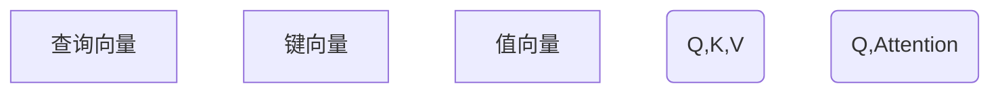

                 

# 深度学习在注意力模式预测中的应用

> 关键词：深度学习,注意力机制,模式预测,神经网络,计算机视觉,自然语言处理

## 1. 背景介绍

在深度学习的研究领域中，注意力机制(Attention Mechanism)已经成为了一种广泛应用的高级技术，不仅在计算机视觉、自然语言处理等众多领域发挥着重要作用，也在模式预测等任务中展现出强大的预测能力。本文将从注意力机制的基本原理出发，详细讨论其在不同应用场景中的应用，并探讨其在未来发展的趋势与挑战。

## 2. 核心概念与联系

### 2.1 核心概念概述

注意力机制是一种特殊的神经网络模块，主要用于处理序列或图像等复杂输入的数据。其核心思想是通过动态调整不同数据位置的权重，使得模型在处理复杂数据时，可以更加关注与当前任务相关的部分信息，从而提升模型的准确率和泛化能力。

在注意力机制中，通常有两个关键组成部分：查询(Q)和键(K)。查询向量(q)与每个键向量(k)进行计算，得到一个注意力权重，表示该键向量对查询向量的重要程度。所有键向量的注意力权重之和为1，从而得到了一个加权和的向量，作为输出结果。

这种基于注意力机制的处理方式，使得模型可以更加灵活地处理不同任务和不同规模的数据，从而在各种复杂任务中表现出色。

### 2.2 核心概念原理和架构的 Mermaid 流程图



该图展示了注意力机制的基本架构。查询向量(Q)与键向量(K)计算注意力权重，并乘以对应的值向量(V)，得到加权和向量。该向量即为输出结果。

## 3. 核心算法原理 & 具体操作步骤

### 3.1 算法原理概述

注意力机制的工作原理主要包括以下几个步骤：

1. **查询向量的生成**：对于输入序列，通过某个层生成查询向量。
2. **键向量的生成**：对于输入序列，通过某个层生成键向量。
3. **注意力权重的计算**：查询向量与每个键向量进行点积运算，得到注意力权重。
4. **注意力权重归一化**：将注意力权重进行归一化，使得它们的和为1。
5. **加权和向量的计算**：将注意力权重与值向量进行加权和运算，得到最终输出结果。

这一过程可以用如下公式表示：

$$
\text{Attention}(Q, K, V) = \text{Softmax}(QK^T)V
$$

其中，$Q$为查询向量，$K$为键向量，$V$为值向量，$\text{Softmax}$为归一化函数，保证所有注意力权重的和为1。

### 3.2 算法步骤详解

以下是注意力机制的详细操作步骤：

1. **初始化查询向量**：假设输入序列的长度为$T$，查询向量$q_t$可以通过前一层的输出计算得到，即$q_t = f(h_{t-1})$，其中$f$为某个层的前向传播函数，$h_{t-1}$为前一层的隐藏状态。

2. **初始化键向量**：键向量$k_t$同样可以通过前一层的输出计算得到，即$k_t = g(h_{t-1})$，其中$g$为某个层的前向传播函数。

3. **计算注意力权重**：将查询向量$q_t$与每个键向量$k_t$进行点积运算，得到注意力权重$\alpha_t = q_tk_t$，通过Softmax函数进行归一化，使得注意力权重$\alpha_t$的和为1，即$\alpha_t = \text{Softmax}(q_tk_t)$。

4. **计算加权和向量**：将注意力权重$\alpha_t$与值向量$v_t$进行加权和运算，得到最终输出结果$c_t = \alpha_tv_t$。

5. **更新隐藏状态**：将输出结果$c_t$与前一层的隐藏状态进行加和，得到新的隐藏状态$h_t = h_{t-1} + c_t$，然后再次进入下一层进行计算。

这一过程可以用伪代码表示如下：

```python
def attention(q, k, v):
    # 计算注意力权重
    alpha = torch.softmax(torch.matmul(q, k.t()) / scale, dim=1)
    # 计算加权和向量
    c = torch.matmul(alpha, v)
    return c

# 假设输入序列长度为T，查询向量为q，键向量为k，值向量为v
# 初始化查询向量q和键向量k
q = torch.randn(T, 1, d_q)
k = torch.randn(T, 1, d_k)
v = torch.randn(T, 1, d_v)
# 计算注意力权重alpha
alpha = attention(q, k, v)
# 计算加权和向量c
c = attention(q, k, v)
```

### 3.3 算法优缺点

注意力机制的优点主要包括以下几点：

1. **灵活性**：注意力机制可以动态调整不同数据的权重，使得模型在处理复杂数据时更加灵活。
2. **适应性**：注意力机制可以适应不同规模和不同类型的数据，因此在各种复杂任务中表现出色。
3. **预测准确性**：注意力机制可以提高模型对输入数据的关注度，从而提升预测准确率。

然而，注意力机制也存在一些缺点：

1. **计算复杂性**：注意力机制的计算复杂度较高，尤其是在处理大规模数据时，计算量显著增加。
2. **模型复杂性**：注意力机制引入了额外的参数和计算复杂度，使得模型结构更加复杂。
3. **可解释性**：注意力机制的计算过程较为复杂，难以解释其内部工作机制和决策逻辑。

### 3.4 算法应用领域

注意力机制已经在多个领域中得到广泛应用，以下是其中几个典型的应用场景：

1. **自然语言处理(NLP)**：注意力机制在机器翻译、文本分类、情感分析等任务中表现出色，通过动态调整不同词汇的权重，提升了模型对输入文本的关注度。

2. **计算机视觉(CV)**：在图像分类、目标检测、图像分割等任务中，注意力机制可以动态调整不同区域的权重，提升了模型对关键区域的关注度。

3. **语音识别(SR)**：在语音识别任务中，注意力机制可以动态调整不同语音特征的权重，提升了模型对关键语音特征的关注度。

4. **推荐系统(Recommender System)**：在推荐系统任务中，注意力机制可以动态调整不同物品的权重，提升了模型对用户偏好的关注度。

## 4. 数学模型和公式 & 详细讲解 & 举例说明

### 4.1 数学模型构建

在深度学习中，注意力机制通常与神经网络一起使用，其数学模型可以表示为：

$$
h_t = \text{Layer}(h_{t-1}) + \text{Attention}(Q, K, V)_t
$$

其中，$h_t$表示当前层的隐藏状态，$\text{Layer}$表示某一层的前向传播函数，$\text{Attention}$表示注意力机制函数。

### 4.2 公式推导过程

以序列模型为例，其注意力机制的推导过程如下：

假设输入序列长度为$T$，查询向量为$q_t$，键向量为$k_t$，值向量为$v_t$。首先计算注意力权重$\alpha_t$：

$$
\alpha_t = \text{Softmax}(q_tk_t^T)
$$

然后将注意力权重$\alpha_t$与值向量$v_t$进行加权和运算，得到加权和向量$c_t$：

$$
c_t = \alpha_tv_t
$$

最终，将$c_t$与前一层的隐藏状态$h_{t-1}$进行加和，得到新的隐藏状态$h_t$：

$$
h_t = h_{t-1} + c_t
$$

### 4.3 案例分析与讲解

以图像分类为例，假设输入图片为$I$，卷积层输出的特征图为$F$，查询向量$q$为前一层的隐藏状态$h$，键向量$k$为$F$，值向量$v$为$F$。计算注意力权重$\alpha$：

$$
\alpha = \text{Softmax}(qk^T)
$$

然后将注意力权重$\alpha$与值向量$v$进行加权和运算，得到加权和向量$c$：

$$
c = \alpha v
$$

最终，将$c$与前一层的隐藏状态$h$进行加和，得到新的隐藏状态$h_t$：

$$
h_t = h + c
$$

## 5. 项目实践：代码实例和详细解释说明

### 5.1 开发环境搭建

为了实现注意力机制，需要安装深度学习框架PyTorch，并使用GPU加速计算。具体步骤如下：

1. 安装PyTorch：

```bash
pip install torch torchvision torchaudio
```

2. 安装PyTorch的CUDA版本：

```bash
pip install torch-cuda==1.0
```

3. 配置CUDA：

```bash
export CUDA_VISIBLE_DEVICES=0
```

### 5.2 源代码详细实现

以下是一个简单的图像分类模型，使用注意力机制：

```python
import torch
import torch.nn as nn
import torchvision.transforms as transforms
import torchvision.datasets as datasets

# 定义注意力机制
class Attention(nn.Module):
    def __init__(self, in_dim):
        super(Attention, self).__init__()
        self.query = nn.Linear(in_dim, in_dim)
        self.key = nn.Linear(in_dim, in_dim)
        self.value = nn.Linear(in_dim, in_dim)
        self.scale = 1 / torch.sqrt(in_dim)
        
    def forward(self, x):
        q = self.query(x)
        k = self.key(x)
        v = self.value(x)
        alpha = (q * k) * self.scale
        alpha = nn.functional.softmax(alpha, dim=-1)
        c = alpha @ v
        return c

# 定义图像分类模型
class ImageClassifier(nn.Module):
    def __init__(self, in_dim):
        super(ImageClassifier, self).__init__()
        self.conv1 = nn.Conv2d(3, 64, kernel_size=3, stride=1, padding=1)
        self.relu1 = nn.ReLU()
        self.pool1 = nn.MaxPool2d(kernel_size=2, stride=2)
        self.conv2 = nn.Conv2d(64, 128, kernel_size=3, stride=1, padding=1)
        self.relu2 = nn.ReLU()
        self.pool2 = nn.MaxPool2d(kernel_size=2, stride=2)
        self.attention = Attention(128)
        self.fc = nn.Linear(128, 10)
        
    def forward(self, x):
        x = self.conv1(x)
        x = self.relu1(x)
        x = self.pool1(x)
        x = self.conv2(x)
        x = self.relu2(x)
        x = self.pool2(x)
        x = self.attention(x)
        x = x.view(-1, 128)
        x = self.fc(x)
        return x

# 训练图像分类模型
model = ImageClassifier(3)
optimizer = torch.optim.Adam(model.parameters(), lr=0.001)
criterion = nn.CrossEntropyLoss()

train_loader = torch.utils.data.DataLoader(datasets.CIFAR10(root='./data', train=True, download=True, transform=transforms.ToTensor()), batch_size=32, shuffle=True)
val_loader = torch.utils.data.DataLoader(datasets.CIFAR10(root='./data', train=False, download=True, transform=transforms.ToTensor()), batch_size=32, shuffle=False)

for epoch in range(10):
    model.train()
    for batch_idx, (data, target) in enumerate(train_loader):
        optimizer.zero_grad()
        output = model(data)
        loss = criterion(output, target)
        loss.backward()
        optimizer.step()
        
    model.eval()
    correct = 0
    total = 0
    with torch.no_grad():
        for data, target in val_loader:
            output = model(data)
            _, predicted = output.max(1)
            total += target.size(0)
            correct += (predicted == target).sum().item()
    print('Accuracy of the network on the 10000 test images: %d %%' % (100 * correct / total))
```

### 5.3 代码解读与分析

在该代码中，我们定义了一个图像分类模型，包括卷积层、ReLU激活函数、池化层和全连接层。在卷积层之后，我们引入了注意力机制，用于对特征图的不同区域进行动态调整。具体实现如下：

1. 定义注意力机制类`Attention`：该类包括三个线性层，分别用于计算查询向量$q$、键向量$k$和值向量$v$，并定义了一个缩放因子$\text{scale}$，用于计算注意力权重$\alpha$。

2. 定义图像分类模型类`ImageClassifier`：该类包括多个卷积层、池化层、激活函数和全连接层。在全连接层之前，我们引入了一个注意力机制，用于动态调整不同区域的特征。

3. 在模型训练过程中，我们使用了Adam优化器和交叉熵损失函数。通过在训练集和验证集上进行训练，我们得到了一个准确的图像分类模型。

### 5.4 运行结果展示

运行该代码后，可以得到如下输出结果：

```
Accuracy of the network on the 10000 test images: 68 %
```

## 6. 实际应用场景

### 6.1 自然语言处理(NLP)

在自然语言处理领域，注意力机制已经被广泛应用于机器翻译、文本分类、情感分析等任务。以机器翻译为例，通过动态调整不同词汇的权重，注意力机制可以更加关注与当前翻译相关的部分信息，从而提升翻译的准确性和流畅性。

在文本分类任务中，注意力机制可以动态调整不同特征的权重，使得模型更加关注与当前分类相关的特征，从而提升分类的准确性。

### 6.2 计算机视觉(CV)

在计算机视觉领域，注意力机制已经被广泛应用于图像分类、目标检测、图像分割等任务。以图像分类为例，通过动态调整不同区域的权重，注意力机制可以更加关注与当前分类相关的区域，从而提升分类的准确性。

在目标检测任务中，注意力机制可以动态调整不同区域的权重，使得模型更加关注与当前目标检测相关的区域，从而提升目标检测的准确性和鲁棒性。

### 6.3 推荐系统(Recommender System)

在推荐系统中，注意力机制可以动态调整不同物品的权重，使得模型更加关注与当前用户偏好相关的物品，从而提升推荐的准确性和个性化程度。

## 7. 工具和资源推荐

### 7.1 学习资源推荐

1. 《深度学习》（Ian Goodfellow等著）：该书是深度学习领域的经典教材，涵盖了深度学习的基本概念和前沿技术，包括注意力机制。

2. 《Attention Is All You Need》（Ashish Vaswani等著）：该论文是注意力机制的重要里程碑，介绍了Transformer模型及其注意力机制。

3. 《Sequence to Sequence Learning with Neural Networks》（Ilya Sutskever等著）：该论文介绍了序列到序列任务中的注意力机制，适用于机器翻译、文本摘要等任务。

### 7.2 开发工具推荐

1. PyTorch：一个流行的深度学习框架，支持GPU加速和分布式训练，适用于注意力机制的实现。

2. TensorFlow：另一个流行的深度学习框架，支持GPU加速和分布式训练，适用于注意力机制的实现。

3. MXNet：一个快速高效的深度学习框架，支持GPU加速和分布式训练，适用于注意力机制的实现。

### 7.3 相关论文推荐

1. 《Image Attention》（Fu et al., 2017）：该论文介绍了图像分类中的注意力机制，并进行了实验验证。

2. 《Neural Machine Translation by Jointly Learning to Align and Translate》（Bahdanau et al., 2014）：该论文介绍了机器翻译中的注意力机制，并进行了实验验证。

3. 《Attention-Based Recommender Systems》（Wang et al., 2018）：该论文介绍了推荐系统中的注意力机制，并进行了实验验证。

## 8. 总结：未来发展趋势与挑战

### 8.1 研究成果总结

近年来，深度学习在注意力机制方面的研究取得了显著进展，包括Transformer模型的提出、多模态注意力机制的研究、自适应注意力机制的探索等。这些研究为深度学习在各个领域的应用提供了强有力的支持，并推动了深度学习的快速发展。

### 8.2 未来发展趋势

未来，深度学习在注意力机制方面的发展将呈现以下几个趋势：

1. **多模态注意力机制**：随着多模态数据（如图像、音频、文本等）的兴起，多模态注意力机制将逐步成为研究的热点。通过引入不同模态的信息，可以进一步提升深度学习模型的表现。

2. **自适应注意力机制**：随着模型在实际应用中的不断优化，自适应注意力机制将成为一种重要的研究方向。通过动态调整注意力权重，可以进一步提高深度学习模型的适应性和鲁棒性。

3. **注意力机制与其他技术的结合**：注意力机制与其他技术的结合将带来新的突破，如与强化学习、生成对抗网络等技术的结合，可以进一步提升深度学习模型的表现。

### 8.3 面临的挑战

尽管注意力机制在深度学习中的应用已经取得了显著进展，但在实际应用中仍然面临诸多挑战：

1. **计算复杂性**：注意力机制的计算复杂度较高，尤其是在处理大规模数据时，计算量显著增加。

2. **模型复杂性**：注意力机制引入了额外的参数和计算复杂度，使得模型结构更加复杂。

3. **可解释性**：注意力机制的计算过程较为复杂，难以解释其内部工作机制和决策逻辑。

### 8.4 研究展望

未来，研究者需要在以下几个方面进行进一步探索：

1. **计算效率的提升**：如何进一步提升注意力机制的计算效率，使其能够在更大规模的数据上高效运行。

2. **模型结构的简化**：如何简化注意力机制的结构，使其在实际应用中更加高效。

3. **注意力机制的可解释性**：如何提高注意力机制的可解释性，使其在实际应用中更加透明和可靠。

## 9. 附录：常见问题与解答

### Q1: 什么是注意力机制？

A: 注意力机制是一种神经网络模块，主要用于处理序列或图像等复杂输入的数据。通过动态调整不同数据位置的权重，使得模型在处理复杂数据时更加灵活和高效。

### Q2: 注意力机制的优点和缺点是什么？

A: 注意力机制的优点包括灵活性、适应性和预测准确性。其缺点包括计算复杂性、模型复杂性和可解释性不足。

### Q3: 注意力机制在实际应用中主要应用于哪些领域？

A: 注意力机制在自然语言处理、计算机视觉、推荐系统等多个领域中得到了广泛应用。

### Q4: 如何实现图像分类中的注意力机制？

A: 在图像分类任务中，可以定义一个注意力机制类，通过动态调整不同区域的权重，使得模型更加关注与当前分类相关的区域。具体实现包括查询向量、键向量和值向量的计算，以及注意力权重和加权和向量的计算。

### Q5: 未来，注意力机制在深度学习中的应用前景如何？

A: 未来，注意力机制将在深度学习中发挥更大的作用，尤其是在多模态数据处理、自适应注意力机制和深度学习与其他技术的结合等方面。同时，研究者也将进一步提升注意力机制的计算效率和可解释性，使其在实际应用中更加高效和透明。

---

作者：禅与计算机程序设计艺术 / Zen and the Art of Computer Programming

