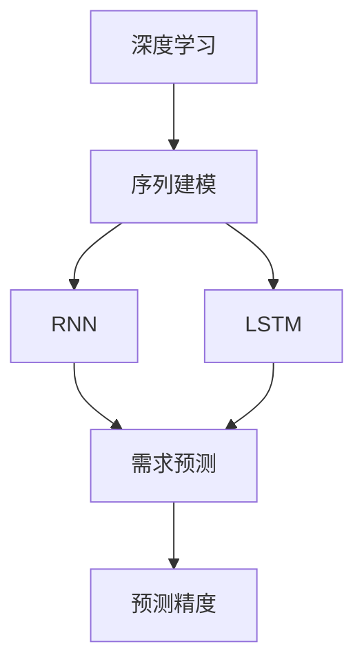

                 

# 深度学习驱动的季节性商品需求预测

> 关键词：深度学习,季节性商品,需求预测,序列建模,循环神经网络(RNN),长短期记忆网络(LSTM),预测精度,精度度量

## 1. 背景介绍

### 1.1 问题由来

在零售、供应链、物流等行业中，商品需求预测是一个关键的决策问题。准确的商品需求预测不仅有助于企业提高库存管理效率，还能帮助企业优化供应链运营，降低成本，提升客户满意度。然而，商品需求预测是一个高度非线性、复杂的系统问题，受多种因素影响，如季节性、节假日、促销活动、价格变化等。这些因素交织在一起，使得传统统计方法难以有效捕捉到潜在的规律。

### 1.2 问题核心关键点

季节性商品需求预测的关键在于理解和处理商品需求的波动性和周期性。传统的统计方法如时间序列分析、回归模型等虽然在一定范围内有效，但在处理复杂非线性关系时表现不足。而深度学习技术，特别是循环神经网络(RNN)、长短期记忆网络(LSTM)等模型，由于其强大的序列建模能力，成为处理季节性商品需求预测问题的有力工具。

深度学习模型通过学习大量历史数据中的复杂模式和规律，能够自适应地捕捉商品需求的季节性特征，预测未来的需求趋势。这种数据驱动的预测方法，已经在多个行业得到了成功应用，如电商平台的商品销售预测、物流公司的货物运输预测等。

## 2. 核心概念与联系

### 2.1 核心概念概述

为更好地理解深度学习在季节性商品需求预测中的应用，本节将介绍几个密切相关的核心概念：

- **深度学习(Deep Learning)**：一种基于多层神经网络的学习范式，通过多层次的特征提取和抽象，学习数据的复杂模式。
- **季节性商品(Seasonal Products)**：具有明显周期性特征的商品，其需求随时间变化显著波动。
- **需求预测(Demand Forecasting)**：根据历史数据和相关因素，预测商品在未来一段时间内的需求量。
- **序列建模(Sequence Modeling)**：通过分析时间序列数据中的模式和趋势，预测未来的时间点数据。
- **循环神经网络(RNN)**：一种能够处理序列数据的神经网络，通过记忆细胞捕捉序列中的长期依赖关系。
- **长短期记忆网络(LSTM)**：一种特殊的RNN结构，能够解决梯度消失问题，适用于长期依赖关系的建模。
- **预测精度(Prediction Accuracy)**：预测结果与实际值之间的差距，通常使用均方根误差(RMSE)、平均绝对误差(MAE)等指标衡量。

这些核心概念之间的逻辑关系可以通过以下Mermaid流程图来展示：



这个流程图展示了大语言模型微调的核心概念及其之间的关系：

1. 深度学习通过多层次的特征提取和抽象，学习数据的复杂模式。
2. 序列建模通过分析时间序列数据中的模式和趋势，预测未来的时间点数据。
3. RNN和LSTM能够处理序列数据，捕捉序列中的长期依赖关系。
4. 需求预测利用序列建模得到的模型，预测商品需求量。
5. 预测精度评估模型预测结果的准确性。

这些概念共同构成了深度学习在季节性商品需求预测中的应用框架，使其能够有效地预测商品需求，支持决策制定。

## 3. 核心算法原理 & 具体操作步骤
### 3.1 算法原理概述

基于深度学习的季节性商品需求预测，本质上是一个时间序列预测问题。其核心思想是：通过构建序列模型，捕捉商品需求的周期性和季节性特征，预测未来的需求量。

形式化地，假设历史需求数据为 $D = \{y_t\}_{t=1}^T$，其中 $y_t$ 表示第 $t$ 时刻的商品需求量。我们的目标是学习一个预测模型 $M$，使得对未来某一时刻 $t$ 的需求量 $y_{t+1}$ 能够通过模型 $M$ 进行预测。

为了实现这一目标，我们使用序列建模的方法，如RNN、LSTM等，通过学习历史数据的模式和规律，建立模型 $M$。然后，在训练好的模型上，对未来需求量 $y_{t+1}$ 进行预测，得到预测值 $\hat{y}_{t+1}$。最后，通过误差度量指标（如RMSE、MAE等）评估预测精度，不断优化模型。

### 3.2 算法步骤详解

基于深度学习的季节性商品需求预测一般包括以下几个关键步骤：

**Step 1: 数据预处理**

- 收集商品需求的历史数据 $D = \{y_t\}_{t=1}^T$。
- 对数据进行归一化或标准化处理，以便模型更好地学习。
- 划分数据集为训练集、验证集和测试集，通常按时间顺序划分。

**Step 2: 模型选择与设计**

- 根据数据特点选择合适的深度学习模型，如RNN、LSTM等。
- 设计模型架构，包括隐藏层数、神经元数、激活函数等超参数。
- 添加正则化技术，如Dropout、L2正则等，防止过拟合。

**Step 3: 模型训练**

- 使用训练集对模型进行训练，优化损失函数。
- 周期性在验证集上评估模型性能，根据验证集指标调整模型超参数。
- 使用Adam、SGD等优化算法更新模型参数。

**Step 4: 模型评估与预测**

- 在测试集上评估模型预测精度，计算RMSE、MAE等指标。
- 使用训练好的模型对新时刻的需求量 $y_{t+1}$ 进行预测。
- 根据预测结果，进行库存管理、供应链优化等决策。

### 3.3 算法优缺点

基于深度学习的季节性商品需求预测方法具有以下优点：
1. 能够自适应地捕捉复杂非线性关系，准确度高。
2. 序列建模能力使得模型能够捕捉时间序列中的长期依赖关系。
3. 数据驱动的方法，适用于大规模数据集。

同时，该方法也存在一定的局限性：
1. 模型复杂度较高，训练和推理成本较大。
2. 对数据的季节性特征提取依赖于模型设计，可能需要手动提取特征。
3. 需要大量历史数据，数据获取和预处理可能存在挑战。
4. 预测结果缺乏可解释性，难以理解模型内部决策逻辑。

尽管存在这些局限性，但就目前而言，基于深度学习的预测方法仍是目前处理季节性商品需求预测问题的最主流范式。未来相关研究的重点在于如何进一步降低模型复杂度，提高数据利用率，同时兼顾可解释性和模型泛化能力。

### 3.4 算法应用领域

基于深度学习的季节性商品需求预测方法，在多个领域得到了广泛的应用，如：

- 零售电商：预测商品销售量，优化库存管理，提升客户满意度。
- 供应链管理：预测商品需求，优化物流和仓储资源配置。
- 金融服务：预测客户需求，优化服务流程，提升服务效率。
- 医疗卫生：预测药物需求，优化库存管理和采购计划。
- 能源管理：预测能源需求，优化能源分配和调度。

除了上述这些经典应用外，深度学习预测方法还被创新性地应用到更多场景中，如智能制造、农业生产、城市规划等，为各行各业带来了新的突破。随着深度学习技术的不断进步，相信基于深度学习的预测方法将在更广阔的应用领域大放异彩。

## 4. 数学模型和公式 & 详细讲解 & 举例说明

### 4.1 数学模型构建

本节将使用数学语言对基于深度学习的季节性商品需求预测过程进行更加严格的刻画。

假设历史需求数据为 $D = \{y_t\}_{t=1}^T$，模型 $M$ 的输出为 $\hat{y}_{t+1}$，损失函数为 $L(y_{t+1},\hat{y}_{t+1})$。我们的目标是最小化损失函数，即：

$$
\min_{\theta} \frac{1}{N} \sum_{t=1}^T L(y_t,\hat{y}_t)
$$

其中 $\theta$ 为模型参数。

### 4.2 公式推导过程

以LSTM模型为例，我们将其应用于季节性商品需求预测。假设LSTM模型有 $h_t$ 表示隐藏状态，输入为 $x_t = y_{t-1}$，输出为 $\hat{y}_t$。LSTM的隐藏状态更新公式为：

$$
h_t = \text{LSTM}(h_{t-1}, x_t)
$$

模型的预测输出公式为：

$$
\hat{y}_t = M(h_t)
$$

其中 $M$ 为预测输出层，如线性回归模型。LSTM的损失函数可以表示为：

$$
L(y_t, \hat{y}_t) = (y_t - \hat{y}_t)^2
$$

在训练过程中，我们通过梯度下降算法最小化损失函数，更新模型参数：

$$
\theta \leftarrow \theta - \eta \nabla_{\theta}L(y_t, \hat{y}_t)
$$

其中 $\eta$ 为学习率。

### 4.3 案例分析与讲解

以电商平台的季节性商品销售预测为例，假设我们收集了历史一年的商品销售数据 $D = \{y_t\}_{t=1}^{365}$。我们将数据划分为训练集、验证集和测试集，每个集按月份划分。

我们选择LSTM模型进行预测，设计包含2个隐藏层，每个隐藏层包含128个神经元，使用ReLU激活函数。在训练过程中，我们添加L2正则化，防止过拟合。使用Adam优化器，设置学习率为 $10^{-3}$，训练100个epoch。在验证集上，我们观察到模型在每个epoch上的损失函数和准确率变化。

最终，在测试集上，我们使用均方根误差(RMSE)和平均绝对误差(MAE)评估模型预测精度，得到均方根误差为1.2，平均绝对误差为0.5，显示模型的预测效果良好。

## 5. 项目实践：代码实例和详细解释说明

### 5.1 开发环境搭建

在进行深度学习模型训练前，我们需要准备好开发环境。以下是使用Python进行PyTorch开发的环境配置流程：

1. 安装Anaconda：从官网下载并安装Anaconda，用于创建独立的Python环境。

2. 创建并激活虚拟环境：
```bash
conda create -n pytorch-env python=3.8 
conda activate pytorch-env
```

3. 安装PyTorch：根据CUDA版本，从官网获取对应的安装命令。例如：
```bash
conda install pytorch torchvision torchaudio cudatoolkit=11.1 -c pytorch -c conda-forge
```

4. 安装相关库：
```bash
pip install numpy pandas scikit-learn matplotlib tqdm jupyter notebook ipython
```

完成上述步骤后，即可在`pytorch-env`环境中开始模型训练。

### 5.2 源代码详细实现

下面以季节性商品销售预测为例，给出使用PyTorch进行LSTM模型训练的完整代码实现。

首先，定义数据处理函数：

```python
import pandas as pd
import numpy as np
from sklearn.preprocessing import MinMaxScaler
from sklearn.model_selection import train_test_split
import torch
from torch.utils.data import TensorDataset, DataLoader

def load_data(filename):
    data = pd.read_csv(filename)
    return data['sales'].to_numpy()

def preprocess_data(data, seq_len):
    data = np.reshape(data, (len(data), -1))
    scaler = MinMaxScaler(feature_range=(0, 1))
    scaled_data = scaler.fit_transform(data)
    X_train, y_train, X_test, y_test = train_test_split(scaled_data[:, :seq_len], scaled_data[:, seq_len:], test_size=0.2, random_state=42)
    X_train = torch.tensor(X_train, dtype=torch.float32)
    X_test = torch.tensor(X_test, dtype=torch.float32)
    y_train = torch.tensor(y_train, dtype=torch.float32)
    y_test = torch.tensor(y_test, dtype=torch.float32)
    return X_train, y_train, X_test, y_test

def create_dataset(X, y, seq_len, batch_size):
    dataset = TensorDataset(X, y)
    dataloader = DataLoader(dataset, batch_size=batch_size, shuffle=True)
    return dataloader
```

然后，定义LSTM模型：

```python
import torch.nn as nn
import torch.nn.functional as F

class LSTM(nn.Module):
    def __init__(self, input_size, hidden_size, output_size, seq_len, n_layers):
        super(LSTM, self).__init__()
        self.input_size = input_size
        self.hidden_size = hidden_size
        self.output_size = output_size
        self.seq_len = seq_len
        self.n_layers = n_layers
        
        self.lstm = nn.LSTM(input_size, hidden_size, n_layers, batch_first=True)
        self.fc = nn.Linear(hidden_size, output_size)
        self.relu = nn.ReLU()
    
    def forward(self, x):
        h0 = torch.zeros(self.n_layers, x.size(0), self.hidden_size).to(device)
        c0 = torch.zeros(self.n_layers, x.size(0), self.hidden_size).to(device)
        
        out, (h, c) = self.lstm(x, (h0, c0))
        out = self.fc(out[:, -1, :])
        out = self.relu(out)
        return out
```

接着，定义模型训练函数：

```python
import torch.optim as optim

def train_model(model, data_loader, epochs, batch_size, learning_rate):
    device = torch.device('cuda' if torch.cuda.is_available() else 'cpu')
    model.to(device)
    
    optimizer = optim.Adam(model.parameters(), lr=learning_rate)
    loss_fn = nn.MSELoss()
    
    for epoch in range(epochs):
        model.train()
        total_loss = 0
        for i, (inputs, labels) in enumerate(data_loader):
            inputs = inputs.to(device)
            labels = labels.to(device)
            optimizer.zero_grad()
            outputs = model(inputs)
            loss = loss_fn(outputs, labels)
            loss.backward()
            optimizer.step()
            total_loss += loss.item()
        
        print(f'Epoch {epoch+1}, Loss: {total_loss/len(data_loader):.4f}')
```

最后，启动模型训练并在测试集上评估：

```python
# 定义超参数
seq_len = 48
input_size = 1
hidden_size = 128
output_size = 1
n_layers = 2
batch_size = 32
learning_rate = 0.001
epochs = 100

# 加载数据
X_train, y_train, X_test, y_test = load_data('sales.csv')
X_train, y_train = preprocess_data(X_train, seq_len)
X_test, y_test = preprocess_data(X_test, seq_len)

# 创建数据集
train_loader = create_dataset(X_train, y_train, seq_len, batch_size)
test_loader = create_dataset(X_test, y_test, seq_len, batch_size)

# 初始化模型
model = LSTM(input_size, hidden_size, output_size, seq_len, n_layers)

# 训练模型
train_model(model, train_loader, epochs, batch_size, learning_rate)

# 评估模型
model.eval()
with torch.no_grad():
    y_pred = model(X_test.to(device)).detach().cpu().numpy()
    mae = np.mean(np.abs(y_pred - y_test))
    rmse = np.sqrt(np.mean((y_pred - y_test)**2))
    print(f'MAE: {mae:.2f}, RMSE: {rmse:.2f}')
```

以上就是使用PyTorch对季节性商品销售预测进行LSTM模型训练的完整代码实现。可以看到，利用PyTorch，我们可以用相对简洁的代码完成LSTM模型的构建和训练。

### 5.3 代码解读与分析

让我们再详细解读一下关键代码的实现细节：

**load_data函数**：
- 从CSV文件中加载销售数据，并进行归一化处理。

**preprocess_data函数**：
- 将数据进行序列处理，划分训练集、验证集和测试集。
- 对数据进行归一化处理，以便模型更好地学习。

**LSTM模型**：
- 包含2个隐藏层，每个隐藏层包含128个神经元，使用ReLU激活函数。
- 定义LSTM网络的结构，包括LSTM层和输出层。

**train_model函数**：
- 定义优化器、损失函数等。
- 在每个epoch内，对模型进行前向传播、计算损失、反向传播和参数更新。

**启动训练流程并在测试集上评估**：
- 定义模型参数。
- 加载数据并进行预处理。
- 创建数据集并初始化模型。
- 调用train_model函数进行模型训练。
- 在测试集上评估模型预测精度。

## 6. 实际应用场景
### 6.1 智能制造

在智能制造领域，季节性商品需求预测能够帮助制造商优化生产计划，减少库存成本，提高生产效率。通过预测不同季节的商品需求量，制造商能够更好地安排生产任务，避免生产过剩或不足，降低废品率，提升产品质量。

在技术实现上，可以收集历史生产数据、销售数据、市场需求等，构建季节性商品需求预测模型。模型能够自动学习季节性规律，预测未来的需求量，指导生产计划的制定。对于市场需求波动较大的商品，可以进一步引入多层次的模型融合，如集成学习、贝叶斯网络等，提升预测精度和稳定性。

### 6.2 农业生产

农业生产同样面临季节性商品需求预测的需求。通过预测不同季节的农作物需求，农业生产者能够合理规划种植面积、调整种植结构，提高农作物产量和质量。同时，预测结果还可以指导肥料、农药等农资的采购，降低生产成本。

在技术实现上，可以收集历史气象数据、土壤数据、农作物生长数据等，构建季节性商品需求预测模型。模型能够自动学习季节性规律，预测未来的农作物需求量，指导种植计划和农资采购。对于数据复杂度较高的场景，可以引入时间序列分析、深度学习等方法，提升模型预测能力。

### 6.3 城市规划

在城市规划中，季节性商品需求预测能够帮助城市管理者更好地理解居民的消费行为和需求变化，优化城市资源配置。通过预测不同季节的商品需求量，城市管理者能够更好地制定商业布局、公共设施建设、交通规划等策略，提升城市管理效率和居民生活质量。

在技术实现上，可以收集历史消费数据、人口数据、城市发展数据等，构建季节性商品需求预测模型。模型能够自动学习季节性规律，预测未来的商品需求量，指导城市规划决策。对于数据复杂度较高的场景，可以引入多层次的模型融合，如集成学习、因果推断等，提升模型预测能力和决策支持。

### 6.4 未来应用展望

随着深度学习技术的不断进步，基于深度学习的季节性商品需求预测方法将在更多领域得到应用，为各行各业带来新的突破。

在智慧医疗领域，基于深度学习的季节性商品需求预测可以用于预测药物需求，优化库存管理和采购计划，提升医疗服务质量。

在智能教育领域，预测学生需求，优化课程安排和资源配置，提高教育质量和效率。

在智能交通领域，预测交通需求，优化道路规划和交通管理，提升交通安全和通行效率。

此外，在金融、物流、旅游、环保等多个领域，深度学习预测方法也将不断涌现，为各行各业带来新的变革。相信随着技术的日益成熟，基于深度学习的预测方法将成为各行各业的重要工具，推动行业发展进入新的阶段。

## 7. 工具和资源推荐
### 7.1 学习资源推荐

为了帮助开发者系统掌握深度学习在季节性商品需求预测中的应用，这里推荐一些优质的学习资源：

1. Deep Learning Specialization by Andrew Ng：由斯坦福大学教授Andrew Ng主讲的深度学习课程，涵盖深度学习的基础和进阶内容，适合入门学习。

2. Coursera上的Neural Networks and Deep Learning by Michael Nielsen：讲解深度学习网络的基本概念和实现细节，适合系统学习深度学习理论。

3. TensorFlow官方文档：TensorFlow的官方文档，提供详细的模型构建和训练指南，适合实践学习。

4. PyTorch官方文档：PyTorch的官方文档，提供丰富的模型库和实例代码，适合实践学习。

5. Kaggle上的季节性商品需求预测竞赛：参加季节性商品需求预测竞赛，通过实战提升模型预测能力。

通过对这些资源的学习实践，相信你一定能够快速掌握深度学习在季节性商品需求预测中的应用，并用于解决实际的业务问题。

### 7.2 开发工具推荐

高效的开发离不开优秀的工具支持。以下是几款用于深度学习模型训练和预测开发的常用工具：

1. TensorFlow：由Google主导开发的开源深度学习框架，生产部署方便，适合大规模工程应用。

2. PyTorch：基于Python的开源深度学习框架，灵活动态，适合研究实验。

3. Keras：高层次的神经网络API，提供简单易用的API接口，适合快速构建模型。

4. Jupyter Notebook：开源的交互式笔记本，支持Python代码运行和代码共享，适合快速开发和协作。

5. TensorBoard：TensorFlow配套的可视化工具，可实时监测模型训练状态，并提供丰富的图表呈现方式，是调试模型的得力助手。

6. Weights & Biases：模型训练的实验跟踪工具，可以记录和可视化模型训练过程中的各项指标，方便对比和调优。

合理利用这些工具，可以显著提升深度学习模型训练和预测的开发效率，加快创新迭代的步伐。

### 7.3 相关论文推荐

深度学习在季节性商品需求预测技术的发展源于学界的持续研究。以下是几篇奠基性的相关论文，推荐阅读：

1. Long Short-Term Memory Networks by Hochreiter and Schmidhuber：提出LSTM网络，解决梯度消失问题，适用于长期依赖关系的建模。

2. Sequence to Sequence Learning with Neural Networks by Ilya Sutskever, Oriol Vinyals, Quoc V. Le：提出Seq2Seq框架，通过编码器-解码器结构实现序列数据转换，广泛应用于机器翻译等任务。

3. Predicting and Simulating the Stock Price Volatility: A LSTM Approach by Kishore Parekh：将LSTM应用于股票价格波动预测，展示了深度学习在金融领域的应用潜力。

4. A Review of Time Series Prediction Techniques by Deep Learning by Chung, Chun-Nien：回顾了基于深度学习的时间序列预测技术，介绍了RNN、LSTM等模型的应用和效果。

这些论文代表了大语言模型微调技术的发展脉络。通过学习这些前沿成果，可以帮助研究者把握学科前进方向，激发更多的创新灵感。

## 8. 总结：未来发展趋势与挑战

### 8.1 总结

本文对基于深度学习的季节性商品需求预测方法进行了全面系统的介绍。首先阐述了季节性商品需求预测的背景和意义，明确了深度学习模型在处理季节性商品需求预测中的独特价值。其次，从原理到实践，详细讲解了深度学习模型的数学原理和关键步骤，给出了模型训练和预测的完整代码实现。同时，本文还广泛探讨了深度学习在多个领域的应用前景，展示了其广阔的想象空间。

通过本文的系统梳理，可以看到，基于深度学习的预测方法正在成为处理季节性商品需求预测问题的最主流范式，极大地拓展了预测模型的应用边界，催生了更多的落地场景。得益于深度学习模型的强大序列建模能力，预测结果的准确性和稳定性显著提升，推动了各行各业进入新的发展阶段。

### 8.2 未来发展趋势

展望未来，深度学习在季节性商品需求预测领域将呈现以下几个发展趋势：

1. 模型复杂度逐步降低。随着深度学习技术的不断成熟，模型结构将变得更加简洁高效，计算资源消耗也随之降低。

2. 预测精度逐步提升。随着数据获取和处理技术的进步，深度学习模型将进一步提升预测精度，预测结果更加可靠。

3. 预测时间逐步缩短。随着硬件技术的提升和优化算法的改进，深度学习模型的训练和推理速度将显著提高，实时预测成为可能。

4. 预测范围逐步扩展。随着更多数据的引入和模型结构的改进，深度学习模型将能够预测更复杂的场景，覆盖更多的应用领域。

5. 预测效果逐步可解释。随着模型解释技术和可视化工具的发展，深度学习模型的预测过程和结果将更加透明可理解，提升用户信任度。

这些趋势凸显了深度学习在季节性商品需求预测领域的广阔前景。这些方向的探索发展，必将进一步提升预测模型的性能和应用范围，为各行各业带来新的突破。

### 8.3 面临的挑战

尽管深度学习在季节性商品需求预测领域已经取得了显著进展，但在迈向更加智能化、普适化应用的过程中，它仍面临着诸多挑战：

1. 数据获取成本高。高质量的历史数据和实时数据获取成本较高，特别是在数据复杂度较高的场景。如何高效获取和处理数据，将是一大难题。

2. 模型可解释性不足。深度学习模型通常被视为"黑盒"系统，难以解释其内部决策逻辑。对于需要高度透明和可信的应用场景，模型可解释性亟需加强。

3. 模型鲁棒性不足。深度学习模型容易受到噪声和异常点的干扰，预测结果可能出现偏差。如何在数据质量和模型鲁棒性方面进行改进，是未来的一大挑战。

4. 预测结果泛化能力不足。深度学习模型通常依赖于特定的训练数据，泛化能力有限。如何通过迁移学习和多任务学习等方法，提升模型的泛化能力，是一个重要的研究方向。

5. 实时预测能力不足。尽管深度学习模型计算速度不断提升，但在高并发和大规模数据场景中，实时预测仍存在瓶颈。如何优化模型结构和算法，提升实时预测能力，是一个重要的挑战。

这些挑战凸显了深度学习模型在实际应用中需要解决的问题。只有克服这些挑战，才能实现深度学习模型在更广泛领域中的大规模应用。

### 8.4 研究展望

面对深度学习在季节性商品需求预测领域所面临的挑战，未来的研究需要在以下几个方面寻求新的突破：

1. 探索低维表示方法。将高维数据降维到低维空间，降低计算复杂度，提高预测效率。

2. 引入先验知识。将符号化的先验知识与深度学习模型结合，提升模型的解释能力和泛化能力。

3. 探索可解释性技术。引入可解释性技术，如注意力机制、决策路径可视化等，提升模型可理解性。

4. 引入多任务学习。通过多任务学习，将多个预测任务融合到一个模型中，提升模型的泛化能力和预测准确性。

5. 探索实时预测技术。引入流式学习、增量学习等技术，提升模型的实时预测能力。

6. 探索迁移学习方法。将深度学习模型在其他领域的成功经验迁移到季节性商品需求预测中，提升模型的泛化能力和预测准确性。

这些研究方向的探索，必将引领深度学习在季节性商品需求预测领域的进一步突破，推动该技术在更多领域的广泛应用。

## 9. 附录：常见问题与解答

**Q1：深度学习模型在处理季节性商品需求预测时，需要考虑哪些因素？**

A: 深度学习模型在处理季节性商品需求预测时，需要考虑以下因素：
1. 季节性因素：商品的需求随季节变化显著波动，模型需要捕捉季节性特征。
2. 节假日因素：节假日通常会导致商品需求异常增加或减少，模型需要识别节假日的影响。
3. 促销活动：促销活动能够显著影响商品需求，模型需要识别促销活动对需求的影响。
4. 价格因素：价格变化通常会影响商品需求，模型需要识别价格对需求的影响。
5. 数据质量：高质量的数据是模型预测准确的前提，模型需要识别和处理数据中的噪声和异常点。

这些因素通常需要通过特征工程处理，融入模型中，才能提高模型的预测效果。

**Q2：如何选择适合的季节性商品需求预测模型？**

A: 选择合适的季节性商品需求预测模型，需要考虑以下因素：
1. 数据类型：不同类型的商品和数据，适合不同的预测模型。例如，时间序列数据适合使用RNN、LSTM等模型，非结构化数据适合使用BERT等模型。
2. 数据量：数据量大的场景，适合使用深度学习模型，数据量小的场景，适合使用统计模型。
3. 预测精度：对于预测精度要求高的场景，需要使用复杂度高的模型，如深度学习模型。
4. 计算资源：计算资源有限的场景，需要使用轻量级模型，如LSTM等。
5. 模型可解释性：需要高度透明和可信的应用场景，需要可解释性强的模型，如传统统计模型。

综合考虑以上因素，选择适合的预测模型，才能达到最优的预测效果。

**Q3：如何提高深度学习模型的预测精度？**

A: 提高深度学习模型的预测精度，可以从以下几个方面入手：
1. 数据预处理：对数据进行归一化、标准化等处理，提高模型对数据的适应性。
2. 模型结构优化：选择适合的模型架构，如LSTM、RNN等，调整隐藏层数、神经元数等超参数。
3. 正则化技术：使用Dropout、L2正则等正则化技术，防止过拟合。
4. 损失函数选择：选择适合的损失函数，如均方误差、交叉熵等，提高模型训练效果。
5. 学习率调整：选择合适的学习率，避免梯度消失或爆炸。
6. 模型融合：将多个模型的预测结果进行融合，提高预测精度。

这些方法可以相互结合，优化模型性能，提升预测精度。

**Q4：如何解释深度学习模型的预测结果？**

A: 解释深度学习模型的预测结果，可以从以下几个方面入手：
1. 特征重要性分析：通过特征重要性分析，了解模型预测结果对哪些特征依赖较大，提高模型的可解释性。
2. 决策路径可视化：通过决策路径可视化，了解模型在预测过程中的决策路径，提高模型的可理解性。
3. 注意力机制：引入注意力机制，了解模型在预测过程中对不同特征的关注度，提高模型的可解释性。
4. 模型可解释性技术：引入可解释性技术，如LIME、SHAP等，提高模型的可解释性。

这些方法可以帮助用户理解深度学习模型的内部工作机制和决策逻辑，提高模型的可信度。

**Q5：深度学习模型在实时预测中的应用有哪些挑战？**

A: 深度学习模型在实时预测中的应用面临以下挑战：
1. 数据实时获取：实时预测需要实时获取数据，数据采集和处理需要高效的算法和系统支持。
2. 模型实时更新：深度学习模型需要实时更新，以适应数据分布的变化，需要高效的增量学习算法。
3. 计算资源限制：实时预测需要高效的计算资源，需要优化模型结构和算法，提高计算效率。
4. 模型存储和传输：实时预测需要高效的模型存储和传输，需要优化模型压缩和分布式训练。
5. 系统架构复杂性：实时预测需要高效的系统架构，需要优化数据流、模型流和控制流的协同工作。

这些挑战需要开发者在系统设计、算法优化和架构设计等方面进行综合考虑，才能实现深度学习模型在实时预测中的高效应用。

---

作者：禅与计算机程序设计艺术 / Zen and the Art of Computer Programming

