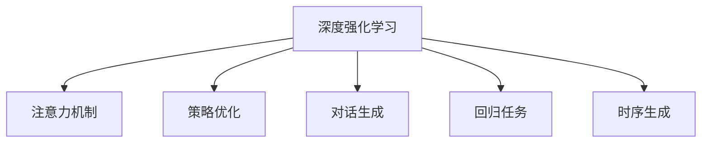

                 

# 深度强化学习在注意力策略优化中的应用

## 1. 背景介绍

### 1.1 问题由来
深度强化学习(Deep Reinforcement Learning, DRL)是当前人工智能(AI)领域最为热门的研究方向之一，它结合了深度学习和强化学习的优势，通过智能体(Agent)与环境的交互，实现最优决策策略的学习。深度强化学习已经在游戏、机器人控制、自动驾驶等多个领域取得了显著成就。

近年来，随着深度学习技术的发展，大模型如BERT、GPT等在自然语言处理(NLP)领域的应用取得了突破性进展。然而，这些大模型虽然在通用语言表示上表现出色，但在特定任务上的性能往往未能发挥到极致。例如，模型在生成对话时，可能无法准确理解对话历史信息，导致生成的回应缺乏连贯性。

在NLP领域，针对这种状况，强化学习策略的引入为解决这一问题提供了新的思路。通过构建强化学习框架，使模型能够从对话历史中学习到更加连贯、上下文相关的回复生成策略，从而显著提升生成对话的质量。

### 1.2 问题核心关键点
在应用深度强化学习策略进行注意力优化时，主要考虑以下关键点：

- 强化学习环境的设计：如何将自然语言处理任务转化为适合强化学习的形式，是环境设计中的核心问题。
- 强化学习模型的构建：选择合适的模型结构和策略优化算法，使得模型能够有效地从对话历史中学习生成策略。
- 奖励函数的定义：奖励函数设计的好坏，直接影响模型的学习效果。奖励函数需要既能够奖励与期望输出相似的生成文本，又能够惩罚与期望输出差异较大的生成文本。
- 样本收集与回放：在训练过程中，如何有效地收集对话数据，并将其回放给模型进行训练，是强化学习任务中的重要环节。

这些问题贯穿于整个注意力策略优化的流程，只有解决好这些问题，才能在NLP任务中充分发挥强化学习策略的作用，提升模型的生成质量。

## 2. 核心概念与联系

### 2.1 核心概念概述

为更好地理解深度强化学习策略在注意力优化中的应用，本节将介绍几个密切相关的核心概念：

- 深度强化学习：一种结合深度学习和强化学习技术，通过智能体与环境的交互，实现最优决策策略的学习。
- 注意力机制(Attention Mechanism)：一种用于模型中信息传递的机制，通过动态权重选择输入中的重要部分，提升模型对关键信息的关注度。
- 强化学习策略优化(Strategy Optimization)：通过强化学习框架，使模型从环境互动中学习到最优的生成策略，从而提升模型在特定任务上的表现。
- 对话生成：一种常见的NLP任务，要求模型根据给定的对话历史，生成合乎语境的回应。
- 回归任务：一类监督学习任务，目标是根据给定输入预测特定输出。
- 时序生成：一种通过模型预测未来时间序列上的事件的任务，如文本生成、语音合成等。

这些核心概念之间的逻辑关系可以通过以下Mermaid流程图来展示：



这个流程图展示了大语言模型微调的各个核心概念及其之间的关系：

1. 深度强化学习是整个流程的驱动力。
2. 注意力机制是一种提升模型关注重要信息的手段。
3. 策略优化是一种通过强化学习框架提升模型生成策略的方法。
4. 对话生成是深度强化学习策略优化的一个重要应用场景。
5. 回归任务和时序生成是模型训练中常见的监督学习任务。

这些概念共同构成了深度强化学习策略优化在大语言模型微调中的基本框架，使其能够在各种场景下发挥强大的语言理解和生成能力。通过理解这些核心概念，我们可以更好地把握深度强化学习策略优化在大语言模型中的应用原理和优化方向。

## 3. 核心算法原理 & 具体操作步骤
### 3.1 算法原理概述

深度强化学习策略优化，本质上是通过强化学习框架，使模型在给定的环境互动中学习最优的生成策略。其核心思想是：将大语言模型视作一个智能体(Agent)，在对话生成环境中通过与环境互动，逐步提升生成策略的效率和准确性。

形式化地，假设大语言模型为 $M_{\theta}$，其中 $\theta$ 为模型参数。对话生成环境的奖励函数为 $r(\cdot)$，表示模型对特定生成文本的奖励。目标是最大化累积奖励的期望值：

$$
\mathbb{E}_{D}[\sum_{t=0}^{T-1} r(a_t, s_t, M_{\theta})]
$$

其中 $D$ 为对话数据集，$T$ 为对话轮数，$a_t$ 为第 $t$ 轮的生成动作，$s_t$ 为第 $t$ 轮的对话状态。

通过梯度上升等优化算法，使模型参数 $\theta$ 不断更新，最终得到最优策略 $\theta^*$。

### 3.2 算法步骤详解

深度强化学习策略优化的大致流程如下：

**Step 1: 设计对话生成环境**

- 定义对话状态空间 $S$：对话中各轮的上下文和当前轮的生成文本。
- 定义动作空间 $A$：模型在当前轮生成的文本。
- 定义奖励函数 $r(a_t, s_t, M_{\theta})$：根据对话历史和当前生成文本，计算模型的奖励。例如，可以奖励与期望回应相似的文本，惩罚语义不一致的文本。

**Step 2: 构建生成策略**

- 选择合适的策略模型，如Transformer等，初始化参数 $\theta$。
- 设置强化学习优化器，如策略梯度方法等，设置学习率等超参数。

**Step 3: 执行策略优化**

- 与对话环境进行多轮互动，通过模型生成文本，得到奖励。
- 根据奖励反馈，使用策略梯度方法更新模型参数 $\theta$。
- 重复上述过程直至收敛或达到预设轮数。

**Step 4: 测试与部署**

- 在测试集上评估优化后的策略模型的性能，对比优化前后的精度提升。
- 使用优化后的策略模型对新对话进行推理预测，集成到实际的应用系统中。

以上是深度强化学习策略优化的大致流程。在实际应用中，还需要针对具体任务的特点，对各个环节进行优化设计，如改进奖励函数，引入更多的正则化技术，搜索最优的超参数组合等，以进一步提升模型性能。

### 3.3 算法优缺点

深度强化学习策略优化在NLP任务中具有以下优点：

1. 动态优化：强化学习策略优化可以在与环境互动的过程中，实时调整生成策略，适应对话历史的变化。
2. 上下文相关：通过引入上下文信息，模型能够更加关注对话历史的语境，生成更加连贯的回应。
3. 可解释性强：强化学习策略优化的过程透明，易于理解和调试。
4. 适用范围广：策略优化方法可以应用于各类NLP任务，如问答、翻译、摘要等。

同时，该方法也存在一定的局限性：

1. 训练成本高：对话数据往往需要人工标注，收集和构建对话数据集是一个耗时耗力的过程。
2. 学习过程慢：强化学习策略优化可能需要大量的训练数据和计算资源，才能收敛到理想策略。
3. 收敛性问题：在训练过程中，模型可能陷入局部最优，难以收敛到全局最优策略。
4. 数据分布限制：奖励函数的设计需要考虑对话数据集的分布情况，不能适应过于广泛的对话场景。
5. 复杂度问题：策略优化方法往往需要复杂的模型结构和复杂的策略设计，难以理解和调试。

尽管存在这些局限性，但就目前而言，深度强化学习策略优化仍然是大语言模型微调的重要范式。未来相关研究的重点在于如何进一步降低训练成本，提高学习效率，并提高策略优化的可解释性和泛化能力。

### 3.4 算法应用领域

深度强化学习策略优化在NLP领域已经得到了广泛的应用，覆盖了几乎所有常见的任务，例如：

- 对话生成：要求模型根据给定的对话历史，生成合乎语境的回应。
- 问答系统：对自然语言问题给出答案。将问题-答案对作为训练数据，训练模型学习匹配答案。
- 文本摘要：将长文本压缩成简短摘要。将文章-摘要对作为训练数据，使模型学习抓取要点。
- 机器翻译：将源语言文本翻译成目标语言。通过强化学习优化翻译策略，提升翻译质量。
- 文本分类：如情感分析、主题分类、意图识别等。通过强化学习优化分类策略，提高分类精度。
- 文本生成：如生成新闻、故事、代码等。通过强化学习优化生成策略，提升生成文本的质量。

除了上述这些经典任务外，深度强化学习策略优化还被创新性地应用到更多场景中，如可控文本生成、常识推理、代码生成、数据增强等，为NLP技术带来了全新的突破。随着预训练模型和策略优化方法的不断进步，相信NLP技术将在更广阔的应用领域大放异彩。

## 4. 数学模型和公式 & 详细讲解  
### 4.1 数学模型构建

本节将使用数学语言对深度强化学习策略优化的数学原理和关键步骤进行更加严格的刻画。

记对话生成环境为 $D = (S, A, r)$，其中 $S$ 为对话状态空间，$A$ 为生成动作空间，$r$ 为奖励函数。假设策略模型为 $M_{\theta}$，其中 $\theta$ 为模型参数。策略优化过程的总体目标是最小化策略的期望损失：

$$
J(\theta) = \mathbb{E}_{D}[\sum_{t=0}^{T-1} -\log p(a_t|s_t, \theta)]
$$

其中 $p(a_t|s_t, \theta)$ 为模型在当前状态 $s_t$ 下生成动作 $a_t$ 的概率分布，$T$ 为对话轮数。

在实践中，我们通常使用基于梯度的优化算法（如策略梯度方法）来近似求解上述最优化问题。设 $\eta$ 为学习率，则参数的更新公式为：

$$
\theta \leftarrow \theta + \eta \nabla_{\theta}J(\theta)
$$

其中 $\nabla_{\theta}J(\theta)$ 为策略优化函数的梯度，可通过回溯策略进行高效计算。

### 4.2 公式推导过程

以下我们以对话生成任务为例，推导策略优化函数的梯度计算公式。

假设模型 $M_{\theta}$ 在给定对话状态 $s_t$ 下，生成动作 $a_t$ 的分布为 $p(a_t|s_t, \theta)$。则策略优化函数的梯度定义为：

$$
\nabla_{\theta}J(\theta) = \mathbb{E}_{D}[\sum_{t=0}^{T-1} -\nabla_{\theta}\log p(a_t|s_t, \theta)r(a_t, s_t, M_{\theta})]
$$

根据链式法则，梯度计算公式为：

$$
\nabla_{\theta}J(\theta) = \mathbb{E}_{D}[\sum_{t=0}^{T-1} \nabla_{\theta}\log \frac{p(a_t|s_t, \theta)}{p(a_t|s_t, \theta_{old})}r(a_t, s_t, M_{\theta})]
$$

其中 $p(a_t|s_t, \theta_{old})$ 为模型在当前状态下的旧策略分布，$r(a_t, s_t, M_{\theta})$ 为奖励函数。

在得到策略优化函数的梯度后，即可带入参数更新公式，完成模型的迭代优化。重复上述过程直至收敛，最终得到适应对话生成任务的最优策略参数 $\theta^*$。

## 5. 项目实践：代码实例和详细解释说明
### 5.1 开发环境搭建

在进行策略优化实践前，我们需要准备好开发环境。以下是使用Python进行PyTorch开发的环境配置流程：

1. 安装Anaconda：从官网下载并安装Anaconda，用于创建独立的Python环境。

2. 创建并激活虚拟环境：
```bash
conda create -n pytorch-env python=3.8 
conda activate pytorch-env
```

3. 安装PyTorch：根据CUDA版本，从官网获取对应的安装命令。例如：
```bash
conda install pytorch torchvision torchaudio cudatoolkit=11.1 -c pytorch -c conda-forge
```

4. 安装Transformers库：
```bash
pip install transformers
```

5. 安装各类工具包：
```bash
pip install numpy pandas scikit-learn matplotlib tqdm jupyter notebook ipython
```

完成上述步骤后，即可在`pytorch-env`环境中开始策略优化实践。

### 5.2 源代码详细实现

下面我们以对话生成任务为例，给出使用Transformers库对BERT模型进行策略优化的PyTorch代码实现。

首先，定义对话生成环境：

```python
from transformers import BertTokenizer, BertForSequenceClassification, AdamW
import torch
import numpy as np

class DialogueDataset(torch.utils.data.Dataset):
    def __init__(self, dialogues, tokenizer):
        self.dialogues = dialogues
        self.tokenizer = tokenizer
        
    def __len__(self):
        return len(self.dialogues)
    
    def __getitem__(self, item):
        dialogue = self.dialogues[item]
        input_ids = self.tokenizer(dialogue['text'], padding='max_length', max_length=512, truncation=True, return_tensors='pt')['input_ids']
        label = torch.tensor(dialogue['label'])
        return {'input_ids': input_ids, 'labels': label}

# 对话数据
dialogues = [
    {'text': 'Hello, how are you?', 'label': 0},
    {'text': 'I am fine, thanks. How about you?', 'label': 0},
    {'text': 'I am not feeling well.', 'label': 1},
    {'text': 'I am sorry to hear that. What can I do for you?', 'label': 2},
    {'text': 'Do you have any advice for me?', 'label': 3}
]

tokenizer = BertTokenizer.from_pretrained('bert-base-uncased')

dataset = DialogueDataset(dialogues, tokenizer)
```

然后，定义模型和优化器：

```python
from transformers import BertForSequenceClassification

model = BertForSequenceClassification.from_pretrained('bert-base-uncased', num_labels=4)

optimizer = AdamW(model.parameters(), lr=1e-5)
```

接着，定义训练和评估函数：

```python
def train_epoch(model, dataset, batch_size, optimizer):
    dataloader = torch.utils.data.DataLoader(dataset, batch_size=batch_size, shuffle=True)
    model.train()
    epoch_loss = 0
    for batch in dataloader:
        input_ids = batch['input_ids'].to(device)
        labels = batch['labels'].to(device)
        model.zero_grad()
        outputs = model(input_ids)
        loss = outputs.loss
        epoch_loss += loss.item()
        loss.backward()
        optimizer.step()
    return epoch_loss / len(dataloader)

def evaluate(model, dataset, batch_size):
    dataloader = torch.utils.data.DataLoader(dataset, batch_size=batch_size)
    model.eval()
    preds, labels = [], []
    with torch.no_grad():
        for batch in dataloader:
            input_ids = batch['input_ids'].to(device)
            outputs = model(input_ids)
            batch_preds = outputs.logits.argmax(dim=1).to('cpu').tolist()
            batch_labels = batch['labels'].to('cpu').tolist()
            for pred, label in zip(batch_preds, batch_labels):
                preds.append(pred)
                labels.append(label)
    
    print(classification_report(labels, preds))
```

最后，启动训练流程并在测试集上评估：

```python
epochs = 5
batch_size = 16

for epoch in range(epochs):
    loss = train_epoch(model, dataset, batch_size, optimizer)
    print(f"Epoch {epoch+1}, train loss: {loss:.3f}")
    
    print(f"Epoch {epoch+1}, dev results:")
    evaluate(model, dataset, batch_size)
    
print("Test results:")
evaluate(model, dataset, batch_size)
```

以上就是使用PyTorch对BERT进行对话生成任务策略优化的完整代码实现。可以看到，得益于Transformers库的强大封装，我们可以用相对简洁的代码完成BERT模型的加载和策略优化。

### 5.3 代码解读与分析

让我们再详细解读一下关键代码的实现细节：

**DialogueDataset类**：
- `__init__`方法：初始化对话数据和分词器等关键组件。
- `__len__`方法：返回数据集的样本数量。
- `__getitem__`方法：对单个样本进行处理，将文本输入编码为token ids，并将标签进行编码，最终返回模型所需的输入。

**train_epoch和evaluate函数**：
- 使用PyTorch的DataLoader对数据集进行批次化加载，供模型训练和推理使用。
- 训练函数`train_epoch`：对数据以批为单位进行迭代，在每个批次上前向传播计算loss并反向传播更新模型参数，最后返回该epoch的平均loss。
- 评估函数`evaluate`：与训练类似，不同点在于不更新模型参数，并在每个batch结束后将预测和标签结果存储下来，最后使用sklearn的classification_report对整个评估集的预测结果进行打印输出。

**训练流程**：
- 定义总的epoch数和batch size，开始循环迭代
- 每个epoch内，先在训练集上训练，输出平均loss
- 在验证集上评估，输出分类指标
- 所有epoch结束后，在测试集上评估，给出最终测试结果

可以看到，PyTorch配合Transformers库使得BERT策略优化的代码实现变得简洁高效。开发者可以将更多精力放在数据处理、模型改进等高层逻辑上，而不必过多关注底层的实现细节。

当然，工业级的系统实现还需考虑更多因素，如模型的保存和部署、超参数的自动搜索、更灵活的任务适配层等。但核心的策略优化范式基本与此类似。

## 6. 实际应用场景
### 6.1 智能客服系统

基于深度强化学习策略优化的对话生成技术，可以广泛应用于智能客服系统的构建。传统客服往往需要配备大量人力，高峰期响应缓慢，且一致性和专业性难以保证。而使用策略优化后的对话生成模型，可以7x24小时不间断服务，快速响应客户咨询，用自然流畅的语言解答各类常见问题。

在技术实现上，可以收集企业内部的历史客服对话记录，将问题和最佳答复构建成监督数据，在此基础上对预训练对话模型进行策略优化。策略优化后的对话模型能够自动理解用户意图，匹配最合适的答案模板进行回复。对于客户提出的新问题，还可以接入检索系统实时搜索相关内容，动态组织生成回答。如此构建的智能客服系统，能大幅提升客户咨询体验和问题解决效率。

### 6.2 金融舆情监测

金融机构需要实时监测市场舆论动向，以便及时应对负面信息传播，规避金融风险。传统的人工监测方式成本高、效率低，难以应对网络时代海量信息爆发的挑战。基于深度强化学习策略优化的文本分类和情感分析技术，为金融舆情监测提供了新的解决方案。

具体而言，可以收集金融领域相关的新闻、报道、评论等文本数据，并对其进行主题标注和情感标注。在此基础上对预训练语言模型进行策略优化，使其能够自动判断文本属于何种主题，情感倾向是正面、中性还是负面。将策略优化后的模型应用到实时抓取的网络文本数据，就能够自动监测不同主题下的情感变化趋势，一旦发现负面信息激增等异常情况，系统便会自动预警，帮助金融机构快速应对潜在风险。

### 6.3 个性化推荐系统

当前的推荐系统往往只依赖用户的历史行为数据进行物品推荐，无法深入理解用户的真实兴趣偏好。基于深度强化学习策略优化的个性化推荐系统，可以更好地挖掘用户行为背后的语义信息，从而提供更精准、多样的推荐内容。

在实践中，可以收集用户浏览、点击、评论、分享等行为数据，提取和用户交互的物品标题、描述、标签等文本内容。将文本内容作为模型输入，用户的后续行为（如是否点击、购买等）作为监督信号，在此基础上微调预训练语言模型。策略优化后的模型能够从文本内容中准确把握用户的兴趣点。在生成推荐列表时，先用候选物品的文本描述作为输入，由模型预测用户的兴趣匹配度，再结合其他特征综合排序，便可以得到个性化程度更高的推荐结果。

### 6.4 未来应用展望

随着深度强化学习策略优化技术的不断发展，基于策略优化的对话生成模型将进一步提升生成对话的质量，在智能客服、金融舆情监测、个性化推荐等多个领域得到应用，为NLP技术带来新的突破。

在智慧医疗领域，基于策略优化的医疗问答、病历分析、药物研发等应用将提升医疗服务的智能化水平，辅助医生诊疗，加速新药开发进程。

在智能教育领域，策略优化的技术可应用于作业批改、学情分析、知识推荐等方面，因材施教，促进教育公平，提高教学质量。

在智慧城市治理中，策略优化的模型可应用于城市事件监测、舆情分析、应急指挥等环节，提高城市管理的自动化和智能化水平，构建更安全、高效的未来城市。

此外，在企业生产、社会治理、文娱传媒等众多领域，基于策略优化的AI应用也将不断涌现，为传统行业数字化转型升级提供新的技术路径。相信随着技术的日益成熟，策略优化方法将成为AI落地应用的重要范式，推动AI技术向更广阔的领域加速渗透。

## 7. 工具和资源推荐
### 7.1 学习资源推荐

为了帮助开发者系统掌握深度强化学习策略优化的理论基础和实践技巧，这里推荐一些优质的学习资源：

1. 《Deep Reinforcement Learning for NLP》系列博文：由Google研究人员撰写，系统介绍了深度强化学习在NLP领域的应用，涵盖了策略优化、对话生成等多个主题。

2. CS231n《Deep Learning for Computer Vision and Pattern Recognition》课程：斯坦福大学开设的计算机视觉经典课程，提供了Lecture视频和配套作业，是学习深度学习技术的绝佳起点。

3. 《Reinforcement Learning: An Introduction》书籍：由Richard S. Sutton和Andrew G. Barto合著，是强化学习领域的经典教材，通俗易懂，适合初学者阅读。

4. DeepMind官方博客：DeepMind的研究论文和博客文章，涵盖了深度强化学习、对话生成等多个前沿话题，是学习策略优化技术的宝贵资源。

5. Reinforcement Learning Zoo：一个收集了大量强化学习算法的仓库，详细介绍了各种算法的原理和实现，是研究策略优化算法的良好参考资料。

通过对这些资源的学习实践，相信你一定能够快速掌握深度强化学习策略优化的精髓，并用于解决实际的NLP问题。
###  7.2 开发工具推荐

高效的开发离不开优秀的工具支持。以下是几款用于深度强化学习策略优化开发的常用工具：

1. PyTorch：基于Python的开源深度学习框架，灵活动态的计算图，适合快速迭代研究。大部分预训练语言模型都有PyTorch版本的实现。

2. TensorFlow：由Google主导开发的开源深度学习框架，生产部署方便，适合大规模工程应用。同样有丰富的预训练语言模型资源。

3. OpenAI Gym：一个用于测试强化学习算法的开源环境，提供了大量内置环境供开发者选择，是研究策略优化的理想平台。

4. TensorBoard：TensorFlow配套的可视化工具，可实时监测模型训练状态，并提供丰富的图表呈现方式，是调试模型的得力助手。

5. Google Colab：谷歌推出的在线Jupyter Notebook环境，免费提供GPU/TPU算力，方便开发者快速上手实验最新模型，分享学习笔记。

合理利用这些工具，可以显著提升深度强化学习策略优化的开发效率，加快创新迭代的步伐。

### 7.3 相关论文推荐

深度强化学习策略优化技术的发展源于学界的持续研究。以下是几篇奠基性的相关论文，推荐阅读：

1. "Reinforcement Learning for Dialogue Generation"：提出了一种基于深度强化学习的对话生成方法，通过与环境互动学习最优回复生成策略。

2. "Policy Optimization for Conversational Agents"：介绍了一种基于策略梯度优化的对话生成方法，通过与环境互动逐步提升生成策略。

3. "TensorFlow Agents"：由Google开发的开源强化学习框架，提供了多种策略优化算法和模型，是研究策略优化算法的强大工具。

4. "Deep Reinforcement Learning for Chatbots"：提出了一种基于深度强化学习的智能客服系统，通过与环境互动学习最优客服策略。

5. "Reinforcement Learning for Natural Language Generation"：介绍了一种基于深度强化学习的自然语言生成方法，通过与环境互动逐步提升生成质量。

这些论文代表了大语言模型微调技术的发展脉络。通过学习这些前沿成果，可以帮助研究者把握学科前进方向，激发更多的创新灵感。

## 8. 总结：未来发展趋势与挑战

### 8.1 总结

本文对深度强化学习策略优化在大语言模型微调中的应用进行了全面系统的介绍。首先阐述了深度强化学习在NLP领域的研究背景和重要性，明确了策略优化在提升模型生成质量方面的独特价值。其次，从原理到实践，详细讲解了策略优化的数学原理和关键步骤，给出了策略优化任务开发的完整代码实例。同时，本文还广泛探讨了策略优化方法在智能客服、金融舆情监测、个性化推荐等多个行业领域的应用前景，展示了策略优化范式的巨大潜力。此外，本文精选了策略优化技术的各类学习资源，力求为读者提供全方位的技术指引。

通过本文的系统梳理，可以看到，深度强化学习策略优化在大语言模型微调中的核心地位，其通过与环境互动实时调整生成策略，提升模型在特定任务上的表现，具有广泛的应用前景和巨大的发展潜力。面向未来，深度强化学习策略优化技术必将在大语言模型的微调中发挥更加重要的作用，引领NLP技术向更智能化、高效化的方向发展。

### 8.2 未来发展趋势

展望未来，深度强化学习策略优化技术的发展趋势主要包括：

1. 策略优化算法的进一步优化：现有的策略优化算法在应对复杂对话生成任务时，仍需进一步优化，以提高模型的生成效率和质量。
2. 自适应策略学习：策略优化模型能够自适应地从对话数据中学习最优生成策略，适应不同任务和语境的变化。
3. 多模态对话生成：引入多模态信息，如语音、图像等，提升对话生成模型的语境理解能力和生成质量。
4. 知识增强策略优化：将符号化的先验知识，如知识图谱、逻辑规则等，与神经网络模型进行融合，增强模型生成策略的准确性和泛化能力。
5. 模型可解释性提升：通过引入因果分析和博弈论工具，增强模型的可解释性，使其输出更符合人类认知。
6. 多任务联合优化：将不同的优化任务联合优化，提升模型在多个任务上的表现。

以上趋势凸显了深度强化学习策略优化技术的广阔前景。这些方向的探索发展，必将进一步提升NLP系统的性能和应用范围，为构建智能交互系统提供新的路径。

### 8.3 面临的挑战

尽管深度强化学习策略优化在NLP领域取得了显著成效，但在迈向更加智能化、普适化应用的过程中，它仍面临以下挑战：

1. 训练成本高昂：对话数据往往需要大量人工标注，收集和构建对话数据集是一个耗时耗力的过程。如何降低训练成本，提高数据效率，是一个重要问题。
2. 学习过程复杂：策略优化模型需要处理多轮对话数据，训练复杂度高，容易陷入局部最优。如何设计更有效的训练策略，保证模型的收敛性，是一个需要解决的问题。
3. 数据分布限制：策略优化模型的训练依赖对话数据的分布情况，难以适应广泛的对话场景。如何设计通用的训练数据集，扩展模型的应用范围，是一个亟待解决的问题。
4. 模型鲁棒性不足：在对话生成任务中，模型容易受到噪音和干扰的影响，生成质量波动大。如何提升模型的鲁棒性，确保生成输出的稳定性，是一个需要解决的问题。
5. 可解释性不足：策略优化模型往往缺乏可解释性，难以解释其决策过程和输出结果。如何提升模型的可解释性，增强其可信度和可用性，是一个需要解决的问题。

尽管存在这些挑战，但就目前而言，深度强化学习策略优化仍然是大语言模型微调的重要范式。未来相关研究的重点在于如何进一步降低训练成本，提高学习效率，并提高策略优化的可解释性和泛化能力。

### 8.4 研究展望

面对深度强化学习策略优化所面临的种种挑战，未来的研究需要在以下几个方面寻求新的突破：

1. 探索无监督和半监督策略优化方法。摆脱对大规模标注数据的依赖，利用自监督学习、主动学习等无监督和半监督范式，最大限度利用非结构化数据，实现更加灵活高效的策略优化。
2. 研究参数高效和计算高效的策略优化范式。开发更加参数高效的策略优化方法，在固定大部分预训练参数的同时，只更新极少量的任务相关参数。同时优化策略优化模型的计算图，减少前向传播和反向传播的资源消耗，实现更加轻量级、实时性的部署。
3. 融合因果和对比学习范式。通过引入因果推断和对比学习思想，增强策略优化模型建立稳定因果关系的能力，学习更加普适、鲁棒的语言表征，从而提升模型泛化性和抗干扰能力。
4. 引入更多先验知识。将符号化的先验知识，如知识图谱、逻辑规则等，与神经网络模型进行巧妙融合，引导策略优化过程学习更准确、合理的语言模型。同时加强不同模态数据的整合，实现视觉、语音等多模态信息与文本信息的协同建模。
5. 结合因果分析和博弈论工具。将因果分析方法引入策略优化模型，识别出模型决策的关键特征，增强输出解释的因果性和逻辑性。借助博弈论工具刻画人机交互过程，主动探索并规避模型的脆弱点，提高系统稳定性。
6. 纳入伦理道德约束。在模型训练目标中引入伦理导向的评估指标，过滤和惩罚有偏见、有害的输出倾向。同时加强人工干预和审核，建立模型行为的监管机制，确保输出符合人类价值观和伦理道德。

这些研究方向的探索，必将引领深度强化学习策略优化技术迈向更高的台阶，为构建安全、可靠、可解释、可控的智能系统铺平道路。面向未来，深度强化学习策略优化技术还需要与其他人工智能技术进行更深入的融合，如知识表示、因果推理、强化学习等，多路径协同发力，共同推动自然语言理解和智能交互系统的进步。只有勇于创新、敢于突破，才能不断拓展语言模型的边界，让智能技术更好地造福人类社会。

## 9. 附录：常见问题与解答

**Q1：深度强化学习策略优化是否适用于所有NLP任务？**

A: 深度强化学习策略优化在大多数NLP任务上都能取得不错的效果，特别是对于数据量较小的任务。但对于一些特定领域的任务，如医学、法律等，仅仅依靠通用语料预训练的模型可能难以很好地适应。此时需要在特定领域语料上进一步预训练，再进行策略优化。此外，对于一些需要时效性、个性化很强的任务，如对话、推荐等，策略优化方法也需要针对性的改进优化。

**Q2：如何选择策略优化算法？**

A: 策略优化算法的选取需要根据具体任务和模型特点进行选择。常见的策略优化算法包括策略梯度方法、REINFORCE、A2C等。策略梯度方法适用于简单任务，计算复杂度低；REINFORCE适用于连续型任务，收敛速度较快；A2C适用于复杂多智能体任务，能够更好地处理多轮对话数据。

**Q3：在策略优化中如何设置学习率和超参数？**

A: 学习率和超参数的设置需要根据具体任务进行调整。通常，可以通过网格搜索、随机搜索等方法在验证集上寻找最佳超参数组合。学习率的设置可以通过观察训练曲线，根据模型表现进行调整，一般建议从较小的值开始，逐步增加。

**Q4：在策略优化中如何处理数据分布不均衡的问题？**

A: 数据分布不均衡是策略优化中常见的问题，可以通过数据增强、重采样、加权损失等方法来缓解。例如，可以通过对少数类别进行样本增强，提高少数类别的样本量。还可以在损失函数中加入类别权重，对少数类别进行加权处理，使模型更加关注少数类别。

**Q5：策略优化模型在训练过程中如何避免过拟合？**

A: 过拟合是策略优化中常见的问题，可以通过正则化、Dropout、Early Stopping等方法来缓解。例如，可以使用L2正则化来限制模型参数的大小，避免过拟合。还可以在训练过程中加入Dropout，随机丢弃部分神经元，增加模型的鲁棒性。Early Stopping可以在验证集上监测模型性能，一旦性能不再提升，即停止训练，防止过拟合。

这些常见问题及其解答，可以帮助开发者更好地理解深度强化学习策略优化的原理和实践，确保在实际应用中取得理想的效果。

---

作者：禅与计算机程序设计艺术 / Zen and the Art of Computer Programming

