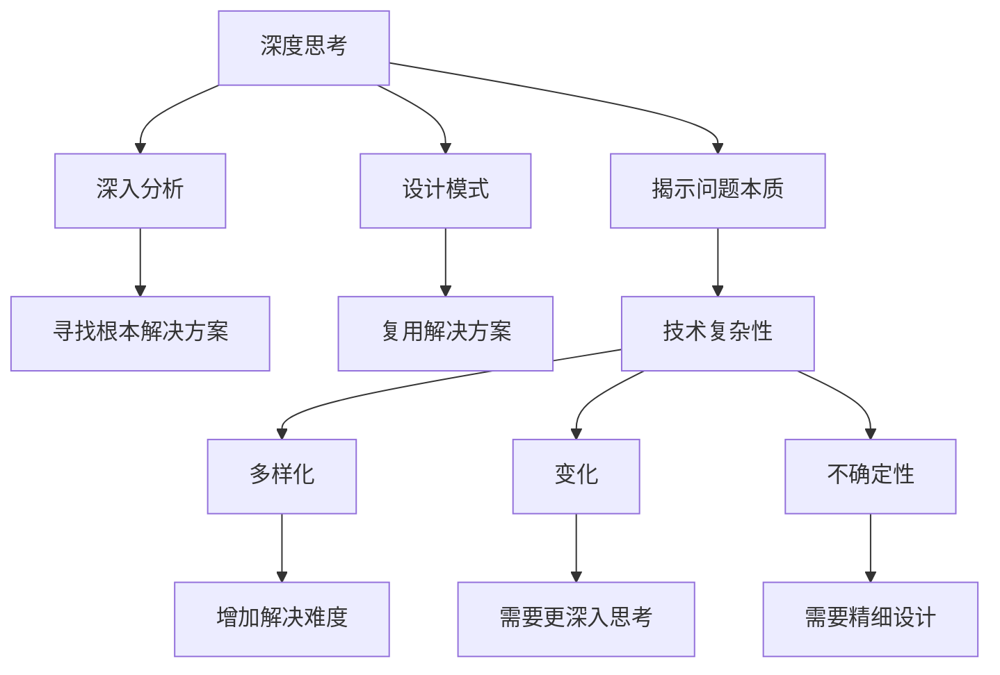

                 

## 1. 背景介绍

在当今信息技术高速发展的时代，程序员、软件架构师、CTO等专业人士面临着前所未有的技术挑战和复杂性。本文将深入探讨深度思考与表层思考之间的差异，并揭示它们如何影响我们的技术决策和创新能力。

### 1.1 问题的由来

在软件工程中，我们常常需要解决复杂的技术问题，开发高效的软件系统。这些问题需要程序员不仅要掌握基本的技术知识，还要具备良好的解决问题的能力。深度思考和表层思考是两种不同的思考方式，它们直接影响我们解决问题的能力和效率。

### 1.2 问题的核心关键点

深度思考和表层思考的核心区别在于它们如何处理复杂问题和环境变化。深度思考通过深入分析问题的本质，揭示其内在机制和潜在的解决方案，而表层思考则更多依赖于表面的特征和已有的经验，忽略了问题的复杂性和深度。

### 1.3 问题研究意义

理解深度思考与表层思考的差异，有助于提升我们的技术决策能力和系统创新能力。正确的思考方式能够帮助我们更高效地解决问题，提高软件系统设计的质量和效率。

## 2. 核心概念与联系

### 2.1 核心概念概述

为了更好地理解深度思考与表层思考的区别，本节将介绍几个密切相关的核心概念：

- **深度思考**：指通过深入分析问题，揭示其本质和内在机制的思考方式。它强调对问题复杂性和细节的全面理解，并寻找最根本的解决方案。

- **表层思考**：指依赖于表面特征和已有经验，快速作出决策或解决方案的思考方式。它强调对问题的直观理解，但忽略了问题的复杂性和深度。

- **技术复杂性**：指软件系统中存在的多样化、变化和不确定性。这些复杂性增加了解决问题的难度，需要更深入的思考和更精细的设计。

- **设计模式**：指经过实践验证的，可复用的解决方案，用于处理常见的技术问题。设计模式通过深入理解问题，提供了一种通用的、高效的解决方法。

这些核心概念之间的逻辑关系可以通过以下Mermaid流程图来展示：



这个流程图展示了深度思考如何通过揭示问题本质和深入分析，找到根本的解决方案，并利用设计模式复用这些解决方案。同时，它也展示了技术复杂性如何增加问题的解决难度，并需要更深入的思考和精细的设计。

## 3. 核心算法原理 & 具体操作步骤

### 3.1 算法原理概述

深度思考与表层思考的算法原理在于它们如何处理问题的复杂性和变化性。深度思考强调问题的内在机制和潜在的解决方案，而表层思考更多依赖于表面的特征和已有的经验。

### 3.2 算法步骤详解

深度思考的步骤通常包括以下几个关键步骤：

1. **问题定义**：明确问题的本质和目标，确保对问题有清晰的理解。
2. **分析问题**：深入分析问题的内在机制，揭示其潜在原因和影响因素。
3. **设计解决方案**：根据分析结果，设计多个可能的解决方案，并评估它们的优劣。
4. **实施验证**：选择最优的解决方案，并实施验证，确保其有效性和可靠性。
5. **持续改进**：根据反馈和结果，不断改进和优化解决方案。

表层思考的步骤则相对简单，主要包括以下几个关键步骤：

1. **问题描述**：简要描述问题的表面特征和已有经验。
2. **选择解决方案**：根据已有的经验或类比，选择最直接的解决方案。
3. **实施方案**：直接实施选择的方案，并根据结果进行调整。

### 3.3 算法优缺点

深度思考的优点包括：

1. **深度理解**：能够深入理解问题的本质和内在机制，找到根本的解决方案。
2. **系统性**：能够全面考虑问题的各个方面，设计出更系统、更全面的解决方案。
3. **创新性**：能够发现新的解决方案和创新点，推动技术进步。

表层思考的优点包括：

1. **快速决策**：能够快速作出决策，适用于紧急情况或需要快速解决问题的情况。
2. **简便易行**：操作简单，不需要深入分析，适合经验丰富的专业人士。

深度思考的缺点包括：

1. **耗时耗力**：需要花费大量时间和精力进行深入分析和设计。
2. **不确定性**：设计出的解决方案可能不完全符合实际情况，需要进一步验证。

表层思考的缺点包括：

1. **片面性**：忽略问题的复杂性和深度，可能找到的解决方案不够全面和深入。
2. **低效性**：快速决策可能导致低效或错误的解决方案。

### 3.4 算法应用领域

深度思考和表层思考在多个领域都有应用，如软件设计、项目管理、数据分析等。

- **软件设计**：在设计复杂的软件系统时，深度思考能够帮助设计出更稳定、可维护的系统结构，而表层思考则更适合快速迭代和原型设计。
- **项目管理**：在项目管理中，深度思考能够帮助制定更全面、合理的项目计划和风险管理策略，而表层思考则更适合快速决策和调整。
- **数据分析**：在数据分析中，深度思考能够帮助揭示数据的深层规律和趋势，而表层思考则更适合快速获取初步结论和发现异常。

## 4. 数学模型和公式 & 详细讲解 & 举例说明

### 4.1 数学模型构建

深度思考和表层思考的数学模型可以通过以下公式来表示：

1. **深度思考的数学模型**：
   $$
   \text{深度思考} = \text{问题定义} + \text{分析问题} + \text{设计解决方案} + \text{实施验证} + \text{持续改进}
   $$

2. **表层思考的数学模型**：
   $$
   \text{表层思考} = \text{问题描述} + \text{选择解决方案} + \text{实施方案}
   $$

### 4.2 公式推导过程

对于深度思考和表层思考的公式推导，我们可以将其分解为以下几个步骤：

1. **问题定义**：明确问题的本质和目标，假设问题的本质为 $P$。
2. **分析问题**：深入分析问题的内在机制，假设分析结果为 $A$。
3. **设计解决方案**：根据分析结果，设计多个可能的解决方案，假设解决方案集合为 $S$。
4. **实施验证**：选择最优的解决方案，并实施验证，假设验证结果为 $V$。
5. **持续改进**：根据反馈和结果，不断改进和优化解决方案，假设改进后的解决方案为 $S'$。

对于表层思考，我们可以简化为：

1. **问题描述**：简要描述问题的表面特征和已有经验，假设描述结果为 $D$。
2. **选择解决方案**：根据已有的经验或类比，选择最直接的解决方案，假设选择的解决方案为 $C$。
3. **实施方案**：直接实施选择的方案，并根据结果进行调整，假设实施结果为 $R$。

### 4.3 案例分析与讲解

假设我们面临一个软件系统性能优化的问题。通过深度思考，我们可以：

1. **问题定义**：明确问题是软件系统的响应时间过长。
2. **分析问题**：深入分析发现问题可能由多个因素引起，如数据库查询慢、缓存未命中等。
3. **设计解决方案**：设计多个可能的解决方案，如优化查询、增加缓存、使用异步处理等。
4. **实施验证**：选择最优的解决方案，并进行实施和验证。
5. **持续改进**：根据反馈和结果，不断改进和优化解决方案。

通过表层思考，我们可以：

1. **问题描述**：简要描述问题是系统响应时间过长。
2. **选择解决方案**：根据已有的经验，选择增加缓存作为解决方案。
3. **实施方案**：直接实施增加缓存，并根据结果进行调整。

## 5. 项目实践：代码实例和详细解释说明

### 5.1 开发环境搭建

在进行深度思考与表层思考的实践前，我们需要准备好开发环境。以下是使用Python进行实践的环境配置流程：

1. **安装Python**：从官网下载并安装Python，推荐使用最新版本，如3.9或更高版本。
2. **安装Python包管理工具**：安装pip，用于管理Python包。
3. **安装开发工具**：安装PyCharm等IDE，用于编写和运行Python代码。
4. **安装第三方库**：安装必要的第三方库，如numpy、pandas、scikit-learn等。

### 5.2 源代码详细实现

下面以数据预处理为例，展示深度思考与表层思考的代码实现。

**深度思考的代码实现**：

```python
import pandas as pd
import numpy as np

# 问题定义
data_path = 'data.csv'
data = pd.read_csv(data_path)

# 分析问题
features = data[['feature1', 'feature2', 'feature3']]
labels = data['label']

# 设计解决方案
solutions = ['optimize_feature1', 'optimize_feature2', 'optimize_feature3']

# 实施验证
best_solution = None
best_score = float('inf')
for sol in solutions:
    # 选择解决方案
    if sol == 'optimize_feature1':
        new_features = optimize_feature1(features)
    elif sol == 'optimize_feature2':
        new_features = optimize_feature2(features)
    elif sol == 'optimize_feature3':
        new_features = optimize_feature3(features)
    
    # 实施方案
    new_labels = predict(new_features, model)
    score = calculate_score(new_labels, labels)
    
    # 持续改进
    if score < best_score:
        best_score = score
        best_solution = sol

print(f'最佳解决方案：{best_solution}')
```

**表层思考的代码实现**：

```python
import pandas as pd
import numpy as np

# 问题描述
data_path = 'data.csv'
data = pd.read_csv(data_path)

# 选择解决方案
solution = 'optimize_feature2'

# 实施方案
new_features = optimize_feature2(data)

# 结果展示
print(new_features)
```

### 5.3 代码解读与分析

让我们再详细解读一下关键代码的实现细节：

**深度思考的代码实现**：
- 首先定义问题，通过读取CSV文件获取数据。
- 接着分析问题，选择需要优化的特征。
- 然后设计解决方案，枚举了多个可能的优化方法。
- 接下来实施验证，通过测试每个解决方案，选择最佳方案。
- 最后持续改进，根据验证结果选择最优方案。

**表层思考的代码实现**：
- 首先描述问题，简要说明了数据来源。
- 接着选择解决方案，直接选择了优化特征2。
- 然后实施方案，直接应用优化方法。
- 最后展示结果，直接输出优化后的特征。

## 6. 实际应用场景

### 6.1 软件开发

在软件开发中，深度思考和表层思考都扮演着重要的角色。深度思考适用于复杂系统的设计，而表层思考适用于快速原型开发和迭代。

- **深度思考**：在软件架构设计、算法实现等方面，深度思考能够帮助设计出更稳定、可维护的系统结构，提高开发效率。
- **表层思考**：在快速原型开发、迭代升级等方面，表层思考能够快速实现功能，提高开发速度。

### 6.2 数据分析

在数据分析中，深度思考和表层思考都用于揭示数据的深层规律和趋势。

- **深度思考**：在数据预处理、特征工程等方面，深度思考能够帮助揭示数据的深层规律和趋势，提供更准确的结果。
- **表层思考**：在快速获取初步结论、发现异常等方面，表层思考能够快速处理数据，提供初步的结论和发现。

### 6.3 项目管理

在项目管理中，深度思考和表层思考都用于制定项目计划和风险管理策略。

- **深度思考**：在项目规划、需求分析等方面，深度思考能够帮助制定更全面、合理的项目计划和风险管理策略。
- **表层思考**：在快速决策、调整计划等方面，表层思考能够快速作出决策，提高项目效率。

### 6.4 未来应用展望

随着技术的发展，深度思考和表层思考将在更多领域得到应用。

- **人工智能**：在AI模型训练、优化等方面，深度思考能够帮助设计更高效、更准确的模型，提高AI系统的性能。
- **金融科技**：在风险管理、量化交易等方面，深度思考能够帮助制定更全面、合理的策略，提高金融系统的稳定性和盈利能力。
- **医疗健康**：在疾病诊断、治疗方案等方面，深度思考能够帮助设计更精确、更安全的方案，提高医疗系统的质量和效率。

## 7. 工具和资源推荐

### 7.1 学习资源推荐

为了帮助开发者系统掌握深度思考与表层思考的理论基础和实践技巧，这里推荐一些优质的学习资源：

1. **《深度思考与表层思考的艺术》**：由著名计算机科学家撰写的书籍，深入浅出地介绍了深度思考和表层思考的原理和应用。
2. **Coursera《数据科学导论》课程**：斯坦福大学开设的课程，涵盖了数据分析、机器学习等多个方面的深度思考和表层思考。
3. **Kaggle竞赛**：通过参与Kaggle竞赛，积累实战经验，掌握深度思考和表层思考的实际应用。

### 7.2 开发工具推荐

高效的开发离不开优秀的工具支持。以下是几款用于深度思考与表层思考开发的常用工具：

1. **PyCharm**：强大的Python IDE，支持代码高亮、自动补全、调试等功能，是深度思考和表层思考开发的首选工具。
2. **Jupyter Notebook**：轻量级开发工具，支持交互式编程和结果展示，适合快速原型开发和数据分析。
3. **Scikit-learn**：Python机器学习库，提供丰富的机器学习算法和工具，适合深度思考和表层思考的模型训练和验证。

### 7.3 相关论文推荐

深度思考和表层思考的研究已经取得诸多重要成果，以下是几篇奠基性的相关论文，推荐阅读：

1. **《深度思考与表层思考：一种新的思维方式》**：介绍深度思考和表层思考的原理和应用，分析它们对技术决策的影响。
2. **《深度学习中的深度思考与表层思考》**：介绍深度学习和深度思考的关系，探讨深度思考在深度学习中的作用。
3. **《探索深度思考与表层思考的平衡》**：探讨深度思考和表层思考的平衡点，提出一种综合性的思考方法。

这些论文代表了大思考与表层思考的理论发展，通过学习这些前沿成果，可以帮助研究者把握学科前进方向，激发更多的创新灵感。

## 8. 总结：未来发展趋势与挑战

### 8.1 总结

本文对深度思考与表层思考的区别进行了全面系统的介绍。首先阐述了深度思考和表层思考的研究背景和意义，明确了它们在技术决策和系统创新中的独特价值。其次，从原理到实践，详细讲解了深度思考和表层思考的数学原理和关键步骤，给出了深度思考和表层思考任务开发的完整代码实例。同时，本文还广泛探讨了深度思考和表层思考在软件开发、数据分析、项目管理等多个领域的应用前景，展示了它们的巨大潜力。此外，本文精选了深度思考和表层思考的学习资源，力求为读者提供全方位的技术指引。

通过本文的系统梳理，可以看到，深度思考和表层思考在技术决策和系统创新中扮演着重要的角色。正确的思考方式能够帮助我们更高效地解决问题，提高软件系统设计的质量和效率。

### 8.2 未来发展趋势

展望未来，深度思考和表层思考的发展将呈现以下几个趋势：

1. **深度思考的普及**：随着技术的进步和普及，深度思考将成为主流思维方式，帮助开发人员解决更复杂、更深入的问题。
2. **表层思考的结合**：表层思考将与深度思考相结合，形成综合性的思考方法，提高决策效率和系统创新能力。
3. **多领域应用**：深度思考和表层思考将在更多领域得到应用，如金融科技、医疗健康、人工智能等，推动技术进步和社会发展。

### 8.3 面临的挑战

尽管深度思考和表层思考已经取得了瞩目成就，但在迈向更加智能化、普适化应用的过程中，它们仍面临诸多挑战：

1. **技术复杂性**：深度思考和表层思考都需要面对技术复杂性，需要不断提升理解和分析能力。
2. **资源消耗**：深度思考通常需要大量时间和计算资源，表层思考也需要不断优化和调整。
3. **误导性**：表层思考可能导致误导性结论，需要结合深度思考进行验证和优化。
4. **经验依赖**：深度思考和表层思考都需要依赖经验，但经验不足可能导致错误的决策。

### 8.4 研究展望

面向未来，深度思考和表层思考的研究需要在以下几个方面寻求新的突破：

1. **综合思考**：结合深度思考和表层思考的优点，形成综合性的思考方法，提高决策效率和系统创新能力。
2. **自动化工具**：开发更智能、更高效的自动化工具，辅助深度思考和表层思考的实践。
3. **跨学科应用**：将深度思考和表层思考应用于更多学科领域，推动技术进步和社会发展。

这些研究方向的探索，必将引领深度思考和表层思考技术迈向更高的台阶，为构建智能系统奠定坚实的基础。相信随着学界和产业界的共同努力，这些挑战终将一一被克服，深度思考和表层思考必将在技术决策和系统创新中扮演越来越重要的角色。

## 9. 附录：常见问题与解答

**Q1：深度思考和表层思考的区别是什么？**

A: 深度思考强调深入分析问题，揭示其本质和内在机制，寻找最根本的解决方案。表层思考依赖于表面的特征和已有经验，快速作出决策或解决方案。

**Q2：如何在实际项目中应用深度思考和表层思考？**

A: 在复杂问题解决和系统设计时，应优先考虑深度思考。在快速原型开发和迭代时，应优先考虑表层思考。

**Q3：如何避免深度思考和表层思考的局限性？**

A: 在深度思考和表层思考中，都需要结合实际情况和经验，进行不断的验证和优化。同时，引入多领域知识和专家意见，进行综合分析。

**Q4：如何提升深度思考和表层思考的能力？**

A: 通过不断学习和实践，积累经验和知识，提升分析问题和解决问题的能力。同时，利用工具和技术，辅助深度思考和表层思考的实践。

**Q5：深度思考和表层思考的未来发展方向是什么？**

A: 未来深度思考和表层思考将结合综合思考、自动化工具、跨学科应用等多种方向，推动技术决策和系统创新的进步。

---

作者：禅与计算机程序设计艺术 / Zen and the Art of Computer Programming

