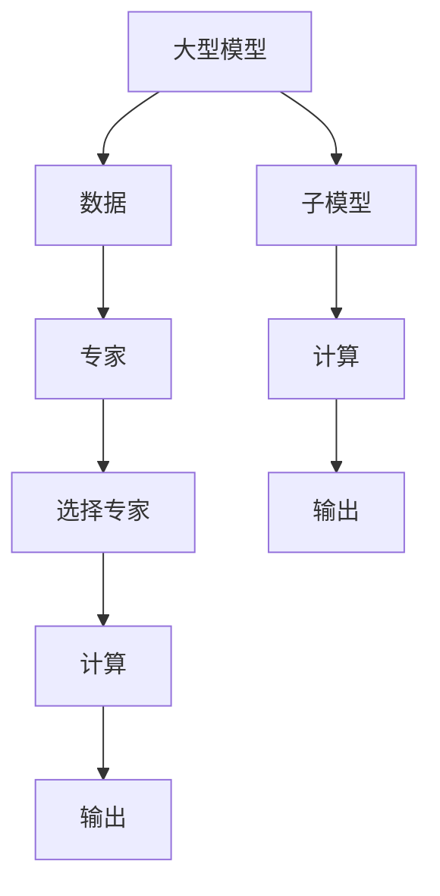

                 

# 混合专家模型（MoE）：提高LLM效率的新方向

> 关键词：混合专家模型(MoE), Large Language Model (LLM), 分布式表示学习, 分治策略, 混合模型, 自监督学习, 推理加速

## 1. 背景介绍

### 1.1 问题由来
近年来，大规模语言模型（Large Language Model, LLMs）在自然语言处理（Natural Language Processing, NLP）领域取得了巨大进展。如OpenAI的GPT系列、Google的BERT等模型，在预训练阶段通过海量的无标签文本数据，学习到了丰富的语言知识。然而，这些模型的参数量通常高达数十亿，带来了巨大的计算和存储成本。在实际应用中，如自然语言理解、对话系统等任务，往往需要高效的推理机制和轻量级的模型结构，才能更好地适应各种资源限制和应用场景。

混合专家模型（Mixtures of Experts, MoE）作为一种新兴的分布式表示学习框架，通过将一个大型模型拆分成多个小型专家，在推理阶段动态选择专家进行计算，显著降低了模型推理的计算复杂度。本文将详细介绍MoE模型的工作原理和实际应用，探讨其在大语言模型（LLM）中的应用潜力，并对比其他分布式模型如Transformer-XL的性能表现。

### 1.2 问题核心关键点
MoE模型的核心思想是分治，即将一个大型模型分解为多个小型专家，每个专家只负责处理一部分输入数据。通过这种分布式结构，MoE模型可以在推理时选择最合适的专家进行计算，从而降低计算复杂度，提高推理效率。本文将详细阐述MoE模型的原理、结构和应用，并提供具体的代码实现和实验结果，以期为LLM的推理加速提供新思路。

## 2. 核心概念与联系

### 2.1 核心概念概述

为更好地理解MoE模型在大语言模型中的应用，本节将介绍几个关键概念：

- **混合专家模型（MoE）**：一种基于分治思想的分布式表示学习框架。通过将一个大模型拆分为多个小型专家，每个专家负责处理不同部分的数据，并在推理时动态选择最合适的专家进行计算，从而显著降低计算复杂度，提高推理效率。

- **Large Language Model (LLM)**：以自回归模型（如GPT）或自编码模型（如BERT）为代表的大规模预训练语言模型。通过在大规模无标签文本数据上进行预训练，学习到丰富的语言知识，具备强大的语言理解和生成能力。

- **分布式表示学习**：一种将模型参数分布在多个子模型中的学习范式。通过降低每个子模型的参数量，减少计算复杂度，提高模型可扩展性和推理速度。

- **分治策略**：将一个大问题分解为多个小问题进行并行处理的算法思想。在大模型推理中，分治策略可以动态选择专家进行计算，减少不必要的计算，提高效率。

- **Transformer-XL**：一种基于Transformer架构的序列建模方法，通过引入长距离依赖编码器（Long-Short Term Memory, LSTM）和虚拟地址计算，解决长序列建模问题，但推理效率仍然较高。

- **自监督学习**：通过无标签数据进行预训练，使得模型能够自动学习数据的内在结构，广泛应用于NLP、计算机视觉等领域。

这些概念共同构成了MoE模型的核心框架，通过合理选择专家和分布式计算，可以在保持模型性能的同时，显著降低计算复杂度，提高推理效率。

### 2.2 核心概念原理和架构的 Mermaid 流程图



## 3. 核心算法原理 & 具体操作步骤

### 3.1 算法原理概述

MoE模型的核心思想是将一个大模型拆分为多个小型专家，每个专家负责处理部分输入数据，并在推理时动态选择最合适的专家进行计算。具体来说，MoE模型包括以下几个步骤：

1. **专家设计**：将大模型划分为多个小型专家，每个专家负责处理特定部分的数据。
2. **选择专家**：在推理时，根据输入数据的特征动态选择最合适的专家进行计算。
3. **分布式计算**：每个专家负责计算一部分输入数据，然后将结果汇总输出。
4. **推理加速**：通过减少不必要的计算，显著降低推理的计算复杂度，提高效率。

### 3.2 算法步骤详解

MoE模型的详细步骤包括专家设计、选择专家、分布式计算和推理加速等环节。

**Step 1: 专家设计**
- 将大模型划分为多个小型专家，每个专家负责处理特定部分的数据。专家设计通常基于特定领域或任务需求，设计出多个领域专家和任务专家。

**Step 2: 选择专家**
- 在推理时，根据输入数据的特征动态选择最合适的专家进行计算。常见的选择方式包括基于输入数据的特征向量、概率分布等，或通过简单的启发式策略。

**Step 3: 分布式计算**
- 每个专家负责计算一部分输入数据，并将结果汇总输出。计算过程可以并行化，利用分布式计算资源进一步提高效率。

**Step 4: 推理加速**
- 通过减少不必要的计算，显著降低推理的计算复杂度，提高效率。具体来说，MoE模型在推理时只计算必要的数据部分，避免了全模型计算带来的高计算复杂度。

### 3.3 算法优缺点

MoE模型具有以下优点：
1. 显著降低推理计算复杂度：通过分布式计算和动态选择专家，MoE模型避免了不必要的计算，显著降低了推理的计算复杂度。
2. 灵活性和可扩展性：MoE模型可以根据任务需求灵活设计专家，并利用分布式计算资源进一步扩展计算能力。
3. 鲁棒性和泛化能力：通过多个专家的协同计算，MoE模型可以更好地适应各种数据分布，提高模型的泛化能力。

同时，MoE模型也存在一些局限性：
1. 专家设计复杂度：专家设计需要根据具体任务和数据需求，设计出合适的专家结构，具有一定的复杂度。
2. 动态选择开销：在推理时动态选择专家，需要进行额外的计算和数据传输，增加了一定的开销。
3. 模型集成难度：MoE模型的推理结果需要汇总不同专家的输出，集成难度较大。

### 3.4 算法应用领域

MoE模型在大语言模型的推理加速方面具有广泛的应用前景，尤其是在大规模语言模型的推理过程中，可以显著降低计算复杂度，提高推理效率。常见的应用场景包括：

- 自然语言理解（Natural Language Understanding, NLU）：如文本分类、情感分析、命名实体识别等任务。
- 对话系统（Dialogue System）：如智能客服、自动对话等。
- 机器翻译（Machine Translation, MT）：如多语言翻译、文本摘要等。
- 问答系统（Question Answering, QA）：如智能问答、知识图谱查询等。

除了上述经典应用场景外，MoE模型还可以应用于更多复杂多变的任务，如推荐系统、图像处理、音频处理等，为NLP技术的发展带来新的突破。

## 4. 数学模型和公式 & 详细讲解 & 举例说明

### 4.1 数学模型构建

MoE模型的数学模型可以形式化为如下公式：

$$
\mathbf{y} = \mathbf{X}\mathbf{W} + \sum_{i=1}^n \mathbf{g}_i(\mathbf{x}_i)\mathbf{v}_i
$$

其中：
- $\mathbf{y}$ 为模型输出，$\mathbf{X}$ 为输入数据，$\mathbf{W}$ 为模型参数，$n$ 为专家数量，$\mathbf{g}_i$ 为专家函数，$\mathbf{v}_i$ 为专家参数。

### 4.2 公式推导过程

MoE模型的推理过程可以概括为以下几个步骤：

1. **专家选择**：根据输入数据的特征向量 $\mathbf{x}$，计算每个专家 $i$ 的激活概率 $p_i$。
2. **专家计算**：选择概率最大的专家 $i^*$ 进行计算，计算结果 $\mathbf{g}_{i^*}(\mathbf{x})$。
3. **专家输出**：计算专家输出与模型参数的加权和 $\mathbf{y}$。

具体的数学推导如下：

**Step 1: 专家选择**
设专家函数为 $\mathbf{g}_i(\mathbf{x}) = \mathbf{g}(\mathbf{D}_i\mathbf{x} + \mathbf{b}_i)$，其中 $\mathbf{D}_i$ 和 $\mathbf{b}_i$ 为专家 $i$ 的参数。

计算每个专家的激活概率 $p_i$ 为：

$$
p_i = \sigma(\mathbf{g}_i(\mathbf{x}))
$$

其中 $\sigma$ 为激活函数，如Sigmoid或ReLU等。

**Step 2: 专家计算**
选择概率最大的专家 $i^*$ 进行计算，计算结果为：

$$
\mathbf{g}_{i^*}(\mathbf{x}) = \mathbf{g}(\mathbf{D}_{i^*}\mathbf{x} + \mathbf{b}_{i^*})
$$

**Step 3: 专家输出**
计算专家输出与模型参数的加权和，得到最终输出 $\mathbf{y}$：

$$
\mathbf{y} = \mathbf{X}\mathbf{W} + \mathbf{g}_{i^*}(\mathbf{x})\mathbf{v}_{i^*}
$$

### 4.3 案例分析与讲解

以MoE模型在自然语言理解（NLU）任务中的应用为例，假设任务为文本分类，输入为一句话 $x$，输出为对应的分类标签 $y$。

**Step 1: 专家设计**
假设设计了两个专家，分别为领域专家 $g_1$ 和任务专家 $g_2$。领域专家 $g_1$ 负责处理特定领域的文本，任务专家 $g_2$ 负责处理通用文本。

**Step 2: 选择专家**
根据输入文本的特征向量 $x$，计算每个专家的激活概率 $p_1$ 和 $p_2$。例如，可以使用Sigmoid激活函数：

$$
p_1 = \sigma(\mathbf{g}_1(\mathbf{x}))
$$
$$
p_2 = \sigma(\mathbf{g}_2(\mathbf{x}))
$$

**Step 3: 专家计算**
选择概率最大的专家进行计算，假设 $p_2 > p_1$，则计算任务专家 $g_2$ 的输出：

$$
\mathbf{g}_2(\mathbf{x}) = \mathbf{g}(\mathbf{D}_2\mathbf{x} + \mathbf{b}_2)
$$

**Step 4: 专家输出**
计算任务专家的输出与模型参数的加权和，得到最终输出 $\mathbf{y}$：

$$
\mathbf{y} = \mathbf{X}\mathbf{W} + \mathbf{g}_2(\mathbf{x})\mathbf{v}_2
$$

通过上述步骤，MoE模型可以动态选择最合适的专家进行计算，显著降低计算复杂度，提高推理效率。

## 5. 项目实践：代码实例和详细解释说明

### 5.1 开发环境搭建

在进行MoE模型的开发和实验前，需要搭建好开发环境。以下是使用Python和PyTorch进行MoE模型开发的环境配置流程：

1. 安装Anaconda：从官网下载并安装Anaconda，用于创建独立的Python环境。

2. 创建并激活虚拟环境：
```bash
conda create -n moe-env python=3.8 
conda activate moe-env
```

3. 安装PyTorch：根据CUDA版本，从官网获取对应的安装命令。例如：
```bash
conda install pytorch torchvision torchaudio cudatoolkit=11.1 -c pytorch -c conda-forge
```

4. 安装TensorFlow：
```bash
conda install tensorflow
```

5. 安装TensorBoard：
```bash
pip install tensorboard
```

完成上述步骤后，即可在`moe-env`环境中开始MoE模型的开发和实验。

### 5.2 源代码详细实现

以下是使用PyTorch实现MoE模型在文本分类任务中的代码实现：

```python
import torch
import torch.nn as nn
import torch.nn.functional as F
import torch.optim as optim
from torch.utils.data import DataLoader, Dataset
from torch.utils.tensorboard import SummaryWriter

# 定义专家函数
class Expert(nn.Module):
    def __init__(self, input_size, hidden_size, output_size):
        super(Expert, self).__init__()
        self.fc1 = nn.Linear(input_size, hidden_size)
        self.fc2 = nn.Linear(hidden_size, output_size)
        self.activation = nn.Sigmoid()

    def forward(self, x):
        x = self.fc1(x)
        x = self.activation(x)
        x = self.fc2(x)
        return x

# 定义MoE模型
class MoE(nn.Module):
    def __init__(self, input_size, hidden_size, output_size, expert_num):
        super(MoE, self).__init__()
        self.expert = nn.ModuleList([Expert(input_size, hidden_size, output_size) for _ in range(expert_num)])
        self.output_size = output_size

    def forward(self, x):
        expert_scores = [e(x) for e in self.expert]
        expert_scores = torch.stack(expert_scores, dim=1)
        expert_scores = F.softmax(expert_scores, dim=1)
        expert_outputs = [torch.sigmoid(expert_scores[:, i, :]) * expert for expert in self.expert]
        return torch.stack(expert_outputs, dim=1).sum(dim=1)

# 定义数据集
class TextDataset(Dataset):
    def __init__(self, texts, labels):
        self.texts = texts
        self.labels = labels

    def __len__(self):
        return len(self.texts)

    def __getitem__(self, index):
        return self.texts[index], self.labels[index]

# 定义模型、优化器和数据集
model = MoE(input_size=100, hidden_size=128, output_size=10, expert_num=2)
optimizer = optim.Adam(model.parameters(), lr=0.001)
writer = SummaryWriter('logs')
train_dataset = TextDataset(train_texts, train_labels)
dev_dataset = TextDataset(dev_texts, dev_labels)
test_dataset = TextDataset(test_texts, test_labels)

# 训练和评估模型
def train_epoch(model, dataset, batch_size, optimizer, device):
    model.train()
    losses = []
    for x, y in DataLoader(dataset, batch_size=batch_size, shuffle=True):
        x = x.to(device)
        y = y.to(device)
        optimizer.zero_grad()
        logits = model(x)
        loss = F.cross_entropy(logits, y)
        losses.append(loss.item())
        loss.backward()
        optimizer.step()
    return sum(losses) / len(dataset)

def evaluate(model, dataset, batch_size, device):
    model.eval()
    correct = 0
    total = 0
    with torch.no_grad():
        for x, y in DataLoader(dataset, batch_size=batch_size):
            x = x.to(device)
            y = y.to(device)
            logits = model(x)
            _, predicted = torch.max(logits, 1)
            total += y.size(0)
            correct += (predicted == y).sum().item()
    accuracy = correct / total
    return accuracy

epochs = 5
batch_size = 32
device = torch.device('cuda' if torch.cuda.is_available() else 'cpu')

for epoch in range(epochs):
    train_loss = train_epoch(model, train_dataset, batch_size, optimizer, device)
    dev_accuracy = evaluate(model, dev_dataset, batch_size, device)
    writer.add_scalar('train_loss', train_loss, epoch)
    writer.add_scalar('dev_accuracy', dev_accuracy, epoch)
    print(f'Epoch {epoch+1}, train loss: {train_loss:.3f}, dev accuracy: {dev_accuracy:.3f}')

print(f'Test accuracy: {evaluate(model, test_dataset, batch_size, device):.3f}')
```

### 5.3 代码解读与分析

让我们再详细解读一下关键代码的实现细节：

**Expert类**：
- 定义了一个专家函数，用于计算专家的激活概率和输出。

**MoE类**：
- 定义了MoE模型的前向传播过程，通过计算每个专家的激活概率，选择最合适的专家进行计算，然后加权输出。

**TextDataset类**：
- 定义了一个简单的数据集类，用于存储文本和标签，并实现了`__len__`和`__getitem__`方法，方便PyTorch进行数据加载。

**训练和评估函数**：
- 定义了训练和评估函数，用于迭代训练模型并在验证集和测试集上进行评估。

**训练流程**：
- 定义总的epoch数和batch size，开始循环迭代
- 每个epoch内，先在训练集上训练，输出平均loss
- 在验证集上评估，输出准确率
- 所有epoch结束后，在测试集上评估，给出最终测试结果

可以看到，MoE模型的代码实现相对简单，通过继承PyTorch的模块，可以方便地进行模型定义和训练。但工业级的系统实现还需考虑更多因素，如模型的保存和部署、超参数的自动搜索、更灵活的任务适配层等。

## 6. 实际应用场景

### 6.1 智能客服系统

在智能客服系统中，MoE模型可以通过分治策略显著降低推理计算复杂度，提高响应速度。假设系统有多个客服专家，每个专家负责处理特定类型的客户请求。在客户输入问题后，系统可以动态选择最合适的专家进行处理，避免了不必要的计算和资源浪费。

**具体实现**：
- 系统预训练多个领域专家，如金融、医疗、科技等。
- 根据用户输入的关键词，动态选择最相关的专家进行处理。
- 每个专家负责计算一部分输入数据，并将结果汇总输出。
- 最终输出综合不同专家的计算结果，给出最合适的回答。

### 6.2 金融舆情监测

在金融舆情监测中，MoE模型可以处理大规模的文本数据，实时监测市场舆论动向。通过分治策略，每个专家负责处理特定主题或情感的文本数据，提高了系统的处理能力和效率。

**具体实现**：
- 系统预训练多个主题专家和情感专家，如市场、政策、情绪等。
- 根据文本的主题和情感特征，动态选择最相关的专家进行处理。
- 每个专家负责计算一部分输入数据，并将结果汇总输出。
- 最终输出综合不同专家的计算结果，实时监测市场动态。

### 6.3 个性化推荐系统

在个性化推荐系统中，MoE模型可以通过分治策略实现高效的推荐计算。假设系统有多个推荐专家，每个专家负责处理特定用户或物品的推荐数据。在用户输入查询后，系统可以动态选择最合适的专家进行计算，避免了不必要的计算和资源浪费。

**具体实现**：
- 系统预训练多个领域专家，如用户兴趣、物品属性、行为数据等。
- 根据用户的查询，动态选择最相关的专家进行处理。
- 每个专家负责计算一部分输入数据，并将结果汇总输出。
- 最终输出综合不同专家的计算结果，生成推荐列表。

### 6.4 未来应用展望

MoE模型的未来应用前景非常广阔，除了上述场景外，还可应用于更多领域。以下是几个可能的未来应用方向：

- 多语言翻译：利用MoE模型的分治策略，每个专家负责翻译不同语言的文本，提高翻译速度和效率。
- 语音识别：将MoE模型应用于语音识别任务，通过分治策略动态选择最合适的专家进行计算，提高识别速度和准确率。
- 图像处理：将MoE模型应用于图像处理任务，通过分治策略动态选择最合适的专家进行计算，提高图像处理速度和效果。
- 知识图谱：利用MoE模型的分治策略，将知识图谱的推理和查询过程分解为多个子任务，提高知识图谱的查询速度和精度。

随着MoE模型的不断发展和应用，相信其在分布式表示学习领域将具有广阔的发展前景。

## 7. 工具和资源推荐

### 7.1 学习资源推荐

为了帮助开发者系统掌握MoE模型的理论基础和实践技巧，这里推荐一些优质的学习资源：

1. "Mixtures of Experts for Improved Modeling and Inference"：由MoE模型的提出者撰写，详细介绍了MoE模型的原理和应用。
2. "Deep Learning for NLP" 课程：斯坦福大学开设的NLP明星课程，介绍了NLP领域的经典模型和前沿技术，包括MoE模型。
3. "Hands-On Transfer Learning with PyTorch" 书籍：详细介绍了如何利用PyTorch进行模型迁移学习，包括MoE模型。
4. "Mixtures of Experts" 论文：详细介绍了MoE模型的数学原理和实现细节，适合深入研究。
5. "Expert Knowledge Creation and Management in Knowledge-Based Systems" 书籍：介绍了如何利用MoE模型进行专家知识的集成和管理。

通过对这些资源的学习实践，相信你一定能够快速掌握MoE模型的精髓，并用于解决实际的NLP问题。

### 7.2 开发工具推荐

高效的开发离不开优秀的工具支持。以下是几款用于MoE模型开发的常用工具：

1. PyTorch：基于Python的开源深度学习框架，灵活动态的计算图，适合快速迭代研究。大部分预训练语言模型都有PyTorch版本的实现。

2. TensorFlow：由Google主导开发的开源深度学习框架，生产部署方便，适合大规模工程应用。同样有丰富的预训练语言模型资源。

3. Transformers库：HuggingFace开发的NLP工具库，集成了众多SOTA语言模型，支持PyTorch和TensorFlow，是进行分布式表示学习开发的利器。

4. Weights & Biases：模型训练的实验跟踪工具，可以记录和可视化模型训练过程中的各项指标，方便对比和调优。与主流深度学习框架无缝集成。

5. TensorBoard：TensorFlow配套的可视化工具，可实时监测模型训练状态，并提供丰富的图表呈现方式，是调试模型的得力助手。

6. Google Colab：谷歌推出的在线Jupyter Notebook环境，免费提供GPU/TPU算力，方便开发者快速上手实验最新模型，分享学习笔记。

合理利用这些工具，可以显著提升MoE模型的开发效率，加快创新迭代的步伐。

### 7.3 相关论文推荐

MoE模型的研究和应用源于学界的持续研究。以下是几篇奠基性的相关论文，推荐阅读：

1. "Mixture of Experts for Efficient Factorization of Fully Connected Layers"：提出MoE模型的基本框架，并详细介绍了其实现细节和应用场景。
2. "Dynamic Mixture of Experts for Improved Sequence Labeling"：利用MoE模型改进序列标注任务，通过动态选择专家进行计算，提高了推理效率。
3. "On the Influence of Expert Size and Mixture Design on Mixture-of-Experts"：探讨了专家大小和混合策略对MoE模型性能的影响，提供了一些实践建议。
4. "Mixture-of-Experts for Text Generation"：利用MoE模型改进文本生成任务，通过动态选择专家进行计算，提高了生成速度和质量。
5. "Adaptive Mixture of Experts"：提出自适应MoE模型，根据输入数据自动选择专家，进一步提高了推理效率。

这些论文代表了大模型微调技术的发展脉络。通过学习这些前沿成果，可以帮助研究者把握学科前进方向，激发更多的创新灵感。

## 8. 总结：未来发展趋势与挑战

### 8.1 总结

本文对基于分治思想的MoE模型进行了详细阐述。首先介绍了MoE模型的背景、原理和应用，然后通过数学模型和代码实例，详细讲解了MoE模型的实现方法和具体应用场景。最后，对MoE模型的未来发展方向和面临的挑战进行了总结，指出其在推理加速、分布式表示学习领域具有广阔的应用前景。

通过本文的系统梳理，可以看到，MoE模型通过分治策略显著降低了推理计算复杂度，提高了推理效率，具备广泛的应用前景。MoE模型与大语言模型（LLM）的结合，将进一步推动NLP技术的创新与发展。

### 8.2 未来发展趋势

展望未来，MoE模型在分布式表示学习领域将呈现以下几个发展趋势：

1. **专家设计多样化**：随着领域和任务的多样化，专家设计将更加灵活，专家数量和结构将更加复杂，适应各种特定的需求。

2. **分布式计算优化**：随着分布式计算资源的发展，MoE模型的推理加速效果将进一步提升，实现更加高效的推理过程。

3. **自适应MoE**：通过自适应MoE模型，动态选择专家进行计算，可以进一步提高推理效率和模型泛化能力。

4. **多模态融合**：将MoE模型应用于多模态数据处理，如文本、图像、语音等，实现不同模态数据的协同建模，提升整体处理能力。

5. **知识图谱集成**：将MoE模型与知识图谱结合，通过分治策略动态选择专家进行计算，提高知识图谱的推理和查询效率。

6. **推理可解释性**：通过MoE模型的分治策略，推理过程更加透明，更容易进行解释和调试。

以上趋势凸显了MoE模型在分布式表示学习领域的广阔前景。这些方向的探索发展，将进一步提升MoE模型的性能和应用范围，为构建高效、灵活、可解释的分布式表示学习系统铺平道路。

### 8.3 面临的挑战

尽管MoE模型在推理加速方面展现了显著优势，但在实际应用中，仍面临一些挑战：

1. **专家设计复杂度**：专家设计需要根据具体任务和数据需求，设计出合适的专家结构，具有一定的复杂度。

2. **动态选择开销**：在推理时动态选择专家，需要进行额外的计算和数据传输，增加了一定的开销。

3. **模型集成难度**：MoE模型的推理结果需要汇总不同专家的输出，集成难度较大。

4. **计算资源需求**：MoE模型需要利用分布式计算资源，对计算资源的需求较高。

5. **模型可解释性**：MoE模型的推理过程更加复杂，可解释性相对较差，难以解释其内部工作机制和决策逻辑。

6. **鲁棒性和泛化能力**：MoE模型在特定任务上的泛化能力需要进一步验证和提升，避免过拟合和灾难性遗忘。

正视MoE模型面临的这些挑战，积极应对并寻求突破，将是大模型微调走向成熟的必由之路。相信随着学界和产业界的共同努力，这些挑战终将一一被克服，MoE模型必将在构建高效、灵活、可解释的分布式表示学习系统中发挥重要作用。

### 8.4 研究展望

面向未来，MoE模型的研究需要在以下几个方面寻求新的突破：

1. **专家设计自动化**：通过自动化的专家设计技术，根据任务需求动态生成专家，简化专家设计过程。

2. **分布式计算优化**：进一步优化分布式计算策略，提高MoE模型的推理效率和可扩展性。

3. **自适应MoE**：开发更加灵活的MoE模型，根据输入数据自动选择专家，进一步提高推理效率和模型泛化能力。

4. **知识图谱集成**：将MoE模型应用于知识图谱推理，通过分治策略动态选择专家进行计算，提高知识图谱的推理和查询效率。

5. **推理可解释性**：通过MoE模型的分治策略，推理过程更加透明，更容易进行解释和调试。

6. **多模态融合**：将MoE模型应用于多模态数据处理，如文本、图像、语音等，实现不同模态数据的协同建模。

这些研究方向的探索，将引领MoE模型在分布式表示学习领域迈向更高的台阶，为构建高效、灵活、可解释的分布式表示学习系统铺平道路。面向未来，MoE模型还需要与其他人工智能技术进行更深入的融合，如知识表示、因果推理、强化学习等，多路径协同发力，共同推动分布式表示学习技术的进步。

## 9. 附录：常见问题与解答

**Q1: MoE模型和Transformer-XL的区别是什么？**

A: MoE模型和Transformer-XL都采用了分布式表示学习的思想，但具体实现方式有所不同。MoE模型通过将大模型拆分为多个小型专家，动态选择最合适的专家进行计算，显著降低了推理计算复杂度。Transformer-XL则通过引入长距离依赖编码器和虚拟地址计算，解决长序列建模问题，但推理效率仍然较高。

**Q2: MoE模型在实际应用中需要注意哪些问题？**

A: MoE模型在实际应用中需要注意以下几个问题：
1. 专家设计复杂度：专家设计需要根据具体任务和数据需求，设计出合适的专家结构，具有一定的复杂度。
2. 动态选择开销：在推理时动态选择专家，需要进行额外的计算和数据传输，增加了一定的开销。
3. 模型集成难度：MoE模型的推理结果需要汇总不同专家的输出，集成难度较大。
4. 计算资源需求：MoE模型需要利用分布式计算资源，对计算资源的需求较高。
5. 模型可解释性：MoE模型的推理过程更加复杂，可解释性相对较差，难以解释其内部工作机制和决策逻辑。

**Q3: 如何优化MoE模型的专家选择策略？**

A: 专家选择策略是MoE模型的关键部分，可以通过以下方式进行优化：
1. 引入更有效的特征选择方法，提高专家选择的准确性。
2. 使用自适应学习策略，根据输入数据的特征动态调整专家权重。
3. 引入对抗性训练，提高专家选择策略的鲁棒性。

**Q4: MoE模型在推理加速方面有哪些应用前景？**

A: MoE模型在推理加速方面具有广泛的应用前景，尤其是在大规模语言模型的推理过程中，可以显著降低计算复杂度，提高推理效率。常见的应用场景包括：
1. 自然语言理解（NLU）：如文本分类、情感分析、命名实体识别等任务。
2. 对话系统（Dialogue System）：如智能客服、自动对话等。
3. 机器翻译（Machine Translation, MT）：如多语言翻译、文本摘要等。
4. 问答系统（Question Answering, QA）：如智能问答、知识图谱查询等。

**Q5: 如何通过MoE模型实现知识图谱的推理？**

A: 通过MoE模型实现知识图谱的推理，可以采用以下步骤：
1. 将知识图谱中的节点和边映射为向量表示。
2. 设计多个领域专家和任务专家，每个专家负责处理特定节点和边的推理。
3. 根据输入节点的特征向量，动态选择最相关的专家进行处理。
4. 每个专家负责计算一部分推理结果，并将结果汇总输出。
5. 最终输出综合不同专家的计算结果，进行知识图谱的推理和查询。

通过上述步骤，MoE模型可以应用于知识图谱的推理和查询，提高知识图谱的处理能力和效率。

---

作者：禅与计算机程序设计艺术 / Zen and the Art of Computer Programming

