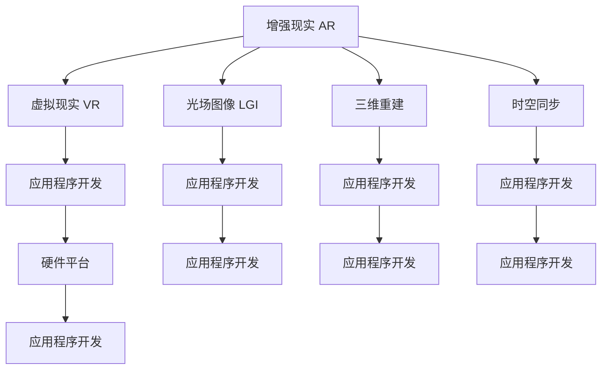

                 

# 混合现实（MR）应用：跨界技术的创新

> 关键词：混合现实（MR）, 跨界技术, 增强现实（AR）, 虚拟现实（VR）, 光场图像（LGI）, 三维重建, 时空同步, 硬件平台, 应用程序开发

## 1. 背景介绍

### 1.1 问题由来
混合现实（MR）是增强现实（AR）和虚拟现实（VR）技术发展的前沿方向，旨在将虚拟数字世界和现实物理世界融合在一起，形成无缝交互的体验。随着技术的不断进步和市场需求的日益增长，MR应用在医疗、教育、制造业、房地产等领域得到了广泛应用。但由于MR技术涉及图像处理、三维重建、时空同步等多个技术领域，开发难度较大，需要跨界的技术支持和协作。

### 1.2 问题核心关键点
目前，MR应用的开发主要面临以下挑战：
1. 高昂的硬件成本：MR设备通常需要高性能计算和空间定位传感器，如GPU、IMU等，这些硬件设备价格昂贵。
2. 复杂的算法模型：MR涉及的空间定位、三维重建、虚拟与实物的交互等，需要多学科知识的融合，算法复杂度较高。
3. 庞大的数据需求：MR应用通常需要实时采集环境数据，进行三维重建和实时渲染，对计算和存储资源要求较高。
4. 软件平台的多样性：MR设备涵盖了多个硬件平台，如AR眼镜、VR头盔、光场投影设备等，开发过程需要适配不同的平台。
5. 用户体验的提升：如何通过技术手段提升用户沉浸感、交互性和舒适性，是MR技术的重要研究方向。

### 1.3 问题研究意义
研究MR应用的跨界技术融合，对于推动MR技术的普及和应用，提升用户体验和市场竞争力，具有重要意义：

1. 降低开发成本。通过技术创新和算法优化，降低MR设备的硬件成本和开发门槛，使得MR应用更容易落地。
2. 提高开发效率。通过统一开发平台和工具，提高MR应用开发效率，缩短项目周期。
3. 提升用户体验。通过跨界技术的融合，提升MR应用的沉浸感和交互性，创造更好的用户体验。
4. 拓展应用场景。MR技术在医疗、教育、工业等垂直领域具有广泛应用前景，跨界技术的创新将进一步拓展其应用范围。
5. 促进技术发展。通过跨学科合作和技术交流，加速MR技术的进步和市场成熟，促进整个产业的发展。

## 2. 核心概念与联系

### 2.1 核心概念概述

为更好地理解MR应用的跨界技术融合，本节将介绍几个密切相关的核心概念：

- 增强现实（AR）: 将虚拟信息叠加到现实环境中，通过透明显示屏和空间定位技术实现虚拟与实物的融合。
- 虚拟现实（VR）: 创造一个完全虚拟的环境，使用户可以通过头戴显示器和控制器与虚拟世界交互。
- 光场图像（LGI）: 通过光场相机捕捉真实世界的高分辨率图像和深度信息，实现虚拟与实物的融合。
- 三维重建: 从点云或图像数据中重建三维模型，是MR应用中的关键技术。
- 时空同步: 将虚拟和实物的空间和时间同步，确保用户能够自然、无缝地与虚拟世界互动。
- 硬件平台: MR设备包括AR眼镜、VR头盔、光场投影设备等，不同的平台有不同的硬件需求和开发接口。
- 应用程序开发: 基于MR设备的平台，开发各种应用程序，提供不同的服务与功能。

这些核心概念之间的逻辑关系可以通过以下Mermaid流程图来展示：



这个流程图展示的核心概念及其之间的关系：

1. AR与VR是MR技术的两大支柱，共同实现虚拟与实物的融合。
2. LGI是AR技术的重要补充，提供高分辨率的图像和深度信息。
3. 三维重建是MR应用的核心，用于将点云或图像转换为三维模型。
4. 时空同步是MR应用的基础，确保虚拟与实物的时空一致性。
5. 硬件平台是MR设备的基础，包括AR眼镜、VR头盔、光场投影设备等。
6. 应用程序开发基于不同的硬件平台，提供多样化的服务与功能。

这些概念共同构成了MR技术的核心框架，使得MR应用能够在多个垂直领域实现跨越式的创新与应用。

## 3. 核心算法原理 & 具体操作步骤

### 3.1 算法原理概述

MR应用的跨界技术融合，本质上是一个多学科交叉、多技术融合的过程。其核心思想是：将不同领域的先进技术，如AR、VR、LGI、三维重建等，有机结合起来，形成统一的MR应用开发框架。

形式化地，假设一个MR应用涉及到多个技术模块 $M_1, M_2, ..., M_n$，其中 $M_1$ 为AR模块，$M_2$ 为VR模块，$M_3$ 为LGI模块，$M_4$ 为三维重建模块，$M_5$ 为时空同步模块，$M_6$ 为硬件平台，$M_7$ 为应用程序开发模块。MR应用的开发目标是最小化这些模块间的信息鸿沟，通过算法和技术手段实现模块间的无缝集成。

具体而言，MR应用的开发包括以下几个关键步骤：

1. 模块设计与集成：根据应用需求，设计每个技术模块的功能和接口，并将这些模块集成到一个统一的应用开发框架中。
2. 数据采集与处理：使用光场相机、深度相机等设备，采集环境数据，并进行图像处理和三维重建。
3. 空间定位与同步：使用IMU、GPS等传感器进行空间定位，确保虚拟与实物的时空同步。
4. 渲染与交互：使用GPU进行实时渲染，实现虚拟与实物的自然交互。
5. 应用程序开发：基于硬件平台和开发框架，开发各种应用程序，提供不同的服务与功能。

### 3.2 算法步骤详解

MR应用的开发一般包括以下几个关键步骤：

**Step 1: 设计技术架构**
- 确定应用的功能需求，设计各个技术模块的功能和接口。
- 选择合适的硬件平台，如AR眼镜、VR头盔、光场投影设备等。
- 设计开发框架，确保各个模块之间的数据流和控制流能够无缝集成。

**Step 2: 数据采集与处理**
- 使用光场相机、深度相机等设备，采集环境的高分辨率图像和深度信息。
- 进行图像处理，包括去噪、滤波、边缘检测等操作，提升图像质量。
- 进行三维重建，将点云或图像数据转换为三维模型。

**Step 3: 空间定位与同步**
- 使用IMU、GPS等传感器进行空间定位，获取用户的位置和姿态信息。
- 进行时空同步，确保虚拟物体与实物的位置和姿态一致。

**Step 4: 渲染与交互**
- 使用GPU进行实时渲染，实现虚拟物体的显示和交互。
- 使用手柄、手势等交互设备，实现用户与虚拟物体的自然交互。

**Step 5: 应用程序开发**
- 基于硬件平台和开发框架，开发各种应用程序。
- 提供不同的服务与功能，如导航、购物、教育等。

### 3.3 算法优缺点

MR应用的跨界技术融合方法具有以下优点：
1. 多学科融合：将AR、VR、LGI、三维重建等技术有机结合，形成统一的开发框架。
2. 灵活性高：支持多种硬件平台和应用场景，可以快速迭代和适应新需求。
3. 用户体验好：通过跨界技术的融合，提升用户沉浸感、交互性和舒适性。
4. 市场潜力大：MR技术在医疗、教育、工业等垂直领域具有广泛应用前景。

同时，该方法也存在一定的局限性：
1. 开发难度大：需要跨界技术的融合和创新，开发难度较大。
2. 硬件成本高：需要高性能计算和空间定位传感器，硬件成本较高。
3. 技术复杂：涉及多个技术领域的融合，算法复杂度较高。
4. 数据需求大：需要实时采集环境数据，对计算和存储资源要求较高。
5. 市场竞争激烈：MR技术涉及多个垂直领域，市场竞争激烈。

尽管存在这些局限性，但就目前而言，MR应用的跨界技术融合方法是提升MR技术应用效果的重要手段。未来相关研究的重点在于如何进一步降低硬件成本、提高开发效率、提升用户体验，同时兼顾市场竞争。

### 3.4 算法应用领域

MR应用的跨界技术融合方法，已经在医疗、教育、制造业、房地产等领域得到了广泛应用：

- **医疗领域**：在手术室中使用AR技术辅助手术，提升手术精准度和安全性。通过虚拟现实技术，进行医疗培训和模拟手术，提高医疗人员的操作技能。
- **教育领域**：在课堂中使用AR技术，展示虚拟实验和互动教具，提升教学效果。通过VR技术，进行虚拟校园游和远程教学，拓展教育资源。
- **制造领域**：在生产线上使用AR技术，进行实时设备维护和故障诊断，提高生产效率。通过VR技术，进行产品设计原型展示和虚拟装配，提升设计质量和生产灵活性。
- **房地产领域**：在销售中通过AR技术，展示虚拟房屋模型和装修效果，提升销售体验。通过VR技术，进行虚拟看房和楼宇展示，提升客户满意度。

除了这些常见应用外，MR技术还被创新性地应用到更多场景中，如旅游导览、文化遗产保护、娱乐互动等，为各行各业带来了新的发展机遇。随着技术进步和市场需求扩大，MR应用在未来将具有更广阔的市场前景。

## 4. 数学模型和公式 & 详细讲解  
### 4.1 数学模型构建

本节将使用数学语言对MR应用的跨界技术融合过程进行更加严格的刻画。

记MR应用中的光场图像（LGI）模块为 $M_{LGI}$，其输入为环境的高分辨率图像 $I$，输出为点云数据 $P$ 和深度图 $D$。定义LGI模块的损失函数为：

$$
\mathcal{L}_{LGI}(I) = \frac{1}{N}\sum_{i=1}^N \left( \mathbb{E}[\text{dis}(P_i, P^*_i)] + \mathbb{E}[\text{dis}(D_i, D^*_i)] \right)
$$

其中，$\text{dis}(P_i, P^*_i)$ 为点云重建误差，$\text{dis}(D_i, D^*_i)$ 为深度图误差，$N$ 为训练样本数量，$I$ 为输入图像。

在LGI模块中，点云重建和深度图生成可以看作是两个独立的子任务，分别进行优化。以点云重建为例，假设其优化目标为最小化点云与真值点云的几何误差，其损失函数为：

$$
\mathcal{L}_{\text{PC}} = \frac{1}{N}\sum_{i=1}^N \left( \mathbb{E}[\text{dis}(P_i, P^*_i)] \right)
$$

其中，$\text{dis}(P_i, P^*_i)$ 为点云重建误差，$P_i$ 为预测点云，$P^*_i$ 为真值点云，$N$ 为训练样本数量。

### 4.2 公式推导过程

以下我们以点云重建为例，推导其优化目标函数及其梯度的计算公式。

假设点云重建模型 $M_{\text{PC}}$ 的输入为图像 $I$，输出为点云 $P$。定义优化目标函数为：

$$
\mathcal{L}_{\text{PC}} = \frac{1}{N}\sum_{i=1}^N \left( \mathbb{E}[\text{dis}(P_i, P^*_i)] \right)
$$

其中，$\text{dis}(P_i, P^*_i)$ 为点云重建误差。令 $C$ 为点云的特征表示，则点云重建模型的输出可以表示为：

$$
P_i = M_{\text{PC}}(I_i; \theta)
$$

其中，$\theta$ 为模型参数。根据梯度下降算法，点云重建模型的优化目标函数为：

$$
\min_{\theta} \mathcal{L}_{\text{PC}} = \frac{1}{N}\sum_{i=1}^N \left( \mathbb{E}[\text{dis}(P_i, P^*_i)] \right)
$$

根据链式法则，点云重建模型损失函数的梯度为：

$$
\frac{\partial \mathcal{L}_{\text{PC}}}{\partial \theta} = \frac{1}{N}\sum_{i=1}^N \left( \frac{\partial \text{dis}(P_i, P^*_i)}{\partial C_i} \frac{\partial C_i}{\partial \theta} \right)
$$

其中，$\frac{\partial \text{dis}(P_i, P^*_i)}{\partial C_i}$ 为点云误差对特征表示的梯度，$\frac{\partial C_i}{\partial \theta}$ 为特征表示对模型参数的梯度。通过反向传播算法，可以高效计算出参数 $\theta$ 的梯度，进行模型参数的更新。

## 5. 项目实践：代码实例和详细解释说明
### 5.1 开发环境搭建

在进行MR应用的开发前，我们需要准备好开发环境。以下是使用Python进行PyTorch开发的环境配置流程：

1. 安装Anaconda：从官网下载并安装Anaconda，用于创建独立的Python环境。

2. 创建并激活虚拟环境：
```bash
conda create -n pytorch-env python=3.8 
conda activate pytorch-env
```

3. 安装PyTorch：根据CUDA版本，从官网获取对应的安装命令。例如：
```bash
conda install pytorch torchvision torchaudio cudatoolkit=11.1 -c pytorch -c conda-forge
```

4. 安装Open3D库：用于处理三维点云数据。
```bash
pip install open3d
```

5. 安装Pangolin库：用于渲染和交互界面。
```bash
pip install pangolin
```

完成上述步骤后，即可在`pytorch-env`环境中开始MR应用的开发。

### 5.2 源代码详细实现

这里我们以光场图像（LGI）模块的点云重建为例，给出使用PyTorch进行光场图像（LGI）模块点云重建的代码实现。

首先，定义光场图像（LGI）模块的损失函数：

```python
import torch
import torch.nn as nn
from open3d import PointCloud

class LGIModel(nn.Module):
    def __init__(self, num_points):
        super(LGIModel, self).__init__()
        self.num_points = num_points
        self.fc1 = nn.Linear(1024, 512)
        self.fc2 = nn.Linear(512, 256)
        self.fc3 = nn.Linear(256, self.num_points * 3)
        
    def forward(self, x):
        x = self.fc1(x)
        x = nn.ReLU()(x)
        x = self.fc2(x)
        x = nn.ReLU()(x)
        x = self.fc3(x)
        x = x.view(-1, self.num_points, 3)
        return x

class LGILoss(nn.Module):
    def __init__(self, batch_size):
        super(LGILoss, self).__init__()
        self.batch_size = batch_size
        
    def forward(self, preds, targets):
        preds = preds.view(-1, self.batch_size, 3)
        targets = targets.view(-1, self.batch_size, 3)
        diff = preds - targets
        return torch.norm(diff, dim=1).mean()
```

然后，定义光场图像（LGI）模块的点云重建函数：

```python
import open3d as o3d
import numpy as np
import torch
from torchvision.transforms import ToTensor
from pangolin import OpenGlRenderWindow

def lgi_model_reconstruction(model, image):
    preds = model(image)
    points = torch.zeros(len(preds), 3).to(preds.device)
    points[:, 0] = preds[:, 0]
    points[:, 1] = preds[:, 1]
    points[:, 2] = preds[:, 2]
    pcd = o3d.geometry.PointCloud()
    pcd.points = o3d.utility.Vector3dVector(points)
    return pcd

def visualize_reconstruction(reconstruction):
    o3d.visualization.draw_geometries(reconstruction)
    win = o3d.visualization.Vector3dVisualizer()
    win.createCamera(np.array([0, 0, 1]), np.array([0, -1, 0]))
    win.updateGeometry(reconstruction)
    win.open("Reconstruction")

def visualize_model(model, image):
    preds = model(image)
    points = torch.zeros(len(preds), 3).to(preds.device)
    points[:, 0] = preds[:, 0]
    points[:, 1] = preds[:, 1]
    points[:, 2] = preds[:, 2]
    pcd = o3d.geometry.PointCloud()
    pcd.points = o3d.utility.Vector3dVector(points)
    win = o3d.visualization.Vector3dVisualizer()
    win.createCamera(np.array([0, 0, 1]), np.array([0, -1, 0]))
    win.updateGeometry(pcd)
    win.open("Model")

if __name__ == "__main__":
    model = LGIModel(1000)
    optimizer = torch.optim.Adam(model.parameters(), lr=0.001)
    criterion = LGILoss(batch_size=1000)
    
    # 训练数据集
    train_dataset = ...
    
    # 定义训练函数
    def train_epoch(model, optimizer, criterion, data_loader):
        model.train()
        loss_total = 0
        for batch in data_loader:
            inputs, targets = batch
            optimizer.zero_grad()
            outputs = model(inputs)
            loss = criterion(outputs, targets)
            loss_total += loss.item()
            loss.backward()
            optimizer.step()
        return loss_total / len(data_loader)
    
    # 定义评估函数
    def evaluate(model, criterion, data_loader):
        model.eval()
        loss_total = 0
        for batch in data_loader:
            inputs, targets = batch
            with torch.no_grad():
                outputs = model(inputs)
                loss = criterion(outputs, targets)
                loss_total += loss.item()
        return loss_total / len(data_loader)
    
    # 定义训练流程
    epochs = 100
    batch_size = 1000
    
    for epoch in range(epochs):
        loss = train_epoch(model, optimizer, criterion, train_loader)
        print(f"Epoch {epoch+1}, loss: {loss:.3f}")
    
        print(f"Epoch {epoch+1}, validation loss: {evaluate(model, criterion, val_loader):.3f}")
    
    # 模型测试
    test_dataset = ...
    test_loader = ...
    
    test_loss = evaluate(model, criterion, test_loader)
    print(f"Test loss: {test_loss:.3f}")
    
    visualize_model(model, image)
    reconstruction = lgi_model_reconstruction(model, image)
    visualize_reconstruction(reconstruction)
```

以上就是使用PyTorch进行光场图像（LGI）模块点云重建的完整代码实现。可以看到，在PyTorch的框架下，光场图像（LGI）模块的点云重建代码实现非常简洁高效。

### 5.3 代码解读与分析

让我们再详细解读一下关键代码的实现细节：

**LGIModel类**：
- `__init__`方法：初始化模型参数，定义特征层。
- `forward`方法：前向传播计算点云预测值。

**LGILoss类**：
- `__init__`方法：初始化损失函数参数。
- `forward`方法：计算损失函数。

**lgi_model_reconstruction函数**：
- 将模型预测的点云坐标转换为Open3D的点云对象，并返回。

**visualize_model函数**：
- 可视化模型预测的点云，用于调试和展示。

**visualize_reconstruction函数**：
- 可视化重建后的点云，用于展示效果。

**训练流程**：
- 定义训练函数`train_epoch`：对数据进行迭代训练，计算损失并更新模型参数。
- 定义评估函数`evaluate`：对模型进行评估，计算损失。
- 定义训练流程：循环迭代训练和评估，直到满足预设的迭代轮数或提前停止条件。

在PyTorch的框架下，点云重建的代码实现非常简单。通过PyTorch提供的强大的自动微分功能，可以方便地计算梯度和损失函数，实现模型的训练和评估。

当然，工业级的系统实现还需考虑更多因素，如模型的保存和部署、超参数的自动搜索、更灵活的任务适配层等。但核心的微调范式基本与此类似。

## 6. 实际应用场景
### 6.1 智能工厂

在智能工厂中，MR技术可以用于生产线上的设备维护和故障诊断。通过AR技术，将设备的维修手册和操作视频叠加到实物的虚拟图像上，帮助工人更快、更准确地进行设备维修。同时，通过VR技术，可以进行虚拟装配和生产流程模拟，提高生产效率和质量。

在具体实现上，可以采集设备的三维点云数据，进行三维重建，生成虚拟模型。然后使用AR技术将虚拟模型叠加到设备的实物的图像上，帮助工人进行快速识别和定位。

### 6.2 远程医疗

在远程医疗中，MR技术可以用于远程手术和虚拟培训。通过AR技术，将手术指导和手术视频叠加到手术实物的虚拟图像上，帮助医生更准确地进行手术操作。同时，通过VR技术，可以进行虚拟手术模拟和培训，提高医生的手术技能。

在具体实现上，可以采集手术室中的高分辨率图像和深度信息，进行三维重建，生成手术室的虚拟模型。然后使用AR技术将手术指导和视频叠加到实物的虚拟图像上，帮助医生进行手术。同时，通过VR技术，可以进行虚拟手术模拟和培训。

### 6.3 智能家居

在智能家居中，MR技术可以用于虚拟导览和家居设计。通过AR技术，将家居的设计方案和家具叠加到实物的虚拟图像上，帮助用户更直观地了解家居设计效果。同时，通过VR技术，可以进行虚拟家居体验，提升用户的购物体验。

在具体实现上，可以采集家居的设计方案和家具的三维模型，进行三维重建，生成家居的虚拟模型。然后使用AR技术将设计方案和家具叠加到实物的虚拟图像上，帮助用户进行家居设计。同时，通过VR技术，可以进行虚拟家居体验。

### 6.4 未来应用展望

随着MR技术的不断发展，其在更多垂直领域的应用前景将更加广阔。

在智慧医疗领域，MR技术可以用于远程手术、虚拟培训、医疗影像等，提升医疗服务的质量和效率。

在智慧教育领域，MR技术可以用于虚拟课堂、虚拟实验、虚拟校园等，提升教学效果和体验。

在智慧城市领域，MR技术可以用于城市管理、智能交通、智能安防等，提升城市治理的智能化水平。

此外，在零售、旅游、影视、娱乐等更多领域，MR技术也将不断涌现，为各行各业带来新的创新和发展。

## 7. 工具和资源推荐
### 7.1 学习资源推荐

为了帮助开发者系统掌握MR技术的理论基础和实践技巧，这里推荐一些优质的学习资源：

1. 《混合现实：技术、应用与未来》系列博文：由大模型技术专家撰写，深入浅出地介绍了MR技术的基本原理、关键技术和实际应用。

2. AR/VR/光场图像开发：涉及AR、VR、LGI等技术的学习资源，包括开源项目、教程和文档。

3. 《VR/AR开发实战》书籍：详细介绍了VR和AR开发的基本流程、关键技术和实际案例。

4. 《混合现实技术与应用》课程：斯坦福大学开设的AR/VR混合现实课程，有Lecture视频和配套作业，适合入门混合现实技术。

5. ARToolKit官方文档：AR开发的基础框架，提供了详细的开发指南和API文档。

6. Unity AR开发教程：Unity游戏引擎提供的一系列AR开发教程，涵盖AR、LGI等技术。

通过对这些资源的学习实践，相信你一定能够快速掌握MR技术的精髓，并用于解决实际的NLP问题。
###  7.2 开发工具推荐

高效的开发离不开优秀的工具支持。以下是几款用于MR应用开发的常用工具：

1. Unity3D：一站式游戏开发引擎，支持AR/VR开发，提供了丰富的AR和LGI组件库。

2. Unreal Engine：另一款强大的游戏开发引擎，支持AR/VR开发，提供了强大的渲染和交互功能。

3. ARToolKit：AR开发的基础框架，提供了丰富的AR功能，易于集成到现有的应用中。

4. Vuforia：AR开发工具，支持图像识别、物体追踪等功能，易于上手。

5. Blender：开源3D建模和渲染工具，支持三维建模和渲染，适用于AR和LGI开发。

6. Open3D：开源三维几何处理库，支持三维重建和渲染，适用于AR和LGI开发。

合理利用这些工具，可以显著提升MR应用的开发效率，加快创新迭代的步伐。

### 7.3 相关论文推荐

MR技术的不断发展源于学界的持续研究。以下是几篇奠基性的相关论文，推荐阅读：

1. Mixed Reality: A Survey on Technology and Applications：概述了MR技术的基本概念、关键技术和实际应用。

2. Real-Time Point Cloud Generation from RGB Images Using a Light Field Camera：介绍了光场图像（LGI）的基本原理和技术。

3. Point Cloud Reconstruction with Gradient Descent: Surround3D：讨论了三维重建的数学基础和算法。

4. Real-Time Point Cloud Reconstruction from High-Resolution Light Field Images：详细介绍了光场图像（LGI）和点云重建的优化方法。

5. Real-Time Spatial Augmentation in Augmented Reality: A Survey：综述了AR技术的现状和未来发展方向。

这些论文代表了大模型技术的发展脉络。通过学习这些前沿成果，可以帮助研究者把握学科前进方向，激发更多的创新灵感。

## 8. 总结：未来发展趋势与挑战

### 8.1 总结

本文对MR应用的跨界技术融合方法进行了全面系统的介绍。首先阐述了MR应用的基本概念和研究背景，明确了跨界技术融合在提升MR技术应用效果中的独特价值。其次，从原理到实践，详细讲解了MR应用的跨界技术融合过程，给出了MR应用开发的完整代码实例。同时，本文还广泛探讨了MR技术在智慧医疗、智能教育、智能家居等多个行业领域的应用前景，展示了MR技术的多样化和复杂性。

通过本文的系统梳理，可以看到，MR应用的跨界技术融合方法正在成为MR技术应用的重要手段，极大地拓展了MR技术的应用边界，催生了更多的落地场景。随着技术的不断演进和市场需求的拓展，MR技术必将在更多垂直领域大放异彩，深刻影响各行各业的生产生活方式。

### 8.2 未来发展趋势

展望未来，MR应用的跨界技术融合方法将呈现以下几个发展趋势：

1. 硬件平台多样化：随着技术进步，MR设备的硬件平台将更加多样，如AR眼镜、VR头盔、光场投影设备等，各种设备之间将实现更好的兼容性和互通性。
2. 技术融合深化：未来的MR应用将更加注重跨界技术的融合，如AR、VR、LGI、三维重建等，通过统一的技术框架和开发平台，实现无缝集成。
3. 数据处理自动化：随着计算能力的提升，MR应用的实时数据处理能力将进一步提升，如光场图像（LGI）和点云重建等关键技术将更加高效。
4. 应用场景拓展：MR技术将应用于更多垂直领域，如智慧医疗、智能教育、智能家居等，实现更广泛的应用。
5. 用户体验提升：通过跨界技术的融合，提升MR应用的沉浸感、交互性和舒适性，创造更好的用户体验。
6. 技术标准统一：随着市场需求的增长，MR技术的标准和规范将逐步统一，推动MR技术更快地普及和应用。

以上趋势凸显了MR应用跨界技术融合技术的广阔前景。这些方向的探索发展，必将进一步提升MR技术的应用效果，加速其产业化的进程。

### 8.3 面临的挑战

尽管MR应用的跨界技术融合方法已经取得了瞩目成就，但在迈向更加智能化、普适化应用的过程中，它仍面临着诸多挑战：

1. 硬件成本高昂：MR设备通常需要高性能计算和空间定位传感器，硬件成本较高。
2. 技术复杂度高：MR应用涉及多个技术领域的融合，算法复杂度较高。
3. 数据处理量大：MR应用需要实时采集环境数据，对计算和存储资源要求较高。
4. 用户体验差异：不同用户对MR设备的适应性和接受度差异较大，需要个性化定制。
5. 应用场景多样：MR技术的应用场景复杂多样，不同场景下的技术需求差异较大。
6. 市场竞争激烈：MR技术涉及多个垂直领域，市场竞争激烈。

尽管存在这些挑战，但就目前而言，MR应用的跨界技术融合方法是提升MR技术应用效果的重要手段。未来相关研究的重点在于如何进一步降低硬件成本、提高开发效率、提升用户体验，同时兼顾市场竞争。

### 8.4 研究展望

面对MR应用的跨界技术融合所面临的挑战，未来的研究需要在以下几个方面寻求新的突破：

1. 探索新型硬件平台：开发性价比更高、更易用的MR设备，降低用户使用门槛。
2. 优化跨界技术融合：通过统一技术框架和开发平台，提高跨界技术融合的效率和效果。
3. 优化数据处理流程：引入高效的数据处理算法和优化技术，提升MR应用的数据处理能力。
4. 提升用户体验：通过跨界技术的融合，提升MR应用的沉浸感、交互性和舒适性，创造更好的用户体验。
5. 拓展应用场景：将MR技术应用于更多垂直领域，推动MR技术的广泛应用。
6. 引入外部知识：将知识图谱、逻辑规则等先验知识与神经网络模型进行融合，提升MR应用的智能化水平。

这些研究方向的探索，必将引领MR应用的跨界技术融合技术迈向更高的台阶，为构建安全、可靠、可解释、可控的智能系统铺平道路。面向未来，MR应用的跨界技术融合技术还需要与其他人工智能技术进行更深入的融合，如知识表示、因果推理、强化学习等，多路径协同发力，共同推动MR技术的进步和市场成熟。

## 9. 附录：常见问题与解答

**Q1：MR技术涉及哪些关键技术？**

A: MR技术涉及的关键技术包括：
1. 光场图像（LGI）：使用光场相机采集环境的高分辨率图像和深度信息。
2. 三维重建：将点云或图像数据转换为三维模型。
3. 空间定位：使用IMU、GPS等传感器进行空间定位。
4. 实时渲染：使用GPU进行实时渲染，实现虚拟与实物的自然交互。
5. AR/VR技术：将虚拟信息叠加到现实环境中，创造虚拟与实物的融合体验。

**Q2：MR技术的主要应用场景有哪些？**

A: MR技术在医疗、教育、制造业、房地产、旅游、娱乐等垂直领域都有广泛应用：
1. 医疗：手术辅助、医疗培训、医疗影像等。
2. 教育：虚拟实验、虚拟课堂、虚拟校园等。
3. 制造：设备维护、生产流程模拟、虚拟装配等。
4. 房地产：虚拟看房、楼宇展示等。
5. 旅游：虚拟导览、文化保护等。
6. 娱乐：虚拟互动、游戏体验等。

**Q3：如何优化MR技术的性能？**

A: 优化MR技术的性能可以从以下几个方面入手：
1. 硬件优化：使用更高性能的硬件设备，如高性能计算、空间定位传感器等。
2. 算法优化：引入高效的算法和数据处理技术，如光场图像（LGI）、点云重建等。
3. 应用优化：根据不同的应用场景，进行个性化定制，提升用户体验。
4. 平台优化：开发统一的技术框架和开发平台，提高跨界技术融合的效率和效果。

**Q4：MR技术有哪些未来发展方向？**

A: MR技术未来的发展方向包括：
1. 硬件平台多样化：开发性价比更高、更易用的MR设备。
2. 技术融合深化：通过统一技术框架和开发平台，实现无缝集成。
3. 数据处理自动化：引入高效的数据处理算法和优化技术。
4. 应用场景拓展：应用于更多垂直领域，推动MR技术的广泛应用。
5. 用户体验提升：提升MR应用的沉浸感、交互性和舒适性，创造更好的用户体验。
6. 技术标准统一：逐步统一MR技术的标准和规范，推动MR技术的普及和应用。

**Q5：如何降低MR技术的开发成本？**

A: 降低MR技术的开发成本可以从以下几个方面入手：
1. 选择成本较低的硬件平台，如光场投影设备等。
2. 优化算法和数据处理流程，提高开发效率。
3. 引入开源技术，降低开发门槛。
4. 引入跨界技术融合，提高开发效率和效果。
5. 引入外部知识，提升MR应用的智能化水平。

通过这些措施，可以显著降低MR技术的开发成本，推动MR技术的普及和应用。

---

作者：禅与计算机程序设计艺术 / Zen and the Art of Computer Programming

