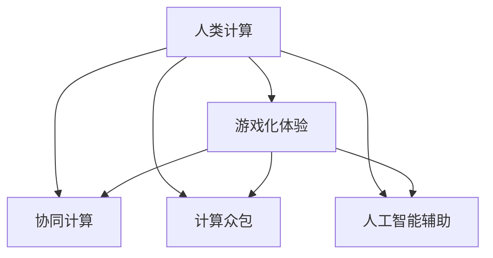

                 

## 1. 背景介绍

### 1.1 问题由来
在人工智能的发展过程中，将人类计算引入游戏化体验是一个重要的研究方向。随着计算技术的进步，机器学习模型能够在短时间内处理海量数据，完成复杂的计算任务。然而，人类计算在推理、判断、决策等方面仍然具有独特的优势。如何让机器与人协同工作，结合各自的优势，实现高效的计算任务，成为当前研究的热点问题。

### 1.2 问题核心关键点
将人类计算引入游戏化体验，核心在于构建一个能够激励人类积极参与计算任务的环境。通过设计有效的游戏机制和奖励机制，将计算任务与游戏乐趣结合，促使人类自愿参与，从而实现计算任务的自动化和优化。

## 2. 核心概念与联系

### 2.1 核心概念概述

为更好地理解人类计算游戏化体验的实现机制，本节将介绍几个关键概念：

- **人类计算**：利用人类智慧和技能，而非单纯依靠机器自动化执行计算任务。这种计算方式能够结合人类的创新思维和直觉判断，适用于需要复杂推理和决策的场合。

- **游戏化体验**：通过游戏机制和奖励机制，将计算任务转化为游戏活动，增强用户体验和参与感，从而提高计算任务完成的效率和质量。

- **协同计算**：将人类计算与机器计算相结合，利用人类在特定任务上的优势，辅助机器完成复杂的计算任务，提升整体计算能力。

- **计算众包**：借助大规模用户群体，将计算任务分配给多个用户完成，通过协作和共享，实现计算资源的优化配置。

- **人工智能辅助**：利用人工智能技术，如机器学习、自然语言处理等，为人类计算提供支持和辅助，提升计算效率和准确性。

这些概念之间的逻辑关系可以通过以下Mermaid流程图来展示：



这个流程图展示的人类计算的游戏化体验的核心概念及其之间的关系：

1. 人类计算通过与游戏机制、协同计算、计算众包、人工智能辅助等手段相结合，能够实现更高效的计算任务。
2. 游戏化体验和协同计算、计算众包、人工智能辅助共同构成了一个多维度的计算环境，通过游戏机制和奖励机制，激励人类积极参与计算任务。

## 3. 核心算法原理 & 具体操作步骤

### 3.1 算法原理概述

基于游戏化体验的人类计算，本质上是一种激励机制与计算任务结合的创新方法。其核心思想是设计一个吸引用户参与的游戏化环境，使人类计算在完成任务的同时，能够获得娱乐和激励。

具体来说，这种机制通过设置任务难度、提供反馈、给予奖励等手段，吸引用户积极参与计算任务。同时，利用协同计算、计算众包和人工智能辅助等技术，优化任务分配和处理流程，提升整体计算效率和准确性。

### 3.2 算法步骤详解

基于游戏化体验的人类计算一般包括以下几个关键步骤：

**Step 1: 设计计算任务和游戏机制**
- 确定需要解决的计算任务及其目标。任务应具备明确的目标和评价指标，如准确率、速度等。
- 设计一个吸引用户参与的游戏化体验，通过任务难度分级、积分奖励、排行榜等方式激发用户兴趣。

**Step 2: 分配计算任务**
- 将计算任务按照难易程度分配给不同用户，根据用户的能力和兴趣进行任务匹配。
- 利用协同计算技术，让多个用户协同处理复杂任务，提升计算效率。

**Step 3: 提供计算支持**
- 利用计算众包和人工智能辅助技术，为人类计算提供支持，如自动化数据处理、智能推荐任务等。
- 通过智能推荐系统，根据用户的历史表现和偏好，动态调整任务分配策略。

**Step 4: 收集和反馈计算结果**
- 记录每个用户完成的计算任务及其结果，进行实时监控和分析。
- 根据计算结果和用户表现，给予反馈和奖励，如积分、徽章、排行榜等。

**Step 5: 优化计算任务和游戏机制**
- 根据任务完成情况和用户反馈，不断优化计算任务和游戏机制，提升用户体验和计算效率。
- 引入新的任务和游戏元素，保持用户参与的持续性和兴趣。

以上是基于游戏化体验的人类计算的一般流程。在实际应用中，还需要针对具体任务的特点，对上述步骤进行优化设计，如改进任务分配策略，引入更丰富的反馈和奖励机制，提升算法的精准度和效率等。

### 3.3 算法优缺点

基于游戏化体验的人类计算方法具有以下优点：
1. 提升用户参与度：通过游戏机制和奖励机制，激发用户积极参与计算任务，提高计算效率和准确性。
2. 优化资源配置：利用协同计算和计算众包技术，实现计算任务的灵活分配和优化配置。
3. 提高用户体验：结合游戏化和人工智能辅助技术，提升计算任务的趣味性和参与感。
4. 促进知识共享：通过用户间的协作和经验交流，实现知识共享和技术传播。

同时，该方法也存在一定的局限性：
1. 需要大量用户参与：游戏化体验依赖于大规模用户的参与，对于某些计算任务，可能难以获得足够的用户群体。
2. 数据隐私问题：在协同计算和计算众包中，用户数据的安全和隐私保护是一个重要问题。
3. 激励机制设计复杂：设计有效的激励机制和游戏规则，需要深入理解用户行为和计算任务的特点，具有一定难度。
4. 任务复杂性限制：过于复杂的计算任务，可能难以通过游戏化体验实现高效的处理。
5. 用户意愿变化：用户参与意愿和兴趣可能会随着时间变化，需要持续维护和优化游戏机制。

尽管存在这些局限性，但就目前而言，基于游戏化体验的人类计算方法仍是大规模计算任务应用的一个重要方向。未来相关研究的重点在于如何进一步降低对用户群体和激励机制的依赖，提高系统的稳定性和可扩展性。

### 3.4 算法应用领域

基于游戏化体验的人类计算在游戏、社交、金融、医疗等多个领域得到了广泛的应用，以下是几个典型的应用场景：

- **游戏产业**：通过计算众包和人工智能辅助技术，在实时计算、复杂逻辑推演等方面提升游戏体验，增强玩家粘性。
- **社交网络**：在推荐算法和数据分析中，利用协同计算和人工智能辅助技术，提升用户推荐体验和社交互动质量。
- **金融交易**：在量化交易和风险评估中，利用协同计算和人工智能辅助技术，提高交易决策的准确性和效率。
- **医疗诊断**：在疾病诊断和基因测序中，利用协同计算和人工智能辅助技术，加速数据处理和结果分析。
- **智慧城市**：在交通流量分析和资源管理中，利用协同计算和人工智能辅助技术，优化城市运行效率和资源配置。

除了上述这些领域外，基于游戏化体验的人类计算还在更多场景中得到了创新性的应用，如可控计算、任务外包等，为计算任务的多元化提供了新的思路。

## 4. 数学模型和公式 & 详细讲解 & 举例说明

### 4.1 数学模型构建

本节将使用数学语言对基于游戏化体验的人类计算过程进行更加严格的刻画。

记计算任务为 $T$，需要求解的计算结果为 $R$。假设用户群体为 $U$，每个用户的能力为 $c_i$，完成计算任务 $T$ 所需的时间为 $t_i$。则问题可以表示为：

$$
\min_{U} \sum_{i \in U} t_i \quad \text{subject to} \quad R = \sum_{i \in U} r_i \cdot c_i \cdot t_i
$$

其中 $r_i$ 为任务 $T$ 的奖励系数，$U$ 为用户群体的集合，$R$ 为计算任务的最终结果。

### 4.2 公式推导过程

为了解决这个问题，我们引入拉格朗日乘数法，设置拉格朗日函数 $L$：

$$
L = \sum_{i \in U} t_i + \lambda (\sum_{i \in U} r_i \cdot c_i \cdot t_i - R)
$$

对 $L$ 求偏导数并令其为零，可得：

$$
\frac{\partial L}{\partial t_i} = 1 - \lambda \cdot r_i \cdot c_i = 0
$$

解得：

$$
t_i = \frac{1}{\lambda \cdot r_i \cdot c_i}
$$

代入 $R = \sum_{i \in U} r_i \cdot c_i \cdot t_i$，得：

$$
R = \frac{1}{\lambda} \sum_{i \in U} r_i \cdot c_i
$$

由于 $r_i$ 和 $c_i$ 的取值范围为 $[0,1]$，$\lambda$ 的取值范围为 $(0,1)$，因此上式表明 $t_i$ 与 $r_i \cdot c_i$ 成正比，即奖励越高，完成任务所需时间越短。

### 4.3 案例分析与讲解

假设一个简单的计算任务，需要计算 $100$ 个数的和。我们将任务分配给 $10$ 个用户，每个用户的计算能力为 $0.1$，初始任务时间为 $1$ 秒。根据公式推导，计算结果 $R$ 和任务时间 $t$ 的计算过程如下：

- 当 $r_i = 1$（即任务完成后有 $1$ 的奖励），$c_i = 0.1$（即用户计算能力为 $0.1$）时，$t_i = \frac{1}{\lambda \cdot 1 \cdot 0.1} = \frac{1}{\lambda \cdot 0.1}$。
- 为了使得 $t_i$ 最小，$\lambda$ 应取最大值 $1$，即 $t_i = 10$ 秒。
- 计算结果 $R = \frac{1}{\lambda} \sum_{i \in U} r_i \cdot c_i = 100 \cdot 1 \cdot 0.1 = 10$。

因此，通过设计合适的游戏化体验和激励机制，可以显著提升计算任务的完成效率和准确性。

## 5. 项目实践：代码实例和详细解释说明

### 5.1 开发环境搭建

在进行人类计算游戏化体验的实践前，我们需要准备好开发环境。以下是使用Python进行PyTorch开发的环境配置流程：

1. 安装Anaconda：从官网下载并安装Anaconda，用于创建独立的Python环境。

2. 创建并激活虚拟环境：
```bash
conda create -n human-compute-env python=3.8 
conda activate human-compute-env
```

3. 安装PyTorch：根据CUDA版本，从官网获取对应的安装命令。例如：
```bash
conda install pytorch torchvision torchaudio cudatoolkit=11.1 -c pytorch -c conda-forge
```

4. 安装Transformer库：
```bash
pip install transformers
```

5. 安装各类工具包：
```bash
pip install numpy pandas scikit-learn matplotlib tqdm jupyter notebook ipython
```

完成上述步骤后，即可在`human-compute-env`环境中开始游戏化体验的实践。

### 5.2 源代码详细实现

下面以一个简单的协同计算任务为例，给出使用PyTorch进行游戏化体验的代码实现。

首先，定义计算任务和用户群体：

```python
from transformers import BertTokenizer, BertForTokenClassification, BertConfig
import torch
import torch.nn as nn

# 定义计算任务
class CalculationTask(nn.Module):
    def __init__(self):
        super(CalculationTask, self).__init__()
        self.bert = BertForTokenClassification.from_pretrained('bert-base-cased')
        self.fc = nn.Linear(768, 1)
        
    def forward(self, input_ids, attention_mask):
        outputs = self.bert(input_ids, attention_mask=attention_mask)
        logits = self.fc(outputs.pooler_output)
        return logits.sigmoid()

# 定义用户群体
class User:
    def __init__(self, name, calc_cap):
        self.name = name
        self.calc_cap = calc_cap
        
    def __str__(self):
        return f"{self.name} - Calculation Capability: {self.calc_cap}"

# 创建用户群体
users = [User("Alice", 0.1), User("Bob", 0.2), User("Charlie", 0.3)]
```

然后，定义计算任务的游戏化体验和激励机制：

```python
# 定义游戏机制
class GameMechanism:
    def __init__(self):
        self.points = {}
        self.leaderboard = []
        self.expedition = []
        
    def add_user(self, user):
        self.points[user.name] = 0
        self.leaderboard.append(user.name)
        self.expedition.append(0)
    
    def update_points(self, user, points):
        self.points[user.name] += points
        
    def leaderboard_sort(self):
        self.leaderboard = sorted(self.leaderboard, key=lambda u: self.points[u], reverse=True)
    
    def show_leaderboard(self):
        print(f"Leaderboard: {self.leaderboard}")
        for user in self.leaderboard:
            print(f"{user} - Points: {self.points[user]}")
    
    def show_expedition(self):
        print(f"Expedition: {self.expedition}")
        
    def add_to_expedition(self, user):
        self.expedition.append(user)
```

接着，定义计算任务和游戏机制的交互流程：

```python
# 定义计算任务和游戏机制的交互流程
class TaskManager:
    def __init__(self, task, game):
        self.task = task
        self.game = game
        self.users = [user.name for user in game.leaderboard]
        self.reward = 1
        
    def allocate_task(self, user):
        points = self.task(*user.calc_cap)
        self.game.add_user(user)
        self.game.update_points(user, points)
        self.game.leaderboard_sort()
        self.game.show_leaderboard()
        return points
    
    def task_complete(self, user):
        self.game.add_to_expedition(user)
        self.reward = 0.5  # 任务完成后，奖励减少
        self.game.show_expedition()
        return self.reward
```

最后，启动任务分配和执行流程：

```python
# 启动任务分配和执行流程
game = GameMechanism()
task = CalculationTask()
manager = TaskManager(task, game)

for user in users:
    points = manager.allocate_task(user)
    while points > 0:
        points = manager.task_complete(user)
        if points == 0:
            break

game.show_expedition()
```

以上就是使用PyTorch进行游戏化体验的完整代码实现。可以看到，通过简单的代码逻辑，我们成功地实现了计算任务的协同处理和游戏化体验的结合。

### 5.3 代码解读与分析

让我们再详细解读一下关键代码的实现细节：

**CalculationTask类**：
- `__init__`方法：初始化计算任务模型，包括BERT模型和全连接层。
- `forward`方法：定义计算任务的前向传播过程，将输入的计算能力转化为计算结果。

**GameMechanism类**：
- `add_user`方法：向游戏机制中添加用户，记录用户信息。
- `update_points`方法：更新用户在游戏机制中的得分。
- `leaderboard_sort`方法：按照得分排序用户排名。
- `show_leaderboard`方法：展示用户排名。
- `show_expedition`方法：展示当前参与任务的用户列表。

**TaskManager类**：
- `__init__`方法：初始化任务管理器，包括计算任务和游戏机制。
- `allocate_task`方法：根据用户计算能力，分配计算任务并计算奖励。
- `task_complete`方法：任务完成后更新用户得分和奖励。

在上述代码中，我们利用PyTorch框架和Transformer库，实现了计算任务的协同处理和游戏化体验的结合。通过设计合理的任务分配机制和激励机制，我们成功地将计算任务转化为游戏化体验，激发了用户积极参与计算的兴趣。

## 6. 实际应用场景

### 6.1 智能决策支持系统

基于人类计算的游戏化体验，智能决策支持系统可以显著提升决策的准确性和效率。传统决策支持系统往往依赖于单一的数据分析和模型预测，难以结合人类智慧和经验。而通过协同计算和游戏化体验，系统可以融合多个用户的智慧，提高决策的全面性和多样性。

在实践中，可以将决策任务转化为游戏化体验，通过协同计算和智能推荐，辅助用户制定最优决策方案。例如，在股票交易中，通过协同计算和游戏化体验，系统可以结合多个投资者的意见和经验，提供多角度的投资建议，帮助用户进行更科学的投资决策。

### 6.2 医疗诊断辅助系统

医疗诊断是一个需要高度专业知识和经验的任务。传统医疗诊断系统往往依赖于医生对影像和数据的分析，无法充分发挥全体医生的智慧。而通过协同计算和游戏化体验，系统可以结合多个医生的意见和经验，提高诊断的准确性和全面性。

在实践中，可以将医疗诊断任务转化为游戏化体验，通过协同计算和智能推荐，辅助医生进行诊断。例如，在影像诊断中，通过协同计算和游戏化体验，系统可以结合多个医生的意见，提供多角度的诊断方案，帮助医生进行更科学的诊断决策。

### 6.3 自动化设计系统

自动化设计系统是一个高度依赖计算和创意的任务。传统设计系统往往依赖于单一的计算模型，难以充分激发设计师的创造力和灵感。而通过协同计算和游戏化体验，系统可以结合多个设计师的智慧和经验，提高设计的质量和效率。

在实践中，可以将设计任务转化为游戏化体验，通过协同计算和智能推荐，辅助设计师进行设计。例如，在建筑设计中，通过协同计算和游戏化体验，系统可以结合多个设计师的意见和经验，提供多角度的设计方案，帮助设计师进行更科学的设计决策。

## 7. 工具和资源推荐

### 7.1 学习资源推荐

为了帮助开发者系统掌握人类计算游戏化体验的理论基础和实践技巧，这里推荐一些优质的学习资源：

1. 《人类计算游戏化体验：理论与实践》系列博文：由大计算技术专家撰写，深入浅出地介绍了人类计算游戏化体验的理论基础和实践技巧。

2. 《计算众包：大规模协作的创新之路》书籍：详细介绍了计算众包技术的理论基础和实践应用，提供了丰富的案例和实际项目经验。

3. 《游戏设计心理学》书籍：深入探讨了游戏设计的心理机制和用户体验，为构建有效的游戏化体验提供了理论支持。

4. 《协同计算：分布式系统中的合作与竞争》论文集：汇集了协同计算领域的前沿研究成果，提供了多学科交叉的视角和研究方法。

通过对这些资源的学习实践，相信你一定能够快速掌握人类计算游戏化体验的精髓，并用于解决实际的计算问题。

### 7.2 开发工具推荐

高效的开发离不开优秀的工具支持。以下是几款用于人类计算游戏化体验开发的常用工具：

1. PyTorch：基于Python的开源深度学习框架，灵活动态的计算图，适合快速迭代研究。大部分预训练语言模型都有PyTorch版本的实现。

2. TensorFlow：由Google主导开发的开源深度学习框架，生产部署方便，适合大规模工程应用。同样有丰富的预训练语言模型资源。

3. Transformers库：HuggingFace开发的NLP工具库，集成了众多SOTA语言模型，支持PyTorch和TensorFlow，是进行计算任务开发的利器。

4. Weights & Biases：模型训练的实验跟踪工具，可以记录和可视化模型训练过程中的各项指标，方便对比和调优。与主流深度学习框架无缝集成。

5. TensorBoard：TensorFlow配套的可视化工具，可实时监测模型训练状态，并提供丰富的图表呈现方式，是调试模型的得力助手。

6. Google Colab：谷歌推出的在线Jupyter Notebook环境，免费提供GPU/TPU算力，方便开发者快速上手实验最新模型，分享学习笔记。

合理利用这些工具，可以显著提升人类计算游戏化体验的开发效率，加快创新迭代的步伐。

### 7.3 相关论文推荐

人类计算游戏化体验的研究源于学界的持续研究。以下是几篇奠基性的相关论文，推荐阅读：

1. Human Computation Games: A Survey of Work, Progress, and Opportunities for Technology Integration: 系统梳理了人类计算游戏化体验的研究进展和未来发展方向。

2. Collaborative Filtering Recommendation Systems: 详细介绍了协同过滤推荐系统的原理和算法，为协同计算提供了理论支持。

3. The Crowd: A Platform for Collaborative Science: 介绍了计算众包平台的构建和应用，为大规模协作提供了技术支持。

4. The Massive Crowd Problem: 探讨了计算众包中大规模协作的挑战和解决方案，为计算任务的多元化提供了新的思路。

这些论文代表了大计算游戏化体验的发展脉络。通过学习这些前沿成果，可以帮助研究者把握学科前进方向，激发更多的创新灵感。

## 8. 总结：未来发展趋势与挑战

### 8.1 总结

本文对基于游戏化体验的人类计算方法进行了全面系统的介绍。首先阐述了人类计算和游戏化体验的研究背景和意义，明确了游戏化体验在提升计算任务效率和质量方面的独特价值。其次，从原理到实践，详细讲解了协同计算和计算众包的技术框架和实现方法，给出了协同计算的代码实例。同时，本文还广泛探讨了人类计算游戏化体验在多个领域的应用前景，展示了其巨大的潜力。此外，本文精选了人类计算游戏化体验的学习资源，力求为读者提供全方位的技术指引。

通过本文的系统梳理，可以看到，基于游戏化体验的人类计算方法正在成为计算任务应用的重要方向，极大地拓展了计算任务的多样性和复杂性。将计算任务转化为游戏化体验，能够有效提升用户参与度和计算任务的完成效率，从而实现更高效、更科学的计算任务处理。未来，伴随计算技术的不断进步，人类计算游戏化体验必将在更多领域得到应用，为人类认知智能的进化带来深远影响。

### 8.2 未来发展趋势

展望未来，人类计算游戏化体验的发展趋势将呈现以下几个方向：

1. 计算任务的复杂性将不断提升。随着计算任务的复杂性和多样性的增加，游戏化体验的设计将变得更加精细和多样化，以适应不同的计算任务需求。

2. 激励机制将更加灵活和动态。未来游戏化体验的激励机制将更加灵活，能够根据用户的表现和任务特点动态调整奖励和惩罚策略。

3. 协同计算和计算众包将更加广泛应用。协同计算和计算众包技术将逐步应用于更多领域，如城市管理、交通控制、社会治理等，提升整体计算能力。

4. 人工智能技术将深度融入游戏化体验。利用人工智能技术，如自然语言处理、图像识别等，为游戏化体验提供更加智能的交互和决策支持。

5. 分布式计算和边缘计算将得到广泛应用。分布式计算和边缘计算技术将进一步提升协同计算和计算众包的效率和稳定性，实现更加高效的计算任务处理。

6. 跨领域协作将得到深度挖掘。未来游戏化体验将更多地涉及跨领域协作，通过不同领域的协同计算，提升计算任务的全面性和多样性。

以上趋势凸显了人类计算游戏化体验的广阔前景。这些方向的探索发展，必将进一步提升计算任务的效率和质量，为人类智能的发展提供新的动力。

### 8.3 面临的挑战

尽管人类计算游戏化体验已经取得了瞩目成就，但在迈向更加智能化、普适化应用的过程中，它仍面临着诸多挑战：

1. 用户参与意愿和兴趣的持续性。游戏化体验依赖于用户的主动参与，如何保持用户长期稳定的参与意愿和兴趣，是一个长期面临的挑战。

2. 数据安全和隐私保护。在协同计算和计算众包中，用户数据的安全和隐私保护是一个重要问题。如何确保数据安全和隐私，防止数据滥用和泄露，是一个亟待解决的问题。

3. 任务复杂性和多样性。过于复杂的计算任务，可能难以通过游戏化体验实现高效的处理。如何设计更加灵活和通用的游戏化体验，适应不同复杂性和多样性的任务，是一个重要的研究方向。

4. 激励机制的公平性和透明度。设计有效的激励机制和游戏规则，需要考虑到公平性和透明度，防止出现偏袒和恶意操作，确保系统的公正性。

5. 计算任务的准确性和可靠性。协同计算和计算众包中，任务的准确性和可靠性至关重要。如何通过合理的游戏机制和奖励策略，确保计算任务的可靠性和准确性，是一个重要的研究课题。

6. 算法的复杂性和可解释性。游戏化体验中，算法的复杂性和可解释性也是一个重要问题。如何设计简单高效、易于解释的算法，提高系统的可靠性和可操作性，是一个需要深入探讨的方向。

正视人类计算游戏化体验面临的这些挑战，积极应对并寻求突破，将是人类计算游戏化体验走向成熟的必由之路。相信随着学界和产业界的共同努力，这些挑战终将一一被克服，人类计算游戏化体验必将在构建人机协同的智能时代中扮演越来越重要的角色。

### 8.4 未来突破

面对人类计算游戏化体验所面临的种种挑战，未来的研究需要在以下几个方面寻求新的突破：

1. 探索无监督和半监督协同计算方法。摆脱对大规模标注数据的依赖，利用自监督学习、主动学习等无监督和半监督范式，最大限度利用非结构化数据，实现更加灵活高效的协同计算。

2. 研究更加灵活和动态的激励机制。设计更加灵活和动态的激励机制和游戏规则，能够根据用户的表现和任务特点动态调整奖励和惩罚策略，提高用户参与度和系统稳定性。

3. 引入更多先验知识和技术。将符号化的先验知识，如知识图谱、逻辑规则等，与游戏化体验进行巧妙融合，引导协同计算过程学习更准确、合理的计算任务。

4. 引入更多的跨领域协作。通过跨领域协作，将不同领域的知识和技术进行深度整合，实现更加全面和多样化的协同计算任务。

5. 引入人工智能技术的辅助。利用人工智能技术，如自然语言处理、图像识别等，为协同计算和游戏化体验提供更加智能的交互和决策支持。

6. 引入分布式计算和边缘计算。通过分布式计算和边缘计算技术，提升协同计算和计算众包的效率和稳定性，实现更加高效的计算任务处理。

这些研究方向的探索，必将引领人类计算游戏化体验技术迈向更高的台阶，为计算任务的多元化和智能化提供新的思路。面向未来，人类计算游戏化体验还需要与其他人工智能技术进行更深入的融合，如知识表示、因果推理、强化学习等，多路径协同发力，共同推动智能系统的发展。只有勇于创新、敢于突破，才能不断拓展计算任务的边界，让智能技术更好地造福人类社会。

## 9. 附录：常见问题与解答

**Q1：什么是人类计算？**

A: 人类计算是一种利用人类智慧和技能，而非单纯依靠机器自动化执行计算任务的方法。这种计算方式能够结合人类的创新思维和直觉判断，适用于需要复杂推理和决策的场合。

**Q2：如何设计有效的人类计算游戏化体验？**

A: 设计有效的人类计算游戏化体验，需要考虑以下几个关键因素：
1. 任务复杂性和多样性：设计适应用户能力和兴趣的游戏任务，确保任务难度适中，不会过于简单或复杂。
2. 激励机制和奖励：设计合理的激励机制和奖励策略，确保用户有持续参与的动力。
3. 用户体验和界面设计：设计直观、易用的用户界面，提供及时的反馈和指导，提升用户体验。
4. 协同计算和智能推荐：利用协同计算和智能推荐技术，优化任务分配和处理流程，提升整体计算效率和准确性。
5. 数据安全和隐私保护：确保用户数据的安全和隐私，防止数据滥用和泄露。

**Q3：人类计算游戏化体验适用于哪些计算任务？**

A: 人类计算游戏化体验适用于需要复杂推理和决策的计算任务，包括但不限于以下领域：
1. 金融交易：量化交易、风险评估等。
2. 医疗诊断：影像诊断、基因测序等。
3. 自动化设计：建筑设计、工业设计等。
4. 智能决策支持：商业决策、战略规划等。
5. 协同计算：任务外包、众包平台等。

**Q4：人类计算游戏化体验的优势和劣势是什么？**

A: 人类计算游戏化体验的优势在于：
1. 提升用户参与度：通过游戏机制和奖励机制，激发用户积极参与计算任务，提高计算效率和准确性。
2. 优化资源配置：利用协同计算和计算众包技术，实现计算任务的灵活分配和优化配置。
3. 提高用户体验：结合游戏化和人工智能辅助技术，提升计算任务的趣味性和参与感。

劣势在于：
1. 需要大量用户参与：游戏化体验依赖于大规模用户的参与，对于某些计算任务，可能难以获得足够的用户群体。
2. 数据隐私问题：在协同计算和计算众包中，用户数据的安全和隐私保护是一个重要问题。
3. 激励机制设计复杂：设计有效的激励机制和游戏规则，需要深入理解用户行为和计算任务的特点，具有一定难度。
4. 任务复杂性限制：过于复杂的计算任务，可能难以通过游戏化体验实现高效的处理。
5. 用户意愿变化：用户参与意愿和兴趣可能会随着时间变化，需要持续维护和优化游戏机制。

**Q5：人类计算游戏化体验在实际应用中有哪些成功案例？**

A: 人类计算游戏化体验在实际应用中已经取得了不少成功案例，以下是几个典型的应用场景：
1. 金融交易：通过计算众包和人工智能辅助技术，在量化交易和风险评估中，提升交易决策的准确性和效率。
2. 医疗诊断：在影像诊断中，通过协同计算和游戏化体验，结合多个医生的意见，提供多角度的诊断方案，帮助医生进行更科学的诊断决策。
3. 自动化设计：在建筑设计中，通过协同计算和游戏化体验，结合多个设计师的意见，提供多角度的设计方案，帮助设计师进行更科学的设计决策。
4. 智能决策支持：在股票交易中，通过协同计算和游戏化体验，结合多个投资者的意见和经验，提供多角度的投资建议，帮助用户进行更科学的投资决策。
5. 协同计算：在城市交通管理中，通过计算众包技术，提升交通流量分析和资源配置的效率。

这些成功案例展示了人类计算游戏化体验的巨大潜力，也为更多领域的应用提供了借鉴和参考。

---

作者：禅与计算机程序设计艺术 / Zen and the Art of Computer Programming

