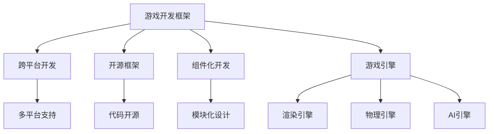

                 

## 1. 背景介绍

随着计算机图形学、人工智能、网络通信等技术的飞速发展，现代游戏开发的技术门槛和使用难度大幅降低。同时，跨平台、跨媒介、多人交互等特性，也使得游戏成为了最流行的娱乐方式之一。无论是移动游戏、PC游戏，还是主机游戏、虚拟现实游戏，都有着广阔的市场前景和发展潜力。

然而，游戏开发并不是一件易事。从项目策划到代码实现，从美术设计到音效制作，从UI/UX设计到性能优化，每一个环节都需要经过精心的规划和细致的打磨。特别是对于新手开发者来说，选择合适的游戏开发框架，可以显著降低学习曲线和开发难度，提升开发效率和产品质量。

本文将对目前最流行的游戏开发框架进行全面介绍，包括Unity、Unreal Engine、Cocos2d-x等。通过对比这些框架的优缺点、适用场景和应用案例，希望能够帮助读者选择最适合自己的游戏开发框架，提升开发水平。

## 2. 核心概念与联系

### 2.1 核心概念概述

为更好地理解游戏开发框架的选择与应用，本节将介绍几个关键概念：

- **游戏开发框架（Game Development Framework）**：是指提供一套统一的游戏开发工具、组件、库和API，简化游戏开发流程，提升开发效率和产品质量的软件平台。
- **跨平台开发（Cross-platform Development）**：指游戏开发框架能够支持多平台（如Windows、macOS、Linux、iOS、Android等）的开发和部署，降低跨平台开发的复杂度。
- **开源框架（Open Source Framework）**：指游戏开发框架的源代码开放，支持社区贡献，能够根据自身需求进行定制和优化。
- **组件化开发（Component-based Development）**：指游戏开发框架支持以组件形式组织和管理游戏代码，方便模块化设计和代码重用。
- **游戏引擎（Game Engine）**：是一种用于游戏开发的软件工具，包含渲染引擎、物理引擎、AI引擎等功能模块，提供完整的开发平台和工具链。

这些核心概念之间有着紧密的联系，共同构成了游戏开发框架的基础。游戏开发框架的选型和应用，需要考虑开发效率、跨平台能力、开源性、组件化程度以及游戏引擎的特性等因素。

### 2.2 核心概念原理和架构的 Mermaid 流程图



这个流程图展示了游戏开发框架与核心概念之间的联系。游戏开发框架通过跨平台开发、开源框架、组件化开发等特性，支持多平台、高灵活性和高效开发，同时借助游戏引擎提供的渲染、物理和AI功能，提升游戏的视听效果和交互体验。

## 3. 核心算法原理 & 具体操作步骤

### 3.1 算法原理概述

游戏开发框架的核心算法原理主要包括以下几个方面：

- **渲染算法**：用于生成游戏场景中的图形和动画，常见的渲染算法包括DirectX、OpenGL、Vulkan等。
- **物理算法**：用于模拟游戏物体的运动和碰撞，常见的物理算法包括刚体动力学、碰撞检测等。
- **AI算法**：用于实现游戏角色的行为和决策，常见的AI算法包括行为树、状态机、深度学习等。
- **网络算法**：用于支持多人在线游戏的网络通信和同步，常见的算法包括TCP/IP、UDP、P2P等。

### 3.2 算法步骤详解

选择游戏开发框架的基本步骤包括：

1. **需求分析**：明确项目的需求和目标，包括游戏类型、平台、性能要求等。
2. **框架对比**：对比不同的游戏开发框架，评估其性能、跨平台能力、组件化程度、开源性等。
3. **试用和评估**：在项目开发的不同阶段，对选定的框架进行试用和评估，调整框架配置。
4. **定制和优化**：根据项目需求和实际效果，对框架进行定制和优化，提升开发效率和产品质量。

### 3.3 算法优缺点

- **Unity**：
  - **优点**：跨平台开发能力强，组件化程度高，社区活跃，生态丰富。
  - **缺点**：渲染性能略低于Unreal Engine，不支持物理模拟和物理沙盒。
  
- **Unreal Engine**：
  - **优点**：渲染性能优越，支持物理模拟和物理沙盒，适合大型和复杂游戏开发。
  - **缺点**：跨平台开发能力稍逊于Unity，组件化程度一般，社区相对较少。
  
- **Cocos2d-x**：
  - **优点**：轻量级，适用于2D游戏开发，支持多平台。
  - **缺点**：组件化程度较低，生态相对较少，渲染性能一般。

### 3.4 算法应用领域

- **Unity**：适用于几乎所有类型的游戏开发，包括2D、3D、AR、VR等。适用于开发独立游戏、手机游戏、网页游戏等。
- **Unreal Engine**：适合开发大型和复杂游戏，如3A大作、模拟类游戏、开放世界游戏等。适用于主机游戏、PC游戏、VR游戏等。
- **Cocos2d-x**：适用于2D游戏开发，如平台游戏、塔防游戏、角色扮演游戏等。适用于手机游戏、网页游戏等。

## 4. 数学模型和公式 & 详细讲解 & 举例说明

### 4.1 数学模型构建

游戏开发框架的数学模型主要涉及以下几个方面：

- **渲染数学**：用于描述3D场景的几何和光照，包括矩阵变换、纹理映射、光照模型等。
- **物理数学**：用于模拟游戏物体的运动和碰撞，包括刚体动力学、碰撞检测等。
- **AI数学**：用于实现游戏角色的行为和决策，包括行为树、状态机、深度学习等。

### 4.2 公式推导过程

以Unity中的光照模型为例，推导常见的Phong光照模型：

- **环境光**：环境光照射到物体上的平均光强，记为 $I_{ambient}$。
- **漫反射光**：物体表面反射的环境光，记为 $I_{diffuse}$。
- **镜面反射光**：物体表面反射的光源光，记为 $I_{specular}$。

$$
I_{total} = I_{ambient} + I_{diffuse} + I_{specular}
$$

其中：

- $I_{diffuse} = I_{light} * diffuse * cos(\theta)$，$I_{specular} = I_{light} * specular * cos(\theta)^n$。

**推导过程**：
- 环境光 $I_{ambient}$ 是一个常量，通常设置为场景平均光强。
- 漫反射光 $I_{diffuse}$ 和镜面反射光 $I_{specular}$ 取决于光源强度 $I_{light}$、材质属性（如漫反射系数、镜面反射系数）以及光源角度 $\theta$ 和指数 $n$。

### 4.3 案例分析与讲解

以Unity中的Phong光照模型为例，分析其应用场景和效果：

- **应用场景**：Phong光照模型常用于创建逼真的光影效果，适用于大型开放世界游戏和角色扮演游戏。
- **效果分析**：Phong光照模型能够模拟出复杂的光照效果，如反射、折射、阴影等，提升游戏的真实感和沉浸感。

## 5. 项目实践：代码实例和详细解释说明

### 5.1 开发环境搭建

选择一个合适的游戏开发框架，搭建开发环境是第一步。以下是选择和搭建Unity开发环境的示例：

1. **安装Unity Hub**：
```bash
curl -o UnityHubInstaller.exe https://UnityHub.io/Installer/3.0.0/Windows
```
2. **安装Unity编辑器**：
```bash
UnityHubInstaller.exe
```
3. **创建新项目**：
```bash
Unity Hub
```
4. **配置开发环境**：
```bash
Configure Unity Hub
```

### 5.2 源代码详细实现

在Unity中创建一个简单的2D游戏，代码示例如下：

1. **创建游戏场景**：
```csharp
using UnityEngine;
using System.Collections;

public class GameScene : MonoBehaviour
{
    void Start()
    {
        GameManager.instance.StartGame();
    }
}
```
2. **创建角色对象**：
```csharp
using UnityEngine;
using System.Collections;

public class Player : MonoBehaviour
{
    void Update()
    {
        float moveX = Input.GetAxis("Horizontal");
        float moveY = Input.GetAxis("Vertical");

        transform.Translate(moveX, 0, moveY);
    }
}
```
3. **创建游戏管理器**：
```csharp
using UnityEngine;
using System.Collections;

public class GameManager : MonoBehaviour
{
    void StartGame()
    {
        // 创建角色对象
        GameObject player = Instantiate playerPrefab;
        player.transform.position = new Vector3(0, 0, 0);

        // 初始化游戏状态
        gameState = GameState.Play;
    }
}
```

### 5.3 代码解读与分析

上述代码展示了Unity中创建游戏场景、角色对象和游戏管理器的基本流程：

- **GameScene**：在场景中创建游戏管理器实例，并在Start方法中启动游戏。
- **Player**：角色对象的基本运动控制，使用GetAxis方法获取水平和垂直方向的输入，通过Translate方法移动角色位置。
- **GameManager**：游戏管理器，负责初始化游戏状态，包括创建角色对象等。

通过这些基本代码，可以初步了解Unity的开发流程和组件化设计。

### 5.4 运行结果展示

运行上述代码，可以看到角色对象在屏幕上移动，并响应玩家的输入。游戏场景和角色对象的使用，展示了Unity组件化开发的特点和高效性。

## 6. 实际应用场景

### 6.1 手机游戏开发

手机游戏开发是游戏开发框架应用最广泛的场景之一。以下以Unity为例，展示手机游戏开发的典型流程：

1. **设计游戏**：确定游戏类型、玩法、场景等。
2. **搭建开发环境**：安装Unity Hub，下载并安装Unity编辑器。
3. **创建项目**：在Unity Hub中创建新项目，设置游戏配置。
4. **编写代码**：编写角色、场景、道具等对象的脚本代码，进行功能开发。
5. **调试和优化**：在Unity编辑器中调试游戏，优化性能和用户体验。
6. **发布游戏**：导出APK或 IPA，发布到应用商店或私人渠道。

### 6.2 独立游戏开发

独立游戏开发是指不受商业约束、追求艺术表达和创意表达的游戏开发。以下以Unreal Engine为例，展示独立游戏开发的典型流程：

1. **确定主题**：确定游戏主题和玩法，如解谜、冒险、沙盒等。
2. **创建项目**：在Unreal Engine中创建新项目，设置游戏引擎和配置。
3. **编写代码**：编写游戏逻辑、渲染效果、物理模拟等代码，进行功能开发。
4. **调试和优化**：在Unreal Engine编辑器中调试游戏，优化性能和用户体验。
5. **发布游戏**：导出可执行文件，发布到游戏平台或独立渠道。

### 6.3 VR游戏开发

VR游戏开发是指利用虚拟现实技术，提供沉浸式游戏体验。以下以Cocos2d-x为例，展示VR游戏开发的典型流程：

1. **确定游戏**：确定游戏主题和玩法，如模拟、训练、交互等。
2. **创建项目**：在Cocos2d-x中创建新项目，设置游戏引擎和配置。
3. **编写代码**：编写游戏逻辑、交互效果、物理模拟等代码，进行功能开发。
4. **调试和优化**：在Cocos2d-x编辑器中调试游戏，优化性能和用户体验。
5. **发布游戏**：导出可执行文件，发布到VR平台或游戏平台。

## 7. 工具和资源推荐

### 7.1 学习资源推荐

- **Unity官方文档**：
```bash
https://docs.unity3d.com
```
- **Unreal Engine官方文档**：
```bash
https://docs.unrealengine.com
```
- **Cocos2d-x官方文档**：
```bash
https://docs.cocos2d-x.org
```

### 7.2 开发工具推荐

- **Unity编辑器**：
```bash
https://unity3d.com
```
- **Unreal Engine编辑器**：
```bash
https://www.unrealengine.com
```
- **Cocos2d-x编辑器**：
```bash
https://cocos2d-x.org
```

### 7.3 相关论文推荐

- **《A Survey on Game Development Frameworks》**：
```bash
https://arxiv.org/abs/1905.13704
```
- **《The State of Real-Time GPU Rendering》**：
```bash
https://arxiv.org/abs/2009.09714
```
- **《AI and Game Design: A Survey》**：
```bash
https://arxiv.org/abs/2003.02753
```

## 8. 总结：未来发展趋势与挑战

### 8.1 研究成果总结

本文全面介绍了Unity、Unreal Engine、Cocos2d-x等主流游戏开发框架的特点和应用场景。通过对比分析，帮助读者选择合适的游戏开发框架，提升开发效率和产品质量。同时，通过代码实例和详细解释，展示了游戏开发框架的实际应用流程。

### 8.2 未来发展趋势

未来，游戏开发框架将继续向以下方向发展：

- **跨平台开发**：游戏开发框架将更加注重跨平台开发能力，支持多设备、多平台的游戏开发和部署。
- **组件化开发**：组件化开发将成为游戏开发框架的主流趋势，方便模块化设计和代码重用。
- **开源社区**：开源社区将成为游戏开发框架的重要组成部分，推动游戏开发技术的持续进步。
- **AI和机器学习**：AI和机器学习将在游戏开发中发挥更大的作用，提升游戏智能化水平。
- **虚拟现实和增强现实**：VR和AR技术将为游戏开发带来新的体验和可能性，推动游戏领域的创新发展。

### 8.3 面临的挑战

尽管游戏开发框架取得了显著进展，但仍面临以下挑战：

- **性能瓶颈**：大型和复杂游戏对性能的要求越来越高，如何提升渲染和物理模拟的性能，是游戏开发框架需要解决的关键问题。
- **跨平台兼容性**：不同平台的游戏开发需要考虑兼容性问题，如何保证代码在不同平台上的稳定性和一致性，是一个重要的挑战。
- **社区和生态**：游戏开发框架的生态和社区支持对开发者来说至关重要，如何吸引更多开发者加入，形成活跃的社区，是框架发展的关键。
- **安全性**：游戏开发框架的安全性问题不容忽视，如何防范恶意代码和攻击，保护用户数据安全，是开发者需要重视的问题。
- **标准化**：游戏开发框架的标准化程度有待提高，如何制定统一的标准和规范，推动行业规范化发展，是未来的重要方向。

### 8.4 研究展望

未来，游戏开发框架的研究展望包括：

- **高性能渲染引擎**：开发更高效、更强大的渲染引擎，支持多线程、异构计算等技术，提升游戏性能。
- **智能游戏引擎**：结合AI和机器学习技术，提升游戏智能化水平，实现自动生成内容、自动优化等能力。
- **跨平台开发工具**：开发统一的跨平台开发工具，支持多平台的游戏开发和部署，降低开发复杂度。
- **安全性和隐私保护**：加强游戏开发框架的安全性和隐私保护，防范恶意代码和攻击，保护用户数据安全。
- **标准化和规范化**：制定统一的游戏开发框架标准和规范，推动行业规范化发展，提升游戏开发水平。

## 9. 附录：常见问题与解答

**Q1: 如何选择适合自己的游戏开发框架？**

A: 选择游戏开发框架时，需要考虑以下几个因素：

1. **项目需求**：确定游戏类型、玩法、平台等需求，选择适合的框架。
2. **开发效率**：评估框架的开发效率和易用性，选择开发效率高的框架。
3. **社区和生态**：考虑框架的社区活跃度、生态资源，选择资源丰富的框架。
4. **性能和稳定性**：评估框架的性能和稳定性，选择性能可靠、稳定性强的框架。

**Q2: 如何提升游戏开发框架的性能？**

A: 提升游戏开发框架的性能，需要从以下几个方面入手：

1. **优化算法**：优化渲染算法、物理算法、AI算法等，提升游戏性能。
2. **优化代码**：优化代码结构，减少冗余代码，提升代码效率。
3. **优化资源**：优化资源管理，减少内存和带宽的消耗，提升性能。
4. **优化硬件**：选择合适的硬件设备，如GPU、CPU等，提升游戏性能。

**Q3: 游戏开发框架的未来发展方向是什么？**

A: 游戏开发框架的未来发展方向包括：

1. **跨平台开发**：支持多平台的游戏开发和部署，降低开发复杂度。
2. **组件化开发**：支持模块化设计和代码重用，提升开发效率。
3. **AI和机器学习**：提升游戏智能化水平，实现自动生成内容、自动优化等能力。
4. **虚拟现实和增强现实**：支持VR和AR技术，提升游戏体验。
5. **安全性和隐私保护**：加强框架的安全性和隐私保护，防范恶意代码和攻击。

**Q4: 如何构建高质量的游戏开发框架？**

A: 构建高质量的游戏开发框架，需要从以下几个方面入手：

1. **算法优化**：优化渲染算法、物理算法、AI算法等，提升游戏性能。
2. **代码优化**：优化代码结构，减少冗余代码，提升代码效率。
3. **资源优化**：优化资源管理，减少内存和带宽的消耗，提升性能。
4. **社区和生态**：建立活跃的社区，提供丰富的生态资源，吸引更多开发者加入。
5. **标准化和规范化**：制定统一的游戏开发框架标准和规范，推动行业规范化发展。

作者：禅与计算机程序设计艺术 / Zen and the Art of Computer Programming

