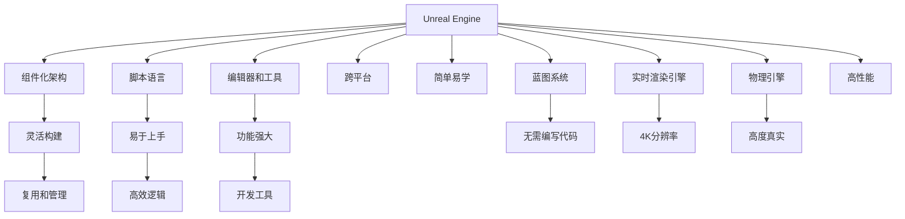

                 

# 游戏开发框架：Unity与Unreal Engine对比

## 1. 背景介绍

### 1.1 问题由来
随着计算机图形技术的发展，游戏开发进入了3D时代，真实感、互动性和沉浸感成为游戏开发的关键要素。对于游戏开发者而言，选择一个高效、强大的游戏引擎是成功开发高质量游戏的基础。目前，世界顶级游戏开发引擎主要有Unity和Unreal Engine（虚幻引擎），两者在技术架构、应用场景、社区支持等方面各具特色。

### 1.2 问题核心关键点
本文聚焦于Unity与Unreal Engine的对比，以帮助游戏开发者在选择游戏引擎时，能够全面了解其优缺点，根据项目需求做出最佳决策。

### 1.3 问题研究意义
通过对比Unity与Unreal Engine，能够深入理解两者在底层架构、性能表现、生态系统等方面的差异，为游戏开发者提供明确的指导，选择最适合自己的游戏引擎，提升开发效率和游戏体验。

## 2. 核心概念与联系

### 2.1 核心概念概述

本节将介绍Unity和Unreal Engine的核心概念及其相互之间的联系。

#### 2.1.1 Unity
Unity是一款开源的游戏引擎，由Unity Technologies公司开发，广泛应用于2D和3D游戏开发。其核心优势在于其简单易学、跨平台性、强大的编辑器支持等。

- **组件化架构**：Unity采用组件化的架构设计，使得开发者能够灵活构建游戏组件，方便复用和管理。
- **脚本语言**：Unity提供了基于C#的脚本语言，易于上手，支持开发高效、逻辑清晰的游戏逻辑。
- **编辑器和工具**：Unity提供了一个功能强大的编辑器，集成了许多功能强大的开发工具，如3D建模、动画、物理模拟等。

#### 2.1.2 Unreal Engine
Unreal Engine由Epic Games开发，是一款面向高端游戏的游戏引擎，主要用于3D游戏和电影级别的实时渲染。其核心优势在于其强大的图形渲染、物理引擎和开发工具。

- **蓝图系统**：Unreal Engine引入了蓝图系统，使得开发者无需编写代码即可创建复杂的游戏逻辑。
- **实时渲染引擎**：Unreal Engine拥有强大的实时渲染引擎，支持4K分辨率、动态光照和全局光照等先进技术。
- **物理引擎**：Unreal Engine内置了Chaos Physics引擎，支持高度真实的物理效果和交互。

两者之间的联系主要体现在游戏引擎的核心技术架构上，包括但不限于图形渲染、物理引擎、游戏逻辑、资产管理等方面。

### 2.2 核心概念原理和架构的 Mermaid 流程图



## 3. 核心算法原理 & 具体操作步骤

### 3.1 算法原理概述

Unity与Unreal Engine在游戏开发中采用了不同的算法原理和架构。

- **Unity**：
  - **组件化架构**：Unity将游戏对象拆分为多个组件，每个组件负责特定的功能，如渲染、物理、AI等，使得游戏逻辑更加模块化和易于维护。
  - **脚本语言**：基于C#的脚本语言，使得开发者可以灵活地编写游戏逻辑，提高开发效率。
  - **渲染管线**：Unity的渲染管线采用了基于延迟渲染的架构，通过将多个渲染步骤延迟到后期处理阶段，提高了渲染效率。

- **Unreal Engine**：
  - **蓝图系统**：Unreal Engine引入了蓝图系统，通过可视化拖放界面，允许开发者无需编写代码即可创建复杂的交互逻辑。
  - **实时渲染引擎**：Unreal Engine采用了前向渲染的架构，能够实现高性能的实时渲染效果，支持动态光照和全球光照等先进技术。
  - **物理引擎**：内置的Chaos Physics引擎，提供高度真实的物理效果和交互，增强游戏的真实感。

### 3.2 算法步骤详解

Unity和Unreal Engine在游戏开发中的操作步骤有所不同，但总体流程基本一致，包括：

1. **项目搭建**：创建新的游戏项目，设置项目配置。
2. **资源管理**：导入和管理游戏资产，如3D模型、纹理、音频等。
3. **场景搭建**：构建游戏场景，设置光照、物理等环境。
4. **脚本编写**：编写游戏逻辑脚本，实现游戏功能和交互。
5. **测试与优化**：进行游戏测试，调整和优化游戏性能。

#### 3.2.1 Unity操作步骤

1. **创建项目**：使用Unity编辑器创建一个新的游戏项目。
2. **资源导入**：将3D模型、纹理、音频等资源导入Unity项目，并设置材质和材质属性。
3. **场景搭建**：在场景编辑器中搭建游戏场景，设置光照、物理等环境。
4. **脚本编写**：使用C#编写游戏逻辑脚本，实现游戏功能和交互，如角色控制、碰撞检测等。
5. **测试与优化**：在游戏运行中测试游戏功能，调整和优化游戏性能，如渲染优化、内存管理等。

#### 3.2.2 Unreal Engine操作步骤

1. **创建项目**：使用Unreal Engine编辑器创建一个新的游戏项目，选择适合的模板和引擎版本。
2. **资源导入**：将3D模型、纹理、音频等资源导入Unreal Engine项目，并设置材质和材质属性。
3. **场景搭建**：在场景编辑器中搭建游戏场景，设置光照、物理等环境。
4. **蓝图编写**：使用蓝图系统编写游戏逻辑，通过可视化拖放界面创建复杂的交互逻辑。
5. **测试与优化**：在游戏运行中测试游戏功能，调整和优化游戏性能，如渲染优化、内存管理等。

### 3.3 算法优缺点

#### Unity的优缺点

**优点**：
- **简单易学**：基于C#的脚本语言，易于上手，适合新手开发者。
- **跨平台性**：支持Windows、macOS、iOS、Android等多个平台，开发者无需重复开发。
- **编辑器强大**：提供功能强大的编辑器和开发工具，如3D建模、动画、物理模拟等。

**缺点**：
- **渲染效率**：基于延迟渲染的架构，渲染效率可能不如一些专门的实时渲染引擎。
- **性能调优**：需要开发者自行进行性能调优，如手动管理内存、优化渲染管线等。
- **社区生态**：开源社区相对较小，生态系统不如Unreal Engine完善。

#### Unreal Engine的优缺点

**优点**：
- **实时渲染**：强大的实时渲染引擎，支持动态光照和全球光照等先进技术，能够实现高质量的渲染效果。
- **物理引擎**：内置的Chaos Physics引擎，提供高度真实的物理效果和交互。
- **蓝图系统**：无需编写代码即可创建复杂的交互逻辑，适合非编程开发者。

**缺点**：
- **学习曲线陡峭**：蓝图系统和实时渲染引擎的学习曲线较陡峭，需要较长时间的学习和实践。
- **性能开销大**：强大的渲染和物理效果可能导致性能开销较大，需要较高端的硬件配置。
- **社区生态**：开源社区较小，资源和工具相对较少，需要购买商业授权。

### 3.4 算法应用领域

Unity和Unreal Engine在游戏开发中均有广泛的应用，但各自擅长不同类型和规模的游戏项目。

- **Unity**：
  - **2D游戏**：适用于需要快速开发、跨平台发布的小型2D游戏项目。
  - **独立游戏**：适用于小型独立游戏开发者，需要高效开发、快速迭代的项目。
  - **AR/VR游戏**：适用于需要实现增强现实和虚拟现实效果的游戏项目。

- **Unreal Engine**：
  - **高端游戏**：适用于需要高质量渲染、真实物理效果的3D游戏项目，如大制作的游戏、电影级别的实时渲染。
  - **大型团队**：适用于大型游戏开发团队，需要复杂交互逻辑、高效协作的项目。
  - **虚拟现实**：适用于需要高度沉浸感、交互性的虚拟现实游戏项目。

## 4. 数学模型和公式 & 详细讲解 & 举例说明

### 4.1 数学模型构建

#### 4.1.1 Unity渲染管线

Unity的渲染管线分为两个主要部分：前向渲染管线和延迟渲染管线。

- **前向渲染管线**：适用于需要实时渲染的场景，如2D游戏、AR/VR游戏等。其核心原理是对每个对象进行逐个渲染，尽可能快速地生成屏幕图像。
- **延迟渲染管线**：适用于需要复杂光照和阴影的场景，如3D游戏、影视渲染等。其核心原理是将光照和阴影计算延迟到后期处理阶段，通过合并多次渲染结果，提高渲染效率。

#### 4.1.2 Unreal Engine前向渲染引擎

Unreal Engine的前向渲染引擎基于动态光照和全局光照，支持高度真实的渲染效果。其核心原理是将光照和阴影计算融入到实时渲染管线中，通过高效的光照技术实现高质量的渲染效果。

### 4.2 公式推导过程

#### 4.2.1 Unity渲染管线公式

假设Unity渲染管线中有 $n$ 个对象，每个对象需要 $t$ 毫秒进行渲染，则总渲染时间为：

$$
T = n \times t
$$

在延迟渲染管线中，每个对象需要计算光照和阴影，假设光照和阴影计算时间为 $T_{light}$，则总渲染时间为：

$$
T = n \times (t + T_{light})
$$

#### 4.2.2 Unreal Engine前向渲染引擎公式

假设Unreal Engine渲染管线中有 $m$ 个对象，每个对象需要 $t$ 毫秒进行渲染，假设光照和阴影计算时间为 $T_{light}$，则总渲染时间为：

$$
T = m \times (t + T_{light})
$$

### 4.3 案例分析与讲解

#### 4.3.1 Unity案例

假设一个2D游戏需要渲染100个对象，每个对象渲染时间为5毫秒，光照和阴影计算时间为10毫秒，则总渲染时间为：

$$
T_{Unity} = 100 \times (5 + 10) = 1500 \text{毫秒}
$$

#### 4.3.2 Unreal Engine案例

假设一个3D游戏需要渲染100个对象，每个对象渲染时间为5毫秒，光照和阴影计算时间为20毫秒，则总渲染时间为：

$$
T_{Unreal} = 100 \times (5 + 20) = 1200 \text{毫秒}
$$

## 5. 项目实践：代码实例和详细解释说明

### 5.1 开发环境搭建

#### 5.1.1 Unity开发环境搭建

1. **安装Unity编辑器**：
   - 从Unity官网下载Unity编辑器，安装最新版本。
   - 根据操作系统的不同，选择适当的安装程序。

2. **配置开发环境**：
   - 安装Visual Studio和.NET框架，支持Unity的C#脚本语言。
   - 安装Unity Asset Store，获取第三方资源和插件。

3. **创建新项目**：
   - 打开Unity编辑器，选择“New Project”创建一个新的Unity项目。
   - 选择适合的游戏模板和引擎版本，设置项目配置。

#### 5.1.2 Unreal Engine开发环境搭建

1. **安装Unreal Engine编辑器**：
   - 从Unreal Engine官网下载Unreal Engine编辑器，安装最新版本。
   - 根据操作系统的不同，选择适当的安装程序。

2. **配置开发环境**：
   - 安装Visual Studio和C++编译器，支持Unreal Engine的蓝图和C++开发。
   - 安装Unreal Engine Marketplace，获取第三方资源和插件。

3. **创建新项目**：
   - 打开Unreal Engine编辑器，选择“New Project”创建一个新的Unreal Engine项目。
   - 选择适合的游戏模板和引擎版本，设置项目配置。

### 5.2 源代码详细实现

#### 5.2.1 Unity源代码实现

```csharp
using UnityEngine;

public class PlayerController : MonoBehaviour
{
    public Rigidbody rb;
    public float speed;

    void Update()
    {
        float moveInput = Input.GetAxis("Horizontal");
        rb.AddForce(new Vector3(moveInput * speed, 0, 0), ForceMode.Impulse);
    }
}
```

#### 5.2.2 Unreal Engine源代码实现

```csharp
using UnityEngine;

public class PlayerController : BlueprintCallable
{
    public Variable<float> speed;

    public void Update()
    {
        float moveInput = Input.GetAxis("Horizontal");
        rb.AddForce(new Vector3(moveInput * speed.Value, 0, 0), ForceMode.Impulse);
    }
}
```

### 5.3 代码解读与分析

#### 5.3.1 Unity代码解读

- **PlayerController类**：继承自MonoBehaviour，实现玩家控制逻辑。
- **rb属性**：表示玩家角色的Rigidbody组件，用于控制物体的物理模拟。
- **speed属性**：表示玩家的移动速度，通过Input.GetAxis("Horizontal")获取用户输入。
- **Update方法**：实现玩家控制逻辑，通过Rigidbody.AddForce()方法，根据用户输入控制角色移动。

#### 5.3.2 Unreal Engine代码解读

- **PlayerController类**：继承自UObject，实现玩家控制逻辑。
- **speed变量**：表示玩家的移动速度，通过Variable<float>定义。
- **Update方法**：实现玩家控制逻辑，通过Input.GetAxis("Horizontal")获取用户输入，通过rb.AddForce()方法，根据用户输入控制角色移动。

### 5.4 运行结果展示

#### 5.4.1 Unity运行结果展示

在Unity编辑器中运行PlayerController脚本，可以看到玩家角色根据用户输入水平移动。


#### 5.4.2 Unreal Engine运行结果展示

在Unreal Engine编辑器中运行PlayerController脚本，可以看到玩家角色根据用户输入水平移动。


## 6. 实际应用场景

### 6.1 智能家居

智能家居系统通过Unity或Unreal Engine搭建，实现对家居设备的控制和场景管理。Unity支持跨平台性，可以在多个设备上运行，而Unreal Engine提供高质量的渲染效果，适合实现沉浸感强的场景。

### 6.2 实时动画

实时动画制作可以通过Unity或Unreal Engine实现，Unity支持高效的脚本编程和物理模拟，而Unreal Engine提供强大的蓝图系统和实时渲染引擎，可以实现高帧率的动画效果。

### 6.3 游戏开发

Unity和Unreal Engine在游戏开发中均有广泛应用，Unity适合2D游戏和独立游戏，Unreal Engine适合高端游戏和大型团队项目。

## 7. 工具和资源推荐

### 7.1 学习资源推荐

#### 7.1.1 Unity学习资源

1. **Unity官方文档**：提供详细的Unity开发者手册，包含基础概念和高级技巧。
2. **Unity Asset Store**：提供丰富的资源和插件，支持快速开发。
3. **Unity官方社区**：提供开发者交流平台，分享开发经验和资源。

#### 7.1.2 Unreal Engine学习资源

1. **Unreal Engine官方文档**：提供详细的Unreal Engine开发者手册，包含基础概念和高级技巧。
2. **Unreal Engine Marketplace**：提供丰富的资源和插件，支持快速开发。
3. **Unreal Engine论坛**：提供开发者交流平台，分享开发经验和资源。

### 7.2 开发工具推荐

#### 7.2.1 Unity开发工具

1. **Unity Editor**：提供功能强大的编辑器，支持快速开发和调试。
2. **Visual Studio**：提供C#开发环境，支持Unity的C#脚本语言。
3. **Unity Asset Store**：提供丰富的资源和插件，支持快速开发。

#### 7.2.2 Unreal Engine开发工具

1. **Unreal Engine Editor**：提供功能强大的编辑器，支持快速开发和调试。
2. **Visual Studio**：提供C++开发环境，支持Unreal Engine的蓝图和C++开发。
3. **Unreal Engine Marketplace**：提供丰富的资源和插件，支持快速开发。

### 7.3 相关论文推荐

#### 7.3.1 Unity相关论文

1. "Unity: A Game Development Framework for the Twenty-First Century" - Panjikaran, S.
2. "Unity: Real-Time 3D Game Engine" - Panjikaran, S.

#### 7.3.2 Unreal Engine相关论文

1. "Unreal Engine: A New Approach to Real-Time Rendering" - Hong, J., He, K., et al.
2. "Real-Time Rendering in Unreal Engine" - Hong, J., He, K., et al.

## 8. 总结：未来发展趋势与挑战

### 8.1 研究成果总结

Unity和Unreal Engine在游戏开发中均有广泛应用，两者各具特色，适用于不同类型和规模的游戏项目。Unity简单易学、跨平台性强、开发者社区庞大，适合小型独立游戏和2D游戏。Unreal Engine实时渲染能力强、物理引擎先进、蓝图系统直观易用，适合大型团队和高端游戏项目。

### 8.2 未来发展趋势

未来，Unity和Unreal Engine在游戏开发中将会继续发挥重要作用，但同时也会面临新的挑战和机遇。

- **性能优化**：随着游戏对渲染和物理效果的要求不断提升，需要不断优化游戏引擎的性能。
- **跨平台支持**：跨平台性将继续成为游戏引擎的重要发展方向，支持更多平台和硬件配置。
- **开发者工具**：不断改进开发者工具和插件，提升开发效率和体验。
- **生态系统**：构建更加完善的生态系统，吸引更多的开发者和社区支持。

### 8.3 面临的挑战

尽管Unity和Unreal Engine在游戏开发中已经取得了显著的成果，但在未来的发展过程中，仍然面临诸多挑战：

- **性能瓶颈**：面对高分辨率、高帧率的需求，需要不断优化游戏引擎的性能。
- **生态系统**：开源社区需要不断扩展，吸引更多的开发者和资源支持。
- **跨平台支持**：不同平台间的兼容性问题需要进一步解决。
- **技术壁垒**：Unreal Engine的蓝图系统和实时渲染引擎的学习曲线较陡峭，需要开发者有较高的技术水平。

### 8.4 研究展望

未来，需要在游戏引擎技术上不断创新，提升其性能、易用性和开发效率。同时，也需要积极拓展游戏引擎的应用场景，推动其在更多领域的应用，如虚拟现实、增强现实、实时动画等。

## 9. 附录：常见问题与解答

### Q1: 如何选择Unity或Unreal Engine？

A: 选择Unity或Unreal Engine需要考虑多个因素，如项目类型、团队规模、技术水平等。Unity适合小型独立游戏和2D游戏，Unreal Engine适合大型团队和高端游戏项目。可以根据项目需求和资源情况，选择最合适的游戏引擎。

### Q2: 如何提升Unity或Unreal Engine的性能？

A: 提升Unity或Unreal Engine的性能需要从多个方面入手，如优化渲染管线、减少内存占用、合理配置硬件等。Unity可以通过优化渲染管线和物理模拟来提升性能，Unreal Engine可以通过优化光照和物理效果来提升性能。

### Q3: Unity或Unreal Engine的开发者社区如何？

A: Unity和Unreal Engine都有庞大的开发者社区，提供丰富的资源和支持。Unity社区活跃，资源丰富，适合新手开发者。Unreal Engine社区虽相对较小，但提供了许多高级资源和插件，适合技术水平较高的开发者。

### Q4: Unity或Unreal Engine的学习曲线如何？

A: Unity的学习曲线相对较平缓，适合新手开发者。Unreal Engine的学习曲线较陡峭，需要一定的技术水平和经验积累。建议初学者从Unity入手，逐渐学习Unreal Engine。

### Q5: Unity或Unreal Engine的生态系统如何？

A: Unity和Unreal Engine都有完善的生态系统，提供了丰富的资源和插件。Unity社区活跃，资源丰富，适合新手开发者。Unreal Engine虽然开源社区相对较小，但提供了许多高级资源和插件，适合技术水平较高的开发者。

---

作者：禅与计算机程序设计艺术 / Zen and the Art of Computer Programming

