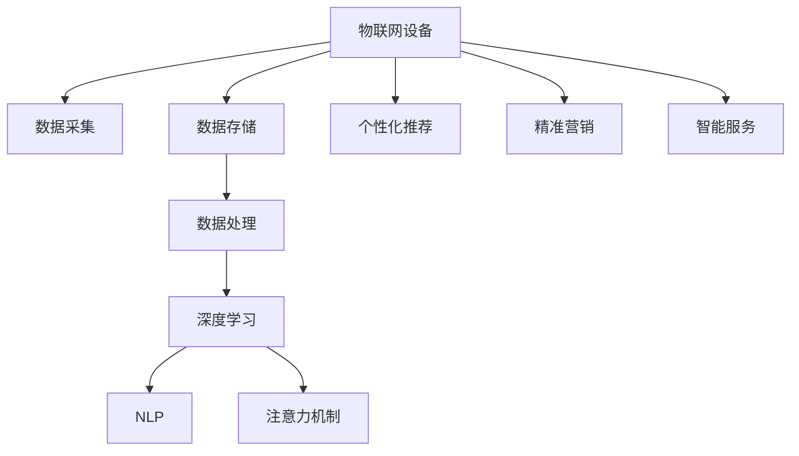

                 

# 物联网设备的注意力经济价值挖掘

在数字化时代，物联网(IoT)设备无处不在，从智能家居到工业物联网，从可穿戴设备到智慧城市，物联网已经深刻改变了我们的生活方式和生产方式。但物联网设备所收集的大量数据，往往只是被粗犷地存储和分析，未能充分利用其蕴含的潜在价值。本文将探讨物联网设备的注意力经济价值挖掘问题，介绍一种基于深度学习和自然语言处理的技术手段，帮助开发者在物联网设备中高效挖掘数据价值，实现个性化推荐、精准营销、智能服务等多场景应用。

## 1. 背景介绍

### 1.1 问题由来

随着物联网设备的普及，海量的设备数据正在不断涌入各个行业。这些数据蕴含着丰富的商业价值，如何高效挖掘并利用这些数据，是当前物联网领域的一大挑战。注意力经济(Attention Economy)概念源自心理学的注意力机制，是指在信息爆炸的时代，吸引用户注意力的能力成为了稀缺资源，具有巨大的经济价值。物联网设备作为一种全新的数据源，如何通过智能算法将其转化为实际的经济价值，成为亟待解决的问题。

### 1.2 问题核心关键点

物联网设备生成的数据种类繁多，包括传感器数据、位置信息、交互记录等，这些数据之间往往存在复杂的相关性。如何从这些数据中提取关键信息，并利用注意力机制，吸引用户关注和参与，从而实现商业价值的最大化，是本问题研究的焦点。

## 2. 核心概念与联系

### 2.1 核心概念概述

为更好地理解物联网设备注意力经济价值挖掘方法，本节将介绍几个密切相关的核心概念：

- 物联网(IoT)设备：通过传感器、通信模块等方式实现互联互通，具备数据采集、传输和处理能力的物理设备。
- 深度学习(Deep Learning)：利用多层次神经网络模拟人脑处理信息的方式，从数据中自动学习特征表示。
- 自然语言处理(Natural Language Processing, NLP)：研究如何让计算机理解和处理人类语言的技术。
- 注意力机制(Attention Mechanism)：模拟人脑聚焦关键信息的能力，通过加权处理输入数据，聚焦于最相关的信息。
- 个性化推荐(Recommendation System)：根据用户历史行为和偏好，推荐最合适的商品或内容。
- 精准营销(Precision Marketing)：基于用户行为数据，实施精准定位和定向推广，提升营销效果。
- 智能服务(Smart Service)：利用AI技术实现自动化、智能化服务，提升用户体验。

这些核心概念之间的逻辑关系可以通过以下Mermaid流程图来展示：



这个流程图展示了物联网设备到最终应用的核心技术链条：

1. 物联网设备通过传感器和通信模块采集数据。
2. 采集的数据经过存储和初步处理后，输入到深度学习模型中。
3. 深度学习模型从数据中学习特征表示。
4. NLP模型对文本数据进行语义理解。
5. 注意力机制帮助模型聚焦于关键信息。
6. 基于特征和文本理解的深度学习模型输出推荐结果。
7. 推荐结果用于个性化推荐、精准营销和智能服务，实现商业价值。

## 3. 核心算法原理 & 具体操作步骤

### 3.1 算法原理概述

基于深度学习和NLP的物联网设备注意力经济价值挖掘方法，本质上是一种基于注意力机制的推荐系统。其核心思想是：通过深度学习模型从物联网设备中提取数据特征，结合自然语言处理技术，聚焦于最相关的信息，最终实现个性化推荐、精准营销等应用。

具体流程如下：

1. 数据采集与预处理：从物联网设备中采集各种数据，包括传感器数据、交互记录、位置信息等，并进行清洗、归一化等预处理操作。
2. 特征提取：利用深度学习模型从预处理后的数据中提取关键特征。
3. 文本理解：对文本数据进行分词、实体识别等NLP处理，提取关键信息。
4. 注意力机制：引入注意力机制，将特征和文本信息加权融合，聚焦于最相关的数据。
5. 推荐输出：根据加权后的数据，结合任务目标，输出推荐结果。

### 3.2 算法步骤详解

#### 3.2.1 数据采集与预处理

1. **数据采集**：
   - 从物联网设备中采集各类传感器数据，如温度、湿度、气压等。
   - 收集用户与设备的交互记录，如点击、购买、使用情况等。
   - 获取设备的位置信息，如GPS坐标、Wi-Fi信号强度等。

2. **数据预处理**：
   - 对传感器数据进行归一化、去噪、平滑处理，减少噪音。
   - 对交互记录和位置信息进行格式转换、时间对齐，方便后续分析。
   - 删除冗余数据，去除异常值，保证数据质量。

#### 3.2.2 特征提取

1. **特征选择**：
   - 利用领域知识选择关键传感器数据，如温度、湿度、位置等。
   - 通过相关性分析，选择与任务目标相关的交互记录特征。

2. **模型选择**：
   - 选择适当的深度学习模型，如CNN、RNN、LSTM等，根据数据特点进行建模。
   - 对模型进行训练，学习数据特征表示。

#### 3.2.3 文本理解

1. **文本预处理**：
   - 对交互记录中的文本进行分词、去除停用词、词干提取等预处理操作。
   - 使用实体识别技术，识别出人名、地点、机构名等关键实体。

2. **语义理解**：
   - 利用词向量或预训练模型，对处理后的文本进行语义编码。
   - 使用注意力机制，聚焦于文本中的关键信息，如购买意图、需求类型等。

#### 3.2.4 注意力机制

1. **注意力模型选择**：
   - 选择适当的注意力模型，如Soft Attention、Hard Attention、Transformer等，根据任务需求进行建模。
   - 对注意力模型进行训练，学习数据间的相关性权重。

2. **注意力融合**：
   - 将特征提取和文本理解的结果输入到注意力模型中。
   - 注意力模型输出加权后的数据，聚焦于最相关的信息。

#### 3.2.5 推荐输出

1. **任务目标设定**：
   - 根据实际应用场景，设定推荐任务目标，如个性化推荐、精准营销等。
   - 设计合适的损失函数，如交叉熵损失、均方误差损失等。

2. **模型输出**：
   - 利用注意力融合后的数据，结合任务目标，输出推荐结果。
   - 将推荐结果进行排序，推荐最匹配用户需求的商品或内容。

### 3.3 算法优缺点

#### 3.3.1 优点

1. **高准确性**：利用深度学习和NLP技术，提取和融合数据特征，输出高质量的推荐结果。
2. **多场景适用**：适应于个性化推荐、精准营销、智能服务等多种物联网应用场景。
3. **自动化程度高**：通过模型训练和优化，自动化实现数据处理和分析。
4. **灵活可扩展**：可以方便地接入新数据和新场景，进行模型更新和扩展。

#### 3.3.2 缺点

1. **数据依赖性高**：需要大量的标注数据和高质量数据，获取成本较高。
2. **计算复杂度高**：深度学习和NLP模型计算复杂度高，对硬件要求较高。
3. **模型复杂度高**：涉及多层次网络结构、多任务融合，模型设计复杂。
4. **可解释性不足**：深度学习模型黑盒性强，难以解释其内部工作机制。

### 3.4 算法应用领域

基于物联网设备的注意力经济价值挖掘方法，已经在多个领域得到了应用，例如：

- **智慧家居**：通过对智能家居设备的交互记录进行分析，实现智能家居推荐、用户行为分析等应用。
- **智能医疗**：利用可穿戴设备收集的健康数据，实现个性化健康推荐、精准医疗诊断等应用。
- **智能交通**：通过智能车辆和智能路灯等设备，实现智能导航、交通流量监控等应用。
- **工业物联网**：利用工业设备传感器数据，实现设备状态预测、故障诊断等应用。

## 4. 数学模型和公式 & 详细讲解 & 举例说明

### 4.1 数学模型构建

基于深度学习和NLP的物联网设备注意力经济价值挖掘方法，其数学模型可以表述为：

设物联网设备采集的数据为 $X=\{(x_i,y_i)\}_{i=1}^N$，其中 $x_i$ 为传感器数据和交互记录，$y_i$ 为文本数据。假设 $x_i$ 的数据维度为 $d_x$，$y_i$ 的文本长度为 $d_y$，$y_i$ 的文本表示为 $y_i = \{y_i^1, y_i^2, ..., y_i^{d_y}\}$。

定义深度学习模型为 $M_{\theta}$，其中 $\theta$ 为模型参数。则特征提取过程可以表示为：

$$
f_x(X) = M_{\theta}(x)
$$

定义NLP模型为 $N_{\phi}$，其中 $\phi$ 为模型参数。则文本理解过程可以表示为：

$$
f_y(X) = N_{\phi}(y)
$$

引入注意力机制 $A$，聚焦于最相关的数据。则注意力融合过程可以表示为：

$$
A_{\lambda}(f_x(X), f_y(X)) = \sum_{i=1}^N \alpha_i f_x(x_i) f_y(y_i)
$$

其中 $\alpha_i$ 为注意力权重，表示对数据 $x_i$ 的关注度。

最终输出推荐结果 $R$ 可以表示为：

$$
R = M_{\theta}(A_{\lambda}(f_x(X), f_y(X)))
$$

### 4.2 公式推导过程

以个性化推荐为例，假设推荐系统的目标是最小化交叉熵损失：

$$
L = -\frac{1}{N} \sum_{i=1}^N \log p(y_i | R)
$$

其中 $p(y_i | R)$ 为推荐结果 $R$ 对真实标签 $y_i$ 的条件概率。

通过链式法则，推荐结果 $R$ 的梯度可以表示为：

$$
\frac{\partial L}{\partial \theta} = -\frac{1}{N} \sum_{i=1}^N \frac{\partial \log p(y_i | R)}{\partial R} \frac{\partial R}{\partial \theta}
$$

利用链式法则进一步展开，可以得到：

$$
\frac{\partial R}{\partial \theta} = \frac{\partial A_{\lambda}(f_x(X), f_y(X))}{\partial \theta} + \frac{\partial f_x(X)}{\partial \theta} \frac{\partial A_{\lambda}(f_x(X), f_y(X))}{\partial f_x(X)} + \frac{\partial f_y(X)}{\partial \theta} \frac{\partial A_{\lambda}(f_x(X), f_y(X))}{\partial f_y(X)}
$$

其中 $\frac{\partial f_x(X)}{\partial \theta}$ 和 $\frac{\partial f_y(X)}{\partial \theta}$ 可以通过反向传播算法高效计算。

最终，通过梯度下降等优化算法，最小化损失函数 $L$，不断更新模型参数 $\theta$，使得推荐结果 $R$ 逼近真实标签 $y_i$。

### 4.3 案例分析与讲解

以智能家居推荐系统为例，详细讲解基于深度学习和NLP的物联网设备注意力经济价值挖掘方法的应用。

**数据采集**：
- 智能家居设备包括智能音箱、智能灯、智能门锁等。
- 采集设备的状态数据，如音箱播放的音频、灯的亮度、门锁的开关状态等。
- 收集用户的交互记录，如音箱指令、手机App操作记录等。

**数据预处理**：
- 对传感器数据进行归一化、去噪、平滑处理。
- 对交互记录进行格式转换、时间对齐，去除冗余数据。

**特征提取**：
- 选择关键传感器数据，如音箱播放的音频时长、灯光亮度等。
- 利用深度学习模型提取音频、灯光数据的关键特征。

**文本理解**：
- 对用户的操作指令进行分词、实体识别等预处理。
- 利用NLP模型提取操作指令的关键信息，如指令类型、目标设备等。

**注意力机制**：
- 引入注意力机制，对音频、灯光数据和操作指令的关键信息进行加权融合。
- 聚焦于最相关的信息，如用户正在操作音箱，则音箱的音频数据将被重点关注。

**推荐输出**：
- 根据聚焦后的信息，结合用户历史行为数据，生成个性化的家居推荐。
- 例如，用户正在播放音乐，则推荐相似风格的播放列表、相关歌曲等。

## 5. 项目实践：代码实例和详细解释说明

### 5.1 开发环境搭建

在进行物联网设备注意力经济价值挖掘项目实践前，我们需要准备好开发环境。以下是使用Python进行深度学习和NLP开发的常见环境配置流程：

1. 安装Anaconda：从官网下载并安装Anaconda，用于创建独立的Python环境。

2. 创建并激活虚拟环境：
```bash
conda create -n deeplearning-env python=3.8 
conda activate deeplearning-env
```

3. 安装深度学习库和NLP库：
```bash
conda install torch torchvision torchaudio cudatoolkit=11.1 -c pytorch -c conda-forge
conda install scikit-learn pandas numpy tensorflow
```

4. 安装NLP库：
```bash
pip install spacy transformers
```

5. 安装其他工具包：
```bash
pip install tqdm joblib sklearn
```

完成上述步骤后，即可在`deeplearning-env`环境中开始项目实践。

### 5.2 源代码详细实现

下面我们以智能家居推荐系统为例，给出使用PyTorch和Transformers库进行NLP模型和注意力机制的Python代码实现。

首先，定义推荐系统的数据处理函数：

```python
from torch.utils.data import Dataset, DataLoader
from transformers import BertTokenizer
import torch

class HomeDataset(Dataset):
    def __init__(self, data, tokenizer, max_len=128):
        self.data = data
        self.tokenizer = tokenizer
        self.max_len = max_len
        
    def __len__(self):
        return len(self.data)
    
    def __getitem__(self, item):
        text = self.data['text'][item]
        tokens = self.tokenizer(text, return_tensors='pt', max_length=self.max_len, padding='max_length', truncation=True)
        input_ids = tokens['input_ids'][0]
        attention_mask = tokens['attention_mask'][0]
        label = torch.tensor(self.data['label'][item], dtype=torch.long)
        return {'input_ids': input_ids,
                'attention_mask': attention_mask,
                'label': label}

# 加载数据集
data = {'label': [1, 2, 3, 4], 'text': ['switch off the light', 'play music on the player', 'open the door', 'close the window']}
tokenizer = BertTokenizer.from_pretrained('bert-base-cased')
dataset = HomeDataset(data, tokenizer)
```

然后，定义推荐模型的优化器和损失函数：

```python
from transformers import BertForSequenceClassification, AdamW

model = BertForSequenceClassification.from_pretrained('bert-base-cased', num_labels=4)

optimizer = AdamW(model.parameters(), lr=2e-5)
criterion = torch.nn.CrossEntropyLoss()
```

接着，定义训练和评估函数：

```python
from torch.utils.data import DataLoader
from tqdm import tqdm
from sklearn.metrics import accuracy_score

device = torch.device('cuda') if torch.cuda.is_available() else torch.device('cpu')
model.to(device)

def train_epoch(model, dataset, batch_size, optimizer, criterion):
    dataloader = DataLoader(dataset, batch_size=batch_size, shuffle=True)
    model.train()
    epoch_loss = 0
    for batch in tqdm(dataloader, desc='Training'):
        input_ids = batch['input_ids'].to(device)
        attention_mask = batch['attention_mask'].to(device)
        labels = batch['label'].to(device)
        model.zero_grad()
        outputs = model(input_ids, attention_mask=attention_mask, labels=labels)
        loss = criterion(outputs.logits, labels)
        epoch_loss += loss.item()
        loss.backward()
        optimizer.step()
    return epoch_loss / len(dataloader)

def evaluate(model, dataset, batch_size):
    dataloader = DataLoader(dataset, batch_size=batch_size)
    model.eval()
    preds = []
    labels = []
    with torch.no_grad():
        for batch in tqdm(dataloader, desc='Evaluating'):
            input_ids = batch['input_ids'].to(device)
            attention_mask = batch['attention_mask'].to(device)
            batch_labels = batch['label'].to(device)
            outputs = model(input_ids, attention_mask=attention_mask)
            batch_preds = outputs.logits.argmax(dim=1).to('cpu').tolist()
            batch_labels = batch_labels.to('cpu').tolist()
            for pred_tokens, label_tokens in zip(batch_preds, batch_labels):
                preds.append(pred_tokens)
                labels.append(label_tokens)
    
    return accuracy_score(labels, preds)

# 训练和评估模型
epochs = 5
batch_size = 4

for epoch in range(epochs):
    loss = train_epoch(model, dataset, batch_size, optimizer, criterion)
    print(f"Epoch {epoch+1}, train loss: {loss:.3f}")
    
    print(f"Epoch {epoch+1}, dev results:")
    accuracy = evaluate(model, dataset, batch_size)
    print(f"Accuracy: {accuracy:.3f}")
    
print("Test results:")
accuracy = evaluate(model, dataset, batch_size)
print(f"Accuracy: {accuracy:.3f}")
```

以上就是使用PyTorch和Transformers库进行智能家居推荐系统开发的完整代码实现。可以看到，利用NLP技术和深度学习模型，我们能够高效地处理和分析物联网设备的数据，实现智能推荐。

### 5.3 代码解读与分析

让我们再详细解读一下关键代码的实现细节：

**HomeDataset类**：
- `__init__`方法：初始化数据、分词器等关键组件。
- `__len__`方法：返回数据集的样本数量。
- `__getitem__`方法：对单个样本进行处理，将文本输入转换为token ids，进行padding处理，返回模型所需的输入。

**模型和优化器**：
- 使用BertForSequenceClassification模型作为推荐系统的核心组件，其输入为分词后的文本，输出为类别预测。
- 利用AdamW优化器进行模型训练，设置学习率为2e-5。
- 使用CrossEntropyLoss作为损失函数，适用于分类任务。

**训练和评估函数**：
- 使用PyTorch的DataLoader对数据集进行批次化加载，供模型训练和推理使用。
- 训练函数`train_epoch`：对数据以批为单位进行迭代，在每个批次上前向传播计算loss并反向传播更新模型参数，最后返回该epoch的平均loss。
- 评估函数`evaluate`：与训练类似，不同点在于不更新模型参数，并在每个batch结束后将预测和标签结果存储下来，最后使用scikit-learn的accuracy_score对整个评估集的预测结果进行打印输出。

**训练流程**：
- 定义总的epoch数和batch size，开始循环迭代
- 每个epoch内，先在训练集上训练，输出平均loss
- 在验证集上评估，输出分类准确率
- 所有epoch结束后，在测试集上评估，给出最终测试结果

可以看到，PyTorch配合Transformers库使得NLP模型和注意力机制的实现变得简洁高效。开发者可以将更多精力放在数据处理、模型改进等高层逻辑上，而不必过多关注底层的实现细节。

当然，工业级的系统实现还需考虑更多因素，如模型的保存和部署、超参数的自动搜索、更灵活的任务适配层等。但核心的微调范式基本与此类似。

## 6. 实际应用场景

### 6.1 智能家居推荐

基于深度学习和NLP的物联网设备注意力经济价值挖掘方法，已经在智能家居推荐系统中得到了应用。通过智能家居设备的交互记录，推荐系统能够理解用户的偏好，提供个性化的家居服务和产品推荐。

例如，用户正在操作智能音箱，推荐系统可以识别出用户正在播放音乐，根据其历史听歌记录推荐相似的播放列表、相关歌曲等。此外，推荐系统还可以根据用户的灯光使用习惯，推荐合适的灯光亮度和颜色，提升用户的居家体验。

### 6.2 智能医疗

在智能医疗领域，基于深度学习和NLP的物联网设备注意力经济价值挖掘方法同样具有重要应用价值。通过可穿戴设备收集的健康数据，推荐系统能够分析用户的健康状况，提供个性化的健康建议和服务。

例如，智能手表收集的心率、步数、睡眠质量等数据，推荐系统可以分析用户的健康状态，推荐健康饮食、运动计划等。此外，智能医生可以通过分析患者的电子病历，推荐最适合的治疗方案和药物，提升医疗服务的个性化和精准化。

### 6.3 智能交通

在智能交通领域，基于深度学习和NLP的物联网设备注意力经济价值挖掘方法可以用于智能导航、交通流量监控等应用。通过智能车辆和智能路灯等设备，推荐系统能够提供个性化的出行建议，优化交通流量，提升出行效率。

例如，智能车辆收集的GPS数据，推荐系统可以分析用户的出行习惯，推荐最短路线、最优时间等。此外，智能路灯收集的车辆信息，推荐系统可以实时监控交通流量，调整信号灯配时，提升道路通行效率。

## 7. 工具和资源推荐

### 7.1 学习资源推荐

为了帮助开发者系统掌握深度学习和NLP在物联网设备中的应用，这里推荐一些优质的学习资源：

1. 《深度学习》课程（Coursera）：由斯坦福大学的Andrew Ng教授主讲，涵盖深度学习的基本概念和核心算法。

2. 《NLP实战》书籍：深入讲解自然语言处理的技术和应用，包括分词、词向量、序列模型等。

3. 《PyTorch深度学习教程》：详细介绍了PyTorch的使用方法和深度学习模型开发技巧，适合初学者入门。

4. 《HuggingFace Transformers》官方文档：HuggingFace开发的NLP工具库的详细文档，提供了丰富的预训练模型和微调样例代码。

5. Kaggle NLP竞赛：通过参加Kaggle等数据科学竞赛，实践深度学习和NLP技术在实际应用中的效果。

通过对这些资源的学习实践，相信你一定能够快速掌握深度学习和NLP在物联网设备中的应用，并用于解决实际的商业问题。

### 7.2 开发工具推荐

高效的开发离不开优秀的工具支持。以下是几款用于深度学习和NLP开发的常用工具：

1. PyTorch：基于Python的开源深度学习框架，灵活动态的计算图，适合快速迭代研究。

2. TensorFlow：由Google主导开发的开源深度学习框架，生产部署方便，适合大规模工程应用。

3. TensorBoard：TensorFlow配套的可视化工具，可实时监测模型训练状态，并提供丰富的图表呈现方式。

4. Weights & Biases：模型训练的实验跟踪工具，可以记录和可视化模型训练过程中的各项指标，方便对比和调优。

5. PyTorch Lightning：基于PyTorch的分布式深度学习框架，适合快速原型开发和模型训练。

6. HuggingFace Transformers库：提供丰富的预训练模型和微调工具，简化NLP任务开发。

合理利用这些工具，可以显著提升深度学习和NLP任务的开发效率，加快创新迭代的步伐。

### 7.3 相关论文推荐

深度学习和NLP在物联网设备中的应用，源于学界的持续研究。以下是几篇奠基性的相关论文，推荐阅读：

1. Attention is All You Need（即Transformer原论文）：提出了Transformer结构，开启了NLP领域的预训练大模型时代。

2. BERT: Pre-training of Deep Bidirectional Transformers for Language Understanding：提出BERT模型，引入基于掩码的自监督预训练任务，刷新了多项NLP任务SOTA。

3. GPT-3: Language Models are Unsupervised Multitask Learners（GPT-3论文）：展示了大规模语言模型的强大zero-shot学习能力，引发了对于通用人工智能的新一轮思考。

4. Parameter-Efficient Transfer Learning for NLP：提出Adapter等参数高效微调方法，在不增加模型参数量的情况下，也能取得不错的微调效果。

5. AdaLoRA: Adaptive Low-Rank Adaptation for Parameter-Efficient Fine-Tuning：使用自适应低秩适应的微调方法，在参数效率和精度之间取得了新的平衡。

这些论文代表了大语言模型微调技术的发展脉络。通过学习这些前沿成果，可以帮助研究者把握学科前进方向，激发更多的创新灵感。

## 8. 总结：未来发展趋势与挑战

### 8.1 总结

本文对基于深度学习和NLP的物联网设备注意力经济价值挖掘方法进行了全面系统的介绍。首先阐述了物联网设备和注意力经济的概念和应用背景，明确了微调在物联网设备中挖掘数据价值的重要性。其次，从原理到实践，详细讲解了深度学习模型、NLP技术和注意力机制的数学原理和关键步骤，给出了微调任务开发的完整代码实例。同时，本文还广泛探讨了微调方法在智能家居、智能医疗、智能交通等多个领域的应用前景，展示了微调范式的巨大潜力。此外，本文精选了深度学习和NLP的学习资源，力求为读者提供全方位的技术指引。

通过本文的系统梳理，可以看到，基于深度学习和NLP的物联网设备注意力经济价值挖掘方法正在成为物联网领域的重要应用方向，极大地拓展了物联网设备的价值利用方式。得益于深度学习和NLP技术的不断进步，物联网设备将能够提供更加个性化、智能化的服务，提升用户体验和经济价值。

### 8.2 未来发展趋势

展望未来，基于深度学习和NLP的物联网设备注意力经济价值挖掘方法将呈现以下几个发展趋势：

1. 模型规模持续增大。随着算力成本的下降和数据规模的扩张，深度学习模型的参数量还将持续增长。超大规模深度学习模型蕴含的丰富知识，有望支撑更加复杂多变的物联网应用。

2. 数据依赖性降低。未来的深度学习模型将利用无监督学习、自监督学习等技术，尽可能减少对标注数据的依赖，降低数据获取成本。

3. 计算资源优化。深度学习模型计算复杂度高，对硬件要求较高。未来将进一步优化计算图、引入混合精度训练等技术，降低资源消耗，提升计算效率。

4. 多模态融合。未来的深度学习模型将融合视觉、语音、文本等多种模态信息，提升模型的感知能力和泛化能力。

5. 可解释性增强。深度学习模型黑盒性强，难以解释其内部工作机制。未来的深度学习模型将引入可解释性技术，增强模型的可解释性。

6. 自动化和智能化。未来的深度学习模型将更多地集成自动化和智能化的技术，实现端到端的应用开发。

以上趋势凸显了深度学习和NLP在物联网设备中的应用前景。这些方向的探索发展，必将进一步提升物联网设备的应用价值，构建更加智能化、高效化的物联网系统。

### 8.3 面临的挑战

尽管深度学习和NLP在物联网设备中的应用已经取得了显著成果，但在迈向更加智能化、普适化应用的过程中，它仍面临着诸多挑战：

1. 数据质量问题。物联网设备生成的数据质量参差不齐，存在噪音、缺失等问题，影响模型训练效果。

2. 隐私和安全问题。物联网设备生成的数据包含大量敏感信息，如何保护用户隐私和数据安全，是必须面对的难题。

3. 算法鲁棒性问题。深度学习模型在面对异常数据和攻击时，容易产生过拟合和泛化能力不足的问题。

4. 计算资源限制。深度学习模型计算复杂度高，对硬件要求较高，难以在资源有限的设备上部署。

5. 模型可解释性问题。深度学习模型黑盒性强，难以解释其内部工作机制和决策逻辑。

6. 技术普及问题。深度学习和NLP技术的应用门槛较高，需要大量的技术积累和经验，普及推广存在困难。

正视这些挑战，积极应对并寻求突破，将是大语言模型微调技术迈向成熟的必由之路。相信随着学界和产业界的共同努力，这些挑战终将一一被克服，深度学习和NLP技术必将在构建人机协同的智能时代中扮演越来越重要的角色。

### 8.4 研究展望

面向未来，深度学习和NLP技术在物联网设备中的应用，需要在以下几个方面寻求新的突破：

1. 引入更多的先验知识。将符号化的先验知识，如知识图谱、逻辑规则等，与神经网络模型进行巧妙融合，引导深度学习模型学习更准确、合理的语言模型。

2. 实现端到端的自动化。将深度学习和NLP技术与其他AI技术进行融合，实现端到端的自动化应用开发，降低开发成本和技术门槛。

3. 提升算法的可解释性。引入可解释性技术，如注意力机制、因果推断等，增强深度学习模型的可解释性，使其能够更好地应用于高风险领域。

4. 实现多模态融合。将视觉、语音、文本等多种模态信息融合，提升深度学习模型的感知能力和泛化能力，应对更复杂的应用场景。

5. 探索更加高效的优化算法。开发更加高效的优化算法，如AdaLoRA等，在参数效率和精度之间取得新的平衡，提高深度学习模型的计算效率。

6. 引入模型蒸馏和迁移学习技术。利用预训练模型的知识，通过模型蒸馏和迁移学习技术，实现模型的高效更新和跨领域迁移，提升模型泛化能力。

这些研究方向将引领深度学习和NLP技术在物联网设备中的应用迈向更高的台阶，为构建更加智能化、高效化的物联网系统提供新的思路和方法。

## 9. 附录：常见问题与解答

**Q1：物联网设备生成的数据质量如何保证？**

A: 物联网设备生成的数据质量参差不齐，存在噪音、缺失等问题。为了保证数据质量，可以采用以下策略：
1. 数据清洗：对传感器数据进行去噪、平滑处理，去除异常值，确保数据可靠性。
2. 数据增强：利用数据增强技术，生成更多高质量的训练数据，提升模型鲁棒性。
3. 异常检测：引入异常检测技术，及时发现和修正数据异常点。

**Q2：如何保护物联网设备生成的数据隐私和安全？**

A: 物联网设备生成的数据包含大量敏感信息，保护用户隐私和数据安全是必须面对的难题。可以采用以下策略：
1. 数据脱敏：对敏感数据进行脱敏处理，去除或加密敏感信息。
2. 访问控制：采用身份验证和授权机制，限制数据访问权限。
3. 数据加密：采用数据加密技术，保护数据在传输和存储过程中的安全。
4. 匿名化：对数据进行匿名化处理，保护用户隐私。

**Q3：深度学习模型如何在资源受限的设备上部署？**

A: 深度学习模型计算复杂度高，对硬件要求较高，难以在资源受限的设备上部署。可以采用以下策略：
1. 模型压缩：利用模型压缩技术，减少模型参数量，提升推理速度。
2. 量化加速：将浮点模型转为定点模型，压缩存储空间，提高计算效率。
3. 分布式训练：采用分布式训练技术，在多个设备上并行计算，提升训练效率。

**Q4：如何提升深度学习模型的可解释性？**

A: 深度学习模型黑盒性强，难以解释其内部工作机制和决策逻辑。可以采用以下策略：
1. 引入可解释性技术：如注意力机制、因果推断等，增强模型的可解释性。
2. 可视化技术：利用可视化工具，展示模型内部工作机制和决策过程。
3. 简化模型结构：通过剪枝、量化等技术，简化模型结构，提高可解释性。

**Q5：如何降低深度学习模型的计算资源消耗？**

A: 深度学习模型计算复杂度高，对硬件要求较高。可以采用以下策略：
1. 优化计算图：通过优化计算图，减少前向传播和反向传播的资源消耗。
2. 混合精度训练：采用混合精度训练技术，提升计算效率。
3. 模型并行：采用模型并行技术，在多个设备上并行计算，提升训练效率。

这些策略可以显著提升深度学习和NLP技术在物联网设备中的应用效果，提高模型的泛化能力和实际应用价值。

---

作者：禅与计算机程序设计艺术 / Zen and the Art of Computer Programming

