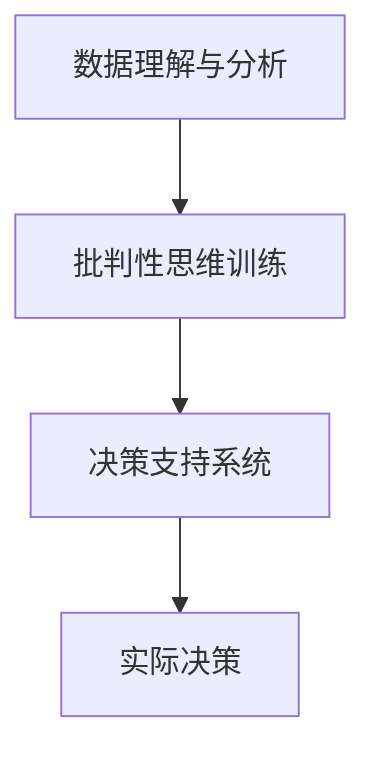
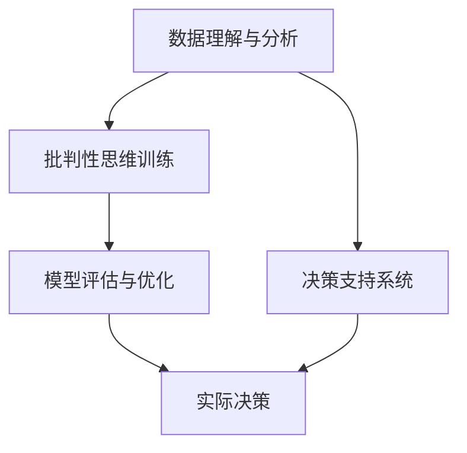

                 

# 理解洞察力的训练：提升批判性思维能力

> 关键词：批判性思维, 洞察力训练, 深度学习, 数据分析, 模型评估, 知识图谱, 决策支持, 实验分析

## 1. 背景介绍

### 1.1 问题由来
随着信息技术的高速发展，决策者们面临着前所未有的数据量增长和复杂度提升。传统的基于规则和经验的决策方式，已经难以应对日益复杂的决策环境。因此，提升决策者的批判性思维能力，训练他们快速获取、分析和运用信息的能力，成为当前决策领域的一个重要课题。

近年来，随着深度学习、数据分析等技术在决策支持领域的应用，基于数据驱动的决策方式逐步兴起。这一趋势下，训练决策者的洞察力、提升其批判性思维能力，成为决策科学研究的重点之一。本文将围绕这一主题，系统性地介绍提升批判性思维能力的方法，并探讨其在数据分析和决策支持中的应用。

### 1.2 问题核心关键点
提升批判性思维能力，主要是通过训练决策者的数据理解和分析能力，使其能够高效地利用数据信息，快速洞察问题本质，做出更合理的决策。这涉及到以下几个核心关键点：
- 数据理解与分析：如何高效获取、处理和理解数据，提取有用的信息。
- 批判性思维训练：通过深度学习等技术，训练决策者的逻辑推理、证据评估和假设验证能力。
- 决策支持系统：如何将提升后的批判性思维能力，应用到实际决策过程中，实现数据驱动的决策。

这些关键点之间的逻辑关系可以通过以下Mermaid流程图来展示：



通过这张流程图，我们可以看到，数据理解与分析是基础，批判性思维训练是核心，决策支持系统是应用。三者相互联系，共同构成提升决策者批判性思维能力的完整框架。

## 2. 核心概念与联系

### 2.1 核心概念概述

为更好地理解提升批判性思维能力的方法，本节将介绍几个密切相关的核心概念：

- **数据理解与分析**：指通过统计学、机器学习等技术，从原始数据中提取有用信息的过程。常见的数据理解方法包括数据清洗、数据可视化、统计分析、特征工程等。

- **批判性思维训练**：指通过深度学习等技术，训练决策者的逻辑推理、证据评估和假设验证能力。批判性思维训练主要包括逻辑推理、证据评估、假设验证等环节。

- **决策支持系统**：指利用数据分析、机器学习等技术，辅助决策者做出更合理的决策的系统。常见的决策支持系统包括知识图谱、推荐系统、自然语言处理等。

- **模型评估与优化**：指通过评估模型的性能，指导模型的优化改进。常见的模型评估指标包括准确率、召回率、F1分数、AUC等。

- **知识图谱**：指将知识结构化的表示，支持自然语言查询和推理。知识图谱在决策支持系统中，用于提供结构化的背景知识，增强决策的逻辑性和可解释性。

这些核心概念之间的逻辑关系可以通过以下Mermaid流程图来展示：



通过这张流程图，我们可以看到，数据理解与分析是基础，批判性思维训练是核心，模型评估与优化是支撑，决策支持系统是应用。四者相互联系，共同构成提升决策者批判性思维能力的完整框架。

## 3. 核心算法原理 & 具体操作步骤
### 3.1 算法原理概述

提升决策者的批判性思维能力，主要通过深度学习和数据分析等技术，训练其逻辑推理、证据评估和假设验证能力。常见的训练方法包括逻辑回归、决策树、支持向量机等传统机器学习方法，以及深度学习中的卷积神经网络(CNN)、循环神经网络(RNN)、变分自编码器(VAE)等。

具体来说，训练过程包括数据预处理、特征提取、模型训练、模型评估等步骤。在训练过程中，我们通过优化算法（如随机梯度下降、Adam等）不断更新模型参数，最小化损失函数，以提高模型的预测准确率。

### 3.2 算法步骤详解

以下是基于深度学习的批判性思维训练的一般步骤：

**Step 1: 数据准备**
- 收集、清洗和标注相关数据，包括原始数据、标签数据等。
- 将数据分为训练集、验证集和测试集，通常采用80-10-10的比例划分。

**Step 2: 模型选择与构建**
- 选择合适的模型架构，如CNN、RNN等。
- 定义损失函数、优化算法、评估指标等关键参数。

**Step 3: 模型训练**
- 将训练数据分批次输入模型，前向传播计算损失函数。
- 反向传播计算参数梯度，根据设定的优化算法和学习率更新模型参数。
- 周期性在验证集上评估模型性能，根据性能指标决定是否触发Early Stopping。
- 重复上述步骤直到满足预设的迭代轮数或Early Stopping条件。

**Step 4: 模型评估与优化**
- 在测试集上评估模型的预测效果，计算准确率、召回率、F1分数等指标。
- 根据评估结果调整模型参数，进一步优化模型性能。
- 可以应用正则化技术、Dropout、L2正则化等避免过拟合。

**Step 5: 模型应用**
- 将训练好的模型应用到实际决策过程中，辅助决策者做出更合理的决策。
- 可以使用知识图谱、推荐系统等工具，增强模型的可解释性和决策的逻辑性。

### 3.3 算法优缺点

基于深度学习的批判性思维训练方法具有以下优点：
1. 自动化程度高：模型训练过程自动化，降低了人工干预的成本。
2. 可解释性强：深度学习模型的决策过程可以被可视化，增强了决策的逻辑性和可解释性。
3. 泛化能力强：深度学习模型通常具有较强的泛化能力，能够应对多变的决策环境。
4. 支持复杂推理：深度学习模型能够处理复杂的逻辑推理和证据评估问题。

同时，该方法也存在一些局限性：
1. 数据需求量大：深度学习模型需要大量的标注数据进行训练，数据获取成本较高。
2. 计算资源消耗大：深度学习模型的计算复杂度较高，需要高性能的计算设备和大量时间。
3. 模型可解释性差：深度学习模型通常被视为“黑盒”，难以解释其内部工作机制和决策逻辑。
4. 训练过程复杂：深度学习模型的训练过程需要调整大量参数，调试复杂。

尽管存在这些局限性，但就目前而言，基于深度学习的批判性思维训练方法仍是大数据决策支持的重要手段。未来相关研究的重点在于如何进一步降低对数据的需求，提高模型的解释性和训练效率，同时兼顾模型性能和计算资源的平衡。

### 3.4 算法应用领域

基于深度学习的批判性思维训练方法，已经在多个决策领域得到了广泛应用，例如：

- 金融风控：训练决策者快速识别潜在的金融风险和欺诈行为，提高风险控制能力。
- 医疗诊断：训练决策者根据病人的症状和历史数据，快速准确地做出诊断决策。
- 法律咨询：训练决策者根据法律条文和案例，快速准确地评估法律风险和权益。
- 制造业生产：训练决策者根据生产数据，快速优化生产流程和产品设计。
- 智能客服：训练决策者根据客户咨询记录，快速准确地提供解决方案。

除了上述这些经典应用外，基于深度学习的批判性思维训练方法也被创新性地应用到更多场景中，如舆情分析、社交网络分析、物流调度等，为决策科学提供了新的工具和方法。

## 4. 数学模型和公式 & 详细讲解 & 举例说明
### 4.1 数学模型构建

本节将使用数学语言对深度学习模型进行更加严格的刻画。

假设输入为 $x$，标签为 $y$，模型为 $f_{\theta}(x)$，其中 $\theta$ 为模型参数。模型在训练集 $D=\{(x_i, y_i)\}_{i=1}^N$ 上的损失函数为：

$$
\mathcal{L}(\theta) = \frac{1}{N} \sum_{i=1}^N \ell(f_{\theta}(x_i), y_i)
$$

其中 $\ell$ 为损失函数，常用的损失函数包括交叉熵损失、均方误差损失等。

在训练过程中，我们通过优化算法最小化损失函数，得到最优参数 $\theta^*$：

$$
\theta^* = \mathop{\arg\min}_{\theta} \mathcal{L}(\theta)
$$

常见的优化算法包括随机梯度下降、Adam、SGD等。在训练过程中，模型通过前向传播计算预测结果 $f_{\theta}(x)$，通过反向传播计算参数梯度，更新模型参数。

### 4.2 公式推导过程

以二分类问题为例，推导交叉熵损失函数的公式及其梯度计算。

假设模型 $f_{\theta}(x)$ 在输入 $x$ 上的输出为 $f_{\theta}(x) \in [0,1]$，表示样本属于正类的概率。真实标签 $y \in \{0,1\}$。则二分类交叉熵损失函数定义为：

$$
\ell(f_{\theta}(x),y) = -[y\log f_{\theta}(x) + (1-y)\log (1-f_{\theta}(x))]
$$

将其代入经验风险公式，得：

$$
\mathcal{L}(\theta) = -\frac{1}{N}\sum_{i=1}^N [y_i\log f_{\theta}(x_i)+(1-y_i)\log(1-f_{\theta}(x_i))]
$$

根据链式法则，损失函数对参数 $\theta_k$ 的梯度为：

$$
\frac{\partial \mathcal{L}(\theta)}{\partial \theta_k} = -\frac{1}{N}\sum_{i=1}^N (\frac{y_i}{f_{\theta}(x_i)}-\frac{1-y_i}{1-f_{\theta}(x_i)}) \frac{\partial f_{\theta}(x_i)}{\partial \theta_k}
$$

其中 $\frac{\partial f_{\theta}(x_i)}{\partial \theta_k}$ 可进一步递归展开，利用自动微分技术完成计算。

在得到损失函数的梯度后，即可带入参数更新公式，完成模型的迭代优化。重复上述过程直至收敛，最终得到适应特定任务的最优模型参数 $\theta^*$。

## 5. 项目实践：代码实例和详细解释说明
### 5.1 开发环境搭建

在进行深度学习模型训练前，我们需要准备好开发环境。以下是使用Python进行TensorFlow开发的环境配置流程：

1. 安装Anaconda：从官网下载并安装Anaconda，用于创建独立的Python环境。

2. 创建并激活虚拟环境：
```bash
conda create -n tf-env python=3.8 
conda activate tf-env
```

3. 安装TensorFlow：根据CUDA版本，从官网获取对应的安装命令。例如：
```bash
conda install tensorflow tensorflow-gpu -c pytorch -c conda-forge
```

4. 安装各类工具包：
```bash
pip install numpy pandas scikit-learn matplotlib tqdm jupyter notebook ipython
```

完成上述步骤后，即可在`tf-env`环境中开始深度学习模型训练的实践。

### 5.2 源代码详细实现

下面我们以二分类任务为例，给出使用TensorFlow进行逻辑回归模型的PyTorch代码实现。

首先，定义逻辑回归模型的结构：

```python
import tensorflow as tf
from tensorflow.keras import layers

def create_model(input_shape, num_classes):
    model = tf.keras.Sequential([
        layers.Dense(64, activation='relu', input_shape=input_shape),
        layers.Dense(num_classes, activation='softmax')
    ])
    return model

# 定义模型参数和损失函数
input_shape = (100,)
num_classes = 2
model = create_model(input_shape, num_classes)

loss_fn = tf.keras.losses.SparseCategoricalCrossentropy(from_logits=True)
optimizer = tf.keras.optimizers.Adam(learning_rate=0.001)
```

然后，定义训练和评估函数：

```python
@tf.function
def train_step(x, y):
    with tf.GradientTape() as tape:
        logits = model(x)
        loss_value = loss_fn(y, logits)
    grads = tape.gradient(loss_value, model.trainable_variables)
    optimizer.apply_gradients(zip(grads, model.trainable_variables))
    return loss_value

@tf.function
def evaluate(model, x, y):
    logits = model(x)
    predictions = tf.argmax(logits, axis=1)
    accuracy = tf.metrics.Accuracy(y, predictions)
    return accuracy.numpy()
```

接着，启动训练流程并在测试集上评估：

```python
epochs = 10
batch_size = 32

for epoch in range(epochs):
    total_loss = 0
    for x, y in train_dataset:
        batch_loss = train_step(x, y)
        total_loss += batch_loss
    print(f'Epoch {epoch+1}, train loss: {total_loss/nb_train_samples:.4f}')
    
    test_accuracy = evaluate(model, test_dataset.x, test_dataset.y)
    print(f'Epoch {epoch+1}, test accuracy: {test_accuracy:.4f}')
```

以上就是使用TensorFlow进行二分类任务逻辑回归模型的完整代码实现。可以看到，得益于TensorFlow的强大封装，我们可以用相对简洁的代码完成逻辑回归模型的训练和评估。

### 5.3 代码解读与分析

让我们再详细解读一下关键代码的实现细节：

**create_model函数**：
- 定义了一个简单的两层神经网络模型，其中第一层使用ReLU激活函数，第二层使用Softmax激活函数。

**train_step函数**：
- 定义了训练函数的实现，首先通过前向传播计算预测结果，然后计算损失函数和梯度，最后通过Adam优化器更新模型参数。

**evaluate函数**：
- 定义了评估函数的实现，首先通过前向传播计算预测结果，然后通过TensorFlow的metrics模块计算准确率。

**训练流程**：
- 定义总的epoch数和batch size，开始循环迭代
- 每个epoch内，先在训练集上训练，输出平均损失
- 在测试集上评估，输出准确率

可以看到，TensorFlow的高级API使得深度学习模型的实现变得简洁高效。开发者可以将更多精力放在模型设计、数据处理等高层逻辑上，而不必过多关注底层的实现细节。

当然，工业级的系统实现还需考虑更多因素，如模型的保存和部署、超参数的自动搜索、更灵活的任务适配层等。但核心的模型训练流程基本与此类似。

## 6. 实际应用场景
### 6.1 智能客服系统

基于深度学习模型的批判性思维训练，可以广泛应用于智能客服系统的构建。传统客服往往需要配备大量人力，高峰期响应缓慢，且一致性和专业性难以保证。而使用训练后的客服模型，可以7x24小时不间断服务，快速响应客户咨询，用自然流畅的语言解答各类常见问题。

在技术实现上，可以收集企业内部的历史客服对话记录，将问题和最佳答复构建成监督数据，在此基础上对预训练客服模型进行微调。微调后的客服模型能够自动理解用户意图，匹配最合适的答案模板进行回复。对于客户提出的新问题，还可以接入检索系统实时搜索相关内容，动态组织生成回答。如此构建的智能客服系统，能大幅提升客户咨询体验和问题解决效率。

### 6.2 金融风控

金融风控领域需要快速识别潜在的金融风险和欺诈行为。传统的基于规则和经验的识别方式，难以应对日益复杂的欺诈手段和金融市场环境。基于深度学习的批判性思维训练，可以训练决策者快速识别潜在风险，提升风险控制能力。

具体而言，可以收集金融领域相关的新闻、交易记录、用户行为等数据，训练模型学习识别欺诈行为的模式。将训练好的模型应用到实时交易监控和用户行为分析中，能够快速识别出异常行为，避免金融损失。

### 6.3 医疗诊断

医疗领域需要快速、准确地进行疾病诊断和患者治疗。传统的基于经验和规则的诊断方式，难以应对复杂的病情和多样化的临床数据。基于深度学习的批判性思维训练，可以训练决策者根据病人的症状和历史数据，快速准确地做出诊断决策。

具体而言，可以收集医疗领域的相关数据，如患者病历、症状记录、检查报告等，训练模型学习诊断疾病的模式。将训练好的模型应用到实际临床决策中，能够快速诊断疾病，辅助医生做出治疗决策。

### 6.4 未来应用展望

随着深度学习和大数据分析技术的不断发展，基于批判性思维训练的方法将在更多领域得到应用，为决策科学带来新的突破。

在智慧城市治理中，基于批判性思维训练的模型可以用于城市事件监测、舆情分析、应急指挥等环节，提高城市管理的自动化和智能化水平，构建更安全、高效的未来城市。

在智慧医疗领域，基于批判性思维训练的模型可以用于疾病诊断、治疗方案推荐等环节，提高医疗服务的智能化水平，辅助医生做出更合理的诊疗决策。

在智慧教育领域，基于批判性思维训练的模型可以用于作业批改、学情分析、知识推荐等环节，因材施教，促进教育公平，提高教学质量。

此外，在智慧交通、智慧农业、智慧环保等众多领域，基于批判性思维训练的人工智能应用也将不断涌现，为决策科学提供新的工具和方法。相信随着技术的日益成熟，基于批判性思维训练的决策方法必将在更广阔的应用领域大放异彩。

## 7. 工具和资源推荐
### 7.1 学习资源推荐

为了帮助开发者系统掌握深度学习模型的训练方法，提高批判性思维能力，这里推荐一些优质的学习资源：

1. 《深度学习》系列书籍：由斯坦福大学李飞飞教授编写，系统讲解了深度学习的基本概念和算法，适合初学者入门。

2. 《TensorFlow官方文档》：TensorFlow的官方文档，详细介绍了TensorFlow的API和使用方法，是学习和使用TensorFlow的重要参考。

3. Kaggle竞赛平台：一个开放的数据科学竞赛平台，提供丰富的数据集和模型训练样例，适合练习和提升数据分析能力。

4. Coursera《深度学习》课程：由深度学习专家Andrew Ng讲授，涵盖深度学习的基本概念和算法，适合进一步学习。

5. 《TensorFlow实战指南》：一本实战指南，详细介绍了TensorFlow的API和使用方法，适合快速上手TensorFlow的实际应用。

通过对这些资源的学习实践，相信你一定能够快速掌握深度学习模型的训练方法，并用于解决实际的决策问题。

### 7.2 开发工具推荐

高效的开发离不开优秀的工具支持。以下是几款用于深度学习模型训练和分析的常用工具：

1. TensorFlow：由Google主导开发的开源深度学习框架，生产部署方便，适合大规模工程应用。

2. PyTorch：基于Python的开源深度学习框架，灵活动态的计算图，适合快速迭代研究。

3. Keras：一个高层次的深度学习API，易于上手，适合快速搭建深度学习模型。

4. Jupyter Notebook：一个开源的交互式笔记本环境，支持Python、R等多种编程语言，方便进行模型训练和实验分析。

5. Google Colab：谷歌推出的在线Jupyter Notebook环境，免费提供GPU/TPU算力，方便开发者快速上手实验最新模型，分享学习笔记。

合理利用这些工具，可以显著提升深度学习模型的开发效率，加快创新迭代的步伐。

### 7.3 相关论文推荐

深度学习模型和批判性思维训练的发展源于学界的持续研究。以下是几篇奠基性的相关论文，推荐阅读：

1. AlexNet: ImageNet Large Scale Visual Recognition Challenge（ImageNet大规模视觉识别挑战赛）：提出了卷积神经网络(CNN)，开启了深度学习在计算机视觉领域的先河。

2. RNNs for Sequence Modeling: Bridging Linguistic and Computational Theories of Sequence Learning（序列建模的递归神经网络：桥接语言学和计算理论中的序列学习理论）：介绍了递归神经网络(RNN)，适合处理序列数据。

3. Batch Normalization: Accelerating Deep Network Training by Reducing Internal Covariate Shift（批量归一化：通过减少内部协变量移位加速深度网络训练）：介绍了批量归一化技术，显著加速了深度神经网络的训练过程。

4. Deep Neural Networks for Large-scale Speech Recognition（大规模语音识别的深度神经网络）：介绍了深度学习在语音识别领域的应用。

5. GoogleNet: Architectural Innovations in Deep Neural Networks for Learning Visual Representations（GoogleNet：用于学习视觉表示的深度神经网络架构创新）：介绍了GoogleNet模型，适用于图像识别和分类任务。

这些论文代表了大模型训练和批判性思维训练的发展脉络。通过学习这些前沿成果，可以帮助研究者把握学科前进方向，激发更多的创新灵感。

## 8. 总结：未来发展趋势与挑战

### 8.1 总结

本文对深度学习模型和批判性思维训练进行了全面系统的介绍。首先阐述了深度学习模型在决策科学中的重要性，明确了模型训练在提升决策者批判性思维能力中的独特价值。其次，从原理到实践，详细讲解了深度学习模型的数学原理和关键步骤，给出了模型训练任务开发的完整代码实例。同时，本文还广泛探讨了深度学习模型在金融风控、医疗诊断、智能客服等多个行业领域的应用前景，展示了深度学习模型训练方法的巨大潜力。

通过本文的系统梳理，可以看到，基于深度学习的批判性思维训练方法正在成为决策科学的重要手段，极大地拓展了决策者的分析能力和决策水平。未来，伴随深度学习和大数据分析技术的不断进步，基于批判性思维训练的决策方法必将在更广阔的应用领域大放异彩，深刻影响人类的生产生活方式。

### 8.2 未来发展趋势

展望未来，深度学习模型的发展趋势将呈现以下几个方向：

1. 模型规模持续增大。随着算力成本的下降和数据规模的扩张，深度学习模型的参数量还将持续增长。超大模型蕴含的丰富知识，有望支撑更加复杂多变的决策环境。

2. 模型泛化能力增强。未来深度学习模型将具备更强的泛化能力，能够应对多变的决策环境，提升决策的准确性和鲁棒性。

3. 模型可解释性增强。未来的深度学习模型将具备更强的可解释性，能够更好地解释其决策过程和逻辑，增强决策的可信度和可接受性。

4. 模型结构更加高效。未来的深度学习模型将具备更高效的计算图结构，降低计算资源消耗，提升推理速度。

5. 多模态融合能力增强。未来的深度学习模型将具备更强的多模态融合能力，能够同时处理视觉、语音、文本等多种数据，提升决策的全面性和准确性。

以上趋势凸显了深度学习模型在决策科学中的广阔前景。这些方向的探索发展，必将进一步提升决策模型的性能和应用范围，为决策科学带来新的突破。

### 8.3 面临的挑战

尽管深度学习模型在决策科学中取得了显著成效，但在迈向更加智能化、普适化应用的过程中，仍面临诸多挑战：

1. 数据需求量大。深度学习模型需要大量的标注数据进行训练，数据获取成本较高。如何降低对数据的需求，提升模型的泛化能力，是未来研究的重要方向。

2. 计算资源消耗大。深度学习模型的计算复杂度较高，需要高性能的计算设备和大量时间。如何优化模型结构，提升计算效率，是未来研究的重点。

3. 模型可解释性差。深度学习模型通常被视为“黑盒”，难以解释其内部工作机制和决策逻辑。如何提升模型的可解释性，增强决策的可信度和可接受性，是未来研究的重要课题。

4. 模型鲁棒性不足。深度学习模型在面对复杂数据时，容易出现过拟合或欠拟合现象，导致决策失误。如何提升模型的鲁棒性，避免灾难性遗忘，是未来研究的重点。

5. 数据隐私和安全问题。深度学习模型在处理敏感数据时，需要严格遵守数据隐私和安全规范，确保数据安全。如何设计安全、隐私保护的模型训练流程，是未来研究的重要方向。

正视这些挑战，积极应对并寻求突破，将是大数据决策科学迈向成熟的必由之路。相信随着学界和产业界的共同努力，这些挑战终将一一被克服，深度学习模型必将在构建安全、可靠、可解释、可控的决策系统铺平道路。

### 8.4 研究展望

未来的深度学习模型研究需要在以下几个方面寻求新的突破：

1. 探索无监督和半监督训练方法。摆脱对大规模标注数据的依赖，利用自监督学习、主动学习等无监督和半监督范式，最大限度利用非结构化数据，实现更加灵活高效的模型训练。

2. 研究参数高效和计算高效的训练方法。开发更加参数高效的模型结构，在固定大部分预训练参数的同时，只更新极少量的任务相关参数。同时优化模型的计算图结构，减少前向传播和反向传播的资源消耗，实现更加轻量级、实时性的模型部署。

3. 融合因果和对比学习范式。通过引入因果推断和对比学习思想，增强模型建立稳定因果关系的能力，学习更加普适、鲁棒的语言表征，从而提升模型的泛化性和抗干扰能力。

4. 引入更多先验知识。将符号化的先验知识，如知识图谱、逻辑规则等，与神经网络模型进行巧妙融合，引导模型学习更准确、合理的语言表征。同时加强不同模态数据的整合，实现视觉、语音等多模态信息与文本信息的协同建模。

5. 结合因果分析和博弈论工具。将因果分析方法引入模型训练，识别出模型决策的关键特征，增强输出解释的因果性和逻辑性。借助博弈论工具刻画人机交互过程，主动探索并规避模型的脆弱点，提高系统稳定性。

这些研究方向的探索，必将引领深度学习模型迈向更高的台阶，为决策科学带来新的突破。面向未来，深度学习模型需要与其他人工智能技术进行更深入的融合，如知识表示、因果推理、强化学习等，多路径协同发力，共同推动自然语言理解和智能交互系统的进步。只有勇于创新、敢于突破，才能不断拓展语言模型的边界，让智能技术更好地造福人类社会。

## 9. 附录：常见问题与解答

**Q1：深度学习模型是否适用于所有决策任务？**

A: 深度学习模型在大多数决策任务上都能取得不错的效果，特别是对于数据量较大的任务。但对于一些特定领域的任务，如医学、法律等，仅仅依靠通用数据进行模型训练，可能难以很好地适应。此时需要在特定领域数据上进一步预训练，再进行微调，才能获得理想效果。此外，对于一些需要时效性、个性化很强的任务，如对话、推荐等，模型也需要针对性的改进优化。

**Q2：模型训练过程中如何避免过拟合？**

A: 过拟合是深度学习模型训练过程中面临的主要挑战，尤其是在训练数据不足的情况下。常见的缓解策略包括：
1. 数据增强：通过数据增强、回译、近义替换等方式扩充训练集
2. 正则化：使用L2正则、Dropout、Early Stopping等避免过拟合
3. 对抗训练：引入对抗样本，提高模型鲁棒性
4. 参数高效训练：只调整少量参数，减小过拟合风险
5. 多模型集成：训练多个模型，取平均输出，抑制过拟合

这些策略往往需要根据具体任务和数据特点进行灵活组合。只有在数据、模型、训练、推理等各环节进行全面优化，才能最大限度地发挥深度学习模型的性能。

**Q3：模型训练过程中如何提高模型的泛化能力？**

A: 提高模型的泛化能力是深度学习模型训练的重要目标之一。常见的方法包括：
1. 数据扩充：通过数据增强、扩充训练集等方式，提高模型对数据变化的适应能力。
2. 正则化：使用L2正则、Dropout等避免过拟合，提高模型泛化能力。
3. 模型结构优化：通过模型剪枝、层合并等方式，简化模型结构，提升泛化能力。
4. 迁移学习：通过在预训练数据上进行微调，提高模型对特定任务的适应能力。
5. 模型融合：通过多模型融合，综合多个模型的优势，提升模型的泛化能力。

这些方法可以结合使用，根据具体任务和数据特点进行调整，以提升模型的泛化能力。

**Q4：如何设计有效的深度学习模型？**

A: 设计有效的深度学习模型需要考虑以下几个关键点：
1. 数据理解与预处理：进行数据清洗、特征提取、数据增强等操作，提高模型的数据理解能力。
2. 模型结构设计：选择合适的模型架构，如CNN、RNN、Transformer等，根据任务需求进行优化。
3. 超参数调优：选择合适的超参数，如学习率、批大小、迭代轮数等，进行优化调整。
4. 模型评估与调优：通过评估模型性能，指导模型的优化改进，避免过拟合和欠拟合。
5. 模型应用与部署：将训练好的模型应用到实际决策过程中，进行持续优化和调整。

这些步骤相互联系，共同构成深度学习模型设计的完整流程。只有在数据理解、模型设计、超参数调优等各个环节进行全面优化，才能设计出有效的深度学习模型。

---

作者：禅与计算机程序设计艺术 / Zen and the Art of Computer Programming

